# API网关的作用和设计要点？

## 概要回答

API网关是微服务架构中的重要组件，作为系统的统一入口，为客户端提供统一的API访问接口。其主要作用包括：

### 核心作用
1. **统一入口**：为所有微服务提供统一的访问入口
2. **请求路由**：根据请求路径将请求转发到相应的后端服务
3. **身份认证**：集中处理用户身份验证和授权
4. **限流控制**：防止系统被过多请求压垮
5. **协议转换**：支持多种客户端协议访问
6. **日志监控**：集中收集请求日志和性能指标

### 设计要点
1. **高可用性**：API网关本身必须具备高可用性
2. **性能优化**：高效的请求处理和转发能力
3. **安全防护**：完善的安全机制和防护措施
4. **可扩展性**：支持动态添加和移除后端服务
5. **监控告警**：完善的监控和告警机制
6. **配置管理**：灵活的路由和策略配置

## 深度解析

### API网关的核心功能

#### 1. 请求路由和负载均衡
API网关需要根据请求的URL路径、HTTP方法等信息，将请求路由到正确的后端服务。同时还需要实现负载均衡，将请求分发到多个服务实例上。

#### 2. 身份认证和授权
API网关作为系统的统一入口，负责处理所有请求的身份验证，包括JWT Token验证、OAuth2、API密钥验证等。同时还要进行权限控制，确保用户只能访问其有权限的资源。

#### 3. 限流和熔断
为了保护后端服务不被过多请求压垮，API网关需要实现限流功能。同时，当后端服务出现故障时，API网关还需要实现熔断机制，避免故障扩散。

#### 4. 协议转换和数据格式转换
API网关可以支持多种客户端协议（如HTTP/HTTPS、WebSocket等）访问，并在必要时进行数据格式转换（如JSON到XML）。

#### 5. 请求/响应处理
API网关可以对请求和响应进行统一处理，如添加公共头部、压缩响应数据、缓存响应等。

#### 6. 安全防护
API网关需要提供完善的安全防护功能，包括防止SQL注入、XSS攻击、CSRF攻击等。

### API网关的架构模式

#### 1. 集中式网关
所有请求都通过一个统一的API网关处理，架构简单，但可能存在单点故障和性能瓶颈。

#### 2. 分布式网关
根据业务领域或服务分组设置多个API网关，可以提高性能和可用性，但架构复杂度增加。

#### 3. 边缘网关
部署在系统边缘，直接面向外部用户，处理SSL终止、DDoS防护等边缘计算任务。

### 设计考虑要点

#### 1. 高可用性设计
- 集群部署，避免单点故障
- 自动故障检测和恢复
- 数据持久化和备份
- 灰度发布和回滚机制

#### 2. 性能优化
- 异步非阻塞IO处理
- 连接池管理
- 缓存机制
- 压缩和编码优化

#### 3. 安全设计
- 多层次安全防护
- 细粒度权限控制
- 安全审计和日志
- 加密传输和存储

#### 4. 可扩展性
- 插件化架构
- 动态配置更新
- 水平扩展能力
- 服务发现集成

#### 5. 监控和运维
- 实时性能监控
- 详细的访问日志
- 告警机制
- 配置管理界面

## 代码示例

以下是API网关的PHP实现示例：

```php
<?php
/**
 * API网关实现示例
 */

// 1. 路由规则类
class RouteRule {
    private $path;
    private $methods;
    private $targetService;
    private $targetPath;
    private $middlewares;
    
    public function __construct($path, $methods, $targetService, $targetPath = null, $middlewares = []) {
        $this->path = $path;
        $this->methods = is_array($methods) ? $methods : [$methods];
        $this->targetService = $targetService;
        $this->targetPath = $targetPath ?: $path;
        $this->middlewares = $middlewares;
    }
    
    public function getPath() {
        return $this->path;
    }
    
    public function getMethods() {
        return $this->methods;
    }
    
    public function getTargetService() {
        return $this->targetService;
    }
    
    public function getTargetPath() {
        return $this->targetPath;
    }
    
    public function getMiddlewares() {
        return $this->middlewares;
    }
    
    public function matches($path, $method) {
        // 简单的路径匹配，实际应用中可能需要更复杂的路由匹配
        if (!in_array(strtoupper($method), array_map('strtoupper', $this->methods))) {
            return false;
        }
        
        // 支持通配符匹配
        $pattern = preg_quote($this->path, '/');
        $pattern = str_replace('\*', '.*', $pattern);
        return preg_match('/^' . $pattern . '$/', $path);
    }
}

// 2. 服务实例类
class ServiceInstance {
    private $id;
    private $name;
    private $host;
    private $port;
    private $protocol;
    private $status;
    private $weight;
    private $tags;
    
    public function __construct($id, $name, $host, $port, $protocol = 'http', $weight = 1, $tags = []) {
        $this->id = $id;
        $this->name = $name;
        $this->host = $host;
        $this->port = $port;
        $this->protocol = $protocol;
        $this->status = 'UP';
        $this->weight = $weight;
        $this->tags = $tags;
    }
    
    public function getId() {
        return $this->id;
    }
    
    public function getName() {
        return $this->name;
    }
    
    public function getHost() {
        return $this->host;
    }
    
    public function getPort() {
        return $this->port;
    }
    
    public function getProtocol() {
        return $this->protocol;
    }
    
    public function getStatus() {
        return $this->status;
    }
    
    public function getWeight() {
        return $this->weight;
    }
    
    public function getTags() {
        return $this->tags;
    }
    
    public function getBaseUrl() {
        return $this->protocol . '://' . $this->host . ':' . $this->port;
    }
    
    public function setStatus($status) {
        $this->status = $status;
    }
}

// 3. 负载均衡器接口
interface LoadBalancerInterface {
    public function selectInstance($instances);
}

// 4. 轮询负载均衡器
class RoundRobinLoadBalancer implements LoadBalancerInterface {
    private $currentIndex = 0;
    
    public function selectInstance($instances) {
        // 过滤掉不可用的实例
        $availableInstances = array_filter($instances, function($instance) {
            return $instance->getStatus() === 'UP';
        });
        
        if (empty($availableInstances)) {
            throw new Exception("No available service instances");
        }
        
        $instancesArray = array_values($availableInstances);
        $instance = $instancesArray[$this->currentIndex % count($instancesArray)];
        $this->currentIndex++;
        
        return $instance;
    }
}

// 5. HTTP客户端封装
class HttpClient {
    private $client;
    
    public function __construct() {
        $this->client = new \GuzzleHttp\Client([
            'timeout' => 30,
            'connect_timeout' => 5
        ]);
    }
    
    public function request($method, $url, $options = []) {
        try {
            $response = $this->client->request($method, $url, $options);
            
            return [
                'status_code' => $response->getStatusCode(),
                'headers' => $response->getHeaders(),
                'body' => $response->getBody()->getContents()
            ];
        } catch (\GuzzleHttp\Exception\RequestException $e) {
            if ($e->getResponse()) {
                return [
                    'status_code' => $e->getResponse()->getStatusCode(),
                    'headers' => $e->getResponse()->getHeaders(),
                    'body' => $e->getResponse()->getBody()->getContents(),
                    'error' => $e->getMessage()
                ];
            } else {
                throw new Exception("Request failed: " . $e->getMessage());
            }
        }
    }
}

// 6. 中间件接口
interface MiddlewareInterface {
    public function handle($request, callable $next);
}

// 7. 认证中间件
class AuthMiddleware implements MiddlewareInterface {
    private $authService;
    
    public function __construct($authService) {
        $this->authService = $authService;
    }
    
    public function handle($request, callable $next) {
        $token = $request['headers']['Authorization'] ?? null;
        
        if (!$token) {
            throw new Exception("Authorization header is required", 401);
        }
        
        // 验证token
        $user = $this->authService->validateToken($token);
        if (!$user) {
            throw new Exception("Invalid token", 401);
        }
        
        // 将用户信息添加到请求中
        $request['user'] = $user;
        
        return $next($request);
    }
}

// 8. 限流中间件
class RateLimitMiddleware implements MiddlewareInterface {
    private $rateLimiter;
    private $limit;
    private $window;
    
    public function __construct($rateLimiter, $limit = 100, $window = 60) {
        $this->rateLimiter = $rateLimiter;
        $this->limit = $limit;
        $this->window = $window;
    }
    
    public function handle($request, callable $next) {
        $clientId = $request['client_ip'] ?? 'unknown';
        
        // 检查是否超出限流
        if ($this->rateLimiter->isLimited($clientId, $this->limit, $this->window)) {
            throw new Exception("Rate limit exceeded", 429);
        }
        
        // 记录请求
        $this->rateLimiter->recordRequest($clientId);
        
        return $next($request);
    }
}

// 9. 日志中间件
class LoggingMiddleware implements MiddlewareInterface {
    private $logger;
    
    public function __construct($logger) {
        $this->logger = $logger;
    }
    
    public function handle($request, callable $next) {
        $startTime = microtime(true);
        
        try {
            $response = $next($request);
            
            $duration = (microtime(true) - $startTime) * 1000;
            $this->logger->info("Request processed", [
                'method' => $request['method'],
                'path' => $request['path'],
                'status' => $response['status_code'] ?? 200,
                'duration' => round($duration, 2) . 'ms',
                'client_ip' => $request['client_ip'] ?? 'unknown'
            ]);
            
            return $response;
        } catch (Exception $e) {
            $duration = (microtime(true) - $startTime) * 1000;
            $this->logger->error("Request failed", [
                'method' => $request['method'],
                'path' => $request['path'],
                'error' => $e->getMessage(),
                'duration' => round($duration, 2) . 'ms',
                'client_ip' => $request['client_ip'] ?? 'unknown'
            ]);
            
            throw $e;
        }
    }
}

// 10. 限流器
class RateLimiter {
    private $storage; // 可以是Redis、内存等
    
    public function __construct($storage = null) {
        $this->storage = $storage ?: new InMemoryStorage();
    }
    
    public function isLimited($key, $limit, $window) {
        $current = time();
        $windowStart = $current - $window;
        
        // 清除过期的记录
        $this->storage->removeRange($key, 0, $windowStart);
        
        // 获取当前窗口内的请求数
        $count = $this->storage->count($key);
        
        return $count >= $limit;
    }
    
    public function recordRequest($key) {
        $this->storage->add($key, time());
    }
}

// 11. 内存存储（简化实现）
class InMemoryStorage {
    private $data = [];
    
    public function add($key, $value) {
        if (!isset($this->data[$key])) {
            $this->data[$key] = [];
        }
        $this->data[$key][] = $value;
    }
    
    public function count($key) {
        return isset($this->data[$key]) ? count($this->data[$key]) : 0;
    }
    
    public function removeRange($key, $start, $end) {
        if (!isset($this->data[$key])) {
            return;
        }
        
        $this->data[$key] = array_filter($this->data[$key], function($value) use ($start, $end) {
            return $value < $start || $value > $end;
        });
    }
}

// 12. 认证服务模拟
class AuthService {
    private $validTokens = [
        'Bearer token123' => ['user_id' => 1, 'username' => 'john'],
        'Bearer token456' => ['user_id' => 2, 'username' => 'jane']
    ];
    
    public function validateToken($token) {
        return $this->validTokens[$token] ?? null;
    }
}

// 13. 日志记录器模拟
class Logger {
    public function info($message, $context = []) {
        echo "[INFO] " . $message . " " . json_encode($context) . "\n";
    }
    
    public function error($message, $context = []) {
        echo "[ERROR] " . $message . " " . json_encode($context) . "\n";
    }
}

// 14. API网关核心类
class ApiGateway {
    private $routes = [];
    private $services = [];
    private $loadBalancer;
    private $httpClient;
    private $middlewares = [];
    private $globalMiddlewares = [];
    
    public function __construct() {
        $this->loadBalancer = new RoundRobinLoadBalancer();
        $this->httpClient = new HttpClient();
    }
    
    /**
     * 添加路由规则
     */
    public function addRoute(RouteRule $route) {
        $this->routes[] = $route;
    }
    
    /**
     * 注册服务实例
     */
    public function registerService(ServiceInstance $service) {
        if (!isset($this->services[$service->getName()])) {
            $this->services[$service->getName()] = [];
        }
        $this->services[$service->getName()][] = $service;
    }
    
    /**
     * 添加全局中间件
     */
    public function addGlobalMiddleware(MiddlewareInterface $middleware) {
        $this->globalMiddlewares[] = $middleware;
    }
    
    /**
     * 处理HTTP请求
     */
    public function handleRequest($method, $path, $headers = [], $body = '', $queryParams = []) {
        $request = [
            'method' => $method,
            'path' => $path,
            'headers' => $headers,
            'body' => $body,
            'query_params' => $queryParams,
            'client_ip' => $_SERVER['REMOTE_ADDR'] ?? 'unknown'
        ];
        
        // 构建中间件链
        $handler = function($req) {
            return $this->processRequest($req);
        };
        
        // 应用全局中间件（逆序）
        foreach (array_reverse($this->globalMiddlewares) as $middleware) {
            $next = $handler;
            $handler = function($req) use ($middleware, $next) {
                return $middleware->handle($req, $next);
            };
        }
        
        try {
            return $handler($request);
        } catch (Exception $e) {
            return $this->handleException($e);
        }
    }
    
    /**
     * 处理请求的核心逻辑
     */
    private function processRequest($request) {
        $method = $request['method'];
        $path = $request['path'];
        
        // 查找匹配的路由
        $matchedRoute = $this->findMatchingRoute($path, $method);
        if (!$matchedRoute) {
            throw new Exception("Route not found: {$method} {$path}", 404);
        }
        
        // 获取目标服务实例
        $serviceName = $matchedRoute->getTargetService();
        if (!isset($this->services[$serviceName])) {
            throw new Exception("Service not found: {$serviceName}", 503);
        }
        
        $serviceInstances = $this->services[$serviceName];
        $targetService = $this->loadBalancer->selectInstance($serviceInstances);
        
        // 构建目标URL
        $targetUrl = $targetService->getBaseUrl() . $matchedRoute->getTargetPath();
        
        // 构建请求选项
        $options = [
            'headers' => $request['headers'],
            'body' => $request['body']
        ];
        
        // 如果有查询参数，添加到URL中
        if (!empty($request['query_params'])) {
            $queryString = http_build_query($request['query_params']);
            $targetUrl .= '?' . $queryString;
        }
        
        echo "Forwarding request to: {$targetUrl}\n";
        
        // 发起请求
        $response = $this->httpClient->request($method, $targetUrl, $options);
        
        return $response;
    }
    
    /**
     * 查找匹配的路由
     */
    private function findMatchingRoute($path, $method) {
        foreach ($this->routes as $route) {
            if ($route->matches($path, $method)) {
                return $route;
            }
        }
        return null;
    }
    
    /**
     * 处理异常
     */
    private function handleException(Exception $e) {
        $statusCode = $e->getCode() ?: 500;
        
        // 特殊状态码处理
        switch ($statusCode) {
            case 401:
                $message = 'Unauthorized';
                break;
            case 404:
                $message = 'Not Found';
                break;
            case 429:
                $message = 'Too Many Requests';
                break;
            case 503:
                $message = 'Service Unavailable';
                break;
            default:
                $message = 'Internal Server Error';
                $statusCode = 500;
        }
        
        return [
            'status_code' => $statusCode,
            'headers' => [
                'Content-Type' => ['application/json']
            ],
            'body' => json_encode([
                'error' => $message,
                'message' => $e->getMessage()
            ])
        ];
    }
}

// 15. API网关配置管理器
class GatewayConfigManager {
    private $configFile;
    private $config;
    
    public function __construct($configFile) {
        $this->configFile = $configFile;
        $this->loadConfig();
    }
    
    private function loadConfig() {
        if (file_exists($this->configFile)) {
            $this->config = json_decode(file_get_contents($this->configFile), true);
        } else {
            $this->config = [
                'routes' => [],
                'services' => [],
                'middlewares' => []
            ];
        }
    }
    
    public function getRoutes() {
        return $this->config['routes'] ?? [];
    }
    
    public function getServices() {
        return $this->config['services'] ?? [];
    }
    
    public function getMiddlewares() {
        return $this->config['middlewares'] ?? [];
    }
    
    public function saveConfig() {
        file_put_contents($this->configFile, json_encode($this->config, JSON_PRETTY_PRINT));
    }
}

// 16. 服务发现模拟器
class ServiceDiscovery {
    private $services = [];
    
    public function registerService($serviceName, $host, $port, $tags = []) {
        if (!isset($this->services[$serviceName])) {
            $this->services[$serviceName] = [];
        }
        
        $serviceId = uniqid($serviceName . '_');
        $this->services[$serviceName][] = new ServiceInstance(
            $serviceId,
            $serviceName,
            $host,
            $port,
            'http',
            1,
            $tags
        );
        
        echo "Service registered: {$serviceName} at {$host}:{$port}\n";
    }
    
    public function getServices($serviceName) {
        return $this->services[$serviceName] ?? [];
    }
    
    public function getAllServices() {
        return $this->services;
    }
}

/**
 * 使用示例
 */

// 创建API网关实例
$gateway = new ApiGateway();

// 创建认证服务和限流器
$authService = new AuthService();
$rateLimiter = new RateLimiter();
$logger = new Logger();

// 添加全局中间件
$gateway->addGlobalMiddleware(new LoggingMiddleware($logger));
$gateway->addGlobalMiddleware(new RateLimitMiddleware($rateLimiter, 10, 60)); // 每分钟最多10个请求
$gateway->addGlobalMiddleware(new AuthMiddleware($authService));

// 注册服务实例
$gateway->registerService(new ServiceInstance('user-service', 'user-service', '192.168.1.10', 8080));
$gateway->registerService(new ServiceInstance('user-service', 'user-service', '192.168.1.11', 8080));
$gateway->registerService(new ServiceInstance('order-service', 'order-service', '192.168.1.20', 8080));
$gateway->registerService(new ServiceInstance('payment-service', 'payment-service', '192.168.1.30', 8080));

// 添加路由规则
$gateway->addRoute(new RouteRule('/api/users/*', ['GET', 'POST'], 'user-service'));
$gateway->addRoute(new RouteRule('/api/orders/*', ['GET', 'POST'], 'order-service'));
$gateway->addRoute(new RouteRule('/api/payments/*', ['POST'], 'payment-service'));

// 模拟处理请求
echo "=== API Gateway Demo ===\n";

// 测试用例
$testCases = [
    [
        'method' => 'GET',
        'path' => '/api/users/123',
        'headers' => ['Authorization' => 'Bearer token123'],
        'description' => 'Get user info with valid token'
    ],
    [
        'method' => 'POST',
        'path' => '/api/orders',
        'headers' => ['Authorization' => 'Bearer token456'],
        'body' => json_encode(['product_id' => 1, 'quantity' => 2]),
        'description' => 'Create order with valid token'
    ],
    [
        'method' => 'GET',
        'path' => '/api/users/123',
        'headers' => ['Authorization' => 'Bearer invalid'],
        'description' => 'Get user info with invalid token'
    ],
    [
        'method' => 'GET',
        'path' => '/api/nonexistent',
        'headers' => ['Authorization' => 'Bearer token123'],
        'description' => 'Access non-existent route'
    ]
];

foreach ($testCases as $testCase) {
    echo "\n--- {$testCase['description']} ---\n";
    
    try {
        $response = $gateway->handleRequest(
            $testCase['method'],
            $testCase['path'],
            $testCase['headers'] ?? [],
            $testCase['body'] ?? '',
            $testCase['query_params'] ?? []
        );
        
        echo "Status: {$response['status_code']}\n";
        echo "Response: {$response['body']}\n";
    } catch (Exception $e) {
        echo "Error: " . $e->getMessage() . " (Code: " . $e->getCode() . ")\n";
    }
}

// 服务发现示例
echo "\n=== Service Discovery Demo ===\n";

$discovery = new ServiceDiscovery();
$discovery->registerService('catalog-service', '192.168.1.40', 8080, ['version' => 'v1']);
$discovery->registerService('catalog-service', '192.168.1.41', 8080, ['version' => 'v1']);
$discovery->registerService('review-service', '192.168.1.50', 8080, ['version' => 'v2']);

$catalogServices = $discovery->getServices('catalog-service');
echo "Found " . count($catalogServices) . " catalog service instances\n";

foreach ($catalogServices as $service) {
    echo "  - {$service->getHost()}:{$service->getPort()}\n";
}

// 配置管理示例
echo "\n=== Configuration Management Demo ===\n";

$configManager = new GatewayConfigManager('gateway_config.json');

// 模拟配置
$sampleConfig = [
    'routes' => [
        [
            'path' => '/api/products/*',
            'methods' => ['GET', 'POST'],
            'target_service' => 'catalog-service'
        ]
    ],
    'services' => [
        'catalog-service' => [
            ['host' => '192.168.1.40', 'port' => 8080],
            ['host' => '192.168.1.41', 'port' => 8080]
        ]
    ]
];

echo "Sample configuration:\n";
echo json_encode($sampleConfig, JSON_PRETTY_PRINT) . "\n";

echo "\nAPI Gateway demo completed.\n";
?>
```

## 图示说明

```mermaid
graph TD
    A[API网关] --> B[核心功能];
    A --> C[架构模式];
    A --> D[设计要点];
    
    B --> B1[请求路由];
    B --> B2[身份认证];
    B --> B3[限流控制];
    B --> B4[协议转换];
    B --> B5[安全防护];
    B --> B6[监控日志];
    
    C --> C1[集中式网关];
    C --> C2[分布式网关];
    C --> C3[边缘网关];
    
    D --> D1[高可用性];
    D --> D2[性能优化];
    D --> D3[安全设计];
    D --> D4[可扩展性];
    D --> D5[监控运维];
    
    B1 --> B11[路径匹配];
    B1 --> B12[负载均衡];
    B1 --> B13[服务发现];
    
    B2 --> B21[Token验证];
    B22[OAuth2];
    B23[API密钥];
    B24[权限控制];
    
    B3 --> B31[速率限制];
    B32[熔断机制];
    B33[配额管理];
    
    B4 --> B41[协议适配];
    B42[数据转换];
    B43[格式编解码];
    
    B5 --> B51[输入验证];
    B52[攻击防护];
    B53[加密传输];
    B54[审计日志];
    
    B6 --> B61[访问日志];
    B62[性能指标];
    B63[错误追踪];
    B64[告警机制];
    
    C1 --> C11[统一入口];
    C12[简单架构];
    C13[单点故障];
    
    C2 --> C21[业务分组];
    C22[性能提升];
    C23[复杂度增加];
    
    C3 --> C31[边缘计算];
    C32[安全防护];
    C33[SSL终止];
    
    D1 --> D11[集群部署];
    D12[故障检测];
    D13[自动恢复];
    D14[灰度发布];
    
    D2 --> D21[异步处理];
    D22[连接池];
    D23[缓存机制];
    D24[压缩优化];
    
    D3 --> D31[多层次防护];
    D32[细粒度控制];
    D33[安全审计];
    D34[加密存储];
    
    D4 --> D41[插件化];
    D42[动态配置];
    D43[水平扩展];
    D44[服务发现];
    
    D5 --> D51[实时监控];
    D52[详细日志];
    D53[告警通知];
    D54[配置界面];
```



通过合理设计和实现API网关，可以为微服务架构提供统一的入口、完善的安全防护和高效的请求处理能力，是构建现代化分布式系统的重要组件。