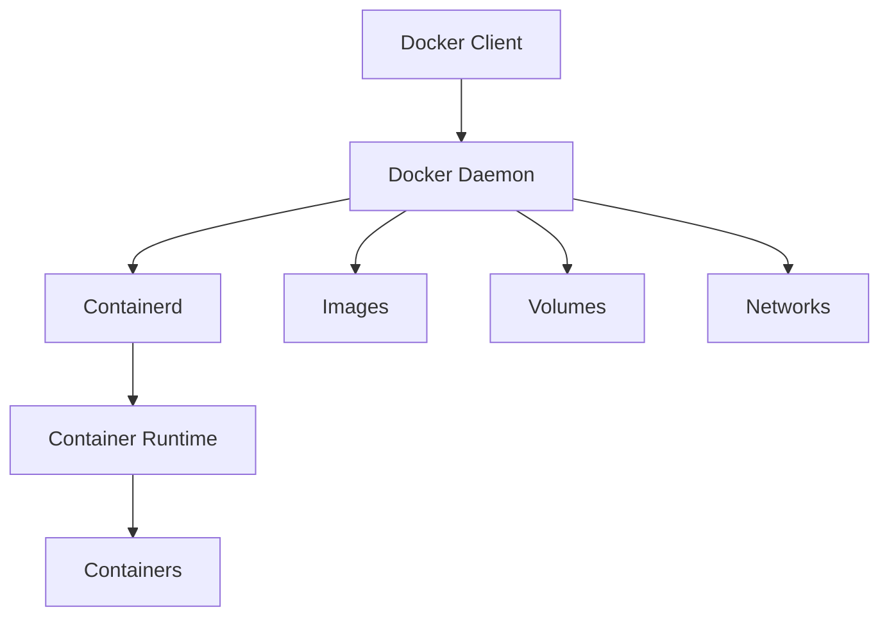
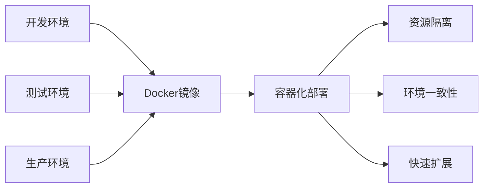

# Docker的原理和在PHP项目中的应用？

## 概要回答

Docker是一种容器化技术，基于Linux内核的cgroup、namespace和UnionFS三大技术实现资源隔离和文件系统。在PHP项目中，Docker可以提供一致的开发、测试和生产环境，简化部署流程，提高应用的可移植性和扩展性。

## 深度解析

### Docker的核心原理

#### 1. Namespace（命名空间）
命名空间实现了系统资源的隔离，包括：
- PID namespace：进程ID隔离
- NET namespace：网络设备和端口隔离
- MNT namespace：文件系统挂载点隔离
- USER namespace：用户和用户组ID隔离

#### 2. Cgroups（控制组）
控制组用于限制、记录和隔离进程组使用的物理资源（CPU、内存、磁盘I/O等）。

#### 3. UnionFS（联合文件系统）
联合文件系统允许多个文件系统（层）透明地叠加在一起，形成一个单独的文件系统。

### Docker架构组成



### PHP项目中的Docker应用

#### 1. 基础Dockerfile示例
```dockerfile
# 使用官方PHP镜像作为基础镜像
FROM php:8.1-apache

# 安装PHP扩展
RUN docker-php-ext-install pdo pdo_mysql mysqli

# 安装Composer
COPY --from=composer:latest /usr/bin/composer /usr/bin/composer

# 设置工作目录
WORKDIR /var/www/html

# 复制应用代码
COPY . .

# 安装依赖
RUN composer install --no-dev --optimize-autoloader

# 设置权限
RUN chown -R www-data:www-data /var/www/html

# 暴露端口
EXPOSE 80

# 启动Apache
CMD ["apache2-foreground"]
```

#### 2. 多容器应用（docker-compose.yml）
```yaml
version: '3.8'

services:
  # PHP应用服务
  app:
    build:
      context: .
      dockerfile: Dockerfile
    container_name: php-app
    ports:
      - "8080:80"
    volumes:
      - .:/var/www/html
    depends_on:
      - db
      - redis
    environment:
      DB_HOST: db
      DB_USER: root
      DB_PASSWORD: password
      REDIS_HOST: redis

  # MySQL数据库服务
  db:
    image: mysql:8.0
    container_name: mysql-db
    environment:
      MYSQL_ROOT_PASSWORD: password
      MYSQL_DATABASE: myapp
    volumes:
      - db_data:/var/lib/mysql
    ports:
      - "3306:3306"

  # Redis缓存服务
  redis:
    image: redis:alpine
    container_name: redis-cache
    ports:
      - "6379:6379"

  # Nginx反向代理
  nginx:
    image: nginx:alpine
    container_name: nginx-proxy
    ports:
      - "80:80"
    volumes:
      - ./nginx.conf:/etc/nginx/nginx.conf
    depends_on:
      - app

volumes:
  db_data:
```

#### 3. 生产环境优化的Dockerfile
```dockerfile
# 多阶段构建
# 构建阶段
FROM composer:latest AS composer

COPY composer.json composer.lock ./
RUN composer install --no-dev --optimize-autoloader

# 运行阶段
FROM php:8.1-fpm-alpine

# 安装PHP扩展
RUN apk add --no-cache \
    && docker-php-ext-install pdo pdo_mysql opcache

# 复制composer依赖
COPY --from=composer /app/vendor/ /var/www/html/vendor/

# 复制应用代码
COPY . /var/www/html

# 设置工作目录
WORKDIR /var/www/html

# 设置权限
RUN chown -R www-data:www-data /var/www/html

# 优化PHP配置
COPY php.ini /usr/local/etc/php/conf.d/app.ini

# 创建非root用户
RUN adduser -D -s /bin/sh www-user
USER www-user

# 暴露端口
EXPOSE 9000

CMD ["php-fpm"]
```

### Docker在PHP项目中的优势

#### 1. 环境一致性
```bash
# 开发环境
docker-compose up -d

# 测试环境
docker-compose -f docker-compose.test.yml up -d

# 生产环境
docker-compose -f docker-compose.prod.yml up -d
```

#### 2. 快速部署和扩展
```bash
# 构建镜像
docker build -t my-php-app .

# 运行容器
docker run -d -p 8080:80 --name my-app my-php-app

# 扩展服务
docker-compose up -d --scale app=3
```

#### 3. 资源隔离和限制
```yaml
# 在docker-compose.yml中限制资源
services:
  app:
    build: .
    mem_limit: 512m
    cpus: 0.5
    restart: unless-stopped
```

### 实际应用场景

#### 1. CI/CD集成
```dockerfile
# 用于CI/CD的测试镜像
FROM php:8.1-cli

# 安装测试工具
RUN apt-get update && apt-get install -y \
    git \
    unzip \
    && docker-php-ext-install pdo pdo_mysql

# 安装Composer
COPY --from=composer:latest /usr/bin/composer /usr/bin/composer

# 设置工作目录
WORKDIR /app

# 复制代码
COPY . .

# 安装依赖
RUN composer install

# 运行测试
CMD ["./vendor/bin/phpunit"]
```

#### 2. 微服务架构
```yaml
version: '3.8'

services:
  user-service:
    build:
      context: ./user-service
    ports:
      - "8001:80"
    environment:
      SERVICE_NAME: user-service
      
  order-service:
    build:
      context: ./order-service
    ports:
      - "8002:80"
    environment:
      SERVICE_NAME: order-service
      
  api-gateway:
    build:
      context: ./api-gateway
    ports:
      - "80:80"
    depends_on:
      - user-service
      - order-service
```

### 最佳实践

#### 1. 安全性考虑
```dockerfile
# 使用非root用户运行
RUN addgroup -g 1000 app && \
    adduser -D -u 1000 -G app app
    
USER app

# 最小化镜像层数
COPY composer.json composer.lock ./
RUN composer install --no-dev && rm -rf /root/.composer
```

#### 2. 性能优化
```dockerfile
# 启用OPcache
COPY php.ini /usr/local/etc/php/conf.d/app.ini

# 使用.dockerignore忽略不必要的文件
# .dockerignore内容：
# .git
# .env
# vendor/
# node_modules/
# tests/
```

## 图示说明



通过Docker容器化，PHP项目可以获得更好的可移植性、一致性和可扩展性，同时简化了开发、测试和部署流程。