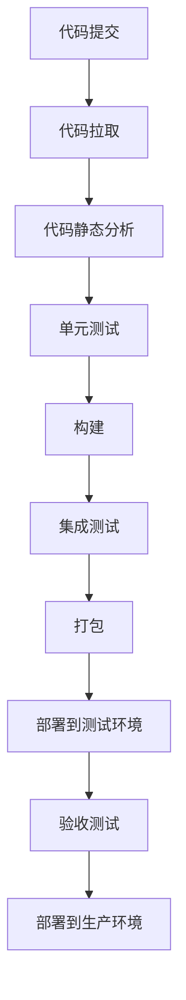

# 如何设计CI/CD流水线？

## 概要回答

CI/CD流水线是持续集成和持续部署的自动化流程，包括代码拉取、构建、测试、打包、部署等阶段。设计时需要考虑环境隔离、安全性、可回滚性、监控告警等因素，通过合理划分阶段和设置质量门禁来确保软件质量和交付效率。

## 深度解析

### CI/CD基本概念

#### 持续集成（CI）
持续集成是指开发人员频繁地将代码变更集成到主分支，并通过自动化构建和测试来验证变更的过程。

#### 持续部署（CD）
持续部署是指在持续集成的基础上，自动将验证通过的代码部署到生产环境的过程。

### CI/CD流水线的核心阶段



### 流水线设计要素

#### 1. 阶段划分
合理的阶段划分能够确保每个步骤都有明确的目标和验证标准：

```php
<?php
/**
 * CI/CD流水线阶段管理类
 */
class PipelineStageManager {
    private $stages = [];
    
    /**
     * 添加阶段
     */
    public function addStage($name, $callback, $required = true) {
        $this->stages[] = [
            'name' => $name,
            'callback' => $callback,
            'required' => $required,
            'status' => 'pending'
        ];
    }
    
    /**
     * 执行流水线
     */
    public function execute() {
        foreach ($this->stages as &$stage) {
            try {
                echo "执行阶段: {$stage['name']}\n";
                $stage['status'] = 'running';
                
                // 执行阶段回调
                $result = call_user_func($stage['callback']);
                
                if ($result === true) {
                    $stage['status'] = 'success';
                    echo "阶段 {$stage['name']} 执行成功\n";
                } else {
                    $stage['status'] = 'failed';
                    echo "阶段 {$stage['name']} 执行失败\n";
                    
                    // 如果是必需阶段，停止执行
                    if ($stage['required']) {
                        throw new Exception("必需阶段 {$stage['name']} 失败，停止流水线");
                    }
                }
            } catch (Exception $e) {
                $stage['status'] = 'error';
                echo "阶段 {$stage['name']} 发生错误: " . $e->getMessage() . "\n";
                
                if ($stage['required']) {
                    throw $e;
                }
            }
        }
    }
    
    /**
     * 获取流水线状态
     */
    public function getStatus() {
        $status = [];
        foreach ($this->stages as $stage) {
            $status[$stage['name']] = $stage['status'];
        }
        return $status;
    }
}

// 使用示例
$pipeline = new PipelineStageManager();

// 定义各个阶段
$pipeline->addStage('代码拉取', function() {
    // 模拟代码拉取操作
    echo "从Git仓库拉取最新代码...\n";
    sleep(1); // 模拟操作时间
    return true; // 返回执行结果
});

$pipeline->addStage('代码静态分析', function() {
    // 模拟代码静态分析
    echo "执行PHPStan代码静态分析...\n";
    sleep(1);
    // 模拟分析结果
    $hasErrors = rand(0, 10) > 8; // 20%概率出现错误
    return !$hasErrors;
});

$pipeline->addStage('单元测试', function() {
    // 模拟单元测试执行
    echo "执行PHPUnit单元测试...\n";
    sleep(2);
    // 模拟测试结果
    $testsPassed = rand(0, 10) > 1; // 80%通过率
    return $testsPassed;
});

$pipeline->addStage('构建', function() {
    // 模拟构建过程
    echo "构建应用...\n";
    sleep(1);
    return true;
});

$pipeline->addStage('打包', function() {
    // 模拟打包过程
    echo "创建Docker镜像...\n";
    sleep(2);
    return true;
});

try {
    $pipeline->execute();
    echo "流水线执行完成，最终状态:\n";
    print_r($pipeline->getStatus());
} catch (Exception $e) {
    echo "流水线执行中断: " . $e->getMessage() . "\n";
    echo "当前状态:\n";
    print_r($pipeline->getStatus());
}
```

#### 2. 环境管理
不同环境需要有不同的配置和访问权限：

```php
<?php
/**
 * 环境配置管理类
 */
class EnvironmentManager {
    private $environments = [
        'development' => [
            'database_host' => 'localhost',
            'database_port' => 3306,
            'debug_mode' => true,
            'log_level' => 'debug'
        ],
        'testing' => [
            'database_host' => 'test-db.example.com',
            'database_port' => 3306,
            'debug_mode' => true,
            'log_level' => 'info'
        ],
        'staging' => [
            'database_host' => 'staging-db.example.com',
            'database_port' => 3306,
            'debug_mode' => false,
            'log_level' => 'warning'
        ],
        'production' => [
            'database_host' => 'prod-db.example.com',
            'database_port' => 3306,
            'debug_mode' => false,
            'log_level' => 'error'
        ]
    ];
    
    private $currentEnvironment;
    
    public function __construct($environment = 'development') {
        $this->setEnvironment($environment);
    }
    
    /**
     * 设置当前环境
     */
    public function setEnvironment($environment) {
        if (!isset($this->environments[$environment])) {
            throw new Exception("未知环境: $environment");
        }
        $this->currentEnvironment = $environment;
    }
    
    /**
     * 获取配置项
     */
    public function getConfig($key, $default = null) {
        if (!isset($this->environments[$this->currentEnvironment][$key])) {
            return $default;
        }
        return $this->environments[$this->currentEnvironment][$key];
    }
    
    /**
     * 获取所有配置
     */
    public function getAllConfig() {
        return $this->environments[$this->currentEnvironment];
    }
    
    /**
     * 获取当前环境名称
     */
    public function getCurrentEnvironment() {
        return $this->currentEnvironment;
    }
    
    /**
     * 验证环境配置
     */
    public function validateEnvironment() {
        $requiredKeys = ['database_host', 'database_port'];
        foreach ($requiredKeys as $key) {
            if ($this->getConfig($key) === null) {
                throw new Exception("环境 {$this->currentEnvironment} 缺少必要配置项: $key");
            }
        }
        return true;
    }
}

// 使用示例
try {
    // 创建开发环境管理器
    $devEnv = new EnvironmentManager('development');
    echo "开发环境配置:\n";
    print_r($devEnv->getAllConfig());
    
    // 切换到生产环境
    $prodEnv = new EnvironmentManager('production');
    echo "生产环境配置:\n";
    print_r($prodEnv->getAllConfig());
    
    // 验证环境配置
    $prodEnv->validateEnvironment();
    echo "生产环境配置验证通过\n";
    
} catch (Exception $e) {
    echo "环境管理错误: " . $e->getMessage() . "\n";
}
```

#### 3. 质量门禁
通过质量门禁确保只有符合标准的代码才能进入下一阶段：

```php
<?php
/**
 * 质量门禁检查类
 */
class QualityGateChecker {
    private $checks = [];
    
    /**
     * 添加检查项
     */
    public function addCheck($name, $checker, $threshold = 0) {
        $this->checks[] = [
            'name' => $name,
            'checker' => $checker,
            'threshold' => $threshold,
            'result' => null
        ];
    }
    
    /**
     * 执行所有检查
     */
    public function runChecks() {
        $passed = true;
        $results = [];
        
        foreach ($this->checks as &$check) {
            try {
                echo "执行检查: {$check['name']}\n";
                $result = call_user_func($check['checker']);
                $check['result'] = $result;
                
                if (is_numeric($result) && $result < $check['threshold']) {
                    echo "检查 {$check['name']} 未通过，结果: $result，阈值: {$check['threshold']}\n";
                    $passed = false;
                } else if ($result === false) {
                    echo "检查 {$check['name']} 未通过\n";
                    $passed = false;
                } else {
                    echo "检查 {$check['name']} 通过，结果: " . (is_bool($result) ? 'OK' : $result) . "\n";
                }
                
                $results[$check['name']] = $result;
            } catch (Exception $e) {
                echo "检查 {$check['name']} 执行出错: " . $e->getMessage() . "\n";
                $passed = false;
                $results[$check['name']] = 'ERROR: ' . $e->getMessage();
            }
        }
        
        return [
            'passed' => $passed,
            'results' => $results
        ];
    }
    
    /**
     * 获取检查报告
     */
    public function getReport() {
        $report = [];
        foreach ($this->checks as $check) {
            $report[] = [
                'name' => $check['name'],
                'result' => $check['result'],
                'threshold' => $check['threshold']
            ];
        }
        return $report;
    }
}

// 使用示例
$gate = new QualityGateChecker();

// 添加代码覆盖率检查
$gate->addCheck('代码覆盖率', function() {
    // 模拟代码覆盖率检查
    return rand(70, 95); // 返回覆盖率百分比
}, 80); // 阈值80%

// 添加代码复杂度检查
$gate->addCheck('代码复杂度', function() {
    // 模拟代码复杂度检查
    return rand(1, 10) <= 8; // 80%概率通过
});

// 添加安全扫描检查
$gate->addCheck('安全漏洞扫描', function() {
    // 模拟安全扫描
    $vulnerabilities = rand(0, 5); // 漏洞数量
    return $vulnerabilities === 0; // 无漏洞时通过
});

// 添加性能测试检查
$gate->addCheck('性能基准测试', function() {
    // 模拟性能测试
    $responseTime = rand(100, 500); // 响应时间毫秒
    return $responseTime; // 返回响应时间
}, 300); // 阈值300ms

// 执行检查
$result = $gate->runChecks();

echo "\n质量门禁检查结果:\n";
echo "总体结果: " . ($result['passed'] ? '通过' : '未通过') . "\n";
echo "详细报告:\n";
foreach ($result['results'] as $name => $value) {
    echo "- $name: " . (is_bool($value) ? ($value ? '通过' : '未通过') : $value) . "\n";
}
```

### 流水线工具集成

#### 1. Jenkins集成示例
```groovy
pipeline {
    agent any
    
    environment {
        PHP_VERSION = '8.1'
        COMPOSER_CACHE_DIR = '/tmp/composer-cache'
    }
    
    stages {
        stage('Checkout') {
            steps {
                git branch: 'main', url: 'https://github.com/example/php-project.git'
            }
        }
        
        stage('Setup') {
            steps {
                sh '''
                    docker run --rm \
                        -v $(pwd):/app \
                        -v ${COMPOSER_CACHE_DIR}:/tmp/cache \
                        composer:latest \
                        composer install --prefer-dist --no-progress
                '''
            }
        }
        
        stage('Code Analysis') {
            steps {
                parallel(
                    phpcs: {
                        sh '''
                            docker run --rm \
                                -v $(pwd):/app \
                                php:${PHP_VERSION}-cli \
                                ./vendor/bin/phpcs --standard=PSR12 src/
                        '''
                    },
                    phpstan: {
                        sh '''
                            docker run --rm \
                                -v $(pwd):/app \
                                php:${PHP_VERSION}-cli \
                                ./vendor/bin/phpstan analyse src/ --level=7
                        '''
                    }
                )
            }
        }
        
        stage('Unit Tests') {
            steps {
                sh '''
                    docker run --rm \
                        -v $(pwd):/app \
                        -e DB_HOST=mysql \
                        --link mysql-container:mysql \
                        php:${PHP_VERSION}-cli \
                        ./vendor/bin/phpunit --coverage-clover coverage.xml
                '''
            }
            post {
                always {
                    publishCoverage adapters: [cloverAdapter(cloverReportPattern: 'coverage.xml')]
                }
            }
        }
        
        stage('Build') {
            steps {
                sh '''
                    docker build -t my-php-app:${BUILD_NUMBER} .
                '''
            }
        }
        
        stage('Deploy to Staging') {
            when {
                branch 'develop'
            }
            steps {
                sh '''
                    docker tag my-php-app:${BUILD_NUMBER} registry.example.com/my-php-app:staging
                    docker push registry.example.com/my-php-app:staging
                    kubectl set image deployment/my-app php-app=registry.example.com/my-php-app:staging
                '''
            }
        }
        
        stage('Deploy to Production') {
            when {
                branch 'main'
            }
            steps {
                timeout(time: 10, unit: 'MINUTES') {
                    input message: 'Deploy to production?', ok: 'Deploy'
                }
                sh '''
                    docker tag my-php-app:${BUILD_NUMBER} registry.example.com/my-php-app:latest
                    docker push registry.example.com/my-php-app:latest
                    kubectl set image deployment/my-app php-app=registry.example.com/my-php-app:latest
                '''
            }
        }
    }
    
    post {
        success {
            slackSend channel: '#ci-cd', message: "Build #${BUILD_NUMBER} succeeded for job ${JOB_NAME}"
        }
        failure {
            slackSend channel: '#ci-cd', message: "Build #${BUILD_NUMBER} failed for job ${JOB_NAME}"
        }
    }
}
```

#### 2. GitLab CI集成示例
```yaml
# .gitlab-ci.yml
stages:
  - build
  - test
  - deploy

variables:
  PHP_IMAGE: php:8.1-cli
  COMPOSER_IMAGE: composer:latest
  DOCKER_DRIVER: overlay2
  DOCKER_TLS_CERTDIR: "/certs"

before_script:
  - docker info

build:
  stage: build
  image: $COMPOSER_IMAGE
  script:
    - composer install --prefer-dist --no-progress
  artifacts:
    paths:
      - vendor/
    expire_in: 1 day

code_quality:
  stage: test
  image: $PHP_IMAGE
  services:
    - name: mysql:8.0
      alias: mysql
  variables:
    MYSQL_ROOT_PASSWORD: rootpass
    MYSQL_DATABASE: test_db
  script:
    - apk add --no-cache git
    - curl -sS https://getcomposer.org/installer | php
    - php composer.phar install
    - ./vendor/bin/phpcs --standard=PSR12 src/
    - ./vendor/bin/phpstan analyse src/ --level=7
  allow_failure: true

unit_tests:
  stage: test
  image: $PHP_IMAGE
  services:
    - name: mysql:8.0
      alias: mysql
  variables:
    MYSQL_ROOT_PASSWORD: rootpass
    MYSQL_DATABASE: test_db
  script:
    - apk add --no-cache git
    - curl -sS https://getcomposer.org/installer | php
    - php composer.phar install
    - ./vendor/bin/phpunit --coverage-text
  coverage: '/^\s*Lines:\s*\d+.\d+\%/

deploy_staging:
  stage: deploy
  image: docker:stable
  services:
    - docker:dind
  before_script:
    - docker login -u $CI_REGISTRY_USER -p $CI_REGISTRY_PASSWORD $CI_REGISTRY
  script:
    - docker build -t $CI_REGISTRY_IMAGE:staging .
    - docker push $CI_REGISTRY_IMAGE:staging
    - docker run --rm \
        -v ~/.kube/config:/root/.kube/config \
        -e KUBECONFIG=/root/.kube/config \
        bitnami/kubectl:latest \
        set image deployment/my-app php-app=$CI_REGISTRY_IMAGE:staging
  environment:
    name: staging
    url: https://staging.example.com
  only:
    - develop

deploy_production:
  stage: deploy
  image: docker:stable
  services:
    - docker:dind
  before_script:
    - docker login -u $CI_REGISTRY_USER -p $CI_REGISTRY_PASSWORD $CI_REGISTRY
  script:
    - docker build -t $CI_REGISTRY_IMAGE:latest .
    - docker push $CI_REGISTRY_IMAGE:latest
    - docker run --rm \
        -v ~/.kube/config:/root/.kube/config \
        -e KUBECONFIG=/root/.kube/config \
        bitnami/kubectl:latest \
        set image deployment/my-app php-app=$CI_REGISTRY_IMAGE:latest
  environment:
    name: production
    url: https://example.com
  when: manual
  only:
    - main
```

### 最佳实践

#### 1. 安全性考虑
```php
<?php
/**
 * CI/CD安全检查类
 */
class SecurityChecker {
    private $secrets = [];
    
    /**
     * 扫描代码中的敏感信息
     */
    public function scanForSecrets($directory) {
        $patterns = [
            'aws_access_key' => '/AKIA[0-9A-Z]{16}/',
            'aws_secret_key' => '/[0-9a-zA-Z/+]{40}/',
            'private_key' => '/-----BEGIN (?:RSA|DSA|EC|OPENSSH) PRIVATE KEY-----/',
            'password' => '/password\s*=\s*[\'"][^\'"]+[\'"]/i',
            'api_key' => '/api[_-]?key\s*=\s*[\'"][^\'"]+[\'"]/i'
        ];
    
        $files = $this->scanDirectory($directory);
        $findings = [];
        
        foreach ($files as $file) {
            $content = file_get_contents($file);
            foreach ($patterns as $name => $pattern) {
                if (preg_match_all($pattern, $content, $matches)) {
                    foreach ($matches[0] as $match) {
                        $findings[] = [
                            'file' => $file,
                            'type' => $name,
                            'match' => $match,
                            'line' => $this->getLineNumber($content, $match)
                        ];
                    }
                }
            }
        }
        
        return $findings;
    }
    
    /**
     * 扫描目录中的文件
     */
    private function scanDirectory($directory) {
        $iterator = new RecursiveIteratorIterator(
            new RecursiveDirectoryIterator($directory)
        );
        
        $files = [];
        foreach ($iterator as $file) {
            if ($file->isFile() && 
                !preg_match('/\.(?:git|log|lock)$/', $file->getFilename())) {
                $files[] = $file->getPathname();
            }
        }
        
        return $files;
    }
    
    /**
     * 获取匹配内容所在的行号
     */
    private function getLineNumber($content, $match) {
        $lines = explode("\n", $content);
        foreach ($lines as $index => $line) {
            if (strpos($line, $match) !== false) {
                return $index + 1;
            }
        }
        return 0;
    }
    
    /**
     * 检查依赖包安全性
     */
    public function checkDependencies() {
        // 这里应该调用实际的安全检查工具，如 SensioLabs Security Checker
        // 示例：exec('security-checker security:check composer.lock', $output, $returnCode);
        
        // 模拟检查结果
        $vulnerablePackages = [];
        if (rand(0, 10) > 7) {
            $vulnerablePackages = [
                ['package' => 'symfony/http-foundation', 'version' => '4.4.0', 'advisory' => 'CVE-2020-15094'],
                ['package' => 'monolog/monolog', 'version' => '2.0.1', 'advisory' => 'CVE-2020-15095']
            ];
        }
        
        return $vulnerablePackages;
    }
}

// 使用示例
$security = new SecurityChecker();

// 扫描代码中的敏感信息
$findings = $security->scanForSecrets('./src');
if (!empty($findings)) {
    echo "发现潜在敏感信息:\n";
    foreach ($findings as $finding) {
        echo "- 文件: {$finding['file']}, 类型: {$finding['type']}, 行号: {$finding['line']}\n";
    }
} else {
    echo "未发现敏感信息\n";
}

// 检查依赖包安全性
$vulnerabilities = $security->checkDependencies();
if (!empty($vulnerabilities)) {
    echo "发现有漏洞的依赖包:\n";
    foreach ($vulnerabilities as $vuln) {
        echo "- {$vuln['package']} ({$vuln['version']}): {$vuln['advisory']}\n";
    }
} else {
    echo "依赖包安全性检查通过\n";
}
```

#### 2. 性能监控
```php
<?php
/**
 * 流水线性能监控类
 */
class PipelinePerformanceMonitor {
    private $startTime;
    private $stageTimings = [];
    
    public function __construct() {
        $this->startTime = microtime(true);
    }
    
    /**
     * 记录阶段开始时间
     */
    public function startStage($stageName) {
        $this->stageTimings[$stageName] = [
            'start' => microtime(true),
            'end' => null,
            'duration' => null
        ];
    }
    
    /**
     * 记录阶段结束时间
     */
    public function endStage($stageName) {
        if (isset($this->stageTimings[$stageName])) {
            $endTime = microtime(true);
            $this->stageTimings[$stageName]['end'] = $endTime;
            $this->stageTimings[$stageName]['duration'] = 
                $endTime - $this->stageTimings[$stageName]['start'];
        }
    }
    
    /**
     * 获取性能报告
     */
    public function getPerformanceReport() {
        $totalDuration = microtime(true) - $this->startTime;
        
        $report = [
            'total_duration' => $totalDuration,
            'stages' => []
        ];
        
        foreach ($this->stageTimings as $stageName => $timing) {
            $report['stages'][] = [
                'name' => $stageName,
                'duration' => $timing['duration'],
                'percentage' => round(($timing['duration'] / $totalDuration) * 100, 2)
            ];
        }
        
        // 按耗时排序
        usort($report['stages'], function($a, $b) {
            return $b['duration'] <=> $a['duration'];
        });
        
        return $report;
    }
    
    /**
     * 输出性能报告
     */
    public function printReport() {
        $report = $this->getPerformanceReport();
        
        echo "=== 流水线性能报告 ===\n";
        echo "总耗时: " . round($report['total_duration'], 2) . " 秒\n";
        echo "各阶段耗时:\n";
        
        foreach ($report['stages'] as $stage) {
            echo sprintf(
                "- %-20s %8.2f 秒 (%5.1f%%)\n",
                $stage['name'] . ':',
                $stage['duration'],
                $stage['percentage']
            );
        }
        
        // 识别瓶颈阶段
        if (!empty($report['stages'])) {
            $slowestStage = $report['stages'][0];
            if ($slowestStage['percentage'] > 30) {
                echo "\n警告: 阶段 '{$slowestStage['name']}' 是性能瓶颈，占总时间的 {$slowestStage['percentage']}%\n";
            }
        }
    }
}

// 使用示例
$monitor = new PipelinePerformanceMonitor();

// 模拟流水线执行
$stages = ['代码拉取', '静态分析', '单元测试', '构建', '打包', '部署'];
foreach ($stages as $stage) {
    $monitor->startStage($stage);
    
    // 模拟阶段执行时间
    $executionTime = rand(1, 5);
    sleep($executionTime);
    
    $monitor->endStage($stage);
}

$monitor->printReport();
```

通过合理设计CI/CD流水线，团队可以实现更快的交付速度、更高的代码质量和更强的部署可靠性。