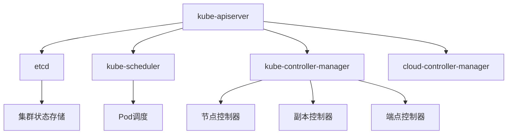
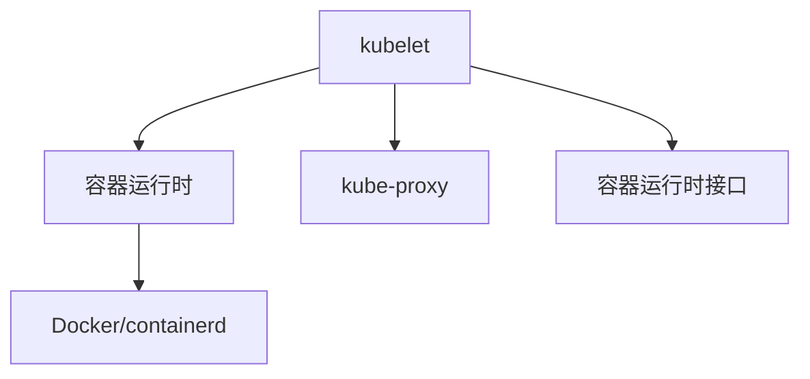

# Kubernetes的基本概念和使用？

## 概要回答

Kubernetes是一个开源的容器编排平台，用于自动化部署、扩展和管理容器化应用。其核心概念包括Pod、Service、Deployment、Volume等。通过Kubernetes可以实现应用的高可用、自动扩缩容、服务发现和负载均衡等功能。

## 深度解析

### Kubernetes架构

#### 控制平面组件


#### 节点组件


### 核心概念详解

#### 1. Pod
Pod是Kubernetes中最小的部署单元，包含一个或多个紧密关联的容器：

```yaml
# 简单的PHP应用Pod配置
apiVersion: v1
kind: Pod
metadata:
  name: php-app-pod
  labels:
    app: php-app
spec:
  containers:
  - name: php-app
    image: my-php-app:latest
    ports:
    - containerPort: 80
    env:
    - name: DB_HOST
      value: "mysql-service"
    - name: DB_USER
      value: "root"
    volumeMounts:
    - name: app-storage
      mountPath: /var/www/html/storage
  volumes:
  - name: app-storage
    emptyDir: {}
```

#### 2. Service
Service为Pod提供稳定的网络访问入口和负载均衡：

```yaml
# PHP应用Service配置
apiVersion: v1
kind: Service
metadata:
  name: php-app-service
spec:
  selector:
    app: php-app
  ports:
    - protocol: TCP
      port: 80
      targetPort: 80
  type: ClusterIP
---
# 对外暴露的LoadBalancer Service
apiVersion: v1
kind: Service
metadata:
  name: php-app-external
spec:
  selector:
    app: php-app
  ports:
    - protocol: TCP
      port: 80
      targetPort: 80
  type: LoadBalancer
```

#### 3. Deployment
Deployment用于管理Pod的部署和更新：

```yaml
# PHP应用Deployment配置
apiVersion: apps/v1
kind: Deployment
metadata:
  name: php-app-deployment
spec:
  replicas: 3
  selector:
    matchLabels:
      app: php-app
  template:
    metadata:
      labels:
        app: php-app
    spec:
      containers:
      - name: php-app
        image: my-php-app:v1.0
        ports:
        - containerPort: 80
        env:
        - name: APP_ENV
          value: "production"
        resources:
          requests:
            memory: "256Mi"
            cpu: "250m"
          limits:
            memory: "512Mi"
            cpu: "500m"
        livenessProbe:
          httpGet:
            path: /health
            port: 80
          initialDelaySeconds: 30
          periodSeconds: 10
        readinessProbe:
          httpGet:
            path: /ready
            port: 80
          initialDelaySeconds: 5
          periodSeconds: 5
```

### PHP应用在Kubernetes中的部署实践

#### 1. 配置管理
使用ConfigMap和Secret管理应用配置：

```yaml
# ConfigMap示例
apiVersion: v1
kind: ConfigMap
metadata:
  name: php-app-config
data:
  app.env: "production"
  log.level: "info"
  cache.driver: "redis"
---
# Secret示例
apiVersion: v1
kind: Secret
metadata:
  name: php-app-secret
type: Opaque
data:
  db.password: cGFzc3dvcmQxMjM=  # base64 encoded "password123"
  api.key: YWJjZGVmZ2hpams=     # base64 encoded "abcdefghijk"
```

在PHP应用中使用这些配置：

```php
<?php
/**
 * Kubernetes配置管理类
 */
class K8sConfigManager {
    private $configMapPath = '/etc/config';
    private $secretPath = '/etc/secret';
    
    /**
     * 获取ConfigMap配置
     */
    public function getConfig($key, $default = null) {
        $configFile = $this->configMapPath . '/' . $key;
        if (file_exists($configFile)) {
            return trim(file_get_contents($configFile));
        }
        return $default;
    }
    
    /**
     * 获取Secret配置
     */
    public function getSecret($key, $default = null) {
        $secretFile = $this->secretPath . '/' . $key;
        if (file_exists($secretFile)) {
            return trim(file_get_contents($secretFile));
        }
        return $default;
    }
    
    /**
     * 获取所有配置
     */
    public function getAllConfig() {
        $config = [];
        
        // 读取ConfigMap
        if (is_dir($this->configMapPath)) {
            $files = scandir($this->configMapPath);
            foreach ($files as $file) {
                if ($file !== '.' && $file !== '..') {
                    $config[$file] = $this->getConfig($file);
                }
            }
        }
        
        return $config;
    }
}

// 使用示例
$configManager = new K8sConfigManager();

// 获取环境配置
$appEnv = $configManager->getConfig('app.env', 'development');
$logLevel = $configManager->getConfig('log.level', 'debug');

// 获取敏感配置
$dbPassword = $configManager->getSecret('db.password');
$apiKey = $configManager->getSecret('api.key');

echo "应用环境: $appEnv\n";
echo "日志级别: $logLevel\n";
// 注意：不要在生产环境中打印敏感信息
// echo "数据库密码: $dbPassword\n";
```

#### 2. 存储管理
使用PersistentVolume和PersistentVolumeClaim管理持久化存储：

```yaml
# PersistentVolume示例
apiVersion: v1
kind: PersistentVolume
metadata:
  name: php-app-pv
spec:
  capacity:
    storage: 10Gi
  accessModes:
    - ReadWriteOnce
  persistentVolumeReclaimPolicy: Retain
  storageClassName: manual
  hostPath:
    path: /mnt/data/php-app
---
# PersistentVolumeClaim示例
apiVersion: v1
kind: PersistentVolumeClaim
metadata:
  name: php-app-pvc
spec:
  accessModes:
    - ReadWriteOnce
  resources:
    requests:
      storage: 10Gi
  storageClassName: manual
```

在Deployment中使用PVC：

```yaml
apiVersion: apps/v1
kind: Deployment
metadata:
  name: php-app-deployment
spec:
  replicas: 3
  selector:
    matchLabels:
      app: php-app
  template:
    metadata:
      labels:
        app: php-app
    spec:
      containers:
      - name: php-app
        image: my-php-app:latest
        volumeMounts:
        - name: app-storage
          mountPath: /var/www/html/storage
      volumes:
      - name: app-storage
        persistentVolumeClaim:
          claimName: php-app-pvc
```

#### 3. 健康检查和自动恢复
配置存活探针和就绪探针：

```php
<?php
/**
 * Kubernetes健康检查端点
 */
class HealthCheckController {
    private $db;
    
    public function __construct($databaseConnection = null) {
        $this->db = $databaseConnection;
    }
    
    /**
     * 存活探针端点
     */
    public function livenessProbe() {
        // 检查应用是否正常运行
        $response = [
            'status' => 'healthy',
            'timestamp' => date('c'),
            'service' => 'php-app'
        ];
        
        header('Content-Type: application/json');
        http_response_code(200);
        echo json_encode($response);
    }
    
    /**
     * 就绪探针端点
     */
    public function readinessProbe() {
        // 检查应用是否准备好接收流量
        $checks = [
            'database' => $this->checkDatabase(),
            'cache' => $this->checkCache(),
            'filesystem' => $this->checkFilesystem()
        ];
        
        $healthy = true;
        foreach ($checks as $check) {
            if (!$check) {
                $healthy = false;
                break;
            }
        }
        
        $response = [
            'status' => $healthy ? 'ready' : 'not_ready',
            'checks' => $checks,
            'timestamp' => date('c')
        ];
        
        header('Content-Type: application/json');
        http_response_code($healthy ? 200 : 503);
        echo json_encode($response);
    }
    
    /**
     * 数据库连接检查
     */
    private function checkDatabase() {
        try {
            // 这里应该是实际的数据库连接检查逻辑
            // 例如：执行一个简单的SELECT查询
            if ($this->db) {
                // 模拟数据库检查
                return true;
            }
            return false;
        } catch (Exception $e) {
            return false;
        }
    }
    
    /**
     * 缓存服务检查
     */
    private function checkCache() {
        try {
            // 这里应该是实际的缓存服务检查逻辑
            // 例如：连接Redis并执行PING命令
            $redis = new Redis();
            $redis->connect('redis-service', 6379);
            return $redis->ping() === '+PONG';
        } catch (Exception $e) {
            return false;
        }
    }
    
    /**
     * 文件系统检查
     */
    private function checkFilesystem() {
        $storagePath = '/var/www/html/storage';
        return is_writable($storagePath);
    }
}

// 路由处理
$path = $_SERVER['REQUEST_URI'];

$healthCheck = new HealthCheckController();

switch ($path) {
    case '/health':
        $healthCheck->livenessProbe();
        break;
    case '/ready':
        $healthCheck->readinessProbe();
        break;
    default:
        http_response_code(404);
        echo "Not Found";
}
```

### 自动扩缩容

#### 1. Horizontal Pod Autoscaler (HPA)
基于CPU使用率自动扩缩容：

```yaml
# HPA配置示例
apiVersion: autoscaling/v2
kind: HorizontalPodAutoscaler
metadata:
  name: php-app-hpa
spec:
  scaleTargetRef:
    apiVersion: apps/v1
    kind: Deployment
    name: php-app-deployment
  minReplicas: 2
  maxReplicas: 10
  metrics:
  - type: Resource
    resource:
      name: cpu
      target:
        type: Utilization
        averageUtilization: 70
  - type: Resource
    resource:
      name: memory
      target:
        type: Utilization
        averageUtilization: 80
```

#### 2. 自定义指标扩缩容
基于自定义指标（如请求速率）进行扩缩容：

```php
<?php
/**
 * 自定义指标监控类
 */
class CustomMetricsCollector {
    private $redis;
    
    public function __construct() {
        $this->redis = new Redis();
        $this->redis->connect('redis-service', 6379);
    }
    
    /**
     * 记录请求
     */
    public function recordRequest() {
        $key = 'requests_per_minute:' . date('Hi');
        $this->redis->incr($key);
        $this->redis->expire($key, 120); // 2分钟过期
    }
    
    /**
     * 获取请求速率
     */
    public function getRequestRate() {
        $now = date('Hi');
        $prev = date('Hi', strtotime('-1 minute'));
        
        $current = $this->redis->get('requests_per_minute:' . $now) ?: 0;
        $previous = $this->redis->get('requests_per_minute:' . $prev) ?: 0;
        
        return ($current + $previous) / 2; // 平均请求速率
    }
    
    /**
     * 暴露指标给Prometheus
     */
    public function exposeMetrics() {
        $requestRate = $this->getRequestRate();
        
        header('Content-Type: text/plain');
        echo "# HELP php_app_requests_per_minute 请求速率\n";
        echo "# TYPE php_app_requests_per_minute gauge\n";
        echo "php_app_requests_per_minute $requestRate\n";
    }
}

// 在应用入口处记录请求
$metrics = new CustomMetricsCollector();
$metrics->recordRequest();

// 指标端点
if ($_SERVER['REQUEST_URI'] === '/metrics') {
    $metrics->exposeMetrics();
}
```

对应的HPA配置：

```yaml
# 基于自定义指标的HPA
apiVersion: autoscaling/v2
kind: HorizontalPodAutoscaler
metadata:
  name: php-app-custom-hpa
spec:
  scaleTargetRef:
    apiVersion: apps/v1
    kind: Deployment
    name: php-app-deployment
  minReplicas: 2
  maxReplicas: 20
  metrics:
  - type: Pods
    pods:
      metric:
        name: php_app_requests_per_minute
      target:
        type: AverageValue
        averageValue: "100"  # 每个Pod平均处理100个请求/分钟
```

### 服务发现和负载均衡

#### 1. 内部服务发现
通过DNS进行服务发现：

```php
<?php
/**
 * Kubernetes服务发现类
 */
class ServiceDiscovery {
    private $namespace;
    
    public function __construct($namespace = 'default') {
        $this->namespace = $namespace;
    }
    
    /**
     * 获取服务地址
     */
    public function getServiceAddress($serviceName, $port = null) {
        // Kubernetes DNS格式: <service-name>.<namespace>.svc.cluster.local
        $dnsName = "$serviceName.{$this->namespace}.svc.cluster.local";
        
        if ($port) {
            return "http://$dnsName:$port";
        }
        
        return "http://$dnsName";
    }
    
    /**
     * 调用外部服务
     */
    public function callService($serviceName, $endpoint, $method = 'GET', $data = null) {
        $serviceUrl = $this->getServiceAddress($serviceName, 80);
        $url = $serviceUrl . $endpoint;
        
        $ch = curl_init();
        curl_setopt($ch, CURLOPT_URL, $url);
        curl_setopt($ch, CURLOPT_RETURNTRANSFER, true);
        curl_setopt($ch, CURLOPT_CUSTOMREQUEST, $method);
        
        if ($data && ($method === 'POST' || $method === 'PUT')) {
            curl_setopt($ch, CURLOPT_POSTFIELDS, json_encode($data));
            curl_setopt($ch, CURLOPT_HTTPHEADER, [
                'Content-Type: application/json',
                'Content-Length: ' . strlen(json_encode($data))
            ]);
        }
        
        $response = curl_exec($ch);
        $httpCode = curl_getinfo($ch, CURLINFO_HTTP_CODE);
        curl_close($ch);
        
        return [
            'status_code' => $httpCode,
            'response' => $response
        ];
    }
}

// 使用示例
$discovery = new ServiceDiscovery('default');

// 调用用户服务
$userServiceResponse = $discovery->callService('user-service', '/api/users/123');

// 调用订单服务
$orderData = ['user_id' => 123, 'product_id' => 456, 'quantity' => 2];
$orderServiceResponse = $discovery->callService('order-service', '/api/orders', 'POST', $orderData);
```

#### 2. Ingress控制器
管理外部访问：

```yaml
# Ingress配置示例
apiVersion: networking.k8s.io/v1
kind: Ingress
metadata:
  name: php-app-ingress
  annotations:
    nginx.ingress.kubernetes.io/rewrite-target: /
spec:
  rules:
  - host: php-app.example.com
    http:
      paths:
      - path: /
        pathType: Prefix
        backend:
          service:
            name: php-app-service
            port:
              number: 80
  - host: api.php-app.example.com
    http:
      paths:
      - path: /api
        pathType: Prefix
        backend:
          service:
            name: php-app-service
            port:
              number: 80
---
# 启用TLS的Ingress
apiVersion: networking.k8s.io/v1
kind: Ingress
metadata:
  name: php-app-ingress-tls
  annotations:
    cert-manager.io/cluster-issuer: "letsencrypt-prod"
spec:
  tls:
  - hosts:
    - php-app.example.com
    secretName: php-app-tls
  rules:
  - host: php-app.example.com
    http:
      paths:
      - path: /
        pathType: Prefix
        backend:
          service:
            name: php-app-service
            port:
              number: 80
```

### 最佳实践

#### 1. 资源管理
合理配置资源请求和限制：

```yaml
apiVersion: apps/v1
kind: Deployment
metadata:
  name: php-app-deployment
spec:
  replicas: 3
  selector:
    matchLabels:
      app: php-app
  template:
    metadata:
      labels:
        app: php-app
    spec:
      containers:
      - name: php-app
        image: my-php-app:latest
        resources:
          requests:
            memory: "256Mi"
            cpu: "250m"
          limits:
            memory: "512Mi"
            cpu: "500m"
        env:
        - name: OPcache.enable
          value: "1"
        - name: OPcache.memory_consumption
          value: "128"
```

#### 2. 安全配置
使用SecurityContext增强安全性：

```yaml
apiVersion: apps/v1
kind: Deployment
metadata:
  name: php-app-deployment
spec:
  replicas: 3
  selector:
    matchLabels:
      app: php-app
  template:
    metadata:
      labels:
        app: php-app
    spec:
      securityContext:
        runAsNonRoot: true
        runAsUser: 1000
        fsGroup: 2000
      containers:
      - name: php-app
        image: my-php-app:latest
        securityContext:
          allowPrivilegeEscalation: false
          readOnlyRootFilesystem: true
        volumeMounts:
        - name: tmp-volume
          mountPath: /tmp
        - name: logs-volume
          mountPath: /var/log
      volumes:
      - name: tmp-volume
        emptyDir: {}
      - name: logs-volume
        emptyDir: {}
```

通过合理使用Kubernetes的各项功能，PHP应用可以获得高可用性、弹性扩缩容和简化的运维管理。