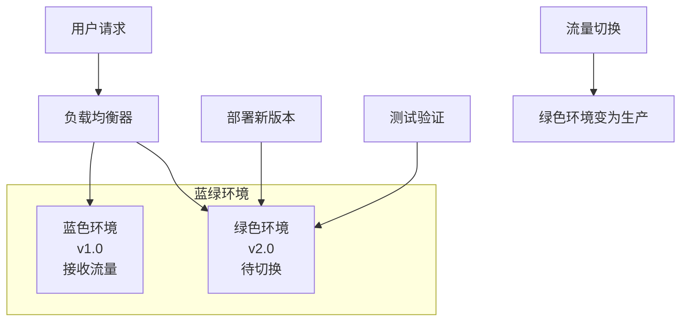
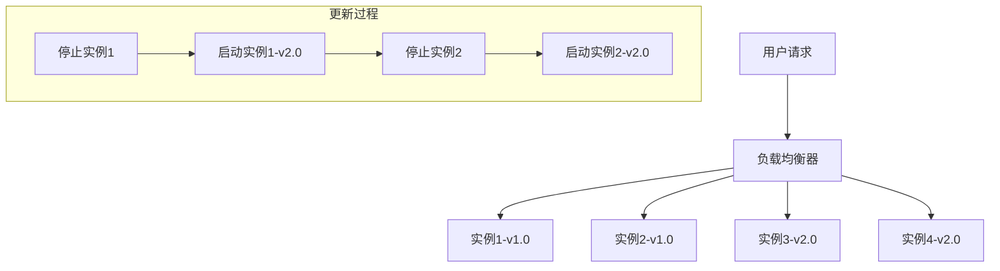
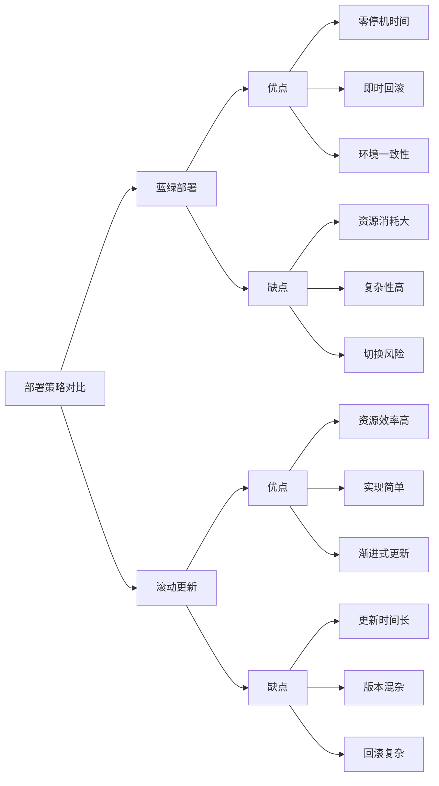

# 蓝绿部署和滚动更新的区别？

## 概要回答

蓝绿部署和滚动更新是两种不同的应用部署策略。蓝绿部署通过维护两套相同的生产环境实现零停机部署，而滚动更新则是逐步替换现有应用实例。蓝绿部署安全性更高但资源消耗大，滚动更新资源效率高但存在短暂服务不稳定风险。

## 深度解析

### 蓝绿部署（Blue-Green Deployment）

#### 基本概念
蓝绿部署维护两个完全相同的生产环境：蓝色环境（当前生产环境）和绿色环境（预备环境）。部署时将新版本部署到绿色环境，测试通过后将流量切换到绿色环境。

#### 工作原理


#### PHP应用蓝绿部署实现

```php
<?php
/**
 * 蓝绿部署管理类
 */
class BlueGreenDeployment {
    private $blueEnvironment;
    private $greenEnvironment;
    private $activeEnvironment;
    private $loadBalancer;
    
    public function __construct($blueEnv, $greenEnv, $loadBalancer) {
        $this->blueEnvironment = $blueEnv;
        $this->greenEnvironment = $greenEnv;
        $this->loadBalancer = $loadBalancer;
        
        // 默认激活蓝色环境
        $this->activeEnvironment = 'blue';
    }
    
    /**
     * 部署新版本到非活跃环境
     */
    public function deployToInactiveEnvironment($version) {
        $inactiveEnv = $this->getInactiveEnvironment();
        
        echo "开始部署版本 $version 到 $inactiveEnv 环境...\n";
        
        // 部署新版本
        $deployResult = $this->deployVersion($inactiveEnv, $version);
        
        if (!$deployResult) {
            throw new Exception("部署到 $inactiveEnv 环境失败");
        }
        
        echo "版本 $version 部署到 $inactiveEnv 环境完成\n";
        return $inactiveEnv;
    }
    
    /**
     * 验证非活跃环境
     */
    public function validateInactiveEnvironment() {
        $inactiveEnv = $this->getInactiveEnvironment();
        
        echo "开始验证 $inactiveEnv 环境...\n";
        
        // 执行健康检查
        $healthCheck = $this->performHealthCheck($inactiveEnv);
        if (!$healthCheck) {
            throw new Exception("$inactiveEnv 环境健康检查失败");
        }
        
        // 执行功能测试
        $functionalTest = $this->performFunctionalTest($inactiveEnv);
        if (!$functionalTest) {
            throw new Exception("$inactiveEnv 环境功能测试失败");
        }
        
        echo "$inactiveEnv 环境验证通过\n";
        return true;
    }
    
    /**
     * 切换流量到新环境
     */
    public function switchTraffic() {
        $inactiveEnv = $this->getInactiveEnvironment();
        
        echo "开始将流量从 {$this->activeEnvironment} 切换到 $inactiveEnv...\n";
        
        // 更新负载均衡器配置
        $switchResult = $this->loadBalancer->switchToEnvironment($inactiveEnv);
        
        if (!$switchResult) {
            throw new Exception("流量切换失败");
        }
        
        // 更新活跃环境
        $this->activeEnvironment = $inactiveEnv;
        
        echo "流量已成功切换到 $inactiveEnv 环境\n";
        return true;
    }
    
    /**
     * 回滚到之前环境
     */
    public function rollback() {
        $previousEnv = $this->getInactiveEnvironment();
        
        echo "开始回滚到 $previousEnv 环境...\n";
        
        // 切换流量回原环境
        $rollbackResult = $this->loadBalancer->switchToEnvironment($previousEnv);
        
        if (!$rollbackResult) {
            throw new Exception("回滚失败");
        }
        
        // 更新活跃环境
        $this->activeEnvironment = $previousEnv;
        
        echo "已成功回滚到 $previousEnv 环境\n";
        return true;
    }
    
    /**
     * 获取非活跃环境
     */
    private function getInactiveEnvironment() {
        return $this->activeEnvironment === 'blue' ? 'green' : 'blue';
    }
    
    /**
     * 部署版本
     */
    private function deployVersion($environment, $version) {
        // 这里应该是实际的部署逻辑
        // 例如：拉取新镜像、启动容器、配置环境变量等
        
        // 模拟部署过程
        sleep(2);
        
        // 模拟部署成功率
        return rand(0, 10) > 1; // 90%成功率
    }
    
    /**
     * 执行健康检查
     */
    private function performHealthCheck($environment) {
        // 这里应该是实际的健康检查逻辑
        // 例如：检查服务是否响应、数据库连接是否正常等
        
        // 模拟健康检查
        sleep(1);
        
        // 模拟健康检查成功率
        return rand(0, 10) > 0; // 90%成功率
    }
    
    /**
     * 执行功能测试
     */
    private function performFunctionalTest($environment) {
        // 这里应该是实际的功能测试逻辑
        // 例如：执行关键业务流程测试、API测试等
        
        // 模拟功能测试
        sleep(2);
        
        // 模拟功能测试成功率
        return rand(0, 10) > 1; // 90%成功率
    }
    
    /**
     * 获取当前活跃环境
     */
    public function getActiveEnvironment() {
        return $this->activeEnvironment;
    }
}

/**
 * 负载均衡器模拟类
 */
class LoadBalancer {
    private $blueUrl;
    private $greenUrl;
    private $activeUrl;
    
    public function __construct($blueUrl, $greenUrl) {
        $this->blueUrl = $blueUrl;
        $this->greenUrl = $greenUrl;
        $this->activeUrl = $blueUrl; // 默认指向蓝色环境
    }
    
    /**
     * 切换到指定环境
     */
    public function switchToEnvironment($environment) {
        if ($environment === 'blue') {
            $this->activeUrl = $this->blueUrl;
        } else if ($environment === 'green') {
            $this->activeUrl = $this->greenUrl;
        } else {
            return false;
        }
        
        echo "负载均衡器已切换到 $environment 环境 ($this->activeUrl)\n";
        return true;
    }
    
    /**
     * 获取当前活跃URL
     */
    public function getActiveUrl() {
        return $this->activeUrl;
    }
}

// 使用示例
try {
    // 初始化环境
    $blueEnv = ['url' => 'http://blue-env.example.com', 'version' => 'v1.0'];
    $greenEnv = ['url' => 'http://green-env.example.com', 'version' => 'v1.0'];
    $loadBalancer = new LoadBalancer($blueEnv['url'], $greenEnv['url']);
    
    $deployment = new BlueGreenDeployment($blueEnv, $greenEnv, $loadBalancer);
    
    echo "当前活跃环境: " . $deployment->getActiveEnvironment() . "\n";
    
    // 部署新版本
    $newVersion = 'v2.0';
    $targetEnv = $deployment->deployToInactiveEnvironment($newVersion);
    
    // 验证新环境
    $deployment->validateInactiveEnvironment();
    
    // 切换流量
    $deployment->switchTraffic();
    
    echo "部署完成，当前活跃环境: " . $deployment->getActiveEnvironment() . "\n";
    
} catch (Exception $e) {
    echo "部署过程中发生错误: " . $e->getMessage() . "\n";
    
    // 尝试回滚
    try {
        $deployment->rollback();
        echo "已成功回滚\n";
    } catch (Exception $rollbackException) {
        echo "回滚失败: " . $rollbackException->getMessage() . "\n";
    }
}
```

### 滚动更新（Rolling Update）

#### 基本概念
滚动更新逐步替换应用实例，每次只更新一部分实例，直到所有实例都更新为新版本。这种方式可以节省资源，但在更新过程中可能存在新旧版本共存的情况。

#### 工作原理


#### PHP应用滚动更新实现

```php
<?php
/**
 * 滚动更新管理类
 */
class RollingUpdate {
    private $instances;
    private $batchSize;
    private $healthCheckInterval;
    
    public function __construct($instances, $batchSize = 1, $healthCheckInterval = 30) {
        $this->instances = $instances;
        $this->batchSize = $batchSize;
        $this->healthCheckInterval = $healthCheckInterval;
    }
    
    /**
     * 执行滚动更新
     */
    public function performUpdate($newVersion) {
        echo "开始滚动更新到版本 $newVersion\n";
        echo "总共 " . count($this->instances) . " 个实例，批处理大小: $this->batchSize\n";
        
        $totalInstances = count($this->instances);
        $updatedInstances = 0;
        
        // 分批更新实例
        for ($i = 0; $i < $totalInstances; $i += $this->batchSize) {
            $batchEnd = min($i + $this->batchSize, $totalInstances);
            $batchInstances = array_slice($this->instances, $i, $this->batchSize);
            
            echo "更新批次 " . (($i / $this->batchSize) + 1) . " (" . count($batchInstances) . " 个实例)...\n";
            
            // 更新批次中的实例
            foreach ($batchInstances as $instance) {
                if (!$this->updateInstance($instance, $newVersion)) {
                    throw new Exception("实例 {$instance['id']} 更新失败");
                }
                $updatedInstances++;
                
                echo "实例 {$instance['id']} 更新完成\n";
            }
            
            // 等待健康检查
            echo "等待 {$this->healthCheckInterval} 秒进行健康检查...\n";
            sleep($this->healthCheckInterval);
            
            // 验证批次更新结果
            if (!$this->validateBatch($batchInstances)) {
                throw new Exception("批次更新验证失败");
            }
            
            echo "批次更新验证通过\n";
            echo "已完成更新: $updatedInstances/$totalInstances 个实例\n";
        }
        
        echo "滚动更新完成，所有实例已更新到版本 $newVersion\n";
        return true;
    }
    
    /**
     * 更新单个实例
     */
    private function updateInstance($instance, $newVersion) {
        echo "  正在更新实例 {$instance['id']} (当前版本: {$instance['version']})...\n";
        
        // 停止实例
        if (!$this->stopInstance($instance)) {
            return false;
        }
        
        // 部署新版本
        if (!$this->deployNewVersion($instance, $newVersion)) {
            // 如果部署失败，尝试重启原版本
            $this->deployNewVersion($instance, $instance['version']);
            $this->startInstance($instance);
            return false;
        }
        
        // 启动实例
        if (!$this->startInstance($instance)) {
            return false;
        }
        
        // 更新实例版本信息
        $instance['version'] = $newVersion;
        
        return true;
    }
    
    /**
     * 停止实例
     */
    private function stopInstance($instance) {
        // 这里应该是实际的停止实例逻辑
        // 例如：发送停止信号、优雅关闭等
        
        echo "    停止实例 {$instance['id']}...\n";
        sleep(1);
        
        // 模拟停止成功率
        return rand(0, 10) > 0; // 90%成功率
    }
    
    /**
     * 部署新版本
     */
    private function deployNewVersion($instance, $version) {
        // 这里应该是实际的部署逻辑
        // 例如：拉取新镜像、更新配置文件等
        
        echo "    部署版本 $version 到实例 {$instance['id']}...\n";
        sleep(2);
        
        // 模拟部署成功率
        return rand(0, 10) > 1; // 90%成功率
    }
    
    /**
     * 启动实例
     */
    private function startInstance($instance) {
        // 这里应该是实际的启动实例逻辑
        
        echo "    启动实例 {$instance['id']}...\n";
        sleep(1);
        
        // 模拟启动成功率
        return rand(0, 10) > 0; // 90%成功率
    }
    
    /**
     * 验证批次更新结果
     */
    private function validateBatch($batchInstances) {
        echo "  验证批次更新结果...\n";
        
        foreach ($batchInstances as $instance) {
            // 执行健康检查
            if (!$this->performHealthCheck($instance)) {
                echo "    实例 {$instance['id']} 健康检查失败\n";
                return false;
            }
            
            // 执行功能测试
            if (!$this->performFunctionalTest($instance)) {
                echo "    实例 {$instance['id']} 功能测试失败\n";
                return false;
            }
            
            echo "    实例 {$instance['id']} 验证通过\n";
        }
        
        return true;
    }
    
    /**
     * 执行健康检查
     */
    private function performHealthCheck($instance) {
        // 这里应该是实际的健康检查逻辑
        
        sleep(1);
        
        // 模拟健康检查成功率
        return rand(0, 10) > 0; // 90%成功率
    }
    
    /**
     * 执行功能测试
     */
    private function performFunctionalTest($instance) {
        // 这里应该是实际的功能测试逻辑
        
        sleep(1);
        
        // 模拟功能测试成功率
        return rand(0, 10) > 1; // 90%成功率
    }
}

// 实例信息类
class Instance {
    public $id;
    public $version;
    public $status;
    
    public function __construct($id, $version, $status = 'running') {
        $this->id = $id;
        $this->version = $version;
        $this->status = $status;
    }
}

// 使用示例
try {
    // 初始化实例
    $instances = [
        new Instance('instance-1', 'v1.0'),
        new Instance('instance-2', 'v1.0'),
        new Instance('instance-3', 'v1.0'),
        new Instance('instance-4', 'v1.0'),
        new Instance('instance-5', 'v1.0')
    ];
    
    // 创建滚动更新管理器
    $rollingUpdate = new RollingUpdate($instances, 2, 10); // 批处理大小为2，健康检查间隔10秒
    
    // 执行滚动更新
    $rollingUpdate->performUpdate('v2.0');
    
} catch (Exception $e) {
    echo "滚动更新过程中发生错误: " . $e->getMessage() . "\n";
}
```

### 两种部署策略对比

#### 蓝绿部署 vs 滚动更新



#### 详细对比表

| 特性 | 蓝绿部署 | 滚动更新 |
|------|----------|----------|
| **停机时间** | 零停机 | 短暂影响 |
| **资源消耗** | 双倍资源 | 增量资源 |
| **回滚速度** | 即时 | 逐步 |
| **实现复杂度** | 高 | 中等 |
| **更新时间** | 瞬间完成 | 逐步完成 |
| **版本一致性** | 完全一致 | 可能混杂 |
| **适用场景** | 关键业务 | 一般业务 |

### 实际应用场景

#### 1. 电商网站部署策略选择

```php
<?php
/**
 * 部署策略选择器
 */
class DeploymentStrategySelector {
    private $applicationType;
    private $trafficPattern;
    private $resourceConstraints;
    
    public function __construct($applicationType, $trafficPattern, $resourceConstraints) {
        $this->applicationType = $applicationType;
        $this->trafficPattern = $trafficPattern;
        $this->resourceConstraints = $resourceConstraints;
    }
    
    /**
     * 选择最适合的部署策略
     */
    public function selectStrategy() {
        $factors = [
            'criticality' => $this->getApplicationCriticality(),
            'traffic_sensitivity' => $this->getTrafficSensitivity(),
            'resource_availability' => $this->getResourceAvailability(),
            'update_frequency' => $this->getUpdateFrequency()
        ];
        
        $blueGreenScore = $this->calculateBlueGreenScore($factors);
        $rollingUpdateScore = $this->calculateRollingUpdateScore($factors);
        
        echo "蓝绿部署评分: $blueGreenScore\n";
        echo "滚动更新评分: $rollingUpdateScore\n";
        
        if ($blueGreenScore > $rollingUpdateScore) {
            return [
                'strategy' => 'blue-green',
                'reason' => $this->getBlueGreenRecommendationReason($factors)
            ];
        } else {
            return [
                'strategy' => 'rolling-update',
                'reason' => $this->getRollingUpdateRecommendationReason($factors)
            ];
        }
    }
    
    /**
     * 计算蓝绿部署评分
     */
    private function calculateBlueGreenScore($factors) {
        $score = 0;
        
        // 关键业务加分
        if ($factors['criticality'] >= 8) {
            $score += 30;
        } else if ($factors['criticality'] >= 5) {
            $score += 15;
        }
        
        // 流量敏感性加分
        if ($factors['traffic_sensitivity'] >= 8) {
            $score += 25;
        } else if ($factors['traffic_sensitivity'] >= 5) {
            $score += 10;
        }
        
        // 资源充足加分
        if ($factors['resource_availability'] >= 7) {
            $score += 20;
        }
        
        // 更新频繁减分
        if ($factors['update_frequency'] >= 8) {
            $score -= 15;
        }
        
        return max(0, $score);
    }
    
    /**
     * 计算滚动更新评分
     */
    private function calculateRollingUpdateScore($factors) {
        $score = 0;
        
        // 资源受限加分
        if ($factors['resource_availability'] <= 5) {
            $score += 30;
        } else if ($factors['resource_availability'] <= 7) {
            $score += 15;
        }
        
        // 更新频繁加分
        if ($factors['update_frequency'] >= 8) {
            $score += 25;
        } else if ($factors['update_frequency'] >= 5) {
            $score += 10;
        }
        
        // 非关键业务加分
        if ($factors['criticality'] <= 5) {
            $score += 20;
        }
        
        // 流量不敏感加分
        if ($factors['traffic_sensitivity'] <= 5) {
            $score += 15;
        }
        
        return max(0, $score);
    }
    
    /**
     * 获取应用关键性评分
     */
    private function getApplicationCriticality() {
        $criticalApps = ['payment', 'user-authentication', 'order-processing'];
        return in_array($this->applicationType, $criticalApps) ? 9 : 4;
    }
    
    /**
     * 获取流量敏感性评分
     */
    private function getTrafficSensitivity() {
        $highTrafficPatterns = ['constant', 'peak-hours'];
        return in_array($this->trafficPattern, $highTrafficPatterns) ? 8 : 5;
    }
    
    /**
     * 获取资源可用性评分
     */
    private function getResourceAvailability() {
        return $this->resourceConstraints === 'limited' ? 4 : 8;
    }
    
    /**
     * 获取更新频率评分
     */
    private function getUpdateFrequency() {
        $frequentUpdates = ['development', 'staging'];
        return in_array($this->applicationType, $frequentUpdates) ? 9 : 3;
    }
    
    /**
     * 获取蓝绿部署推荐原因
     */
    private function getBlueGreenRecommendationReason($factors) {
        $reasons = [];
        
        if ($factors['criticality'] >= 8) {
            $reasons[] = '应用属于关键业务系统';
        }
        
        if ($factors['traffic_sensitivity'] >= 8) {
            $reasons[] = '应用对流量中断敏感';
        }
        
        if ($factors['resource_availability'] >= 7) {
            $reasons[] = '有足够的资源支持双环境部署';
        }
        
        return implode('，', $reasons) ?: '默认推荐蓝绿部署';
    }
    
    /**
     * 获取滚动更新推荐原因
     */
    private function getRollingUpdateRecommendationReason($factors) {
        $reasons = [];
        
        if ($factors['resource_availability'] <= 5) {
            $reasons[] = '资源有限，需要节约成本';
        }
        
        if ($factors['update_frequency'] >= 8) {
            $reasons[] = '更新频繁，适合渐进式部署';
        }
        
        if ($factors['criticality'] <= 5) {
            $reasons[] = '应用非关键业务，可以容忍短暂影响';
        }
        
        return implode('，', $reasons) ?: '默认推荐滚动更新';
    }
}

// 使用示例
// 电商支付系统
$paymentSystem = new DeploymentStrategySelector(
    'payment',           // 应用类型
    'peak-hours',        // 流量模式
    'sufficient'         // 资源约束
);

$result = $paymentSystem->selectStrategy();
echo "电商支付系统推荐部署策略: {$result['strategy']}\n";
echo "推荐原因: {$result['reason']}\n\n";

// 内容管理系统
$cmsSystem = new DeploymentStrategySelector(
    'cms',               // 应用类型
    'variable',          // 流量模式
    'limited'            // 资源约束
);

$result = $cmsSystem->selectStrategy();
echo "内容管理系统推荐部署策略: {$result['strategy']}\n";
echo "推荐原因: {$result['reason']}\n";
```

### 最佳实践

#### 1. 蓝绿部署最佳实践

```yaml
# Kubernetes蓝绿部署示例
apiVersion: apps/v1
kind: Deployment
metadata:
  name: php-app-blue
spec:
  replicas: 3
  selector:
    matchLabels:
      app: php-app
      version: blue
  template:
    metadata:
      labels:
        app: php-app
        version: blue
    spec:
      containers:
      - name: php-app
        image: my-php-app:v1.0
        ports:
        - containerPort: 80

---
apiVersion: apps/v1
kind: Deployment
metadata:
  name: php-app-green
spec:
  replicas: 3
  selector:
    matchLabels:
      app: php-app
      version: green
  template:
    metadata:
      labels:
        app: php-app
        version: green
    spec:
      containers:
      - name: php-app
        image: my-php-app:v2.0  # 新版本
        ports:
        - containerPort: 80

---
apiVersion: v1
kind: Service
metadata:
  name: php-app-service
spec:
  selector:
    app: php-app
    version: blue  # 初始指向蓝色环境
  ports:
    - protocol: TCP
      port: 80
      targetPort: 80
```

#### 2. 滚动更新最佳实践

```yaml
# Kubernetes滚动更新配置
apiVersion: apps/v1
kind: Deployment
metadata:
  name: php-app-deployment
spec:
  replicas: 5
  strategy:
    type: RollingUpdate
    rollingUpdate:
      maxUnavailable: 1      # 最大不可用实例数
      maxSurge: 1            # 最大超出期望实例数
  selector:
    matchLabels:
      app: php-app
  template:
    metadata:
      labels:
        app: php-app
    spec:
      containers:
      - name: php-app
        image: my-php-app:v2.0
        ports:
        - containerPort: 80
        readinessProbe:
          httpGet:
            path: /ready
            port: 80
          initialDelaySeconds: 5
          periodSeconds: 5
        livenessProbe:
          httpGet:
            path: /health
            port: 80
          initialDelaySeconds: 30
          periodSeconds: 10
```

通过合理选择和实施部署策略，可以确保应用更新过程的稳定性、安全性和高效性。