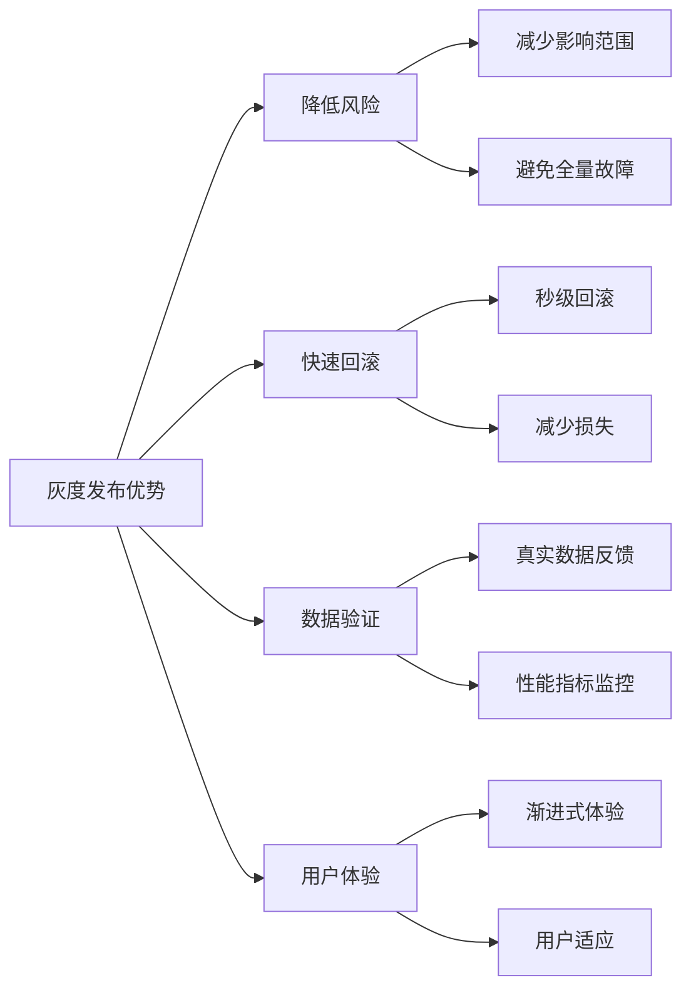

# 如何进行灰度发布？

## 概要回答

灰度发布是一种渐进式的软件发布策略，通过将新版本逐步推送给部分用户来降低发布风险。实现方式包括基于用户特征、流量比例、地理位置等维度进行流量分割，配合监控和回滚机制，确保新版本稳定后再全面上线。

## 深度解析

### 灰度发布基本概念

灰度发布（Gray Release）也称为金丝雀发布（Canary Release），是一种在生产环境中逐步推出新功能或新版本的策略。通过控制流量分配，让一小部分用户先体验新版本，验证稳定性和用户体验后再逐步扩大范围。

### 灰度发布的优势



### 灰度发布实现方案

#### 1. 基于Nginx的流量分割

```nginx
# nginx.conf 灰度发布配置
upstream prod_backend {
    server 192.168.1.10:8080;  # 生产环境实例
    server 192.168.1.11:8080;
    server 192.168.1.12:8080;
}

upstream gray_backend {
    server 192.168.1.20:8080;  # 灰度环境实例
    server 192.168.1.21:8080;
}

# 灰度发布规则
map $http_x_gray_flag $backend {
    default prod_backend;
    "true" gray_backend;
}

# 基于Cookie的灰度发布
map $cookie_gray_user $gray_cookie_backend {
    default prod_backend;
    "true" gray_backend;
}

# 基于用户ID的灰度发布
split_clients "${remote_addr}AAA" $userid_split {
    10% gray_backend;    # 10%用户访问灰度环境
    *   prod_backend;    # 90%用户访问生产环境
}

server {
    listen 80;
    server_name example.com;
    
    location / {
        # 方案1: 基于请求头
        if ($http_x_gray_flag = "true") {
            proxy_pass http://gray_backend;
            break;
        }
        
        # 方案2: 基于Cookie
        if ($cookie_gray_user = "true") {
            proxy_pass http://gray_backend;
            break;
        }
        
        # 方案3: 基于用户ID分割
        proxy_pass http://$userid_split;
    }
}
```

#### 2. 基于应用层的灰度发布

```php
<?php
/**
 * 灰度发布管理类
 */
class GrayReleaseManager {
    private $grayRules = [];
    private $userStorage;
    
    public function __construct($userStorage = null) {
        $this->userStorage = $userStorage ?: new SimpleUserStorage();
    }
    
    /**
     * 添加灰度规则
     */
    public function addRule($feature, $condition, $percentage = 0) {
        $this->grayRules[$feature] = [
            'condition' => $condition,
            'percentage' => $percentage,
            'enabled' => true
        ];
    }
    
    /**
     * 检查用户是否在灰度范围内
     */
    public function isInGrayGroup($userId, $feature) {
        if (!isset($this->grayRules[$feature]) || !$this->grayRules[$feature]['enabled']) {
            return false;
        }
        
        $rule = $this->grayRules[$feature];
        
        // 检查是否已分配到灰度组
        $assignedGroup = $this->userStorage->getGrayGroup($userId, $feature);
        if ($assignedGroup !== null) {
            return $assignedGroup;
        }
        
        // 根据条件判断
        if ($this->evaluateCondition($userId, $rule['condition'])) {
            $this->userStorage->setGrayGroup($userId, $feature, true);
            return true;
        }
        
        // 根据百分比分配
        if ($this->assignByPercentage($userId, $rule['percentage'])) {
            $this->userStorage->setGrayGroup($userId, $feature, true);
            return true;
        }
        
        // 默认不在灰度组
        $this->userStorage->setGrayGroup($userId, $feature, false);
        return false;
    }
    
    /**
     * 评估条件
     */
    private function evaluateCondition($userId, $condition) {
        if (is_callable($condition)) {
            return call_user_func($condition, $userId);
        }
        
        if (is_array($condition)) {
            // 白名单用户
            if (isset($condition['whitelist']) && in_array($userId, $condition['whitelist'])) {
                return true;
            }
            
            // VIP用户
            if (isset($condition['vip_only']) && $condition['vip_only']) {
                return $this->isVipUser($userId);
            }
            
            // 内部用户
            if (isset($condition['internal_only']) && $condition['internal_only']) {
                return $this->isInternalUser($userId);
            }
        }
        
        return false;
    }
    
    /**
     * 按百分比分组
     */
    private function assignByPercentage($userId, $percentage) {
        if ($percentage <= 0) {
            return false;
        }
        
        if ($percentage >= 100) {
            return true;
        }
        
        // 使用用户ID进行哈希分配
        $hash = crc32($userId);
        $mod = abs($hash) % 100;
        
        return $mod < $percentage;
    }
    
    /**
     * 检查是否为VIP用户
     */
    private function isVipUser($userId) {
        // 这里应该是实际的VIP用户检查逻辑
        // 例如：查询数据库或缓存
        $vipUsers = [1001, 1002, 1003, 1004, 1005];
        return in_array($userId, $vipUsers);
    }
    
    /**
     * 检查是否为内部用户
     */
    private function isInternalUser($userId) {
        // 这里应该是实际的内部用户检查逻辑
        $internalUsers = range(1, 100); // 假设1-100为内部用户
        return in_array($userId, $internalUsers);
    }
    
    /**
     * 启用灰度发布
     */
    public function enableFeature($feature) {
        if (isset($this->grayRules[$feature])) {
            $this->grayRules[$feature]['enabled'] = true;
        }
    }
    
    /**
     * 禁用灰度发布
     */
    public function disableFeature($feature) {
        if (isset($this->grayRules[$feature])) {
            $this->grayRules[$feature]['enabled'] = false;
        }
    }
    
    /**
     * 获取灰度规则状态
     */
    public function getRuleStatus($feature) {
        if (!isset($this->grayRules[$feature])) {
            return null;
        }
        
        return [
            'enabled' => $this->grayRules[$feature]['enabled'],
            'percentage' => $this->grayRules[$feature]['percentage'],
            'condition' => $this->grayRules[$feature]['condition']
        ];
    }
}

/**
 * 简单用户存储类（实际应用中应使用Redis或数据库）
 */
class SimpleUserStorage {
    private $grayGroups = [];
    
    public function getGrayGroup($userId, $feature) {
        $key = "{$userId}_{$feature}";
        return isset($this->grayGroups[$key]) ? $this->grayGroups[$key] : null;
    }
    
    public function setGrayGroup($userId, $feature, $inGrayGroup) {
        $key = "{$userId}_{$feature}";
        $this->grayGroups[$key] = $inGrayGroup;
    }
}

// 使用示例
$grayManager = new GrayReleaseManager();

// 添加灰度规则
$grayManager->addRule('new_payment', [
    'whitelist' => [1001, 1002, 1003],  // 白名单用户
    'vip_only' => false
], 10); // 10%普通用户

$grayManager->addRule('new_ui', [
    'internal_only' => true  // 仅内部用户
], 0); // 不按百分比分组

// 检查用户是否在灰度组
$userId = 12345;
$isInPaymentGray = $grayManager->isInGrayGroup($userId, 'new_payment');
$isInUiGray = $grayManager->isInGrayGroup($userId, 'new_ui');

echo "用户 $userId 是否在新支付功能灰度组: " . ($isInPaymentGray ? '是' : '否') . "\n";
echo "用户 $userId 是否在新UI灰度组: " . ($isInUiGray ? '是' : '否') . "\n";
```

#### 3. 基于Header的灰度路由

```php
<?php
/**
 * 灰度路由控制器
 */
class GrayRoutingController {
    private $grayManager;
    
    public function __construct(GrayReleaseManager $grayManager) {
        $this->grayManager = $grayManager;
    }
    
    /**
     * 处理请求并决定路由
     */
    public function handleRequest() {
        $userId = $this->getCurrentUserId();
        $feature = $this->getRequestedFeature();
        
        // 检查是否强制灰度（通过请求头）
        $forceGray = $this->checkForceGray();
        
        $useGrayVersion = false;
        if ($forceGray !== null) {
            $useGrayVersion = $forceGray;
        } else {
            $useGrayVersion = $this->grayManager->isInGrayGroup($userId, $feature);
        }
        
        // 记录灰度路由日志
        $this->logGrayRouting($userId, $feature, $useGrayVersion);
        
        // 根据结果路由到相应版本
        if ($useGrayVersion) {
            return $this->routeToGrayVersion($feature);
        } else {
            return $this->routeToProdVersion($feature);
        }
    }
    
    /**
     * 获取当前用户ID
     */
    private function getCurrentUserId() {
        // 从Session、Token或其他方式获取用户ID
        return $_SESSION['user_id'] ?? $_COOKIE['user_id'] ?? 0;
    }
    
    /**
     * 获取请求的功能
     */
    private function getRequestedFeature() {
        // 从URL参数、路由或其他方式获取功能标识
        return $_GET['feature'] ?? $_POST['feature'] ?? 'default';
    }
    
    /**
     * 检查是否强制灰度
     */
    private function checkForceGray() {
        // 检查请求头
        $grayHeader = $_SERVER['HTTP_X_GRAY_RELEASE'] ?? '';
        if ($grayHeader === 'true') {
            return true;
        } elseif ($grayHeader === 'false') {
            return false;
        }
        
        // 检查Cookie
        $grayCookie = $_COOKIE['gray_release'] ?? '';
        if ($grayCookie === 'true') {
            return true;
        } elseif ($grayCookie === 'false') {
            return false;
        }
        
        // 未强制指定
        return null;
    }
    
    /**
     * 路由到灰度版本
     */
    private function routeToGrayVersion($feature) {
        // 这里应该是实际的灰度版本处理逻辑
        switch ($feature) {
            case 'new_payment':
                return $this->handleNewPaymentGray();
            case 'new_ui':
                return $this->handleNewUiGray();
            default:
                return $this->handleDefaultGray();
        }
    }
    
    /**
     * 路由到生产版本
     */
    private function routeToProdVersion($feature) {
        // 这里应该是实际的生产版本处理逻辑
        switch ($feature) {
            case 'new_payment':
                return $this->handleNewPaymentProd();
            case 'new_ui':
                return $this->handleNewUiProd();
            default:
                return $this->handleDefaultProd();
        }
    }
    
    /**
     * 记录灰度路由日志
     */
    private function logGrayRouting($userId, $feature, $useGrayVersion) {
        $logEntry = sprintf(
            "[%s] Gray Routing - User: %s, Feature: %s, Gray: %s, IP: %s\n",
            date('Y-m-d H:i:s'),
            $userId,
            $feature,
            $useGrayVersion ? 'YES' : 'NO',
            $_SERVER['REMOTE_ADDR'] ?? 'unknown'
        );
        
        file_put_contents('gray_routing.log', $logEntry, FILE_APPEND | LOCK_EX);
    }
    
    // 具体功能处理方法
    private function handleNewPaymentGray() {
        // 灰度版本的新支付功能
        return ['version' => 'gray', 'feature' => 'new_payment', 'data' => '灰度版支付功能'];
    }
    
    private function handleNewPaymentProd() {
        // 生产版本的新支付功能
        return ['version' => 'prod', 'feature' => 'new_payment', 'data' => '生产版支付功能'];
    }
    
    private function handleNewUiGray() {
        // 灰度版本的新UI
        return ['version' => 'gray', 'feature' => 'new_ui', 'data' => '灰度版新UI'];
    }
    
    private function handleNewUiProd() {
        // 生产版本的新UI
        return ['version' => 'prod', 'feature' => 'new_ui', 'data' => '生产版新UI'];
    }
    
    private function handleDefaultGray() {
        return ['version' => 'gray', 'feature' => 'default', 'data' => '灰度版默认功能'];
    }
    
    private function handleDefaultProd() {
        return ['version' => 'prod', 'feature' => 'default', 'data' => '生产版默认功能'];
    }
}

// 使用示例
session_start();

$grayManager = new GrayReleaseManager();
$routingController = new GrayRoutingController($grayManager);

// 添加一些灰度规则
$grayManager->addRule('new_payment', ['whitelist' => [1001, 1002]], 5);
$grayManager->addRule('new_ui', ['internal_only' => true], 0);

// 处理请求
$result = $routingController->handleRequest();
echo json_encode($result, JSON_UNESCAPED_UNICODE);
```

### 灰度发布监控和指标

```php
<?php
/**
 * 灰度发布监控类
 */
class GrayReleaseMonitor {
    private $metricsStorage;
    
    public function __construct($metricsStorage = null) {
        $this->metricsStorage = $metricsStorage ?: new SimpleMetricsStorage();
    }
    
    /**
     * 记录灰度发布指标
     */
    public function recordMetric($feature, $version, $metric, $value) {
        $key = "gray_{$feature}_{$version}_{$metric}";
        $this->metricsStorage->increment($key, $value);
        
        // 同时记录时间序列数据
        $this->metricsStorage->addTimeSeries($key, $value, time());
    }
    
    /**
     * 获取灰度发布报告
     */
    public function getReleaseReport($feature, $timeWindow = 3600) {
        $startTime = time() - $timeWindow;
        
        $metrics = [
            'prod' => [
                'requests' => $this->metricsStorage->get("gray_{$feature}_prod_requests"),
                'errors' => $this->metricsStorage->get("gray_{$feature}_prod_errors"),
                'response_time_avg' => $this->metricsStorage->getAverage("gray_{$feature}_prod_response_time", $startTime),
                'conversion_rate' => $this->metricsStorage->getRate("gray_{$feature}_prod_conversions", "gray_{$feature}_prod_requests")
            ],
            'gray' => [
                'requests' => $this->metricsStorage->get("gray_{$feature}_gray_requests"),
                'errors' => $this->metricsStorage->get("gray_{$feature}_gray_errors"),
                'response_time_avg' => $this->metricsStorage->getAverage("gray_{$feature}_gray_response_time", $startTime),
                'conversion_rate' => $this->metricsStorage->getRate("gray_{$feature}_gray_conversions", "gray_{$feature}_gray_requests")
            ]
        ];
        
        // 计算错误率
        $metrics['prod']['error_rate'] = $this->calculateErrorRate(
            $metrics['prod']['errors'], 
            $metrics['prod']['requests']
        );
        
        $metrics['gray']['error_rate'] = $this->calculateErrorRate(
            $metrics['gray']['errors'], 
            $metrics['gray']['requests']
        );
        
        return $metrics;
    }
    
    /**
     * 计算错误率
     */
    private function calculateErrorRate($errors, $requests) {
        if ($requests == 0) {
            return 0;
        }
        return round(($errors / $requests) * 100, 2);
    }
    
    /**
     * 检查是否应该暂停灰度发布
     */
    public function shouldPauseRelease($feature, $errorThreshold = 5.0, $timeWindow = 300) {
        $report = $this->getReleaseReport($feature, $timeWindow);
        
        // 如果灰度版本错误率超过阈值，暂停发布
        if ($report['gray']['error_rate'] > $errorThreshold) {
            return [
                'should_pause' => true,
                'reason' => "灰度版本错误率({$report['gray']['error_rate']}%)超过阈值({$errorThreshold}%)",
                'metrics' => $report
            ];
        }
        
        // 如果灰度版本性能明显下降，暂停发布
        $performanceRatio = $report['gray']['response_time_avg'] / $report['prod']['response_time_avg'];
        if ($performanceRatio > 1.5) {
            return [
                'should_pause' => true,
                'reason' => "灰度版本响应时间({$report['gray']['response_time_avg']}ms)比生产版本慢" . round($performanceRatio, 2) . "倍",
                'metrics' => $report
            ];
        }
        
        return [
            'should_pause' => false,
            'metrics' => $report
        ];
    }
    
    /**
     * 自动生成灰度发布进度建议
     */
    public function getProgressRecommendation($feature, $targetPercentage = 100) {
        $pauseCheck = $this->shouldPauseRelease($feature);
        
        if ($pauseCheck['should_pause']) {
            return [
                'action' => 'pause',
                'reason' => $pauseCheck['reason'],
                'details' => $pauseCheck['metrics']
            ];
        }
        
        $report = $pauseCheck['metrics'];
        
        // 如果灰度版本表现良好，建议增加流量
        $errorImprovement = $report['prod']['error_rate'] - $report['gray']['error_rate'];
        $conversionImprovement = $report['gray']['conversion_rate'] - $report['prod']['conversion_rate'];
        
        if ($errorImprovement > 1.0 || $conversionImprovement > 2.0) {
            return [
                'action' => 'increase',
                'reason' => '灰度版本表现优于生产版本',
                'improvement' => [
                    'error_reduction' => $errorImprovement,
                    'conversion_improvement' => $conversionImprovement
                ],
                'details' => $report
            ];
        }
        
        // 如果表现相当，保持当前进度
        return [
            'action' => 'maintain',
            'reason' => '灰度版本表现与生产版本相当',
            'details' => $report
        ];
    }
}

/**
 * 简单指标存储类
 */
class SimpleMetricsStorage {
    private $counters = [];
    private $timeSeries = [];
    
    public function increment($key, $value = 1) {
        if (!isset($this->counters[$key])) {
            $this->counters[$key] = 0;
        }
        $this->counters[$key] += $value;
    }
    
    public function get($key) {
        return $this->counters[$key] ?? 0;
    }
    
    public function addTimeSeries($key, $value, $timestamp) {
        if (!isset($this->timeSeries[$key])) {
            $this->timeSeries[$key] = [];
        }
        $this->timeSeries[$key][] = ['timestamp' => $timestamp, 'value' => $value];
    }
    
    public function getAverage($key, $sinceTimestamp) {
        if (!isset($this->timeSeries[$key])) {
            return 0;
        }
        
        $values = array_filter($this->timeSeries[$key], function($item) use ($sinceTimestamp) {
            return $item['timestamp'] >= $sinceTimestamp;
        });
        
        if (empty($values)) {
            return 0;
        }
        
        $sum = array_sum(array_column($values, 'value'));
        return $sum / count($values);
    }
    
    public function getRate($numeratorKey, $denominatorKey) {
        $numerator = $this->get($numeratorKey);
        $denominator = $this->get($denominatorKey);
        
        if ($denominator == 0) {
            return 0;
        }
        
        return round(($numerator / $denominator) * 100, 2);
    }
}

// 使用示例
$monitor = new GrayReleaseMonitor();

// 模拟记录一些指标
$features = ['new_payment', 'new_ui'];
$versions = ['prod', 'gray'];

foreach ($features as $feature) {
    foreach ($versions as $version) {
        // 模拟请求数
        $requests = rand(100, 1000);
        $monitor->recordMetric($feature, $version, 'requests', $requests);
        
        // 模拟错误数
        $errors = rand(0, $requests * 0.1); // 错误率不超过10%
        $monitor->recordMetric($feature, $version, 'errors', $errors);
        
        // 模拟响应时间
        for ($i = 0; $i < $requests; $i++) {
            $responseTime = rand(50, 500); // 50-500ms
            $monitor->recordMetric($feature, $version, 'response_time', $responseTime);
        }
        
        // 模拟转化数
        $conversions = rand($requests * 0.05, $requests * 0.3); // 转化率5%-30%
        $monitor->recordMetric($feature, $version, 'conversions', $conversions);
    }
}

// 获取发布报告
foreach ($features as $feature) {
    echo "=== {$feature} 灰度发布报告 ===\n";
    $report = $monitor->getReleaseReport($feature);
    print_r($report);
    
    // 获取进度建议
    $recommendation = $monitor->getProgressRecommendation($feature);
    echo "进度建议: " . json_encode($recommendation, JSON_UNESCAPED_UNICODE) . "\n\n";
}
```

### 灰度发布自动化流程

```php
<?php
/**
 * 灰度发布自动化控制器
 */
class GrayReleaseAutomation {
    private $grayManager;
    private $monitor;
    private $deploymentManager;
    
    public function __construct(
        GrayReleaseManager $grayManager, 
        GrayReleaseMonitor $monitor,
        DeploymentManager $deploymentManager
    ) {
        $this->grayManager = $grayManager;
        $this->monitor = $monitor;
        $this->deploymentManager = $deploymentManager;
    }
    
    /**
     * 启动灰度发布流程
     */
    public function startGrayRelease($feature, $initialPercentage = 5) {
        echo "启动功能 {$feature} 的灰度发布流程...\n";
        
        // 1. 部署灰度版本
        if (!$this->deploymentManager->deployGrayVersion($feature)) {
            throw new Exception("灰度版本部署失败");
        }
        
        echo "灰度版本部署完成\n";
        
        // 2. 设置初始灰度规则
        $this->grayManager->addRule($feature, [], $initialPercentage);
        $this->grayManager->enableFeature($feature);
        
        echo "初始灰度规则设置完成 ({$initialPercentage}%)\n";
        
        // 3. 启动监控循环
        $this->startMonitoringLoop($feature);
    }
    
    /**
     * 启动监控循环
     */
    private function startMonitoringLoop($feature) {
        echo "启动监控循环...\n";
        
        $maxIterations = 20; // 最大迭代次数
        $iteration = 0;
        
        while ($iteration < $maxIterations) {
            $iteration++;
            echo "第 {$iteration} 轮监控...\n";
            
            // 等待监控周期
            sleep(30); // 每30秒检查一次
            
            // 获取进度建议
            $recommendation = $this->monitor->getProgressRecommendation($feature);
            
            echo "监控结果: " . $recommendation['action'] . "\n";
            
            switch ($recommendation['action']) {
                case 'pause':
                    echo "警告: " . $recommendation['reason'] . "\n";
                    echo "暂停灰度发布，请人工介入处理\n";
                    return;
                    
                case 'increase':
                    $this->increaseGrayPercentage($feature, 10); // 每次增加10%
                    break;
                    
                case 'maintain':
                    echo "保持当前灰度比例\n";
                    break;
            }
            
            // 检查是否达到100%
            $ruleStatus = $this->grayManager->getRuleStatus($feature);
            if ($ruleStatus && $ruleStatus['percentage'] >= 100) {
                echo "灰度发布完成，所有用户已切换到新版本\n";
                $this->completeGrayRelease($feature);
                return;
            }
        }
        
        echo "达到最大迭代次数，灰度发布流程结束\n";
    }
    
    /**
     * 增加灰度比例
     */
    private function increaseGrayPercentage($feature, $increment) {
        $ruleStatus = $this->grayManager->getRuleStatus($feature);
        if (!$ruleStatus) {
            return;
        }
        
        $currentPercentage = $ruleStatus['percentage'];
        $newPercentage = min(100, $currentPercentage + $increment);
        
        // 更新规则
        $this->grayManager->addRule($feature, $ruleStatus['condition'], $newPercentage);
        
        echo "灰度比例从 {$currentPercentage}% 增加到 {$newPercentage}%\n";
    }
    
    /**
     * 完成灰度发布
     */
    private function completeGrayRelease($feature) {
        echo "完成灰度发布 {$feature}\n";
        
        // 1. 禁用灰度规则
        $this->grayManager->disableFeature($feature);
        
        // 2. 将生产环境升级到新版本
        if ($this->deploymentManager->promoteToProduction($feature)) {
            echo "生产环境已升级到新版本\n";
        } else {
            echo "生产环境升级失败，请手动处理\n";
        }
        
        // 3. 清理灰度环境
        $this->deploymentManager->cleanupGrayEnvironment($feature);
        echo "灰度环境已清理\n";
    }
}

/**
 * 部署管理器（模拟）
 */
class DeploymentManager {
    public function deployGrayVersion($feature) {
        echo "正在部署 {$feature} 的灰度版本...\n";
        // 模拟部署过程
        sleep(2);
        return rand(0, 10) > 1; // 90%成功率
    }
    
    public function promoteToProduction($feature) {
        echo "正在将 {$feature} 升级到生产环境...\n";
        // 模拟升级过程
        sleep(2);
        return rand(0, 10) > 0; // 90%成功率
    }
    
    public function cleanupGrayEnvironment($feature) {
        echo "正在清理 {$feature} 的灰度环境...\n";
        // 模拟清理过程
        sleep(1);
    }
}

// 使用示例
try {
    $grayManager = new GrayReleaseManager();
    $monitor = new GrayReleaseMonitor();
    $deploymentManager = new DeploymentManager();
    
    $automation = new GrayReleaseAutomation($grayManager, $monitor, $deploymentManager);
    
    // 启动新支付功能的灰度发布
    $automation->startGrayRelease('new_payment', 5);
    
} catch (Exception $e) {
    echo "灰度发布过程中发生错误: " . $e->getMessage() . "\n";
}
```

### 灰度发布最佳实践

#### 1. 渐进式发布计划

```yaml
# 灰度发布进度计划示例
gray_release_plan:
  feature: "new_payment_system"
  phases:
    - phase: "内部测试"
      percentage: 0
      duration: "2天"
      criteria:
        - internal_users_only: true
        - whitelist: [1001, 1002, 1003]
      
    - phase: "小规模灰度"
      percentage: 1
      duration: "1天"
      criteria:
        - error_rate: "< 0.1%"
        - response_time: "< 200ms"
      
    - phase: "中等规模灰度"
      percentage: 10
      duration: "2天"
      criteria:
        - error_rate: "< 0.5%"
        - conversion_rate_improvement: "> 1%"
      
    - phase: "大规模灰度"
      percentage: 50
      duration: "3天"
      criteria:
        - error_rate: "< 1%"
        - user_satisfaction: "> 4.5"
      
    - phase: "全面上线"
      percentage: 100
      duration: "即时"
      criteria:
        - all_previous_criteria_met: true
```

#### 2. 监控告警配置

```php
<?php
/**
 * 灰度发布告警管理类
 */
class GrayReleaseAlerting {
    private $alertChannels = [];
    
    public function addAlertChannel($channel, $handler) {
        $this->alertChannels[$channel] = $handler;
    }
    
    public function sendAlert($level, $message, $context = []) {
        $alert = [
            'level' => $level,
            'message' => $message,
            'context' => $context,
            'timestamp' => date('Y-m-d H:i:s')
        ];
        
        foreach ($this->alertChannels as $channel => $handler) {
            call_user_func($handler, $alert);
        }
    }
    
    /**
     * 检查关键指标并发送告警
     */
    public function checkAndAlert($feature, $metrics) {
        // 错误率告警
        if ($metrics['gray']['error_rate'] > 5.0) {
            $this->sendAlert('CRITICAL', "灰度版本 {$feature} 错误率过高", [
                'error_rate' => $metrics['gray']['error_rate'],
                'threshold' => 5.0
            ]);
        }
        
        // 性能下降告警
        $perfRatio = $metrics['gray']['response_time_avg'] / $metrics['prod']['response_time_avg'];
        if ($perfRatio > 2.0) {
            $this->sendAlert('WARNING', "灰度版本 {$feature} 性能显著下降", [
                'gray_response_time' => $metrics['gray']['response_time_avg'],
                'prod_response_time' => $metrics['prod']['response_time_avg'],
                'ratio' => $perfRatio
            ]);
        }
        
        // 转化率下降告警
        if ($metrics['gray']['conversion_rate'] < $metrics['prod']['conversion_rate'] * 0.9) {
            $this->sendAlert('WARNING', "灰度版本 {$feature} 转化率下降", [
                'gray_conversion' => $metrics['gray']['conversion_rate'],
                'prod_conversion' => $metrics['prod']['conversion_rate']
            ]);
        }
    }
}

// 告警处理器示例
function emailAlertHandler($alert) {
    $subject = "[灰度发布告警][{$alert['level']}] {$alert['message']}";
    $body = "时间: {$alert['timestamp']}\n";
    $body .= "消息: {$alert['message']}\n";
    $body .= "上下文: " . json_encode($alert['context'], JSON_PRETTY_PRINT);
    
    // 这里应该是实际的邮件发送逻辑
    echo "发送邮件告警: $subject\n";
}

function webhookAlertHandler($alert) {
    // 这里应该是实际的Webhook调用逻辑
    echo "发送Webhook告警: " . json_encode($alert) . "\n";
}

// 使用示例
$alerting = new GrayReleaseAlerting();
$alerting->addAlertChannel('email', 'emailAlertHandler');
$alerting->addAlertChannel('webhook', 'webhookAlertHandler');

// 模拟指标检查
$sampleMetrics = [
    'prod' => [
        'error_rate' => 0.5,
        'response_time_avg' => 150,
        'conversion_rate' => 3.5
    ],
    'gray' => [
        'error_rate' => 6.2,  // 错误率过高
        'response_time_avg' => 400,  // 性能下降
        'conversion_rate' => 3.0   // 转化率下降
    ]
];

$alerting->checkAndAlert('new_payment', $sampleMetrics);
```

通过合理的灰度发布策略和完善的监控机制，可以大大降低新功能上线的风险，确保系统稳定性和用户体验。