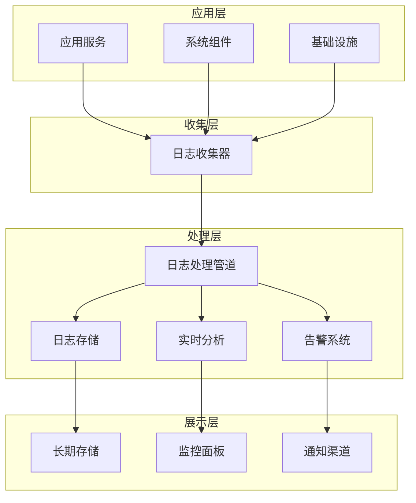

# 日志收集和分析的最佳实践？

## 概要回答

日志收集和分析是系统可观测性的核心组成部分。最佳实践包括：统一日志格式、结构化日志记录、集中式日志收集、实时监控告警、日志分级管理、安全合规处理等。通过ELK Stack、Fluentd、Prometheus等工具构建完整的日志生态系统，可以有效支撑故障排查、性能优化和业务分析。

## 深度解析

### 日志收集架构



### 结构化日志记录

#### 1. PHP应用日志记录最佳实践

```php
<?php
/**
 * 结构化日志记录类
 */
class StructuredLogger {
    private $logger;
    private $appName;
    private $environment;
    
    public function __construct($appName, $environment = 'production') {
        $this->appName = $appName;
        $this->environment = $environment;
        
        // 初始化Monolog或其他日志库
        $this->logger = new \Monolog\Logger($appName);
        
        // 添加处理器
        $this->setupHandlers();
    }
    
    /**
     * 设置日志处理器
     */
    private function setupHandlers() {
        // 文件处理器
        $fileHandler = new \Monolog\Handler\StreamHandler(
            "/var/log/{$this->appName}/app.log",
            \Monolog\Logger::DEBUG
        );
        
        // JSON格式化器
        $jsonFormatter = new \Monolog\Formatter\JsonFormatter();
        $fileHandler->setFormatter($jsonFormatter);
        
        $this->logger->pushHandler($fileHandler);
        
        // 错误日志单独处理
        if ($this->environment === 'production') {
            $errorHandler = new \Monolog\Handler\StreamHandler(
                "/var/log/{$this->appName}/error.log",
                \Monolog\Logger::ERROR
            );
            $errorHandler->setFormatter($jsonFormatter);
            $this->logger->pushHandler($errorHandler);
        }
    }
    
    /**
     * 记录调试日志
     */
    public function debug($message, $context = []) {
        $this->log('debug', $message, $context);
    }
    
    /**
     * 记录信息日志
     */
    public function info($message, $context = []) {
        $this->log('info', $message, $context);
    }
    
    /**
     * 记录警告日志
     */
    public function warning($message, $context = []) {
        $this->log('warning', $message, $context);
    }
    
    /**
     * 记录错误日志
     */
    public function error($message, $context = []) {
        $this->log('error', $message, $context);
    }
    
    /**
     * 记录严重错误日志
     */
    public function critical($message, $context = []) {
        $this->log('critical', $message, $context);
    }
    
    /**
     * 通用日志记录方法
     */
    private function log($level, $message, $context = []) {
        // 添加标准上下文信息
        $standardContext = [
            'app' => $this->appName,
            'env' => $this->environment,
            'request_id' => $this->getRequestId(),
            'user_id' => $this->getUserId(),
            'ip' => $_SERVER['REMOTE_ADDR'] ?? 'unknown',
            'user_agent' => $_SERVER['HTTP_USER_AGENT'] ?? 'unknown',
            'timestamp' => microtime(true),
            'memory_usage' => memory_get_usage(true),
            'memory_peak' => memory_get_peak_usage(true)
        ];
        
        // 合并上下文
        $fullContext = array_merge($standardContext, $context);
        
        // 记录日志
        $this->logger->$level($message, $fullContext);
    }
    
    /**
     * 获取请求ID
     */
    private function getRequestId() {
        // 从请求头获取或生成新的请求ID
        return $_SERVER['HTTP_X_REQUEST_ID'] ?? uniqid($this->appName . '_', true);
    }
    
    /**
     * 获取用户ID
     */
    private function getUserId() {
        return $_SESSION['user_id'] ?? $_COOKIE['user_id'] ?? 'anonymous';
    }
    
    /**
     * 记录业务事件
     */
    public function event($eventName, $properties = []) {
        $context = [
            'event' => $eventName,
            'properties' => $properties,
            'type' => 'business_event'
        ];
        
        $this->info("Business event: {$eventName}", $context);
    }
    
    /**
     * 记录性能指标
     */
    public function metric($metricName, $value, $tags = []) {
        $context = [
            'metric' => $metricName,
            'value' => $value,
            'tags' => $tags,
            'type' => 'metric'
        ];
        
        $this->info("Performance metric: {$metricName}", $context);
    }
    
    /**
     * 记录异常
     */
    public function logException(\Exception $exception, $context = []) {
        $exceptionContext = [
            'exception_class' => get_class($exception),
            'exception_message' => $exception->getMessage(),
            'exception_code' => $exception->getCode(),
            'file' => $exception->getFile(),
            'line' => $exception->getLine(),
            'trace' => $exception->getTraceAsString(),
            'type' => 'exception'
        ];
        
        $fullContext = array_merge($exceptionContext, $context);
        
        $this->error("Exception occurred: " . get_class($exception), $fullContext);
    }
}

// 使用示例
$logger = new StructuredLogger('php-app', 'production');

// 记录常规日志
$logger->info('User login successful', [
    'username' => 'john_doe',
    'login_method' => 'oauth'
]);

// 记录业务事件
$logger->event('user_purchase', [
    'user_id' => 12345,
    'product_id' => 67890,
    'amount' => 99.99,
    'currency' => 'USD'
]);

// 记录性能指标
$start = microtime(true);
// 执行一些操作
sleep(1);
$duration = (microtime(true) - $start) * 1000; // 转换为毫秒
$logger->metric('api_response_time', $duration, [
    'endpoint' => '/api/users',
    'method' => 'GET'
]);

// 记录异常
try {
    throw new Exception('Database connection failed');
} catch (Exception $e) {
    $logger->logException($e, [
        'database_host' => 'db.example.com',
        'attempt' => 3
    ]);
}
```

#### 2. 日志格式标准化

```php
<?php
/**
 * 标准化日志格式类
 */
class StandardLogFormatter {
    /**
     * 格式化应用日志
     */
    public static function formatAppLog($level, $message, $context = []) {
        $logEntry = [
            'timestamp' => self::getTimestamp(),
            'level' => strtoupper($level),
            'message' => $message,
            'context' => self::sanitizeContext($context),
            'service' => $context['app'] ?? 'unknown',
            'environment' => $context['env'] ?? 'unknown',
            'trace_id' => $context['request_id'] ?? self::generateTraceId(),
            'span_id' => self::generateSpanId()
        ];
        
        return json_encode($logEntry, JSON_UNESCAPED_SLASHES | JSON_UNESCAPED_UNICODE);
    }
    
    /**
     * 格式化访问日志
     */
    public static function formatAccessLog($request, $response, $context = []) {
        $logEntry = [
            'timestamp' => self::getTimestamp(),
            'type' => 'access',
            'method' => $request['method'] ?? 'UNKNOWN',
            'uri' => $request['uri'] ?? '/',
            'status_code' => $response['status'] ?? 0,
            'response_time_ms' => $response['duration'] ?? 0,
            'request_size' => $request['size'] ?? 0,
            'response_size' => $response['size'] ?? 0,
            'client_ip' => $request['ip'] ?? 'unknown',
            'user_agent' => $request['user_agent'] ?? 'unknown',
            'referer' => $request['referer'] ?? '',
            'service' => $context['service'] ?? 'unknown',
            'trace_id' => $context['trace_id'] ?? self::generateTraceId()
        ];
        
        return json_encode($logEntry, JSON_UNESCAPED_SLASHES | JSON_UNESCAPED_UNICODE);
    }
    
    /**
     * 格式化安全日志
     */
    public static function formatSecurityLog($eventType, $details, $context = []) {
        $logEntry = [
            'timestamp' => self::getTimestamp(),
            'type' => 'security',
            'event' => $eventType,
            'details' => self::sanitizeSensitiveData($details),
            'severity' => $context['severity'] ?? 'medium',
            'source_ip' => $context['source_ip'] ?? 'unknown',
            'user_id' => $context['user_id'] ?? 'anonymous',
            'service' => $context['service'] ?? 'unknown',
            'trace_id' => $context['trace_id'] ?? self::generateTraceId()
        ];
        
        return json_encode($logEntry, JSON_UNESCAPED_SLASHES | JSON_UNESCAPED_UNICODE);
    }
    
    /**
     * 获取时间戳
     */
    private static function getTimestamp() {
        $mtime = microtime(true);
        $seconds = floor($mtime);
        $milliseconds = round(($mtime - $seconds) * 1000);
        return date('Y-m-d\TH:i:s', $seconds) . '.' . sprintf('%03d', $milliseconds) . 'Z';
    }
    
    /**
     * 生成追踪ID
     */
    private static function generateTraceId() {
        return bin2hex(random_bytes(8));
    }
    
    /**
     * 生成跨度ID
     */
    private static function generateSpanId() {
        return bin2hex(random_bytes(4));
    }
    
    /**
     * 清理上下文中的敏感数据
     */
    private static function sanitizeContext($context) {
        $sensitiveKeys = ['password', 'token', 'secret', 'key', 'credit_card', 'ssn'];
        
        foreach ($sensitiveKeys as $key) {
            if (isset($context[$key])) {
                $context[$key] = '***REDACTED***';
            }
        }
        
        return $context;
    }
    
    /**
     * 清理敏感数据
     */
    private static function sanitizeSensitiveData($data) {
        if (is_array($data)) {
            return self::sanitizeContext($data);
        }
        return $data;
    }
}

// 使用示例
// 应用日志
echo StandardLogFormatter::formatAppLog('info', 'User authenticated successfully', [
    'app' => 'user-service',
    'env' => 'production',
    'user_id' => 12345,
    'auth_method' => 'oauth2'
]) . "\n";

// 访问日志
echo StandardLogFormatter::formatAccessLog(
    [
        'method' => 'POST',
        'uri' => '/api/users/login',
        'ip' => '192.168.1.100',
        'user_agent' => 'Mozilla/5.0...',
        'size' => 1024
    ],
    [
        'status' => 200,
        'duration' => 150,
        'size' => 2048
    ],
    [
        'service' => 'api-gateway',
        'trace_id' => 'abc123def456'
    ]
) . "\n";

// 安全日志
echo StandardLogFormatter::formatSecurityLog('failed_login', [
    'username' => 'admin',
    'attempts' => 3,
    'blocked' => true
], [
    'severity' => 'high',
    'source_ip' => '203.0.113.1',
    'user_id' => 'unknown',
    'service' => 'auth-service'
]) . "\n";
```

### 日志收集方案

#### 1. Fluentd配置示例

```xml
<!-- fluent.conf -->
<source>
  @type tail
  @id input_tail
  path /var/log/php-app/*.log
  pos_file /var/log/fluentd-php-app.pos
  tag php-app.*
  <parse>
    @type json
    time_key timestamp
    time_format %Y-%m-%dT%H:%M:%S.%NZ
  </parse>
</source>

<source>
  @type tail
  @id input_access
  path /var/log/nginx/access.log
  pos_file /var/log/fluentd-nginx-access.pos
  tag nginx.access
  <parse>
    @type regexp
    expression /^(?<remote>[^ ]*) - (?<user>[^ ]*) \[(?<time>[^\]]*)\] "(?<method>\S+)(?: +(?<path>[^\"]*) +\S*)?" (?<code>[^ ]*) (?<size>[^ ]*)(?: "(?<referer>[^\"]*)" "(?<agent>[^\"]*)")?$/
    time_format %d/%b/%Y:%H:%M:%S %z
  </parse>
</source>

<filter php-app.**>
  @type record_transformer
  <record>
    hostname "#{Socket.gethostname}"
    service ${tag_suffix[1]}
  </record>
</filter>

<filter nginx.access>
  @type record_transformer
  <record>
    hostname "#{Socket.gethostname}"
    service nginx
  </record>
</filter>

<match php-app.**>
  @type elasticsearch
  host elasticsearch.example.com
  port 9200
  logstash_format true
  logstash_prefix php-app
  <buffer>
    @type file
    path /var/log/fluentd-buffer
    flush_interval 10s
  </buffer>
</match>

<match nginx.access>
  @type elasticsearch
  host elasticsearch.example.com
  port 9200
  logstash_format true
  logstash_prefix nginx-access
  <buffer>
    @type file
    path /var/log/fluentd-buffer
    flush_interval 5s
  </buffer>
</match>

<match **>
  @type stdout
</match>
```

#### 2. Filebeat配置示例

```yaml
# filebeat.yml
filebeat.inputs:
- type: log
  enabled: true
  paths:
    - /var/log/php-app/*.log
  fields:
    service: php-app
    environment: production
  fields_under_root: true
  json.keys_under_root: true
  json.add_error_key: true

- type: log
  enabled: true
  paths:
    - /var/log/nginx/access.log
  fields:
    service: nginx
    type: access
  fields_under_root: true
  multiline.pattern: '^{'
  multiline.negate: true
  multiline.match: after

processors:
- add_host_metadata:
    netinfo.enabled: true
    
- add_cloud_metadata: ~

- add_docker_metadata: ~

output.elasticsearch:
  hosts: ["elasticsearch.example.com:9200"]
  indices:
    - index: "filebeat-php-app-%{+yyyy.MM.dd}"
      when.contains:
        service: "php-app"
    - index: "filebeat-nginx-%{+yyyy.MM.dd}"
      when.contains:
        service: "nginx"

logging.level: info
logging.to_files: true
logging.files:
  path: /var/log/filebeat
  name: filebeat
  keepfiles: 7
  permissions: 0644
```

### 日志分析和可视化

#### 1. Elasticsearch查询示例

```php
<?php
/**
 * 日志分析查询类
 */
class LogAnalyzer {
    private $elasticsearchClient;
    
    public function __construct($elasticsearchHost) {
        // 初始化Elasticsearch客户端
        $this->elasticsearchClient = \Elasticsearch\ClientBuilder::create()
            ->setHosts([$elasticsearchHost])
            ->build();
    }
    
    /**
     * 查询错误日志
     */
    public function getErrorLogs($service, $timeRange = '24h', $limit = 100) {
        $params = [
            'index' => "php-app-*",
            'body' => [
                'query' => [
                    'bool' => [
                        'must' => [
                            ['match' => ['service' => $service]],
                            ['range' => [
                                'timestamp' => [
                                    'gte' => "now-{$timeRange}",
                                    'lt' => 'now'
                                ]
                            ]],
                            ['range' => [
                                'level' => [
                                    'gte' => 'error'
                                ]
                            ]]
                        ]
                    ]
                ],
                'sort' => [
                    ['timestamp' => ['order' => 'desc']]
                ],
                'size' => $limit
            ]
        ];
        
        return $this->elasticsearchClient->search($params);
    }
    
    /**
     * 获取服务性能指标
     */
    public function getServiceMetrics($service, $timeRange = '1h') {
        $params = [
            'index' => "php-app-metrics-*",
            'body' => [
                'query' => [
                    'bool' => [
                        'must' => [
                            ['match' => ['service' => $service]],
                            ['range' => [
                                'timestamp' => [
                                    'gte' => "now-{$timeRange}",
                                    'lt' => 'now'
                                ]
                            ]]
                        ]
                    ]
                ],
                'aggs' => [
                    'avg_response_time' => [
                        'avg' => [
                            'field' => 'value'
                        ]
                    ],
                    'percentiles_response_time' => [
                        'percentiles' => [
                            'field' => 'value',
                            'percents' => [50, 75, 95, 99]
                        ]
                    ],
                    'request_rate' => [
                        'date_histogram' => [
                            'field' => 'timestamp',
                            'calendar_interval' => '1m'
                        ]
                    ]
                ]
            ]
        ];
        
        return $this->elasticsearchClient->search($params);
    }
    
    /**
     * 分析用户行为
     */
    public function analyzeUserBehavior($timeRange = '7d') {
        $params = [
            'index' => "php-app-business-events-*",
            'body' => [
                'query' => [
                    'range' => [
                        'timestamp' => [
                            'gte' => "now-{$timeRange}",
                            'lt' => 'now'
                        ]
                    ]
                ],
                'aggs' => [
                    'top_events' => [
                        'terms' => [
                            'field' => 'event.keyword',
                            'size' => 20
                        ]
                    ],
                    'user_activity' => [
                        'terms' => [
                            'field' => 'user_id.keyword',
                            'size' => 1000
                        ],
                        'aggs' => [
                            'event_count' => [
                                'value_count' => [
                                    'field' => 'event.keyword'
                                ]
                            ]
                        ]
                    ],
                    'daily_trend' => [
                        'date_histogram' => [
                            'field' => 'timestamp',
                            'calendar_interval' => '1d'
                        ],
                        'aggs' => [
                            'events' => [
                                'terms' => [
                                    'field' => 'event.keyword'
                                ]
                            ]
                        ]
                    ]
                ]
            ]
        ];
        
        return $this->elasticsearchClient->search($params);
    }
    
    /**
     * 搜索特定关键字
     */
    public function searchLogs($keyword, $service = null, $timeRange = '24h') {
        $query = [
            'bool' => [
                'must' => [
                    ['simple_query_string' => [
                        'query' => $keyword
                    ]],
                    ['range' => [
                        'timestamp' => [
                            'gte' => "now-{$timeRange}",
                            'lt' => 'now'
                        ]
                    ]]
                ]
            ]
        ];
        
        // 如果指定了服务，添加服务过滤
        if ($service) {
            $query['bool']['must'][] = ['match' => ['service' => $service]];
        }
        
        $params = [
            'index' => "php-app-*",
            'body' => [
                'query' => $query,
                'highlight' => [
                    'fields' => [
                        'message' => new \stdClass(),
                        'context.*' => new \stdClass()
                    ]
                ],
                'sort' => [
                    ['timestamp' => ['order' => 'desc']]
                ],
                'size' => 50
            ]
        ];
        
        return $this->elasticsearchClient->search($params);
    }
}

// 使用示例
try {
    $analyzer = new LogAnalyzer('elasticsearch.example.com:9200');
    
    // 获取最近24小时的错误日志
    $errorLogs = $analyzer->getErrorLogs('user-service', '24h', 50);
    echo "错误日志数量: " . count($errorLogs['hits']['hits']) . "\n";
    
    // 获取服务性能指标
    $metrics = $analyzer->getServiceMetrics('api-gateway', '1h');
    echo "平均响应时间: " . $metrics['aggregations']['avg_response_time']['value'] . "ms\n";
    
    // 搜索包含特定关键字的日志
    $searchResults = $analyzer->searchLogs('database connection failed', 'user-service', '1h');
    echo "搜索结果数量: " . count($searchResults['hits']['hits']) . "\n";
    
} catch (Exception $e) {
    echo "日志分析错误: " . $e->getMessage() . "\n";
}
```

#### 2. Grafana仪表板配置

```json
{
  "dashboard": {
    "id": null,
    "title": "PHP应用监控面板",
    "tags": ["php", "application", "monitoring"],
    "timezone": "browser",
    "schemaVersion": 16,
    "version": 0,
    "panels": [
      {
        "id": 1,
        "type": "graph",
        "title": "请求速率",
        "gridPos": {"x": 0, "y": 0, "w": 12, "h": 8},
        "targets": [
          {
            "refId": "A",
            "query": "SELECT count(*) FROM \"php-app-metrics\" WHERE \"metric\" = 'request_count' AND $timeFilter GROUP BY time(1m)",
            "rawQuery": true
          }
        ]
      },
      {
        "id": 2,
        "type": "graph",
        "title": "响应时间",
        "gridPos": {"x": 12, "y": 0, "w": 12, "h": 8},
        "targets": [
          {
            "refId": "A",
            "query": "SELECT mean(\"value\") FROM \"php-app-metrics\" WHERE \"metric\" = 'response_time' AND $timeFilter GROUP BY time(1m)",
            "rawQuery": true
          },
          {
            "refId": "B",
            "query": "SELECT percentile(\"value\", 95) FROM \"php-app-metrics\" WHERE \"metric\" = 'response_time' AND $timeFilter GROUP BY time(1m)",
            "rawQuery": true
          }
        ]
      },
      {
        "id": 3,
        "type": "stat",
        "title": "错误率",
        "gridPos": {"x": 0, "y": 8, "w": 6, "h": 6},
        "targets": [
          {
            "refId": "A",
            "query": "SELECT count(*) FROM \"php-app-logs\" WHERE \"level\" =~ /^error/ AND $timeFilter",
            "rawQuery": true
          }
        ]
      },
      {
        "id": 4,
        "type": "table",
        "title": "热门错误",
        "gridPos": {"x": 6, "y": 8, "w": 18, "h": 6},
        "targets": [
          {
            "refId": "A",
            "query": "SELECT \"message\", count(*) as count FROM \"php-app-logs\" WHERE \"level\" =~ /^error/ AND $timeFilter GROUP BY \"message\" ORDER BY count DESC LIMIT 10",
            "rawQuery": true
          }
        ]
      }
    ]
  }
}
```

### 日志安全管理

#### 1. 敏感信息脱敏

```php
<?php
/**
 * 日志脱敏处理器
 */
class LogSanitizer {
    private $sensitivePatterns = [
        // 密码字段
        '/("password["\s]*[:=]["\s]*)([^,"}]*)/i' => '$1"***REDACTED***"',
        // 密钥字段
        '/("key["\s]*[:=]["\s]*)([^,"}]*)/i' => '$1"***REDACTED***"',
        // 令牌字段
        '/("token["\s]*[:=]["\s]*)([^,"}]*)/i' => '$1"***REDACTED***"',
        // 信用卡号
        '/\b\d{4}[-\s]?\d{4}[-\s]?\d{4}[-\s]?\d{4}\b/' => '****-****-****-****',
        // 社保号码
        '/\b\d{3}-\d{2}-\d{4}\b/' => '***-**-****',
        // 邮箱地址
        '/\b[A-Za-z0-9._%+-]+@[A-Za-z0-9.-]+\.[A-Z|a-z]{2,}\b/' => '***@***.***',
        // 手机号码
        '/\b1[3-9]\d{9}\b/' => '1**********'
    ];
    
    /**
     * 脱敏日志内容
     */
    public function sanitize($logContent) {
        foreach ($this->sensitivePatterns as $pattern => $replacement) {
            $logContent = preg_replace($pattern, $replacement, $logContent);
        }
        
        return $logContent;
    }
    
    /**
     * 脱敏数组数据
     */
    public function sanitizeArray($data) {
        if (!is_array($data)) {
            return $data;
        }
        
        $sensitiveKeys = ['password', 'token', 'secret', 'key', 'credit_card', 'ssn', 'phone', 'email'];
        
        foreach ($data as $key => $value) {
            if (is_string($key) && $this->isSensitiveKey($key, $sensitiveKeys)) {
                $data[$key] = '***REDACTED***';
            } elseif (is_array($value)) {
                $data[$key] = $this->sanitizeArray($value);
            } elseif (is_string($value)) {
                $data[$key] = $this->sanitize($value);
            }
        }
        
        return $data;
    }
    
    /**
     * 检查是否为敏感键名
     */
    private function isSensitiveKey($key, $sensitiveKeys) {
        $keyLower = strtolower($key);
        foreach ($sensitiveKeys as $sensitiveKey) {
            if (strpos($keyLower, $sensitiveKey) !== false) {
                return true;
            }
        }
        return false;
    }
    
    /**
     * 添加自定义脱敏规则
     */
    public function addPattern($pattern, $replacement) {
        $this->sensitivePatterns[$pattern] = $replacement;
    }
}

// 使用示例
$sanitizer = new LogSanitizer();

// 脱敏日志文本
$logText = 'User login failed: username=john, password=secret123, email=john@example.com, phone=13812345678';
$sanitizedText = $sanitizer->sanitize($logText);
echo "原始日志: $logText\n";
echo "脱敏后: $sanitizedText\n\n";

// 脱敏数组数据
$logData = [
    'username' => 'john',
    'password' => 'secret123',
    'profile' => [
        'email' => 'john@example.com',
        'phone' => '13812345678',
        'credit_card' => '1234-5678-9012-3456'
    ],
    'api_key' => 'sk-1234567890abcdef'
];

$sanitizedData = $sanitizer->sanitizeArray($logData);
echo "脱敏后的数组数据:\n";
print_r($sanitizedData);
```

#### 2. 日志访问控制

```php
<?php
/**
 * 日志访问控制类
 */
class LogAccessControl {
    private $roles = [
        'admin' => ['read', 'write', 'delete', 'export'],
        'developer' => ['read', 'export'],
        'support' => ['read'],
        'auditor' => ['read', 'export']
    ];
    
    private $sensitiveServices = ['payment', 'auth', 'user'];
    
    /**
     * 检查用户是否有权限访问日志
     */
    public function canAccessLogs($userRole, $service, $action = 'read') {
        // 检查角色权限
        if (!isset($this->roles[$userRole])) {
            return false;
        }
        
        if (!in_array($action, $this->roles[$userRole])) {
            return false;
        }
        
        // 敏感服务需要更高权限
        if (in_array($service, $this->sensitiveServices) && $userRole !== 'admin') {
            // 非管理员不能访问敏感服务日志
            return false;
        }
        
        return true;
    }
    
    /**
     * 过滤日志内容
     */
    public function filterLogContent($logEntries, $userRole, $service) {
        if ($userRole === 'admin') {
            // 管理员可以看到所有日志
            return $logEntries;
        }
        
        if (in_array($service, $this->sensitiveServices)) {
            // 对于敏感服务，非管理员只能看到基本信息
            return $this->filterSensitiveLogs($logEntries);
        }
        
        return $logEntries;
    }
    
    /**
     * 过滤敏感日志
     */
    private function filterSensitiveLogs($logEntries) {
        $filtered = [];
        
        foreach ($logEntries as $entry) {
            // 只保留基本信息
            $basicInfo = [
                'timestamp' => $entry['timestamp'] ?? '',
                'level' => $entry['level'] ?? '',
                'message' => $entry['message'] ?? '',
                'service' => $entry['service'] ?? ''
            ];
            
            // 移除敏感字段
            unset($basicInfo['context']['user_id']);
            unset($basicInfo['context']['ip']);
            unset($basicInfo['context']['user_agent']);
            
            $filtered[] = $basicInfo;
        }
        
        return $filtered;
    }
    
    /**
     * 记录访问日志
     */
    public function logAccess($userId, $userRole, $service, $action, $success = true) {
        $accessLog = [
            'timestamp' => date('c'),
            'user_id' => $userId,
            'user_role' => $userRole,
            'service' => $service,
            'action' => $action,
            'success' => $success,
            'ip' => $_SERVER['REMOTE_ADDR'] ?? 'unknown',
            'user_agent' => $_SERVER['HTTP_USER_AGENT'] ?? 'unknown'
        ];
        
        // 写入访问日志文件
        file_put_contents(
            '/var/log/access-control.log',
            json_encode($accessLog) . "\n",
            FILE_APPEND | LOCK_EX
        );
    }
}

// 使用示例
$accessControl = new LogAccessControl();

// 检查权限
$userRole = 'developer';
$service = 'payment';
$action = 'read';

if ($accessControl->canAccessLogs($userRole, $service, $action)) {
    echo "用户有权限访问 {$service} 服务的日志\n";
    $accessControl->logAccess('user123', $userRole, $service, $action, true);
} else {
    echo "用户没有权限访问 {$service} 服务的日志\n";
    $accessControl->logAccess('user123', $userRole, $service, $action, false);
}
```

### 日志最佳实践总结

#### 1. 日志级别管理

```php
<?php
/**
 * 日志级别管理器
 */
class LogLevelManager {
    private $levelThresholds = [
        'local' => 'debug',
        'development' => 'info',
        'staging' => 'warning',
        'production' => 'error'
    ];
    
    private $currentEnvironment;
    private $currentThreshold;
    
    public function __construct($environment) {
        $this->currentEnvironment = $environment;
        $this->currentThreshold = $this->levelThresholds[$environment] ?? 'info';
    }
    
    /**
     * 检查是否应该记录指定级别的日志
     */
    public function shouldLog($level) {
        $levels = ['debug', 'info', 'warning', 'error', 'critical'];
        $currentLevelIndex = array_search($this->currentThreshold, $levels);
        $logLevelIndex = array_search(strtolower($level), $levels);
        
        return $logLevelIndex >= $currentLevelIndex;
    }
    
    /**
     * 动态调整日志级别
     */
    public function setThreshold($level) {
        if (in_array(strtolower($level), ['debug', 'info', 'warning', 'error', 'critical'])) {
            $this->currentThreshold = strtolower($level);
            return true;
        }
        return false;
    }
    
    /**
     * 获取当前环境的日志级别
     */
    public function getCurrentThreshold() {
        return $this->currentThreshold;
    }
}

// 使用示例
$logLevelManager = new LogLevelManager('production');

// 检查不同级别的日志是否应该记录
$testLevels = ['debug', 'info', 'warning', 'error', 'critical'];
foreach ($testLevels as $level) {
    $shouldLog = $logLevelManager->shouldLog($level) ? '是' : '否';
    echo "{$level} 级别日志在生产环境是否记录: {$shouldLog}\n";
}
```

#### 2. 日志轮转和清理

```bash
#!/bin/bash
# log_rotation.sh - 日志轮转和清理脚本

# 配置变量
LOG_DIR="/var/log/php-app"
MAX_SIZE="100M"
RETENTION_DAYS=30

# 轮转日志文件
rotate_logs() {
    for logfile in $LOG_DIR/*.log; do
        if [[ -f "$logfile" ]]; then
            # 检查文件大小
            filesize=$(du -h "$logfile" | cut -f1)
            
            if [[ "$filesize" > "$MAX_SIZE" ]]; then
                # 重命名当前日志文件
                mv "$logfile" "${logfile}.$(date +%Y%m%d_%H%M%S)"
                
                # 发送信号给应用重新打开日志文件
                # 这里需要根据具体应用调整
                # kill -USR1 $(cat /var/run/php-app.pid)
                
                echo "$(date): Rotated $logfile"
            fi
        fi
    done
}

# 清理旧日志文件
cleanup_old_logs() {
    find $LOG_DIR -name "*.log.*" -mtime +$RETENTION_DAYS -delete
    echo "$(date): Cleaned up old log files"
}

# 执行日志轮转和清理
rotate_logs
cleanup_old_logs
```

通过实施这些日志收集和分析的最佳实践，可以构建一个完整、高效、安全的日志管理系统，为系统监控、故障排查和业务分析提供强有力的支持。