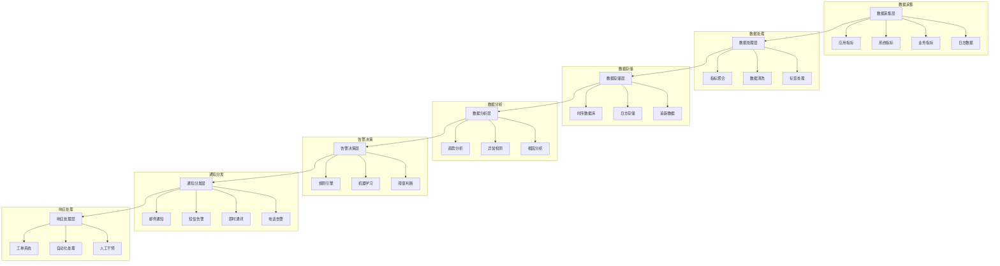

# 监控告警系统的设计要点？

## 概要回答

监控告警系统是保障系统稳定运行的关键基础设施，设计要点包括：建立完整的监控指标体系（四大黄金信号）、选择合适的监控工具链（Prometheus+Grafana）、设计合理的告警策略（分级告警、抑制机制）、构建可视化监控面板、建立故障响应流程等。通过主动监控和智能告警，实现系统的可观测性和快速故障恢复能力。

## 深度解析

### 监控系统架构



### 四大黄金信号

监控系统的核心是关注四大黄金信号：延迟、流量、错误、饱和度。

#### 1. 延迟（Latency）

```php
<?php
/**
 * 延迟监控类
 */
class LatencyMonitor {
    private $metricsCollector;
    private $histogramBuckets = [10, 50, 100, 200, 500, 1000, 2000, 5000]; // 毫秒
    
    public function __construct(MetricsCollector $collector) {
        $this->metricsCollector = $collector;
    }
    
    /**
     * 记录请求延迟
     */
    public function recordLatency($endpoint, $method, $durationMs, $tags = []) {
        $labels = array_merge([
            'endpoint' => $endpoint,
            'method' => $method,
            'service' => $this->getServiceName()
        ], $tags);
        
        // 记录直方图数据
        $this->metricsCollector->histogram('http_request_duration_ms', $durationMs, $labels, $this->histogramBuckets);
        
        // 记录摘要数据（百分位数）
        $this->metricsCollector->summary('http_request_duration_summary', $durationMs, $labels);
        
        // 记录平均值
        $this->metricsCollector->gauge('http_request_avg_duration_ms', $durationMs, $labels);
    }
    
    /**
     * 计算SLA指标
     */
    public function calculateSLAMetrics($endpoint, $timeWindow = '1h') {
        $percentile95 = $this->metricsCollector->getPercentile(
            'http_request_duration_ms', 
            95, 
            ['endpoint' => $endpoint], 
            $timeWindow
        );
        
        $percentile99 = $this->metricsCollector->getPercentile(
            'http_request_duration_ms', 
            99, 
            ['endpoint' => $endpoint], 
            $timeWindow
        );
        
        return [
            'p95_latency' => $percentile95,
            'p99_latency' => $percentile99,
            'sla_compliance' => $percentile95 < 500 // 假设SLA要求95%请求小于500ms
        ];
    }
    
    /**
     * 检查延迟异常
     */
    public function checkLatencyAnomaly($endpoint, $thresholdMultiplier = 2.0) {
        // 获取当前延迟
        $currentLatency = $this->metricsCollector->getLastValue(
            'http_request_avg_duration_ms',
            ['endpoint' => $endpoint]
        );
        
        // 获取历史基线延迟（过去1小时的平均值）
        $baselineLatency = $this->metricsCollector->getAverage(
            'http_request_avg_duration_ms',
            ['endpoint' => $endpoint],
            '1h'
        );
        
        // 检查是否超过阈值
        if ($currentLatency > $baselineLatency * $thresholdMultiplier) {
            return [
                'anomalous' => true,
                'current' => $currentLatency,
                'baseline' => $baselineLatency,
                'ratio' => $currentLatency / $baselineLatency
            ];
        }
        
        return ['anomalous' => false];
    }
    
    private function getServiceName() {
        return $_SERVER['SERVICE_NAME'] ?? 'unknown-service';
    }
}

/**
 * 指标收集器（模拟Prometheus客户端）
 */
class MetricsCollector {
    private $metrics = [];
    
    public function histogram($name, $value, $labels, $buckets) {
        $key = $this->getMetricKey($name, $labels);
        if (!isset($this->metrics[$key])) {
            $this->metrics[$key] = [
                'type' => 'histogram',
                'values' => [],
                'buckets' => $buckets
            ];
        }
        $this->metrics[$key]['values'][] = ['value' => $value, 'timestamp' => time()];
    }
    
    public function summary($name, $value, $labels) {
        $key = $this->getMetricKey($name, $labels);
        if (!isset($this->metrics[$key])) {
            $this->metrics[$key] = [
                'type' => 'summary',
                'values' => []
            ];
        }
        $this->metrics[$key]['values'][] = ['value' => $value, 'timestamp' => time()];
    }
    
    public function gauge($name, $value, $labels) {
        $key = $this->getMetricKey($name, $labels);
        $this->metrics[$key] = [
            'type' => 'gauge',
            'value' => $value,
            'timestamp' => time()
        ];
    }
    
    public function getPercentile($name, $percentile, $labels, $timeWindow) {
        // 模拟获取百分位数值
        return rand(50, 500);
    }
    
    public function getLastValue($name, $labels) {
        $key = $this->getMetricKey($name, $labels);
        return $this->metrics[$key]['value'] ?? 0;
    }
    
    public function getAverage($name, $labels, $timeWindow) {
        // 模拟计算平均值
        return rand(100, 300);
    }
    
    private function getMetricKey($name, $labels) {
        ksort($labels);
        $labelStr = http_build_query($labels);
        return "{$name}?{$labelStr}";
    }
}

// 使用示例
$collector = new MetricsCollector();
$latencyMonitor = new LatencyMonitor($collector);

// 模拟记录一些请求延迟
$endpoints = ['/api/users', '/api/orders', '/api/products'];
$methods = ['GET', 'POST', 'PUT', 'DELETE'];

for ($i = 0; $i < 100; $i++) {
    $endpoint = $endpoints[array_rand($endpoints)];
    $method = $methods[array_rand($methods)];
    $duration = rand(10, 1000); // 10-1000ms
    
    $latencyMonitor->recordLatency($endpoint, $method, $duration);
}

// 检查SLA指标
foreach ($endpoints as $endpoint) {
    $slaMetrics = $latencyMonitor->calculateSLAMetrics($endpoint);
    echo "Endpoint: $endpoint\n";
    echo "  P95延迟: {$slaMetrics['p95_latency']}ms\n";
    echo "  P99延迟: {$slaMetrics['p99_latency']}ms\n";
    echo "  SLA合规: " . ($slaMetrics['sla_compliance'] ? '是' : '否') . "\n\n";
}

// 检查延迟异常
foreach ($endpoints as $endpoint) {
    $anomaly = $latencyMonitor->checkLatencyAnomaly($endpoint);
    if ($anomaly['anomalous']) {
        echo "警告: Endpoint $endpoint 出现延迟异常\n";
        echo "  当前延迟: {$anomaly['current']}ms\n";
        echo "  基线延迟: {$anomaly['baseline']}ms\n";
        echo "  延迟比率: " . round($anomaly['ratio'], 2) . "\n\n";
    }
}
```

#### 2. 流量（Traffic）

```php
<?php
/**
 * 流量监控类
 */
class TrafficMonitor {
    private $metricsCollector;
    
    public function __construct(MetricsCollector $collector) {
        $this->metricsCollector = $collector;
    }
    
    /**
     * 记录请求流量
     */
    public function recordRequest($endpoint, $method, $statusCode = 200, $tags = []) {
        $labels = array_merge([
            'endpoint' => $endpoint,
            'method' => $method,
            'status_code' => $statusCode,
            'service' => $this->getServiceName()
        ], $tags);
        
        // 记录请求计数
        $this->metricsCollector->counter('http_requests_total', 1, $labels);
        
        // 记录请求速率
        $this->metricsCollector->gauge('http_requests_rate', 1, $labels);
    }
    
    /**
     * 获取流量统计
     */
    public function getTrafficStats($endpoint = null, $timeWindow = '1m') {
        $labels = $endpoint ? ['endpoint' => $endpoint] : [];
        
        $totalRequests = $this->metricsCollector->getSum(
            'http_requests_total',
            $labels,
            $timeWindow
        );
        
        $errorRequests = $this->metricsCollector->getSum(
            'http_requests_total',
            array_merge($labels, ['status_code' => '5xx']),
            $timeWindow
        );
        
        $requestRate = $totalRequests / (strtotime($timeWindow) - time()); // 简化计算
        
        return [
            'total_requests' => $totalRequests,
            'error_requests' => $errorRequests,
            'request_rate' => $requestRate,
            'error_rate' => $totalRequests > 0 ? ($errorRequests / $totalRequests) * 100 : 0
        ];
    }
    
    /**
     * 检测流量突增
     */
    public function detectTrafficSurge($endpoint, $thresholdMultiplier = 3.0) {
        // 获取当前流量
        $currentRate = $this->metricsCollector->getLastValue(
            'http_requests_rate',
            ['endpoint' => $endpoint]
        );
        
        // 获取历史基线流量
        $baselineRate = $this->metricsCollector->getAverage(
            'http_requests_rate',
            ['endpoint' => $endpoint],
            '1h'
        );
        
        // 检查是否突增
        if ($currentRate > $baselineRate * $thresholdMultiplier) {
            return [
                'surge_detected' => true,
                'current_rate' => $currentRate,
                'baseline_rate' => $baselineRate,
                'ratio' => $currentRate / $baselineRate
            ];
        }
        
        return ['surge_detected' => false];
    }
    
    /**
     * 分析用户行为模式
     */
    public function analyzeUserBehavior($timeWindow = '24h') {
        // 获取各端点的请求分布
        $endpointStats = [];
        $totalRequests = 0;
        
        // 这里应该是从指标系统查询数据
        // 简化实现，模拟数据
        $endpoints = ['/api/users', '/api/orders', '/api/products', '/api/cart'];
        
        foreach ($endpoints as $endpoint) {
            $requests = rand(1000, 10000);
            $endpointStats[$endpoint] = $requests;
            $totalRequests += $requests;
        }
        
        // 计算占比
        foreach ($endpointStats as $endpoint => $requests) {
            $endpointStats[$endpoint] = [
                'requests' => $requests,
                'percentage' => round(($requests / $totalRequests) * 100, 2)
            ];
        }
        
        return [
            'total_requests' => $totalRequests,
            'endpoint_distribution' => $endpointStats,
            'peak_hour' => rand(8, 22), // 模拟高峰时段
            'busiest_endpoint' => array_search(max(array_column($endpointStats, 'requests')), array_column($endpointStats, 'requests'))
        ];
    }
    
    private function getServiceName() {
        return $_SERVER['SERVICE_NAME'] ?? 'unknown-service';
    }
}

// 使用示例
$collector = new MetricsCollector(); // 复用之前的类
$trafficMonitor = new TrafficMonitor($collector);

// 模拟记录请求
$endpoints = ['/api/users', '/api/orders', '/api/products'];
$methods = ['GET', 'POST', 'PUT', 'DELETE'];
$statusCodes = [200, 201, 400, 404, 500];

for ($i = 0; $i < 1000; $i++) {
    $endpoint = $endpoints[array_rand($endpoints)];
    $method = $methods[array_rand($methods)];
    $statusCode = $statusCodes[array_rand($statusCodes)];
    
    $trafficMonitor->recordRequest($endpoint, $method, $statusCode);
    
    // 模拟不同时间的请求频率
    if ($i % 100 === 0) {
        usleep(100000); // 0.1秒延迟
    }
}

// 获取流量统计
foreach ($endpoints as $endpoint) {
    $stats = $trafficMonitor->getTrafficStats($endpoint, '1m');
    echo "Endpoint: $endpoint\n";
    echo "  总请求数: {$stats['total_requests']}\n";
    echo "  错误请求数: {$stats['error_requests']}\n";
    echo "  请求速率: " . round($stats['request_rate'], 2) . " req/s\n";
    echo "  错误率: " . round($stats['error_rate'], 2) . "%\n\n";
}

// 检测流量突增
foreach ($endpoints as $endpoint) {
    $surge = $trafficMonitor->detectTrafficSurge($endpoint);
    if ($surge['surge_detected']) {
        echo "警告: Endpoint $endpoint 检测到流量突增\n";
        echo "  当前速率: {$surge['current_rate']} req/s\n";
        echo "  基线速率: {$surge['baseline_rate']} req/s\n";
        echo "  突增比率: " . round($surge['ratio'], 2) . "\n\n";
    }
}

// 分析用户行为
$behavior = $trafficMonitor->analyzeUserBehavior();
echo "用户行为分析:\n";
echo "  总请求数: {$behavior['total_requests']}\n";
echo "  高峰时段: {$behavior['peak_hour']}:00\n";
echo "  最繁忙端点: {$behavior['busiest_endpoint']}\n";
echo "  端点分布:\n";
foreach ($behavior['endpoint_distribution'] as $endpoint => $stats) {
    echo "    $endpoint: {$stats['requests']} 请求 ({\$stats['percentage']}%)\n";
}
```

#### 3. 错误（Errors）

```php
<?php
/**
 * 错误监控类
 */
class ErrorMonitor {
    private $metricsCollector;
    private $errorTracker;
    
    public function __construct(MetricsCollector $collector, ErrorTracker $tracker) {
        $this->metricsCollector = $collector;
        $this->errorTracker = $tracker;
    }
    
    /**
     * 记录错误
     */
    public function recordError($errorType, $errorMessage, $context = []) {
        $labels = array_merge([
            'error_type' => $errorType,
            'service' => $this->getServiceName()
        ], $context);
        
        // 记录错误计数
        $this->metricsCollector->counter('errors_total', 1, $labels);
        
        // 记录错误率
        $this->metricsCollector->gauge('error_rate', 1, $labels);
        
        // 跟踪错误详情
        $this->errorTracker->trackError($errorType, $errorMessage, $context);
    }
    
    /**
     * 获取错误统计
     */
    public function getErrorStats($timeWindow = '1h') {
        $totalErrors = $this->metricsCollector->getSum(
            'errors_total',
            [],
            $timeWindow
        );
        
        $errorRate = $this->metricsCollector->getAverage(
            'error_rate',
            [],
            $timeWindow
        );
        
        // 获取错误分类统计
        $errorCategories = $this->errorTracker->getErrorCategories($timeWindow);
        
        return [
            'total_errors' => $totalErrors,
            'error_rate' => $errorRate,
            'error_categories' => $errorCategories,
            'top_errors' => $this->errorTracker->getTopErrors(10, $timeWindow)
        ];
    }
    
    /**
     * 检测错误异常
     */
    public function detectErrorAnomaly($thresholdMultiplier = 2.0) {
        // 获取当前错误率
        $currentErrorRate = $this->metricsCollector->getLastValue('error_rate');
        
        // 获取历史基线错误率
        $baselineErrorRate = $this->metricsCollector->getAverage('error_rate', [], '1h');
        
        // 检查是否异常
        if ($currentErrorRate > $baselineErrorRate * $thresholdMultiplier) {
            return [
                'anomaly_detected' => true,
                'current_rate' => $currentErrorRate,
                'baseline_rate' => $baselineErrorRate,
                'ratio' => $currentErrorRate / $baselineErrorRate
            ];
        }
        
        return ['anomaly_detected' => false];
    }
    
    /**
     * 分析错误趋势
     */
    public function analyzeErrorTrends($timeWindow = '24h') {
        $hourlyErrors = [];
        
        // 获取每小时错误统计（简化实现）
        for ($i = 23; $i >= 0; $i--) {
            $hour = date('H', strtotime("-{$i} hours"));
            $errors = rand(0, 50); // 模拟错误数
            $hourlyErrors[$hour] = $errors;
        }
        
        // 找出错误高峰时段
        $peakHour = array_search(max($hourlyErrors), $hourlyErrors);
        
        return [
            'hourly_trend' => $hourlyErrors,
            'peak_hour' => $peakHour,
            'total_errors' => array_sum($hourlyErrors),
            'average_errors_per_hour' => array_sum($hourlyErrors) / 24
        ];
    }
    
    private function getServiceName() {
        return $_SERVER['SERVICE_NAME'] ?? 'unknown-service';
    }
}

/**
 * 错误跟踪器
 */
class ErrorTracker {
    private $errors = [];
    
    /**
     * 跟踪错误
     */
    public function trackError($errorType, $errorMessage, $context = []) {
        $errorId = md5($errorType . $errorMessage . serialize($context));
        
        if (!isset($this->errors[$errorId])) {
            $this->errors[$errorId] = [
                'error_type' => $errorType,
                'error_message' => $errorMessage,
                'context' => $context,
                'first_seen' => time(),
                'last_seen' => time(),
                'count' => 0
            ];
        }
        
        $this->errors[$errorId]['count']++;
        $this->errors[$errorId]['last_seen'] = time();
    }
    
    /**
     * 获取错误分类统计
     */
    public function getErrorCategories($timeWindow = '1h') {
        $categories = [];
        
        foreach ($this->errors as $error) {
            $type = $error['error_type'];
            if (!isset($categories[$type])) {
                $categories[$type] = 0;
            }
            $categories[$type] += $error['count'];
        }
        
        return $categories;
    }
    
    /**
     * 获取最常见的错误
     */
    public function getTopErrors($limit = 10, $timeWindow = '1h') {
        // 按计数排序
        uasort($this->errors, function($a, $b) {
            return $b['count'] - $a['count'];
        });
        
        return array_slice($this->errors, 0, $limit);
    }
}

// 使用示例
$collector = new MetricsCollector();
$tracker = new ErrorTracker();
$errorMonitor = new ErrorMonitor($collector, $tracker);

// 模拟记录各种错误
$errorTypes = ['DatabaseError', 'NetworkError', 'ValidationError', 'AuthenticationError'];
$errorMessages = [
    'Database connection failed',
    'Network timeout',
    'Invalid input data',
    'Authentication token expired'
];

for ($i = 0; $i < 200; $i++) {
    $errorType = $errorTypes[array_rand($errorTypes)];
    $errorMessage = $errorMessages[array_rand($errorMessages)];
    $context = [
        'endpoint' => ['/api/users', '/api/orders', '/api/products'][array_rand([0, 1, 2])],
        'user_id' => rand(1000, 9999)
    ];
    
    $errorMonitor->recordError($errorType, $errorMessage, $context);
    
    // 模拟错误发生的随机性
    if ($i % 20 === 0) {
        usleep(50000); // 0.05秒延迟
    }
}

// 获取错误统计
$errorStats = $errorMonitor->getErrorStats('1h');
echo "错误统计:\n";
echo "  总错误数: {$errorStats['total_errors']}\n";
echo "  错误率: " . round($errorStats['error_rate'], 4) . "\n";
echo "  错误分类:\n";
foreach ($errorStats['error_categories'] as $type => $count) {
    echo "    $type: $count\n";
}
echo "  最常见错误:\n";
foreach (array_slice($errorStats['top_errors'], 0, 3) as $error) {
    echo "    {$error['error_type']}: {$error['error_message']} ({$error['count']} 次)\n";
}

// 检测错误异常
$anomaly = $errorMonitor->detectErrorAnomaly();
if ($anomaly['anomaly_detected']) {
    echo "\n警告: 检测到错误率异常\n";
    echo "  当前错误率: {$anomaly['current_rate']}\n";
    echo "  基线错误率: {$anomaly['baseline_rate']}\n";
    echo "  异常比率: " . round($anomaly['ratio'], 2) . "\n";
}

// 分析错误趋势
$trends = $errorMonitor->analyzeErrorTrends();
echo "\n错误趋势分析:\n";
echo "  总错误数: {$trends['total_errors']}\n";
echo "  平均每小时错误数: " . round($trends['average_errors_per_hour'], 2) . "\n";
echo "  错误高峰时段: {$trends['peak_hour']}:00\n";
```

#### 4. 饱和度（Saturation）

```php
<?php
/**
 * 饱和度监控类
 */
class SaturationMonitor {
    private $metricsCollector;
    
    public function __construct(MetricsCollector $collector) {
        $this->metricsCollector = $collector;
    }
    
    /**
     * 记录资源使用情况
     */
    public function recordResourceUsage($resourceType, $usagePercent, $tags = []) {
        $labels = array_merge([
            'resource_type' => $resourceType,
            'service' => $this->getServiceName()
        ], $tags);
        
        // 记录资源使用率
        $this->metricsCollector->gauge("{$resourceType}_usage_percent", $usagePercent, $labels);
        
        // 记录资源饱和度（超过80%视为饱和）
        $saturation = $usagePercent > 80 ? ($usagePercent - 80) / 20 : 0;
        $this->metricsCollector->gauge("{$resourceType}_saturation", $saturation, $labels);
    }
    
    /**
     * 获取资源使用统计
     */
    public function getResourceStats($resourceType = null) {
        $resources = $resourceType ? [$resourceType] : ['cpu', 'memory', 'disk', 'network'];
        $stats = [];
        
        foreach ($resources as $resource) {
            $currentUsage = $this->metricsCollector->getLastValue("{$resource}_usage_percent");
            $saturation = $this->metricsCollector->getLastValue("{$resource}_saturation");
            
            $stats[$resource] = [
                'current_usage' => $currentUsage,
                'saturation' => $saturation,
                'status' => $this->getResourceStatus($currentUsage),
                'predicted_exhaustion' => $this->predictExhaustionTime($resource)
            ];
        }
        
        return $stats;
    }
    
    /**
     * 检测资源瓶颈
     */
    public function detectBottlenecks($threshold = 85) {
        $bottlenecks = [];
        $resources = ['cpu', 'memory', 'disk', 'network'];
        
        foreach ($resources as $resource) {
            $usage = $this->metricsCollector->getLastValue("{$resource}_usage_percent");
            
            if ($usage > $threshold) {
                $bottlenecks[] = [
                    'resource' => $resource,
                    'usage' => $usage,
                    'severity' => $usage > 95 ? 'critical' : 'warning'
                ];
            }
        }
        
        return $bottlenecks;
    }
    
    /**
     * 预测资源耗尽时间
     */
    public function predictExhaustionTime($resourceType) {
        // 获取历史使用率数据
        $historicalUsage = $this->getHistoricalUsage($resourceType, '24h');
        
        if (count($historicalUsage) < 2) {
            return 'insufficient_data';
        }
        
        // 计算增长率
        $first = $historicalUsage[0]['value'];
        $last = end($historicalUsage)['value'];
        $timeDiff = end($historicalUsage)['timestamp'] - $historicalUsage[0]['timestamp'];
        
        if ($timeDiff <= 0) {
            return 'calculation_error';
        }
        
        $growthRate = ($last - $first) / $timeDiff; // 每秒增长率
        
        // 如果增长率为负或零，不会耗尽
        if ($growthRate <= 0) {
            return 'never_exhausted';
        }
        
        // 计算耗尽时间
        $remainingCapacity = 100 - $last;
        $secondsToExhaustion = $remainingCapacity / $growthRate;
        
        return gmdate('H:i:s', $secondsToExhaustion);
    }
    
    /**
     * 获取资源状态
     */
    private function getResourceStatus($usage) {
        if ($usage >= 95) {
            return 'critical';
        } elseif ($usage >= 85) {
            return 'warning';
        } elseif ($usage >= 70) {
            return 'attention';
        } else {
            return 'normal';
        }
    }
    
    /**
     * 获取历史使用率数据
     */
    private function getHistoricalUsage($resourceType, $timeWindow) {
        // 这里应该是从时序数据库查询历史数据
        // 简化实现，返回模拟数据
        $data = [];
        $points = 24; // 24小时数据点
        
        for ($i = $points - 1; $i >= 0; $i--) {
            $data[] = [
                'timestamp' => time() - ($i * 3600), // 每小时前推
                'value' => rand(30, 90) // 30-90%使用率
            ];
        }
        
        return $data;
    }
    
    private function getServiceName() {
        return $_SERVER['SERVICE_NAME'] ?? 'unknown-service';
    }
}

// 使用示例
$collector = new MetricsCollector();
$saturationMonitor = new SaturationMonitor($collector);

// 模拟记录资源使用情况
$resources = ['cpu', 'memory', 'disk', 'network'];
for ($i = 0; $i < 100; $i++) {
    foreach ($resources as $resource) {
        $usage = rand(40, 98); // 40-98%使用率
        $saturationMonitor->recordResourceUsage($resource, $usage);
    }
    
    // 模拟时间推移
    if ($i % 10 === 0) {
        usleep(100000); // 0.1秒延迟
    }
}

// 获取资源统计
$resourceStats = $saturationMonitor->getResourceStats();
echo "资源使用统计:\n";
foreach ($resourceStats as $resource => $stats) {
    echo "  {$resource}:\n";
    echo "    当前使用率: {$stats['current_usage']}%\n";
    echo "    饱和度: " . round($stats['saturation'], 2) . "\n";
    echo "    状态: {$stats['status']}\n";
    echo "    预计耗尽时间: {$stats['predicted_exhaustion']}\n\n";
}

// 检测瓶颈
$bottlenecks = $saturationMonitor->detectBottlenecks(85);
if (!empty($bottlenecks)) {
    echo "检测到资源瓶颈:\n";
    foreach ($bottlenecks as $bottleneck) {
        echo "  {$bottleneck['resource']}: {$bottleneck['usage']}% ({$bottleneck['severity']})\n";
    }
} else {
    echo "未检测到资源瓶颈\n";
}
```

### 告警策略设计

#### 1. 分级告警机制

```php
<?php
/**
 * 告警策略管理器
 */
class AlertStrategyManager {
    private $strategies = [];
    private $notificationChannels = [];
    
    public function __construct() {
        $this->initializeDefaultStrategies();
    }
    
    /**
     * 初始化默认告警策略
     */
    private function initializeDefaultStrategies() {
        // 关键业务告警策略
        $this->strategies['critical_business'] = [
            'severity' => 'critical',
            'conditions' => [
                'error_rate' => ['operator' => '>', 'threshold' => 5.0],
                'latency_p95' => ['operator' => '>', 'threshold' => 1000],
                'availability' => ['operator' => '<', 'threshold' => 99.9]
            ],
            'notifications' => ['sms', 'phone', 'email'],
            'escalation' => [
                'delay' => 300, // 5分钟后升级
                'channels' => ['phone', 'slack']
            ]
        ];
        
        // 重要业务告警策略
        $this->strategies['important_business'] = [
            'severity' => 'high',
            'conditions' => [
                'error_rate' => ['operator' => '>', 'threshold' => 2.0],
                'latency_p95' => ['operator' => '>', 'threshold' => 500],
                'resource_usage' => ['operator' => '>', 'threshold' => 85]
            ],
            'notifications' => ['email', 'slack'],
            'escalation' => [
                'delay' => 600, // 10分钟后升级
                'channels' => ['email']
            ]
        ];
        
        // 一般业务告警策略
        $this->strategies['general_business'] = [
            'severity' => 'medium',
            'conditions' => [
                'error_rate' => ['operator' => '>', 'threshold' => 1.0],
                'latency_p95' => ['operator' => '>', 'threshold' => 200],
                'resource_usage' => ['operator' => '>', 'threshold' => 75]
            ],
            'notifications' => ['slack'],
            'escalation' => [
                'delay' => 1800, // 30分钟后升级
                'channels' => ['email']
            ]
        ];
    }
    
    /**
     * 评估告警条件
     */
    public function evaluateConditions($strategyName, $metrics) {
        if (!isset($this->strategies[$strategyName])) {
            return false;
        }
        
        $strategy = $this->strategies[$strategyName];
        $conditions = $strategy['conditions'];
        
        foreach ($conditions as $metric => $condition) {
            if (!isset($metrics[$metric])) {
                continue;
            }
            
            $value = $metrics[$metric];
            $operator = $condition['operator'];
            $threshold = $condition['threshold'];
            
            if (!$this->evaluateCondition($value, $operator, $threshold)) {
                return false;
            }
        }
        
        return true;
    }
    
    /**
     * 评估单个条件
     */
    private function evaluateCondition($value, $operator, $threshold) {
        switch ($operator) {
            case '>':
                return $value > $threshold;
            case '>=':
                return $value >= $threshold;
            case '<':
                return $value < $threshold;
            case '<=':
                return $value <= $threshold;
            case '=':
            case '==':
                return $value == $threshold;
            case '!=':
                return $value != $threshold;
            default:
                return false;
        }
    }
    
    /**
     * 发送告警通知
     */
    public function sendAlert($strategyName, $alertData) {
        if (!isset($this->strategies[$strategyName])) {
            return false;
        }
        
        $strategy = $this->strategies[$strategyName];
        $channels = $strategy['notifications'];
        
        $alert = [
            'strategy' => $strategyName,
            'severity' => $strategy['severity'],
            'timestamp' => date('c'),
            'data' => $alertData
        ];
        
        foreach ($channels as $channel) {
            $this->sendNotification($channel, $alert);
        }
        
        // 启动升级机制
        if (isset($strategy['escalation'])) {
            $this->scheduleEscalation($strategyName, $alert, $strategy['escalation']);
        }
        
        return true;
    }
    
    /**
     * 发送通知
     */
    private function sendNotification($channel, $alert) {
        switch ($channel) {
            case 'email':
                $this->sendEmailAlert($alert);
                break;
            case 'sms':
                $this->sendSmsAlert($alert);
                break;
            case 'phone':
                $this->makePhoneCall($alert);
                break;
            case 'slack':
                $this->sendSlackAlert($alert);
                break;
            default:
                // 记录未支持的通知渠道
                error_log("Unsupported notification channel: $channel");
        }
    }
    
    /**
     * 发送邮件告警
     */
    private function sendEmailAlert($alert) {
        $subject = "[{$alert['severity']}] 系统告警 - " . ($alert['data']['title'] ?? '未知告警');
        $body = "告警时间: {$alert['timestamp']}\n";
        $body .= "告警级别: {$alert['severity']}\n";
        $body .= "告警策略: {$alert['strategy']}\n";
        $body .= "详细信息: " . json_encode($alert['data'], JSON_PRETTY_PRINT);
        
        // 这里应该是实际的邮件发送逻辑
        echo "发送邮件告警: $subject\n";
    }
    
    /**
     * 发送短信告警
     */
    private function sendSmsAlert($alert) {
        $message = "[{$alert['severity']}] " . ($alert['data']['title'] ?? '系统告警');
        
        // 这里应该是实际的短信发送逻辑
        echo "发送短信告警: $message\n";
    }
    
    /**
     * 拨打电话告警
     */
    private function makePhoneCall($alert) {
        $message = "紧急告警：" . ($alert['data']['title'] ?? '系统出现严重问题');
        
        // 这里应该是实际的电话呼叫逻辑
        echo "拨打电话告警: $message\n";
    }
    
    /**
     * 发送Slack告警
     */
    private function sendSlackAlert($alert) {
        $message = "*[{$alert['severity']}]* " . ($alert['data']['title'] ?? '系统告警');
        $message .= "\n时间: {$alert['timestamp']}";
        $message .= "\n策略: {$alert['strategy']}";
        
        // 这里应该是实际的Slack发送逻辑
        echo "发送Slack告警: $message\n";
    }
    
    /**
     * 安排升级通知
     */
    private function scheduleEscalation($strategyName, $alert, $escalationConfig) {
        $delay = $escalationConfig['delay'];
        $channels = $escalationConfig['channels'];
        
        // 这里应该是实际的定时任务安排逻辑
        // 简化实现，直接输出信息
        echo "安排 {$delay} 秒后升级通知到 " . implode(', ', $channels) . "\n";
    }
    
    /**
     * 添加自定义告警策略
     */
    public function addStrategy($name, $strategy) {
        $this->strategies[$name] = $strategy;
    }
    
    /**
     * 获取告警策略
     */
    public function getStrategy($name) {
        return $this->strategies[$name] ?? null;
    }
}

// 使用示例
$alertManager = new AlertStrategyManager();

// 模拟监控指标数据
$metrics = [
    'error_rate' => 3.5,
    'latency_p95' => 600,
    'resource_usage' => 88,
    'availability' => 99.8
];

// 评估不同策略
$strategies = ['critical_business', 'important_business', 'general_business'];
foreach ($strategies as $strategy) {
    $triggered = $alertManager->evaluateConditions($strategy, $metrics);
    echo "策略 {$strategy} 是否触发告警: " . ($triggered ? '是' : '否') . "\n";
    
    if ($triggered) {
        $alertData = [
            'title' => '业务指标异常',
            'metrics' => $metrics,
            'description' => '关键业务指标超出阈值'
        ];
        
        $alertManager->sendAlert($strategy, $alertData);
    }
}

// 添加自定义策略
$customStrategy = [
    'severity' => 'low',
    'conditions' => [
        'memory_usage' => ['operator' => '>', 'threshold' => 90]
    ],
    'notifications' => ['slack'],
    'escalation' => [
        'delay' => 3600,
        'channels' => ['email']
    ]
];

$alertManager->addStrategy('memory_monitor', $customStrategy);
echo "已添加自定义内存监控策略\n";
```

#### 2. 告警抑制和去重

```php
<?php
/**
 * 告警抑制和去重管理器
 */
class AlertSuppressionManager {
    private $suppressionRules = [];
    private $activeAlerts = [];
    private $alertHistory = [];
    
    /**
     * 添加抑制规则
     */
    public function addSuppressionRule($ruleName, $condition, $duration = 3600) {
        $this->suppressionRules[$ruleName] = [
            'condition' => $condition,
            'duration' => $duration,
            'created_at' => time()
        ];
    }
    
    /**
     * 检查告警是否被抑制
     */
    public function isAlertSuppressed($alert) {
        // 检查时间窗口内的相同告警
        if ($this->isDuplicateAlert($alert)) {
            return true;
        }
        
        // 检查抑制规则
        foreach ($this->suppressionRules as $ruleName => $rule) {
            if ($this->evaluateSuppressionRule($rule['condition'], $alert)) {
                // 检查规则是否仍在有效期内
                if (time() - $rule['created_at'] < $rule['duration']) {
                    return true;
                } else {
                    // 规则过期，移除它
                    unset($this->suppressionRules[$ruleName]);
                }
            }
        }
        
        return false;
    }
    
    /**
     * 检查是否为重复告警
     */
    private function isDuplicateAlert($alert) {
        $alertKey = $this->generateAlertKey($alert);
        $now = time();
        
        // 检查最近5分钟内是否有相同告警
        $window = 300; // 5分钟
        
        if (isset($this->activeAlerts[$alertKey])) {
            $lastSeen = $this->activeAlerts[$alertKey];
            if ($now - $lastSeen < $window) {
                // 更新最后出现时间
                $this->activeAlerts[$alertKey] = $now;
                return true;
            }
        }
        
        // 记录新告警
        $this->activeAlerts[$alertKey] = $now;
        
        // 清理过期的告警记录
        $this->cleanupExpiredAlerts($window * 2);
        
        return false;
    }
    
    /**
     * 生成告警唯一键
     */
    private function generateAlertKey($alert) {
        $components = [
            $alert['strategy'] ?? '',
            $alert['severity'] ?? '',
            $alert['data']['title'] ?? '',
            $alert['data']['endpoint'] ?? ''
        ];
        
        return md5(implode('|', $components));
    }
    
    /**
     * 评估抑制规则
     */
    private function evaluateSuppressionRule($condition, $alert) {
        if (is_callable($condition)) {
            return call_user_func($condition, $alert);
        }
        
        if (is_array($condition)) {
            // 基于标签的抑制
            if (isset($condition['suppress_by_labels'])) {
                $labels = $condition['suppress_by_labels'];
                foreach ($labels as $key => $value) {
                    if (!isset($alert['data'][$key]) || $alert['data'][$key] != $value) {
                        return false;
                    }
                }
                return true;
            }
            
            // 基于服务的抑制
            if (isset($condition['suppress_service'])) {
                $service = $condition['suppress_service'];
                if (isset($alert['data']['service']) && $alert['data']['service'] == $service) {
                    return true;
                }
            }
        }
        
        return false;
    }
    
    /**
     * 清理过期的告警记录
     */
    private function cleanupExpiredAlerts($expirationTime) {
        $now = time();
        foreach ($this->activeAlerts as $key => $timestamp) {
            if ($now - $timestamp > $expirationTime) {
                unset($this->activeAlerts[$key]);
            }
        }
    }
    
    /**
     * 记录告警历史
     */
    public function recordAlert($alert) {
        $alertId = uniqid();
        $this->alertHistory[$alertId] = [
            'alert' => $alert,
            'timestamp' => time(),
            'suppressed' => $this->isAlertSuppressed($alert)
        ];
        
        return $alertId;
    }
    
    /**
     * 获取告警统计
     */
    public function getAlertStats($timeWindow = 3600) {
        $now = time();
        $total = 0;
        $suppressed = 0;
        $bySeverity = [];
        
        foreach ($this->alertHistory as $record) {
            if ($now - $record['timestamp'] <= $timeWindow) {
                $total++;
                if ($record['suppressed']) {
                    $suppressed++;
                }
                
                $severity = $record['alert']['severity'] ?? 'unknown';
                if (!isset($bySeverity[$severity])) {
                    $bySeverity[$severity] = 0;
                }
                $bySeverity[$severity]++;
            }
        }
        
        return [
            'total_alerts' => $total,
            'suppressed_alerts' => $suppressed,
            'unsuppressed_alerts' => $total - $suppressed,
            'suppression_rate' => $total > 0 ? ($suppressed / $total) * 100 : 0,
            'by_severity' => $bySeverity
        ];
    }
    
    /**
     * 添加维护窗口抑制规则
     */
    public function addMaintenanceWindow($startTime, $endTime, $service = null) {
        $ruleName = "maintenance_" . uniqid();
        $condition = function($alert) use ($startTime, $endTime, $service) {
            $now = time();
            if ($now < $startTime || $now > $endTime) {
                return false;
            }
            
            if ($service && isset($alert['data']['service']) && $alert['data']['service'] != $service) {
                return false;
            }
            
            return true;
        };
        
        $duration = $endTime - $startTime;
        $this->addSuppressionRule($ruleName, $condition, $duration);
    }
}

// 使用示例
$suppressionManager = new AlertSuppressionManager();

// 添加抑制规则
$suppressionManager->addSuppressionRule('night_time_suppress', function($alert) {
    $hour = date('H');
    return $hour >= 22 || $hour <= 6; // 晚上10点到早上6点抑制非关键告警
}, 3600);

$suppressionManager->addSuppressionRule('high_cpu_suppress', [
    'suppress_by_labels' => [
        'service' => 'compute-intensive-service'
    ]
]);

// 模拟告警
$alerts = [
    [
        'strategy' => 'important_business',
        'severity' => 'high',
        'data' => [
            'title' => 'High CPU Usage',
            'service' => 'compute-intensive-service',
            'endpoint' => '/api/process'
        ]
    ],
    [
        'strategy' => 'general_business',
        'severity' => 'medium',
        'data' => [
            'title' => 'Database Slow Query',
            'service' => 'user-service',
            'endpoint' => '/api/users'
        ]
    ]
];

// 记录告警并检查抑制情况
foreach ($alerts as $alert) {
    $alertId = $suppressionManager->recordAlert($alert);
    $record = $suppressionManager->alertHistory[$alertId];
    
    echo "告警: {$alert['data']['title']}\n";
    echo "  是否被抑制: " . ($record['suppressed'] ? '是' : '否') . "\n";
    echo "  服务: {$alert['data']['service']}\n\n";
}

// 获取告警统计
$stats = $suppressionManager->getAlertStats(3600);
echo "过去1小时告警统计:\n";
echo "  总告警数: {$stats['total_alerts']}\n";
echo "  被抑制告警数: {$stats['suppressed_alerts']}\n";
echo "  抑制率: " . round($stats['suppression_rate'], 2) . "%\n";
echo "  按级别统计:\n";
foreach ($stats['by_severity'] as $severity => $count) {
    echo "    $severity: $count\n";
}

// 添加维护窗口
$startTime = time() + 3600; // 1小时后
$endTime = $startTime + 7200; // 持续2小时
$suppressionManager->addMaintenanceWindow($startTime, $endTime, 'payment-service');
echo "已为 payment-service 添加维护窗口\n";
```

### 监控面板设计

#### 1. Grafana仪表板配置

```json
{
  "dashboard": {
    "id": null,
    "title": "应用服务综合监控面板",
    "tags": ["application", "monitoring", "performance"],
    "timezone": "browser",
    "schemaVersion": 16,
    "version": 0,
    "panels": [
      {
        "id": 1,
        "type": "graph",
        "title": "请求延迟 (P95/P99)",
        "gridPos": {"x": 0, "y": 0, "w": 12, "h": 8},
        "targets": [
          {
            "refId": "A",
            "expr": "histogram_quantile(0.95, sum(rate(http_request_duration_seconds_bucket[5m])) by (le, endpoint))",
            "legendFormat": "{{endpoint}} P95"
          },
          {
            "refId": "B",
            "expr": "histogram_quantile(0.99, sum(rate(http_request_duration_seconds_bucket[5m])) by (le, endpoint))",
            "legendFormat": "{{endpoint}} P99"
          }
        ],
        "thresholds": [
          {
            "colorMode": "critical",
            "fill": true,
            "line": true,
            "op": "gt",
            "value": 1.0,
            "visible": true
          }
        ]
      },
      {
        "id": 2,
        "type": "stat",
        "title": "错误率",
        "gridPos": {"x": 12, "y": 0, "w": 6, "h": 4},
        "targets": [
          {
            "refId": "A",
            "expr": "sum(rate(http_requests_total{status=~\"5..\"}[5m])) / sum(rate(http_requests_total[5m])) * 100",
            "instant": true
          }
        ],
        "thresholds": {
          "mode": "absolute",
          "steps": [
            {"color": "green", "value": null},
            {"color": "yellow", "value": 1},
            {"color": "red", "value": 5}
          ]
        },
        "unit": "percent"
      },
      {
        "id": 3,
        "type": "stat",
        "title": "请求速率",
        "gridPos": {"x": 18, "y": 0, "w": 6, "h": 4},
        "targets": [
          {
            "refId": "A",
            "expr": "sum(rate(http_requests_total[5m]))",
            "instant": true
          }
        ],
        "unit": "req/s"
      },
      {
        "id": 4,
        "type": "graph",
        "title": "系统资源使用率",
        "gridPos": {"x": 12, "y": 4, "w": 12, "h": 8},
        "targets": [
          {
            "refId": "A",
            "expr": "avg(cpu_usage_percent)",
            "legendFormat": "CPU 使用率"
          },
          {
            "refId": "B",
            "expr": "avg(memory_usage_percent)",
            "legendFormat": "内存使用率"
          },
          {
            "refId": "C",
            "expr": "avg(disk_usage_percent)",
            "legendFormat": "磁盘使用率"
          }
        ],
        "thresholds": [
          {
            "colorMode": "warning",
            "fill": true,
            "line": true,
            "op": "gt",
            "value": 80,
            "visible": true
          },
          {
            "colorMode": "critical",
            "fill": true,
            "line": true,
            "op": "gt",
            "value": 90,
            "visible": true
          }
        ]
      },
      {
        "id": 5,
        "type": "table",
        "title": "最慢的端点",
        "gridPos": {"x": 0, "y": 8, "w": 12, "h": 8},
        "targets": [
          {
            "refId": "A",
            "expr": "topk(10, histogram_quantile(0.95, sum(rate(http_request_duration_seconds_bucket[5m])) by (le, endpoint)))",
            "format": "table",
            "instant": true
          }
        ],
        "transformations": [
          {
            "id": "organize",
            "options": {
              "excludeByName": {
                "Time": true
              },
              "indexByName": {
                "Value": 2,
                "endpoint": 1,
                "instance": 0
              }
            }
          }
        ]
      }
    ]
  }
}
```

通过建立完善的监控告警系统，可以实现对应用和服务的全方位监控，及时发现问题并快速响应，保障系统的稳定性和可靠性。