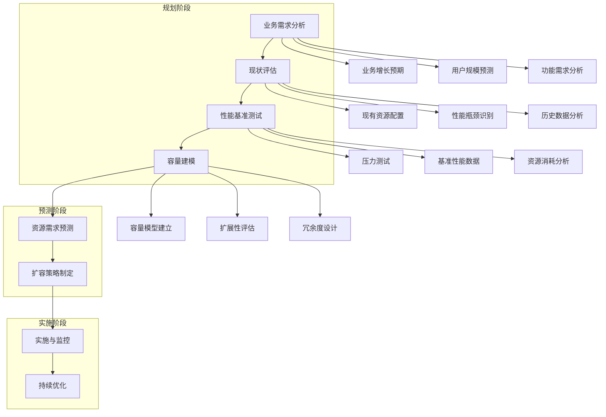

# 如何进行容量规划？

## 概要回答

容量规划是确保系统能够满足当前和未来业务需求的关键过程。主要包括：业务需求分析、性能基准测试、资源需求预测、扩容策略制定、监控指标设定等。通过历史数据分析、负载测试、趋势预测等方法，合理规划计算、存储、网络等资源，确保系统在高峰期也能稳定运行，同时避免资源浪费。

## 深度解析

### 容量规划流程



### 业务需求分析

#### 1. 业务增长预测

```php
<?php
/**
 * 业务增长预测类
 */
class BusinessGrowthPredictor {
    private $historicalData = [];
    private $growthModels = [];
    
    /**
     * 添加历史数据
     */
    public function addHistoricalData($metric, $dataPoints) {
        if (!isset($this->historicalData[$metric])) {
            $this->historicalData[$metric] = [];
        }
        
        $this->historicalData[$metric] = array_merge($this->historicalData[$metric], $dataPoints);
        ksort($this->historicalData[$metric]); // 按时间排序
    }
    
    /**
     * 线性回归预测
     */
    public function linearRegressionPredict($metric, $futurePeriods = 12) {
        if (!isset($this->historicalData[$metric]) || count($this->historicalData[$metric]) < 2) {
            return null;
        }
        
        $data = $this->historicalData[$metric];
        $n = count($data);
        
        // 计算线性回归参数
        $sumX = 0;
        $sumY = 0;
        $sumXY = 0;
        $sumXX = 0;
        
        $values = array_values($data);
        for ($i = 0; $i < $n; $i++) {
            $x = $i;
            $y = $values[$i];
            $sumX += $x;
            $sumY += $y;
            $sumXY += $x * $y;
            $sumXX += $x * $x;
        }
        
        $slope = ($n * $sumXY - $sumX * $sumY) / ($n * $sumXX - $sumX * $sumX);
        $intercept = ($sumY - $slope * $sumX) / $n;
        
        // 预测未来数据点
        $predictions = [];
        $lastTime = max(array_keys($data));
        
        for ($i = 1; $i <= $futurePeriods; $i++) {
            $time = $lastTime + $i;
            $prediction = $slope * ($n + $i - 1) + $intercept;
            $predictions[$time] = max(0, $prediction); // 确保非负值
        }
        
        return [
            'slope' => $slope,
            'intercept' => $intercept,
            'predictions' => $predictions,
            'model' => 'linear_regression'
        ];
    }
    
    /**
     * 指数平滑预测
     */
    public function exponentialSmoothingPredict($metric, $alpha = 0.3, $futurePeriods = 12) {
        if (!isset($this->historicalData[$metric]) || count($this->historicalData[$metric]) < 2) {
            return null;
        }
        
        $data = array_values($this->historicalData[$metric]);
        $n = count($data);
        
        // 初始化平滑值
        $smoothed = [$data[0]];
        
        // 计算指数平滑值
        for ($i = 1; $i < $n; $i++) {
            $smoothed[$i] = $alpha * $data[$i] + (1 - $alpha) * $smoothed[$i - 1];
        }
        
        // 预测未来值
        $predictions = [];
        $lastTime = max(array_keys($this->historicalData[$metric]));
        $lastSmoothed = end($smoothed);
        
        for ($i = 1; $i <= $futurePeriods; $i++) {
            $time = $lastTime + $i;
            $predictions[$time] = $lastSmoothed; // 简单重复最后一个平滑值
        }
        
        return [
            'alpha' => $alpha,
            'smoothed_values' => $smoothed,
            'predictions' => $predictions,
            'model' => 'exponential_smoothing'
        ];
    }
    
    /**
     * 季节性分解预测
     */
    public function seasonalDecompositionPredict($metric, $seasonalPeriod = 12, $futurePeriods = 12) {
        if (!isset($this->historicalData[$metric]) || count($this->historicalData[$metric]) < $seasonalPeriod * 2) {
            return null;
        }
        
        $data = array_values($this->historicalData[$metric]);
        $n = count($data);
        
        // 计算季节性因子
        $seasonalFactors = array_fill(0, $seasonalPeriod, 0);
        $seasonalCounts = array_fill(0, $seasonalPeriod, 0);
        
        // 计算移动平均以去除趋势
        $trendRemoved = [];
        for ($i = 0; $i < $n; $i++) {
            $seasonIdx = $i % $seasonalPeriod;
            $seasonalFactors[$seasonIdx] += $data[$i];
            $seasonalCounts[$seasonIdx]++;
        }
        
        // 计算平均季节性因子
        for ($i = 0; $i < $seasonalPeriod; $i++) {
            if ($seasonalCounts[$i] > 0) {
                $seasonalFactors[$i] = $seasonalFactors[$i] / $seasonalCounts[$i];
            }
        }
        
        // 计算整体平均值并标准化季节性因子
        $overallAverage = array_sum($seasonalFactors) / count($seasonalFactors);
        for ($i = 0; $i < $seasonalPeriod; $i++) {
            $seasonalFactors[$i] = $seasonalFactors[$i] / $overallAverage;
        }
        
        // 预测未来值
        $predictions = [];
        $lastTime = max(array_keys($this->historicalData[$metric]));
        
        // 使用最后一个值作为基础预测
        $baseValue = end($data);
        
        for ($i = 1; $i <= $futurePeriods; $i++) {
            $time = $lastTime + $i;
            $seasonIdx = ($n + $i - 1) % $seasonalPeriod;
            $predictions[$time] = $baseValue * $seasonalFactors[$seasonIdx];
        }
        
        return [
            'seasonal_factors' => $seasonalFactors,
            'predictions' => $predictions,
            'model' => 'seasonal_decomposition'
        ];
    }
    
    /**
     * 综合预测（结合多种模型）
     */
    public function ensemblePredict($metric, $futurePeriods = 12) {
        $predictions = [];
        
        // 获取各种模型的预测结果
        $linearPred = $this->linearRegressionPredict($metric, $futurePeriods);
        $expPred = $this->exponentialSmoothingPredict($metric, 0.3, $futurePeriods);
        $seasonalPred = $this->seasonalDecompositionPredict($metric, 12, $futurePeriods);
        
        if ($linearPred && $expPred && $seasonalPred) {
            $timePoints = array_keys($linearPred['predictions']);
            
            foreach ($timePoints as $time) {
                // 简单平均三种模型的预测结果
                $avgPrediction = (
                    $linearPred['predictions'][$time] +
                    $expPred['predictions'][$time] +
                    $seasonalPred['predictions'][$time]
                ) / 3;
                
                $predictions[$time] = $avgPrediction;
            }
        }
        
        return [
            'predictions' => $predictions,
            'models' => [
                'linear_regression' => $linearPred,
                'exponential_smoothing' => $expPred,
                'seasonal_decomposition' => $seasonalPred
            ],
            'model' => 'ensemble'
        ];
    }
    
    /**
     * 获取预测置信区间
     */
    public function getConfidenceInterval($metric, $confidenceLevel = 0.95) {
        if (!isset($this->historicalData[$metric])) {
            return null;
        }
        
        $data = array_values($this->historicalData[$metric]);
        $n = count($data);
        
        if ($n < 2) {
            return null;
        }
        
        // 计算均值和标准差
        $mean = array_sum($data) / $n;
        $variance = 0;
        foreach ($data as $value) {
            $variance += pow($value - $mean, 2);
        }
        $stdDev = sqrt($variance / ($n - 1));
        
        // 计算置信区间（使用正态分布近似）
        $zScore = $this->getZScore($confidenceLevel);
        $marginOfError = $zScore * ($stdDev / sqrt($n));
        
        return [
            'mean' => $mean,
            'std_dev' => $stdDev,
            'lower_bound' => $mean - $marginOfError,
            'upper_bound' => $mean + $marginOfError,
            'confidence_level' => $confidenceLevel
        ];
    }
    
    /**
     * 获取Z分数
     */
    private function getZScore($confidenceLevel) {
        $zScores = [
            0.80 => 1.28,
            0.85 => 1.44,
            0.90 => 1.645,
            0.95 => 1.96,
            0.99 => 2.576
        ];
        
        return $zScores[$confidenceLevel] ?? 1.96;
    }
    
    /**
     * 获取历史数据统计
     */
    public function getHistoricalStats($metric) {
        if (!isset($this->historicalData[$metric])) {
            return null;
        }
        
        $data = array_values($this->historicalData[$metric]);
        $n = count($data);
        
        if ($n == 0) {
            return null;
        }
        
        sort($data);
        
        return [
            'count' => $n,
            'min' => min($data),
            'max' => max($data),
            'mean' => array_sum($data) / $n,
            'median' => $n % 2 == 0 ? 
                ($data[$n/2 - 1] + $data[$n/2]) / 2 : 
                $data[floor($n/2)],
            'percentile_90' => $data[min(floor($n * 0.9), $n - 1)],
            'percentile_95' => $data[min(floor($n * 0.95), $n - 1)],
            'percentile_99' => $data[min(floor($n * 0.99), $n - 1)]
        ];
    }
}

// 使用示例
$predictor = new BusinessGrowthPredictor();

// 添加用户数量历史数据（按月）
$userData = [
    strtotime('2023-01-01') => 10000,
    strtotime('2023-02-01') => 12000,
    strtotime('2023-03-01') => 14500,
    strtotime('2023-04-01') => 16800,
    strtotime('2023-05-01') => 19200,
    strtotime('2023-06-01') => 22100,
    strtotime('2023-07-01') => 25300,
    strtotime('2023-08-01') => 28900,
    strtotime('2023-09-01') => 32100,
    strtotime('2023-10-01') => 35600,
    strtotime('2023-11-01') => 39800,
    strtotime('2023-12-01') => 44200,
    strtotime('2024-01-01') => 48900,
    strtotime('2024-02-01') => 53800,
    strtotime('2024-03-01') => 59200,
    strtotime('2024-04-01') => 64800,
    strtotime('2024-05-01') => 70900,
    strtotime('2024-06-01') => 77500
];

$predictor->addHistoricalData('user_count', $userData);

// 获取历史统计数据
$userStats = $predictor->getHistoricalStats('user_count');
echo "用户数量历史统计:\n";
echo "  总记录数: {$userStats['count']}\n";
echo "  最小值: " . number_format($userStats['min']) . "\n";
echo "  最大值: " . number_format($userStats['max']) . "\n";
echo "  平均值: " . number_format($userStats['mean']) . "\n";
echo "  中位数: " . number_format($userStats['median']) . "\n";
echo "  90百分位: " . number_format($userStats['percentile_90']) . "\n";
echo "  95百分位: " . number_format($userStats['percentile_95']) . "\n";
echo "  99百分位: " . number_format($userStats['percentile_99']) . "\n\n";

// 线性回归预测
$linearPred = $predictor->linearRegressionPredict('user_count', 12);
echo "线性回归预测 (未来12个月):\n";
foreach (array_slice($linearPred['predictions'], 0, 6) as $time => $prediction) {
    $date = date('Y-m', $time);
    echo "  $date: " . number_format($prediction, 0) . " 用户\n";
}
echo "\n";

// 指数平滑预测
$expPred = $predictor->exponentialSmoothingPredict('user_count', 0.3, 12);
echo "指数平滑预测 (未来12个月):\n";
foreach (array_slice($expPred['predictions'], 0, 6) as $time => $prediction) {
    $date = date('Y-m', $time);
    echo "  $date: " . number_format($prediction, 0) . " 用户\n";
}
echo "\n";

// 综合预测
$ensemblePred = $predictor->ensemblePredict('user_count', 12);
echo "综合预测 (未来12个月):\n";
foreach (array_slice($ensemblePred['predictions'], 0, 6) as $time => $prediction) {
    $date = date('Y-m', $time);
    echo "  $date: " . number_format($prediction, 0) . " 用户\n";
}
echo "\n";

// 置信区间
$confidence = $predictor->getConfidenceInterval('user_count', 0.95);
echo "95%置信区间:\n";
echo "  下限: " . number_format($confidence['lower_bound'], 0) . "\n";
echo "  均值: " . number_format($confidence['mean'], 0) . "\n";
echo "  上限: " . number_format($confidence['upper_bound'], 0) . "\n";
```

#### 2. 业务场景建模

```php
<?php
/**
 * 业务场景建模类
 */
class BusinessScenarioModeler {
    private $scenarios = [];
    private $resourceMappings = [];
    
    /**
     * 添加业务场景
     */
    public function addScenario($scenarioName, $description, $characteristics) {
        $this->scenarios[$scenarioName] = [
            'name' => $scenarioName,
            'description' => $description,
            'characteristics' => $characteristics,
            'resource_requirements' => []
        ];
    }
    
    /**
     * 定义资源映射关系
     */
    public function defineResourceMapping($scenario, $metric, $resource, $ratio) {
        if (!isset($this->resourceMappings[$scenario])) {
            $this->resourceMappings[$scenario] = [];
        }
        
        $this->resourceMappings[$scenario][$metric] = [
            'resource' => $resource,
            'ratio' => $ratio // 每单位指标需要的资源量
        ];
    }
    
    /**
     * 计算资源需求
     */
    public function calculateResourceRequirements($scenario, $predictedMetrics) {
        if (!isset($this->scenarios[$scenario])) {
            throw new Exception("未知的业务场景: $scenario");
        }
        
        if (!isset($this->resourceMappings[$scenario])) {
            throw new Exception("未定义资源映射关系: $scenario");
        }
        
        $requirements = [];
        
        foreach ($this->resourceMappings[$scenario] as $metric => $mapping) {
            if (!isset($predictedMetrics[$metric])) {
                continue;
            }
            
            $predictedValue = $predictedMetrics[$metric];
            $resource = $mapping['resource'];
            $ratio = $mapping['ratio'];
            
            $requiredAmount = $predictedValue * $ratio;
            
            if (!isset($requirements[$resource])) {
                $requirements[$resource] = 0;
            }
            
            $requirements[$resource] += $requiredAmount;
        }
        
        // 保存计算结果
        $this->scenarios[$scenario]['resource_requirements'] = $requirements;
        
        return $requirements;
    }
    
    /**
     * 获取场景详情
     */
    public function getScenarioDetails($scenario) {
        return $this->scenarios[$scenario] ?? null;
    }
    
    /**
     * 比较不同场景的资源需求
     */
    public function compareScenarios($scenarios) {
        $comparison = [];
        
        foreach ($scenarios as $scenario) {
            if (isset($this->scenarios[$scenario])) {
                $comparison[$scenario] = $this->scenarios[$scenario]['resource_requirements'];
            }
        }
        
        return $comparison;
    }
    
    /**
     * 生成容量规划报告
     */
    public function generateCapacityPlan($timeHorizon = '12 months') {
        $plan = [
            'generated_at' => date('Y-m-d H:i:s'),
            'time_horizon' => $timeHorizon,
            'scenarios' => [],
            'total_requirements' => [],
            'recommendations' => []
        ];
        
        // 汇总所有场景的资源需求
        $totalResources = [];
        
        foreach ($this->scenarios as $scenarioName => $scenario) {
            $plan['scenarios'][$scenarioName] = [
                'description' => $scenario['description'],
                'requirements' => $scenario['resource_requirements']
            ];
            
            // 累加资源需求
            foreach ($scenario['resource_requirements'] as $resource => $amount) {
                if (!isset($totalResources[$resource])) {
                    $totalResources[$resource] = 0;
                }
                $totalResources[$resource] += $amount;
            }
        }
        
        $plan['total_requirements'] = $totalResources;
        
        // 生成建议
        $plan['recommendations'] = $this->generateRecommendations($totalResources);
        
        return $plan;
    }
    
    /**
     * 生成建议
     */
    private function generateRecommendations($totalResources) {
        $recommendations = [];
        
        foreach ($totalResources as $resource => $amount) {
            $currentCapacity = $this->getCurrentCapacity($resource);
            
            if ($amount > $currentCapacity) {
                $shortfall = $amount - $currentCapacity;
                $increasePercent = ($shortfall / $currentCapacity) * 100;
                
                $recommendations[] = [
                    'type' => 'capacity_increase',
                    'resource' => $resource,
                    'current_capacity' => $currentCapacity,
                    'required_amount' => $amount,
                    'shortfall' => $shortfall,
                    'increase_percent' => round($increasePercent, 2),
                    'priority' => $increasePercent > 50 ? 'high' : ($increasePercent > 20 ? 'medium' : 'low'),
                    'action' => "建议增加 " . round($increasePercent, 1) . "% 的 $resource 容量"
                ];
            }
        }
        
        return $recommendations;
    }
    
    /**
     * 获取当前容量（模拟数据）
     */
    private function getCurrentCapacity($resource) {
        $capacities = [
            'cpu_cores' => 100,
            'memory_gb' => 500,
            'storage_tb' => 10,
            'network_bandwidth_gbps' => 10,
            'database_connections' => 1000,
            'concurrent_users' => 50000
        ];
        
        return $capacities[$resource] ?? 0;
    }
}

// 使用示例
$modeler = new BusinessScenarioModeler();

// 定义业务场景
$modeler->addScenario('normal_growth', '正常业务增长场景', [
    'growth_rate' => '15% annually',
    'user_base' => 'stable',
    'feature_set' => 'existing_features'
]);

$modeler->addScenario('rapid_expansion', '快速扩张场景', [
    'growth_rate' => '50% annually',
    'user_base' => 'rapid_growth',
    'feature_set' => 'new_features_added'
]);

$modeler->addScenario('marketing_campaign', '大型营销活动场景', [
    'growth_rate' => 'spike_traffic',
    'user_base' => 'temporary_spike',
    'feature_set' => 'existing_features'
]);

// 定义资源映射关系
$modeler->defineResourceMapping('normal_growth', 'user_count', 'concurrent_users', 0.1);
$modeler->defineResourceMapping('normal_growth', 'user_count', 'cpu_cores', 0.002);
$modeler->defineResourceMapping('normal_growth', 'user_count', 'memory_gb', 0.01);
$modeler->defineResourceMapping('normal_growth', 'user_count', 'database_connections', 0.05);

$modeler->defineResourceMapping('rapid_expansion', 'user_count', 'concurrent_users', 0.15);
$modeler->defineResourceMapping('rapid_expansion', 'user_count', 'cpu_cores', 0.003);
$modeler->defineResourceMapping('rapid_expansion', 'user_count', 'memory_gb', 0.015);
$modeler->defineResourceMapping('rapid_expansion', 'user_count', 'database_connections', 0.08);

$modeler->defineResourceMapping('marketing_campaign', 'user_count', 'concurrent_users', 0.2);
$modeler->defineResourceMapping('marketing_campaign', 'user_count', 'cpu_cores', 0.004);
$modeler->defineResourceMapping('marketing_campaign', 'user_count', 'memory_gb', 0.02);
$modeler->defineResourceMapping('marketing_campaign', 'user_count', 'database_connections', 0.1);

// 模拟预测指标
$predictedMetrics = [
    'user_count' => 100000 // 预测用户数
];

// 计算各场景资源需求
$scenarios = ['normal_growth', 'rapid_expansion', 'marketing_campaign'];
foreach ($scenarios as $scenario) {
    try {
        $requirements = $modeler->calculateResourceRequirements($scenario, $predictedMetrics);
        echo "场景 {$scenario} 的资源需求:\n";
        foreach ($requirements as $resource => $amount) {
            echo "  {$resource}: " . round($amount, 2) . "\n";
        }
        echo "\n";
    } catch (Exception $e) {
        echo "计算场景 {$scenario} 资源需求时出错: " . $e->getMessage() . "\n\n";
    }
}

// 比较不同场景
$comparison = $modeler->compareScenarios($scenarios);
echo "不同场景资源需求对比:\n";
$resources = ['concurrent_users', 'cpu_cores', 'memory_gb', 'database_connections'];
foreach ($resources as $resource) {
    echo "  {$resource}:\n";
    foreach ($scenarios as $scenario) {
        $amount = $comparison[$scenario][$resource] ?? 0;
        echo "    {$scenario}: " . round($amount, 2) . "\n";
    }
}
echo "\n";

// 生成容量规划报告
$capacityPlan = $modeler->generateCapacityPlan('12 months');
echo "容量规划报告:\n";
echo "生成时间: {$capacityPlan['generated_at']}\n";
echo "时间范围: {$capacityPlan['time_horizon']}\n\n";

echo "总资源需求:\n";
foreach ($capacityPlan['total_requirements'] as $resource => $amount) {
    echo "  {$resource}: " . round($amount, 2) . "\n";
}
echo "\n";

echo "容量建议:\n";
foreach ($capacityPlan['recommendations'] as $recommendation) {
    echo "  [{$recommendation['priority']}] {$recommendation['action']}\n";
    echo "    当前容量: {$recommendation['current_capacity']}\n";
    echo "    需要容量: " . round($recommendation['required_amount'], 2) . "\n";
    echo "    缺口: " . round($recommendation['shortfall'], 2) . "\n\n";
}
```

### 性能基准测试

#### 1. 负载测试框架

```php
<?php
/**
 * 负载测试框架
 */
class LoadTester {
    private $testScenarios = [];
    private $testResults = [];
    
    /**
     * 添加测试场景
     */
    public function addScenario($name, $config) {
        $this->testScenarios[$name] = $config;
    }
    
    /**
     * 执行负载测试
     */
    public function runLoadTest($scenarioName, $concurrentUsers, $durationSeconds) {
        if (!isset($this->testScenarios[$scenarioName])) {
            throw new Exception("未知的测试场景: $scenarioName");
        }
        
        $scenario = $this->testScenarios[$scenarioName];
        $startTime = time();
        $endTime = $startTime + $durationSeconds;
        
        echo "开始执行负载测试: $scenarioName\n";
        echo "并发用户数: $concurrentUsers\n";
        echo "测试时长: $durationSeconds 秒\n\n";
        
        // 初始化统计信息
        $stats = [
            'total_requests' => 0,
            'successful_requests' => 0,
            'failed_requests' => 0,
            'total_response_time' => 0,
            'response_times' => [],
            'errors' => [],
            'throughput' => 0
        ];
        
        // 创建并发用户
        $users = [];
        for ($i = 0; $i < $concurrentUsers; $i++) {
            $users[] = new TestUser($scenario, $i);
        }
        
        // 执行测试
        while (time() < $endTime) {
            // 并发执行用户请求
            $requests = [];
            foreach ($users as $user) {
                $requests[] = $user->makeRequest();
            }
            
            // 处理响应
            foreach ($requests as $request) {
                $stats['total_requests']++;
                
                if ($request['success']) {
                    $stats['successful_requests']++;
                    $stats['total_response_time'] += $request['response_time'];
                    $stats['response_times'][] = $request['response_time'];
                } else {
                    $stats['failed_requests']++;
                    $stats['errors'][] = $request['error'];
                }
            }
            
            // 小延迟避免过度占用CPU
            usleep(10000); // 10ms
        }
        
        // 计算最终统计
        $actualDuration = time() - $startTime;
        $stats['throughput'] = $stats['total_requests'] / $actualDuration;
        
        if (!empty($stats['response_times'])) {
            sort($stats['response_times']);
            $stats['min_response_time'] = min($stats['response_times']);
            $stats['max_response_time'] = max($stats['response_times']);
            $stats['avg_response_time'] = $stats['total_response_time'] / $stats['successful_requests'];
            $stats['median_response_time'] = $this->calculateMedian($stats['response_times']);
            $stats['p95_response_time'] = $this->calculatePercentile($stats['response_times'], 95);
            $stats['p99_response_time'] = $this->calculatePercentile($stats['response_times'], 99);
        }
        
        $stats['error_rate'] = $stats['total_requests'] > 0 ? 
            ($stats['failed_requests'] / $stats['total_requests']) * 100 : 0;
        
        // 保存结果
        $this->testResults[$scenarioName] = [
            'scenario' => $scenarioName,
            'concurrent_users' => $concurrentUsers,
            'duration' => $actualDuration,
            'stats' => $stats,
            'timestamp' => date('Y-m-d H:i:s')
        ];
        
        return $this->testResults[$scenarioName];
    }
    
    /**
     * 计算中位数
     */
    private function calculateMedian($array) {
        $count = count($array);
        if ($count == 0) return 0;
        
        $middle = floor($count / 2);
        if ($count % 2) {
            return $array[$middle];
        } else {
            return ($array[$middle-1] + $array[$middle]) / 2;
        }
    }
    
    /**
     * 计算百分位数
     */
    private function calculatePercentile($array, $percentile) {
        $count = count($array);
        if ($count == 0) return 0;
        
        $index = ($percentile / 100) * ($count - 1);
        if (floor($index) == $index) {
            return $array[$index];
        } else {
            $lower = $array[floor($index)];
            $upper = $array[ceil($index)];
            return $lower + ($upper - $lower) * ($index - floor($index));
        }
    }
    
    /**
     * 获取测试结果
     */
    public function getTestResults($scenarioName = null) {
        if ($scenarioName) {
            return $this->testResults[$scenarioName] ?? null;
        }
        return $this->testResults;
    }
    
    /**
     * 生成测试报告
     */
    public function generateReport($scenarioName = null) {
        $results = $scenarioName ? 
            [$scenarioName => $this->getTestResults($scenarioName)] : 
            $this->getTestResults();
        
        $report = [
            'generated_at' => date('Y-m-d H:i:s'),
            'results' => $results,
            'summary' => []
        ];
        
        foreach ($results as $name => $result) {
            if ($result) {
                $stats = $result['stats'];
                $report['summary'][$name] = [
                    'concurrent_users' => $result['concurrent_users'],
                    'total_requests' => $stats['total_requests'],
                    'successful_requests' => $stats['successful_requests'],
                    'error_rate' => round($stats['error_rate'], 2),
                    'avg_response_time' => round($stats['avg_response_time'] ?? 0, 2),
                    'p95_response_time' => round($stats['p95_response_time'] ?? 0, 2),
                    'p99_response_time' => round($stats['p99_response_time'] ?? 0, 2),
                    'throughput' => round($stats['throughput'], 2)
                ];
            }
        }
        
        return $report;
    }
}

/**
 * 测试用户类
 */
class TestUser {
    private $scenario;
    private $userId;
    
    public function __construct($scenario, $userId) {
        $this->scenario = $scenario;
        $this->userId = $userId;
    }
    
    /**
     * 发起请求
     */
    public function makeRequest() {
        $startTime = microtime(true);
        
        // 模拟HTTP请求
        $success = $this->simulateHttpRequest();
        $responseTime = (microtime(true) - $startTime) * 1000; // 转换为毫秒
        
        if ($success) {
            return [
                'success' => true,
                'response_time' => $responseTime,
                'error' => null
            ];
        } else {
            return [
                'success' => false,
                'response_time' => $responseTime,
                'error' => 'Request failed'
            ];
        }
    }
    
    /**
     * 模拟HTTP请求
     */
    private function simulateHttpRequest() {
        // 模拟网络延迟和处理时间
        $processingTime = rand(50, 500); // 50-500ms
        usleep($processingTime * 1000); // 转换为微秒
        
        // 模拟成功率
        return rand(1, 100) > 5; // 95%成功率
    }
}

// 使用示例
$loadTester = new LoadTester();

// 定义测试场景
$loadTester->addScenario('user_login', [
    'endpoint' => '/api/login',
    'method' => 'POST',
    'headers' => ['Content-Type' => 'application/json'],
    'payload' => ['username' => 'testuser', 'password' => 'testpass']
]);

$loadTester->addScenario('get_user_profile', [
    'endpoint' => '/api/users/profile',
    'method' => 'GET',
    'headers' => ['Authorization' => 'Bearer token123']
]);

$loadTester->addScenario('place_order', [
    'endpoint' => '/api/orders',
    'method' => 'POST',
    'headers' => ['Content-Type' => 'application/json', 'Authorization' => 'Bearer token123'],
    'payload' => [
        'items' => [
            ['product_id' => 1, 'quantity' => 2],
            ['product_id' => 2, 'quantity' => 1]
        ],
        'shipping_address' => '123 Main St'
    ]
]);

// 执行负载测试
$scenarios = ['user_login', 'get_user_profile', 'place_order'];
$concurrentUsers = [10, 50, 100];
$duration = 30; // 30秒

foreach ($scenarios as $scenario) {
    foreach ($concurrentUsers as $users) {
        try {
            $result = $loadTester->runLoadTest($scenario, $users, $duration);
            echo "测试完成: $scenario (并发用户: $users)\n";
            echo "总请求数: {$result['stats']['total_requests']}\n";
            echo "成功请求数: {$result['stats']['successful_requests']}\n";
            echo "错误率: " . round($result['stats']['error_rate'], 2) . "%\n";
            echo "平均响应时间: " . round($result['stats']['avg_response_time'], 2) . "ms\n";
            echo "P95响应时间: " . round($result['stats']['p95_response_time'], 2) . "ms\n";
            echo "P99响应时间: " . round($result['stats']['p99_response_time'], 2) . "ms\n";
            echo "吞吐量: " . round($result['stats']['throughput'], 2) . " req/s\n\n";
        } catch (Exception $e) {
            echo "执行测试 $scenario 时出错: " . $e->getMessage() . "\n\n";
        }
    }
}

// 生成测试报告
$report = $loadTester->generateReport();
echo "负载测试报告:\n";
echo "生成时间: {$report['generated_at']}\n\n";

echo "测试摘要:\n";
foreach ($report['summary'] as $scenario => $summary) {
    echo "  {$scenario} (并发: {$summary['concurrent_users']}):\n";
    echo "    吞吐量: {$summary['throughput']} req/s\n";
    echo "    错误率: {$summary['error_rate']}%\n";
    echo "    平均响应时间: {$summary['avg_response_time']}ms\n";
    echo "    P95响应时间: {$summary['p95_response_time']}ms\n";
    echo "    P99响应时间: {$summary['p99_response_time']}ms\n\n";
}
```

#### 2. 资源消耗分析

```php
<?php
/**
 * 资源消耗分析器
 */
class ResourceConsumptionAnalyzer {
    private $metrics = [];
    private $baselines = [];
    
    /**
     * 记录资源消耗指标
     */
    public function recordMetrics($operation, $metrics) {
        if (!isset($this->metrics[$operation])) {
            $this->metrics[$operation] = [];
        }
        
        $metrics['timestamp'] = microtime(true);
        $this->metrics[$operation][] = $metrics;
    }
    
    /**
     * 设置基线指标
     */
    public function setBaseline($operation, $baselineMetrics) {
        $this->baselines[$operation] = $baselineMetrics;
    }
    
    /**
     * 分析资源消耗
     */
    public function analyzeConsumption($operation, $timeWindow = 3600) {
        if (!isset($this->metrics[$operation])) {
            return null;
        }
        
        $now = microtime(true);
        $windowStart = $now - $timeWindow;
        
        // 过滤时间窗口内的数据
        $relevantMetrics = array_filter($this->metrics[$operation], function($metric) use ($windowStart) {
            return $metric['timestamp'] >= $windowStart;
        });
        
        if (empty($relevantMetrics)) {
            return null;
        }
        
        // 计算各项指标的统计信息
        $analysis = [
            'operation' => $operation,
            'sample_count' => count($relevantMetrics),
            'averages' => [],
            'medians' => [],
            'percentiles' => [],
            'trends' => []
        ];
        
        // 定义要分析的指标
        $metricKeys = ['cpu_usage', 'memory_usage', 'execution_time', 'database_queries', 'network_io'];
        
        foreach ($metricKeys as $key) {
            $values = array_column($relevantMetrics, $key);
            
            if (!empty($values)) {
                // 计算平均值
                $analysis['averages'][$key] = array_sum($values) / count($values);
                
                // 计算中位数
                sort($values);
                $analysis['medians'][$key] = $this->calculateMedian($values);
                
                // 计算百分位数
                $analysis['percentiles'][$key] = [
                    'p50' => $this->calculatePercentile($values, 50),
                    'p90' => $this->calculatePercentile($values, 90),
                    'p95' => $this->calculatePercentile($values, 95),
                    'p99' => $this->calculatePercentile($values, 99)
                ];
            }
        }
        
        // 分析趋势
        $analysis['trends'] = $this->analyzeTrends($relevantMetrics);
        
        // 与基线比较
        if (isset($this->baselines[$operation])) {
            $analysis['baseline_comparison'] = $this->compareWithBaseline($operation, $analysis['averages']);
        }
        
        return $analysis;
    }
    
    /**
     * 计算中位数
     */
    private function calculateMedian($array) {
        $count = count($array);
        if ($count == 0) return 0;
        
        $middle = floor($count / 2);
        if ($count % 2) {
            return $array[$middle];
        } else {
            return ($array[$middle-1] + $array[$middle]) / 2;
        }
    }
    
    /**
     * 计算百分位数
     */
    private function calculatePercentile($array, $percentile) {
        $count = count($array);
        if ($count == 0) return 0;
        
        $index = ($percentile / 100) * ($count - 1);
        if (floor($index) == $index) {
            return $array[$index];
        } else {
            $lower = $array[floor($index)];
            $upper = $array[ceil($index)];
            return $lower + ($upper - $lower) * ($index - floor($index));
        }
    }
    
    /**
     * 分析趋势
     */
    private function analyzeTrends($metrics) {
        if (count($metrics) < 2) {
            return [];
        }
        
        // 按时间排序
        usort($metrics, function($a, $b) {
            return $a['timestamp'] - $b['timestamp'];
        });
        
        $trends = [];
        $metricKeys = ['cpu_usage', 'memory_usage', 'execution_time'];
        
        foreach ($metricKeys as $key) {
            $values = array_column($metrics, $key);
            if (count($values) < 2) continue;
            
            // 计算线性趋势
            $n = count($values);
            $sumX = 0;
            $sumY = 0;
            $sumXY = 0;
            $sumXX = 0;
            
            for ($i = 0; $i < $n; $i++) {
                $x = $i;
                $y = $values[$i];
                $sumX += $x;
                $sumY += $y;
                $sumXY += $x * $y;
                $sumXX += $x * $x;
            }
            
            $slope = ($n * $sumXY - $sumX * $sumY) / ($n * $sumXX - $sumX * $sumX);
            
            $trends[$key] = [
                'slope' => $slope,
                'direction' => $slope > 0 ? 'increasing' : ($slope < 0 ? 'decreasing' : 'stable')
            ];
        }
        
        return $trends;
    }
    
    /**
     * 与基线比较
     */
    private function compareWithBaseline($operation, $currentAverages) {
        if (!isset($this->baselines[$operation])) {
            return [];
        }
        
        $baseline = $this->baselines[$operation];
        $comparison = [];
        
        foreach ($currentAverages as $key => $currentValue) {
            if (isset($baseline[$key])) {
                $baselineValue = $baseline[$key];
                $difference = $currentValue - $baselineValue;
                $percentageChange = $baselineValue > 0 ? ($difference / $baselineValue) * 100 : 0;
                
                $comparison[$key] = [
                    'current' => $currentValue,
                    'baseline' => $baselineValue,
                    'difference' => $difference,
                    'percentage_change' => $percentageChange,
                    'status' => abs($percentageChange) > 10 ? 
                        ($percentageChange > 0 ? 'degraded' : 'improved') : 'normal'
                ];
            }
        }
        
        return $comparison;
    }
    
    /**
     * 生成容量模型
     */
    public function generateCapacityModel($operation) {
        $analysis = $this->analyzeConsumption($operation);
        if (!$analysis) {
            return null;
        }
        
        $model = [
            'operation' => $operation,
            'resource_requirements' => [],
            'scaling_factors' => [],
            'bottlenecks' => []
        ];
        
        // 基于资源消耗生成容量模型
        $averages = $analysis['averages'];
        
        // CPU需求模型 (假设每个请求需要的CPU核心数)
        if (isset($averages['cpu_usage'])) {
            $model['resource_requirements']['cpu_cores_per_request'] = $averages['cpu_usage'] / 100;
        }
        
        // 内存需求模型
        if (isset($averages['memory_usage'])) {
            $model['resource_requirements']['memory_mb_per_request'] = $averages['memory_usage'];
        }
        
        // 执行时间模型
        if (isset($averages['execution_time'])) {
            $model['resource_requirements']['execution_time_ms'] = $averages['execution_time'];
        }
        
        // 数据库查询模型
        if (isset($averages['database_queries'])) {
            $model['resource_requirements']['db_queries_per_request'] = $averages['database_queries'];
        }
        
        // 计算扩展因子
        $trends = $analysis['trends'];
        foreach ($trends as $resource => $trend) {
            $model['scaling_factors'][$resource] = [
                'trend_slope' => $trend['slope'],
                'scaling_recommendation' => $trend['slope'] > 0.01 ? 'scale_up' : 
                    ($trend['slope'] < -0.01 ? 'scale_down' : 'stable')
            ];
        }
        
        // 识别瓶颈
        $percentiles = $analysis['percentiles'];
        foreach ($percentiles as $resource => $values) {
            if ($values['p95'] > $values['p50'] * 3) { // 如果P95是P50的3倍以上
                $model['bottlenecks'][] = [
                    'resource' => $resource,
                    'severity' => 'high',
                    'p50' => $values['p50'],
                    'p95' => $values['p95']
                ];
            }
        }
        
        return $model;
    }
    
    /**
     * 获取所有分析结果
     */
    public function getAllAnalysis() {
        $results = [];
        foreach (array_keys($this->metrics) as $operation) {
            $results[$operation] = $this->analyzeConsumption($operation);
        }
        return $results;
    }
}

// 使用示例
$analyzer = new ResourceConsumptionAnalyzer();

// 设置基线指标
$analyzer->setBaseline('user_login', [
    'cpu_usage' => 25.5,
    'memory_usage' => 50,
    'execution_time' => 150,
    'database_queries' => 3,
    'network_io' => 2.5
]);

$analyzer->setBaseline('get_user_profile', [
    'cpu_usage' => 15.2,
    'memory_usage' => 30,
    'execution_time' => 80,
    'database_queries' => 2,
    'network_io' => 1.8
]);

$analyzer->setBaseline('place_order', [
    'cpu_usage' => 45.8,
    'memory_usage' => 120,
    'execution_time' => 320,
    'database_queries' => 8,
    'network_io' => 5.2
]);

// 模拟记录资源消耗指标
$operations = ['user_login', 'get_user_profile', 'place_order'];
$metricsTemplate = [
    'user_login' => ['cpu_usage' => 25, 'memory_usage' => 50, 'execution_time' => 150, 'database_queries' => 3, 'network_io' => 2.5],
    'get_user_profile' => ['cpu_usage' => 15, 'memory_usage' => 30, 'execution_time' => 80, 'database_queries' => 2, 'network_io' => 1.8],
    'place_order' => ['cpu_usage' => 45, 'memory_usage' => 120, 'execution_time' => 320, 'database_queries' => 8, 'network_io' => 5.2]
];

// 生成测试数据
for ($i = 0; $i < 1000; $i++) {
    foreach ($operations as $operation) {
        // 添加一些随机波动
        $metrics = [];
        foreach ($metricsTemplate[$operation] as $key => $value) {
            $variation = $value * (rand(80, 120) / 100); // ±20% 波动
            $metrics[$key] = $variation;
        }
        
        $analyzer->recordMetrics($operation, $metrics);
        
        // 模拟时间间隔
        if ($i % 50 === 0) {
            usleep(10000); // 10ms
        }
    }
}

// 分析资源消耗
foreach ($operations as $operation) {
    $analysis = $analyzer->analyzeConsumption($operation, 3600); // 1小时窗口
    if ($analysis) {
        echo "操作: $operation\n";
        echo "样本数量: {$analysis['sample_count']}\n";
        echo "平均资源消耗:\n";
        foreach ($analysis['averages'] as $key => $value) {
            echo "  {$key}: " . round($value, 2) . "\n";
        }
        echo "中位数:\n";
        foreach ($analysis['medians'] as $key => $value) {
            echo "  {$key}: " . round($value, 2) . "\n";
        }
        echo "趋势分析:\n";
        foreach ($analysis['trends'] as $key => $trend) {
            echo "  {$key}: {$trend['direction']} (斜率: " . round($trend['slope'], 6) . ")\n";
        }
        
        if (isset($analysis['baseline_comparison'])) {
            echo "基线比较:\n";
            foreach ($analysis['baseline_comparison'] as $key => $comparison) {
                echo "  {$key}: " . round($comparison['percentage_change'], 2) . "% (状态: {$comparison['status']})\n";
            }
        }
        echo "\n";
    }
}

// 生成容量模型
foreach ($operations as $operation) {
    $model = $analyzer->generateCapacityModel($operation);
    if ($model) {
        echo "容量模型: $operation\n";
        echo "资源需求:\n";
        foreach ($model['resource_requirements'] as $key => $value) {
            echo "  {$key}: " . round($value, 4) . "\n";
        }
        echo "扩展因子:\n";
        foreach ($model['scaling_factors'] as $key => $factor) {
            echo "  {$key}: {$factor['scaling_recommendation']}\n";
        }
        echo "瓶颈:\n";
        foreach ($model['bottlenecks'] as $bottleneck) {
            echo "  {$bottleneck['resource']}: 严重程度 {$bottleneck['severity']}\n";
        }
        echo "\n";
    }
}
```

### 扩容策略制定

#### 1. 自动扩容策略

```php
<?php
/**
 * 自动扩容策略管理器
 */
class AutoScalingPolicyManager {
    private $policies = [];
    private $currentMetrics = [];
    private $scalingActions = [];
    
    /**
     * 添加扩容策略
     */
    public function addPolicy($policyName, $config) {
        $this->policies[$policyName] = [
            'name' => $policyName,
            'target' => $config['target'], // 扩容目标（如：服务、资源组）
            'metric' => $config['metric'], // 监控指标
            'threshold' => $config['threshold'], // 阈值
            'comparison' => $config['comparison'], // 比较操作符
            'scale_up' => $config['scale_up'], // 扩容配置
            'scale_down' => $config['scale_down'], // 缩容配置
            'cooldown' => $config['cooldown'] ?? 300, // 冷却时间（秒）
            'enabled' => $config['enabled'] ?? true,
            'last_action_time' => 0
        ];
    }
    
    /**
     * 更新当前指标
     */
    public function updateMetrics($metricName, $value) {
        $this->currentMetrics[$metricName] = $value;
    }
    
    /**
     * 评估扩容策略
     */
    public function evaluatePolicies() {
        $actions = [];
        $now = time();
        
        foreach ($this->policies as $policyName => $policy) {
            if (!$policy['enabled']) {
                continue;
            }
            
            // 检查冷却时间
            if ($now - $policy['last_action_time'] < $policy['cooldown']) {
                continue;
            }
            
            $metricValue = $this->currentMetrics[$policy['metric']] ?? null;
            if ($metricValue === null) {
                continue;
            }
            
            // 评估是否需要扩容或缩容
            $shouldScale = $this->evaluateCondition($metricValue, $policy['threshold'], $policy['comparison']);
            
            if ($shouldScale) {
                $action = $this->determineScalingAction($metricValue, $policy);
                if ($action) {
                    $actions[] = [
                        'policy' => $policyName,
                        'action' => $action,
                        'metric_value' => $metricValue,
                        'threshold' => $policy['threshold']
                    ];
                }
            }
        }
        
        return $actions;
    }
    
    /**
     * 评估条件
     */
    private function evaluateCondition($value, $threshold, $comparison) {
        switch ($comparison) {
            case '>':
                return $value > $threshold;
            case '>=':
                return $value >= $threshold;
            case '<':
                return $value < $threshold;
            case '<=':
                return $value <= $threshold;
            case '=':
            case '==':
                return $value == $threshold;
            default:
                return false;
        }
    }
    
    /**
     * 确定扩容动作
     */
    private function determineScalingAction($metricValue, $policy) {
        if ($policy['comparison'][0] === '>') {
            // 指标过高，需要扩容
            return $policy['scale_up'];
        } elseif ($policy['comparison'][0] === '<') {
            // 指标过低，可能需要缩容
            return $policy['scale_down'];
        }
        return null;
    }
    
    /**
     * 执行扩容动作
     */
    public function executeScalingAction($policyName, $action) {
        $policy = $this->policies[$policyName] ?? null;
        if (!$policy) {
            return false;
        }
        
        echo "执行扩容策略: $policyName\n";
        echo "目标: {$policy['target']}\n";
        echo "动作: " . json_encode($action) . "\n";
        
        // 这里应该是实际的扩容逻辑
        // 例如：调用云服务API、更新容器副本数等
        
        // 记录动作
        $this->scalingActions[] = [
            'policy' => $policyName,
            'action' => $action,
            'timestamp' => time(),
            'status' => 'executed'
        ];
        
        // 更新最后动作时间
        $this->policies[$policyName]['last_action_time'] = time();
        
        return true;
    }
    
    /**
     * 获取策略状态
     */
    public function getPolicyStatus($policyName = null) {
        if ($policyName) {
            return $this->policies[$policyName] ?? null;
        }
        return $this->policies;
    }
    
    /**
     * 获取扩容历史
     */
    public function getScalingHistory($limit = 50) {
        $history = $this->scalingActions;
        usort($history, function($a, $b) {
            return $b['timestamp'] - $a['timestamp'];
        });
        return array_slice($history, 0, $limit);
    }
    
    /**
     * 预测扩容需求
     */
    public function predictScalingNeeds($policyName, $forecastData) {
        $policy = $this->policies[$policyName] ?? null;
        if (!$policy) {
            return null;
        }
        
        $predictions = [];
        
        foreach ($forecastData as $timePoint => $metricValue) {
            $actionNeeded = $this->evaluateCondition($metricValue, $policy['threshold'], $policy['comparison']);
            
            if ($actionNeeded) {
                $action = $this->determineScalingAction($metricValue, $policy);
                $predictions[$timePoint] = [
                    'metric_value' => $metricValue,
                    'action_needed' => true,
                    'recommended_action' => $action
                ];
            } else {
                $predictions[$timePoint] = [
                    'metric_value' => $metricValue,
                    'action_needed' => false
                ];
            }
        }
        
        return [
            'policy' => $policyName,
            'predictions' => $predictions
        ];
    }
}

// 使用示例
$scalingManager = new AutoScalingPolicyManager();

// 添加扩容策略
$scalingManager->addPolicy('web_server_scaling', [
    'target' => 'web-server-group',
    'metric' => 'cpu_utilization',
    'threshold' => 75,
    'comparison' => '>',
    'scale_up' => [
        'type' => 'increase_instances',
        'amount' => 2,
        'max_instances' => 20
    ],
    'scale_down' => [
        'type' => 'decrease_instances',
        'amount' => 1,
        'min_instances' => 3
    ],
    'cooldown' => 300, // 5分钟冷却时间
    'enabled' => true
]);

$scalingManager->addPolicy('database_scaling', [
    'target' => 'database-cluster',
    'metric' => 'memory_utilization',
    'threshold' => 85,
    'comparison' => '>',
    'scale_up' => [
        'type' => 'increase_memory',
        'amount' => '2GB',
        'max_memory' => '64GB'
    ],
    'scale_down' => [
        'type' => 'no_action'
    ],
    'cooldown' => 600, // 10分钟冷却时间
    'enabled' => true
]);

// 模拟监控指标更新
$metrics = [
    'cpu_utilization' => 82.5,
    'memory_utilization' => 88.2,
    'request_rate' => 1250,
    'response_time' => 180
];

foreach ($metrics as $metric => $value) {
    $scalingManager->updateMetrics($metric, $value);
}

// 评估扩容策略
$actions = $scalingManager->evaluatePolicies();
echo "评估结果:\n";
foreach ($actions as $action) {
    echo "策略: {$action['policy']}\n";
    echo "需要执行: " . json_encode($action['action']) . "\n";
    echo "当前指标值: {$action['metric_value']}\n";
    echo "阈值: {$action['threshold']}\n\n";
    
    // 执行扩容动作
    $scalingManager->executeScalingAction($action['policy'], $action['action']);
}

// 获取策略状态
$policyStatus = $scalingManager->getPolicyStatus();
echo "策略状态:\n";
foreach ($policyStatus as $name => $policy) {
    echo "  $name:\n";
    echo "    启用: " . ($policy['enabled'] ? '是' : '否') . "\n";
    echo "    目标: {$policy['target']}\n";
    echo "    监控指标: {$policy['metric']}\n";
    echo "    阈值: {$policy['threshold']}\n";
    echo "    最后动作时间: " . date('Y-m-d H:i:s', $policy['last_action_time']) . "\n\n";
}

// 获取扩容历史
$history = $scalingManager->getScalingHistory(10);
echo "扩容历史 (最近10条):\n";
foreach ($history as $record) {
    echo "  时间: " . date('Y-m-d H:i:s', $record['timestamp']) . "\n";
    echo "  策略: {$record['policy']}\n";
    echo "  动作: " . json_encode($record['action']) . "\n";
    echo "  状态: {$record['status']}\n\n";
}

// 预测扩容需求
$forecastData = [
    time() + 3600 => 78.5,   // 1小时后
    time() + 7200 => 85.2,   // 2小时后
    time() + 10800 => 92.1,  // 3小时后
    time() + 14400 => 76.8,  // 4小时后
    time() + 18000 => 68.4   // 5小时后
];

$prediction = $scalingManager->predictScalingNeeds('web_server_scaling', $forecastData);
echo "扩容需求预测:\n";
echo "策略: {$prediction['policy']}\n";
foreach ($prediction['predictions'] as $time => $pred) {
    echo "  " . date('Y-m-d H:i:s', $time) . ":\n";
    echo "    指标值: {$pred['metric_value']}\n";
    echo "    需要动作: " . ($pred['action_needed'] ? '是' : '否') . "\n";
    if ($pred['action_needed']) {
        echo "    推荐动作: " . json_encode($pred['recommended_action']) . "\n";
    }
    echo "\n";
}
```

通过系统性的容量规划方法，包括业务需求分析、性能基准测试、资源消耗分析和扩容策略制定，可以确保系统具备足够的容量来应对当前和未来的业务需求，同时保持良好的性能和成本效益。