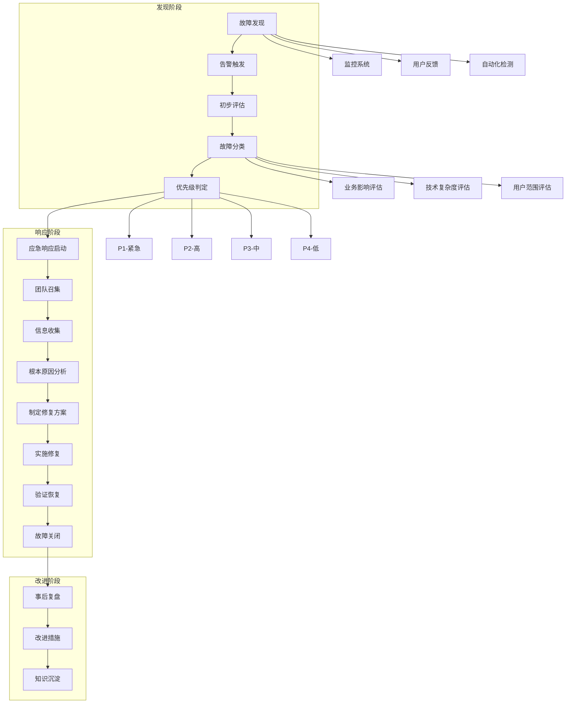

# 故障排查和应急响应流程？

## 概要回答

故障排查和应急响应是保障系统稳定性的关键环节。完整的流程包括：故障发现与告警、初步评估与分类、根本原因分析、修复实施、验证恢复、事后复盘等阶段。建立标准化的应急响应团队（Incident Response Team）、制定详细的故障处理手册、实施自动化监控告警、定期演练和培训，能够显著提升故障处理效率，缩短恢复时间，降低业务影响。

## 深度解析

### 故障响应流程架构



### 故障发现与告警

#### 1. 多层次监控告警

```php
<?php
/**
 * 综合告警管理系统
 */
class ComprehensiveAlertingSystem {
    private $alertRules = [];
    private $activeAlerts = [];
    private $notificationChannels = [];
    private $incidentHistory = [];
    
    /**
     * 添加告警规则
     */
    public function addAlertRule($ruleName, $config) {
        $this->alertRules[$ruleName] = [
            'name' => $ruleName,
            'metric' => $config['metric'],
            'condition' => $config['condition'],
            'threshold' => $config['threshold'],
            'severity' => $config['severity'],
            'notification_channels' => $config['notification_channels'],
            'escalation_policy' => $config['escalation_policy'] ?? [],
            'enabled' => $config['enabled'] ?? true,
            'created_at' => time()
        ];
    }
    
    /**
     * 评估告警条件
     */
    public function evaluateAlertConditions($metrics) {
        $triggeredAlerts = [];
        
        foreach ($this->alertRules as $ruleName => $rule) {
            if (!$rule['enabled']) {
                continue;
            }
            
            $metricValue = $metrics[$rule['metric']] ?? null;
            if ($metricValue === null) {
                continue;
            }
            
            if ($this->evaluateCondition($metricValue, $rule['condition'], $rule['threshold'])) {
                $triggeredAlerts[] = [
                    'rule' => $ruleName,
                    'metric' => $rule['metric'],
                    'value' => $metricValue,
                    'threshold' => $rule['threshold'],
                    'severity' => $rule['severity']
                ];
            }
        }
        
        return $triggeredAlerts;
    }
    
    /**
     * 评估条件表达式
     */
    private function evaluateCondition($value, $condition, $threshold) {
        switch ($condition) {
            case '>':
                return $value > $threshold;
            case '>=':
                return $value >= $threshold;
            case '<':
                return $value < $threshold;
            case '<=':
                return $value <= $threshold;
            case '=':
            case '==':
                return $value == $threshold;
            case '!=':
                return $value != $threshold;
            default:
                return false;
        }
    }
    
    /**
     * 触发告警
     */
    public function triggerAlert($alertData) {
        $alertId = uniqid('alert_');
        $timestamp = time();
        
        $alert = [
            'id' => $alertId,
            'timestamp' => $timestamp,
            'data' => $alertData,
            'status' => 'triggered',
            'acknowledged' => false,
            'resolved' => false
        ];
        
        $this->activeAlerts[$alertId] = $alert;
        
        // 发送通知
        $this->sendNotifications($alertData);
        
        // 记录到历史
        $this->incidentHistory[] = $alert;
        
        return $alertId;
    }
    
    /**
     * 发送通知
     */
    private function sendNotifications($alertData) {
        $severity = $alertData['severity'];
        $channels = $this->getNotificationChannelsForSeverity($severity);
        
        foreach ($channels as $channel) {
            $this->sendNotification($channel, $alertData);
        }
        
        // 启动升级策略
        $this->scheduleEscalation($alertData);
    }
    
    /**
     * 获取指定严重程度的通知渠道
     */
    private function getNotificationChannelsForSeverity($severity) {
        $channelMapping = [
            'critical' => ['sms', 'phone', 'email', 'slack'],
            'high' => ['email', 'slack', 'pagerduty'],
            'medium' => ['slack', 'email'],
            'low' => ['slack']
        ];
        
        return $channelMapping[$severity] ?? ['slack'];
    }
    
    /**
     * 发送单个通知
     */
    private function sendNotification($channel, $alertData) {
        $message = $this->formatAlertMessage($alertData);
        
        switch ($channel) {
            case 'sms':
                $this->sendSMS($message);
                break;
            case 'phone':
                $this->makePhoneCall($message);
                break;
            case 'email':
                $this->sendEmail($message, $alertData);
                break;
            case 'slack':
                $this->sendSlackMessage($message);
                break;
            case 'pagerduty':
                $this->sendPagerDutyAlert($message);
                break;
            default:
                error_log("Unsupported notification channel: $channel");
        }
    }
    
    /**
     * 格式化告警消息
     */
    private function formatAlertMessage($alertData) {
        return sprintf(
            "[%s] %s - %s (值: %s, 阈值: %s)",
            strtoupper($alertData['severity']),
            $alertData['rule'],
            $alertData['metric'],
            $alertData['value'],
            $alertData['threshold']
        );
    }
    
    /**
     * 发送短信
     */
    private function sendSMS($message) {
        // 这里应该是实际的短信发送逻辑
        echo "发送短信: $message\n";
    }
    
    /**
     * 拨打电话
     */
    private function makePhoneCall($message) {
        // 这里应该是实际的电话拨打逻辑
        echo "拨打电话: $message\n";
    }
    
    /**
     * 发送邮件
     */
    private function sendEmail($message, $alertData) {
        $subject = "[{$alertData['severity']}] 系统告警 - {$alertData['rule']}";
        $body = "告警详情:\n";
        $body .= "规则: {$alertData['rule']}\n";
        $body .= "指标: {$alertData['metric']}\n";
        $body .= "当前值: {$alertData['value']}\n";
        $body .= "阈值: {$alertData['threshold']}\n";
        $body .= "时间: " . date('Y-m-d H:i:s', time()) . "\n";
        
        // 这里应该是实际的邮件发送逻辑
        echo "发送邮件 - 主题: $subject\n内容: $body\n";
    }
    
    /**
     * 发送Slack消息
     */
    private function sendSlackMessage($message) {
        // 这里应该是实际的Slack发送逻辑
        echo "发送Slack消息: $message\n";
    }
    
    /**
     * 发送PagerDuty告警
     */
    private function sendPagerDutyAlert($message) {
        // 这里应该是实际的PagerDuty集成逻辑
        echo "发送PagerDuty告警: $message\n";
    }
    
    /**
     * 安排升级策略
     */
    private function scheduleEscalation($alertData) {
        $severity = $alertData['severity'];
        $escalationPolicies = [
            'critical' => [
                ['delay' => 300, 'channels' => ['phone']], // 5分钟后升级
                ['delay' => 600, 'channels' => ['manager_email']] // 10分钟后再次升级
            ],
            'high' => [
                ['delay' => 600, 'channels' => ['team_lead']] // 10分钟后升级
            ]
        ];
        
        $policies = $escalationPolicies[$severity] ?? [];
        
        foreach ($policies as $policy) {
            $this->scheduleDelayedNotification($policy['delay'], $policy['channels'], $alertData);
        }
    }
    
    /**
     * 安排延迟通知
     */
    private function scheduleDelayedNotification($delay, $channels, $alertData) {
        // 这里应该是实际的定时任务安排逻辑
        echo "安排 " . ($delay/60) . " 分钟后发送通知到 " . implode(', ', $channels) . "\n";
    }
    
    /**
     * 确认告警
     */
    public function acknowledgeAlert($alertId, $userId) {
        if (isset($this->activeAlerts[$alertId])) {
            $this->activeAlerts[$alertId]['acknowledged'] = true;
            $this->activeAlerts[$alertId]['acknowledged_by'] = $userId;
            $this->activeAlerts[$alertId]['acknowledged_at'] = time();
            
            echo "告警 $alertId 已被用户 $userId 确认\n";
            return true;
        }
        return false;
    }
    
    /**
     * 解决告警
     */
    public function resolveAlert($alertId, $resolutionNotes = '') {
        if (isset($this->activeAlerts[$alertId])) {
            $this->activeAlerts[$alertId]['resolved'] = true;
            $this->activeAlerts[$alertId]['resolved_at'] = time();
            $this->activeAlerts[$alertId]['resolution_notes'] = $resolutionNotes;
            $this->activeAlerts[$alertId]['status'] = 'resolved';
            
            // 从活跃告警中移除
            unset($this->activeAlerts[$alertId]);
            
            echo "告警 $alertId 已解决\n";
            return true;
        }
        return false;
    }
    
    /**
     * 获取活跃告警
     */
    public function getActiveAlerts() {
        return $this->activeAlerts;
    }
    
    /**
     * 获取告警统计
     */
    public function getAlertStatistics($timeWindow = 3600) {
        $now = time();
        $total = 0;
        $bySeverity = [];
        $resolved = 0;
        
        foreach ($this->incidentHistory as $incident) {
            if ($now - $incident['timestamp'] <= $timeWindow) {
                $total++;
                
                $severity = $incident['data']['severity'];
                if (!isset($bySeverity[$severity])) {
                    $bySeverity[$severity] = 0;
                }
                $bySeverity[$severity]++;
                
                if ($incident['resolved']) {
                    $resolved++;
                }
            }
        }
        
        return [
            'total_alerts' => $total,
            'resolved_alerts' => $resolved,
            'unresolved_alerts' => $total - $resolved,
            'resolution_rate' => $total > 0 ? ($resolved / $total) * 100 : 0,
            'by_severity' => $bySeverity
        ];
    }
}

// 使用示例
$alertingSystem = new ComprehensiveAlertingSystem();

// 添加告警规则
$alertingSystem->addAlertRule('high_cpu_usage', [
    'metric' => 'cpu_utilization',
    'condition' => '>',
    'threshold' => 85,
    'severity' => 'critical',
    'notification_channels' => ['sms', 'email', 'slack']
]);

$alertingSystem->addAlertRule('high_memory_usage', [
    'metric' => 'memory_utilization',
    'condition' => '>',
    'threshold' => 90,
    'severity' => 'high',
    'notification_channels' => ['email', 'slack']
]);

$alertingSystem->addAlertRule('slow_response_time', [
    'metric' => 'response_time_p95',
    'condition' => '>',
    'threshold' => 1000,
    'severity' => 'medium',
    'notification_channels' => ['slack']
]);

// 模拟监控指标数据
$metrics = [
    'cpu_utilization' => 88.5,
    'memory_utilization' => 92.3,
    'response_time_p95' => 1250
];

// 评估告警条件
$triggeredAlerts = $alertingSystem->evaluateAlertConditions($metrics);
echo "触发的告警:\n";
foreach ($triggeredAlerts as $alert) {
    echo "  - {$alert['rule']}: {$alert['metric']} = {$alert['value']} (阈值: {$alert['threshold']}, 严重性: {$alert['severity']})\n";
    
    // 触发告警
    $alertData = [
        'rule' => $alert['rule'],
        'metric' => $alert['metric'],
        'value' => $alert['value'],
        'threshold' => $alert['threshold'],
        'severity' => $alert['severity']
    ];
    
    $alertId = $alertingSystem->triggerAlert($alertData);
    echo "    告警ID: $alertId\n\n";
}

// 获取活跃告警
$activeAlerts = $alertingSystem->getActiveAlerts();
echo "活跃告警数量: " . count($activeAlerts) . "\n\n";

// 确认告警
foreach (array_keys($activeAlerts) as $alertId) {
    $alertingSystem->acknowledgeAlert($alertId, 'ops_engineer_001');
}

// 解决告警
foreach (array_keys($activeAlerts) as $alertId) {
    $alertingSystem->resolveAlert($alertId, '通过扩容解决了CPU使用率过高的问题');
}

// 获取告警统计
$stats = $alertingSystem->getAlertStatistics(3600); // 1小时内
echo "1小时内告警统计:\n";
echo "  总告警数: {$stats['total_alerts']}\n";
echo "  已解决: {$stats['resolved_alerts']}\n";
echo "  未解决: {$stats['unresolved_alerts']}\n";
echo "  解决率: " . round($stats['resolution_rate'], 2) . "%\n";
echo "  按严重性分类:\n";
foreach ($stats['by_severity'] as $severity => $count) {
    echo "    $severity: $count\n";
}
```

#### 2. 智能告警聚合

```php
<?php
/**
 * 智能告警聚合器
 */
class IntelligentAlertAggregator {
    private $alerts = [];
    private $correlationRules = [];
    private $suppressionWindows = [];
    
    /**
     * 添加告警
     */
    public function addAlert($alert) {
        $alert['received_at'] = microtime(true);
        $this->alerts[] = $alert;
        
        // 检查是否可以与其他告警关联
        $correlatedAlerts = $this->findCorrelatedAlerts($alert);
        
        if (!empty($correlatedAlerts)) {
            return $this->handleCorrelatedAlerts($alert, $correlatedAlerts);
        }
        
        // 检查是否在抑制窗口内
        if ($this->isSuppressed($alert)) {
            return ['status' => 'suppressed', 'alert' => $alert];
        }
        
        return ['status' => 'new', 'alert' => $alert];
    }
    
    /**
     * 查找关联告警
     */
    private function findCorrelatedAlerts($newAlert) {
        $correlated = [];
        $timeWindow = 300; // 5分钟时间窗口
        $now = microtime(true);
        
        foreach ($this->alerts as $existingAlert) {
            // 检查时间窗口
            if ($now - $existingAlert['received_at'] > $timeWindow) {
                continue;
            }
            
            // 检查是否关联
            if ($this->areAlertsRelated($newAlert, $existingAlert)) {
                $correlated[] = $existingAlert;
            }
        }
        
        return $correlated;
    }
    
    /**
     * 判断告警是否关联
     */
    private function areAlertsRelated($alert1, $alert2) {
        // 基于服务关联
        if (isset($alert1['service']) && isset($alert2['service'])) {
            if ($alert1['service'] === $alert2['service']) {
                return true;
            }
        }
        
        // 基于主机关联
        if (isset($alert1['host']) && isset($alert2['host'])) {
            if ($alert1['host'] === $alert2['host']) {
                return true;
            }
        }
        
        // 基于错误模式关联
        if (isset($alert1['error_pattern']) && isset($alert2['error_pattern'])) {
            if ($alert1['error_pattern'] === $alert2['error_pattern']) {
                return true;
            }
        }
        
        // 基于因果关系关联
        if ($this->hasCausalRelationship($alert1, $alert2)) {
            return true;
        }
        
        return false;
    }
    
    /**
     * 检查因果关系
     */
    private function hasCausalRelationship($alert1, $alert2) {
        $causalPatterns = [
            ['cause' => 'database_down', 'effect' => 'api_errors'],
            ['cause' => 'network_partition', 'effect' => 'timeout_errors'],
            ['cause' => 'high_cpu', 'effect' => 'slow_response']
        ];
        
        foreach ($causalPatterns as $pattern) {
            if ((isset($alert1['error_type']) && $alert1['error_type'] === $pattern['cause'] &&
                 isset($alert2['error_type']) && $alert2['error_type'] === $pattern['effect']) ||
                (isset($alert1['error_type']) && $alert1['error_type'] === $pattern['effect'] &&
                 isset($alert2['error_type']) && $alert2['error_type'] === $pattern['cause'])) {
                return true;
            }
        }
        
        return false;
    }
    
    /**
     * 处理关联告警
     */
    private function handleCorrelatedAlerts($newAlert, $correlatedAlerts) {
        // 创建告警组
        $alertGroup = [
            'id' => uniqid('group_'),
            'alerts' => array_merge([$newAlert], $correlatedAlerts),
            'created_at' => time(),
            'root_cause_analysis' => $this->analyzeRootCause($correlatedAlerts)
        ];
        
        return [
            'status' => 'grouped',
            'group' => $alertGroup,
            'new_alert' => $newAlert
        ];
    }
    
    /**
     * 分析根本原因
     */
    private function analyzeRootCause($alerts) {
        $causeCount = [];
        
        foreach ($alerts as $alert) {
            $cause = $this->identifyLikelyCause($alert);
            if ($cause) {
                if (!isset($causeCount[$cause])) {
                    $causeCount[$cause] = 0;
                }
                $causeCount[$cause]++;
            }
        }
        
        // 找出最可能的根本原因
        arsort($causeCount);
        $rootCause = key($causeCount);
        
        return [
            'most_likely_cause' => $rootCause,
            'confidence' => round(($causeCount[$rootCause] / count($alerts)) * 100, 2),
            'cause_distribution' => $causeCount
        ];
    }
    
    /**
     * 识别可能的原因
     */
    private function identifyLikelyCause($alert) {
        $errorTypes = [
            'database_connection_failed' => 'database_issue',
            'redis_timeout' => 'cache_issue',
            'disk_full' => 'storage_issue',
            'memory_exhausted' => 'memory_issue',
            'network_unreachable' => 'network_issue'
        ];
        
        if (isset($alert['error_type']) && isset($errorTypes[$alert['error_type']])) {
            return $errorTypes[$alert['error_type']];
        }
        
        return 'unknown';
    }
    
    /**
     * 检查是否在抑制窗口内
     */
    private function isSuppressed($alert) {
        $now = time();
        
        foreach ($this->suppressionWindows as $window) {
            if ($now >= $window['start'] && $now <= $window['end']) {
                if ($this->matchesSuppressionCriteria($alert, $window['criteria'])) {
                    return true;
                }
            }
        }
        
        return false;
    }
    
    /**
     * 检查是否匹配抑制条件
     */
    private function matchesSuppressionCriteria($alert, $criteria) {
        foreach ($criteria as $key => $value) {
            if (!isset($alert[$key]) || $alert[$key] != $value) {
                return false;
            }
        }
        return true;
    }
    
    /**
     * 添加抑制窗口
     */
    public function addSuppressionWindow($startTime, $duration, $criteria) {
        $this->suppressionWindows[] = [
            'start' => $startTime,
            'end' => $startTime + $duration,
            'criteria' => $criteria
        ];
    }
    
    /**
     * 获取告警摘要
     */
    public function getAlertSummary($timeWindow = 3600) {
        $now = microtime(true);
        $summary = [
            'total_alerts' => 0,
            'grouped_alerts' => 0,
            'suppressed_alerts' => 0,
            'unique_alerts' => 0,
            'by_service' => [],
            'by_severity' => [],
            'trend' => []
        ];
        
        foreach ($this->alerts as $alert) {
            if ($now - $alert['received_at'] > $timeWindow) {
                continue;
            }
            
            $summary['total_alerts']++;
            
            // 按服务统计
            if (isset($alert['service'])) {
                if (!isset($summary['by_service'][$alert['service']])) {
                    $summary['by_service'][$alert['service']] = 0;
                }
                $summary['by_service'][$alert['service']]++;
            }
            
            // 按严重性统计
            if (isset($alert['severity'])) {
                if (!isset($summary['by_severity'][$alert['severity']])) {
                    $summary['by_severity'][$alert['severity']] = 0;
                }
                $summary['by_severity'][$alert['severity']]++;
            }
        }
        
        return $summary;
    }
    
    /**
     * 获取重复告警分析
     */
    public function getRepetitionAnalysis($timeWindow = 86400) { // 24小时
        $now = microtime(true);
        $alertPatterns = [];
        
        foreach ($this->alerts as $alert) {
            if ($now - $alert['received_at'] > $timeWindow) {
                continue;
            }
            
            $patternKey = $this->generatePatternKey($alert);
            if (!isset($alertPatterns[$patternKey])) {
                $alertPatterns[$patternKey] = [
                    'pattern' => $patternKey,
                    'count' => 0,
                    'first_seen' => $alert['received_at'],
                    'last_seen' => $alert['received_at'],
                    'sample_alert' => $alert
                ];
            }
            
            $alertPatterns[$patternKey]['count']++;
            $alertPatterns[$patternKey]['last_seen'] = $alert['received_at'];
        }
        
        // 找出高频模式
        usort($alertPatterns, function($a, $b) {
            return $b['count'] - $a['count'];
        });
        
        return array_slice($alertPatterns, 0, 10); // 返回前10个高频模式
    }
    
    /**
     * 生成模式键
     */
    private function generatePatternKey($alert) {
        $keys = ['service', 'error_type', 'host'];
        $patternParts = [];
        
        foreach ($keys as $key) {
            if (isset($alert[$key])) {
                $patternParts[] = "$key:" . $alert[$key];
            }
        }
        
        return implode('|', $patternParts);
    }
}

// 使用示例
$aggregator = new IntelligentAlertAggregator();

// 添加一些告警
$alerts = [
    [
        'service' => 'user-service',
        'error_type' => 'database_connection_failed',
        'host' => 'server-01',
        'severity' => 'critical',
        'message' => '无法连接到数据库'
    ],
    [
        'service' => 'user-service',
        'error_type' => 'api_errors',
        'host' => 'server-01',
        'severity' => 'high',
        'message' => 'API响应错误增多'
    ],
    [
        'service' => 'order-service',
        'error_type' => 'database_connection_failed',
        'host' => 'server-01',
        'severity' => 'critical',
        'message' => '无法连接到数据库'
    ],
    [
        'service' => 'payment-service',
        'error_type' => 'timeout_errors',
        'host' => 'server-02',
        'severity' => 'medium',
        'message' => '支付请求超时'
    ]
];

echo "处理告警:\n";
foreach ($alerts as $alert) {
    $result = $aggregator->addAlert($alert);
    echo "告警处理结果: {$result['status']}\n";
    
    if ($result['status'] === 'grouped') {
        echo "  创建了告警组: {$result['group']['id']}\n";
        echo "  根本原因分析: {$result['group']['root_cause_analysis']['most_likely_cause']}\n";
        echo "  置信度: {$result['group']['root_cause_analysis']['confidence']}%\n";
    }
    echo "\n";
}

// 获取告警摘要
$summary = $aggregator->getAlertSummary(3600);
echo "告警摘要:\n";
echo "  总告警数: {$summary['total_alerts']}\n";
echo "  按服务统计:\n";
foreach ($summary['by_service'] as $service => $count) {
    echo "    $service: $count\n";
}
echo "  按严重性统计:\n";
foreach ($summary['by_severity'] as $severity => $count) {
    echo "    $severity: $count\n";
}

// 获取重复告警分析
$repetitionAnalysis = $aggregator->getRepetitionAnalysis();
echo "\n高频告警模式:\n";
foreach ($repetitionAnalysis as $pattern) {
    echo "  模式: {$pattern['pattern']}\n";
    echo "  出现次数: {$pattern['count']}\n";
    echo "  首次出现: " . date('Y-m-d H:i:s', $pattern['first_seen']) . "\n";
    echo "  最后出现: " . date('Y-m-d H:i:s', $pattern['last_seen']) . "\n\n";
}

// 添加抑制窗口
$aggregator->addSuppressionWindow(time(), 3600, ['service' => 'maintenance-service']);
echo "已添加维护服务的1小时抑制窗口\n";
```

### 根本原因分析

#### 1. 故障诊断工具

```php
<?php
/**
 * 故障诊断工具集
 */
class FaultDiagnosisToolkit {
    private $diagnosticTools = [];
    private $diagnosisHistory = [];
    
    public function __construct() {
        $this->registerBuiltInTools();
    }
    
    /**
     * 注册内置诊断工具
     */
    private function registerBuiltInTools() {
        $this->diagnosticTools['system_health'] = [$this, 'checkSystemHealth'];
        $this->diagnosticTools['network_connectivity'] = [$this, 'checkNetworkConnectivity'];
        $this->diagnosticTools['database_status'] = [$this, 'checkDatabaseStatus'];
        $this->diagnosticTools['service_dependencies'] = [$this, 'checkServiceDependencies'];
        $this->diagnosticTools['resource_usage'] = [$this, 'checkResourceUsage'];
        $this->diagnosticTools['log_analysis'] = [$this, 'analyzeLogs'];
    }
    
    /**
     * 运行诊断
     */
    public function runDiagnostics($target, $tools = null) {
        $sessionId = uniqid('diag_');
        $startTime = microtime(true);
        
        $results = [
            'session_id' => $sessionId,
            'target' => $target,
            'started_at' => $startTime,
            'tools_run' => [],
            'findings' => [],
            'recommendations' => []
        ];
        
        $toolsToRun = $tools ?: array_keys($this->diagnosticTools);
        
        foreach ($toolsToRun as $toolName) {
            if (isset($this->diagnosticTools[$toolName])) {
                $toolStartTime = microtime(true);
                
                try {
                    $toolResult = call_user_func($this->diagnosticTools[$toolName], $target);
                    $toolDuration = microtime(true) - $toolStartTime;
                    
                    $results['tools_run'][] = [
                        'tool' => $toolName,
                        'status' => 'completed',
                        'duration' => $toolDuration,
                        'result' => $toolResult
                    ];
                    
                    // 收集发现和建议
                    if (isset($toolResult['findings'])) {
                        $results['findings'] = array_merge($results['findings'], $toolResult['findings']);
                    }
                    
                    if (isset($toolResult['recommendations'])) {
                        $results['recommendations'] = array_merge($results['recommendations'], $toolResult['recommendations']);
                    }
                } catch (Exception $e) {
                    $toolDuration = microtime(true) - $toolStartTime;
                    $results['tools_run'][] = [
                        'tool' => $toolName,
                        'status' => 'failed',
                        'duration' => $toolDuration,
                        'error' => $e->getMessage()
                    ];
                }
            }
        }
        
        $results['completed_at'] = microtime(true);
        $results['total_duration'] = $results['completed_at'] - $startTime;
        
        // 记录诊断历史
        $this->diagnosisHistory[] = $results;
        
        return $results;
    }
    
    /**
     * 检查系统健康状态
     */
    public function checkSystemHealth($target) {
        $findings = [];
        $recommendations = [];
        
        // 模拟系统健康检查
        $healthMetrics = [
            'cpu_usage' => rand(20, 95),
            'memory_usage' => rand(30, 90),
            'disk_usage' => rand(40, 85),
            'uptime' => rand(86400, 864000) // 1天到10天
        ];
        
        // 分析健康指标
        if ($healthMetrics['cpu_usage'] > 85) {
            $findings[] = [
                'type' => 'high_cpu_usage',
                'severity' => 'warning',
                'message' => "CPU使用率过高: {$healthMetrics['cpu_usage']}%",
                'metric' => 'cpu_usage',
                'value' => $healthMetrics['cpu_usage']
            ];
            
            $recommendations[] = [
                'type' => 'cpu_optimization',
                'priority' => 'high',
                'description' => '建议优化CPU密集型任务或增加计算资源'
            ];
        }
        
        if ($healthMetrics['memory_usage'] > 80) {
            $findings[] = [
                'type' => 'high_memory_usage',
                'severity' => 'warning',
                'message' => "内存使用率过高: {$healthMetrics['memory_usage']}%",
                'metric' => 'memory_usage',
                'value' => $healthMetrics['memory_usage']
            ];
            
            $recommendations[] = [
                'type' => 'memory_optimization',
                'priority' => 'medium',
                'description' => '建议检查内存泄漏或优化内存使用'
            ];
        }
        
        if ($healthMetrics['disk_usage'] > 90) {
            $findings[] = [
                'type' => 'disk_space_low',
                'severity' => 'critical',
                'message' => "磁盘空间不足: {$healthMetrics['disk_usage']}%",
                'metric' => 'disk_usage',
                'value' => $healthMetrics['disk_usage']
            ];
            
            $recommendations[] = [
                'type' => 'disk_cleanup',
                'priority' => 'critical',
                'description' => '立即清理磁盘空间或增加存储容量'
            ];
        }
        
        return [
            'metrics' => $healthMetrics,
            'findings' => $findings,
            'recommendations' => $recommendations,
            'status' => 'healthy' // 简化状态
        ];
    }
    
    /**
     * 检查网络连通性
     */
    public function checkNetworkConnectivity($target) {
        $findings = [];
        $recommendations = [];
        
        // 模拟网络检查
        $networkMetrics = [
            'latency_ms' => rand(10, 500),
            'packet_loss' => rand(0, 5),
            'bandwidth_usage' => rand(20, 95),
            'connection_count' => rand(100, 1000)
        ];
        
        if ($networkMetrics['latency_ms'] > 200) {
            $findings[] = [
                'type' => 'high_latency',
                'severity' => 'warning',
                'message' => "网络延迟过高: {$networkMetrics['latency_ms']}ms",
                'metric' => 'latency_ms',
                'value' => $networkMetrics['latency_ms']
            ];
            
            $recommendations[] = [
                'type' => 'network_optimization',
                'priority' => 'medium',
                'description' => '检查网络路径或联系网络提供商'
            ];
        }
        
        if ($networkMetrics['packet_loss'] > 2) {
            $findings[] = [
                'type' => 'packet_loss',
                'severity' => 'critical',
                'message' => "丢包率过高: {$networkMetrics['packet_loss']}%",
                'metric' => 'packet_loss',
                'value' => $networkMetrics['packet_loss']
            ];
            
            $recommendations[] = [
                'type' => 'network_troubleshooting',
                'priority' => 'high',
                'description' => '立即排查网络硬件或线路问题'
            ];
        }
        
        return [
            'metrics' => $networkMetrics,
            'findings' => $findings,
            'recommendations' => $recommendations
        ];
    }
    
    /**
     * 检查数据库状态
     */
    public function checkDatabaseStatus($target) {
        $findings = [];
        $recommendations = [];
        
        // 模拟数据库检查
        $dbMetrics = [
            'connection_count' => rand(50, 500),
            'query_latency_ms' => rand(5, 200),
            'slow_queries' => rand(0, 50),
            'lock_waits' => rand(0, 20),
            'replication_lag_seconds' => rand(0, 60)
        ];
        
        if ($dbMetrics['query_latency_ms'] > 100) {
            $findings[] = [
                'type' => 'slow_database_queries',
                'severity' => 'warning',
                'message' => "数据库查询缓慢: {$dbMetrics['query_latency_ms']}ms",
                'metric' => 'query_latency_ms',
                'value' => $dbMetrics['query_latency_ms']
            ];
            
            $recommendations[] = [
                'type' => 'query_optimization',
                'priority' => 'high',
                'description' => '优化慢查询或添加索引'
            ];
        }
        
        if ($dbMetrics['slow_queries'] > 10) {
            $findings[] = [
                'type' => 'too_many_slow_queries',
                'severity' => 'critical',
                'message' => "慢查询过多: {$dbMetrics['slow_queries']}个",
                'metric' => 'slow_queries',
                'value' => $dbMetrics['slow_queries']
            ];
            
            $recommendations[] = [
                'type' => 'query_analysis',
                'priority' => 'critical',
                'description' => '立即分析并优化慢查询'
            ];
        }
        
        if ($dbMetrics['replication_lag_seconds'] > 30) {
            $findings[] = [
                'type' => 'replication_lag',
                'severity' => 'critical',
                'message' => "数据库复制延迟: {$dbMetrics['replication_lag_seconds']}秒",
                'metric' => 'replication_lag_seconds',
                'value' => $dbMetrics['replication_lag_seconds']
            ];
            
            $recommendations[] = [
                'type' => 'replication_troubleshooting',
                'priority' => 'critical',
                'description' => '检查数据库复制配置和网络'
            ];
        }
        
        return [
            'metrics' => $dbMetrics,
            'findings' => $findings,
            'recommendations' => $recommendations
        ];
    }
    
    /**
     * 检查服务依赖关系
     */
    public function checkServiceDependencies($target) {
        $findings = [];
        $recommendations = [];
        
        // 模拟依赖检查
        $dependencies = [
            'redis' => ['status' => rand(0, 10) > 1 ? 'healthy' : 'unhealthy', 'latency' => rand(1, 50)],
            'mongodb' => ['status' => rand(0, 10) > 1 ? 'healthy' : 'unhealthy', 'latency' => rand(5, 100)],
            'elasticsearch' => ['status' => rand(0, 10) > 2 ? 'healthy' : 'unhealthy', 'latency' => rand(10, 200)],
            'rabbitmq' => ['status' => rand(0, 10) > 1 ? 'healthy' : 'unhealthy', 'latency' => rand(2, 80)]
        ];
        
        foreach ($dependencies as $service => $status) {
            if ($status['status'] !== 'healthy') {
                $findings[] = [
                    'type' => 'dependency_failure',
                    'severity' => 'critical',
                    'message' => "依赖服务 $service 不可用",
                    'service' => $service,
                    'status' => $status['status']
                ];
                
                $recommendations[] = [
                    'type' => 'service_recovery',
                    'priority' => 'critical',
                    'description' => "立即恢复 $service 服务"
                ];
            } elseif ($status['latency'] > 50) {
                $findings[] = [
                    'type' => 'dependency_slow',
                    'severity' => 'warning',
                    'message' => "依赖服务 $service 响应缓慢: {$status['latency']}ms",
                    'service' => $service,
                    'latency' => $status['latency']
                ];
                
                $recommendations[] = [
                    'type' => 'dependency_optimization',
                    'priority' => 'medium',
                    'description' => "优化 $service 服务性能"
                ];
            }
        }
        
        return [
            'dependencies' => $dependencies,
            'findings' => $findings,
            'recommendations' => $recommendations
        ];
    }
    
    /**
     * 检查资源使用情况
     */
    public function checkResourceUsage($target) {
        $findings = [];
        $recommendations = [];
        
        // 模拟资源使用检查
        $resourceMetrics = [
            'threads' => rand(50, 500),
            'file_descriptors' => rand(200, 2000),
            'garbage_collection' => ['frequency' => rand(1, 10), 'duration_ms' => rand(10, 500)],
            'thread_pool' => ['active' => rand(10, 100), 'queued' => rand(0, 50)]
        ];
        
        if ($resourceMetrics['threads'] > 400) {
            $findings[] = [
                'type' => 'thread_exhaustion',
                'severity' => 'warning',
                'message' => "线程数过高: {$resourceMetrics['threads']}",
                'metric' => 'threads',
                'value' => $resourceMetrics['threads']
            ];
            
            $recommendations[] = [
                'type' => 'thread_management',
                'priority' => 'medium',
                'description' => '优化线程池配置或减少并发'
            ];
        }
        
        if ($resourceMetrics['garbage_collection']['duration_ms'] > 300) {
            $findings[] = [
                'type' => 'long_gc_pause',
                'severity' => 'critical',
                'message' => "垃圾回收暂停时间过长: {$resourceMetrics['garbage_collection']['duration_ms']}ms",
                'metric' => 'gc_duration',
                'value' => $resourceMetrics['garbage_collection']['duration_ms']
            ];
            
            $recommendations[] = [
                'type' => 'memory_tuning',
                'priority' => 'high',
                'description' => '调整JVM内存参数或优化对象创建'
            ];
        }
        
        return [
            'metrics' => $resourceMetrics,
            'findings' => $findings,
            'recommendations' => $recommendations
        ];
    }
    
    /**
     * 分析日志
     */
    public function analyzeLogs($target) {
        $findings = [];
        $recommendations = [];
        
        // 模拟日志分析
        $logAnalysis = [
            'error_count' => rand(0, 100),
            'warning_count' => rand(10, 200),
            'exception_patterns' => [
                'NullPointerException' => rand(0, 20),
                'OutOfMemoryError' => rand(0, 5),
                'TimeoutException' => rand(5, 50)
            ],
            'recent_errors' => []
        ];
        
        if ($logAnalysis['error_count'] > 50) {
            $findings[] = [
                'type' => 'high_error_rate',
                'severity' => 'critical',
                'message' => "错误日志数量过多: {$logAnalysis['error_count']}个",
                'metric' => 'error_count',
                'value' => $logAnalysis['error_count']
            ];
            
            $recommendations[] = [
                'type' => 'error_investigation',
                'priority' => 'critical',
                'description' => '立即调查高频错误的根本原因'
            ];
        }
        
        foreach ($logAnalysis['exception_patterns'] as $exception => $count) {
            if ($count > 10) {
                $findings[] = [
                    'type' => 'frequent_exception',
                    'severity' => 'warning',
                    'message' => "频繁出现 $exception: $count 次",
                    'exception' => $exception,
                    'count' => $count
                ];
            }
        }
        
        return [
            'analysis' => $logAnalysis,
            'findings' => $findings,
            'recommendations' => $recommendations
        ];
    }
    
    /**
     * 获取诊断历史
     */
    public function getDiagnosisHistory($limit = 10) {
        $history = $this->diagnosisHistory;
        usort($history, function($a, $b) {
            return $b['started_at'] - $a['started_at'];
        });
        return array_slice($history, 0, $limit);
    }
    
    /**
     * 生成诊断报告
     */
    public function generateDiagnosisReport($sessionId) {
        foreach ($this->diagnosisHistory as $diagnosis) {
            if ($diagnosis['session_id'] === $sessionId) {
                return $this->formatDiagnosisReport($diagnosis);
            }
        }
        return null;
    }
    
    /**
     * 格式化诊断报告
     */
    private function formatDiagnosisReport($diagnosis) {
        $report = [
            'session_id' => $diagnosis['session_id'],
            'target' => $diagnosis['target'],
            'executed_at' => date('Y-m-d H:i:s', $diagnosis['started_at']),
            'duration' => round($diagnosis['total_duration'], 3) . 's',
            'summary' => [
                'tools_executed' => count($diagnosis['tools_run']),
                'findings_count' => count($diagnosis['findings']),
                'recommendations_count' => count($diagnosis['recommendations'])
            ],
            'tools' => $diagnosis['tools_run'],
            'findings' => $diagnosis['findings'],
            'recommendations' => $diagnosis['recommendations']
        ];
        
        return $report;
    }
}

// 使用示例
$toolkit = new FaultDiagnosisToolkit();

// 运行诊断
$target = 'web-application-server-01';
$diagnosisResult = $toolkit->runDiagnostics($target);

echo "诊断会话ID: {$diagnosisResult['session_id']}\n";
echo "目标: {$diagnosisResult['target']}\n";
echo "执行时间: " . date('Y-m-d H:i:s', $diagnosisResult['started_at']) . "\n";
echo "总耗时: " . round($diagnosisResult['total_duration'], 3) . "秒\n";
echo "执行工具数: " . count($diagnosisResult['tools_run']) . "\n\n";

echo "发现的问题:\n";
foreach ($diagnosisResult['findings'] as $finding) {
    echo "  [{$finding['severity']}] {$finding['message']}\n";
}
echo "\n";

echo "建议措施:\n";
foreach ($diagnosisResult['recommendations'] as $recommendation) {
    echo "  [{$recommendation['priority']}] {$recommendation['description']}\n";
}
echo "\n";

// 生成详细报告
$report = $toolkit->generateDiagnosisReport($diagnosisResult['session_id']);
if ($report) {
    echo "详细诊断报告:\n";
    echo "会话ID: {$report['session_id']}\n";
    echo "执行时间: {$report['executed_at']}\n";
    echo "执行时长: {$report['duration']}\n";
    echo "摘要:\n";
    echo "  执行工具数: {$report['summary']['tools_executed']}\n";
    echo "  发现问题数: {$report['summary']['findings_count']}\n";
    echo "  建议措施数: {$report['summary']['recommendations_count']}\n\n";
    
    echo "各工具执行结果:\n";
    foreach ($report['tools'] as $tool) {
        echo "  {$tool['tool']}: " . ($tool['status'] === 'completed' ? '完成' : '失败') . 
             " (耗时: " . round($tool['duration'], 3) . "s)\n";
    }
}

// 查看诊断历史
$history = $toolkit->getDiagnosisHistory(5);
echo "\n最近5次诊断:\n";
foreach ($history as $record) {
    echo "  " . date('Y-m-d H:i:s', $record['started_at']) . " - {$record['target']} - " . 
         count($record['findings']) . "个发现\n";
}
```

#### 2. 故障时间线分析

```php
<?php
/**
 * 故障时间线分析器
 */
class IncidentTimelineAnalyzer {
    private $events = [];
    private $incidentCorrelations = [];
    
    /**
     * 添加事件
     */
    public function addEvent($eventId, $timestamp, $eventType, $details = []) {
        $this->events[$eventId] = [
            'id' => $eventId,
            'timestamp' => $timestamp,
            'type' => $eventType,
            'details' => $details,
            'correlations' => []
        ];
    }
    
    /**
     * 建立事件关联
     */
    public function correlateEvents($eventId1, $eventId2, $correlationType, $confidence = 1.0) {
        if (!isset($this->events[$eventId1]) || !isset($this->events[$eventId2])) {
            return false;
        }
        
        $correlation = [
            'related_event' => $eventId2,
            'type' => $correlationType,
            'confidence' => $confidence
        ];
        
        $this->events[$eventId1]['correlations'][] = $correlation;
        
        // 双向关联
        $reverseCorrelation = [
            'related_event' => $eventId1,
            'type' => $correlationType,
            'confidence' => $confidence
        ];
        
        $this->events[$eventId2]['correlations'][] = $reverseCorrelation;
        
        return true;
    }
    
    /**
     * 分析故障时间线
     */
    public function analyzeTimeline($startTime, $endTime) {
        // 过滤时间范围内的事件
        $timelineEvents = array_filter($this->events, function($event) use ($startTime, $endTime) {
            return $event['timestamp'] >= $startTime && $event['timestamp'] <= $endTime;
        });
        
        // 按时间排序
        usort($timelineEvents, function($a, $b) {
            return $a['timestamp'] - $b['timestamp'];
        });
        
        // 分析事件模式
        $analysis = $this->analyzeEventPatterns($timelineEvents);
        
        return [
            'events' => $timelineEvents,
            'analysis' => $analysis,
            'timeline' => $this->buildTimelineView($timelineEvents)
        ];
    }
    
    /**
     * 分析事件模式
     */
    private function analyzeEventPatterns($events) {
        $patterns = [
            'event_counts' => [],
            'sequence_patterns' => [],
            'correlation_clusters' => []
        ];
        
        // 统计事件类型
        foreach ($events as $event) {
            $type = $event['type'];
            if (!isset($patterns['event_counts'][$type])) {
                $patterns['event_counts'][$type] = 0;
            }
            $patterns['event_counts'][$type]++;
        }
        
        // 分析事件序列模式
        $patterns['sequence_patterns'] = $this->analyzeSequences($events);
        
        // 识别相关性聚类
        $patterns['correlation_clusters'] = $this->identifyCorrelationClusters($events);
        
        return $patterns;
    }
    
    /**
     * 分析事件序列
     */
    private function analyzeSequences($events) {
        $sequences = [];
        $windowSize = 5; // 5个事件的窗口
        
        for ($i = 0; $i <= count($events) - $windowSize; $i++) {
            $window = array_slice($events, $i, $windowSize);
            $sequenceKey = $this->generateSequenceKey($window);
            
            if (!isset($sequences[$sequenceKey])) {
                $sequences[$sequenceKey] = [
                    'pattern' => array_column($window, 'type'),
                    'occurrences' => 0,
                    'first_occurrence' => $window[0]['timestamp'],
                    'examples' => []
                ];
            }
            
            $sequences[$sequenceKey]['occurrences']++;
            if (count($sequences[$sequenceKey]['examples']) < 3) { // 保存最多3个示例
                $sequences[$sequenceKey]['examples'][] = array_map(function($event) {
                    return [
                        'id' => $event['id'],
                        'timestamp' => $event['timestamp'],
                        'type' => $event['type']
                    ];
                }, $window);
            }
        }
        
        // 按出现频率排序
        uasort($sequences, function($a, $b) {
            return $b['occurrences'] - $a['occurrences'];
        });
        
        return array_slice($sequences, 0, 10); // 返回前10个模式
    }
    
    /**
     * 生成序列键
     */
    private function generateSequenceKey($events) {
        return implode('->', array_column($events, 'type'));
    }
    
    /**
     * 识别相关性聚类
     */
    private function identifyCorrelationClusters($events) {
        $clusters = [];
        $visited = [];
        
        foreach ($events as $event) {
            if (isset($visited[$event['id']])) {
                continue;
            }
            
            $cluster = $this->buildCorrelationCluster($event, $visited);
            if (count($cluster) > 1) {
                $clusters[] = [
                    'events' => $cluster,
                    'size' => count($cluster),
                    'time_span' => $this->calculateTimeSpan($cluster)
                ];
            }
        }
        
        // 按聚类大小排序
        usort($clusters, function($a, $b) {
            return $b['size'] - $a['size'];
        });
        
        return $clusters;
    }
    
    /**
     * 构建相关性聚类
     */
    private function buildCorrelationCluster($seedEvent, &$visited) {
        $cluster = [$seedEvent];
        $visited[$seedEvent['id']] = true;
        $queue = [$seedEvent];
        
        while (!empty($queue)) {
            $currentEvent = array_shift($queue);
            
            foreach ($currentEvent['correlations'] as $correlation) {
                $relatedEventId = $correlation['related_event'];
                if (!isset($visited[$relatedEventId]) && isset($this->events[$relatedEventId])) {
                    $relatedEvent = $this->events[$relatedEventId];
                    $cluster[] = $relatedEvent;
                    $visited[$relatedEventId] = true;
                    $queue[] = $relatedEvent;
                }
            }
        }
        
        return $cluster;
    }
    
    /**
     * 计算时间跨度
     */
    private function calculateTimeSpan($events) {
        $timestamps = array_column($events, 'timestamp');
        return max($timestamps) - min($timestamps);
    }
    
    /**
     * 构建时间线视图
     */
    private function buildTimelineView($events) {
        $timeline = [];
        
        foreach ($events as $event) {
            $timeline[] = [
                'time' => date('Y-m-d H:i:s', $event['timestamp']),
                'timestamp' => $event['timestamp'],
                'event' => $event['type'],
                'details' => $event['details'],
                'correlations' => count($event['correlations'])
            ];
        }
        
        return $timeline;
    }
    
    /**
     * 识别根本原因候选
     */
    public function identifyRootCauseCandidates($incidentId) {
        $candidates = [];
        
        // 查找没有前置相关事件的事件（可能是根本原因）
        foreach ($this->events as $event) {
            $hasPredecessors = false;
            
            // 检查是否有时间上更早的相关事件
            foreach ($event['correlations'] as $correlation) {
                $relatedEvent = $this->events[$correlation['related_event']];
                if ($relatedEvent['timestamp'] < $event['timestamp']) {
                    $hasPredecessors = true;
                    break;
                }
            }
            
            if (!$hasPredecessors) {
                $candidates[] = $event;
            }
        }
        
        // 按时间排序
        usort($candidates, function($a, $b) {
            return $a['timestamp'] - $b['timestamp'];
        });
        
        return $candidates;
    }
    
    /**
     * 生成时间线报告
     */
    public function generateTimelineReport($startTime, $endTime) {
        $analysis = $this->analyzeTimeline($startTime, $endTime);
        
        $report = [
            'period' => [
                'start' => date('Y-m-d H:i:s', $startTime),
                'end' => date('Y-m-d H:i:s', $endTime)
            ],
            'total_events' => count($analysis['events']),
            'event_distribution' => $analysis['analysis']['event_counts'],
            'top_sequences' => array_slice($analysis['analysis']['sequence_patterns'], 0, 5),
            'largest_clusters' => array_slice($analysis['analysis']['correlation_clusters'], 0, 3),
            'timeline' => $analysis['timeline']
        ];
        
        return $report;
    }
}

// 使用示例
$analyzer = new IncidentTimelineAnalyzer();

// 添加事件
$events = [
    ['id' => 'evt_001', 'timestamp' => strtotime('2024-01-01 10:00:00'), 'type' => 'high_cpu_usage', 'details' => ['value' => 95]],
    ['id' => 'evt_002', 'timestamp' => strtotime('2024-01-01 10:00:30'), 'type' => 'slow_api_response', 'details' => ['endpoint' => '/api/users']],
    ['id' => 'evt_003', 'timestamp' => strtotime('2024-01-01 10:01:00'), 'type' => 'database_slow_query', 'details' => ['table' => 'users']],
    ['id' => 'evt_004', 'timestamp' => strtotime('2024-01-01 10:01:30'), 'type' => 'timeout_error', 'details' => ['service' => 'user-service']],
    ['id' => 'evt_005', 'timestamp' => strtotime('2024-01-01 10:02:00'), 'type' => 'alert_triggered', 'details' => ['rule' => 'high_error_rate']],
    ['id' => 'evt_006', 'timestamp' => strtotime('2024-01-01 10:05:00'), 'type' => 'service_restart', 'details' => ['service' => 'user-service']],
    ['id' => 'evt_007', 'timestamp' => strtotime('2024-01-01 10:06:00'), 'type' => 'service_recovered', 'details' => ['service' => 'user-service']]
];

foreach ($events as $event) {
    $analyzer->addEvent($event['id'], $event['timestamp'], $event['type'], $event['details']);
}

// 建立事件关联
$analyzer->correlateEvents('evt_001', 'evt_002', 'causality', 0.9);
$analyzer->correlateEvents('evt_002', 'evt_003', 'dependency', 0.8);
$analyzer->correlateEvents('evt_003', 'evt_004', 'causality', 0.95);
$analyzer->correlateEvents('evt_004', 'evt_005', 'trigger', 1.0);

echo "事件已添加并关联\n\n";

// 分析时间线
$startTime = strtotime('2024-01-01 09:55:00');
$endTime = strtotime('2024-01-01 10:10:00');
$analysis = $analyzer->analyzeTimeline($startTime, $endTime);

echo "时间线分析结果:\n";
echo "事件总数: " . count($analysis['events']) . "\n";
echo "事件分布:\n";
foreach ($analysis['analysis']['event_counts'] as $type => $count) {
    echo "  $type: $count\n";
}
echo "\n";

echo "最常见的事件序列:\n";
foreach (array_slice($analysis['analysis']['sequence_patterns'], 0, 3) as $pattern) {
    echo "  " . implode(' -> ', $pattern['pattern']) . " (出现 {$pattern['occurrences']} 次)\n";
}
echo "\n";

echo "最大的相关性聚类:\n";
foreach (array_slice($analysis['analysis']['correlation_clusters'], 0, 2) as $cluster) {
    echo "  聚类大小: {$cluster['size']}\n";
    echo "  时间跨度: {$cluster['time_span']} 秒\n";
    echo "  事件类型: " . implode(', ', array_unique(array_column($cluster['events'], 'type'))) . "\n\n";
}

// 识别根本原因候选
$candidates = $analyzer->identifyRootCauseCandidates('incident_001');
echo "根本原因候选:\n";
foreach ($candidates as $candidate) {
    echo "  " . date('Y-m-d H:i:s', $candidate['timestamp']) . " - {$candidate['type']}\n";
}
echo "\n";

// 生成时间线报告
$report = $analyzer->generateTimelineReport($startTime, $endTime);
echo "时间线报告:\n";
echo "分析期间: {$report['period']['start']} 至 {$report['period']['end']}\n";
echo "总事件数: {$report['total_events']}\n";
echo "时间线:\n";
foreach ($report['timeline'] as $item) {
    echo "  {$item['time']} - {$item['event']} (相关事件数: {$item['correlations']})\n";
}
```

通过建立完善的故障排查和应急响应体系，包括多层次监控告警、智能告警聚合、根本原因分析工具和故障时间线分析，可以显著提升故障处理的效率和准确性，最大限度地减少系统故障对业务的影响。