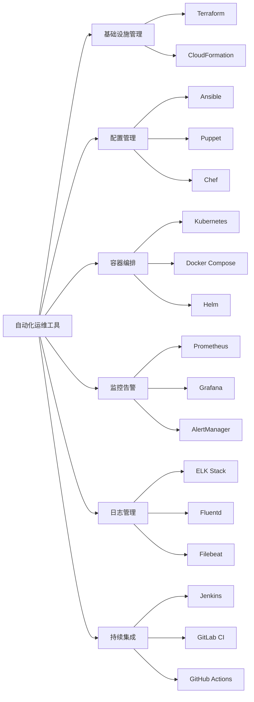

# 自动化运维工具的使用经验？

## 概要回答

自动化运维工具包括基础设施即代码(IaC)工具如Terraform、Ansible，容器编排工具如Kubernetes，监控告警工具如Prometheus、Grafana，日志收集工具如ELK/EFK栈等。通过这些工具实现基础设施自动化部署、配置管理、监控告警、日志分析等运维工作，显著提升运维效率和系统稳定性。

## 深度解析

### 自动化运维工具生态

#### 运维工具分类体系

```mermaid
graph TD
    A[自动化运维工具] --> B[基础设施管理];
    A --> C[配置管理];
    A --> D[容器编排];
    A --> E[监控告警];
    A --> F[日志管理];
    A --> G[持续集成];
    A --> H[安全管理];
    
    B --> B1[Terraform];
    B --> B2[CloudFormation];
    B --> B3[Pulumi];
    
    C --> C1[Ansible];
    C --> C2[Puppet];
    C --> C3[Chef];
    C --> C4[SaltStack];
    
    D --> D1[Kubernetes];
    D --> D2[Docker Swarm];
    D --> D3[Apache Mesos];
    
    E --> E1[Prometheus];
    E --> E2[Zabbix];
    E --> E3[Nagios];
    E --> E4[Datadog];
    
    F --> F1[ELK Stack];
    F --> F2[EFK Stack];
    F --> F3[Fluentd];
    F --> F4[Splunk];
    
    G --> G1[Jenkins];
    G --> G2[GitLab CI];
    G --> G3[GitHub Actions];
    G --> G4[CircleCI];
    
    H --> H1[Ansible Vault];
    H --> H2[Vault];
    H --> H3[AWS Secrets Manager];
```


### 基础设施即代码(IaC)工具

#### 1. Terraform使用实践
```hcl
# main.tf - AWS基础设施定义
terraform {
  required_providers {
    aws = {
      source  = "hashicorp/aws"
      version = "~> 4.0"
    }
  }
  
  backend "s3" {
    bucket = "terraform-state-bucket"
    key    = "production/terraform.tfstate"
    region = "us-west-2"
  }
}

provider "aws" {
  region = var.aws_region
}

# VPC网络配置
resource "aws_vpc" "main" {
  cidr_block           = var.vpc_cidr
  enable_dns_hostnames = true
  enable_dns_support   = true
  
  tags = {
    Name = "main-vpc"
  }
}

# 子网配置
resource "aws_subnet" "public" {
  count                   = length(var.availability_zones)
  vpc_id                  = aws_vpc.main.id
  cidr_block              = cidrsubnet(var.vpc_cidr, 8, count.index)
  availability_zone       = var.availability_zones[count.index]
  map_public_ip_on_launch = true
  
  tags = {
    Name = "public-subnet-${count.index}"
  }
}

# 安全组配置
resource "aws_security_group" "web" {
  name        = "web-sg"
  description = "Security group for web servers"
  vpc_id      = aws_vpc.main.id
  
  # HTTP访问
  ingress {
    from_port   = 80
    to_port     = 80
    protocol    = "tcp"
    cidr_blocks = ["0.0.0.0/0"]
  }
  
  # HTTPS访问
  ingress {
    from_port   = 443
    to_port     = 443
    protocol    = "tcp"
    cidr_blocks = ["0.0.0.0/0"]
  }
  
  # SSH访问（仅限堡垒机）
  ingress {
    from_port   = 22
    to_port     = 22
    protocol    = "tcp"
    cidr_blocks = [var.bastion_ip]
  }
  
  # 出站规则
  egress {
    from_port   = 0
    to_port     = 0
    protocol    = "-1"
    cidr_blocks = ["0.0.0.0/0"]
  }
}

# EC2实例配置
resource "aws_instance" "web_server" {
  count         = var.web_server_count
  ami           = var.web_ami
  instance_type = var.web_instance_type
  subnet_id     = aws_subnet.public[count.index % length(aws_subnet.public)].id
  vpc_security_group_ids = [aws_security_group.web.id]
  
  user_data = <<-EOF
              #!/bin/bash
              yum update -y
              yum install -y docker
              systemctl start docker
              systemctl enable docker
              docker run -d -p 80:80 nginx
              EOF
  
  tags = {
    Name = "web-server-${count.index}"
  }
}

# 负载均衡器
resource "aws_lb" "main" {
  name               = "main-alb"
  internal           = false
  load_balancer_type = "application"
  security_groups    = [aws_security_group.web.id]
  subnets            = aws_subnet.public[*].id
  
  tags = {
    Name = "main-alb"
  }
}

# 输出变量
output "vpc_id" {
  value = aws_vpc.main.id
}

output "web_server_ips" {
  value = aws_instance.web_server[*].public_ip
}

output "load_balancer_dns" {
  value = aws_lb.main.dns_name
}
```

```hcl
# variables.tf - 变量定义
variable "aws_region" {
  description = "AWS region"
  type        = string
  default     = "us-west-2"
}

variable "vpc_cidr" {
  description = "VPC CIDR block"
  type        = string
  default     = "10.0.0.0/16"
}

variable "availability_zones" {
  description = "Availability zones"
  type        = list(string)
  default     = ["us-west-2a", "us-west-2b", "us-west-2c"]
}

variable "web_server_count" {
  description = "Number of web servers"
  type        = number
  default     = 3
}

variable "web_instance_type" {
  description = "EC2 instance type for web servers"
  type        = string
  default     = "t3.medium"
}

variable "bastion_ip" {
  description = "Bastion host IP for SSH access"
  type        = string
  default     = "203.0.113.0/24"
}
```

#### 2. Ansible自动化配置
```yaml
# ansible.cfg
[defaults]
inventory = inventory/hosts
remote_user = ec2-user
private_key_file = ~/.ssh/id_rsa
host_key_checking = False
retry_files_enabled = False

# inventory/hosts
[webservers]
web1 ansible_host=10.0.1.10
web2 ansible_host=10.0.1.11
web3 ansible_host=10.0.1.12

[databases]
db1 ansible_host=10.0.2.10
db2 ansible_host=10.0.2.11

[all:vars]
ansible_python_interpreter=/usr/bin/python3
```

```yaml
# playbooks/webserver.yml
---
- name: Configure Web Servers
  hosts: webservers
  become: yes
  vars:
    nginx_version: "1.20.1"
    php_version: "8.1"
    
  tasks:
    - name: Update system packages
      yum:
        name: "*"
        state: latest
        
    - name: Install required packages
      yum:
        name:
          - nginx
          - php{{ php_version }}
          - php{{ php_version }}-fpm
          - php{{ php_version }}-mysql
          - git
          - composer
        state: present
        
    - name: Start and enable Nginx
      systemd:
        name: nginx
        state: started
        enabled: yes
        
    - name: Start and enable PHP-FPM
      systemd:
        name: php{{ php_version }}-fpm
        state: started
        enabled: yes
        
    - name: Configure Nginx virtual host
      template:
        src: templates/nginx-site.conf.j2
        dest: /etc/nginx/conf.d/site.conf
      notify: reload nginx
      
    - name: Deploy application code
      git:
        repo: "{{ app_git_repo }}"
        dest: /var/www/html
        version: "{{ app_version }}"
        
    - name: Set proper permissions
      file:
        path: /var/www/html
        owner: nginx
        group: nginx
        recurse: yes
        
    - name: Run Composer install
      shell: |
        cd /var/www/html
        composer install --no-dev --optimize-autoloader
      args:
        chdir: /var/www/html
        
  handlers:
    - name: reload nginx
      systemd:
        name: nginx
        state: reloaded
```

```yaml
# playbooks/database.yml
---
- name: Configure Database Servers
  hosts: databases
  become: yes
  vars:
    mysql_root_password: "{{ vault_mysql_root_password }}"
    mysql_database: "myapp"
    mysql_user: "myapp"
    
  tasks:
    - name: Install MySQL
      yum:
        name: mysql-server
        state: present
        
    - name: Start MySQL service
      systemd:
        name: mysqld
        state: started
        enabled: yes
        
    - name: Set MySQL root password
      mysql_user:
        name: root
        password: "{{ mysql_root_password }}"
        login_unix_socket: /var/lib/mysql/mysql.sock
        state: present
        
    - name: Create application database
      mysql_db:
        name: "{{ mysql_database }}"
        state: present
        login_user: root
        login_password: "{{ mysql_root_password }}"
        
    - name: Create application user
      mysql_user:
        name: "{{ mysql_user }}"
        password: "{{ vault_mysql_user_password }}"
        priv: "{{ mysql_database }}.*:ALL"
        state: present
        login_user: root
        login_password: "{{ mysql_root_password }}"
        
    - name: Configure MySQL performance settings
      lineinfile:
        path: /etc/my.cnf
        line: "{{ item }}"
        insertafter: EOF
      loop:
        - "innodb_buffer_pool_size = 1G"
        - "max_connections = 200"
        - "query_cache_size = 64M"
      notify: restart mysql
      
  handlers:
    - name: restart mysql
      systemd:
        name: mysqld
        state: restarted
```

### 容器编排工具

#### 1. Kubernetes Helm Charts
```yaml
# Chart.yaml
apiVersion: v2
name: php-application
description: A PHP web application Helm chart
version: 1.0.0
appVersion: "1.0.0"
kubeVersion: ">=1.19.0-0"
home: https://example.com
sources:
  - https://github.com/example/php-app
maintainers:
  - name: DevOps Team
    email: devops@example.com

# values.yaml
replicaCount: 3

image:
  repository: php-app
  tag: latest
  pullPolicy: Always

service:
  type: ClusterIP
  port: 80

ingress:
  enabled: true
  hosts:
    - host: php-app.example.com
      paths:
        - path: /
          pathType: Prefix
  tls:
    - secretName: php-app-tls
      hosts:
        - php-app.example.com

resources:
  limits:
    cpu: 500m
    memory: 512Mi
  requests:
    cpu: 250m
    memory: 256Mi

autoscaling:
  enabled: true
  minReplicas: 2
  maxReplicas: 10
  targetCPUUtilizationPercentage: 80

database:
  host: mysql-service
  port: 3306
  name: myapp
  user: myapp
  password: ""
```

```yaml
# templates/deployment.yaml
apiVersion: apps/v1
kind: Deployment
metadata:
  name: {{ include "php-application.fullname" . }}
  labels:
    {{- include "php-application.labels" . | nindent 4 }}
spec:
  {{- if not .Values.autoscaling.enabled }}
  replicas: {{ .Values.replicaCount }}
  {{- end }}
  selector:
    matchLabels:
      {{- include "php-application.selectorLabels" . | nindent 6 }}
  template:
    metadata:
      {{- with .Values.podAnnotations }}
      annotations:
        {{- toYaml . | nindent 8 }}
      {{- end }}
      labels:
        {{- include "php-application.selectorLabels" . | nindent 8 }}
    spec:
      containers:
        - name: {{ .Chart.Name }}
          image: "{{ .Values.image.repository }}:{{ .Values.image.tag | default .Chart.AppVersion }}"
          imagePullPolicy: {{ .Values.image.pullPolicy }}
          ports:
            - name: http
              containerPort: 80
              protocol: TCP
          env:
            - name: DB_HOST
              value: {{ .Values.database.host }}
            - name: DB_PORT
              value: "{{ .Values.database.port }}"
            - name: DB_NAME
              value: {{ .Values.database.name }}
            - name: DB_USER
              value: {{ .Values.database.user }}
            - name: DB_PASSWORD
              valueFrom:
                secretKeyRef:
                  name: {{ include "php-application.fullname" . }}-db
                  key: password
          resources:
            {{- toYaml .Values.resources | nindent 12 }}
          livenessProbe:
            httpGet:
              path: /health
              port: http
            initialDelaySeconds: 30
            periodSeconds: 10
          readinessProbe:
            httpGet:
              path: /ready
              port: http
            initialDelaySeconds: 5
            periodSeconds: 5
```

#### 2. Docker Compose多环境管理
```yaml
# docker-compose.yml
version: '3.8'

services:
  app:
    build:
      context: .
      dockerfile: Dockerfile
    image: ${DOCKER_REGISTRY}/php-app:${TAG:-latest}
    container_name: php-app
    ports:
      - "8080:80"
    environment:
      - DB_HOST=${DB_HOST:-mysql}
      - DB_PORT=${DB_PORT:-3306}
      - DB_NAME=${DB_NAME:-myapp}
      - DB_USER=${DB_USER:-myapp}
      - DB_PASSWORD=${DB_PASSWORD}
      - REDIS_HOST=${REDIS_HOST:-redis}
      - LOG_LEVEL=${LOG_LEVEL:-info}
    volumes:
      - ./src:/var/www/html/src:ro
      - ./logs:/var/log/php:rw
    depends_on:
      mysql:
        condition: service_healthy
      redis:
        condition: service_started
    restart: unless-stopped
    networks:
      - app-network
    healthcheck:
      test: ["CMD", "curl", "-f", "http://localhost/health"]
      interval: 30s
      timeout: 10s
      retries: 3
      start_period: 40s

  mysql:
    image: mysql:8.0
    container_name: mysql-db
    environment:
      MYSQL_ROOT_PASSWORD: ${MYSQL_ROOT_PASSWORD:-rootpass}
      MYSQL_DATABASE: ${DB_NAME:-myapp}
      MYSQL_USER: ${DB_USER:-myapp}
      MYSQL_PASSWORD: ${DB_PASSWORD:-mypass}
    volumes:
      - mysql_data:/var/lib/mysql
      - ./mysql/init:/docker-entrypoint-initdb.d:ro
    ports:
      - "3306:3306"
    restart: unless-stopped
    networks:
      - app-network
    healthcheck:
      test: ["CMD", "mysqladmin", "ping", "-h", "localhost"]
      interval: 10s
      timeout: 5s
      retries: 3

  redis:
    image: redis:alpine
    container_name: redis-cache
    ports:
      - "6379:6379"
    volumes:
      - redis_data:/data
    restart: unless-stopped
    networks:
      - app-network

  nginx:
    image: nginx:alpine
    container_name: nginx-proxy
    ports:
      - "80:80"
      - "443:443"
    volumes:
      - ./nginx/conf:/etc/nginx/conf.d:ro
      - ./ssl:/etc/nginx/ssl:ro
      - ./logs:/var/log/nginx:rw
    depends_on:
      - app
    restart: unless-stopped
    networks:
      - app-network

networks:
  app-network:
    driver: bridge

volumes:
  mysql_data:
    driver: local
  redis_data:
    driver: local
```

```yaml
# docker-compose.override.yml (开发环境)
version: '3.8'

services:
  app:
    volumes:
      - ./src:/var/www/html/src:rw
      - ./composer.json:/var/www/html/composer.json:rw
      - ./composer.lock:/var/www/html/composer.lock:rw
      - composer_cache:/root/.composer/cache:rw
    environment:
      - APP_ENV=development
      - XDEBUG_MODE=develop,debug
    extra_hosts:
      - "host.docker.internal:host-gateway"

  mysql:
    ports:
      - "3306:3306"

volumes:
  composer_cache:
```

### 监控告警工具

#### 1. Prometheus监控配置
```yaml
# prometheus.yml
global:
  scrape_interval: 15s
  evaluation_interval: 15s

rule_files:
  - "alert_rules.yml"
  - "recording_rules.yml"

alerting:
  alertmanagers:
    - static_configs:
        - targets:
            - alertmanager:9093

scrape_configs:
  # 应用服务监控
  - job_name: 'php-app'
    static_configs:
      - targets: ['php-app-1:8080', 'php-app-2:8080', 'php-app-3:8080']
    metrics_path: '/metrics'
    scrape_interval: 10s
    relabel_configs:
      - source_labels: [__address__]
        target_label: instance
        replacement: '${1}:8080'

  # Node Exporter监控
  - job_name: 'node-exporter'
    static_configs:
      - targets: ['node1:9100', 'node2:9100', 'node3:9100']
    scrape_interval: 30s

  # MySQL监控
  - job_name: 'mysql-exporter'
    static_configs:
      - targets: ['mysql-exporter:9104']
    scrape_interval: 30s

  # Redis监控
  - job_name: 'redis-exporter'
    static_configs:
      - targets: ['redis-exporter:9121']
    scrape_interval: 30s

  # Blackbox监控（外部服务）
  - job_name: 'blackbox'
    metrics_path: /probe
    params:
      module: [http_2xx]
    static_configs:
      - targets:
          - https://example.com
          - https://api.example.com
    relabel_configs:
      - source_labels: [__address__]
        target_label: __param_target
      - source_labels: [__param_target]
        target_label: instance
      - target_label: __address__
        replacement: blackbox:9115
```

```yaml
# alert_rules.yml
groups:
  - name: application_alerts
    rules:
      # 高错误率告警
      - alert: HighErrorRate
        expr: rate(application_errors_total[5m]) > 10
        for: 1m
        labels:
          severity: critical
        annotations:
          summary: "应用错误率过高"
          description: "5分钟内错误率超过10次/分钟，当前值为 {{ $value }}"

      # 高延迟告警
      - alert: HighLatency
        expr: histogram_quantile(0.95, rate(http_request_duration_seconds_bucket[5m])) > 1
        for: 2m
        labels:
          severity: warning
        annotations:
          summary: "API响应时间过长"
          description: "95%的请求响应时间超过1秒，当前值为 {{ $value }}秒"

      # 服务不可用告警
      - alert: ServiceDown
        expr: up == 0
        for: 1m
        labels:
          severity: critical
        annotations:
          summary: "服务不可用"
          description: "服务 {{ $labels.job }} 在 {{ $labels.instance }} 上不可用"

  - name: infrastructure_alerts
    rules:
      # 高CPU使用率告警
      - alert: HighCPUUsage
        expr: 100 - (avg by (instance) (irate(node_cpu_seconds_total{mode="idle"}[5m])) * 100) > 80
        for: 5m
        labels:
          severity: warning
        annotations:
          summary: "CPU使用率过高"
          description: "实例 {{ $labels.instance }} 的CPU使用率超过80%，当前值为 {{ $value }}%"

      # 低内存告警
      - alert: LowMemory
        expr: (node_memory_MemAvailable_bytes / node_memory_MemTotal_bytes * 100) < 10
        for: 2m
        labels:
          severity: critical
        annotations:
          summary: "内存不足"
          description: "实例 {{ $labels.instance }} 的可用内存低于10%，当前值为 {{ $value }}%"

      # 磁盘空间不足告警
      - alert: LowDiskSpace
        expr: (node_filesystem_avail_bytes{mountpoint="/"} / node_filesystem_size_bytes{mountpoint="/"} * 100) < 15
        for: 5m
        labels:
          severity: warning
        annotations:
          summary: "磁盘空间不足"
          description: "实例 {{ $labels.instance }} 的根分区可用空间低于15%，当前值为 {{ $value }}%"
```

#### 2. Grafana仪表板配置
```json
{
  "dashboard": {
    "id": null,
    "title": "PHP应用监控仪表板",
    "timezone": "browser",
    "schemaVersion": 16,
    "version": 0,
    "panels": [
      {
        "id": 1,
        "type": "graph",
        "title": "HTTP请求速率",
        "gridPos": {
          "x": 0,
          "y": 0,
          "w": 12,
          "h": 8
        },
        "targets": [
          {
            "expr": "rate(http_requests_total[5m])",
            "legendFormat": "{{method}} {{endpoint}} {{code}}",
            "refId": "A"
          }
        ],
        "yaxes": [
          {
            "format": "reqps",
            "label": "请求/秒"
          },
          {
            "format": "short"
          }
        ]
      },
      {
        "id": 2,
        "type": "graph",
        "title": "错误率",
        "gridPos": {
          "x": 12,
          "y": 0,
          "w": 12,
          "h": 8
        },
        "targets": [
          {
            "expr": "rate(application_errors_total[5m])",
            "legendFormat": "{{type}}",
            "refId": "A"
          }
        ],
        "yaxes": [
          {
            "format": "short",
            "label": "错误数/分钟"
          },
          {
            "format": "short"
          }
        ]
      },
      {
        "id": 3,
        "type": "graph",
        "title": "95th响应时间",
        "gridPos": {
          "x": 0,
          "y": 8,
          "w": 12,
          "h": 8
        },
        "targets": [
          {
            "expr": "histogram_quantile(0.95, rate(http_request_duration_seconds_bucket[5m]))",
            "legendFormat": "{{endpoint}}",
            "refId": "A"
          }
        ],
        "yaxes": [
          {
            "format": "s",
            "label": "响应时间(秒)"
          },
          {
            "format": "short"
          }
        ]
      },
      {
        "id": 4,
        "type": "graph",
        "title": "系统资源使用率",
        "gridPos": {
          "x": 12,
          "y": 8,
          "w": 12,
          "h": 8
        },
        "targets": [
          {
            "expr": "100 - (avg by (instance) (irate(node_cpu_seconds_total{mode=\"idle\"}[5m])) * 100)",
            "legendFormat": "CPU {{instance}}",
            "refId": "A"
          },
          {
            "expr": "(node_memory_MemTotal_bytes - node_memory_MemAvailable_bytes) / node_memory_MemTotal_bytes * 100",
            "legendFormat": "Memory {{instance}}",
            "refId": "B"
          }
        ],
        "yaxes": [
          {
            "format": "percent",
            "label": "使用率(%)"
          },
          {
            "format": "short"
          }
        ]
      }
    ]
  }
}
```

### 日志管理工具

#### 1. ELK Stack配置
```yaml
# docker-compose-elk.yml
version: '3.8'

services:
  elasticsearch:
    image: docker.elastic.co/elasticsearch/elasticsearch:7.17.0
    container_name: elasticsearch
    environment:
      - discovery.type=single-node
      - ES_JAVA_OPTS=-Xms1g -Xmx1g
    ulimits:
      memlock:
        soft: -1
        hard: -1
    volumes:
      - es_data:/usr/share/elasticsearch/data
    ports:
      - "9200:9200"
      - "9300:9300"
    networks:
      - elk

  kibana:
    image: docker.elastic.co/kibana/kibana:7.17.0
    container_name: kibana
    depends_on:
      - elasticsearch
    environment:
      - ELASTICSEARCH_HOSTS=http://elasticsearch:9200
    ports:
      - "5601:5601"
    networks:
      - elk

  logstash:
    image: docker.elastic.co/logstash/logstash:7.17.0
    container_name: logstash
    depends_on:
      - elasticsearch
    volumes:
      - ./logstash/pipeline:/usr/share/logstash/pipeline:ro
      - ./logstash/config:/usr/share/logstash/config:ro
    ports:
      - "5044:5044"
      - "9600:9600"
    networks:
      - elk

  filebeat:
    image: docker.elastic.co/beats/filebeat:7.17.0
    container_name: filebeat
    user: root
    volumes:
      - ./filebeat/filebeat.yml:/usr/share/filebeat/filebeat.yml:ro
      - /var/lib/docker/containers:/var/lib/docker/containers:ro
      - /var/run/docker.sock:/var/run/docker.sock:ro
    networks:
      - elk

networks:
  elk:
    driver: bridge

volumes:
  es_data:
    driver: local
```

```yaml
# filebeat/filebeat.yml
filebeat.inputs:
- type: log
  enabled: true
  paths:
    - /var/lib/docker/containers/*/*.log
  json.keys_under_root: true
  json.add_error_key: true
  processors:
    - add_docker_metadata: ~
    - decode_json_fields:
        fields: ["message"]
        target: "json"
        overwrite_keys: true

filebeat.autodiscover:
  providers:
    - type: docker
      hints.enabled: true

processors:
  - add_host_metadata: ~
  - add_cloud_metadata: ~

output.logstash:
  hosts: ["logstash:5044"]

logging.level: info
logging.to_files: true
logging.files:
  path: /var/log/filebeat
  name: filebeat
  keepfiles: 7
  permissions: 0644
```

```ruby
# logstash/pipeline/logstash.conf
input {
  beats {
    port => 5044
  }
}

filter {
  # 处理PHP应用日志
  if [fields][service] == "php-app" {
    json {
      source => "message"
    }
    
    date {
      match => [ "timestamp", "ISO8601" ]
      target => "@timestamp"
    }
    
    # 地理位置解析
    if [context][ip] {
      geoip {
        source => "[context][ip]"
        target => "geoip"
      }
    }
  }
  
  # 处理Nginx访问日志
  if [type] == "nginx-access" {
    grok {
      match => { "message" => "%{COMBINEDAPACHELOG}" }
    }
    
    date {
      match => [ "timestamp", "dd/MMM/yyyy:HH:mm:ss Z" ]
    }
  }
  
  # 处理系统日志
  if [type] == "syslog" {
    grok {
      match => { "message" => "%{SYSLOGTIMESTAMP:syslog_timestamp} %{SYSLOGHOST:syslog_hostname} %{DATA:syslog_program}(?:\[%{POSINT:syslog_pid}\])?: %{GREEDYDATA:syslog_message}" }
    }
    
    date {
      match => [ "syslog_timestamp", "MMM  d HH:mm:ss", "MMM dd HH:mm:ss" ]
    }
  }
}

output {
  # 输出到Elasticsearch
  elasticsearch {
    hosts => ["elasticsearch:9200"]
    index => "application-logs-%{+YYYY.MM.dd}"
  }
  
  # 输出到标准输出用于调试
  stdout {
    codec => rubydebug
  }
}
```

### 持续集成工具

#### 1. Jenkins Pipeline
```groovy
// Jenkinsfile
pipeline {
    agent any
    
    environment {
        DOCKER_REGISTRY = 'registry.example.com'
        DOCKER_IMAGE = 'php-app'
        DOCKER_TAG = "${BUILD_NUMBER}"
    }
    
    stages {
        stage('Checkout') {
            steps {
                checkout scm
            }
        }
        
        stage('Code Quality') {
            steps {
                sh 'composer install'
                sh './vendor/bin/phpcs --standard=PSR12 src/'
                sh './vendor/bin/phpstan analyse src/'
            }
            post {
                failure {
                    echo '代码质量检查失败'
                    slackSend channel: '#ci-cd', message: "Build failed: ${env.JOB_NAME} ${env.BUILD_NUMBER} - Code quality check failed"
                }
            }
        }
        
        stage('Security Scan') {
            steps {
                sh 'php-security-checker security:check composer.lock'
            }
        }
        
        stage('Unit Tests') {
            steps {
                sh './vendor/bin/phpunit --coverage-clover coverage.xml'
            }
            post {
                always {
                    publishCoverage adapters: [cloverAdapter(cloverReportPattern: 'coverage.xml')]
                }
            }
        }
        
        stage('Build Docker Image') {
            steps {
                script {
                    docker.build("${DOCKER_REGISTRY}/${DOCKER_IMAGE}:${DOCKER_TAG}")
                }
            }
        }
        
        stage('Push Docker Image') {
            steps {
                script {
                    docker.withRegistry("https://${DOCKER_REGISTRY}", 'docker-registry-credentials') {
                        docker.image("${DOCKER_REGISTRY}/${DOCKER_IMAGE}:${DOCKER_TAG}").push()
                        docker.image("${DOCKER_REGISTRY}/${DOCKER_IMAGE}:${DOCKER_TAG}").push('latest')
                    }
                }
            }
        }
        
        stage('Deploy to Staging') {
            when {
                branch 'develop'
            }
            steps {
                sh './deploy.sh staging'
            }
        }
        
        stage('Deploy to Production') {
            when {
                branch 'master'
            }
            steps {
                input message: 'Deploy to production?', ok: 'Deploy'
                sh './deploy.sh production'
            }
        }
    }
    
    post {
        success {
            echo 'Pipeline completed successfully'
            slackSend channel: '#ci-cd', message: "Build succeeded: ${env.JOB_NAME} ${env.BUILD_NUMBER}"
        }
        failure {
            echo 'Pipeline failed'
            emailext subject: "FAILED: ${env.JOB_NAME} ${env.BUILD_NUMBER}",
                     body: "See ${env.BUILD_URL}",
                     to: "team@example.com"
        }
    }
}
```

#### 2. GitLab CI/CD
```yaml
# .gitlab-ci.yml
stages:
  - prepare
  - test
  - build
  - deploy

variables:
  DOCKER_REGISTRY: registry.gitlab.com
  DOCKER_IMAGE: $CI_PROJECT_PATH_SLUG
  DOCKER_TAG: $CI_COMMIT_SHA

# 准备阶段
prepare:
  stage: prepare
  image: composer:latest
  script:
    - composer install --no-progress --no-suggest
  artifacts:
    paths:
      - vendor/
  cache:
    key: composer
    paths:
      - vendor/

# 代码质量检查
code_quality:
  stage: test
  image: php:8.1-cli
  before_script:
    - apt-get update && apt-get install -y zip unzip
    - curl -sS https://getcomposer.org/installer | php -- --install-dir=/usr/local/bin --filename=composer
    - composer install --no-progress --no-suggest
  script:
    - ./vendor/bin/phpcs --standard=PSR12 src/
    - ./vendor/bin/phpstan analyse src/

# 安全扫描
security_scan:
  stage: test
  image: php:8.1-cli
  before_script:
    - curl -sS https://getcomposer.org/installer | php -- --install-dir=/usr/local/bin --filename=composer
    - composer install --no-progress --no-suggest
  script:
    - curl -sS https://get.symfony.com/cli/installer | bash
    - ~/.symfony/bin/symfony security:check

# 单元测试
unit_tests:
  stage: test
  image: php:8.1-cli
  services:
    - mysql:8.0
  variables:
    MYSQL_ROOT_PASSWORD: rootpass
    MYSQL_DATABASE: test
  before_script:
    - apt-get update && apt-get install -y git unzip
    - curl -sS https://getcomposer.org/installer | php -- --install-dir=/usr/local/bin --filename=composer
    - composer install --no-progress --no-suggest
  script:
    - ./vendor/bin/phpunit --coverage-text
  coverage: '/^\s*Lines:\s*\d+.\d+\%/

# 构建Docker镜像
build_image:
  stage: build
  image: docker:latest
  services:
    - docker:dind
  variables:
    DOCKER_TLS_CERTDIR: "/certs"
  before_script:
    - docker login -u $CI_REGISTRY_USER -p $CI_REGISTRY_PASSWORD $CI_REGISTRY
  script:
    - docker build -t $CI_REGISTRY_IMAGE:$DOCKER_TAG .
    - docker push $CI_REGISTRY_IMAGE:$DOCKER_TAG
    - docker tag $CI_REGISTRY_IMAGE:$DOCKER_TAG $CI_REGISTRY_IMAGE:latest
    - docker push $CI_REGISTRY_IMAGE:latest

# 部署到测试环境
deploy_staging:
  stage: deploy
  image: bitnami/kubectl:latest
  environment:
    name: staging
    url: https://staging.example.com
  only:
    - develop
  before_script:
    - echo $KUBE_CONFIG_STAGING | base64 -d > kubeconfig.yaml
  script:
    - kubectl --kubeconfig=kubeconfig.yaml set image deployment/php-app php-app=$CI_REGISTRY_IMAGE:$DOCKER_TAG

# 部署到生产环境
deploy_production:
  stage: deploy
  image: bitnami/kubectl:latest
  environment:
    name: production
    url: https://example.com
  only:
    - master
  when: manual
  before_script:
    - echo $KUBE_CONFIG_PRODUCTION | base64 -d > kubeconfig.yaml
  script:
    - kubectl --kubeconfig=kubeconfig.yaml set image deployment/php-app php-app=$CI_REGISTRY_IMAGE:$DOCKER_TAG
```

### 自动化运维最佳实践

#### 1. 基础设施代码化
```bash
#!/bin/bash
# infrastructure-setup.sh

# 初始化Terraform
terraform init

# 验证配置
terraform validate

# 计划变更
terraform plan -out=tfplan

# 应用变更（需要确认）
echo "即将应用以下变更:"
terraform show tfplan
read -p "确认应用变更吗? (y/N) " -n 1 -r
echo
if [[ $REPLY =~ ^[Yy]$ ]]; then
    terraform apply tfplan
else
    echo "操作已取消"
    exit 1
fi

# 输出基础设施信息
terraform output
```

#### 2. 配置管理自动化
```yaml
# ansible/playbooks/site.yml
---
- name: Provision and configure entire infrastructure
  hosts: all
  become: yes
  
  roles:
    - role: common
      tags: [common]
      
    - role: webserver
      when: "'webservers' in group_names"
      tags: [web]
      
    - role: database
      when: "'databases' in group_names"
      tags: [db]
      
    - role: monitoring
      tags: [monitoring]
```

#### 3. 监控告警自动化
```python
#!/usr/bin/env python3
# alert-auto-config.py

import yaml
import json
import requests

class AlertManager:
    def __init__(self, grafana_url, api_key):
        self.grafana_url = grafana_url
        self.headers = {
            'Authorization': f'Bearer {api_key}',
            'Content-Type': 'application/json'
        }
    
    def create_dashboard(self, dashboard_config):
        """自动创建Grafana仪表板"""
        url = f"{self.grafana_url}/api/dashboards/db"
        payload = {
            "dashboard": dashboard_config,
            "overwrite": True
        }
        
        response = requests.post(url, headers=self.headers, json=payload)
        return response.json()
    
    def create_alert_rule(self, rule_config):
        """自动创建告警规则"""
        url = f"{self.grafana_url}/api/ruler/grafana/api/v1/rules/default"
        response = requests.post(url, headers=self.headers, json=rule_config)
        return response.status_code == 201
    
    def sync_dashboards_from_templates(self, template_dir):
        """从模板同步仪表板"""
        import os
        for filename in os.listdir(template_dir):
            if filename.endswith('.json'):
                with open(os.path.join(template_dir, filename), 'r') as f:
                    dashboard_config = json.load(f)
                    result = self.create_dashboard(dashboard_config)
                    print(f"创建仪表板 {filename}: {result}")

# 使用示例
if __name__ == "__main__":
    alert_manager = AlertManager(
        grafana_url="http://grafana:3000",
        api_key="your-api-key"
    )
    
    # 同步仪表板
    alert_manager.sync_dashboards_from_templates("./templates/dashboards")
```

#### 4. 日志管理自动化
```bash
#!/bin/bash
# log-management.sh

# 自动化日志轮转配置
configure_logrotate() {
    cat > /etc/logrotate.d/php-app << 'EOF'
/var/log/php/app.log {
    daily
    rotate 30
    compress
    delaycompress
    missingok
    notifempty
    create 644 www-data adm
    postrotate
        systemctl reload php-fpm
    endscript
}
EOF
    
    echo "日志轮转配置已完成"
}

# 自动化日志清理
setup_log_cleanup() {
    cat > /etc/cron.daily/log-cleanup << 'EOF'
#!/bin/bash
# 清理30天前的日志
find /var/log/php -name "*.log.*" -mtime +30 -delete
find /var/log/nginx -name "*.log.*" -mtime +30 -delete
EOF
    
    chmod +x /etc/cron.daily/log-cleanup
    echo "日志清理任务已配置"
}

# 执行配置
configure_logrotate
setup_log_cleanup
```

## 图示说明



通过合理运用这些自动化运维工具，可以显著提升运维效率，降低人为错误，确保系统的稳定性和可维护性。