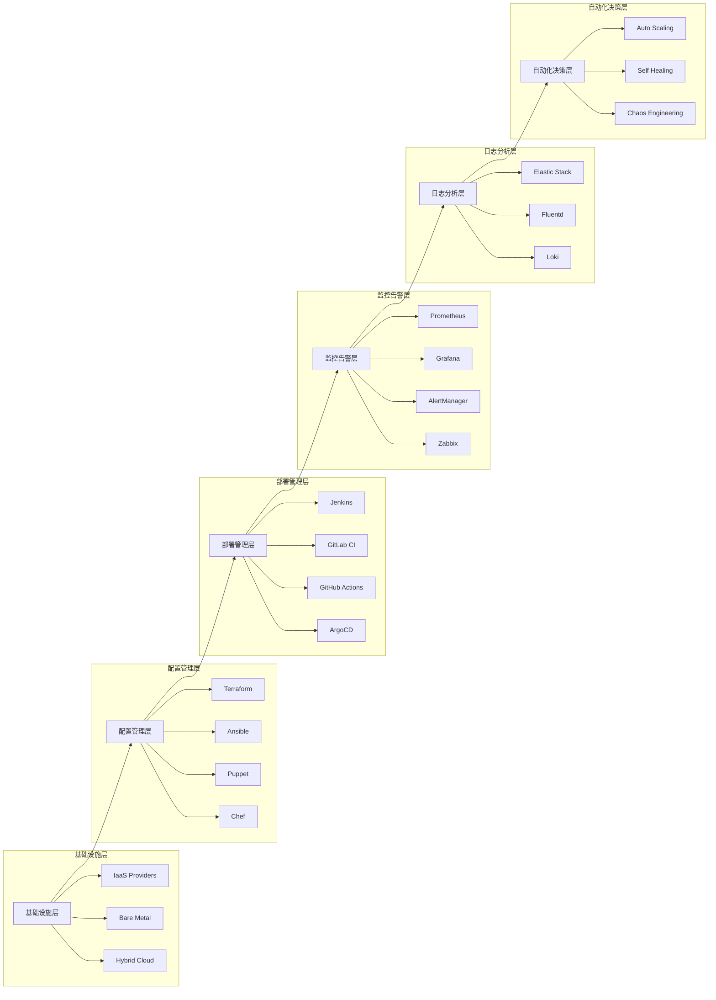

# 自动化运维工具的使用经验？

## 概要回答

自动化运维工具是提升运维效率和系统稳定性的关键。主流工具包括：Ansible（配置管理）、Terraform（基础设施即代码）、Jenkins/GitLab CI（持续集成）、Prometheus（监控告警）、Docker/Kubernetes（容器化部署）等。实践经验表明，成功的自动化运维需要标准化流程、版本化管理、完善的测试机制、渐进式推广和持续优化。通过合理选择和组合这些工具，可以实现基础设施的标准化、部署的自动化和运维的智能化。

## 深度解析

### 自动化运维工具生态



### 配置管理工具实践

#### 1. Ansible自动化部署

```yaml
# ansible/playbooks/webserver.yml
---
- name: 部署Web服务器
  hosts: webservers
  become: yes
  vars:
    nginx_version: "1.20.1"
    app_user: "webapp"
    app_group: "webapp"
  
  tasks:
    - name: 更新系统包
      apt:
        update_cache: yes
        upgrade: dist
    
    - name: 安装必要的软件包
      apt:
        name:
          - nginx
          - php8.1-fpm
          - php8.1-mysql
          - php8.1-curl
          - composer
        state: present
    
    - name: 创建应用用户
      user:
        name: "{{ app_user }}"
        group: "{{ app_group }}"
        system: yes
        shell: /bin/false
        home: /var/www
    
    - name: 创建应用目录
      file:
        path: /var/www/html
        state: directory
        owner: "{{ app_user }}"
        group: "{{ app_group }}"
        mode: '0755'
    
    - name: 部署应用代码
      git:
        repo: "https://github.com/company/webapp.git"
        dest: /var/www/html
        version: "{{ app_version | default('main') }}"
        force: yes
      notify: 重启PHP-FPM
    
    - name: 安装PHP依赖
      composer:
        command: install
        working_dir: /var/www/html
        no_dev: yes
        optimize_autoloader: yes
      environment:
        COMPOSER_CACHE_DIR: /tmp/composer-cache
    
    - name: 配置Nginx
      template:
        src: templates/nginx-site.conf.j2
        dest: /etc/nginx/sites-available/default
      notify: 重启Nginx
    
    - name: 启动并启用服务
      systemd:
        name: "{{ item }}"
        state: started
        enabled: yes
      loop:
        - nginx
        - php8.1-fpm
  
  handlers:
    - name: 重启Nginx
      systemd:
        name: nginx
        state: restarted
    
    - name: 重启PHP-FPM
      systemd:
        name: php8.1-fpm
        state: restarted
```

```php
<?php
/**
 * Ansible集成管理类
 */
class AnsibleIntegration {
    private $inventoryPath;
    private $playbookPath;
    private $logPath;
    
    public function __construct($inventoryPath, $playbookPath, $logPath = '/var/log/ansible') {
        $this->inventoryPath = $inventoryPath;
        $this->playbookPath = $playbookPath;
        $this->logPath = $logPath;
    }
    
    /**
     * 执行Ansible Playbook
     */
    public function runPlaybook($playbook, $extraVars = [], $limit = null) {
        $cmd = "ansible-playbook";
        $cmd .= " -i " . escapeshellarg($this->inventoryPath);
        $cmd .= " " . escapeshellarg($this->playbookPath . '/' . $playbook);
        
        // 添加额外变量
        if (!empty($extraVars)) {
            $vars = [];
            foreach ($extraVars as $key => $value) {
                $vars[] = "$key=$value";
            }
            $cmd .= " --extra-vars '" . implode(' ', $vars) . "'";
        }
        
        // 限制主机
        if ($limit) {
            $cmd .= " --limit " . escapeshellarg($limit);
        }
        
        // 添加日志记录
        $logFile = $this->logPath . '/playbook_' . date('Ymd_His') . '.log';
        $cmd .= " > " . escapeshellarg($logFile) . " 2>&1";
        
        echo "执行命令: $cmd\n";
        
        // 执行命令
        $startTime = microtime(true);
        $exitCode = 0;
        system($cmd, $exitCode);
        $duration = microtime(true) - $startTime;
        
        return [
            'exit_code' => $exitCode,
            'duration' => $duration,
            'log_file' => $logFile,
            'success' => $exitCode === 0
        ];
    }
    
    /**
     * 检查主机连通性
     */
    public function pingHosts($hosts = 'all') {
        $cmd = "ansible " . escapeshellarg($hosts) . " -i " . escapeshellarg($this->inventoryPath) . " -m ping";
        
        $output = [];
        $exitCode = 0;
        exec($cmd, $output, $exitCode);
        
        $results = [];
        foreach ($output as $line) {
            if (preg_match('/^(.*?) \| (.*?): (.*)$/', $line, $matches)) {
                $host = $matches[1];
                $status = $matches[2];
                $message = $matches[3];
                
                $results[$host] = [
                    'status' => $status,
                    'message' => $message
                ];
            }
        }
        
        return [
            'results' => $results,
            'all_successful' => $exitCode === 0
        ];
    }
    
    /**
     * 收集主机事实
     */
    public function gatherFacts($hosts = 'all') {
        $cmd = "ansible " . escapeshellarg($hosts) . " -i " . escapeshellarg($this->inventoryPath) . " -m setup";
        
        $output = [];
        exec($cmd, $output);
        
        $facts = [];
        $currentHost = null;
        
        foreach ($output as $line) {
            if (preg_match('/^(.*?) \| SUCCESS => (.*)$/', $line, $matches)) {
                $currentHost = $matches[1];
                $factData = json_decode($matches[2], true);
                if ($factData) {
                    $facts[$currentHost] = $factData;
                }
            }
        }
        
        return $facts;
    }
    
    /**
     * 执行临时命令
     */
    public function adHocCommand($hosts, $module, $args = '') {
        $cmd = "ansible " . escapeshellarg($hosts) . " -i " . escapeshellarg($this->inventoryPath);
        $cmd .= " -m " . escapeshellarg($module);
        
        if ($args) {
            $cmd .= " -a " . escapeshellarg($args);
        }
        
        $output = [];
        $exitCode = 0;
        exec($cmd, $output, $exitCode);
        
        return [
            'output' => $output,
            'exit_code' => $exitCode,
            'success' => $exitCode === 0
        ];
    }
    
    /**
     * 生成动态清单
     */
    public function generateDynamicInventory($sources) {
        $inventory = [
            '_meta' => ['hostvars' => []],
            'all' => ['children' => []]
        ];
        
        foreach ($sources as $sourceName => $sourceConfig) {
            $hosts = $this->getHostsFromSource($sourceConfig);
            
            $inventory['all']['children'][] = $sourceName;
            $inventory[$sourceName] = ['hosts' => []];
            
            foreach ($hosts as $host) {
                $inventory[$sourceName]['hosts'][] = $host['name'];
                $inventory['_meta']['hostvars'][$host['name']] = $host['vars'] ?? [];
            }
        }
        
        return $inventory;
    }
    
    /**
     * 从源获取主机列表
     */
    private function getHostsFromSource($sourceConfig) {
        // 这里应该是实际的主机发现逻辑
        // 可以是从云提供商API、数据库、配置文件等获取
        
        // 示例实现
        if ($sourceConfig['type'] === 'static') {
            return $sourceConfig['hosts'];
        } elseif ($sourceConfig['type'] === 'cloud') {
            return $this->discoverCloudHosts($sourceConfig);
        }
        
        return [];
    }
    
    /**
     * 发现云主机
     */
    private function discoverCloudHosts($config) {
        // 这里应该是实际的云API调用
        // 示例实现
        return [
            ['name' => 'web-01', 'vars' => ['ansible_host' => '10.0.1.10']],
            ['name' => 'web-02', 'vars' => ['ansible_host' => '10.0.1.11']],
            ['name' => 'db-01', 'vars' => ['ansible_host' => '10.0.2.10']]
        ];
    }
    
    /**
     * 验证Playbook语法
     */
    public function validatePlaybook($playbook) {
        $cmd = "ansible-playbook --syntax-check " . escapeshellarg($this->playbookPath . '/' . $playbook);
        
        $output = [];
        $exitCode = 0;
        exec($cmd, $output, $exitCode);
        
        return [
            'valid' => $exitCode === 0,
            'output' => $output,
            'exit_code' => $exitCode
        ];
    }
}

// 使用示例
$ansible = new AnsibleIntegration('/etc/ansible/hosts', '/etc/ansible/playbooks');

// 检查主机连通性
$pingResult = $ansible->pingHosts('webservers');
echo "主机连通性检查:\n";
foreach ($pingResult['results'] as $host => $result) {
    echo "  $host: {$result['status']}\n";
}
echo "\n";

// 验证Playbook语法
$validation = $ansible->validatePlaybook('webserver.yml');
echo "Playbook语法验证: " . ($validation['valid'] ? '通过' : '失败') . "\n";
if (!$validation['valid']) {
    echo "错误信息:\n" . implode("\n", $validation['output']) . "\n";
}
echo "\n";

// 执行Playbook
$deployResult = $ansible->runPlaybook('webserver.yml', [
    'app_version' => 'v1.2.3',
    'environment' => 'production'
], 'web-01');

echo "部署结果:\n";
echo "  退出码: {$deployResult['exit_code']}\n";
echo "  执行时间: " . round($deployResult['duration'], 2) . "秒\n";
echo "  日志文件: {$deployResult['log_file']}\n";
echo "  执行状态: " . ($deployResult['success'] ? '成功' : '失败') . "\n";
```

#### 2. Terraform基础设施即代码

```hcl
# terraform/main.tf
terraform {
  required_providers {
    aws = {
      source  = "hashicorp/aws"
      version = "~> 4.0"
    }
  }
  
  backend "s3" {
    bucket = "company-terraform-state"
    key    = "production/terraform.tfstate"
    region = "us-west-2"
  }
}

provider "aws" {
  region = var.aws_region
}

# VPC配置
module "vpc" {
  source = "./modules/vpc"
  
  cidr_block           = var.vpc_cidr
  availability_zones   = var.availability_zones
  public_subnets       = var.public_subnet_cidrs
  private_subnets      = var.private_subnet_cidrs
  enable_nat_gateway   = true
  single_nat_gateway   = false
  one_nat_gateway_per_az = true
}

# 安全组
resource "aws_security_group" "web_sg" {
  name_prefix = "web-sg"
  vpc_id      = module.vpc.vpc_id
  
  ingress {
    from_port   = 80
    to_port     = 80
    protocol    = "tcp"
    cidr_blocks = ["0.0.0.0/0"]
  }
  
  ingress {
    from_port   = 443
    to_port     = 443
    protocol    = "tcp"
    cidr_blocks = ["0.0.0.0/0"]
  }
  
  ingress {
    from_port   = 22
    to_port     = 22
    protocol    = "tcp"
    cidr_blocks = [var.admin_cidr]
  }
  
  egress {
    from_port   = 0
    to_port     = 0
    protocol    = "-1"
    cidr_blocks = ["0.0.0.0/0"]
  }
  
  tags = {
    Name = "web-security-group"
  }
}

# 应用负载均衡器
resource "aws_lb" "app_alb" {
  name               = "app-alb"
  internal           = false
  load_balancer_type = "application"
  security_groups    = [aws_security_group.web_sg.id]
  subnets            = module.vpc.public_subnets
  
  enable_deletion_protection = true
  
  tags = {
    Name = "app-load-balancer"
  }
}

# 目标组
resource "aws_lb_target_group" "app_tg" {
  name     = "app-target-group"
  port     = 80
  protocol = "HTTP"
  vpc_id   = module.vpc.vpc_id
  
  health_check {
    path                = "/health"
    interval            = 30
    timeout             = 5
    healthy_threshold   = 2
    unhealthy_threshold = 3
  }
}

# ALB监听器
resource "aws_lb_listener" "http" {
  load_balancer_arn = aws_lb.app_alb.arn
  port              = "80"
  protocol          = "HTTP"
  
  default_action {
    type             = "forward"
    target_group_arn = aws_lb_target_group.app_tg.arn
  }
}

# 启动模板
resource "aws_launch_template" "web_lt" {
  name_prefix   = "web-launch-template"
  image_id      = var.ami_id
  instance_type = var.instance_type
  
  vpc_security_group_ids = [aws_security_group.web_sg.id]
  
  user_data = base64encode(templatefile("${path.module}/templates/user-data.sh", {
    app_version = var.app_version
    environment = var.environment
  }))
  
  tag_specifications {
    resource_type = "instance"
    tags = {
      Name = "web-server"
    }
  }
}

# 自动扩展组
resource "aws_autoscaling_group" "web_asg" {
  name_prefix = "web-asg"
  
  launch_template {
    id      = aws_launch_template.web_lt.id
    version = "$Latest"
  }
  
  vpc_zone_identifier = module.vpc.private_subnets
  
  min_size         = var.asg_min_size
  max_size         = var.asg_max_size
  desired_capacity = var.asg_desired_capacity
  
  target_group_arns = [aws_lb_target_group.app_tg.arn]
  
  health_check_type         = "ELB"
  health_check_grace_period = 300
  
  tag {
    key                 = "Name"
    value               = "web-server"
    propagate_at_launch = true
  }
  
  lifecycle {
    ignore_changes = [desired_capacity]
  }
}

# CloudWatch告警
resource "aws_cloudwatch_metric_alarm" "high_cpu" {
  alarm_name          = "high-cpu-utilization"
  comparison_operator = "GreaterThanThreshold"
  evaluation_periods  = "2"
  metric_name         = "CPUUtilization"
  namespace           = "AWS/EC2"
  period              = "120"
  statistic           = "Average"
  threshold           = "75"
  
  dimensions = {
    AutoScalingGroupName = aws_autoscaling_group.web_asg.name
  }
  
  alarm_description = "This metric monitors EC2 instance CPU utilization"
  alarm_actions     = [aws_autoscaling_policy.scale_up.arn]
}

# 自动扩展策略
resource "aws_autoscaling_policy" "scale_up" {
  name                   = "scale-up-policy"
  scaling_adjustment     = 1
  adjustment_type        = "ChangeInCapacity"
  cooldown               = 300
  autoscaling_group_name = aws_autoscaling_group.web_asg.name
}

resource "aws_autoscaling_policy" "scale_down" {
  name                   = "scale-down-policy"
  scaling_adjustment     = -1
  adjustment_type        = "ChangeInCapacity"
  cooldown               = 300
  autoscaling_group_name = aws_autoscaling_group.web_asg.name
}
```

```php
<?php
/**
 * Terraform集成管理类
 */
class TerraformIntegration {
    private $workingDir;
    private $binaryPath;
    private $logPath;
    
    public function __construct($workingDir, $binaryPath = 'terraform', $logPath = '/var/log/terraform') {
        $this->workingDir = $workingDir;
        $this->binaryPath = $binaryPath;
        $this->logPath = $logPath;
    }
    
    /**
     * 初始化Terraform工作区
     */
    public function init($backendConfig = []) {
        $cmd = $this->binaryPath . " init";
        
        // 添加后端配置
        foreach ($backendConfig as $key => $value) {
            $cmd .= " -backend-config=\"$key=$value\"";
        }
        
        return $this->executeCommand($cmd);
    }
    
    /**
     * 验证配置语法
     */
    public function validate() {
        $cmd = $this->binaryPath . " validate";
        return $this->executeCommand($cmd);
    }
    
    /**
     * 规划更改
     */
    public function plan($vars = [], $outFile = null) {
        $cmd = $this->binaryPath . " plan";
        
        // 添加变量
        foreach ($vars as $key => $value) {
            $cmd .= " -var=\"$key=$value\"";
        }
        
        // 输出到文件
        if ($outFile) {
            $cmd .= " -out=" . escapeshellarg($outFile);
        }
        
        return $this->executeCommand($cmd);
    }
    
    /**
     * 应用更改
     */
    public function apply($planFile = null, $autoApprove = true) {
        $cmd = $this->binaryPath . " apply";
        
        if ($autoApprove) {
            $cmd .= " -auto-approve";
        }
        
        if ($planFile) {
            $cmd .= " " . escapeshellarg($planFile);
        }
        
        return $this->executeCommand($cmd);
    }
    
    /**
     * 销毁资源
     */
    public function destroy($autoApprove = true) {
        $cmd = $this->binaryPath . " destroy";
        
        if ($autoApprove) {
            $cmd .= " -auto-approve";
        }
        
        return $this->executeCommand($cmd);
    }
    
    /**
     * 显示当前状态
     */
    public function show($resource = null) {
        $cmd = $this->binaryPath . " show";
        
        if ($resource) {
            $cmd .= " " . escapeshellarg($resource);
        }
        
        return $this->executeCommand($cmd);
    }
    
    /**
     * 列出状态中的资源
     */
    public function stateList($filter = null) {
        $cmd = $this->binaryPath . " state list";
        
        if ($filter) {
            $cmd .= " " . escapeshellarg($filter);
        }
        
        return $this->executeCommand($cmd);
    }
    
    /**
     * 导入现有资源
     */
    public function import($address, $id) {
        $cmd = $this->binaryPath . " import " . escapeshellarg($address) . " " . escapeshellarg($id);
        return $this->executeCommand($cmd);
    }
    
    /**
     * 输出变量值
     */
    public function output($name = null) {
        $cmd = $this->binaryPath . " output -json";
        
        if ($name) {
            $cmd .= " " . escapeshellarg($name);
        }
        
        $result = $this->executeCommand($cmd);
        
        if ($result['success'] && $result['output']) {
            $result['data'] = json_decode(implode("\n", $result['output']), true);
        }
        
        return $result;
    }
    
    /**
     * 执行Terraform命令
     */
    private function executeCommand($cmd) {
        $logFile = $this->logPath . '/terraform_' . date('Ymd_His') . '.log';
        
        // 切换到工作目录
        $fullCmd = "cd " . escapeshellarg($this->workingDir) . " && $cmd";
        $fullCmd .= " > " . escapeshellarg($logFile) . " 2>&1";
        
        echo "执行命令: $fullCmd\n";
        
        $startTime = microtime(true);
        $exitCode = 0;
        system($fullCmd, $exitCode);
        $duration = microtime(true) - $startTime;
        
        // 读取输出
        $output = [];
        if (file_exists($logFile)) {
            $output = file($logFile, FILE_IGNORE_NEW_LINES);
        }
        
        return [
            'exit_code' => $exitCode,
            'duration' => $duration,
            'log_file' => $logFile,
            'output' => $output,
            'success' => $exitCode === 0
        ];
    }
    
    /**
     * 获取资源状态摘要
     */
    public function getStateSummary() {
        $result = $this->stateList();
        
        if (!$result['success']) {
            return $result;
        }
        
        $resources = [];
        foreach ($result['output'] as $line) {
            if (trim($line)) {
                $resources[] = $line;
            }
        }
        
        return [
            'total_resources' => count($resources),
            'resources' => $resources,
            'success' => true
        ];
    }
    
    /**
     * 检查基础设施漂移
     */
    public function checkDrift() {
        // 执行计划并检查是否有更改
        $planResult = $this->plan();
        
        if (!$planResult['success']) {
            return $planResult;
        }
        
        $hasChanges = false;
        $changes = [];
        
        foreach ($planResult['output'] as $line) {
            if (strpos($line, 'Plan:') !== false) {
                if (!preg_match('/Plan: 0 to add, 0 to change, 0 to destroy/', $line)) {
                    $hasChanges = true;
                }
                $changes[] = $line;
            } elseif (strpos($line, '#') === 0 && strpos($line, 'will be') !== false) {
                $changes[] = $line;
            }
        }
        
        return [
            'has_drift' => $hasChanges,
            'changes' => $changes,
            'success' => true
        ];
    }
    
    /**
     * 生成模块文档
     */
    public function generateDocs() {
        $cmd = $this->binaryPath . " providers doc";
        return $this->executeCommand($cmd);
    }
}

// 使用示例
$terraform = new TerraformIntegration('/opt/terraform/production');

// 初始化
$initResult = $terraform->init([
    'bucket' => 'company-terraform-state',
    'key' => 'production/terraform.tfstate',
    'region' => 'us-west-2'
]);

echo "初始化结果: " . ($initResult['success'] ? '成功' : '失败') . "\n";
echo "执行时间: " . round($initResult['duration'], 2) . "秒\n\n";

// 验证配置
$validateResult = $terraform->validate();
echo "配置验证: " . ($validateResult['success'] ? '通过' : '失败') . "\n\n";

// 规划更改
$planResult = $terraform->plan([
    'environment' => 'production',
    'app_version' => 'v1.2.3',
    'instance_type' => 't3.medium'
], '/tmp/plan.out');

echo "规划结果: " . ($planResult['success'] ? '成功' : '失败') . "\n";
if ($planResult['success']) {
    // 检查是否有更改
    $hasChanges = false;
    foreach ($planResult['output'] as $line) {
        if (strpos($line, 'Plan:') !== false && !preg_match('/Plan: 0 to add, 0 to change, 0 to destroy/', $line)) {
            $hasChanges = true;
            echo "更改计划: $line\n";
        }
    }
    
    if ($hasChanges) {
        // 应用更改
        $applyResult = $terraform->apply('/tmp/plan.out');
        echo "应用结果: " . ($applyResult['success'] ? '成功' : '失败') . "\n";
        echo "执行时间: " . round($applyResult['duration'], 2) . "秒\n";
    }
}
echo "\n";

// 获取状态摘要
$stateSummary = $terraform->getStateSummary();
if ($stateSummary['success']) {
    echo "基础设施状态:\n";
    echo "  总资源数: {$stateSummary['total_resources']}\n";
    echo "  资源列表:\n";
    foreach (array_slice($stateSummary['resources'], 0, 5) as $resource) { // 只显示前5个
        echo "    $resource\n";
    }
    if (count($stateSummary['resources']) > 5) {
        echo "    ... 还有 " . (count($stateSummary['resources']) - 5) . " 个资源\n";
    }
}
echo "\n";

// 检查基础设施漂移
$driftCheck = $terraform->checkDrift();
echo "基础设施漂移检查:\n";
echo "  存在漂移: " . ($driftCheck['has_drift'] ? '是' : '否') . "\n";
if ($driftCheck['has_drift']) {
    echo "  漂移详情:\n";
    foreach ($driftCheck['changes'] as $change) {
        echo "    $change\n";
    }
}
```

### CI/CD工具实践

#### 1. GitLab CI流水线

```yaml
# .gitlab-ci.yml
stages:
  - build
  - test
  - security
  - deploy-staging
  - deploy-production
  - cleanup

variables:
  DOCKER_DRIVER: overlay2
  DOCKER_TLS_CERTDIR: "/certs"
  REGISTRY: registry.gitlab.com
  IMAGE_TAG: $CI_COMMIT_SHA
  KUBE_NAMESPACE: $CI_PROJECT_NAME-$CI_COMMIT_REF_SLUG

# 缓存配置
cache:
  paths:
    - vendor/
    - node_modules/
    - .composer/cache/

before_script:
  - echo "Starting pipeline for commit $CI_COMMIT_SHA"
  - export COMPOSER_CACHE_DIR=$(pwd)/.composer/cache

# 构建阶段
build:
  stage: build
  image: composer:latest
  script:
    - composer validate --no-check-all
    - composer install --prefer-dist --no-progress --no-interaction
    - echo "Build completed successfully"
  artifacts:
    paths:
      - vendor/
    expire_in: 1 day
  only:
    - branches

# 代码质量检查
code_quality:
  stage: test
  image: php:8.1-cli
  services:
    - mysql:8.0
  variables:
    MYSQL_ROOT_PASSWORD: rootpass
    MYSQL_DATABASE: test_db
  script:
    - apt-get update && apt-get install -y git zip unzip
    - curl -sS https://getcomposer.org/installer | php -- --install-dir=/usr/local/bin --filename=composer
    - composer install
    - ./vendor/bin/phpcs --standard=PSR12 src/
    - ./vendor/bin/phpstan analyse src/ --level=7
    - ./vendor/bin/phpmd src/ text codesize,unusedcode,naming
  allow_failure: true
  only:
    - branches

# 单元测试
unit_tests:
  stage: test
  image: php:8.1-cli
  services:
    - mysql:8.0
    - redis:alpine
  variables:
    MYSQL_ROOT_PASSWORD: rootpass
    MYSQL_DATABASE: test_db
  script:
    - apt-get update && apt-get install -y git
    - curl -sS https://getcomposer.org/installer | php -- --install-dir=/usr/local/bin --filename=composer
    - composer install
    - ./vendor/bin/phpunit --configuration phpunit.xml --coverage-text
  coverage: '/^\s*Lines:\s*\d+.\d+\%/'
  artifacts:
    reports:
      coverage_report:
        coverage_format: cobertura
        path: coverage.xml
  only:
    - branches

# 安全扫描
security_scan:
  stage: security
  image: php:8.1-cli
  script:
    - curl -sS https://getcomposer.org/installer | php -- --install-dir=/usr/local/bin --filename=composer
    - composer install
    - ./vendor/bin/security-checker security:check composer.lock
    - ./vendor/bin/phpcpd src/
  allow_failure: true
  only:
    - branches

# 构建Docker镜像
docker_build:
  stage: build
  image: docker:stable
  services:
    - docker:dind
  before_script:
    - docker login -u $CI_REGISTRY_USER -p $CI_REGISTRY_PASSWORD $CI_REGISTRY
  script:
    - docker build --pull -t $CI_REGISTRY_IMAGE:$IMAGE_TAG .
    - docker push $CI_REGISTRY_IMAGE:$IMAGE_TAG
    - echo "$IMAGE_TAG" > image-tag.txt
  artifacts:
    paths:
      - image-tag.txt
    expire_in: 1 week
  only:
    - main
    - develop

# 部署到Staging环境
deploy_staging:
  stage: deploy-staging
  image: bitnami/kubectl:latest
  environment:
    name: staging
    url: https://staging.example.com
  before_script:
    - echo "$KUBE_CONFIG_DATA" | base64 -d > config
    - export KUBECONFIG=config
  script:
    - kubectl set image deployment/$CI_PROJECT_NAME php-app=$CI_REGISTRY_IMAGE:$IMAGE_TAG
    - kubectl rollout status deployment/$CI_PROJECT_NAME
  only:
    - develop

# 部署到生产环境
deploy_production:
  stage: deploy-production
  image: bitnami/kubectl:latest
  environment:
    name: production
    url: https://example.com
  before_script:
    - echo "$KUBE_CONFIG_DATA" | base64 -d > config
    - export KUBECONFIG=config
  script:
    - echo "Deploying version $IMAGE_TAG to production"
    - kubectl set image deployment/$CI_PROJECT_NAME php-app=$CI_REGISTRY_IMAGE:$IMAGE_TAG
    - kubectl rollout status deployment/$CI_PROJECT_NAME
    - echo "Deployment completed successfully"
  when: manual
  only:
    - main

# 清理旧镜像
cleanup:
  stage: cleanup
  image: docker:stable
  services:
    - docker:dind
  before_script:
    - docker login -u $CI_REGISTRY_USER -p $CI_REGISTRY_PASSWORD $CI_REGISTRY
  script:
    - echo "Cleaning up old images..."
    - docker rmi $(docker images --filter "before=$CI_REGISTRY_IMAGE:$IMAGE_TAG" -q) || true
  only:
    - main
  when: manual

# 自动化测试作业模板
.test_template: &test_template
  stage: test
  image: php:8.1-cli
  services:
    - mysql:8.0
  variables:
    MYSQL_ROOT_PASSWORD: rootpass
    MYSQL_DATABASE: test_db
  script:
    - apt-get update && apt-get install -y git
    - curl -sS https://getcomposer.org/installer | php -- --install-dir=/usr/local/bin --filename=composer
    - composer install
    - ./vendor/bin/phpunit --configuration phpunit.xml --testsuite $TEST_SUITE
  only:
    - branches

# 集成测试
integration_tests:
  <<: *test_template
  variables:
    TEST_SUITE: integration
  script:
    - apt-get update && apt-get install -y git
    - curl -sS https://getcomposer.org/installer | php -- --install-dir=/usr/local/bin --filename=composer
    - composer install
    - ./vendor/bin/phpunit --configuration phpunit.xml --testsuite integration
  only:
    - main
    - develop

# 性能测试
performance_tests:
  <<: *test_template
  variables:
    TEST_SUITE: performance
  script:
    - apt-get update && apt-get install -y git
    - curl -sS https://getcomposer.org/installer | php -- --install-dir=/usr/local/bin --filename=composer
    - composer install
    - ./vendor/bin/phpbench run --report=aggregate
  allow_failure: true
  only:
    - schedules

# 通知作业
.notify_template: &notify_template
  stage: .post
  image: curlimages/curl:latest
  when: on_failure

notify_slack_failure:
  <<: *notify_template
  script:
    - |
      curl -X POST -H 'Content-type: application/json' \
      --data '{"text":"Pipeline failed for $CI_PROJECT_NAME - $CI_PIPELINE_URL"}' \
      $SLACK_WEBHOOK_URL
  only:
    - branches

notify_slack_success:
  <<: *notify_template
  script:
    - |
      curl -X POST -H 'Content-type: application/json' \
      --data '{"text":"Pipeline succeeded for $CI_PROJECT_NAME - $CI_PIPELINE_URL"}' \
      $SLACK_WEBHOOK_URL
  when: on_success
  only:
    - main
```

```php
<?php
/**
 * GitLab CI集成管理类
 */
class GitLabCIIntegration {
    private $apiUrl;
    private $privateToken;
    private $projectId;
    
    public function __construct($apiUrl, $privateToken, $projectId) {
        $this->apiUrl = rtrim($apiUrl, '/');
        $this->privateToken = $privateToken;
        $this->projectId = $projectId;
    }
    
    /**
     * 获取流水线列表
     */
    public function getPipelines($status = null, $ref = null, $page = 1, $perPage = 20) {
        $url = "{$this->apiUrl}/projects/{$this->projectId}/pipelines";
        
        $params = [
            'page' => $page,
            'per_page' => $perPage
        ];
        
        if ($status) {
            $params['status'] = $status;
        }
        
        if ($ref) {
            $params['ref'] = $ref;
        }
        
        $url .= '?' . http_build_query($params);
        
        return $this->makeApiRequest('GET', $url);
    }
    
    /**
     * 获取单个流水线详情
     */
    public function getPipeline($pipelineId) {
        $url = "{$this->apiUrl}/projects/{$this->projectId}/pipelines/{$pipelineId}";
        return $this->makeApiRequest('GET', $url);
    }
    
    /**
     * 获取流水线作业
     */
    public function getPipelineJobs($pipelineId, $scope = null) {
        $url = "{$this->apiUrl}/projects/{$this->projectId}/pipelines/{$pipelineId}/jobs";
        
        if ($scope) {
            $url .= '?scope=' . urlencode($scope);
        }
        
        return $this->makeApiRequest('GET', $url);
    }
    
    /**
     * 触发流水线
     */
    public function triggerPipeline($ref, $variables = []) {
        $url = "{$this->apiUrl}/projects/{$this->projectId}/trigger/pipeline";
        
        $data = [
            'ref' => $ref,
            'token' => $this->privateToken
        ];
        
        if (!empty($variables)) {
            $data['variables'] = $variables;
        }
        
        return $this->makeApiRequest('POST', $url, $data);
    }
    
    /**
     * 取消流水线
     */
    public function cancelPipeline($pipelineId) {
        $url = "{$this->apiUrl}/projects/{$this->projectId}/pipelines/{$pipelineId}/cancel";
        return $this->makeApiRequest('POST', $url);
    }
    
    /**
     * 重试流水线
     */
    public function retryPipeline($pipelineId) {
        $url = "{$this->apiUrl}/projects/{$this->projectId}/pipelines/{$pipelineId}/retry";
        return $this->makeApiRequest('POST', $url);
    }
    
    /**
     * 获取流水线变量
     */
    public function getPipelineVariables() {
        $url = "{$this->apiUrl}/projects/{$this->projectId}/variables";
        return $this->makeApiRequest('GET', $url);
    }
    
    /**
     * 设置流水线变量
     */
    public function setPipelineVariable($key, $value, $protected = false) {
        $url = "{$this->apiUrl}/projects/{$this->projectId}/variables";
        
        $data = [
            'key' => $key,
            'value' => $value,
            'protected' => $protected
        ];
        
        return $this->makeApiRequest('POST', $url, $data);
    }
    
    /**
     * 获取流水线统计
     */
    public function getPipelineStatistics($ref = null) {
        $url = "{$this->apiUrl}/projects/{$this->projectId}/pipelines";
        
        if ($ref) {
            $url .= '?ref=' . urlencode($ref);
        }
        
        $response = $this->makeApiRequest('GET', $url);
        
        if (!$response['success']) {
            return $response;
        }
        
        $pipelines = $response['data'];
        $statistics = [
            'total' => count($pipelines),
            'status_counts' => [],
            'duration_stats' => []
        ];
        
        $durations = [];
        foreach ($pipelines as $pipeline) {
            // 统计状态
            $status = $pipeline['status'];
            if (!isset($statistics['status_counts'][$status])) {
                $statistics['status_counts'][$status] = 0;
            }
            $statistics['status_counts'][$status]++;
            
            // 收集持续时间
            if (isset($pipeline['duration'])) {
                $durations[] = $pipeline['duration'];
            }
        }
        
        // 计算持续时间统计
        if (!empty($durations)) {
            $statistics['duration_stats'] = [
                'min' => min($durations),
                'max' => max($durations),
                'avg' => array_sum($durations) / count($durations),
                'median' => $this->calculateMedian($durations)
            ];
        }
        
        return [
            'success' => true,
            'data' => $statistics
        ];
    }
    
    /**
     * 计算中位数
     */
    private function calculateMedian($array) {
        sort($array);
        $count = count($array);
        $middle = floor(($count - 1) / 2);
        
        if ($count % 2) {
            return $array[$middle];
        } else {
            return ($array[$middle] + $array[$middle + 1]) / 2;
        }
    }
    
    /**
     * 获取最近失败的流水线
     */
    public function getRecentFailedPipelines($limit = 10) {
        $pipelines = $this->getPipelines('failed');
        
        if (!$pipelines['success']) {
            return $pipelines;
        }
        
        // 按时间排序并限制数量
        $failedPipelines = array_slice($pipelines['data'], 0, $limit);
        
        // 获取详细信息
        $detailedPipelines = [];
        foreach ($failedPipelines as $pipeline) {
            $detail = $this->getPipeline($pipeline['id']);
            if ($detail['success']) {
                $detailedPipelines[] = $detail['data'];
            }
        }
        
        return [
            'success' => true,
            'data' => $detailedPipelines
        ];
    }
    
    /**
     * 执行API请求
     */
    private function makeApiRequest($method, $url, $data = null) {
        $ch = curl_init();
        
        curl_setopt($ch, CURLOPT_URL, $url);
        curl_setopt($ch, CURLOPT_RETURNTRANSFER, true);
        curl_setopt($ch, CURLOPT_HTTPHEADER, [
            'PRIVATE-TOKEN: ' . $this->privateToken,
            'Content-Type: application/json'
        ]);
        
        if ($method === 'POST') {
            curl_setopt($ch, CURLOPT_POST, true);
            if ($data) {
                curl_setopt($ch, CURLOPT_POSTFIELDS, json_encode($data));
            }
        } elseif ($method === 'PUT') {
            curl_setopt($ch, CURLOPT_CUSTOMREQUEST, 'PUT');
            if ($data) {
                curl_setopt($ch, CURLOPT_POSTFIELDS, json_encode($data));
            }
        } elseif ($method === 'DELETE') {
            curl_setopt($ch, CURLOPT_CUSTOMREQUEST, 'DELETE');
        }
        
        $response = curl_exec($ch);
        $httpCode = curl_getinfo($ch, CURLINFO_HTTP_CODE);
        curl_close($ch);
        
        if ($response === false) {
            return [
                'success' => false,
                'error' => 'cURL error occurred'
            ];
        }
        
        $responseData = json_decode($response, true);
        
        return [
            'success' => $httpCode >= 200 && $httpCode < 300,
            'http_code' => $httpCode,
            'data' => $responseData,
            'raw_response' => $response
        ];
    }
    
    /**
     * 生成流水线报告
     */
    public function generatePipelineReport($days = 7) {
        $since = date('c', strtotime("-{$days} days"));
        $url = "{$this->apiUrl}/projects/{$this->projectId}/pipelines?updated_after=" . urlencode($since);
        
        $response = $this->makeApiRequest('GET', $url);
        
        if (!$response['success']) {
            return $response;
        }
        
        $pipelines = $response['data'];
        
        $report = [
            'period' => [
                'start' => $since,
                'end' => date('c')
            ],
            'total_pipelines' => count($pipelines),
            'status_distribution' => [],
            'branch_distribution' => [],
            'average_duration' => 0,
            'success_rate' => 0
        ];
        
        $totalDuration = 0;
        $successfulCount = 0;
        
        foreach ($pipelines as $pipeline) {
            // 状态分布
            $status = $pipeline['status'];
            if (!isset($report['status_distribution'][$status])) {
                $report['status_distribution'][$status] = 0;
            }
            $report['status_distribution'][$status]++;
            
            // 分支分布
            $ref = $pipeline['ref'];
            if (!isset($report['branch_distribution'][$ref])) {
                $report['branch_distribution'][$ref] = 0;
            }
            $report['branch_distribution'][$ref]++;
            
            // 持续时间统计
            if (isset($pipeline['duration'])) {
                $totalDuration += $pipeline['duration'];
            }
            
            // 成功率统计
            if ($status === 'success') {
                $successfulCount++;
            }
        }
        
        $report['average_duration'] = $report['total_pipelines'] > 0 ? 
            $totalDuration / $report['total_pipelines'] : 0;
        $report['success_rate'] = $report['total_pipelines'] > 0 ? 
            ($successfulCount / $report['total_pipelines']) * 100 : 0;
        
        return [
            'success' => true,
            'data' => $report
        ];
    }
}

// 使用示例
$gitlabCI = new GitLabCIIntegration(
    'https://gitlab.example.com/api/v4',
    'your-private-token',
    12345 // 项目ID
);

// 获取最近的流水线
$pipelines = $gitlabCI->getPipelines(null, 'main', 1, 10);
echo "最近的流水线:\n";
if ($pipelines['success']) {
    foreach ($pipelines['data'] as $pipeline) {
        echo "  ID: {$pipeline['id']}, 状态: {$pipeline['status']}, 分支: {$pipeline['ref']}\n";
    }
}
echo "\n";

// 获取流水线统计
$stats = $gitlabCI->getPipelineStatistics('main');
echo "Main分支流水线统计:\n";
if ($stats['success']) {
    $data = $stats['data'];
    echo "  总数: {$data['total']}\n";
    echo "  状态分布:\n";
    foreach ($data['status_counts'] as $status => $count) {
        echo "    $status: $count\n";
    }
    if (isset($data['duration_stats'])) {
        echo "  持续时间统计:\n";
        echo "    最小: {$data['duration_stats']['min']}秒\n";
        echo "    最大: {$data['duration_stats']['max']}秒\n";
        echo "    平均: " . round($data['duration_stats']['avg'], 2) . "秒\n";
        echo "    中位数: {$data['duration_stats']['median']}秒\n";
    }
}
echo "\n";

// 生成流水线报告
$report = $gitlabCI->generatePipelineReport(7);
echo "7天流水线报告:\n";
if ($report['success']) {
    $data = $report['data'];
    echo "  期间: {$data['period']['start']} 至 {$data['period']['end']}\n";
    echo "  总流水线数: {$data['total_pipelines']}\n";
    echo "  平均持续时间: " . round($data['average_duration'], 2) . "秒\n";
    echo "  成功率: " . round($data['success_rate'], 2) . "%\n";
    echo "  分支分布:\n";
    foreach ($data['branch_distribution'] as $branch => $count) {
        echo "    $branch: $count\n";
    }
}
echo "\n";

// 触发新流水线
$triggerResult = $gitlabCI->triggerPipeline('main', [
    'DEPLOY_ENVIRONMENT' => 'staging',
    'RELEASE_VERSION' => 'v1.2.3'
]);

echo "触发流水线结果:\n";
if ($triggerResult['success']) {
    echo "  流水线ID: {$triggerResult['data']['id']}\n";
    echo "  状态: {$triggerResult['data']['status']}\n";
} else {
    echo "  触发失败: {$triggerResult['error']}\n";
}
```

通过合理选择和组合这些自动化运维工具，可以构建一个完整的自动化运维体系，实现基础设施的标准化管理、应用的自动化部署、系统的智能监控和故障的快速响应，从而大幅提升运维效率和系统稳定性。