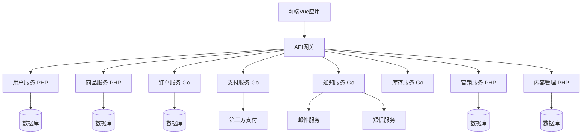

# 在跨境电商系统中Go、PHP、Vue怎样组合是最优的

## 概要回答

在跨境电商系统中，Go、PHP、Vue的最佳组合方式是：Go负责高性能后端服务（如订单处理、支付网关、实时通知），PHP负责内容管理、营销活动等业务逻辑相对复杂的模块，Vue负责构建现代化的前端用户界面。通过合理的微服务架构和API网关，三种技术可以协同工作，发挥各自优势。

## 深度解析

### 1. 技术选型分析

#### 1.1 Go语言的优势和适用场景

**优势**：
- 高性能并发处理能力
- 低内存占用
- 快速编译和部署
- 强大的标准库支持
- 优秀的微服务生态

**适用场景**：
- 订单处理系统
- 支付网关服务
- 实时消息推送
- 库存管理系统
- 数据同步服务

```go
// 订单处理服务示例
package main

import (
    "context"
    "encoding/json"
    "fmt"
    "log"
    "net/http"
    "sync"
    "time"
    
    "github.com/gin-gonic/gin"
)

// 订单结构体
type Order struct {
    ID         string    `json:"id"`
    UserID     string    `json:"user_id"`
    Products   []Product `json:"products"`
    TotalPrice float64   `json:"total_price"`
    Status     string    `json:"status"`
    CreatedAt  time.Time `json:"created_at"`
}

type Product struct {
    ID       string  `json:"id"`
    Name     string  `json:"name"`
    Price    float64 `json:"price"`
    Quantity int     `json:"quantity"`
}

// 订单服务
type OrderService struct {
    orders map[string]Order
    mutex  sync.RWMutex
}

func NewOrderService() *OrderService {
    return &OrderService{
        orders: make(map[string]Order),
    }
}

func (os *OrderService) CreateOrder(order Order) (Order, error) {
    os.mutex.Lock()
    defer os.mutex.Unlock()
    
    order.ID = fmt.Sprintf("ORD-%d", time.Now().Unix())
    order.Status = "pending"
    order.CreatedAt = time.Now()
    
    os.orders[order.ID] = order
    
    // 异步处理订单（模拟）
    go os.processOrder(order.ID)
    
    return order, nil
}

func (os *OrderService) processOrder(orderID string) {
    time.Sleep(2 * time.Second) // 模拟处理时间
    
    os.mutex.Lock()
    defer os.mutex.Unlock()
    
    if order, exists := os.orders[orderID]; exists {
        order.Status = "processed"
        os.orders[orderID] = order
        log.Printf("Order %s processed", orderID)
    }
}

func (os *OrderService) GetOrder(orderID string) (Order, bool) {
    os.mutex.RLock()
    defer os.mutex.RUnlock()
    
    order, exists := os.orders[orderID]
    return order, exists
}

// HTTP处理器
type OrderHandler struct {
    service *OrderService
}

func (oh *OrderHandler) CreateOrder(c *gin.Context) {
    var order Order
    if err := c.ShouldBindJSON(&order); err != nil {
        c.JSON(http.StatusBadRequest, gin.H{"error": err.Error()})
        return
    }
    
    createdOrder, err := oh.service.CreateOrder(order)
    if err != nil {
        c.JSON(http.StatusInternalServerError, gin.H{"error": err.Error()})
        return
    }
    
    c.JSON(http.StatusCreated, createdOrder)
}

func (oh *OrderHandler) GetOrder(c *gin.Context) {
    orderID := c.Param("id")
    order, exists := oh.service.GetOrder(orderID)
    if !exists {
        c.JSON(http.StatusNotFound, gin.H{"error": "Order not found"})
        return
    }
    
    c.JSON(http.StatusOK, order)
}

func main() {
    service := NewOrderService()
    handler := &OrderHandler{service: service}
    
    r := gin.Default()
    r.POST("/orders", handler.CreateOrder)
    r.GET("/orders/:id", handler.GetOrder)
    
    log.Println("Order service starting on :8080")
    r.Run(":8080")
}
```

#### 1.2 PHP语言的优势和适用场景

**优势**：
- 丰富的Web开发框架
- 快速开发能力
- 成熟的电商生态系统
- 强大的内容管理能力
- 丰富的第三方库支持

**适用场景**：
- 商品管理系统
- 营销活动管理
- 内容管理系统
- 用户权限管理
- 报表统计系统

```php
// 商品管理系统示例（Laravel框架）
<?php

namespace App\Http\Controllers;

use App\Models\Product;
use Illuminate\Http\Request;
use Illuminate\Support\Facades\Storage;
use Illuminate\Validation\Rule;

class ProductController extends Controller
{
    /**
     * 显示商品列表
     */
    public function index(Request $request)
    {
        $query = Product::query();
        
        // 搜索过滤
        if ($request->filled('search')) {
            $query->where('name', 'like', '%' . $request->search . '%');
        }
        
        // 分类过滤
        if ($request->filled('category')) {
            $query->where('category_id', $request->category);
        }
        
        // 价格范围过滤
        if ($request->filled('min_price')) {
            $query->where('price', '>=', $request->min_price);
        }
        
        if ($request->filled('max_price')) {
            $query->where('price', '<=', $request->max_price);
        }
        
        $products = $query->paginate(20);
        
        return response()->json($products);
    }
    
    /**
     * 创建商品
     */
    public function store(Request $request)
    {
        $validated = $request->validate([
            'name' => 'required|string|max:255',
            'description' => 'nullable|string',
            'price' => 'required|numeric|min:0',
            'category_id' => 'required|exists:categories,id',
            'stock' => 'required|integer|min:0',
            'images' => 'nullable|array|max:5',
            'images.*' => 'image|mimes:jpeg,png,jpg|max:2048',
        ]);
        
        $product = Product::create($validated);
        
        // 处理上传的图片
        if ($request->hasFile('images')) {
            foreach ($request->file('images') as $image) {
                $path = $image->store('products', 'public');
                $product->images()->create(['path' => $path]);
            }
        }
        
        return response()->json($product, 201);
    }
    
    /**
     * 更新商品
     */
    public function update(Request $request, Product $product)
    {
        $validated = $request->validate([
            'name' => 'sometimes|string|max:255',
            'description' => 'nullable|string',
            'price' => 'sometimes|numeric|min:0',
            'category_id' => 'sometimes|exists:categories,id',
            'stock' => 'sometimes|integer|min:0',
        ]);
        
        $product->update($validated);
        
        return response()->json($product);
    }
    
    /**
     * 删除商品
     */
    public function destroy(Product $product)
    {
        $product->delete();
        
        return response()->json(['message' => 'Product deleted successfully']);
    }
    
    /**
     * 批量更新库存
     */
    public function bulkUpdateStock(Request $request)
    {
        $validated = $request->validate([
            'products' => 'required|array',
            'products.*.id' => 'required|exists:products,id',
            'products.*.stock' => 'required|integer|min:0',
        ]);
        
        foreach ($validated['products'] as $productData) {
            Product::where('id', $productData['id'])->update([
                'stock' => $productData['stock']
            ]);
        }
        
        return response()->json(['message' => 'Stock updated successfully']);
    }
}
```

#### 1.3 Vue.js的优势和适用场景

**优势**：
- 组件化开发
- 响应式数据绑定
- 虚拟DOM提升性能
- 丰富的生态系统
- 渐进式框架设计

**适用场景**：
- 用户前台界面
- 管理后台系统
- 实时数据展示
- 交互式购物车
- 个性化推荐展示

```vue
<!-- 商品列表组件示例 -->
<template>
  <div class="product-list">
    <!-- 搜索和筛选 -->
    <div class="filters">
      <el-input
        v-model="searchQuery"
        placeholder="搜索商品"
        clearable
        @input="handleSearch"
      />
      
      <el-select
        v-model="selectedCategory"
        placeholder="选择分类"
        @change="handleCategoryChange"
      >
        <el-option
          v-for="category in categories"
          :key="category.id"
          :label="category.name"
          :value="category.id"
        />
      </el-select>
      
      <el-slider
        v-model="priceRange"
        range
        :min="0"
        :max="10000"
        @change="handlePriceChange"
      />
    </div>
    
    <!-- 商品列表 -->
    <div class="products-grid">
      <el-card
        v-for="product in products"
        :key="product.id"
        class="product-card"
      >
        
        
        <div class="product-info">
          <h3 class="product-name">{{ product.name }}</h3>
          <p class="product-price">¥{{ product.price }}</p>
          <p class="product-stock">
            <span :class="{ 'low-stock': product.stock < 10 }">
              库存: {{ product.stock }}
            </span>
          </p>
          
          <el-button
            type="primary"
            :disabled="product.stock <= 0"
            @click="addToCart(product)"
          >
            加入购物车
          </el-button>
        </div>
      </el-card>
    </div>
    
    <!-- 分页 -->
    <el-pagination
      :current-page="currentPage"
      :page-size="pageSize"
      :total="totalProducts"
      @current-change="handlePageChange"
    />
  </div>
</template>

<script>
import axios from 'axios'

export default {
  name: 'ProductList',
  
  data() {
    return {
      products: [],
      categories: [],
      searchQuery: '',
      selectedCategory: '',
      priceRange: [0, 10000],
      currentPage: 1,
      pageSize: 20,
      totalProducts: 0,
      searchTimer: null
    }
  },
  
  async mounted() {
    await this.loadCategories()
    await this.loadProducts()
  },
  
  methods: {
    async loadCategories() {
      try {
        const response = await axios.get('/api/categories')
        this.categories = response.data
      } catch (error) {
        console.error('Failed to load categories:', error)
      }
    },
    
    async loadProducts() {
      try {
        const params = {
          page: this.currentPage,
          search: this.searchQuery,
          category: this.selectedCategory,
          min_price: this.priceRange[0],
          max_price: this.priceRange[1]
        }
        
        const response = await axios.get('/api/products', { params })
        this.products = response.data.data
        this.totalProducts = response.data.total
      } catch (error) {
        console.error('Failed to load products:', error)
      }
    },
    
    handleSearch() {
      // 防抖处理
      clearTimeout(this.searchTimer)
      this.searchTimer = setTimeout(() => {
        this.currentPage = 1
        this.loadProducts()
      }, 300)
    },
    
    handleCategoryChange() {
      this.currentPage = 1
      this.loadProducts()
    },
    
    handlePriceChange() {
      this.currentPage = 1
      this.loadProducts()
    },
    
    handlePageChange(page) {
      this.currentPage = page
      this.loadProducts()
    },
    
    addToCart(product) {
      this.$store.dispatch('cart/addToCart', product)
      this.$message.success('商品已加入购物车')
    }
  }
}
</script>

<style scoped>
.product-list {
  padding: 20px;
}

.filters {
  display: flex;
  gap: 20px;
  margin-bottom: 30px;
  align-items: center;
}

.products-grid {
  display: grid;
  grid-template-columns: repeat(auto-fill, minmax(250px, 1fr));
  gap: 20px;
  margin-bottom: 30px;
}

.product-card {
  cursor: pointer;
  transition: transform 0.2s;
}

.product-card:hover {
  transform: translateY(-5px);
}

.product-image {
  width: 100%;
  height: 200px;
  object-fit: cover;
}

.product-info {
  padding: 15px;
}

.product-name {
  margin: 0 0 10px 0;
  font-size: 16px;
  font-weight: bold;
}

.product-price {
  color: #e4393c;
  font-size: 18px;
  font-weight: bold;
  margin: 10px 0;
}

.low-stock {
  color: #ff6b6b;
  font-weight: bold;
}
</style>
```

### 2. 系统架构设计

#### 2.1 微服务架构



#### 2.2 服务职责划分

| 服务 | 技术栈 | 职责 |
|------|--------|------|
| 用户服务 | PHP | 用户注册、登录、权限管理 |
| 商品服务 | PHP | 商品管理、分类、属性管理 |
| 订单服务 | Go | 订单创建、状态管理、订单处理 |
| 支付服务 | Go | 支付处理、退款、对账 |
| 通知服务 | Go | 邮件、短信、站内信发送 |
| 库存服务 | Go | 库存管理、库存扣减、库存同步 |
| 营销服务 | PHP | 优惠券、促销活动、积分系统 |
| 内容管理 | PHP | CMS、文章管理、SEO优化 |

### 3. API网关设计

```go
// API网关示例
package main

import (
    "net/http"
    "net/http/httputil"
    "net/url"
    "strings"
    
    "github.com/gin-gonic/gin"
)

type ProxyConfig struct {
    PathPrefix string
    TargetURL  string
}

var proxyConfigs = []ProxyConfig{
    {"/api/users", "http://user-service:8080"},
    {"/api/products", "http://product-service:8080"},
    {"/api/orders", "http://order-service:8080"},
    {"/api/payments", "http://payment-service:8080"},
    {"/api/notifications", "http://notification-service:8080"},
    {"/api/inventory", "http://inventory-service:8080"},
    {"/api/marketing", "http://marketing-service:8080"},
    {"/api/cms", "http://cms-service:8080"},
}

func main() {
    r := gin.Default()
    
    // 为每个服务配置反向代理
    for _, config := range proxyConfigs {
        target, _ := url.Parse(config.TargetURL)
        proxy := httputil.NewSingleHostReverseProxy(target)
        
        // 注册路由
        r.Any(config.PathPrefix+"/*path", func(c *gin.Context) {
            // 修改请求路径
            path := c.Param("path")
            c.Request.URL.Path = config.PathPrefix + path
            
            // 执行代理
            proxy.ServeHTTP(c.Writer, c.Request)
        })
    }
    
    // 健康检查端点
    r.GET("/health", func(c *gin.Context) {
        c.JSON(http.StatusOK, gin.H{
            "status": "healthy",
            "services": []string{
                "user-service",
                "product-service",
                "order-service",
                "payment-service",
                "notification-service",
                "inventory-service",
                "marketing-service",
                "cms-service",
            },
        })
    })
    
    r.Run(":8000")
}
```

### 4. 数据一致性处理

#### 4.1 分布式事务处理

```go
// 分布式事务协调器示例
package main

import (
    "context"
    "errors"
    "log"
    "time"
)

type TransactionManager struct {
    participants []Participant
}

type Participant interface {
    Prepare(ctx context.Context) error
    Commit(ctx context.Context) error
    Rollback(ctx context.Context) error
}

type OrderParticipant struct {
    orderID string
}

func (op *OrderParticipant) Prepare(ctx context.Context) error {
    // 准备订单状态
    log.Printf("Preparing order %s", op.orderID)
    return nil
}

func (op *OrderParticipant) Commit(ctx context.Context) error {
    // 提交订单
    log.Printf("Committing order %s", op.orderID)
    return nil
}

func (op *OrderParticipant) Rollback(ctx context.Context) error {
    // 回滚订单
    log.Printf("Rolling back order %s", op.orderID)
    return nil
}

type InventoryParticipant struct {
    productID string
    quantity  int
}

func (ip *InventoryParticipant) Prepare(ctx context.Context) error {
    // 检查库存
    log.Printf("Preparing inventory for product %s, quantity %d", ip.productID, ip.quantity)
    return nil
}

func (ip *InventoryParticipant) Commit(ctx context.Context) error {
    // 扣减库存
    log.Printf("Committing inventory for product %s", ip.productID)
    return nil
}

func (ip *InventoryParticipant) Rollback(ctx context.Context) error {
    // 恢复库存
    log.Printf("Rolling back inventory for product %s", ip.productID)
    return nil
}

func (tm *TransactionManager) Execute(ctx context.Context) error {
    // 两阶段提交
    
    // 第一阶段：准备
    for _, participant := range tm.participants {
        if err := participant.Prepare(ctx); err != nil {
            // 准备失败，回滚已准备的参与者
            tm.rollbackPrepared(ctx)
            return err
        }
    }
    
    // 第二阶段：提交
    for _, participant := range tm.participants {
        if err := participant.Commit(ctx); err != nil {
            log.Printf("Commit failed: %v", err)
            // 提交失败，记录错误但继续提交其他参与者
        }
    }
    
    return nil
}

func (tm *TransactionManager) rollbackPrepared(ctx context.Context) {
    for _, participant := range tm.participants {
        if err := participant.Rollback(ctx); err != nil {
            log.Printf("Rollback failed: %v", err)
        }
    }
}

// 使用示例
func createOrderWithInventory() {
    tm := &TransactionManager{
        participants: []Participant{
            &OrderParticipant{orderID: "ORD-12345"},
            &InventoryParticipant{productID: "PROD-001", quantity: 2},
        },
    }
    
    ctx, cancel := context.WithTimeout(context.Background(), 30*time.Second)
    defer cancel()
    
    if err := tm.Execute(ctx); err != nil {
        log.Printf("Transaction failed: %v", err)
    } else {
        log.Println("Transaction completed successfully")
    }
}
```

#### 4.2 最终一致性处理

```php
// 消息队列处理示例（PHP Laravel）
<?php

namespace App\Jobs;

use App\Models\Order;
use App\Models\Inventory;
use Illuminate\Bus\Queueable;
use Illuminate\Contracts\Queue\ShouldQueue;
use Illuminate\Foundation\Bus\Dispatchable;
use Illuminate\Queue\InteractsWithQueue;
use Illuminate\Queue\SerializesModels;
use Illuminate\Support\Facades\Log;

class ProcessOrderJob implements ShouldQueue
{
    use Dispatchable, InteractsWithQueue, Queueable, SerializesModels;
    
    protected $orderId;
    
    public function __construct($orderId)
    {
        $this->orderId = $orderId;
    }
    
    public function handle()
    {
        try {
            $order = Order::findOrFail($this->orderId);
            
            // 1. 处理支付
            if (!$this->processPayment($order)) {
                throw new \Exception('Payment processing failed');
            }
            
            // 2. 扣减库存（发送消息给库存服务）
            $this->deductInventory($order);
            
            // 3. 发送确认邮件
            $this->sendConfirmationEmail($order);
            
            // 4. 更新订单状态
            $order->update(['status' => 'confirmed']);
            
            Log::info("Order {$this->orderId} processed successfully");
        } catch (\Exception $e) {
            Log::error("Failed to process order {$this->orderId}: " . $e->getMessage());
            
            // 重试机制
            if ($this->attempts() < 3) {
                $this->release(60); // 60秒后重试
            } else {
                // 最终失败处理
                $this->handleFinalFailure($order);
            }
        }
    }
    
    private function processPayment($order)
    {
        // 调用支付服务
        $paymentService = new \App\Services\PaymentService();
        return $paymentService->charge($order->total_amount, $order->payment_method);
    }
    
    private function deductInventory($order)
    {
        // 发送消息到库存服务
        foreach ($order->items as $item) {
            \Illuminate\Support\Facades\Queue::push(new \App\Jobs\DeductInventoryJob(
                $item->product_id,
                $item->quantity
            ));
        }
    }
    
    private function sendConfirmationEmail($order)
    {
        // 发送确认邮件
        \Illuminate\Support\Facades\Mail::to($order->customer_email)
            ->send(new \App\Mail\OrderConfirmation($order));
    }
    
    private function handleFinalFailure($order)
    {
        // 最终失败处理
        $order->update(['status' => 'failed']);
        
        // 通知管理员
        \Illuminate\Support\Facades\Notification::send(
            \App\Models\Admin::all(),
            new \App\Notifications\OrderProcessingFailed($order)
        );
    }
}
```

### 5. 性能优化策略

#### 5.1 缓存策略

```go
// 多级缓存示例（Go）
package main

import (
    "encoding/json"
    "time"
    
    "github.com/go-redis/redis/v8"
    "gorm.io/gorm"
)

type ProductService struct {
    db    *gorm.DB
    redis *redis.Client
}

type Product struct {
    ID          uint    `json:"id"`
    Name        string  `json:"name"`
    Description string  `json:"description"`
    Price       float64 `json:"price"`
    CategoryID  uint    `json:"category_id"`
    Stock       int     `json:"stock"`
}

func (ps *ProductService) GetProduct(id uint) (*Product, error) {
    ctx := context.Background()
    
    // 1. 先查本地缓存（如果有）
    // 2. 再查Redis缓存
    cacheKey := fmt.Sprintf("product:%d", id)
    cached, err := ps.redis.Get(ctx, cacheKey).Result()
    if err == nil {
        var product Product
        if json.Unmarshal([]byte(cached), &product) == nil {
            return &product, nil
        }
    }
    
    // 3. 查数据库
    var product Product
    if err := ps.db.First(&product, id).Error; err != nil {
        return nil, err
    }
    
    // 4. 写入缓存
    if data, err := json.Marshal(product); err == nil {
        ps.redis.SetEX(ctx, cacheKey, data, 30*time.Minute)
    }
    
    return &product, nil
}

func (ps *ProductService) UpdateProduct(product *Product) error {
    ctx := context.Background()
    
    // 1. 更新数据库
    if err := ps.db.Save(product).Error; err != nil {
        return err
    }
    
    // 2. 删除缓存
    cacheKey := fmt.Sprintf("product:%d", product.ID)
    ps.redis.Del(ctx, cacheKey)
    
    // 3. 更新相关缓存（如分类商品列表）
    categoryCacheKey := fmt.Sprintf("products:category:%d", product.CategoryID)
    ps.redis.Del(ctx, categoryCacheKey)
    
    return nil
}
```

#### 5.2 数据库优化

```php
// 数据库优化示例（PHP Laravel）
<?php

namespace App\Models;

use Illuminate\Database\Eloquent\Model;

class Product extends Model
{
    protected $fillable = [
        'name',
        'description',
        'price',
        'category_id',
        'stock',
        'sku',
        'status'
    ];
    
    // 索引优化
    protected $with = ['category']; // 预加载关联
    
    // 作用域查询
    public function scopeActive($query)
    {
        return $query->where('status', 'active');
    }
    
    public function scopeByCategory($query, $categoryId)
    {
        return $query->where('category_id', $categoryId);
    }
    
    public function scopeInPriceRange($query, $min, $max)
    {
        return $query->whereBetween('price', [$min, $max]);
    }
    
    // 关联关系
    public function category()
    {
        return $this->belongsTo(Category::class);
    }
    
    public function images()
    {
        return $this->hasMany(ProductImage::class);
    }
    
    public function variants()
    {
        return $this->hasMany(ProductVariant::class);
    }
    
    // 访问器
    public function getFormattedPriceAttribute()
    {
        return '¥' . number_format($this->price, 2);
    }
    
    // 搜索优化
    public function toSearchableArray()
    {
        return [
            'id' => $this->id,
            'name' => $this->name,
            'description' => $this->description,
            'category' => $this->category->name ?? '',
            'price' => $this->price,
        ];
    }
}

// 仓库模式优化查询
namespace App\Repositories;

use App\Models\Product;

class ProductRepository
{
    public function search($filters = [])
    {
        $query = Product::with(['category', 'images'])
                       ->active();
        
        // 动态添加过滤条件
        foreach ($filters as $key => $value) {
            switch ($key) {
                case 'category':
                    $query->byCategory($value);
                    break;
                case 'min_price':
                    $query->where('price', '>=', $value);
                    break;
                case 'max_price':
                    $query->where('price', '<=', $value);
                    break;
                case 'search':
                    $query->where(function ($q) use ($value) {
                        $q->where('name', 'like', "%{$value}%")
                          ->orWhere('description', 'like', "%{$value}%")
                          ->orWhereHas('category', function ($cq) use ($value) {
                              $cq->where('name', 'like', "%{$value}%");
                          });
                    });
                    break;
            }
        }
        
        return $query->orderBy('created_at', 'desc');
    }
    
    public function getFeaturedProducts($limit = 10)
    {
        // 使用Redis缓存热门商品
        $cacheKey = "featured_products:{$limit}";
        
        return \Cache::remember($cacheKey, 300, function () use ($limit) {
            return Product::with(['category', 'images'])
                         ->active()
                         ->orderBy('sales_count', 'desc')
                         ->limit($limit)
                         ->get();
        });
    }
}
```

## 总结

在跨境电商系统中，Go、PHP、Vue的最佳组合方式如下：

### 1. 技术分工建议

**Go语言（后端高性能服务）**：
- 订单处理系统
- 支付网关服务
- 实时通知服务
- 库存管理系统
- 数据同步服务
- API网关

**PHP语言（业务逻辑复杂模块）**：
- 商品管理系统
- 营销活动管理
- 内容管理系统
- 用户权限管理
- 报表统计系统
- SEO优化模块

**Vue.js（前端用户界面）**：
- 用户前台界面
- 管理后台系统
- 实时数据展示
- 交互式购物车
- 个性化推荐展示

### 2. 架构设计原则

1. **服务拆分**：按照业务领域拆分微服务，每个服务职责单一
2. **技术选型**：根据服务特点选择最适合的技术栈
3. **数据一致性**：采用最终一致性方案，通过消息队列保证数据同步
4. **性能优化**：合理使用缓存，优化数据库查询，实施CDN加速
5. **监控运维**：建立完善的监控体系，实施自动化运维

### 3. 实施建议

1. **渐进式迁移**：从新功能开始使用Go，逐步替换核心服务
2. **API标准化**：制定统一的API规范，便于服务间通信
3. **团队培训**：加强团队对Go语言的掌握，提升开发效率
4. **工具链建设**：建立完善的CI/CD流程，提高部署效率
5. **文档完善**：编写详细的技术文档，便于团队协作

这种组合方式能够充分发挥各种技术的优势，构建高性能、高可用、易维护的跨境电商系统。