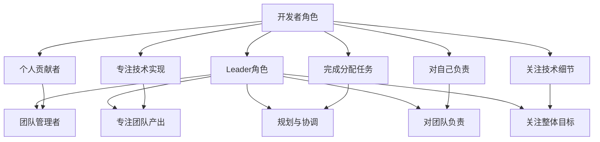
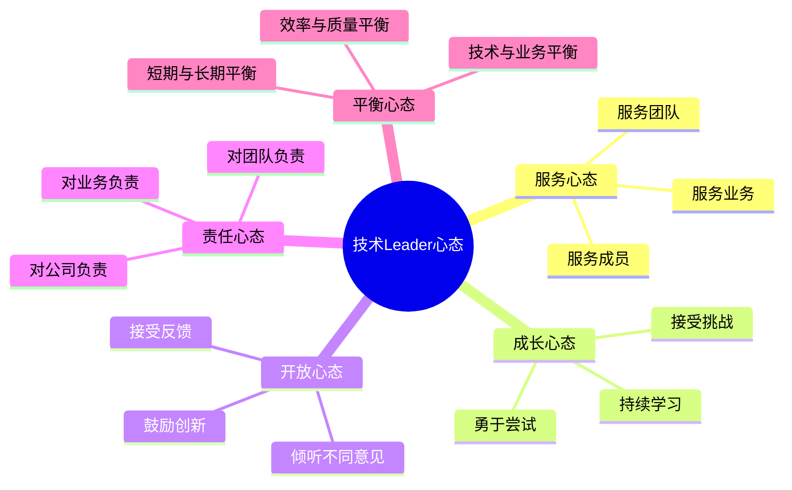

# 角色转换与心态调整

## 1. 从开发者到Leader的角色转变

### 1.1 核心角色变化

### 1.2 关键职责转变

| 职责类型 | 开发者 | 技术Leader |
|----------|--------|------------|
| 工作内容 | 编码、调试、测试 | 规划、协调、指导、决策 |
| 时间分配 | 80% 技术工作，20% 沟通 | 20% 技术工作，80% 管理与沟通 |
| 价值体现 | 代码质量、技术创新 | 团队绩效、业务成果 |
| 责任范围 | 个人任务 | 团队交付、成员成长、技术方向 |
| 决策依据 | 技术最优解 | 综合考虑技术、业务、资源、时间 |

### 1.3 常见角色转换陷阱

| 陷阱 | 表现 | 解决方案 |
|------|------|----------|
| 事必躬亲 | 自己动手解决所有问题，不信任团队成员 | 学会授权，培养团队成员能力 |
| 技术沉迷 | 过度关注技术细节，忽略管理职责 | 设定技术参与边界，聚焦管理核心 |
| 单打独斗 | 仍然以个人方式工作，缺乏团队意识 | 建立团队协作机制，培养团队文化 |
| 沟通不足 | 缺乏与团队、上级、其他部门的沟通 | 制定沟通计划，主动沟通 |
| 目标不清 | 不清楚团队目标和业务价值 | 与上级对齐目标，明确业务优先级 |

## 2. 心态调整与认知升级

### 2.1 必备心态

### 2.2 认知升级

1. **从技术思维到商业思维**
   - 理解业务目标和价值
   - 考虑技术决策的商业影响
   - 关注ROI（投资回报率）

2. **从局部思维到系统思维**
   - 从整体角度看待问题
   - 考虑系统的关联性和复杂性
   - 关注长期稳定性和可扩展性

3. **从个人思维到团队思维**
   - 关注团队整体绩效
   - 培养团队协作能力
   - 激发团队成员潜力

4. **从执行思维到战略思维**
   - 参与技术规划和战略制定
   - 关注技术趋势和行业发展
   - 为公司提供技术方向建议

### 2.3 心态调整技巧

1. **接受不完美**
   - 允许团队成员犯错误
   - 接受自己在管理上的不足
   - 聚焦持续改进而非完美主义

2. **学会放手**
   - 授权团队成员处理任务
   - 信任团队成员的能力
   - 给予成员成长空间

3. **保持学习**
   - 学习管理知识和技能
   - 关注管理领域的最新理念
   - 向有经验的管理者学习

4. **管理情绪**
   - 控制自己的情绪反应
   - 保持冷静和理性
   - 学会压力管理

5. **建立自信**
   - 认可自己的管理能力
   - 总结管理成功经验
   - 逐步建立管理自信

## 3. 技术Leader的核心能力

### 3.1 技术能力

| 能力项 | 描述 | 重要程度 |
|--------|------|----------|
| 技术深度 | 深入掌握PHP技术栈及相关技术 | ★★★★☆ |
| 架构设计 | 能够设计高性能、可扩展的系统架构 | ★★★★★ |
| 技术选型 | 根据业务需求选择合适的技术方案 | ★★★★★ |
| 问题解决 | 能够快速定位和解决复杂技术问题 | ★★★★★ |
| 技术趋势 | 关注技术发展趋势，规划技术路线 | ★★★★☆ |

### 3.2 管理能力

| 能力项 | 描述 | 重要程度 |
|--------|------|----------|
| 团队管理 | 招聘、培训、激励团队成员 | ★★★★★ |
| 任务分配 | 合理分配任务，平衡工作负载 | ★★★★★ |
| 项目管理 | 规划和跟踪项目进度，确保按时交付 | ★★★★★ |
| 资源协调 | 协调人力、物力资源，解决资源冲突 | ★★★★☆ |
| 风险管理 | 识别和应对项目风险，制定应急预案 | ★★★★☆ |

### 3.3 沟通能力

| 能力项 | 描述 | 重要程度 |
|--------|------|----------|
| 表达能力 | 清晰表达想法和决策，避免误解 | ★★★★★ |
| 倾听能力 | 认真倾听团队成员和其他利益相关者的意见 | ★★★★★ |
| 反馈能力 | 提供建设性反馈，帮助团队成员成长 | ★★★★★ |
| 谈判能力 | 与其他部门协商，争取资源和支持 | ★★★★☆ |
| 冲突处理 | 妥善处理团队内部和跨部门冲突 | ★★★★☆ |

### 3.4 领导力

| 能力项 | 描述 | 重要程度 |
|--------|------|----------|
| 决策能力 | 快速做出合理决策，承担决策责任 | ★★★★★ |
| 影响力 | 影响团队成员和其他利益相关者，推动决策执行 | ★★★★★ |
| 激励能力 | 激发团队成员的工作积极性和创造力 | ★★★★★ |
| 愿景规划 | 为团队设定清晰的愿景和目标 | ★★★★☆ |
| 文化建设 | 营造积极向上的团队文化 | ★★★★☆ |

## 4. 第一天作为技术Leader

### 4.1 上任前准备

1. **了解团队情况**
   - 团队成员组成和背景
   - 团队当前项目和任务
   - 团队面临的挑战和问题
   - 团队的优势和劣势

2. **了解业务情况**
   - 公司业务模式和核心产品
   - 团队负责的业务模块
   - 业务目标和优先级
   - 业务面临的挑战

3. **制定初步计划**
   - 第一周的工作重点
   - 与团队成员的沟通计划
   - 与上级的对齐计划
   - 初始的团队建设活动

### 4.2 上任第一天

1. **与上级沟通**
   - 确认团队目标和期望
   - 了解公司对团队的要求
   - 讨论工作重点和优先级
   - 争取必要的资源支持

2. **与团队见面**
   - 自我介绍和背景介绍
   - 表达对团队的认可和期望
   - 倾听团队成员的想法和建议
   - 建立初步的信任关系

3. **了解当前工作**
   - 查看当前项目进度
   - 了解团队的工作流程
   - 识别紧急和重要的任务
   - 确保日常工作正常进行

4. **制定沟通机制**
   - 团队会议频率和形式
   - 一对一沟通计划
   - 进度汇报机制
   - 问题反馈渠道

### 4.3 第一周重点工作

| 时间 | 重点工作 | 目标 |
|------|----------|------|
| 第1天 | 团队见面，了解情况 | 建立初步关系，了解现状 |
| 第2-3天 | 与团队成员一对一沟通 | 深入了解每个成员，建立信任 |
| 第4天 | 梳理当前项目和任务 | 明确工作重点和优先级 |
| 第5天 | 召开团队会议 | 分享初步计划，收集反馈 |

## 5. 常见挑战及应对策略

### 5.1 挑战1：团队成员不配合

**表现**：
- 对新Leader持怀疑态度
- 不执行分配的任务
- 消极对待团队活动

**应对策略**：
1. 建立信任关系，展示自己的能力和诚意
2. 倾听团队成员的意见和顾虑
3. 尊重团队现有的工作方式和文化
4. 逐步引入新的管理方式，避免激进变革
5. 以身作则，展现良好的工作态度和专业能力

### 5.2 挑战2：工作压力过大

**表现**：
- 工作时间过长，身心疲惫
- 难以平衡技术工作和管理工作
- 感到力不从心，压力山大

**应对策略**：
1. 合理安排时间，设定工作边界
2. 学会授权，将任务分配给合适的团队成员
3. 建立支持网络，寻求上级和其他Leader的帮助
4. 关注自身健康，保持良好的生活习惯
5. 定期反思和调整工作方式

### 5.3 挑战3：技术决策困难

**表现**：
- 面对多个技术方案难以选择
- 担心技术决策失误
- 受到团队成员不同意见的影响

**应对策略**：
1. 建立技术决策流程，明确决策依据
2. 收集充分的信息和意见
3. 考虑技术方案的长期影响
4. 敢于决策，承担决策责任
5. 建立决策反馈机制，及时调整

### 5.4 挑战4：团队绩效不佳

**表现**：
- 项目延期交付
- 代码质量不高
- 团队成员积极性低

**应对策略**：
1. 分析绩效不佳的根本原因
2. 设定明确的绩效目标和标准
3. 建立有效的激励机制
4. 提供必要的培训和支持
5. 及时调整团队结构和工作方式

## 6. 角色转换成功的标志

1. **团队信任**：团队成员信任你的领导能力和决策
2. **高效执行**：团队能够高效完成任务，交付高质量成果
3. **成员成长**：团队成员在你的领导下不断成长和进步
4. **业务认可**：上级和业务部门认可团队的贡献和价值
5. **个人成长**：你自身的管理能力和领导力不断提升
6. **文化建设**：团队形成积极向上的文化和良好的工作氛围

## 7. 案例分析：从PHP开发者到技术Leader的转变

### 7.1 背景介绍

小李是一名优秀的PHP开发者，在公司工作了5年，技术能力突出，被提拔为技术Leader，负责一个10人的PHP开发团队。

### 7.2 面临的挑战

1. 团队成员技术水平参差不齐
2. 项目进度经常延期
3. 团队沟通不畅，协作效率低
4. 小李缺乏管理经验，不知道如何领导团队

### 7.3 采取的措施

1. **角色转变**
   - 减少个人编码时间，将更多精力放在管理和协调上
   - 学习管理知识和技能，参加管理培训
   - 向有经验的技术Leader请教

2. **团队管理**
   - 与团队成员一对一沟通，了解每个人的情况和期望
   - 建立清晰的团队目标和工作流程
   - 合理分配任务，根据成员能力安排工作
   - 建立有效的绩效考核机制

3. **技术管理**
   - 制定技术规范和最佳实践
   - 引入代码评审机制，提高代码质量
   - 规划技术路线，逐步升级技术栈
   - 管理技术债务，定期进行技术重构

4. **团队建设**
   - 组织团队活动，增强团队凝聚力
   - 建立学习分享机制，促进成员成长
   - 鼓励创新和尝试，营造积极向上的文化

### 7.4 取得的成果

1. 团队绩效显著提升，项目按时交付率从60%提高到90%
2. 代码质量明显改善，bug数量减少了50%
3. 团队成员满意度提高，离职率降低
4. 小李的管理能力得到认可，被评为年度优秀管理者

### 7.5 经验总结

1. **转变心态**：从技术思维转变为管理思维
2. **持续学习**：不断提升管理能力和领导力
3. **关注团队**：重视团队建设和成员成长
4. **沟通协作**：建立良好的沟通机制和协作氛围
5. **结果导向**：关注业务成果和团队绩效

## 8. 总结与行动建议

### 8.1 总结

从PHP开发者到技术Leader的转变是一个挑战，但也是一个重要的成长机会。成功的角色转换需要：

1. **心态调整**：从技术思维转变为管理思维，培养服务心态、成长心态、开放心态、责任心态和平衡心态
2. **能力提升**：提升管理能力、沟通能力和领导力
3. **实践探索**：在实际工作中不断尝试和调整管理方式
4. **持续学习**：学习管理知识和技能，向有经验的管理者学习
5. **关注团队**：重视团队建设和成员成长，建立良好的团队文化

### 8.2 行动建议

1. **制定个人发展计划**：明确管理能力提升的目标和路径
2. **建立学习机制**：定期学习管理知识和技能
3. **寻求导师指导**：找一位有经验的技术Leader作为导师
4. **实践管理技巧**：将学到的管理技巧应用到实际工作中
5. **定期反思总结**：回顾管理实践，总结经验教训
6. **加入管理社群**：与其他技术Leader交流管理经验

通过不断的学习和实践，你一定能够成为一名优秀的技术Leader，带领团队取得出色的业绩。