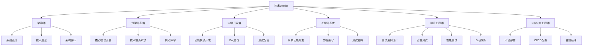
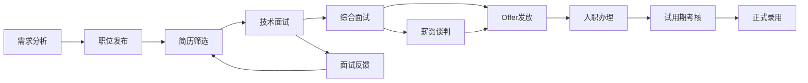
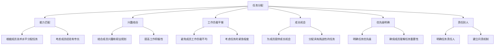
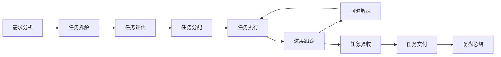
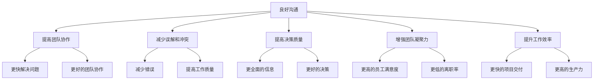
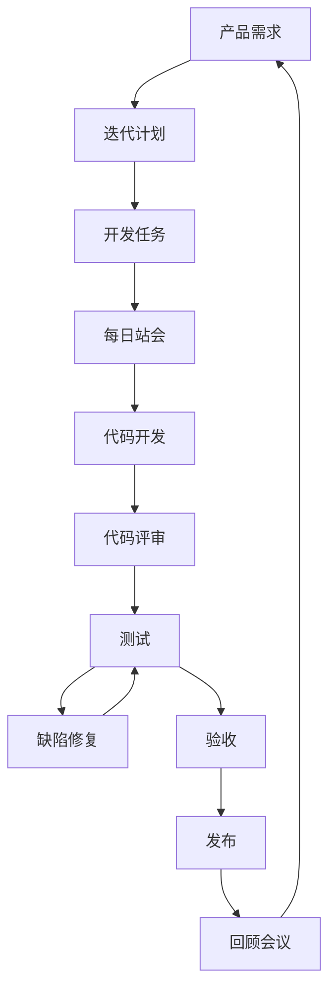
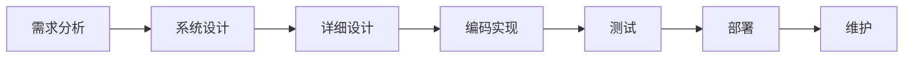
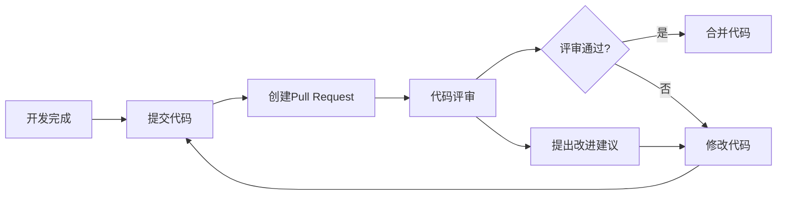
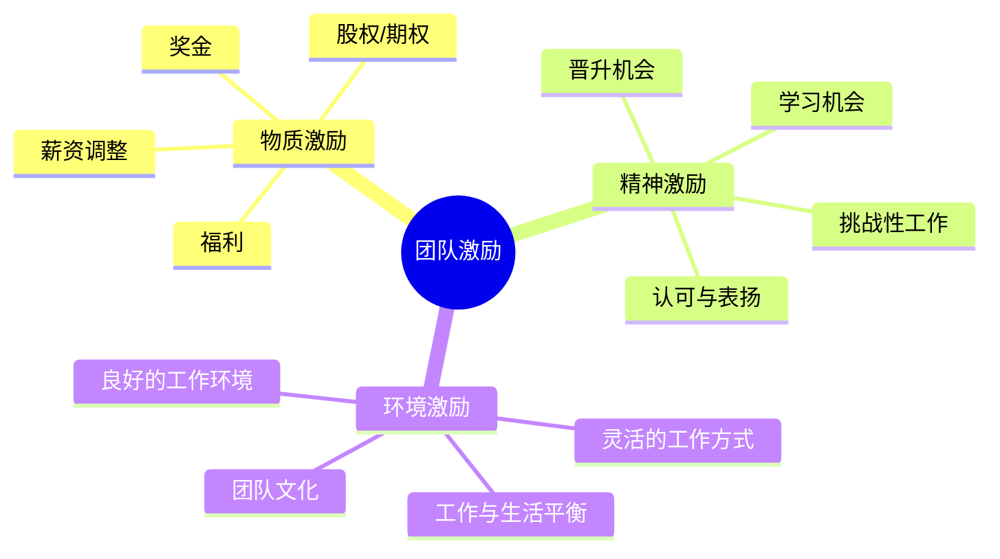
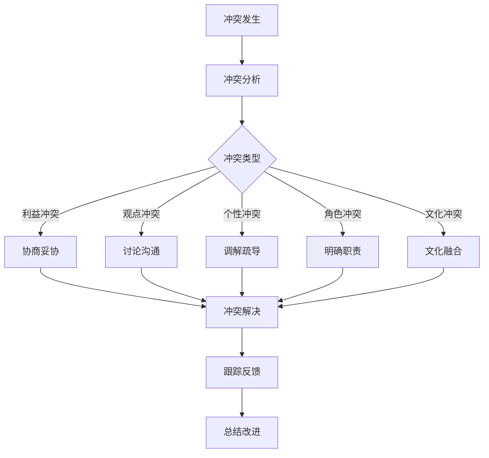

# 团队管理基础

## 1. 团队组建与人员管理

### 1.1 团队角色与结构

### 1.2 招聘与面试

#### 1.2.1 招聘流程

#### 1.2.2 技术面试要点

| 面试阶段 | 重点考察 | 考察方式 |
|----------|----------|----------|
| 基础技术 | PHP核心概念、数据结构与算法 | 笔试、代码题 |
| 实战经验 | 项目经验、问题解决能力 | 项目分享、案例分析 |
| 架构能力 | 系统设计、技术选型 | 架构设计题 |
| 学习能力 | 技术热情、学习方法 | 技术趋势讨论 |
| 团队协作 | 沟通能力、协作经验 | 场景题 |

#### 1.2.3 面试评价表

| 评价维度 | 评分（1-5） | 评价说明 |
|----------|-------------|----------|
| 技术基础 | | |
| 实战经验 | | |
| 架构能力 | | |
| 学习能力 | | |
| 团队协作 | | |
| 沟通能力 | | |
| 文化匹配 | | |
| 综合评价 | | |

### 1.3 试用期管理

#### 1.3.1 试用期目标设定

1. **技术目标**：掌握团队技术栈、完成指定功能模块
2. **团队融入**：熟悉团队文化、建立良好的人际关系
3. **能力提升**：学习新技能、解决技术问题
4. **工作态度**：工作积极性、责任心、团队协作

#### 1.3.2 试用期考核

| 考核项 | 权重 | 考核方式 |
|--------|------|----------|
| 工作成果 | 40% | 完成的任务数量和质量 |
| 技术能力 | 30% | 技术掌握程度、问题解决能力 |
| 团队协作 | 20% | 团队成员评价、沟通协作能力 |
| 工作态度 | 10% | 工作积极性、责任心、主动性 |

#### 1.3.3 试用期指导

1. 安排导师，提供一对一指导
2. 定期沟通，了解工作进展和困难
3. 提供必要的培训和学习资源
4. 及时反馈，指出改进方向

## 2. 任务分配与进度管理

### 2.1 任务分配原则

### 2.2 任务管理流程

### 2.3 进度跟踪方法

#### 2.3.1 每日站会

| 要素 | 说明 |
|------|------|
| 时间 | 每天15-30分钟 |
| 参与人员 | 全体团队成员 |
| 内容 | 1. 昨天完成了什么 2. 今天计划做什么 3. 遇到了什么问题 |
| 目的 | 同步进度、发现问题、协调资源 |

#### 2.3.2 周会

| 要素 | 说明 |
|------|------|
| 时间 | 每周1-2小时 |
| 参与人员 | 全体团队成员 |
| 内容 | 1. 本周工作回顾 2. 下周工作规划 3. 问题讨论与解决 4. 技术分享 |
| 目的 | 总结一周工作、规划下周任务、解决重大问题、促进团队学习 |

#### 2.3.3 项目管理工具

| 工具名称 | 特点 | 适用场景 |
|----------|------|----------|
| Jira | 功能全面，支持敏捷开发 | 大型项目、复杂流程 |
| Trello | 简单易用，可视化强 | 小型项目、敏捷团队 |
| GitHub Projects | 与代码仓库集成 | 开发团队 |
| 飞书/钉钉/企业微信 | 集成沟通功能 | 团队协作 |

### 2.4 常见进度问题及解决

| 问题 | 原因 | 解决方案 |
|------|------|----------|
| 任务延期 | 需求变更、技术难点、资源不足 | 重新评估任务、调整计划、寻求支持 |
| 进度虚报 | 成员害怕担责、任务评估不准确 | 建立信任、细化任务、定期检查 |
| 资源冲突 | 多个项目同时进行、人员不足 | 协调资源、优先级排序、调整计划 |
| 依赖问题 | 跨团队依赖、任务依赖 | 明确依赖关系、提前沟通、主动跟进 |

## 3. 沟通管理

### 3.1 沟通的重要性

### 3.2 沟通类型与方式

| 沟通类型 | 适用场景 | 沟通方式 |
|----------|----------|----------|
| 日常沟通 | 简单信息同步、问题讨论 | 即时通讯（飞书/钉钉）、面对面交流 |
| 正式沟通 | 项目汇报、重要决策 | 会议、邮件、报告 |
| 一对一沟通 | 绩效反馈、职业规划、问题解决 | 面对面交流、视频会议 |
| 跨团队沟通 | 协作项目、资源协调 | 会议、邮件、文档共享 |
| 向上沟通 | 工作汇报、争取资源、请求支持 | 定期汇报、邮件、会议 |

### 3.3 有效沟通技巧

1. **倾听技巧**
   - 专注倾听，不打断对方
   - 用肢体语言表示关注
   - 适时提问，确认理解
   - 总结对方的观点

2. **表达技巧**
   - 清晰简洁，重点突出
   - 用数据和事实支持观点
   - 考虑听众的背景和需求
   - 使用恰当的沟通方式

3. **反馈技巧**
   - 及时反馈，不要拖延
   - 具体明确，指出具体行为和影响
   - 客观中立，避免情绪化
   - 提供建设性的改进建议

4. **冲突处理技巧**
   - 保持冷静，避免激化矛盾
   - 了解双方的立场和需求
   - 寻找共同利益点
   - 提出双赢的解决方案

### 3.4 沟通机制建设

1. **定期沟通**
   - 每日站会
   - 周会
   - 月度总结会
   - 季度规划会

2. **沟通渠道**
   - 建立明确的沟通渠道
   - 确保信息的及时传递
   - 避免信息孤岛

3. **文档共享**
   - 建立知识库
   - 规范文档格式和存放位置
   - 定期更新文档

4. **透明度建设**
   - 公开团队目标和进展
   - 分享重要信息和决策
   - 鼓励团队成员参与决策

## 4. 团队协作与效率提升

### 4.1 协作模式

#### 4.1.1 敏捷开发

#### 4.1.2 瀑布模型

#### 4.1.3 混合模式

| 模式 | 特点 | 适用场景 |
|------|------|----------|
| 敏捷开发 | 灵活、迭代、快速反馈 | 需求变化快、创新性强的项目 |
| 瀑布模型 | 结构化、文档驱动、阶段明确 | 需求稳定、规模大的项目 |
| 混合模式 | 结合两者优点，根据项目特点调整 | 大多数实际项目 |

### 4.2 协作工具

| 工具类型 | 工具名称 | 功能 |
|----------|----------|------|
| 代码管理 | Git、SVN | 版本控制、代码共享 |
| 协作开发 | GitHub、GitLab、Bitbucket | 代码托管、协作开发 |
| CI/CD | Jenkins、GitLab CI、GitHub Actions | 自动化构建、测试、部署 |
| 文档协作 | Confluence、飞书文档、语雀 | 文档编写、共享、协作 |
| 即时通讯 | 飞书、钉钉、Slack | 团队沟通、信息同步 |
| 项目管理 | Jira、Trello、Asana | 任务管理、进度跟踪 |
| 设计协作 | Figma、Sketch | 设计稿共享、协作 |

### 4.3 团队效率提升技巧

1. **流程优化**
   - 简化流程，减少不必要的环节
   - 自动化重复工作
   - 持续改进流程

2. **知识共享**
   - 建立知识库
   - 定期技术分享
   - 代码评审
   - 文档化最佳实践

3. **技能提升**
   - 提供培训机会
   - 鼓励学习和成长
   - 建立导师制度

4. **授权与信任**
   - 授权团队成员做决策
   - 信任团队成员的能力
   - 给予成员成长空间

5. **激励机制**
   - 认可和奖励优秀表现
   - 提供晋升机会
   - 创造良好的工作环境

### 4.4 代码质量与规范

#### 4.4.1 代码规范

1. **PHP代码规范**
   - 遵循PSR-1、PSR-2、PSR-4等PHP标准
   - 统一代码风格，使用PHP-CS-Fixer等工具
   - 编写清晰的注释
   - 使用有意义的变量和函数名

2. **代码评审流程**

3. **代码评审要点**
   - 代码正确性和安全性
   - 代码可读性和可维护性
   - 性能和效率
   - 遵循代码规范
   - 测试覆盖率

#### 4.4.2 测试策略

| 测试类型 | 目的 | 执行者 |
|----------|------|--------|
| 单元测试 | 测试单个函数或方法 | 开发人员 |
| 集成测试 | 测试模块间的交互 | 开发人员 |
| 功能测试 | 测试功能是否符合需求 | 测试人员 |
| 性能测试 | 测试系统性能 | 测试/DevOps人员 |
| 安全测试 | 测试系统安全性 | 安全团队/开发人员 |

## 5. 团队激励与文化建设

### 5.1 激励机制

#### 5.1.1 激励类型

#### 5.1.2 激励原则

1. **公平公正**：激励制度要公平公正，避免偏袒
2. **及时有效**：及时给予激励，增强激励效果
3. **个性化**：根据成员的需求和特点，采用不同的激励方式
4. **目标明确**：将激励与绩效目标挂钩
5. **正向激励为主**：多采用正向激励，少用惩罚

### 5.2 团队文化建设

#### 5.2.1 团队文化要素

| 要素 | 描述 | 实践方式 |
|------|------|----------|
| 价值观 | 团队共同的价值取向 | 明确团队价值观，以身作则 |
| 信任 | 成员之间相互信任 | 授权、透明沟通、共同决策 |
| 协作 | 团队成员协作互助 | 建立协作机制，鼓励知识共享 |
| 创新 | 鼓励创新和尝试 | 容忍失败，奖励创新 |
| 学习 | 持续学习和成长 | 技术分享、培训、学习资源 |
| 责任 | 成员勇于承担责任 | 明确责任，建立问责机制 |

#### 5.2.2 文化建设活动

1. **技术分享会**：定期组织技术分享，促进团队学习
2. **团队建设活动**：户外活动、聚餐、游戏等，增强团队凝聚力
3. **代码马拉松**：组织代码竞赛，激发创新和协作
4. **学习小组**：成立学习小组，共同学习新技术
5. **庆祝活动**：庆祝项目成功、团队成员生日等

#### 5.2.3 文化建设案例

**案例**：某PHP开发团队的文化建设

1. **技术分享**：每周五下午举办技术分享会，团队成员轮流分享技术知识
2. **代码评审**：建立严格的代码评审制度，促进代码质量和知识共享
3. **学习资源**：为团队成员提供学习资源和培训机会
4. **灵活工作**：实行弹性工作制，允许远程办公
5. **团队活动**：每月组织一次团队活动，增强团队凝聚力
6. **开放沟通**：建立开放的沟通机制，鼓励团队成员参与决策

**成果**：
- 团队成员技术水平显著提升
- 代码质量明显改善
- 团队凝聚力增强，离职率降低
- 项目交付效率提高

## 6. 团队冲突管理

### 6.1 冲突类型

| 冲突类型 | 表现 | 原因 |
|----------|------|------|
| 利益冲突 | 资源分配、晋升机会等 | 资源有限、利益诉求不同 |
| 观点冲突 | 技术方案、工作方法等 | 认知差异、经验不同 |
| 个性冲突 | 性格不合、沟通方式等 | 性格差异、沟通技巧不足 |
| 角色冲突 | 角色定位、职责划分等 | 职责不清、角色重叠 |
| 文化冲突 | 价值观、工作习惯等 | 背景差异、文化差异 |

### 6.2 冲突处理策略

### 6.3 冲突处理技巧

1. **保持冷静**：避免情绪化反应，保持理性
2. **倾听各方意见**：了解冲突各方的立场和需求
3. **寻找共同点**：聚焦共同目标，寻找双赢解决方案
4. **公正中立**：作为Leader，要保持公正中立
5. **及时处理**：不要拖延，及时解决冲突
6. **建立规则**：建立冲突处理规则和流程
7. **预防为主**：建立良好的沟通机制，预防冲突发生

### 6.4 案例分析：技术方案冲突

**背景**：团队在选择PHP框架时，出现了冲突。一部分成员主张使用Laravel，认为其生态完善，开发效率高；另一部分成员主张使用ThinkPHP，认为其轻量，学习成本低。

**处理过程**：
1. **组织讨论**：召开技术方案讨论会，让双方充分表达观点
2. **分析比较**：从性能、生态、学习成本、团队熟悉度等方面分析两种框架
3. **达成共识**：经过讨论，团队达成共识，选择Laravel作为主要框架，并制定了学习计划，帮助不熟悉Laravel的成员快速掌握
4. **跟踪反馈**：在项目实施过程中，跟踪Laravel的使用情况，及时解决遇到的问题

**结果**：
- 团队成员接受了最终决定
- 提高了团队的协作能力和决策能力
- 项目顺利进行，开发效率得到提升

## 7. 团队绩效评估

### 7.1 绩效评估体系

#### 7.1.1 评估维度

| 维度 | 评估内容 | 权重 |
|------|----------|------|
| 工作成果 | 完成的任务数量和质量 | 40% |
| 技术能力 | 技术水平、问题解决能力 | 25% |
| 团队协作 | 沟通能力、协作精神 | 20% |
| 学习成长 | 技术成长、知识分享 | 10% |
| 工作态度 | 积极性、责任心、主动性 | 5% |

#### 7.1.2 评估方法

| 方法 | 特点 | 适用场景 |
|------|------|----------|
| 自评 | 成员自我评估 | 了解成员的自我认知 |
| 互评 | 团队成员相互评估 | 了解成员的团队表现 |
| 上级评估 | 直接上级评估 | 综合评估成员表现 |
| 360度评估 | 多方面评估（上级、同事、下属、客户） | 全面评估成员表现 |

### 7.2 绩效反馈与改进

1. **反馈原则**
   - 及时反馈，不要拖延
   - 具体明确，指出具体行为和影响
   - 客观中立，避免情绪化
   - 提供建设性的改进建议
   - 倾听成员的反馈和想法

2. **改进计划**
   - 与成员共同制定改进计划
   - 明确改进目标和时间节点
   - 提供必要的支持和资源
   - 定期跟踪改进进度
   - 及时调整改进计划

3. **绩效激励**
   - 根据绩效评估结果，给予相应的激励
   - 优秀绩效给予奖励和晋升机会
   - 绩效不佳的成员给予指导和培训
   - 严重绩效问题的成员进行调岗或淘汰

## 8. 总结与行动建议

### 8.1 团队管理核心要点

1. **明确目标**：确保团队成员理解团队目标和个人目标
2. **有效沟通**：建立良好的沟通机制，保持信息透明
3. **合理分工**：根据成员能力和兴趣分配任务，平衡工作负载
4. **激励成员**：采用多种激励方式，激发成员的工作积极性
5. **培养团队**：关注成员成长，提供学习和发展机会
6. **建设文化**：营造积极向上的团队文化，增强团队凝聚力
7. **持续改进**：不断优化团队流程和管理方式

### 8.2 行动建议

1. **制定团队章程**：明确团队目标、价值观、规则和流程
2. **建立沟通机制**：制定定期沟通计划，包括每日站会、周会等
3. **选择合适的项目管理工具**：根据团队特点选择合适的项目管理工具
4. **建立代码评审制度**：制定代码评审流程和标准
5. **组织团队建设活动**：定期组织团队活动，增强团队凝聚力
6. **制定绩效评估体系**：建立科学的绩效评估体系
7. **关注成员成长**：为成员提供学习和发展机会
8. **持续学习和改进**：不断学习管理知识和技能，改进管理方式

### 8.3 团队管理案例：PHP开发团队的成功转型

**背景**：某公司的PHP开发团队存在协作效率低、代码质量差、项目经常延期等问题。新任技术Leader上任后，采取了一系列措施改进团队管理。

**措施**：
1. **明确团队目标**：与上级对齐团队目标，明确团队的业务价值
2. **建立沟通机制**：实施每日站会、周会等沟通机制
3. **引入敏捷开发**：采用Scrum敏捷开发方法，提高开发效率
4. **建立代码评审制度**：严格执行代码评审，提高代码质量
5. **培养团队文化**：组织技术分享、团队活动等，增强团队凝聚力
6. **关注成员成长**：为成员提供学习资源和培训机会

**成果**：
- 项目交付时间缩短了30%
- 代码质量明显改善，bug数量减少了50%
- 团队协作效率提高，成员满意度提升
- 团队凝聚力增强，离职率降低
- 上级和业务部门对团队的认可度提高

通过以上措施，该PHP开发团队成功转型为高效、协作、有凝聚力的团队，为公司业务发展提供了有力支持。