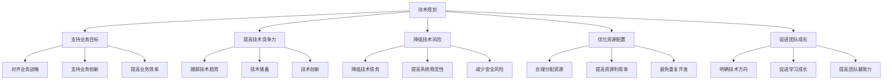
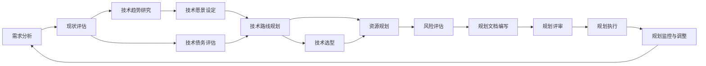
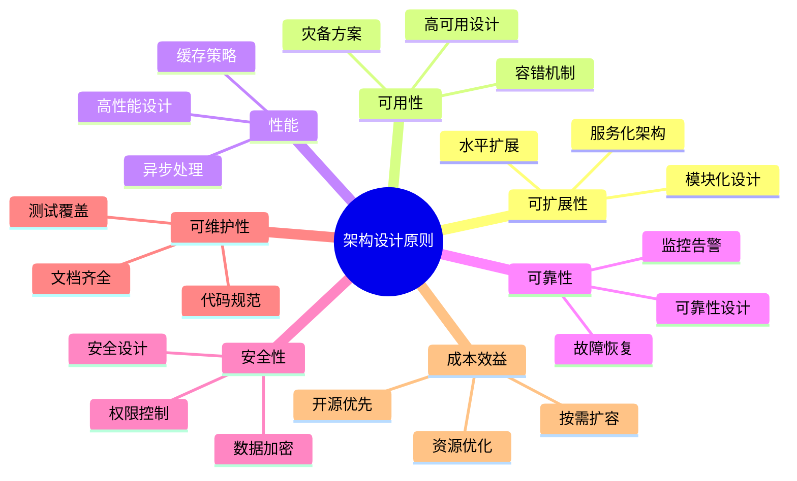
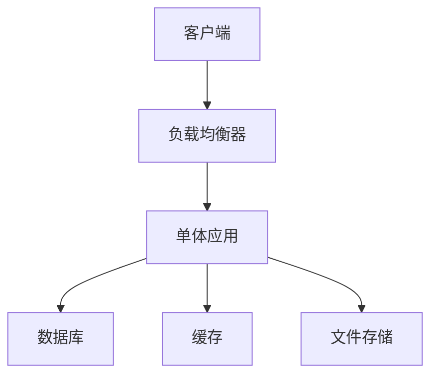
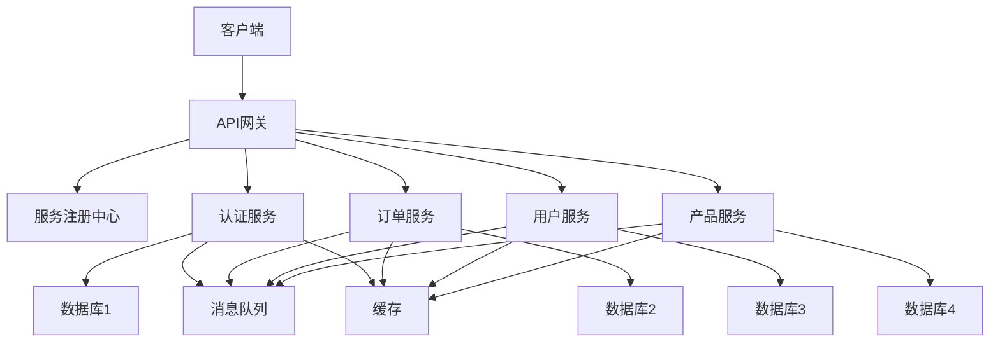
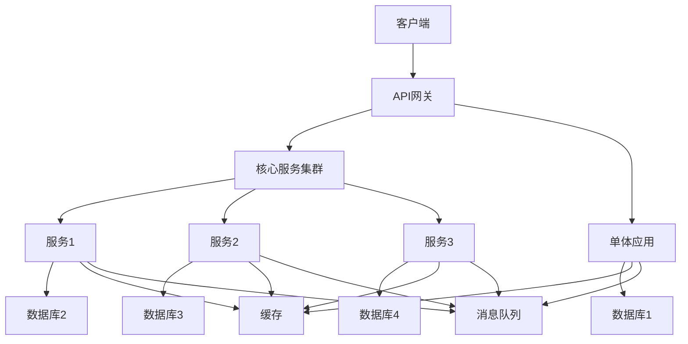
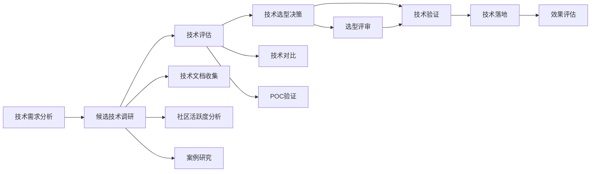
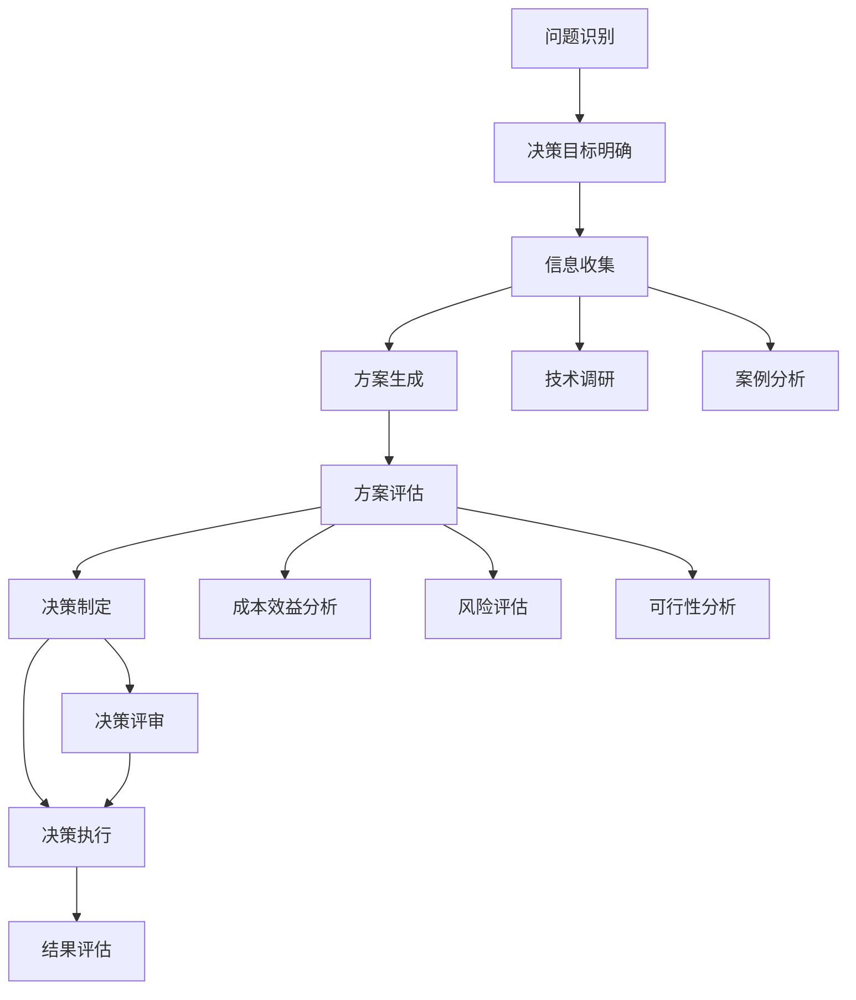

# 技术规划与决策

## 1. 技术规划概述

### 1.1 什么是技术规划

技术规划是指在了解业务需求和技术趋势的基础上，制定技术发展路线、架构设计、技术选型等方面的计划，以支持业务目标的实现。

### 1.2 技术规划的重要性



### 1.3 技术规划的层次

| 层次 | 时间范围 | 规划内容 | 负责角色 |
|------|----------|----------|----------|
| 战略层 | 3-5年 | 技术愿景、核心技术路线、技术架构演进 | CTO、技术总监 |
| 战术层 | 1-2年 | 年度技术目标、重点项目、技术选型 | 技术Leader |
| 执行层 | 3-6个月 | 具体技术方案、开发计划、资源分配 | 架构师、项目经理 |

## 2. 技术规划制定流程

### 2.1 规划制定步骤



### 2.2 需求分析

1. **业务需求**
   - 了解公司业务战略和目标
   - 分析业务增长预期
   - 识别业务痛点和挑战
   - 明确业务对技术的要求

2. **用户需求**
   - 了解用户痛点和期望
   - 分析用户行为和反馈
   - 识别用户需求变化趋势

3. **技术需求**
   - 分析现有系统的局限性
   - 识别技术债务
   - 了解团队技术能力现状
   - 明确技术升级需求

### 2.3 现状评估

1. **技术架构评估**
   - 分析现有系统架构
   - 评估架构的可扩展性、可用性、性能等
   - 识别架构瓶颈和问题

2. **技术栈评估**
   - 分析现有技术栈
   - 评估技术栈的成熟度、社区活跃度、支持情况
   - 识别技术栈的局限性

3. **技术债务评估**
   - 识别现有技术债务
   - 评估技术债务的影响和风险
   - 制定技术债务偿还计划

4. **团队能力评估**
   - 评估团队技术能力
   - 识别团队的优势和劣势
   - 明确团队能力提升需求

### 2.4 技术趋势研究

1. **行业技术趋势**
   - 关注PHP生态的发展趋势
   - 跟踪云计算、大数据、AI等相关技术的发展
   - 了解行业最佳实践

2. **竞争对手技术分析**
   - 分析竞争对手的技术架构
   - 了解竞争对手的技术优势
   - 识别技术差距

3. **技术社区动态**
   - 关注开源社区的发展
   - 参与技术社区活动
   - 学习和借鉴开源项目的经验

### 2.5 技术路线规划

1. **核心技术方向**
   - 确定核心技术发展方向
   - 制定技术演进路线图
   - 明确技术里程碑

2. **技术架构演进**
   - 设计未来架构蓝图
   - 制定架构演进步骤
   - 明确每阶段的架构目标

3. **技术选型计划**
   - 确定需要选型的技术领域
   - 制定技术选型标准
   - 规划技术选型时间节点

4. **技术债务偿还计划**
   - 确定优先偿还的技术债务
   - 制定技术债务偿还时间表
   - 明确偿还技术债务的资源需求

## 3. 技术架构设计

### 3.1 架构设计原则



### 3.2 常见架构模式

#### 3.2.1 单体架构



**特点**：
- 结构简单，开发效率高
- 部署方便，维护成本低
- 扩展性差，性能瓶颈明显
- 适合小型应用或初创项目

#### 3.2.2 微服务架构



**特点**：
- 服务独立部署，扩展性好
- 服务间低耦合，便于团队协作
- 技术栈灵活，可根据服务选择合适技术
- 部署和维护复杂度高
- 适合大型应用或高并发场景

#### 3.2.3 混合架构



**特点**：
- 结合单体架构和微服务架构的优点
- 核心业务模块微服务化，非核心模块保持单体
- 逐步演进，降低重构风险
- 适合中型应用或正在转型的项目

### 3.3 架构设计文档

#### 3.3.1 架构设计文档结构

```
1. 架构概述
   1.1 设计目标
   1.2 设计原则
   1.3 架构总览

2. 系统架构
   2.1 系统分层
   2.2 核心组件
   2.3 数据流图
   2.4 关键流程

3. 技术选型
   3.1 语言与框架
   3.2 数据库
   3.3 缓存
   3.4 消息队列
   3.5 中间件

4. 非功能性设计
   4.1 性能设计
   4.2 可用性设计
   4.3 安全性设计
   4.4 可扩展性设计
   4.5 可维护性设计

5. 部署架构
   5.1 部署拓扑
   5.2 环境配置
   5.3 CI/CD流程

6. 监控与运维
   6.1 监控体系
   6.2 告警机制
   6.3 日志管理
   6.4 故障恢复

7. 架构演进计划
   7.1 当前架构
   7.2 目标架构
   7.3 演进步骤
   7.4 风险评估
```

#### 3.3.2 架构评审

1. **评审准备**
   - 提前分发架构设计文档
   - 明确评审目标和重点
   - 邀请相关人员参加

2. **评审内容**
   - 架构设计是否符合需求
   - 架构设计是否遵循设计原则
   - 技术选型是否合理
   - 非功能性需求是否得到满足
   - 架构演进计划是否可行

3. **评审输出**
   - 评审意见和建议
   - 需要修改的问题清单
   - 评审结论

4. **评审跟进**
   - 跟踪架构设计的修改情况
   - 确认修改后的架构设计符合要求

## 4. 技术选型

### 4.1 技术选型原则

| 原则 | 说明 | 权重 |
|------|------|------|
| 业务适配 | 技术选型要与业务需求相匹配 | ★★★★★ |
| 成熟稳定 | 优先选择成熟稳定的技术 | ★★★★★ |
| 社区活跃 | 选择社区活跃、支持良好的技术 | ★★★★☆ |
| 团队熟悉 | 考虑团队对技术的熟悉程度 | ★★★★☆ |
| 性能良好 | 技术性能要满足系统需求 | ★★★★☆ |
| 可扩展性 | 技术要支持系统的未来扩展 | ★★★★☆ |
| 成本效益 | 考虑技术的部署和维护成本 | ★★★☆☆ |
| 安全性 | 技术要具有良好的安全性 | ★★★☆☆ |

### 4.2 技术选型流程



### 4.3 PHP相关技术选型

#### 4.3.1 PHP框架选型

| 框架名称 | 特点 | 适用场景 |
|----------|------|----------|
| Laravel | 功能全面，生态完善，开发效率高 | 大型Web应用，API服务 |
| Symfony | 模块化设计，灵活性高，性能优秀 | 复杂企业应用，API服务 |
| ThinkPHP | 中文文档丰富，学习成本低 | 中小型应用，快速开发 |
| Slim | 轻量级，高性能 | 微服务，API服务 |
| Lumen | Laravel的轻量版，高性能 | 微服务，API服务 |

#### 4.3.2 数据库选型

| 数据库类型 | 代表产品 | 适用场景 |
|------------|----------|----------|
| 关系型数据库 | MySQL、PostgreSQL | 结构化数据，事务需求高 |
| 非关系型数据库 | Redis、MongoDB | 缓存，非结构化数据，高并发场景 |
| 时序数据库 | InfluxDB、Prometheus | 时间序列数据，监控数据 |

#### 4.3.3 缓存选型

| 缓存类型 | 代表产品 | 适用场景 |
|----------|----------|----------|
| 内存缓存 | Redis、Memcached | 高并发读写，会话存储 |
| 页面缓存 | Varnish、Nginx缓存 | 静态页面，API响应缓存 |
| CDN | 阿里云CDN、Cloudflare | 静态资源加速，全球访问加速 |

#### 4.3.4 消息队列选型

| 消息队列 | 特点 | 适用场景 |
|----------|------|----------|
| RabbitMQ | 功能全面，可靠性高，支持多种协议 | 复杂业务场景，可靠性要求高 |
| Kafka | 高吞吐量，低延迟，支持大规模数据 | 大数据场景，日志收集 |
| Redis | 简单易用，性能优秀 | 轻量级消息队列，实时性要求高 |
| RocketMQ | 高可靠性，高吞吐量，支持事务消息 | 金融场景，事务要求高 |

## 5. 技术债务管理

### 5.1 技术债务定义

技术债务是指在软件开发过程中，为了短期利益而采取的不规范、不合理的技术方案，导致长期维护成本增加、系统性能下降、扩展性变差等问题。

### 5.2 技术债务类型

| 类型 | 表现 | 影响 |
|------|------|------|
| 代码债务 | 代码质量差，缺乏注释，重复代码 | 维护成本高，bug率高 |
| 架构债务 | 架构设计不合理，耦合度高 | 扩展性差，性能瓶颈 |
| 技术栈债务 | 技术栈过时，缺乏支持 | 安全性风险，维护成本高 |
| 文档债务 | 文档缺失或过时 | 知识传递困难，维护成本高 |
| 测试债务 | 测试覆盖不足，缺乏自动化测试 | 质量风险，发布风险 |

### 5.3 技术债务评估

1. **识别技术债务**
   - 代码审查
   - 架构评审
   - 性能测试
   - 安全审计
   - 团队反馈

2. **技术债务评分**

| 维度 | 评分标准 | 权重 |
|------|----------|------|
| 影响范围 | 局部影响(1-3)，全局影响(4-5) | 0.3 |
| 严重程度 | 轻微影响(1-3)，严重影响(4-5) | 0.4 |
| 修复成本 | 低成本(1-3)，高成本(4-5) | 0.3 |

**总评分 = 影响范围 × 0.3 + 严重程度 × 0.4 + 修复成本 × 0.3**

3. **优先级划分**

| 评分范围 | 优先级 | 处理策略 |
|----------|--------|----------|
| 4.0-5.0 | 高优先级 | 立即处理，纳入当前迭代 |
| 3.0-3.9 | 中优先级 | 规划到下一个迭代 |
| 2.0-2.9 | 低优先级 | 纳入技术债务偿还计划 |
| 1.0-1.9 | 最低优先级 | 暂不处理，持续监控 |

### 5.4 技术债务管理策略

#### 5.4.1 预防策略

1. **建立编码规范**
   - 制定PHP编码规范，如PSR-1、PSR-2、PSR-4等
   - 使用代码检查工具，如PHP_CodeSniffer、PHPStan等
   - 执行严格的代码评审

2. **架构设计评审**
   - 建立架构设计评审机制
   - 遵循架构设计原则
   - 定期进行架构健康检查

3. **持续集成与测试**
   - 建立CI/CD流程
   - 实现自动化测试
   - 确保测试覆盖率

4. **文档管理**
   - 建立文档编写规范
   - 确保文档的及时更新
   - 定期审查文档质量

#### 5.4.2 偿还策略

1. **制定偿还计划**
   - 评估技术债务
   - 确定优先级
   - 制定时间表
   - 分配资源

2. **渐进式偿还**
   - 将技术债务偿还纳入迭代计划
   - 每次迭代预留10-20%的时间偿还技术债务
   - 避免大规模重构，采用渐进式改进

3. **重构技术**
   - 采用安全的重构方法
   - 编写充分的测试用例
   - 采用分支策略，避免影响主线开发
   - 进行充分的验证和测试

4. **团队协作**
   - 提高团队对技术债务的认识
   - 鼓励团队成员参与技术债务偿还
   - 建立技术债务监控机制

## 6. 技术决策

### 6.1 技术决策框架



### 6.2 技术决策原则

1. **数据驱动**：基于数据和事实进行决策，避免主观判断
2. **全面评估**：综合考虑技术、业务、团队等多方面因素
3. **风险可控**：评估决策的风险，制定风险应对策略
4. **及时决策**：避免决策拖延，影响项目进度
5. **责任明确**：明确决策责任人，建立决策问责机制
6. **可追溯性**：记录决策过程和依据，便于后续追溯
7. **适应性调整**：根据实际情况及时调整决策

### 6.3 常见技术决策场景

#### 6.3.1 架构重构决策

**决策考虑因素**：
- 现有架构的问题和瓶颈
- 业务增长预期
- 重构的成本和风险
- 团队能力和资源
- 重构的时间窗口

**决策流程**：
1. 评估现有架构的问题和影响
2. 分析业务增长对架构的需求
3. 制定重构方案，包括目标架构、步骤和资源需求
4. 评估重构的成本和风险
5. 与业务部门沟通，确定重构的时间窗口
6. 获得相关方的批准
7. 执行重构计划
8. 评估重构效果

#### 6.3.2 技术栈升级决策

**决策考虑因素**：
- 现有技术栈的问题和局限性
- 新版本技术的特性和优势
- 升级的成本和风险
- 团队对新技术的熟悉程度
- 升级对现有系统的影响

**决策流程**：
1. 分析现有技术栈的问题和局限性
2. 调研新版本技术的特性和优势
3. 评估升级的成本和风险
4. 制定升级计划，包括测试、迁移和回滚方案
5. 获得相关方的批准
6. 执行升级计划
7. 监控升级后的系统运行情况
8. 评估升级效果

#### 6.3.3 引入新技术决策

**决策考虑因素**：
- 业务对新技术的需求
- 新技术的成熟度和稳定性
- 团队对新技术的学习成本
- 新技术与现有系统的兼容性
- 新技术的长期支持情况

**决策流程**：
1. 分析业务对新技术的需求
2. 调研新技术的成熟度、稳定性和社区支持
3. 进行POC验证，评估新技术的可行性
4. 评估团队学习新技术的成本
5. 制定新技术引入计划
6. 获得相关方的批准
7. 执行新技术引入计划
8. 评估新技术的应用效果

## 7. 技术团队能力建设

### 7.1 技术能力模型

| 能力层次 | 能力要求 | 培养方式 |
|----------|----------|----------|
| 基础能力 | 编程语言、数据结构与算法、计算机网络 | 培训、自学、实践 |
| 专业能力 | 框架使用、数据库设计、系统架构 | 项目实践、技术分享、导师指导 |
| 高级能力 | 架构设计、技术选型、技术规划 | 架构评审、技术决策、项目经验 |
| 软技能 | 沟通能力、团队协作、问题解决 | 团队活动、沟通培训、实践锻炼 |

### 7.2 技术能力提升策略

1. **培训计划**
   - 制定年度培训计划
   - 结合团队技术需求和个人发展规划
   - 采用内部培训和外部培训相结合的方式

2. **技术分享**
   - 定期组织技术分享会
   - 鼓励团队成员分享技术经验和学习成果
   - 邀请外部专家进行技术分享

3. **导师制度**
   - 建立导师制度，由资深技术人员指导初级技术人员
   - 明确导师和学员的责任和义务
   - 定期评估导师制度的效果

4. **项目实践**
   - 为团队成员提供具有挑战性的项目机会
   - 鼓励团队成员参与架构设计和技术决策
   - 提供跨团队合作的机会

5. **学习资源**
   - 提供学习资源，如书籍、在线课程、技术大会门票
   - 建立团队知识库，分享学习资料和经验
   - 鼓励团队成员参与开源项目

### 7.3 技术团队文化建设

1. **学习文化**
   - 鼓励持续学习和知识分享
   - 建立学习激励机制
   - 创造良好的学习环境

2. **创新文化**
   - 鼓励创新和尝试
   - 容忍失败，从失败中学习
   - 建立创新激励机制

3. **质量文化**
   - 强调代码质量和系统质量
   - 建立严格的代码评审和测试机制
   - 定期进行质量评估和改进

4. **协作文化**
   - 鼓励团队协作和知识共享
   - 建立良好的沟通机制
   - 组织团队建设活动

## 8. 技术规划执行与监控

### 8.1 规划执行

1. **分解任务**
   - 将技术规划分解为具体的项目和任务
   - 明确任务的责任人、时间节点和资源需求
   - 建立任务依赖关系

2. **资源分配**
   - 根据任务需求分配人力资源
   - 确保资源的合理利用
   - 协调解决资源冲突

3. **进度跟踪**
   - 建立进度跟踪机制
   - 定期召开进度会议
   - 使用项目管理工具跟踪任务进度

4. **风险管理**
   - 识别技术规划执行过程中的风险
   - 制定风险应对策略
   - 定期进行风险评估和调整

### 8.2 规划监控

1. **关键指标监控**
   - 技术指标：系统性能、可用性、安全性
   - 业务指标：业务增长、用户满意度、成本效益
   - 团队指标：团队能力、技术债务、学习成长

2. **定期评估**
   - 季度评估：评估技术规划的执行情况
   - 年度评估：评估技术规划的整体效果
   - 专项评估：针对特定项目或技术进行评估

3. **反馈机制**
   - 建立反馈渠道，收集团队和业务部门的反馈
   - 定期组织技术规划回顾会议
   - 根据反馈及时调整技术规划

### 8.3 规划调整

1. **调整原因**
   - 业务需求变化
   - 技术发展变化
   - 执行过程中的问题和风险
   - 资源限制

2. **调整流程**
   - 分析调整的原因和影响
   - 制定调整方案
   - 获得相关方的批准
   - 执行调整方案
   - 评估调整效果

3. **调整原则**
   - 保持技术规划的稳定性和连续性
   - 确保调整后的技术规划与业务目标保持一致
   - 充分考虑调整的成本和风险
   - 与相关方充分沟通和协商

## 9. 总结与行动建议

### 9.1 技术规划与决策的核心要点

1. **技术规划要与业务目标对齐**：技术规划的最终目标是支持业务发展，不能为了技术而技术
2. **重视技术债务管理**：定期评估和偿还技术债务，避免技术债务积累影响系统的长期发展
3. **建立科学的技术选型和决策流程**：基于数据和事实进行技术决策，避免主观判断
4. **关注团队能力建设**：培养团队的技术能力，提高团队的技术竞争力
5. **持续监控和调整技术规划**：根据实际情况及时调整技术规划，确保规划的有效性
6. **建立良好的技术团队文化**：营造学习、创新、质量和协作的文化，提高团队的凝聚力和战斗力

### 9.2 行动建议

1. **制定技术规划**：根据业务需求和技术趋势，制定团队的技术规划
2. **评估技术债务**：开展技术债务评估，制定技术债务偿还计划
3. **建立技术决策流程**：建立科学的技术决策流程，确保技术决策的合理性和有效性
4. **加强团队能力建设**：制定团队能力提升计划，提高团队的技术能力
5. **建立技术监控机制**：建立技术指标监控机制，及时发现和解决技术问题
6. **培养技术团队文化**：营造良好的技术团队文化，提高团队的凝聚力和战斗力

### 9.3 案例分析：某PHP电商系统的技术规划

**背景**：某电商公司的PHP系统面临性能瓶颈，无法支撑业务增长，需要进行技术规划和升级。

**技术规划**：
1. **现状评估**
   - 现有系统为单体架构，性能瓶颈明显
   - 代码质量差，技术债务严重
   - 数据库性能不足，无法支撑高并发
   - 团队对微服务架构经验不足

2. **技术规划目标**
   - 支持业务5倍增长
   - 系统可用性达到99.9%
   - 响应时间降低50%
   - 提高系统的可扩展性和可维护性

3. **技术路线**
   - 采用微服务架构，将现有系统拆分为多个微服务
   - 升级PHP版本，从PHP 7.2升级到PHP 8.2
   - 引入缓存层，提高系统性能
   - 采用消息队列，处理异步任务
   - 建立CI/CD流程，提高开发效率

4. **实施步骤**
   - 第1-3个月：升级PHP版本，优化现有代码，引入缓存
   - 第4-6个月：拆分核心服务，建立微服务架构
   - 第7-9个月：引入消息队列，处理异步任务
   - 第10-12个月：建立CI/CD流程，优化系统监控

5. **资源需求**
   - 增加2名微服务架构师
   - 对团队进行微服务和新PHP版本的培训
   - 增加服务器资源，支持微服务部署

**实施效果**：
- 系统性能显著提升，响应时间降低了60%
- 系统可用性达到99.95%
- 支持了业务8倍的增长
- 团队的微服务架构能力得到提升
- 技术债务得到有效控制

通过科学的技术规划和实施，该电商公司成功解决了系统性能瓶颈，支持了业务的快速增长，同时提高了团队的技术能力。