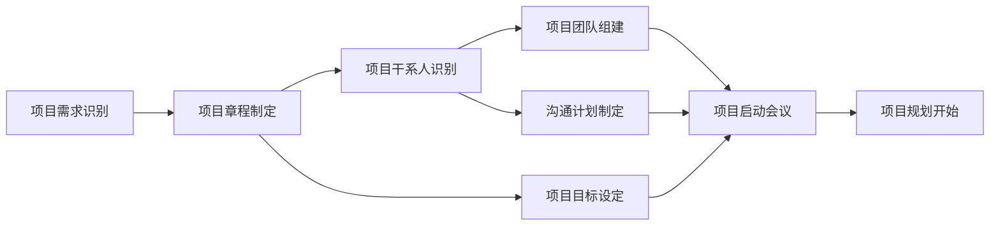
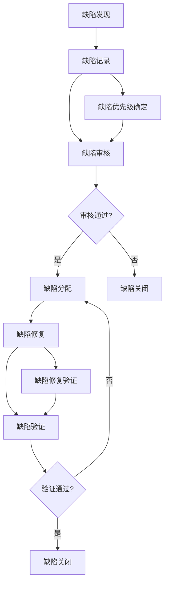
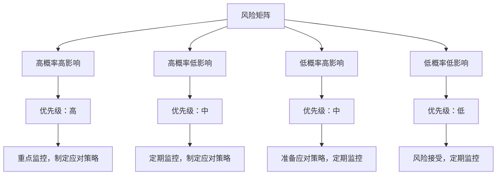
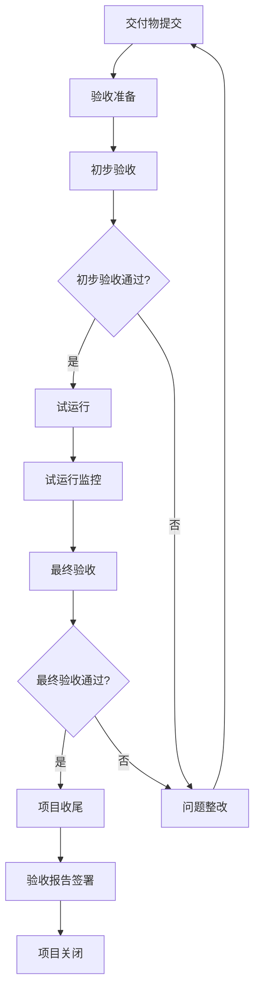

# 项目管理与交付

## 1. 项目管理概述

### 1.1 项目管理定义

项目管理是指在项目活动中运用专门的知识、技能、工具和方法，使项目能够在有限资源限定条件下，实现或超过设定的需求和期望的过程。

### 1.2 技术Leader在项目管理中的角色

```mermaid
flowchart TD
    A[技术Leader] --> B[项目规划]
    A --> C[资源协调]
    A --> D[技术决策]
    A --> E[风险管控]
    A --> F[质量管理]
    A --> G[团队管理]
    A --> H[沟通协调]
    A --> I[项目交付]
    
    B --> B1[制定项目计划]
    B --> B2[分解项目任务]
    B --> B3[估算项目工期]
    
    C --> C1[分配人力资源]
    C --> C2[协调跨团队资源]
    C --> C3[管理项目预算]
    
    D --> D1[技术方案设计]
    D --> D2[技术选型]
    D --> D3[架构设计]
    
    E --> E1[识别项目风险]
    E --> E2[制定风险应对策略]
    E --> E3[监控风险状态]
    
    F --> F1[制定质量标准]
    F --> F2[质量控制]
    F --> F3[质量保证]
    
    G --> G1[团队组建]
    G --> G2[团队培训]
    G --> G3[团队激励]
    
    H --> H1[与客户沟通]
    H --> H2[与上级沟通]
    H --> H3[跨部门协调]
    
    I --> I1[制定交付计划]
    I --> I2[交付物准备]
    I --> I3[交付验收]
    I --> I4[交付后支持]
```

### 1.3 项目管理方法论

| 方法论 | 特点 | 适用场景 |
|--------|------|----------|
| 敏捷开发 | 迭代、增量、客户协作、响应变化 | 需求变化快、创新性强的项目 |
| 瀑布模型 | 结构化、文档驱动、阶段明确 | 需求稳定、规模大的项目 |
| 迭代模型 | 分阶段迭代、逐步完善 | 需求较稳定、风险较高的项目 |
| 螺旋模型 | 迭代+风险分析、渐进式开发 | 高风险、大型复杂项目 |
| 混合模型 | 结合多种方法论优点 | 大多数实际项目 |

## 2. 项目规划与启动

### 2.1 项目启动阶段

#### 2.1.1 项目启动流程

#### 2.1.2 项目章程内容

| 内容 | 说明 |
|------|------|
| 项目名称 | 项目的唯一标识 |
| 项目背景 | 项目的业务背景和原因 |
| 项目目标 | 项目要实现的具体目标（SMART原则） |
| 项目范围 | 项目的边界和包含的工作 |
| 项目干系人 | 项目相关的人员和组织 |
| 项目经理 | 项目的负责人 |
| 项目团队 | 项目团队的组成和职责 |
| 项目时间 | 项目的开始和结束时间 |
| 项目预算 | 项目的预算限制 |
| 项目风险 | 项目的主要风险 |
| 审批流程 | 项目章程的审批流程和责任人 |

### 2.2 项目规划阶段

#### 2.2.1 项目范围规划

1. **需求收集**
   - 访谈法：与客户、业务人员进行访谈
   - 问卷调查法：针对大量用户的需求收集
   - 原型法：通过原型验证需求
   - 头脑风暴法：团队成员共同讨论需求

2. **需求分析**
   - 需求优先级排序（MoSCoW方法）
     - Must have：必须实现的需求
     - Should have：应该实现的需求
     - Could have：可以实现的需求
     - Won't have：暂时不实现的需求
   - 需求文档编写（PRD）
   - 需求评审

3. **范围定义**
   - 工作分解结构（WBS）
   - 范围说明书
   - 范围基线

#### 2.2.2 项目时间规划

1. **任务分解**
   - 工作分解结构（WBS）创建
   - 任务依赖关系分析
   - 关键路径识别

2. **工期估算**
   - 专家判断法
   - 类比估算法
   - 三点估算法（最乐观时间、最可能时间、最悲观时间）
   - 参数估算法

3. **进度计划制定**
   - 甘特图绘制
   - 里程碑设定
   - 进度基线确定

#### 2.2.3 项目资源规划

1. **人力资源规划**
   - 确定项目所需的角色和职责
   - 制定人员配备计划
   - 制定团队建设计划

2. **物资资源规划**
   - 硬件设备需求
   - 软件工具需求
   - 办公环境需求

3. **预算规划**
   - 成本估算
   - 预算编制
   - 成本基线确定

## 3. 项目执行与监控

### 3.1 项目执行

#### 3.1.1 任务分配

1. **任务分配原则**
   - 能力匹配：根据团队成员的能力分配任务
   - 兴趣结合：考虑团队成员的兴趣和职业发展
   - 负载均衡：确保团队成员的工作负载均衡
   - 责任明确：明确任务的责任人

2. **任务分配工具**
   - Jira
   - Trello
   - GitHub Projects
   - 飞书/钉钉/企业微信

#### 3.1.2 团队协作

1. **协作方式**
   - 每日站会：同步进度、发现问题
   - 周会：总结一周工作、规划下周任务
   - 代码评审：提高代码质量、促进知识共享
   - 技术分享：提升团队技术能力

2. **协作工具**
   - 代码管理：Git、SVN
   - 文档协作：Confluence、飞书文档
   - 即时通讯：飞书、钉钉、Slack
   - 视频会议：Zoom、腾讯会议

### 3.2 项目监控

#### 3.2.1 进度监控

1. **进度跟踪方法**
   - 定期检查：每日站会、周会检查进度
   - 挣值管理：计算EV、PV、AC，分析进度偏差
   - 燃尽图/燃起图：可视化展示项目进度
   - 关键路径法：监控关键路径上的任务

2. **进度偏差处理**
   - 分析偏差原因
   - 评估偏差影响
   - 制定纠正措施
   - 调整项目计划

#### 3.2.2 质量监控

1. **质量控制方法**
   - 代码评审：确保代码质量
   - 单元测试：测试单个函数或方法
   - 集成测试：测试模块间的交互
   - 功能测试：测试功能是否符合需求
   - 性能测试：测试系统性能
   - 安全测试：测试系统安全性

2. **质量保证活动**
   - 质量审计：检查项目过程是否符合质量标准
   - 过程改进：持续改进项目过程
   - 质量培训：提高团队的质量意识

#### 3.2.3 成本监控

1. **成本跟踪**
   - 实际成本记录
   - 成本偏差分析（CV=EV-AC）
   - 成本绩效指数计算（CPI=EV/AC）

2. **成本控制**
   - 成本偏差处理
   - 成本基线调整
   - 成本节约措施

#### 3.2.4 风险监控

1. **风险跟踪**
   - 风险状态更新
   - 风险影响评估
   - 风险应对效果评估

2. **风险控制**
   - 风险应对措施实施
   - 新风险识别
   - 风险优先级调整

## 4. 质量管理

### 4.1 质量规划

1. **质量标准制定**
   - 代码质量标准
   - 文档质量标准
   - 测试质量标准
   - 交付物质量标准

2. **质量保证计划**
   - 质量保证活动安排
   - 质量审计计划
   - 质量培训计划

3. **质量控制计划**
   - 质量检查点设置
   - 质量测试计划
   - 缺陷管理流程

### 4.2 质量控制

#### 4.2.1 代码质量控制

1. **代码规范**
   - 遵循PSR规范（PHP项目）
   - 使用代码检查工具（PHP-CS-Fixer、PHPStan）
   - 代码风格统一

2. **代码评审**
   - 建立代码评审流程
   - 代码评审要点：正确性、安全性、可读性、性能
   - 代码评审工具：GitHub Pull Request、GitLab Merge Request

3. **静态代码分析**
   - 使用静态分析工具（SonarQube、Phan）
   - 定期进行代码质量扫描
   - 跟踪代码质量指标

#### 4.2.2 测试质量控制

| 测试类型 | 目的 | 执行阶段 | 执行者 |
|----------|------|----------|--------|
| 单元测试 | 测试单个函数或方法 | 开发阶段 | 开发人员 |
| 集成测试 | 测试模块间的交互 | 开发阶段 | 开发人员 |
| 功能测试 | 测试功能是否符合需求 | 测试阶段 | 测试人员 |
| 性能测试 | 测试系统性能 | 测试阶段 | 测试/DevOps人员 |
| 安全测试 | 测试系统安全性 | 测试阶段 | 安全团队/开发人员 |
| 回归测试 | 确保修改不会引入新问题 | 开发/测试阶段 | 开发/测试人员 |
| 用户验收测试 | 验证系统是否满足用户需求 | 验收阶段 | 客户/业务人员 |

#### 4.2.3 缺陷管理

1. **缺陷跟踪流程**

2. **缺陷优先级划分**

| 优先级 | 描述 | 解决时间 |
|--------|------|----------|
| P0 | 系统崩溃、数据丢失等严重问题 | 立即解决 |
| P1 | 核心功能不可用，影响主要业务 | 24小时内解决 |
| P2 | 功能部分可用，影响次要业务 | 3天内解决 |
| P3 | UI问题、轻微功能问题 | 1周内解决 |
| P4 | 建议和优化 | 下次迭代解决 |

### 4.3 质量保证

1. **质量审计**
   - 定期进行质量审计
   - 检查项目过程是否符合质量标准
   - 识别质量改进机会

2. **过程改进**
   - 基于质量审计结果改进过程
   - 引入新的质量工具和方法
   - 持续优化质量流程

3. **质量培训**
   - 提高团队的质量意识
   - 培训质量工具和方法
   - 分享质量最佳实践

## 5. 风险管控

### 5.1 风险识别

1. **风险识别方法**
   - 头脑风暴法：团队成员共同识别风险
   - 德尔菲法：专家匿名反馈
   - 风险检查表：基于经验的风险清单
   - SWOT分析：分析项目的优势、劣势、机会、威胁
   - 访谈法：与项目干系人访谈识别风险

2. **常见项目风险**

| 风险类型 | 具体风险 |
|----------|----------|
| 需求风险 | 需求变更频繁、需求不明确、需求遗漏 |
| 技术风险 | 技术选型错误、技术难点无法攻克、技术债务积累 |
| 进度风险 | 项目延期、资源不足、依赖延迟 |
| 质量风险 | 产品质量不达标、测试不充分、缺陷率高 |
| 资源风险 | 人员流失、团队能力不足、设备故障 |
| 沟通风险 | 沟通不畅、信息不对称、误解 |
| 外部风险 | 政策变化、市场变化、供应商问题 |

### 5.2 风险评估

1. **风险分析**
   - 定性分析：评估风险发生的概率和影响
   - 定量分析：对风险进行量化评估

2. **风险矩阵**

### 5.3 风险应对

| 风险应对策略 | 描述 | 适用场景 |
|--------------|------|----------|
| 规避 | 改变项目计划，避免风险发生 | 高概率高影响的风险 |
| 转移 | 将风险转移给第三方 | 可投保或可外包的风险 |
| 减轻 | 降低风险发生的概率或影响 | 大多数风险 |
| 接受 | 接受风险，制定应急计划 | 低概率低影响的风险 |
| 开拓 | 主动利用风险机会 | 具有积极影响的风险 |

### 5.4 风险监控

1. **风险监控方法**
   - 定期风险评审会议
   - 风险状态更新
   - 风险指标监控
   - 风险预警机制

2. **风险应对效果评估**
   - 评估风险应对策略的有效性
   - 调整风险应对策略
   - 更新风险登记册

## 6. 项目交付与验收

### 6.1 交付准备

1. **交付物准备**
   - 源代码
   - 编译后的可执行文件
   - 数据库脚本
   - 部署文档
   - 操作手册
   - 测试报告
   - 项目文档

2. **交付计划制定**
   - 交付时间安排
   - 交付地点确定
   - 交付人员安排
   - 验收标准确认

3. **交付前检查**
   - 功能完整性检查
   - 性能测试
   - 安全性检查
   - 文档完整性检查
   - 部署验证

### 6.2 项目验收

#### 6.2.1 验收流程

#### 6.2.2 验收标准

1. **功能验收**：验证系统功能是否符合需求
2. **性能验收**：验证系统性能是否达到要求
3. **安全验收**：验证系统安全性是否符合标准
4. **文档验收**：验证文档是否完整、准确
5. **用户体验验收**：验证用户体验是否良好

### 6.3 项目收尾

1. **项目总结**
   - 项目目标完成情况
   - 项目成果总结
   - 项目经验教训
   - 团队表现评估

2. **项目文档归档**
   - 项目计划
   - 需求文档
   - 设计文档
   - 测试文档
   - 验收文档
   - 会议记录
   - 风险登记册

3. **团队解散与资源释放**
   - 团队成员绩效考核
   - 团队成员重新分配
   - 设备和资源释放
   - 财务结算

4. **项目关闭**
   - 项目关闭报告
   - 项目评估报告
   - 项目回顾会议

## 7. 敏捷项目管理

### 7.1 敏捷开发原则

1. **个体和互动高于流程和工具**
2. **工作的软件高于详尽的文档**
3. **客户协作高于合同谈判**
4. **响应变化高于遵循计划**

### 7.2 Scrum框架

#### 7.2.1 Scrum角色

| 角色 | 职责 |
|------|------|
| Product Owner | 负责产品愿景、需求优先级、产品Backlog管理 |
| Scrum Master | 负责Scrum流程的实施和改进，清除障碍 |
| 开发团队 | 负责产品开发、测试和交付 |

#### 7.2.2 Scrum事件

| 事件 | 时间 | 参与者 | 目的 |
|------|------|--------|------|
| Sprint计划会议 | 1-4小时/ sprint | 全体Scrum团队 | 确定Sprint目标和计划 |
| 每日站会 | 15分钟 | 开发团队 | 同步进度、发现问题 |
| Sprint评审会议 | 1-2小时/ sprint | 全体Scrum团队+利益相关者 | 展示Sprint成果，获取反馈 |
| Sprint回顾会议 | 1-2小时/ sprint | 全体Scrum团队 | 回顾Sprint，改进流程 |

#### 7.2.3 Scrum工件

| 工件 | 描述 |
|------|------|
| 产品Backlog | 产品的需求列表，按优先级排序 |
| Sprint Backlog | 当前Sprint要完成的任务列表 |
| 增量 | Sprint结束时可交付的产品功能 |
| 燃尽图 | 展示Sprint进度的可视化图表 |

### 7.3 敏捷实践技巧

1. **用户故事编写**
   - 格式：作为[角色]，我希望[功能]，以便[收益]
   - 符合INVEST原则：独立、可协商、有价值、可估算、可测试、小颗粒度

2. **Backlog管理**
   - 定期梳理Backlog
   - 保持Backlog的优先级清晰
   - 确保Backlog项的描述清晰、可理解

3. **Sprint执行**
   - 固定Sprint周期（通常2-4周）
   - 保护Sprint目标，避免范围蔓延
   - 鼓励团队自组织

4. **持续改进**
   - 每次Sprint回顾会议都要识别改进点
   - 制定具体的改进计划
   - 跟踪改进效果

## 8. 项目管理工具

### 8.1 项目管理工具比较

| 工具名称 | 特点 | 适用场景 |
|----------|------|----------|
| Jira | 功能全面，支持敏捷开发 | 大型项目、复杂流程 |
| Trello | 简单易用，可视化强 | 小型项目、敏捷团队 |
| Asana | 功能丰富，协作性强 | 跨团队项目 |
| Monday.com | 可视化强，定制性高 | 创意团队、营销团队 |
| Microsoft Project | 传统项目管理，功能强大 | 大型复杂项目 |
| GitHub Projects | 与代码仓库集成 | 开发团队 |
| 飞书/钉钉/企业微信 | 集成沟通功能 | 团队协作 |

### 8.2 选择项目管理工具的考虑因素

1. **项目规模和复杂度**：根据项目大小选择合适的工具
2. **团队规模和分布**：考虑团队是本地还是分布式
3. **项目方法论**：支持敏捷、瀑布或混合方法
4. **集成需求**：与现有工具的集成需求
5. **易用性**：工具的学习曲线和易用程度
6. **成本**：工具的 licensing 费用
7. **定制性**：工具的定制能力
8. **支持和社区**：供应商支持和社区活跃度

## 9. 项目管理最佳实践

### 9.1 需求管理最佳实践

1. **需求明确**：确保需求描述清晰、无歧义
2. **需求优先级**：明确需求的优先级，聚焦核心需求
3. **需求变更管理**：建立正式的需求变更流程
4. **需求验证**：通过原型、评审等方式验证需求
5. **需求追溯**：建立需求追溯矩阵，确保所有需求都被实现

### 9.2 进度管理最佳实践

1. **详细规划**：制定详细的项目计划和任务分解
2. **定期跟踪**：通过每日站会、周会等定期跟踪进度
3. **透明沟通**：保持进度透明，及时沟通进度偏差
4. **敏捷调整**：根据实际情况灵活调整计划
5. **关注关键路径**：重点监控关键路径上的任务

### 9.3 质量管理最佳实践

1. **质量意识**：培养团队的质量意识，将质量融入日常工作
2. **预防为主**：注重质量预防，而非事后检验
3. **持续改进**：不断优化质量流程和标准
4. **自动化测试**：提高测试效率和覆盖率
5. **代码评审**：建立严格的代码评审制度

### 9.4 团队管理最佳实践

1. **明确角色和职责**：确保团队成员清楚自己的角色和职责
2. **授权和信任**：授权团队成员，信任他们的能力
3. **有效沟通**：建立良好的沟通机制
4. **团队建设**：定期组织团队建设活动，增强团队凝聚力
5. **持续学习**：鼓励团队成员学习和成长

### 9.5 沟通管理最佳实践

1. **沟通计划**：制定明确的沟通计划
2. **有效会议**：确保会议有明确的目标和议程
3. **多样化沟通**：根据情况选择合适的沟通方式
4. **主动沟通**：主动与项目干系人沟通
5. **倾听反馈**：认真倾听项目干系人的反馈

## 10. 案例分析：PHP电商系统项目管理

### 10.1 项目背景

某公司计划开发一个PHP电商系统，包括商品管理、订单管理、用户管理、支付系统等模块。项目团队由10名PHP开发人员组成，采用敏捷开发方法，Sprint周期为2周。

### 10.2 项目管理实践

1. **需求管理**
   - 采用用户故事编写需求
   - 使用Jira管理产品Backlog
   - 每周与产品经理评审Backlog

2. **进度管理**
   - 每日站会同步进度
   - 使用燃尽图跟踪Sprint进度
   - 每周五召开Sprint评审会议
   - 每个Sprint结束后召开回顾会议

3. **质量管理**
   - 建立代码评审制度，所有代码必须经过评审才能合并
   - 实现自动化测试，包括单元测试、集成测试、功能测试
   - 定期进行性能测试和安全测试
   - 使用SonarQube进行代码质量分析

4. **团队管理**
   - 授权团队自组织，由团队成员自主选择任务
   - 定期组织技术分享，提高团队技术能力
   - 建立良好的团队文化，鼓励协作和创新

5. **风险管控**
   - 每周识别和评估风险
   - 对高优先级风险制定应对策略
   - 定期跟踪风险状态

### 10.3 项目成果

- 项目按时交付，满足所有需求
- 系统质量良好，缺陷率低于行业平均水平
- 团队凝聚力强，成员满意度高
- 客户对产品质量和交付时间表示满意
- 项目过程中的经验教训为后续项目提供了参考

## 11. 总结与行动建议

### 11.1 项目管理核心要点

1. **明确项目目标和范围**：确保项目目标清晰、范围明确
2. **有效的计划和执行**：制定详细的项目计划，并严格执行
3. **质量管理贯穿始终**：将质量融入项目的各个阶段
4. **积极的风险管控**：识别、评估和应对项目风险
5. **良好的沟通和协作**：建立有效的沟通机制，促进团队协作
6. **持续改进**：不断优化项目管理流程和方法
7. **关注团队成长**：培养团队成员的能力，提高团队绩效

### 11.2 行动建议

1. **学习项目管理知识**：学习PMP、ACP等项目管理认证
2. **选择合适的项目管理工具**：根据项目特点选择合适的工具
3. **建立项目管理流程**：制定适合团队的项目管理流程
4. **培养团队的项目管理意识**：提高团队成员的项目管理素养
5. **定期回顾和改进**：定期回顾项目管理实践，持续改进
6. **积累项目管理经验**：通过实践积累项目管理经验
7. **与其他项目经理交流**：分享项目管理经验，学习最佳实践

### 11.3 给新任技术Leader的建议

1. **平衡技术和管理**：既要关注技术细节，也要关注项目管理
2. **授权和信任团队**：相信团队成员的能力，授权他们做决策
3. **有效沟通**：与团队成员、上级、客户保持良好的沟通
4. **注重结果**：关注项目的最终结果，而不仅仅是过程
5. **持续学习**：不断学习项目管理知识和技能
6. **保持灵活性**：根据项目实际情况灵活调整管理方式
7. **以身作则**：作为Leader，要以身作则，树立良好的榜样

通过有效的项目管理，技术Leader可以确保项目按时、按质、按量交付，同时提高团队的绩效和凝聚力，为公司创造更大的价值。