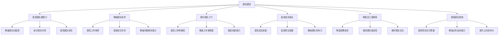
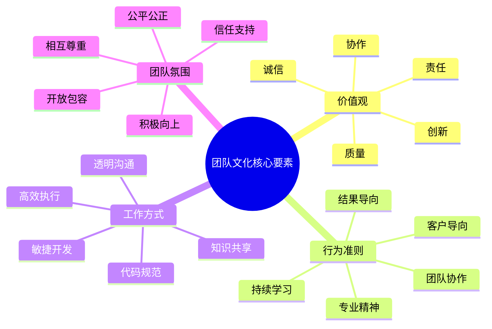
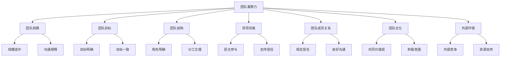
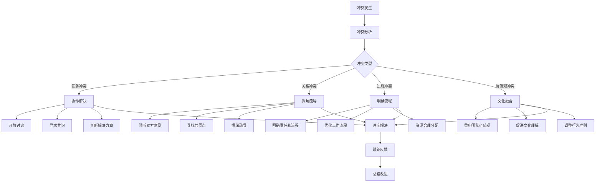
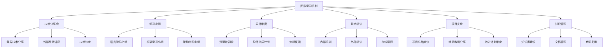
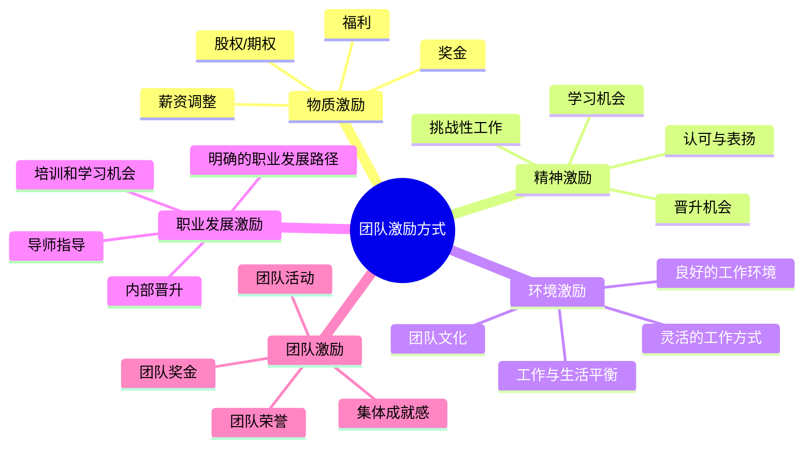
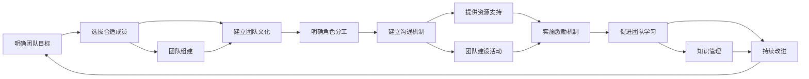

# 团队建设与文化

## 1. 团队建设概述

### 1.1 团队建设的重要性

团队建设是指通过各种活动和方法，提高团队成员之间的协作能力、凝聚力和战斗力，从而提高团队整体绩效的过程。对于技术Leader来说，团队建设是一项重要的管理职责。

### 1.2 技术团队的特点

| 特点 | 描述 | 管理挑战 |
|------|------|----------|
| 技术导向 | 团队成员以技术为导向，关注技术实现 | 平衡技术追求与业务需求 |
| 知识密集 | 团队成员拥有专业知识和技能 | 知识管理和传承 |
| 自主性强 | 技术人员通常具有较强的自主性 | 授权与控制的平衡 |
| 学习能力强 | 技术人员需要持续学习新技术 | 提供学习和发展机会 |
| 注重公平 | 技术人员注重公平和尊重 | 建立公平的激励机制 |
| 创新意识强 | 技术人员具有较强的创新意识 | 营造创新环境，容忍失败 |

## 2. 团队文化建设

### 2.1 团队文化的定义

团队文化是指团队成员共同遵循的价值观、信念、行为准则和工作方式的总和，它影响着团队成员的行为和团队的整体绩效。

### 2.2 团队文化的核心要素

### 2.3 技术团队文化特点

| 文化类型 | 特点 | 实践方式 |
|----------|------|----------|
| 学习文化 | 鼓励持续学习和知识共享 | 技术分享会、学习小组、培训机会 |
| 创新文化 | 鼓励创新和尝试 | 创新激励机制、容忍失败、hackathon |
| 质量文化 | 注重代码质量和系统质量 | 代码评审、自动化测试、质量标准 |
| 协作文化 | 强调团队协作和知识共享 | 团队活动、协作工具、开放沟通 |
| 结果导向 | 关注业务结果和价值 | 明确目标、绩效考核、结果激励 |

### 2.4 塑造团队文化的方法

1. **明确团队价值观**
   - 与团队成员共同讨论和确定团队价值观
   - 将价值观转化为具体的行为准则
   - 定期回顾和强化团队价值观

2. **Leader以身作则**
   - 领导者要践行团队价值观
   - 领导者的行为要符合团队文化
   - 领导者要成为团队文化的倡导者和守护者

3. **建立文化仪式**
   - 定期的团队活动和仪式
   - 庆祝团队成就和个人里程碑
   - 建立团队传统和惯例

4. **强化正向行为**
   - 认可和奖励符合团队文化的行为
   - 及时纠正不符合团队文化的行为
   - 建立文化导向的绩效考核机制

5. **招聘文化匹配的成员**
   - 在招聘过程中评估候选人的文化匹配度
   - 优先选择与团队文化匹配的候选人
   - 新成员入职时进行文化培训

## 3. 团队凝聚力建设

### 3.1 团队凝聚力的定义

团队凝聚力是指团队成员之间的相互吸引力和向心力，以及团队成员对团队的归属感和忠诚度。

### 3.2 影响团队凝聚力的因素

### 3.3 提升团队凝聚力的方法

1. **明确共同目标**
   - 与团队成员共同制定团队目标
   - 确保团队目标与个人目标对齐
   - 定期回顾和调整团队目标
   - 庆祝团队目标的实现

2. **建立信任关系**
   - 保持透明沟通
   - 兑现承诺
   - 尊重和支持团队成员
   - 鼓励团队成员相互信任

3. **促进团队沟通**
   - 定期组织团队会议和活动
   - 建立开放的沟通渠道
   - 鼓励团队成员分享想法和反馈
   - 解决团队内部的冲突

4. **组织团队活动**
   - 定期的团队建设活动
   - 团队聚餐和户外活动
   - 技术分享和学习活动
   - 团队庆祝活动

5. **认可和奖励**
   - 认可团队成员的贡献
   - 奖励团队的成就
   - 建立公平的激励机制
   - 提供职业发展机会

### 3.4 团队建设活动类型

| 活动类型 | 目的 | 示例 |
|----------|------|------|
| 学习型活动 | 提高团队技术能力 | 技术分享会、研讨会、培训 |
| 协作型活动 | 增强团队协作能力 | 团队拓展、hackathon、角色扮演 |
| 社交型活动 | 增进团队成员关系 | 团队聚餐、户外活动、游戏夜 |
| 庆祝型活动 | 增强团队成就感 | 项目完成庆祝、里程碑庆祝、年度总结 |
| 公益型活动 | 增强团队社会责任感 | 志愿者活动、捐赠活动 |

## 4. 团队角色与分工

### 4.1 团队角色类型

根据Belbin团队角色理论，团队中存在九种主要角色：

| 角色名称 | 特点 | 贡献 | 可能的弱点 |
|----------|------|------|------------|
| 智多星 | 创造力强，富有想象力 | 提供创新想法和解决方案 | 忽视细节，不注重实际 |
| 资源调查者 | 外向，善于沟通 | 寻找机会和资源 | 三分钟热度，易分心 |
| 协调者 | 成熟，自信，善于领导 | 协调团队，明确目标 | 可能过度授权 |
| 鞭策者 | 充满活力，具有紧迫感 | 推动团队行动，克服障碍 | 好争论，缺乏耐心 |
| 审议者 | 谨慎，批判性思维 | 分析问题，评估风险 | 过于谨慎，缺乏主动性 |
| 凝聚者 | 善解人意，团队导向 | 促进团队和谐，化解冲突 | 优柔寡断，避免冲突 |
| 执行者 | 务实，可靠，高效 | 将想法转化为行动 | 缺乏灵活性，抗拒变化 |
| 完成者 | 注重细节，追求完美 | 确保工作质量和细节 | 过度关注细节，缺乏全局观 |
| 专家 | 专业知识丰富 | 提供专业技能和知识 | 局限于专业领域，缺乏灵活性 |

### 4.2 团队角色搭配

1. **角色互补**：确保团队中包含不同类型的角色，形成互补
2. **角色平衡**：避免某一角色过多或过少
3. **角色适应**：根据项目需求调整团队角色
4. **角色发展**：鼓励团队成员发展多种角色能力

### 4.3 合理分工原则

1. **能力匹配**：根据团队成员的能力和经验分配任务
2. **兴趣结合**：考虑团队成员的兴趣和职业发展
3. **负载均衡**：确保团队成员的工作负载平衡
4. **责任明确**：明确任务的责任人
5. **授权充分**：给予团队成员足够的自主权
6. **动态调整**：根据实际情况动态调整分工

## 5. 团队冲突管理

### 5.1 团队冲突的类型

| 冲突类型 | 产生原因 | 影响 |
|----------|----------|------|
| 任务冲突 | 对任务目标、方法或优先级的不同看法 | 可能促进创新和改进 |
| 关系冲突 | 个人性格、价值观或风格的差异 | 破坏团队关系，降低绩效 |
| 过程冲突 | 对工作流程、责任分配或资源使用的分歧 | 可能导致效率低下 |
| 价值观冲突 | 对团队价值观或文化的不同理解 | 影响团队凝聚力 |

### 5.2 冲突管理策略

### 5.3 冲突解决技巧

1. **保持冷静**：避免情绪化反应，保持理性
2. **倾听各方意见**：了解冲突各方的立场和需求
3. **聚焦问题**：关注问题本身，而非个人攻击
4. **寻找共同点**：聚焦共同目标，寻找双赢解决方案
5. **妥协与合作**：在必要时做出妥协，寻求合作
6. **及时解决**：不要拖延，及时解决冲突
7. **后续跟踪**：确保冲突得到彻底解决，避免复发

### 5.4 建设性冲突的利用

1. **鼓励不同意见**：营造开放的沟通氛围，鼓励团队成员提出不同意见
2. **引导建设性讨论**：将冲突引导为建设性的讨论
3. **促进创新**：利用冲突激发创新和改进
4. **完善决策**：通过不同意见的碰撞，完善决策质量
5. **增强团队活力**：适当的冲突可以增强团队的活力和创造力

## 6. 团队学习与发展

### 6.1 团队学习的重要性

1. **适应技术变化**：技术发展迅速，团队需要持续学习才能跟上变化
2. **提高团队竞争力**：持续学习可以提高团队的技术能力和竞争力
3. **促进成员成长**：为团队成员提供学习和发展机会
4. **增强团队凝聚力**：共同学习可以增强团队成员之间的关系
5. **推动创新**：学习新的知识和技能可以推动创新

### 6.2 团队学习机制

### 6.3 团队学习实践

1. **技术分享会**
   - 每周定期举办技术分享会
   - 团队成员轮流分享技术知识或学习心得
   - 邀请外部专家进行技术讲座
   - 分享内容包括新技术、最佳实践、项目经验等

2. **学习小组**
   - 根据团队成员的兴趣和需求，成立不同的学习小组
   - 每个小组有明确的学习目标和计划
   - 定期组织小组学习活动，如研讨会、实践项目等
   - 鼓励小组之间的交流和分享

3. **导师制度**
   - 建立导师制度，由资深技术人员指导初级技术人员
   - 明确导师和学员的责任和义务
   - 定期进行导师和学员的反馈和评估
   - 提供必要的资源和支持

4. **技术培训**
   - 为团队成员提供内部或外部培训机会
   - 鼓励团队成员参加技术大会、研讨会等活动
   - 支持团队成员获取专业认证
   - 提供在线学习资源和平台

5. **项目复盘**
   - 每个项目结束后，进行项目复盘
   - 总结项目的成功经验和失败教训
   - 识别改进机会，制定改进计划
   - 分享复盘结果，避免重复错误

### 6.4 知识管理

1. **知识库建设**
   - 建立团队知识库，收集和整理技术文档、最佳实践等
   - 使用知识库工具，如Confluence、语雀等
   - 定期更新和维护知识库
   - 鼓励团队成员贡献和使用知识库

2. **文档管理**
   - 建立文档编写和管理规范
   - 确保文档的完整性、准确性和及时性
   - 使用版本控制工具管理文档
   - 定期审查文档质量

3. **代码复用**
   - 建立代码库，促进代码复用
   - 制定代码复用规范和流程
   - 鼓励团队成员贡献可复用的代码组件
   - 定期审查和更新代码库

## 7. 团队激励

### 7.1 激励的重要性

1. **提高工作积极性**：有效的激励可以提高团队成员的工作积极性
2. **增强团队凝聚力**：公平的激励机制可以增强团队凝聚力
3. **促进成员成长**：激励可以鼓励团队成员学习和成长
4. **降低离职率**：良好的激励机制可以降低员工离职率
5. **提高团队绩效**：激励可以提高团队的整体绩效

### 7.2 激励理论

| 激励理论 | 核心观点 | 应用建议 |
|----------|----------|----------|
| 马斯洛需求层次理论 | 人的需求分为生理、安全、社交、尊重和自我实现五个层次 | 了解团队成员的需求层次，提供相应的激励 |
| 赫兹伯格双因素理论 | 激励因素（成就、认可、成长）和保健因素（薪酬、工作条件） | 关注激励因素，同时确保保健因素满足 |
| 期望理论 | 激励力量=效价×期望值×工具性 | 明确目标，提供实现路径，确保奖励与绩效挂钩 |
| 公平理论 | 员工会比较自己与他人的投入产出比 | 建立公平的激励机制，确保分配公平 |
| 强化理论 | 正强化（奖励）和负强化（惩罚） | 多使用正强化，鼓励正向行为 |

### 7.3 激励方式

### 7.4 技术团队激励特点

| 激励类型 | 技术团队特点 | 实践方式 |
|----------|--------------|----------|
| 学习机会 | 技术人员注重学习和成长 | 提供培训、学习资源、技术大会机会 |
| 挑战性工作 | 技术人员喜欢有挑战性的工作 | 分配具有挑战性的任务，提供创新机会 |
| 技术认可 | 技术人员注重技术认可 | 技术分享、专利申请、技术奖项 |
| 自主性 | 技术人员希望有工作自主权 | 授权、灵活的工作方式、自组织团队 |
| 公平公正 | 技术人员注重公平 | 透明的绩效考核、公平的晋升机制 |
| 团队氛围 | 技术人员注重团队氛围 | 良好的团队文化、开放的沟通环境 |

### 7.5 激励的原则

1. **公平公正**：激励机制要公平公正，避免偏袒
2. **个性化**：根据团队成员的需求和特点，采用不同的激励方式
3. **及时性**：及时给予激励，增强激励效果
4. **多样性**：采用多种激励方式，满足不同需求
5. **目标导向**：将激励与团队目标和个人绩效挂钩
6. **正向激励为主**：多采用正向激励，少用惩罚
7. **持续改进**：定期评估激励效果，持续改进激励机制

## 8. 高绩效团队建设

### 8.1 高绩效团队的特征

| 特征 | 描述 |
|------|------|
| 明确的目标 | 团队有明确的共同目标，且与个人目标对齐 |
| 高效的沟通 | 团队成员之间沟通顺畅，信息透明 |
| 良好的协作 | 团队成员之间协作高效，知识共享 |
| 高度的凝聚力 | 团队成员之间相互信任，凝聚力强 |
| 持续的学习 | 团队具有学习文化，持续改进 |
| 优秀的领导力 | 领导者能够有效引导和支持团队 |
| 清晰的角色分工 | 团队成员角色明确，责任清晰 |
| 结果导向 | 团队关注业务结果和价值 |
| 创新能力 | 团队具有创新意识和能力 |
| 适应变化 | 团队能够适应环境和需求的变化 |

### 8.2 建设高绩效团队的步骤

### 8.3 高绩效团队案例分析

**背景**：某互联网公司的PHP开发团队，由12名成员组成，负责公司核心产品的开发和维护。

**团队特点**：
1. 明确的团队目标：支持公司业务增长，打造高性能、高可用的产品
2. 良好的团队文化：学习文化、创新文化、质量文化
3. 高效的沟通机制：每日站会、周会、透明的项目管理
4. 持续的学习：每周技术分享会、学习小组、培训机会
5. 公平的激励机制：绩效导向、学习激励、创新激励
6. 优秀的领导力：技术Leader注重授权和团队建设

**成果**：
- 项目交付效率提高30%
- 代码质量明显改善，bug率降低50%
- 团队成员满意度高，离职率低于行业平均水平
- 公司业务增长5倍，团队能够支撑业务增长
- 团队获得公司年度优秀团队称号

**成功因素**：
1. 明确的团队目标和方向
2. 良好的团队文化和氛围
3. 有效的沟通和协作机制
4. 持续的学习和改进
5. 公平的激励机制
6. 优秀的领导力

## 9. 总结与行动建议

### 9.1 团队建设与文化的核心要点

1. **团队文化是团队的灵魂**：塑造积极向上的团队文化，是团队建设的核心
2. **凝聚力是团队的基础**：提高团队凝聚力，增强团队成员之间的协作和信任
3. **学习是团队的活力源泉**：建立团队学习机制，促进团队成员持续学习和成长
4. **激励是团队的动力**：采用多种激励方式，提高团队成员的工作积极性
5. **冲突管理是团队的润滑剂**：有效管理团队冲突，促进建设性讨论
6. **领导力是团队的指引**：技术Leader要以身作则，引导和支持团队

### 9.2 行动建议

1. **评估团队现状**：了解团队的优势、劣势和需求
2. **明确团队文化**：与团队成员共同制定团队价值观和行为准则
3. **制定团队建设计划**：制定年度团队建设计划，包括学习、活动、激励等方面
4. **建立沟通机制**：建立开放、透明的沟通机制
5. **实施激励机制**：根据团队成员的需求，实施个性化的激励机制
6. **组织团队活动**：定期组织各种类型的团队活动
7. **建立学习机制**：建立技术分享、学习小组等团队学习机制
8. **持续改进**：定期评估团队建设效果，持续改进

### 9.3 给新任技术Leader的建议

1. **注重团队文化**：从第一天开始就注重团队文化的塑造
2. **以身作则**：作为Leader，要践行团队价值观
3. **关注团队成员**：了解团队成员的需求和期望
4. **授权和信任**：给予团队成员足够的自主权和信任
5. **鼓励学习和创新**：营造学习和创新的氛围
6. **公平公正**：建立公平公正的激励机制
7. **持续改进**：不断优化团队建设方式和方法

通过有效的团队建设和文化塑造，技术Leader可以打造一个高效协作、凝聚力强、持续学习的技术团队，为公司的业务发展提供有力支持。