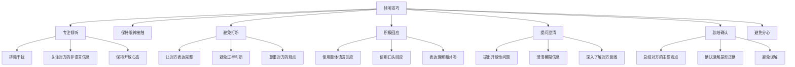
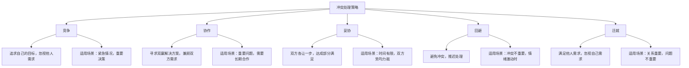

# 沟通与协作

## 1. 沟通的重要性

沟通是管理的核心职能之一，对于技术Leader来说，有效的沟通至关重要。良好的沟通可以促进团队协作、提高工作效率、减少误解和冲突，从而提高团队绩效。

```mermaid
flowchart TD
    A[有效沟通] --> B[提高团队协作]
    A --> C[减少误解和冲突]
    A --> D[提高决策质量]
    A --> E[增强团队凝聚力]
    A --> F[提升工作效率]
    A --> G[促进成员成长]
    A --> H[提高领导效能]
    
    B --> B1[促进知识共享]
    B --> B2[增强问题解决能力]
    B --> B3[提高团队创造力]
    
    C --> C1[降低沟通成本]
    C --> C2[减少工作失误]
    C --> C3[改善团队关系]
    
    D --> D1[获取全面信息]
    D --> D2[考虑不同视角]
    D --> D3[做出更优决策]
    
    E --> E1[增强团队归属感]
    E --> E2[提高团队信任]
    E --> E3[营造积极氛围]
    
    F --> F1[明确工作目标]
    F --> F2[减少重复工作]
    F --> F3[提高执行效率]
    
    G --> G1[提供反馈和指导]
    G --> G2[促进学习和发展]
    G --> G3[识别潜力和需求]
    
    H --> H1[增强影响力]
    H --> H2[获得支持和资源]
    H --> H3[实现团队目标]
```

## 2. 沟通的基本原则

### 2.1 沟通的7C原则

| 原则 | 说明 | 实践方式 |
|------|------|----------|
| 清晰（Clear） | 信息表达清晰，避免模糊和歧义 | 使用简单明了的语言，明确表达意图 |
| 准确（Correct） | 信息准确无误，避免错误和误导 | 核实信息的准确性，提供具体数据和事实 |
| 完整（Complete） | 提供完整的信息，避免遗漏重要内容 | 包括背景、目的、要求和期望 |
| 简洁（Concise） | 信息简洁，避免冗长和冗余 | 突出重点，删除不必要的内容 |
| 具体（Concrete） | 信息具体，避免抽象和笼统 | 提供具体的例子和细节 |
| 礼貌（Courteous） | 沟通方式礼貌，尊重对方 | 使用礼貌用语，考虑对方感受 |
| 体贴（Considerate） | 考虑对方的需求和感受 | 站在对方的角度思考，关注对方利益 |

### 2.2 有效沟通的其他原则

1. **双向沟通**：鼓励对方反馈，建立互动式沟通
2. **及时沟通**：及时传递信息，避免延误和误解
3. **适配性**：根据沟通对象和场景，调整沟通方式和内容
4. **一致性**：保持信息的一致性，避免前后矛盾
5. **保密性**：保护敏感信息，遵守保密原则
6. **诚实可信**：保持诚实和可信度，建立信任关系

## 3. 沟通技巧

### 3.1 倾听技巧

倾听是有效沟通的基础，良好的倾听可以帮助我们更好地理解对方的意图和需求。

### 3.2 表达技巧

1. **清晰表达**
   - 使用简单明了的语言
   - 结构清晰，逻辑严谨
   - 突出重点，避免冗长
   - 使用具体的例子和数据

2. **适应性表达**
   - 根据沟通对象调整语言和内容
   - 考虑对方的背景和理解能力
   - 使用对方熟悉的术语和表达方式
   - 调整沟通的正式程度

3. **非语言表达**
   - 注意面部表情和肢体语言
   - 保持适当的肢体距离
   - 注意语音语调的变化
   - 保持良好的姿势和仪表

4. **书面表达**
   - 结构清晰，格式规范
   - 语言简洁，避免歧义
   - 使用恰当的标题和分段
   - 校对和审核，确保准确无误

### 3.3 反馈技巧

反馈是沟通的重要组成部分，有效的反馈可以帮助团队成员改进工作，提高绩效。

#### 3.3.1 反馈的类型

| 反馈类型 | 目的 | 适用场景 |
|----------|------|----------|
| 正面反馈 | 强化积极行为 | 表扬优秀表现，认可贡献 |
| 建设性反馈 | 改进不足，促进成长 | 指出问题和改进方向 |
| 负面反馈 | 纠正错误行为 | 严重问题或违规行为 |

#### 3.3.2 有效反馈的原则

1. **及时**：及时给予反馈，增强反馈效果
2. **具体**：提供具体的行为和例子
3. **客观**：基于事实，避免主观判断和情绪化
4. **平衡**：既要指出不足，也要肯定优点
5. **针对性**：聚焦于可改进的行为，而非个人特质
6. **建设性**：提供具体的改进建议
7. **尊重**：尊重对方，维护对方的尊严

#### 3.3.3 反馈的STAR法则

STAR法则是一种结构化的反馈方法，用于提供具体、客观的反馈：
- **Situation**：描述具体情境
- **Task**：说明任务和目标
- **Action**：描述具体行为
- **Result**：说明结果和影响

### 3.4 提问技巧

提问是获取信息、澄清误解、引导思考的重要工具。

#### 3.4.1 提问的类型

| 提问类型 | 特点 | 适用场景 |
|----------|------|----------|
| 开放性问题 | 鼓励详细回答，获取更多信息 | 了解对方的想法和观点 |
| 封闭性问题 | 要求简短回答，确认信息 | 核实事实，确认理解 |
| 探索性问题 | 深入了解，挖掘潜在信息 | 了解问题的根本原因 |
| 引导性问题 | 引导对方思考和回答 | 引导对方接受观点或做出决策 |
| 反思性问题 | 促使对方自我反思 | 帮助对方认识问题和改进 |

#### 3.4.2 有效提问的技巧

1. **明确提问目的**：清楚自己想要获取的信息或达到的效果
2. **选择合适的提问类型**：根据场景和目的选择提问类型
3. **保持开放性**：避免带有偏见或预设答案
4. **循序渐进**：从简单到复杂，逐步深入
5. **注意提问的语气和方式**：保持礼貌和尊重，避免质问和指责
6. **给予对方思考时间**：避免急于得到答案
7. **跟进和追问**：根据对方的回答，适当跟进和追问

## 4. 跨团队沟通与协作

### 4.1 跨团队沟通的挑战

| 挑战 | 原因 | 解决方案 |
|------|------|----------|
| 目标不一致 | 不同团队有不同的目标和优先级 | 对齐目标，明确共同利益 |
| 沟通不畅 | 团队间缺乏有效的沟通渠道 | 建立跨团队沟通机制 |
| 信息不对称 | 团队间信息共享不充分 | 建立信息共享平台，定期同步信息 |
| 责任不清 | 跨团队项目责任划分不明确 | 明确责任和分工，建立RACI矩阵 |
| 文化差异 | 不同团队有不同的文化和工作方式 | 促进文化理解和融合 |
| 资源冲突 | 多个团队争夺有限的资源 | 建立资源协调机制，优先级排序 |

### 4.2 跨团队协作机制

1. **跨团队项目管理**
   - 成立跨团队项目组，明确项目目标和范围
   - 任命项目经理，负责协调和沟通
   - 建立项目沟通计划和会议机制
   - 使用统一的项目管理工具

2. **定期同步会议**
   - 跨团队站会：每日或每周简短同步
   - 跨团队周会：每周详细讨论项目进展和问题
   - 跨团队回顾会议：定期总结和改进

3. **信息共享平台**
   - 使用企业级协作工具，如飞书、钉钉、Slack
   - 建立共享文档库，如Confluence、语雀
   - 设立跨团队沟通群，及时分享信息

4. **RACI责任矩阵**

RACI矩阵是一种明确跨团队项目责任的工具，定义了每个角色在项目中的责任：
- **Responsible（负责人）**：负责执行任务的人员
- **Accountable（责任人）**：最终负责的人员，对结果负责
- **Consulted（咨询人）**：需要咨询的人员，提供专业意见
- **Informed（知情人）**：需要知情的人员，了解进展

### 4.3 跨团队协作案例

**背景**：某公司的电商系统需要进行架构升级，涉及前端、后端（PHP）、数据库、DevOps等多个团队。

**协作机制**：
1. 成立跨团队架构升级项目组，由技术总监担任项目经理
2. 建立RACI矩阵，明确各团队的责任和分工
3. 每周一召开跨团队周会，同步项目进展和问题
4. 建立项目沟通群，及时分享信息和解决问题
5. 使用Jira进行项目管理，统一跟踪任务和进度
6. 每月召开项目回顾会议，总结经验教训

**成果**：
- 项目按时完成，没有出现重大延误
- 跨团队协作顺畅，问题得到及时解决
- 各团队之间建立了良好的沟通和协作关系
- 为后续跨团队项目积累了经验

## 5. 与不同对象的沟通策略

### 5.1 与上级沟通

与上级沟通是技术Leader的重要职责，有效的向上沟通可以获取支持、资源和指导。

#### 5.1.1 向上沟通的原则

1. **主动沟通**：主动向上级汇报工作进展和问题
2. **聚焦重点**：重点汇报关键信息和结果
3. **准备充分**：提前准备沟通内容和数据
4. **解决方案导向**：提出问题的同时，提供解决方案
5. **尊重上级**：尊重上级的意见和决策
6. **保持诚实**：如实汇报工作情况，不隐瞒问题

#### 5.1.2 向上沟通的内容

| 沟通内容 | 频率 | 沟通方式 |
|----------|------|----------|
| 工作进展 | 每周/每两周 | 周会、邮件、一对一会议 |
| 重大问题 | 立即 | 电话、面对面会议 |
| 资源需求 | 提前 | 邮件、一对一会议 |
| 决策请求 | 提前准备 | 会议、书面报告 |
| 工作总结 | 每月/季度 | 季度会议、书面报告 |
| 职业发展 | 每季度/半年 | 一对一会议 |

#### 5.1.3 向上沟通的技巧

1. **结构化汇报**：使用STAR法则或金字塔原理，结构清晰地汇报工作
2. **数据驱动**：使用数据和事实支持汇报内容
3. **关注结果**：重点汇报工作成果和业务价值
4. **提供选择**：提出问题时，提供2-3个解决方案供上级选择
5. **倾听反馈**：认真倾听上级的反馈和指导
6. **及时跟进**：根据上级的指示，及时跟进和反馈

### 5.2 与下属沟通

与下属沟通是技术Leader的核心职责之一，有效的向下沟通可以明确工作目标、提供指导和反馈、激励团队成员。

#### 5.2.1 向下沟通的原则

1. **清晰明确**：明确传达工作目标、要求和期望
2. **双向沟通**：鼓励下属反馈和提问
3. **尊重信任**：尊重下属的意见和建议，信任下属的能力
4. **公平公正**：对待下属一视同仁，公平分配任务和资源
5. **关怀支持**：关心下属的工作和生活，提供必要的支持
6. **及时反馈**：及时给予反馈，帮助下属改进和成长

#### 5.2.2 向下沟通的方式

| 沟通方式 | 适用场景 | 频率 |
|----------|----------|------|
| 团队会议 | 团队同步、信息分享 | 每周/每两周 |
| 一对一会议 | 个人指导、反馈、职业发展 | 每月/每季度 |
| 即时沟通 | 快速信息传递、问题解决 | 按需 |
| 书面沟通 | 正式通知、文档分享 | 按需 |
| 绩效反馈 | 绩效评估、改进指导 | 每季度/半年 |
| 团队活动 | 团队建设、关系维护 | 每月/季度 |

#### 5.2.3 一对一会议的技巧

一对一会议是与下属沟通的重要方式，以下是一些技巧：
1. **定期举行**：建立定期的一对一会议机制，如每周或每月一次
2. **提前准备**：提前准备会议议程和讨论内容
3. **创造开放环境**：选择安静、私密的环境，避免干扰
4. **聚焦下属**：让下属主导会议，关注下属的需求和问题
5. **倾听为主**：多倾听，少说教，鼓励下属表达
6. **提供支持**：提供必要的指导和资源支持
7. **跟踪行动**：记录会议中达成的共识和行动项，后续跟踪进展

### 5.3 与其他部门沟通

与其他部门沟通是技术Leader的重要职责，有效的横向沟通可以协调资源、解决问题、推动项目进展。

#### 5.3.1 横向沟通的原则

1. **建立信任**：建立良好的合作关系，增强互信
2. **互利共赢**：关注共同利益，寻求双赢解决方案
3. **主动沟通**：主动与其他部门沟通，建立联系
4. **清晰明确**：明确传达需求和期望
5. **及时反馈**：及时反馈沟通结果和进展
6. **尊重差异**：尊重其他部门的工作方式和文化

#### 5.3.2 横向沟通的技巧

1. **了解对方需求**：了解其他部门的目标和需求，寻找共同利益
2. **使用对方的语言**：使用对方熟悉的术语和表达方式
3. **提供价值**：在沟通中提供帮助和支持，建立良好的关系
4. **避免指责和抱怨**：聚焦问题解决，而非指责和抱怨
5. **寻求共同上级支持**：必要时，寻求共同上级的协调和支持
6. **保持耐心**：横向沟通可能需要更多的时间和精力，保持耐心和坚持

### 5.4 与客户沟通

与客户沟通是技术Leader的重要职责，有效的客户沟通可以了解需求、建立信任、确保客户满意度。

#### 5.4.1 客户沟通的原则

1. **以客户为中心**：关注客户的需求和期望
2. **专业可信**：展示专业能力，建立可信度
3. **清晰透明**：保持信息透明，及时沟通项目进展和问题
4. **积极响应**：及时响应客户的需求和反馈
5. **解决问题**：聚焦问题解决，提供有效的解决方案
6. **管理期望**：合理管理客户期望，避免过度承诺

#### 5.4.2 客户沟通的技巧

1. **了解客户背景**：了解客户的业务、需求和期望
2. **倾听客户需求**：认真倾听客户的需求和反馈
3. **专业表达**：使用专业术语，展示专业能力
4. **提供解决方案**：针对客户需求，提供具体的解决方案
5. **定期汇报**：定期向客户汇报项目进展和成果
6. **处理客户投诉**：及时处理客户投诉，保持耐心和专业
7. **建立长期关系**：关注长期合作，建立良好的客户关系

## 6. 沟通渠道选择

### 6.1 沟通渠道的类型

| 沟通渠道 | 特点 | 适用场景 |
|----------|------|----------|
| 面对面沟通 | 最丰富的信息传递，包括语言和非语言信息 | 重要会议、绩效反馈、敏感话题 |
| 视频会议 | 视觉和听觉信息，适合远程沟通 | 远程团队会议、跨地区沟通 |
| 电话沟通 | 即时、双向，适合快速沟通 | 紧急问题、简单信息传递 |
| 即时通讯 | 快速、便捷，适合日常沟通 | 快速信息分享、简单问题解决 |
| 邮件 | 正式、可追溯，适合重要信息传递 | 正式通知、文档分享、重要决策 |
| 书面报告 | 详细、系统，适合复杂信息传递 | 项目汇报、工作总结、战略规划 |
| 会议 | 多人参与，适合集体讨论和决策 | 团队会议、跨团队协调、决策会议 |

### 6.2 沟通渠道选择的考虑因素

1. **沟通目的**：根据沟通的目的选择合适的渠道
2. **沟通内容**：根据内容的重要性、复杂性和敏感性选择渠道
3. **沟通对象**：根据沟通对象的数量、位置和偏好选择渠道
4. **沟通场景**：根据场景的正式程度和紧急程度选择渠道
5. **信息传递的准确性**：重要信息适合使用书面渠道，确保准确性和可追溯性
6. **互动性需求**：需要互动和反馈的沟通适合使用面对面或视频会议

### 6.3 沟通渠道的整合使用

在实际工作中，通常需要整合使用多种沟通渠道，以达到最佳的沟通效果。例如：
1. 重要决策：先通过会议讨论，再通过邮件确认和正式通知
2. 项目进展：通过即时通讯分享日常进展，通过周会进行详细讨论，通过书面报告进行月度总结
3. 绩效反馈：先通过面对面会议进行详细反馈，再通过书面文档确认

## 7. 沟通机制建设

### 7.1 团队沟通机制

1. **定期会议**
   - 每日站会：15分钟，同步进度和问题
   - 周会：1-2小时，总结一周工作，规划下周任务
   - 月度会议：2-3小时，总结月度工作，规划下月目标
   - 季度会议：半天，总结季度工作，规划季度目标

2. **沟通渠道**
   - 即时通讯群：用于日常沟通和信息分享
   - 项目管理工具：用于任务跟踪和进度管理
   - 文档共享平台：用于知识共享和文档管理
   - 一对一沟通：用于个人指导和反馈

3. **信息共享机制**
   - 建立团队知识库，分享重要信息和文档
   - 定期分享业务动态和公司新闻
   - 建立信息更新和通知机制

### 7.2 跨团队沟通机制

1. **跨团队协调会议**
   - 跨团队周会：每周一次，同步项目进展和问题
   - 跨团队评审会议：针对重要决策和问题进行评审
   - 跨团队回顾会议：定期总结跨团队协作经验

2. **跨团队沟通平台**
   - 建立跨团队沟通群，用于日常沟通和信息分享
   - 使用统一的项目管理工具，跨团队共享项目信息
   - 建立跨团队文档共享空间

3. **跨团队协作流程**
   - 建立跨团队协作的标准流程和规范
   - 明确跨团队协作的责任和权限
   - 建立跨团队问题升级和解决机制

### 7.3 沟通机制的评估和改进

1. **定期评估**：定期评估沟通机制的有效性，收集团队成员的反馈
2. **识别问题**：识别沟通机制中存在的问题和不足
3. **持续改进**：根据评估结果，持续改进沟通机制
4. **适应变化**：根据团队规模、结构和业务需求的变化，调整沟通机制

## 8. 冲突管理

### 8.1 冲突的类型

| 冲突类型 | 产生原因 | 影响 | 解决策略 |
|----------|----------|------|----------|
| 任务冲突 | 对任务目标、方法或优先级的不同看法 | 可能促进创新和改进，也可能导致延误 | 协作解决，寻求共识 |
| 关系冲突 | 个人性格、价值观或风格的差异 | 破坏团队关系，降低绩效 | 调解疏导，改善关系 |
| 过程冲突 | 对工作流程、责任分配或资源使用的分歧 | 可能导致效率低下 | 明确流程，合理分配资源 |
| 价值观冲突 | 对团队价值观或文化的不同理解 | 影响团队凝聚力 | 文化融合，重申价值观 |

### 8.2 冲突处理策略

根据Thomas-Kilmann冲突处理模型，有五种主要的冲突处理策略：

### 8.3 冲突处理的步骤

1. **冷静分析**：保持冷静，分析冲突的类型、原因和影响
2. **倾听各方意见**：了解冲突各方的立场、需求和感受
3. **聚焦问题**：将焦点从人转移到问题本身
4. **寻求共同点**：寻找双方的共同利益和目标
5. **生成解决方案**：共同讨论，生成多种解决方案
6. **评估和选择**：评估解决方案，选择最优方案
7. **实施和跟踪**：实施解决方案，跟踪效果
8. **总结和学习**：总结冲突处理的经验教训，避免类似冲突再次发生

### 8.4 冲突处理的技巧

1. **保持中立**：作为冲突调解者，保持中立，避免偏袒
2. **控制情绪**：避免情绪化反应，保持理性和专业
3. **使用"我"语言**：使用"我"语言表达感受，避免指责对方
4. **寻找双赢方案**：寻求兼顾双方利益的解决方案
5. **尊重差异**：尊重对方的差异和观点
6. **关注未来**：关注解决方案和未来合作，而非过去的冲突
7. **建立规则**：建立冲突处理的规则和流程

## 9. 沟通案例分析

### 9.1 案例：项目延期的沟通

**背景**：某PHP开发项目由于技术难点导致延期，技术Leader需要与上级和客户沟通项目延期情况。

**沟通策略**：
1. **与团队沟通**：
   - 召开团队会议，分析延期原因
   - 制定解决方案和新的项目计划
   - 鼓励团队成员，增强信心

2. **与上级沟通**：
   - 提前预约上级的时间
   - 准备详细的项目延期报告，包括原因、影响和解决方案
   - 主动承担责任，提出具体的解决方案
   - 寻求上级的支持和资源

3. **与客户沟通**：
   - 及时通知客户项目延期情况，避免客户从其他渠道得知
   - 诚实地说明延期原因，提供具体的解决方案和新的时间表
   - 强调团队正在采取的措施，增强客户信心
   - 提供补偿方案，如额外的功能或服务

**结果**：
- 上级理解并支持团队的解决方案
- 客户接受了项目延期，认可团队的努力
- 团队重新制定了可行的项目计划，最终成功交付项目

## 10. 总结与行动建议

### 10.1 沟通与协作的核心要点

1. **有效沟通是管理的核心**：良好的沟通可以促进团队协作、提高工作效率、减少冲突
2. **倾听是沟通的基础**：学会倾听，理解对方的需求和观点
3. **适应不同的沟通对象**：根据沟通对象的特点，调整沟通方式和内容
4. **建立有效的沟通机制**：建立团队和跨团队的沟通机制，确保信息流畅通
5. **积极管理冲突**：将冲突转化为建设性的讨论，寻求双赢解决方案
6. **持续改进沟通技巧**：不断学习和改进沟通技巧，提高沟通效果

### 10.2 行动建议

1. **评估当前沟通状况**：了解团队和跨团队沟通中存在的问题和不足
2. **制定沟通改进计划**：针对存在的问题，制定具体的改进措施
3. **学习沟通技巧**：学习有效的倾听、表达、反馈和提问技巧
4. **建立沟通机制**：建立和完善团队和跨团队的沟通机制
5. **实践沟通技巧**：在日常工作中实践沟通技巧，不断改进
6. **寻求反馈**：主动寻求团队成员和其他沟通对象的反馈
7. **持续学习**：持续学习沟通和协作的最佳实践

### 10.3 给新任技术Leader的建议

1. **重视沟通**：将沟通作为日常工作的重要部分，投入足够的时间和精力
2. **以身作则**：作为Leader，要以身作则，展示良好的沟通行为
3. **建立信任**：通过诚实、透明的沟通，建立与团队成员和其他部门的信任关系
4. **鼓励开放沟通**：创造开放、包容的沟通环境，鼓励团队成员表达想法和反馈
5. **适应不同风格**：适应不同沟通对象的风格和需求，调整沟通方式
6. **关注非语言沟通**：注意自己的非语言沟通，保持一致的语言和非语言信息
7. **持续改进**：定期评估沟通效果，持续改进沟通方式和机制

通过有效的沟通和协作，技术Leader可以建立良好的团队关系，促进跨团队协作，提高团队绩效，实现团队目标。