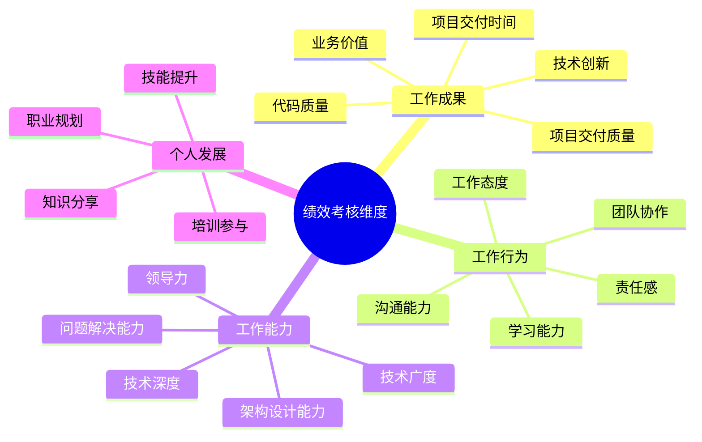
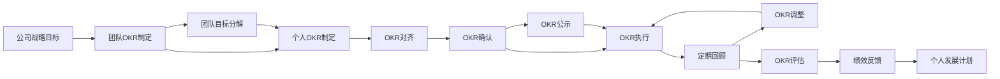
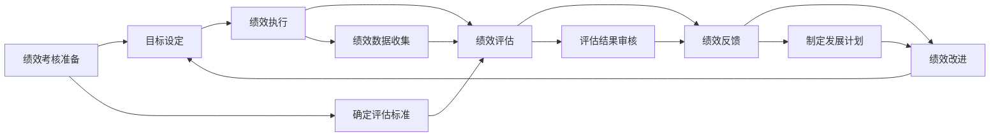
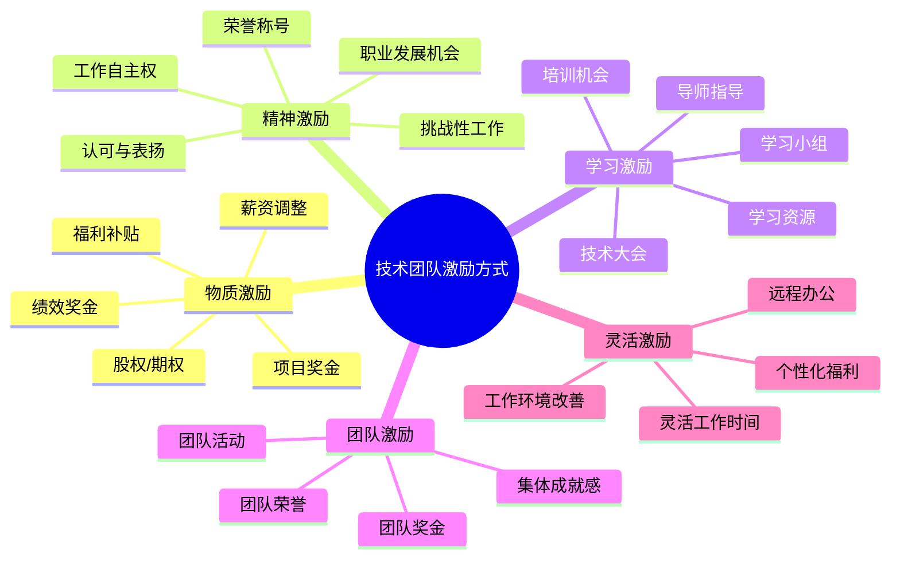
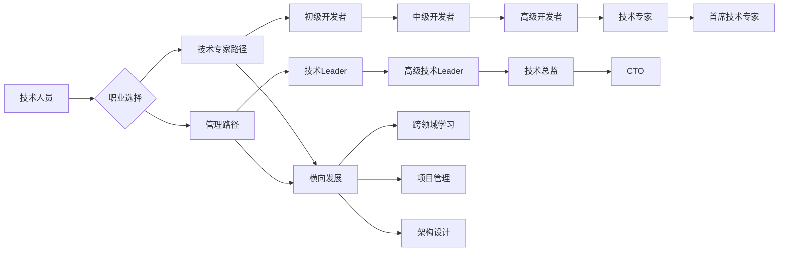

# 绩效考核与激励

## 1. 绩效考核概述

### 1.1 绩效考核的定义

绩效考核是指企业或组织根据一定的标准和方法，对员工的工作表现、工作成果和工作能力进行评估和测量的过程。绩效考核是人力资源管理的重要组成部分，对于技术团队的管理具有重要意义。

### 1.2 绩效考核的目的

```mermaid
flowchart TD
    A[绩效考核] --> B[评估员工表现]
    A --> C[提供反馈和指导]
    A --> D[促进员工成长]
    A --> E[优化薪酬和激励]
    A --> F[支持人员决策]
    A --> G[促进团队目标实现]
    A --> H[提高团队绩效]
    
    B --> B1[客观评价员工贡献]
    B --> B2[识别员工优势和不足]
    B --> B3[建立绩效基线]
    
    C --> C1[明确改进方向]
    C --> C2[增强员工自我认知]
    C --> C3[促进沟通和对话]
    
    D --> D1[制定个人发展计划]
    D --> D2[提供培训和学习机会]
    D --> D3[提升员工能力和技能]
    
    E --> E1[优化薪酬分配]
    E --> E2[制定激励政策]
    E --> E3[提高员工满意度]
    
    F --> F1[支持晋升决策]
    F --> F2[支持调岗决策]
    F --> F3[支持人才选拔]
    
    G --> G1[对齐个人目标与团队目标]
    G --> G2[明确工作优先级]
    G --> G3[增强团队凝聚力]
    
    H --> H1[提高团队整体绩效]
    H --> H2[促进团队持续改进]
    H --> H3[增强团队竞争力]
```

### 1.3 技术团队绩效考核的特点

| 特点 | 描述 | 管理挑战 |
|------|------|----------|
| 技术工作复杂性 | 技术工作往往具有复杂性和创造性，难以直接量化 | 如何客观评估技术工作的价值和质量 |
| 团队协作性 | 技术工作通常需要团队协作，个人贡献难以单独衡量 | 如何区分个人贡献和团队贡献 |
| 结果延迟性 | 技术工作的成果可能需要较长时间才能显现 | 如何评估短期表现与长期潜力 |
| 技术更新快 | 技术发展迅速，需要持续学习和适应 | 如何评估学习能力和技术更新速度 |
| 自主性强 | 技术人员通常具有较强的自主性，工作方式灵活 | 如何评估工作过程和结果 |

## 2. 绩效考核体系设计

### 2.1 绩效考核的原则

| 原则 | 说明 | 实践方式 |
|------|------|----------|
| 公平公正 | 绩效考核要公平、公正、公开，避免偏见和歧视 | 建立客观的评估标准，使用多人评估，公开评估流程 |
| 目标一致 | 绩效考核要与团队目标和公司目标保持一致 | 制定与团队目标对齐的个人目标，使用OKR等目标管理方法 |
| 全面评估 | 绩效考核要全面评估员工的表现，包括结果、行为和能力 | 采用360度评估，综合考虑多个维度 |
| 可衡量性 | 绩效考核的标准要具体、可衡量，避免模糊和主观 | 使用SMART原则设定目标，量化评估指标 |
| 及时性 | 绩效考核要及时进行，及时反馈和改进 | 定期进行绩效考核，及时提供反馈 |
| 发展导向 | 绩效考核要以促进员工发展为导向，而非单纯的评价 | 提供发展建议和支持，制定个人发展计划 |
| 透明性 | 绩效考核的流程和标准要透明，员工要清楚了解 | 公开绩效考核流程和标准，及时沟通评估结果 |

### 2.2 绩效考核的维度

技术团队的绩效考核通常包括以下几个维度：

### 2.3 绩效考核的方法

| 方法 | 特点 | 适用场景 |
|------|------|----------|
| OKR | 目标与关键结果，聚焦目标和结果 | 技术团队，创新型项目 |
| KPI | 关键绩效指标，量化评估 | 稳定型项目，可量化的工作 |
| 360度评估 | 多方面评估，包括上级、同事、下属和客户 | 全面评估员工表现 |
| 自评与他评 | 员工自评与上级评估相结合 | 大多数技术团队 |
| 项目评估 | 基于项目成果进行评估 | 项目驱动的团队 |
| 行为锚定评分法 | 基于行为的评分，减少主观偏见 | 需要评估行为表现的场景 |

### 2.4 OKR在技术团队的应用

OKR（Objectives and Key Results）是一种目标管理方法，非常适合技术团队使用。

#### 2.4.1 OKR的结构

- **Objective（目标）**：描述团队或个人想要实现的方向和愿景，具有挑战性和激励性
- **Key Results（关键结果）**：衡量目标是否实现的具体、可量化的指标

#### 2.4.2 OKR的制定流程

#### 2.4.3 技术团队OKR示例

| 级别 | Objective | Key Results |
|------|-----------|-------------|
| 团队 | 提升系统性能和稳定性 | 1. 系统响应时间降低50% 2. 系统可用性达到99.9% 3. 减少50%的生产环境故障 |
| 个人 | 提升PHP架构设计能力 | 1. 完成2个系统架构设计 2. 主导1次架构评审 3. 学习微服务架构并应用到项目中 |

### 2.5 绩效考核的流程

## 3. 绩效评估与反馈

### 3.1 绩效评估的准备

1. **收集绩效数据**：
   - 项目交付情况
   - 代码质量指标
   - 技术创新成果
   - 团队协作表现
   - 客户反馈
   - 学习和成长情况

2. **准备评估材料**：
   - 员工的目标和计划
   - 绩效数据和证据
   - 之前的评估记录
   - 发展计划的执行情况

3. **安排评估时间和地点**：
   - 选择安静、私密的环境
   - 提前通知员工，让员工做好准备
   - 预留足够的时间进行充分讨论

### 3.2 绩效评估会议

#### 3.2.1 会议流程

1. **开场**：简要说明会议目的和流程
2. **员工自评**：让员工先进行自我评估，分享工作成果和感受
3. **上级评估**：上级对员工的表现进行评估，基于事实和数据
4. **讨论和反馈**：双方讨论评估结果，澄清误解，提供反馈
5. **制定发展计划**：共同制定下一个周期的发展计划
6. **结束**：总结会议要点，表达支持和鼓励

#### 3.2.2 会议技巧

1. **保持客观**：基于事实和数据进行评估，避免主观判断和情绪化
2. **倾听员工**：给予员工充分的表达机会，认真倾听员工的想法和反馈
3. **平衡正负反馈**：既要肯定优点，也要指出不足，保持平衡
4. **聚焦未来**：重点讨论改进和发展计划，而非过去的错误
5. **保持尊重**：尊重员工的感受和意见，维护员工的尊严
6. **达成共识**：与员工就评估结果和发展计划达成共识

### 3.3 绩效反馈的技巧

1. **及时反馈**：绩效反馈要及时进行，避免拖延
2. **具体明确**：反馈要具体，基于具体的行为和结果
3. **使用STAR法则**：描述具体情境、任务、行为和结果
4. **聚焦可改进的行为**：反馈要聚焦于可改进的行为，而非个人特质
5. **提供支持和资源**：为员工提供改进所需的支持和资源
6. **鼓励员工参与**：鼓励员工参与反馈过程，提出自己的想法和建议
7. **保持建设性**：反馈要具有建设性，帮助员工改进和成长

### 3.4 处理绩效问题

1. **识别绩效问题**：
   - 持续低于预期的表现
   - 工作质量下降
   - 缺乏主动性和责任感
   - 团队协作问题
   - 学习和成长缓慢

2. **分析问题原因**：
   - 能力问题：员工缺乏必要的技能和知识
   - 动机问题：员工缺乏工作动力和积极性
   - 环境问题：工作环境、资源或支持不足
   - 个人问题：员工个人因素影响工作

3. **制定改进计划**：
   - 明确绩效改进目标和标准
   - 提供必要的培训和支持
   - 设定合理的改进期限
   - 定期跟踪和反馈

4. **采取必要的措施**：
   - 绩效辅导和培训
   - 调整工作内容和职责
   - 提供更多的支持和资源
   - 考虑调岗或降职
   - 解除劳动合同（最后手段）

## 4. 激励机制设计

### 4.1 激励的重要性

1. **提高工作积极性**：有效的激励可以提高员工的工作积极性和主动性
2. **增强团队凝聚力**：公平的激励机制可以增强团队凝聚力和归属感
3. **促进员工成长**：激励可以鼓励员工学习和成长，提高能力和技能
4. **降低离职率**：良好的激励机制可以降低员工离职率，保持团队稳定性
5. **提高团队绩效**：激励可以提高团队的整体绩效和生产力

### 4.2 激励理论

| 理论 | 核心观点 | 应用建议 |
|------|----------|----------|
| 马斯洛需求层次理论 | 人的需求分为生理、安全、社交、尊重和自我实现五个层次 | 了解员工的需求层次，提供相应的激励 |
| 赫兹伯格双因素理论 | 激励因素（成就、认可、成长）和保健因素（薪酬、工作条件） | 关注激励因素，同时确保保健因素满足 |
| 期望理论 | 激励力量=效价×期望值×工具性 | 明确目标，提供实现路径，确保奖励与绩效挂钩 |
| 公平理论 | 员工会比较自己与他人的投入产出比 | 建立公平的激励机制，确保分配公平 |
| 强化理论 | 正强化（奖励）和负强化（惩罚） | 多使用正强化，鼓励正向行为 |

### 4.3 技术团队的激励方式

### 4.4 激励机制设计的原则

1. **公平公正**：激励机制要公平、公正，避免偏袒和歧视
2. **绩效导向**：激励要与绩效挂钩，根据绩效表现给予相应的奖励
3. **多样化**：采用多种激励方式，满足不同员工的需求
4. **个性化**：考虑员工的个体差异，提供个性化的激励
5. **及时性**：激励要及时进行，增强激励效果
6. **透明性**：激励机制的规则和标准要透明，员工要清楚了解
7. **可持续性**：激励机制要具有可持续性，长期有效

### 4.5 激励机制的实施

1. **了解员工需求**：通过调查、访谈等方式了解员工的需求和偏好
2. **设计激励方案**：根据员工需求和团队特点，设计合适的激励方案
3. **沟通和宣传**：向员工宣传激励方案，确保员工理解和接受
4. **实施激励方案**：按照激励方案实施激励，确保公平和及时
5. **评估和调整**：定期评估激励方案的效果，根据实际情况进行调整

## 5. 薪酬体系设计

### 5.1 薪酬体系的组成

技术团队的薪酬体系通常包括以下几个部分：

| 组成部分 | 特点 | 作用 |
|----------|------|------|
| 基本工资 | 固定薪酬，根据职位、能力和经验确定 | 保障员工的基本生活需求 |
| 绩效奖金 | 可变薪酬，根据绩效表现确定 | 激励员工提高绩效 |
| 项目奖金 | 基于项目成果的奖金 | 激励项目团队按时高质量交付 |
| 股权激励 | 股权或期权，长期激励 | 吸引和保留核心人才 |
| 福利补贴 | 各种福利和补贴，如五险一金、带薪休假、培训补贴等 | 提高员工满意度和归属感 |

### 5.2 薪酬设计的原则

1. **公平性**：内部公平和外部公平
2. **竞争性**：薪酬水平具有市场竞争力
3. **激励性**：薪酬要具有激励作用，与绩效挂钩
4. **合法性**：符合法律法规的要求
5. **透明性**：薪酬体系的规则和标准要透明
6. **灵活性**：薪酬体系要具有一定的灵活性，能够适应变化

### 5.3 薪酬调整机制

1. **年度调薪**：根据市场情况和员工表现，每年进行一次调薪
2. **绩效调薪**：根据绩效表现，给予相应的薪酬调整
3. **晋升调薪**：员工晋升时，调整薪酬水平
4. **市场调整**：根据市场薪酬水平的变化，进行相应的调整
5. **特殊调整**：针对特殊情况，如人才保留、重要项目等，进行特殊调薪

## 6. 职业发展规划

### 6.1 职业发展的重要性

1. **提高员工满意度**：提供清晰的职业发展路径，可以提高员工的满意度和归属感
2. **促进员工成长**：职业发展规划可以帮助员工明确发展方向，促进员工成长和进步
3. **保留核心人才**：良好的职业发展机会可以吸引和保留核心人才
4. **提高团队绩效**：员工的成长和进步可以提高团队的整体绩效和竞争力
5. **增强团队凝聚力**：共同的职业发展目标可以增强团队凝聚力和协作精神

### 6.2 技术人员的职业发展路径

技术人员的职业发展通常有两条主要路径：

### 6.3 职业发展规划的流程

1. **自我评估**：员工进行自我评估，了解自己的兴趣、技能、优势和不足
2. **目标设定**：员工与上级共同设定职业发展目标，包括短期和长期目标
3. **制定计划**：根据目标，制定具体的发展计划，包括学习、培训和实践机会
4. **实施计划**：员工按照计划实施，上级提供必要的支持和资源
5. **定期回顾**：定期回顾发展计划的执行情况，调整和优化计划
6. **评估和调整**：评估发展成果，根据实际情况调整职业发展目标和计划

### 6.4 技术Leader在职业发展中的角色

1. **提供指导**：为员工提供职业发展的指导和建议
2. **创造机会**：为员工创造学习、成长和实践的机会
3. **提供反馈**：定期提供绩效反馈，帮助员工了解自己的表现和改进方向
4. **支持培训**：支持员工参加培训和学习活动，提供必要的资源
5. **鼓励创新**：鼓励员工尝试新的技术和方法，促进创新和成长
6. **提供晋升机会**：根据员工的表现和能力，提供晋升机会

## 7. 绩效考核与激励的最佳实践

### 7.1 最佳实践案例

**背景**：某互联网公司的PHP开发团队，采用OKR进行绩效考核，建立了完善的激励机制。

**实践内容**：

1. **绩效考核**：
   - 采用OKR进行目标管理，每季度设定和回顾OKR
   - 结合360度评估，全面评估员工表现
   - 定期进行绩效反馈和辅导
   - 建立绩效改进机制，帮助员工提高表现

2. **激励机制**：
   - 绩效奖金与OKR完成情况挂钩
   - 项目奖金根据项目难度和成果确定
   - 提供股权激励计划，吸引和保留核心人才
   - 定期组织技术分享和学习活动
   - 提供灵活的工作方式，包括远程办公和弹性工作时间
   - 建立技术晋升通道，支持技术人员的职业发展

**成果**：
   - 团队绩效显著提升，项目交付效率提高30%
   - 员工满意度提高，离职率降低20%
   - 技术创新增加，申请了多项技术专利
   - 团队凝聚力增强，协作效率提高
   - 吸引了更多优秀的技术人才加入

### 7.2 常见问题及解决方案

| 问题 | 原因 | 解决方案 |
|------|------|----------|
| 绩效考核流于形式 | 评估标准不明确，缺乏数据支持，反馈不及时 | 建立明确的评估标准，收集客观数据，及时反馈 |
| 激励效果不佳 | 激励方式单一，与员工需求不匹配 | 采用多样化的激励方式，了解员工需求，个性化激励 |
| 薪酬不公平 | 薪酬体系不透明，评估标准不一致 | 建立透明的薪酬体系，明确评估标准，确保公平公正 |
| 职业发展路径不清晰 | 缺乏明确的职业发展规划和晋升通道 | 建立清晰的职业发展路径，提供晋升机会和培训支持 |
| 绩效与激励脱节 | 绩效评估结果与激励措施不挂钩 | 建立绩效与激励的直接关联，根据绩效给予相应的激励 |

## 8. 总结与行动建议

### 8.1 绩效考核与激励的核心要点

1. **绩效考核是管理的重要工具**：有效的绩效考核可以评估员工表现，提供反馈和指导，促进员工成长
2. **激励是提高绩效的关键**：合理的激励机制可以提高员工的工作积极性和主动性
3. **公平公正是基础**：绩效考核和激励机制要公平、公正、透明
4. **发展导向是目标**：绩效考核和激励要以促进员工发展为导向
5. **个性化是趋势**：考虑员工的个体差异，提供个性化的考核和激励
6. **持续改进是保障**：定期评估和改进绩效考核和激励机制

### 8.2 行动建议

1. **评估现有体系**：评估团队现有的绩效考核和激励体系，识别问题和不足
2. **设计合适的体系**：根据团队特点和需求，设计合适的绩效考核和激励体系
3. **建立目标管理机制**：引入OKR等目标管理方法，对齐个人目标与团队目标
4. **完善反馈机制**：建立定期的绩效反馈机制，及时提供反馈和指导
5. **多样化激励方式**：采用多种激励方式，满足不同员工的需求
6. **建立职业发展通道**：建立清晰的职业发展路径，支持员工的成长和晋升
7. **持续改进**：定期评估和改进绩效考核和激励体系

### 8.3 给新任技术Leader的建议

1. **重视绩效考核和激励**：将绩效考核和激励作为管理的重要组成部分
2. **建立信任关系**：与员工建立信任关系，确保绩效考核和激励的公平性
3. **注重沟通**：加强与员工的沟通，了解员工的需求和期望
4. **以身作则**：作为Leader，要以身作则，展示良好的工作表现和态度
5. **关注员工成长**：关注员工的成长和发展，提供必要的支持和资源
6. **保持灵活性**：根据实际情况，灵活调整绩效考核和激励机制
7. **持续学习**：学习和了解最新的绩效考核和激励理论和实践

通过建立科学的绩效考核和激励体系，技术Leader可以提高团队的绩效和凝聚力，促进员工的成长和发展，实现团队和个人的共同目标。