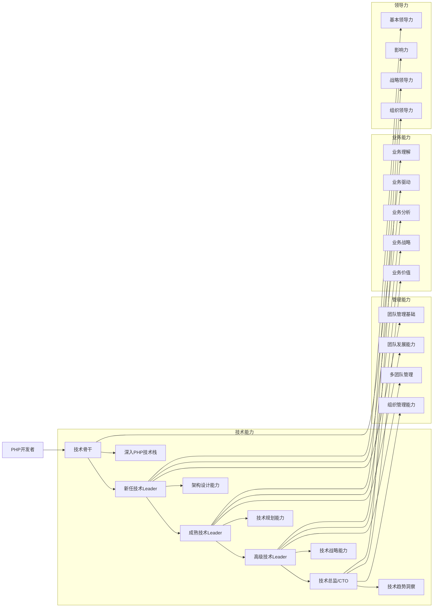

# 个人成长与领导力提升

## 1. 领导力概述

### 1.1 领导力的定义

领导力是指影响和引导他人实现共同目标的能力，它不仅仅是管理职位所赋予的权力，更是一种影响力和号召力。对于技术Leader来说，领导力是带领团队实现技术目标、推动业务发展的关键能力。

```mermaid
flowchart TD
    A[领导力] --> B[愿景与目标]
    A --> C[影响力]
    A --> D[决策能力]
    A --> E[团队建设]
    A --> F[沟通能力]
    A --> G[问题解决]
    A --> H[学习与创新]
    A --> I[伦理与价值观]
    
    B --> B1[设定清晰的愿景]
    B --> B2[制定明确的目标]
    B --> B3[激励团队实现目标]
    
    C --> C1[非权力影响力]
    C --> C2[说服力]
    C --> C3[榜样作用]
    
    D --> D1[快速决策]
    D --> D2[基于数据和事实]
    D --> D3[承担决策责任]
    
    E --> E1[团队组建]
    E --> E2[团队激励]
    E --> E3[团队发展]
    
    F --> F1[有效沟通]
    F --> F2[倾听反馈]
    F --> F3[跨团队协作]
    
    G --> G1[分析问题]
    G --> G2[创新解决方案]
    G --> G3[风险管理]
    
    H --> H1[持续学习]
    H --> H2[鼓励创新]
    H --> H3[适应变化]
    
    I --> I1[诚信正直]
    I --> I2[公平公正]
    I --> I3[社会责任]
```

### 1.2 技术Leader的领导力特质

| 特质 | 描述 | 实践方式 |
|------|------|----------|
| 技术能力 | 深入的技术知识和经验 | 持续学习新技术，参与技术决策，解决技术难题 |
| 愿景思维 | 能够看到未来的发展方向 | 设定团队愿景，制定技术路线图，推动技术创新 |
| 战略思考 | 从全局角度思考问题 | 对齐技术与业务目标，优化资源配置，制定长期规划 |
| 执行力 | 能够将愿景转化为行动 | 制定详细的执行计划，监控进度，确保目标实现 |
| 团队导向 | 关注团队的整体发展 | 培养团队成员，建立协作文化，提高团队凝聚力 |
| 沟通能力 | 能够有效沟通和表达 | 清晰传达目标和期望，倾听反馈，促进跨团队协作 |
| 适应性 | 能够适应变化和挑战 | 快速响应市场变化，调整策略，推动变革 |
| 诚信正直 | 具有良好的道德品质 | 言行一致，公平公正，勇于承担责任 |
| 学习能力 | 能够持续学习和成长 | 学习新技术、管理知识和领导力，不断提升自己 |
| 同理心 | 能够理解和关心他人 | 关注团队成员的需求和感受，提供支持和帮助 |

### 1.3 领导力与管理的区别

| 维度 | 管理 | 领导 |
|------|------|------|
| 关注点 | 流程和系统 | 人和愿景 |
| 目标 | 维持秩序和效率 | 推动变革和创新 |
| 权力来源 | 职位赋予的权力 | 个人影响力 |
| 工作方式 | 计划、组织、控制 | 启发、激励、引导 |
| 决策方式 | 基于规则和流程 | 基于愿景和价值观 |
| 面对变化 | 维持现状 | 拥抱变化 |
| 对人的态度 | 管理和控制 | 发展和赋能 |
| 结果 | 完成任务 | 实现愿景 |

## 2. 新任技术Leader的成长路径

### 2.1 成长阶段

从PHP开发者到技术Leader，通常需要经历以下几个成长阶段：

### 2.2 各阶段的重点任务

| 阶段 | 重点任务 | 能力发展重点 |
|------|----------|--------------|
| 新任技术Leader | 1. 角色转换与心态调整 2. 建立团队信任 3. 明确团队目标 4. 学习基本管理技能 | 团队管理基础、沟通能力、基本领导力 |
| 成熟技术Leader | 1. 优化团队流程 2. 培养团队成员 3. 推动技术创新 4. 提升团队绩效 | 团队发展、技术规划、领导力提升 |
| 高级技术Leader | 1. 制定技术战略 2. 管理多个团队 3. 推动组织变革 4. 培养后备人才 | 技术战略、多团队管理、战略领导力 |
| 技术总监/CTO | 1. 制定公司技术愿景 2. 推动技术转型 3. 管理技术团队 4. 支持业务发展 | 技术愿景、组织领导力、业务战略 |

## 3. 个人成长计划

### 3.1 自我评估

1. **评估当前能力**：
   - 技术能力：PHP技术栈掌握程度、架构设计能力、技术趋势了解
   - 管理能力：团队管理、项目管理、沟通能力
   - 领导力：影响力、决策能力、团队建设
   - 业务能力：业务理解、业务驱动、业务价值

2. **识别优势和不足**：
   - 优势：作为PHP开发者的技术积累、对团队的了解
   - 不足：管理经验、领导力、业务视野

3. **明确发展需求**：
   - 短期需求：基本管理技能、沟通能力、团队建设
   - 长期需求：技术战略、领导力提升、业务视野

### 3.2 制定成长目标

成长目标应该遵循SMART原则：
- **Specific**：具体明确
- **Measurable**：可衡量
- **Achievable**：可实现
- **Relevant**：与职业发展相关
- **Time-bound**：有时间限制

#### 3.2.1 短期目标（3-6个月）

| 目标类型 | 具体目标 | 衡量标准 |
|----------|----------|----------|
| 管理能力 | 掌握基本的团队管理技能 | 成功管理团队完成一个项目 |
| 沟通能力 | 提高沟通和反馈能力 | 团队成员满意度提高20% |
| 技术能力 | 提升架构设计能力 | 主导完成一个系统架构设计 |
| 领导力 | 建立团队信任 | 团队凝聚力增强，离职率降低 |

#### 3.2.2 中期目标（6-12个月）

| 目标类型 | 具体目标 | 衡量标准 |
|----------|----------|----------|
| 管理能力 | 优化团队流程，提高团队效率 | 团队交付效率提高30% |
| 沟通能力 | 提高跨团队沟通和协作能力 | 成功推动一个跨团队项目 |
| 技术能力 | 制定团队技术路线图 | 技术路线图获得认可并实施 |
| 领导力 | 培养团队成员，建立学习文化 | 团队成员技能提升，技术分享常态化 |

#### 3.2.3 长期目标（1-3年）

| 目标类型 | 具体目标 | 衡量标准 |
|----------|----------|----------|
| 管理能力 | 管理多个团队或复杂项目 | 成功管理多个团队或大型项目 |
| 技术能力 | 制定技术战略，推动技术创新 | 技术战略获得公司认可，推动技术转型 |
| 领导力 | 成为有影响力的技术Leader | 能够影响公司技术决策，培养后备人才 |
| 业务能力 | 深入理解业务，推动业务发展 | 技术为业务创造显著价值，获得业务部门认可 |

### 3.3 成长计划的实施

1. **学习计划**：
   - 参加管理和领导力培训课程
   - 阅读管理和领导力相关书籍
   - 学习技术战略和架构设计知识
   - 参加技术大会和行业活动

2. **实践计划**：
   - 承担具有挑战性的项目
   - 参与技术决策和规划
   - 培养团队成员，建立学习文化
   - 推动跨团队协作和沟通

3. **反馈计划**：
   - 定期与上级进行一对一沟通，获取反馈
   - 与团队成员进行定期反馈，了解团队需求
   - 参加360度评估，获得全面反馈
   - 建立自我反思机制，定期回顾和总结

4. **导师计划**：
   - 寻找一位有经验的技术Leader作为导师
   - 定期与导师交流，获取指导和建议
   - 学习导师的管理和领导力经验
   - 向导师请教遇到的问题和挑战

## 4. 领导力提升方法

### 4.1 学习与自我提升

1. **阅读经典书籍**：
   - 管理类：《从优秀到卓越》、《第五项修炼》、《高效能人士的七个习惯》
   - 领导力类：《领导力21法则》、《仆人领导》、《领导者》
   - 技术管理类：《技术领导力》、《架构即未来》、《人月神话》
   - 创新类：《创新者的窘境》、《精益创业》

2. **参加培训和课程**：
   - 管理和领导力培训课程
   - 技术战略和架构设计课程
   - 沟通和演讲技巧培训
   - 敏捷和项目管理培训

3. **参加行业活动**：
   - 技术大会和研讨会
   - 行业论坛和沙龙
   - 技术社区活动
   - 行业协会活动

4. **在线学习资源**：
   - MOOC平台：Coursera、edX、Udemy
   - 专业网站：Medium、LinkedIn、GitHub
   - 播客和视频：TED演讲、技术播客
   - 在线社区：Stack Overflow、知乎

### 4.2 实践与反思

1. **承担挑战性项目**：
   - 主动承担复杂或重要的项目
   - 尝试新的技术和方法
   - 解决团队面临的难题
   - 推动技术创新和变革

2. **建立反馈机制**：
   - 定期与团队成员进行一对一沟通
   - 鼓励团队成员提供反馈
   - 参加360度评估
   - 建立自我反思日记，定期回顾和总结

3. **培养团队成员**：
   - 为团队成员提供学习和成长机会
   - 建立导师制度，指导初级员工
   - 鼓励团队成员承担更多责任
   - 认可和奖励团队成员的成长

4. **推动跨团队协作**：
   - 主动参与跨团队项目和协作
   - 建立跨团队沟通机制
   - 促进知识共享和经验交流
   - 解决跨团队冲突和问题

### 4.3 建立支持网络

1. **寻找导师**：
   - 寻找一位有经验的技术Leader作为导师
   - 定期与导师交流，获取指导和建议
   - 学习导师的管理和领导力经验
   - 向导师请教遇到的问题和挑战

2. **加入技术Leader社区**：
   - 加入技术Leader俱乐部或社区
   - 参加技术Leader聚会和活动
   - 与其他技术Leader交流经验和心得
   - 分享自己的管理和领导力经验

3. **建立内部支持网络**：
   - 与其他部门的技术Leader建立联系
   - 与业务部门负责人建立良好关系
   - 与HR和其他支持部门建立合作
   - 建立跨部门的信任和合作关系

### 4.4 培养关键领导力特质

1. **愿景与战略思维**：
   - 培养长远眼光，关注技术趋势和业务发展
   - 制定清晰的技术愿景和战略
   - 能够将愿景转化为可执行的计划
   - 定期回顾和调整战略，适应变化

2. **影响力**：
   - 建立个人品牌和专业声誉
   - 提高沟通和表达能力
   - 学会说服和协商技巧
   - 以身作则，成为团队的榜样

3. **决策能力**：
   - 基于数据和事实做出决策
   - 学会快速决策，避免过度分析
   - 敢于承担决策责任
   - 建立决策反馈机制，从决策中学习

4. **团队建设**：
   - 建立积极向上的团队文化
   - 培养团队凝聚力和归属感
   - 识别和培养团队中的人才
   - 建立有效的团队激励机制

5. **沟通能力**：
   - 提高倾听和理解能力
   - 学会清晰表达自己的想法和观点
   - 适应不同的沟通对象和场景
   - 建立有效的沟通机制

6. **学习与创新**：
   - 保持学习的热情和好奇心
   - 鼓励团队创新和尝试
   - 拥抱变化，适应新技术和新方法
   - 建立学习型组织文化

## 5. 时间管理与优先级

### 5.1 技术Leader的时间分配

技术Leader的时间通常分配在以下几个方面：

| 活动类型 | 建议时间占比 | 具体活动 |
|----------|--------------|----------|
| 团队管理 | 30-40% | 团队会议、一对一沟通、绩效反馈、团队建设 |
| 技术工作 | 20-30% | 技术决策、架构设计、代码评审、技术规划 |
| 项目管理 | 20-30% | 项目规划、进度跟踪、风险管控、资源协调 |
| 业务沟通 | 10-20% | 与业务部门沟通、理解业务需求、汇报技术成果 |
| 个人成长 | 10% | 学习、反思、培训、参加活动 |

### 5.2 时间管理技巧

1. **优先级管理**：
   - 使用四象限法则，区分紧急重要的任务
   - 明确每日、每周的重点任务
   - 学会说"不"，拒绝不重要的任务
   - 定期回顾和调整优先级

2. **时间规划**：
   - 制定每日、每周的工作计划
   - 预留弹性时间，应对突发情况
   - 批量处理类似任务，提高效率
   - 使用时间管理工具，如日历、待办事项列表

3. **减少时间浪费**：
   - 优化会议流程，减少不必要的会议
   - 避免频繁被打断，设置专注时间
   - 学会授权，将任务分配给合适的团队成员
   - 减少无效沟通和社交

4. **工作与生活平衡**：
   - 设定工作时间边界，避免过度工作
   - 培养健康的生活习惯，包括运动、休息和放松
   - 关注家庭和个人生活，保持良好的工作与生活平衡
   - 定期休假，恢复精力和创造力

### 5.3 授权与委派

授权是技术Leader的重要技能，它可以释放自己的时间，培养团队成员的能力，提高团队的整体绩效。

1. **授权的好处**：
   - 释放自己的时间，专注于更重要的任务
   - 培养团队成员的能力和信心
   - 提高团队的整体绩效和效率
   - 增强团队成员的责任感和归属感

2. **授权的原则**：
   - 明确授权的任务和目标
   - 选择合适的授权对象
   - 提供必要的资源和支持
   - 建立明确的责任和 accountability
   - 定期跟踪和反馈
   - 允许失败，鼓励学习

3. **授权的步骤**：
   - 确定需要授权的任务
   - 选择合适的团队成员
   - 明确任务目标、范围和期望
   - 提供必要的资源和支持
   - 建立沟通和反馈机制
   - 定期跟踪进度，提供指导
   - 认可和奖励成功

## 6. 面对挑战与压力管理

### 6.1 技术Leader常见的挑战

| 挑战 | 表现 | 应对策略 |
|------|------|----------|
| 角色转换 | 难以从技术角色转换为管理角色 | 学习管理知识，寻求导师指导，逐步调整工作方式 |
| 团队管理 | 团队成员不配合，绩效不佳 | 建立信任关系，明确团队目标，提供必要的支持和培训 |
| 技术决策 | 技术方案选择困难，担心决策失误 | 收集充分信息，建立决策流程，敢于承担责任 |
| 资源不足 | 人力、物力资源有限 | 优化资源配置，优先级排序，寻求外部支持 |
| 时间压力 | 工作任务繁重，时间不够用 | 优先级管理，授权和委派，提高工作效率 |
| 跨团队协作 | 跨团队沟通和协作困难 | 建立沟通机制，寻找共同利益，寻求上级支持 |
| 业务压力 | 业务需求不断变化，压力大 | 与业务部门充分沟通，合理管理期望，敏捷应对变化 |
| 个人成长 | 担心能力不足，难以适应新角色 | 制定个人成长计划，持续学习，寻求反馈和支持 |

### 6.2 压力管理技巧

1. **认识压力**：
   - 了解压力的来源和表现
   - 区分有益压力和有害压力
   - 接受压力是工作的一部分

2. **应对压力的策略**：
   - 积极面对问题，寻找解决方案
   - 分解任务，逐步解决
   - 寻求支持和帮助
   - 保持乐观的心态

3. **放松技巧**：
   - 深呼吸和冥想
   - 运动和锻炼
   - 兴趣爱好和放松活动
   - 良好的睡眠和休息

4. **建立支持系统**：
   - 与家人和朋友保持良好关系
   - 与同事和同行建立支持网络
   - 寻求专业帮助，如心理咨询

5. **保持工作与生活平衡**：
   - 设定工作边界，避免过度工作
   - 关注个人生活和健康
   - 定期休假，恢复精力

## 7. 领导力案例分析

### 7.1 案例：从PHP开发者到技术总监

**背景**：
小明是一名优秀的PHP开发者，在一家互联网公司工作了8年，从初级开发者成长为技术总监。他经历了从个人贡献者到技术Leader，再到技术总监的转变，积累了丰富的管理和领导力经验。

**成长历程**：

1. **PHP开发者阶段**：
   - 专注于PHP技术栈的学习和实践
   - 参与多个项目的开发，积累了丰富的开发经验
   - 成为团队中的技术骨干，负责核心模块的开发

2. **技术Leader阶段**：
   - 学习管理知识和技能，参加管理培训
   - 建立团队信任，明确团队目标
   - 培养团队成员，建立学习文化
   - 推动技术创新，优化系统架构

3. **技术总监阶段**：
   - 制定公司技术战略和路线图
   - 管理多个技术团队，协调资源
   - 推动技术转型和创新
   - 与业务部门紧密合作，支持业务发展
   - 培养后备技术Leader

**成功因素**：
   - 持续学习和成长，适应不同阶段的角色要求
   - 建立良好的团队关系和信任
   - 关注业务价值，将技术与业务结合
   - 培养团队成员，建立学习和创新文化
   - 建立有效的沟通和协作机制
   - 保持积极的心态，面对挑战和压力

### 7.2 案例：带领团队渡过技术转型

**背景**：
某公司的PHP系统面临性能瓶颈，需要进行技术转型，采用微服务架构。技术Leader小李带领团队成功完成了技术转型，提升了系统性能和可扩展性。

**挑战**：
   - 团队成员对微服务架构不熟悉
   - 技术转型风险高，可能影响业务正常运行
   - 时间紧，任务重
   - 团队成员对技术转型有抵触情绪

**领导力实践**：
1. **设定清晰的愿景**：
   - 向团队明确技术转型的目标和好处
   - 制定详细的转型计划和路线图
   - 与团队成员充分沟通，消除疑虑

2. **提供支持和培训**：
   - 组织微服务架构的培训和学习
   - 引入外部专家进行指导
   - 建立学习小组，促进知识共享
   - 为团队成员提供实践机会

3. **建立信任和信心**：
   - 从小规模试点开始，逐步推广
   - 认可和奖励团队成员的努力和成就
   - 及时解决转型过程中遇到的问题
   - 保持透明沟通，及时分享进展

4. **以身作则**：
   - 积极学习微服务架构知识
   - 参与技术转型的具体工作
   - 展现坚定的决心和信心
   - 承担决策责任

**成果**：
   - 成功完成技术转型，系统性能提升50%
   - 团队成员掌握了微服务架构知识和技能
   - 团队凝聚力增强，信心提升
   - 业务部门对技术团队的认可度提高
   - 为公司未来的业务增长奠定了技术基础

## 8. 总结与行动建议

### 8.1 技术Leader的核心素养

1. **持续学习**：技术和管理领域都在不断发展，技术Leader需要保持学习的热情和好奇心，持续提升自己的能力
2. **愿景与战略**：能够看到未来的发展方向，制定清晰的技术愿景和战略
3. **团队导向**：关注团队的整体发展，培养团队成员，建立积极向上的团队文化
4. **有效沟通**：能够清晰表达自己的想法和观点，倾听他人的反馈，促进跨团队协作
5. **适应性**：能够适应变化和挑战，快速调整策略和方法
6. **诚信正直**：具有良好的道德品质，言行一致，公平公正
7. **结果导向**：关注业务结果和价值，将技术与业务结合，为公司创造价值
8. **同理心**：能够理解和关心团队成员，提供必要的支持和帮助

### 8.2 行动建议

1. **制定个人成长计划**：根据自己的现状和目标，制定详细的成长计划
2. **持续学习**：参加培训、阅读书籍、学习新技术和管理知识
3. **实践与反思**：在实际工作中应用所学知识，定期反思和总结
4. **建立支持网络**：寻找导师，加入技术Leader社区，与其他技术Leader交流经验
5. **关注团队发展**：培养团队成员，建立学习和创新文化，提高团队绩效
6. **平衡工作与生活**：保持良好的工作与生活平衡，关注个人健康和幸福
7. **面对挑战保持积极心态**：将挑战视为成长的机会，保持乐观和坚韧的心态
8. **成为有影响力的技术Leader**：通过自己的言行和成就，影响和激励他人

### 8.3 给新任技术Leader的寄语

从PHP开发者到技术Leader的转变是一个充满挑战和机遇的过程。作为新任技术Leader，你需要：

1. **拥抱变化**：接受角色的转变，积极适应新的工作方式和责任
2. **保持谦逊**：承认自己在管理和领导力方面的不足，持续学习和成长
3. **建立信任**：与团队成员建立信任关系，成为团队的榜样和支持者
4. **关注业务**：将技术与业务结合，为公司创造真正的价值
5. **享受过程**：享受成长和挑战的过程，庆祝团队和个人的成就

记住，领导力不是天生的，而是通过学习和实践不断培养和提升的。只要你保持学习的热情，关注团队的发展，勇于面对挑战，你一定能够成为一名优秀的技术Leader。

---

# 技术Leader成长资源推荐

## 书籍推荐

1. **管理与领导力**：
   - 《从优秀到卓越》（吉姆·柯林斯）
   - 《第五项修炼》（彼得·圣吉）
   - 《高效能人士的七个习惯》（史蒂芬·柯维）
   - 《领导力21法则》（约翰·麦克斯韦尔）
   - 《仆人领导》（罗伯特·格林里夫）

2. **技术管理**：
   - 《技术领导力》（金无怠）
   - 《架构即未来》（马丁·阿伯特）
   - 《人月神话》（弗雷德里克·布鲁克斯）
   - 《软件开发者路线图》（丹·罗姆）
   - 《精益软件度量》（尼尔·福特）

3. **创新与敏捷**：
   - 《创新者的窘境》（克莱顿·克里斯坦森）
   - 《精益创业》（埃里克·莱斯）
   - 《敏捷软件开发》（罗伯特·C·马丁）
   - 《持续交付》（杰斯·亨布尔）

## 在线课程推荐

1. **管理与领导力**：
   - Coursera：《Leading Teams》（密歇根大学）
   - Coursera：《Leadership Principles》（哈佛大学）
   - LinkedIn Learning：《Leadership Foundations》
   - 极客时间：《技术领导力实战》

2. **技术管理**：
   - Coursera：《Software Architecture》（杜克大学）
   - edX：《Introduction to Cloud Computing》（IBM）
   - 极客时间：《架构师训练营》
   - 极客时间：《技术管理实战36讲》

3. **沟通与协作**：
   - Coursera：《Effective Communication》（科罗拉多大学）
   - LinkedIn Learning：《Communication Foundations》
   - 极客时间：《沟通的方法》

## 社区与活动推荐

1. **技术社区**：
   - GitHub：参与开源项目，学习最佳实践
   - Stack Overflow：解决技术问题，分享知识
   - SegmentFault：技术问答和文章分享
   - 掘金：技术文章和教程

2. **技术大会**：
   - PHPConf：PHP开发者大会
   - QCon：全球软件开发大会
   - ArchSummit：架构师峰会
   - D2前端技术论坛
   - 云栖大会

3. **管理与领导力社区**：
   - 技术Leader俱乐部
   - 领导力发展社区
   - 企业培训与发展协会

通过利用这些资源，结合实际工作中的实践和反思，你将能够不断提升自己的管理和领导力，成为一名优秀的技术Leader。