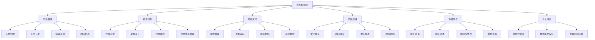
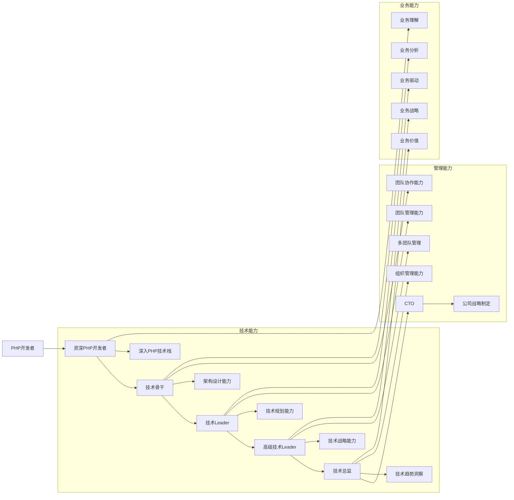

# 新任技术Leader入门指南

## 目录

- [1. 角色转换与心态调整](./01_角色转换与心态调整.md)
- [2. 团队管理基础](./02_团队管理基础.md)
- [3. 技术规划与决策](./03_技术规划与决策.md)
- [4. 项目管理与交付](./04_项目管理与交付.md)
- [5. 团队建设与文化](./05_团队建设与文化.md)
- [6. 沟通与协作](./06_沟通与协作.md)
- [7. 绩效考核与激励](./07_绩效考核与激励.md)
- [8. 个人成长与领导力提升](./08_个人成长与领导力提升.md)

## 指南特点

1. **技术背景适配**：专为从PHP开发岗位提拔的Leader设计
2. **实用性强**：注重可操作的管理技巧与实践方法
3. **系统全面**：覆盖技术管理的各个关键方面
4. **图形化表达**：使用Mermaid图表清晰展示复杂关系
5. **案例驱动**：包含实际工作中的案例分析

## 适用对象

- 由技术开发岗位刚提拔的新任技术Leader
- 缺乏管理经验的技术管理者
- 希望提升管理能力的技术骨干

## 学习建议

1. **循序渐进**：从角色转换开始，逐步深入各个管理领域
2. **实践优先**：将学到的管理技巧应用到实际工作中
3. **反思总结**：定期回顾管理实践，总结经验教训
4. **持续学习**：关注管理领域的最新理念和方法
5. **交流分享**：与其他技术Leader交流管理经验

## 文档更新日志

| 日期 | 版本 | 更新内容 |
|------|------|----------|
| 2026-01-18 | v1.0 | 初始化技术管理指南 |

---

# 技术Leader核心职责

## 技术Leader胜任力模型

| 维度 | 关键能力 | 重要程度 |
|------|----------|----------|
| 技术能力 | 架构设计、技术选型、问题解决 | ★★★★★ |
| 管理能力 | 团队管理、项目管理、资源协调 | ★★★★★ |
| 沟通能力 | 表达能力、倾听能力、谈判能力 | ★★★★★ |
| 领导能力 | 决策能力、影响力、激励能力 | ★★★★★ |
| 学习能力 | 持续学习、快速适应、创新思维 | ★★★★☆ |
| 情商 | 情绪管理、同理心、冲突处理 | ★★★★☆ |

---

# 技术Leader成长路径

---

# 从开发者到Leader的转变

| 维度 | 开发者 | 技术Leader |
|------|--------|------------|
| 关注焦点 | 个人技术成长、代码质量 | 团队绩效、业务价值 |
| 时间分配 | 编码实现（80%） | 管理协调（80%） |
| 工作方式 | 独立完成任务 | 通过团队完成任务 |
| 考核标准 | 代码产出、技术贡献 | 团队交付、业务成果 |
| 解决问题 | 技术问题 | 技术问题 + 管理问题 + 业务问题 |
| 决策方式 | 技术最优 | 综合考虑技术、业务、资源 |
| 沟通对象 | 团队内技术人员 | 上级、下级、跨部门、客户 |

---

本指南将帮助你顺利完成从PHP开发者到技术Leader的转变，提升团队战斗力和凝聚力，成为一名优秀的技术管理者。