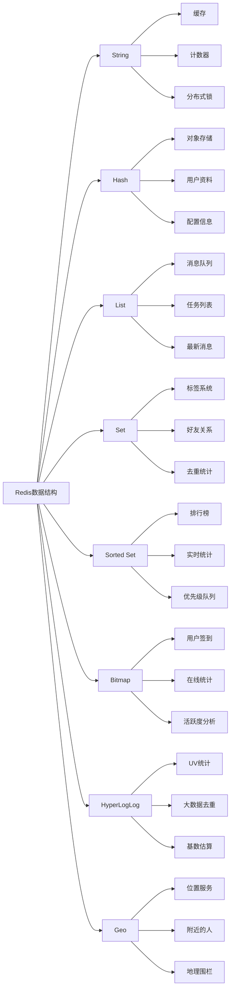

# Redis的数据结构有哪些？使用场景分别是什么？

## 概要回答

Redis提供了丰富的数据结构，包括字符串(String)、哈希(Hash)、列表(List)、集合(Set)、有序集合(Sorted Set)、位图(Bitmap)、HyperLogLog、地理空间(Geo)等。不同的数据结构适用于不同的使用场景：字符串适合缓存和计数器；哈希适合存储对象；列表适合消息队列；集合适合去重和交集运算；有序集合适合排行榜；位图适合用户行为分析；HyperLogLog适合基数统计；地理空间适合位置服务。

## 深度解析

### Redis核心数据结构详解

#### 1. 字符串(String)
```bash
# 字符串基本操作
# 设置和获取字符串
SET user:name "John Doe"
GET user:name

# 数值操作
SET counter 10
INCR counter          # 自增1
DECR counter          # 自减1
INCRBY counter 5      # 增加指定值
DECRBY counter 3      # 减少指定值

# 字符串操作
SET greeting "Hello"
APPEND greeting " World"  # 追加字符串
STRLEN greeting           # 获取字符串长度
GETRANGE greeting 0 4     # 获取子字符串

# 批量操作
MSET key1 "value1" key2 "value2" key3 "value3"
MGET key1 key2 key3

# 过期时间设置
SET session:12345 "user_data" EX 3600  # 1小时后过期
TTL session:12345  # 查看过期时间
```

```php
// PHP示例：使用字符串实现缓存和计数器
<?php
require_once 'vendor/autoload.php';

use Predis\Client;

class StringExamples {
    private $redisClient;
    
    public function __construct() {
        $this->redisClient = new Client([
            'scheme' => 'tcp',
            'host'   => '127.0.0.1',
            'port'   => 6379,
        ]);
    }
    
    // 缓存实现
    public function cacheUserProfile($userId, $profileData, $expireTime = 3600) {
        """缓存用户资料"""
        $cacheKey = "user:profile:$userId";
        $this->redisClient->setex($cacheKey, $expireTime, $profileData);
        echo "User profile cached for user $userId\n";
    }
    
    public function getCachedProfile($userId) {
        """获取缓存的用户资料"""
        $cacheKey = "user:profile:$userId";
        $cachedData = $this->redisClient->get($cacheKey);
        return $cachedData ? $cachedData : null;
    }
    
    // 计数器实现
    public function incrementPageView($pageUrl) {
        """页面浏览量计数"""
        $viewKey = "page:view:$pageUrl";
        return $this->redisClient->incr($viewKey);
    }
    
    public function getPageViews($pageUrl) {
        """获取页面浏览量"""
        $viewKey = "page:view:$pageUrl";
        $views = $this->redisClient->get($viewKey);
        return $views ? (int)$views : 0;
    }
    
    // 分布式锁实现
    public function acquireLock($lockKey, $lockValue, $expireTime = 30) {
        """获取分布式锁"""
        return $this->redisClient->set(
            $lockKey,
            $lockValue,
            'nx',  // 仅当key不存在时设置
            'ex',  // 设置过期时间
            $expireTime
        );
    }
    
    public function releaseLock($lockKey, $lockValue) {
        """释放分布式锁"""
        // 使用Lua脚本确保原子性
        $luaScript = <<<LUA
        if redis.call("GET", KEYS[1]) == ARGV[1] then
            return redis.call("DEL", KEYS[1])
        else
            return 0
        end
        LUA;
        
        return $this->redisClient->eval($luaScript, 1, [$lockKey], [$lockValue]);
    }
}

// 使用示例
$examples = new StringExamples();

// 缓存示例
$examples->cacheUserProfile("12345", '{"name":"John","email":"john@example.com"}');
$profile = $examples->getCachedProfile("12345");
echo "Cached profile: $profile\n";

// 计数器示例
$views = $examples->incrementPageView("/home");
echo "Page views: $views\n";

// 分布式锁示例
$lockAcquired = $examples->acquireLock("lock:resource1", "process_12345");
if ($lockAcquired) {
    echo "Lock acquired successfully\n";
    // 执行关键操作
    $examples->releaseLock("lock:resource1", "process_12345");
    echo "Lock released\n";
}
?>
```

#### 2. 哈希(Hash)
```bash
# 哈希基本操作
# 设置哈希字段
HSET user:1000 name "Alice"
HSET user:1000 email "alice@example.com"
HSET user:1000 age 25

# 批量设置
HMSET user:1001 name "Bob" email "bob@example.com" age 30

# 获取哈希字段
HGET user:1000 name
HMGET user:1000 name email age
HGETALL user:1000

# 哈希字段操作
HLEN user:1000              # 获取字段数量
HEXISTS user:1000 name      # 检查字段是否存在
HKEYS user:1000             # 获取所有字段名
HVALS user:1000             # 获取所有字段值

# 数值操作
HINCRBY user:1000 age 1     # 年龄增加1
HINCRBY user:1000 score 100 # 分数增加100
```

```php
// PHP示例：使用哈希存储用户对象
<?php
require_once 'vendor/autoload.php';

use Predis\Client;

class HashExamples {
    private $redisClient;
    
    public function __construct() {
        $this->redisClient = new Client([
            'scheme' => 'tcp',
            'host'   => '127.0.0.1',
            'port'   => 6379,
        ]);
    }
    
    // 存储用户对象
    public function saveUser($userId, $userData) {
        $key = "user:" . $userId;
        $this->redisClient->hmset($key, $userData);
        echo "User saved: " . $key . "\n";
    }
    
    // 获取用户对象
    public function getUser($userId) {
        $key = "user:" . $userId;
        return $this->redisClient->hgetall($key);
    }
    
    // 更新用户字段
    public function updateUserField($userId, $field, $value) {
        $key = "user:" . $userId;
        $this->redisClient->hset($key, $field, $value);
        echo "User field updated: " . $field . "\n";
    }
    
    // 增加用户积分
    public function addUserPoints($userId, $points) {
        $key = "user:" . $userId;
        return $this->redisClient->hincrby($key, "points", $points);
    }
    
    // 获取用户积分
    public function getUserPoints($userId) {
        $key = "user:" . $userId;
        $points = $this->redisClient->hget($key, "points");
        return $points !== null ? (int)$points : 0;
    }
    
    // 删除用户字段
    public function deleteUserFields($userId, ...$fields) {
        $key = "user:" . $userId;
        return $this->redisClient->hdel($key, $fields);
    }
}

// 使用示例
$examples = new HashExamples();

// 存储用户数据
$userData = [
    "name" => "Charlie",
    "email" => "charlie@example.com",
    "age" => "28",
    "points" => "1000"
];

$examples->saveUser(1002, $userData);

// 获取用户数据
$user = $examples->getUser(1002);
echo "Retrieved user: ";
print_r($user);

// 更新用户积分
$newPoints = $examples->addUserPoints(1002, 50);
echo "New points: " . $newPoints . "\n";

// 获取用户积分
$points = $examples->getUserPoints(1002);
echo "Current points: " . $points . "\n";
?>
```

#### 3. 列表(List)
```bash
# 列表基本操作
# 从左侧推入元素
LPUSH tasks "task1"
LPUSH tasks "task2"
LPUSH tasks "task3"

# 从右侧推入元素
RPUSH tasks "task4"
RPUSH tasks "task5"

# 获取列表元素
LRANGE tasks 0 -1    # 获取所有元素
LRANGE tasks 0 2     # 获取前3个元素
LINDEX tasks 0       # 获取第一个元素

# 列表长度
LLEN tasks

# 弹出元素
LPOP tasks           # 从左侧弹出
RPOP tasks           # 从右侧弹出

# 阻塞式弹出
BLPOP tasks 30       # 从左侧阻塞弹出，超时30秒
BRPOP tasks 30       # 从右侧阻塞弹出，超时30秒

# 列表修剪
LTRIM tasks 0 2      # 只保留前3个元素
```

```php
// PHP示例：使用列表实现消息队列
<?php
require_once 'vendor/autoload.php';

use Predis\Client;

class ListMessageQueue {
    private $redisClient;
    private $queueName;
    
    public function __construct($queueName = "messages") {
        $this->redisClient = new Client([
            'scheme' => 'tcp',
            'host'   => '127.0.0.1',
            'port'   => 6379,
        ]);
        $this->queueName = $queueName;
    }
    
    // 生产者：发送消息
    public function sendMessage($messageData) {
        """发送消息到队列"""
        $message = [
            'id' => "msg_" . round(microtime(true) * 1000),
            'data' => $messageData,
            'timestamp' => date('c')
        ];
        
        // 将消息推入列表右侧
        $this->redisClient->rpush($this->queueName, json_encode($message));
        echo "Message sent: " . $message['id'] . "\n";
        return $message['id'];
    }
    
    // 消费者：接收消息（非阻塞）
    public function receiveMessage() {
        """从队列接收消息（非阻塞）"""
        // 从列表左侧弹出消息
        $messageJson = $this->redisClient->lpop($this->queueName);
        if ($messageJson) {
            $message = json_decode($messageJson, true);
            echo "Message received: " . $message['id'] . "\n";
            return $message;
        }
        return null;
    }
    
    // 消费者：接收消息（阻塞）
    public function receiveMessageBlocking($timeout = 30) {
        """从队列接收消息（阻塞）"""
        // 阻塞式从列表左侧弹出消息
        $result = $this->redisClient->blpop([$this->queueName], $timeout);
        if ($result) {
            $messageJson = $result[1];
            $message = json_decode($messageJson, true);
            echo "Message received (blocking): " . $message['id'] . "\n";
            return $message;
        }
        return null;
    }
    
    // 批量接收消息
    public function receiveMessagesBatch($batchSize = 10) {
        """批量接收消息"""
        // 使用管道批量操作
        $pipe = $this->redisClient->pipeline();
        
        for ($i = 0; $i < $batchSize; $i++) {
            $pipe->lpop($this->queueName);
        }
        
        $results = $pipe->execute();
        $messages = [];
        
        foreach ($results as $result) {
            if ($result) {
                $message = json_decode($result, true);
                $messages[] = $message;
            }
        }
        
        echo "Received " . count($messages) . " messages in batch\n";
        return $messages;
    }
    
    // 获取队列长度
    public function getQueueLength() {
        """获取队列长度"""
        return $this->redisClient->llen($this->queueName);
    }
    
    // 查看队列头部消息（不移除）
    public function peekMessage() {
        """查看队列头部消息"""
        $messageJson = $this->redisClient->lindex($this->queueName, 0);
        if ($messageJson) {
            return json_decode($messageJson, true);
        }
        return null;
    }
}

// 使用示例
$mq = new ListMessageQueue("task_queue");

// 发送消息
$mq->sendMessage(["task" => "process_user_data", "user_id" => 12345]);
$mq->sendMessage(["task" => "send_notification", "user_id" => 12346]);
$mq->sendMessage(["task" => "update_statistics", "data" => ["visits" => 100]]);

// 接收消息
$message = $mq->receiveMessage();
if ($message) {
    echo "Processing: " . json_encode($message['data']) . "\n";
}

// 批量接收消息
$messages = $mq->receiveMessagesBatch(5);
foreach ($messages as $msg) {
    echo "Batch processing: " . json_encode($msg['data']) . "\n";
}

// 阻塞接收消息
// $message = $mq->receiveMessageBlocking(10);  // 等待10秒
?>
```

#### 4. 集合(Set)
```bash
# 集合基本操作
# 添加元素
SADD tags:article1 "technology" "programming" "redis"
SADD tags:article2 "technology" "database" "nosql"
SADD tags:article3 "programming" "python" "web"

# 查看集合元素
SMEMBERS tags:article1

# 集合操作
SISMEMBER tags:article1 "redis"    # 检查元素是否存在
SCARD tags:article1                # 获取集合大小
SREM tags:article1 "redis"         # 移除元素

# 集合间操作
SINTER tags:article1 tags:article2           # 交集
SUNION tags:article1 tags:article2           # 并集
SDIFF tags:article1 tags:article2            # 差集

# 随机操作
SRANDMEMBER tags:article1                    # 随机获取元素
SPOP tags:article1                           # 随机弹出元素
```

```javascript
// JavaScript示例：使用集合实现标签系统和好友关系
const redis = require('redis');
const client = redis.createClient();

class SetExamples {
    constructor() {
        this.client = client;
    }
    
    // 标签系统实现
    async addArticleTags(articleId, tags) {
        /** 添加文章标签 */
        const key = `article:${articleId}:tags`;
        const result = await this.client.sadd(key, tags);
        console.log(`Added ${result} new tags to article ${articleId}`);
        return result;
    }
    
    async getArticleTags(articleId) {
        /** 获取文章标签 */
        const key = `article:${articleId}:tags`;
        return await this.client.smembers(key);
    }
    
    async removeArticleTag(articleId, tag) {
        /** 移除文章标签 */
        const key = `article:${articleId}:tags`;
        const result = await this.client.srem(key, tag);
        console.log(`Removed tag ${tag} from article ${articleId}`);
        return result;
    }
    
    async findCommonTags(articleId1, articleId2) {
        /** 查找两篇文章的共同标签 */
        const key1 = `article:${articleId1}:tags`;
        const key2 = `article:${articleId2}:tags`;
        return await this.client.sinter(key1, key2);
    }
    
    async findAllTags(articleId1, articleId2) {
        /** 获取两篇文章的所有标签 */
        const key1 = `article:${articleId1}:tags`;
        const key2 = `article:${articleId2}:tags`;
        return await this.client.sunion(key1, key2);
    }
    
    // 好友关系实现
    async addUserFriend(userId, friendId) {
        /** 添加好友 */
        const key = `user:${userId}:friends`;
        const result = await this.client.sadd(key, friendId);
        console.log(`Added friend ${friendId} to user ${userId}`);
        return result;
    }
    
    async getUserFriends(userId) {
        /** 获取用户好友列表 */
        const key = `user:${userId}:friends`;
        return await this.client.smembers(key);
    }
    
    async areFriends(userId1, userId2) {
        /** 检查两人是否为好友 */
        const key = `user:${userId1}:friends`;
        const result = await this.client.sismember(key, userId2);
        return result === 1;
    }
    
    async getMutualFriends(userId1, userId2) {
        /** 获取共同好友 */
        const key1 = `user:${userId1}:friends`;
        const key2 = `user:${userId2}:friends`;
        return await this.client.sinter(key1, key2);
    }
    
    async isFollowing(userId, targetId) {
        /** 检查是否关注某用户 */
        const key = `user:${userId}:following`;
        const result = await this.client.sismember(key, targetId);
        return result === 1;
    }
    
    async followUser(userId, targetId) {
        /** 关注用户 */
        const key = `user:${userId}:following`;
        const result = await this.client.sadd(key, targetId);
        console.log(`User ${userId} followed ${targetId}`);
        return result;
    }
    
    async unfollowUser(userId, targetId) {
        /** 取消关注用户 */
        const key = `user:${userId}:following`;
        const result = await this.client.srem(key, targetId);
        console.log(`User ${userId} unfollowed ${targetId}`);
        return result;
    }
}

// 使用示例
async function runSetExamples() {
    const examples = new SetExamples();
    
    // 标签系统示例
    await examples.addArticleTags(1001, ['technology', 'programming', 'redis']);
    await examples.addArticleTags(1002, ['technology', 'database', 'nosql']);
    
    const tags1 = await examples.getArticleTags(1001);
    console.log('Article 1001 tags:', tags1);
    
    const commonTags = await examples.findCommonTags(1001, 1002);
    console.log('Common tags:', commonTags);
    
    // 好友关系示例
    await examples.addUserFriend(1001, 1002);
    await examples.addUserFriend(1001, 1003);
    await examples.addUserFriend(1002, 1003);
    
    const friends = await examples.getUserFriends(1001);
    console.log('User 1001 friends:', friends);
    
    const mutualFriends = await examples.getMutualFriends(1001, 1002);
    console.log('Mutual friends:', mutualFriends);
    
    // 关注系统示例
    await examples.followUser(1001, 2001);
    await examples.followUser(1001, 2002);
    
    const isFollowing = await examples.isFollowing(1001, 2001);
    console.log('Is following:', isFollowing);
}

// runSetExamples();
```

#### 5. 有序集合(Sorted Set)
```bash
# 有序集合基本操作
# 添加元素（带分数）
ZADD leaderboard 100 "player1"
ZADD leaderboard 85 "player2"
ZADD leaderboard 120 "player3"
ZADD leaderboard 95 "player4"

# 获取元素排名
ZRANK leaderboard "player1"      # 获取正向排名（分数低到高）
ZREVRANK leaderboard "player1"   # 获取反向排名（分数高到低）

# 获取元素分数
ZSCORE leaderboard "player1"

# 获取排名范围内的元素
ZRANGE leaderboard 0 2           # 获取前三名（分数低到高）
ZREVRANGE leaderboard 0 2        # 获取前三名（分数高到低）

# 带分数获取元素
ZRANGE leaderboard 0 2 WITHSCORES
ZREVRANGE leaderboard 0 2 WITHSCORES

# 按分数范围获取元素
ZRANGEBYSCORE leaderboard 90 110
ZREVRANGEBYSCORE leaderboard 110 90

# 元素操作
ZINCRBY leaderboard 10 "player2"  # 增加分数
ZREM leaderboard "player3"        # 移除元素

# 集合信息
ZCARD leaderboard                 # 获取元素数量
ZCOUNT leaderboard 90 110        # 统计分数范围内的元素数量
```

```go
// Go示例：使用有序集合实现排行榜和实时统计
package main

import (
    "fmt"
    "github.com/go-redis/redis/v8"
    "context"
    "time"
)

type SortedSetExamples struct {
    client *redis.Client
    ctx    context.Context
}

func NewSortedSetExamples() *SortedSetExamples {
    client := redis.NewClient(&redis.Options{
        Addr: "localhost:6379",
        DB:   0,
    })
    
    return &SortedSetExamples{
        client: client,
        ctx:    context.Background(),
    }
}

// 游戏排行榜实现
func (s *SortedSetExamples) UpdatePlayerScore(playerId string, score float64) error {
    /** 更新玩家分数 */
    key := "game:leaderboard"
    err := s.client.ZAdd(s.ctx, key, &redis.Z{
        Score:  score,
        Member: playerId,
    }).Err()
    
    if err == nil {
        fmt.Printf("Updated player %s score to %.2f\n", playerId, score)
    }
    return err
}

func (s *SortedSetExamples) GetTopPlayers(count int) ([]redis.Z, error) {
    /** 获取排行榜前N名 */
    key := "game:leaderboard"
    return s.client.ZRevRangeWithScores(s.ctx, key, 0, int64(count-1)).Result()
}

func (s *SortedSetExamples) GetPlayerRank(playerId string) (int64, error) {
    /** 获取玩家排名 */
    key := "game:leaderboard"
    return s.client.ZRevRank(s.ctx, key, playerId).Result()
}

func (s *SortedSetExamples) GetPlayersInRange(minScore, maxScore float64) ([]string, error) {
    /** 获取指定分数范围内的玩家 */
    key := "game:leaderboard"
    return s.client.ZRangeByScore(s.ctx, key, &redis.ZRangeBy{
        Min: fmt.Sprintf("%f", minScore),
        Max: fmt.Sprintf("%f", maxScore),
    }).Result()
}

// 实时统计实现
func (s *SortedSetExamples) RecordUserActivity(userId string) error {
    /** 记录用户活动（使用时间戳作为分数） */
    key := "user:activity"
    timestamp := float64(time.Now().Unix())
    
    err := s.client.ZAdd(s.ctx, key, &redis.Z{
        Score:  timestamp,
        Member: userId,
    }).Err()
    
    if err == nil {
        fmt.Printf("Recorded activity for user %s at %d\n", userId, int64(timestamp))
    }
    return err
}

func (s *SortedSetExamples) GetActiveUsersInTimeRange(startTime, endTime time.Time) ([]string, error) {
    /** 获取时间段内的活跃用户 */
    key := "user:activity"
    return s.client.ZRangeByScore(s.ctx, key, &redis.ZRangeBy{
        Min: fmt.Sprintf("%d", startTime.Unix()),
        Max: fmt.Sprintf("%d", endTime.Unix()),
    }).Result()
}

func (s *SortedSetExamples) GetUserLastActivity(userId string) (int64, error) {
    /** 获取用户最后活动时间 */
    key := "user:activity"
    score, err := s.client.ZScore(s.ctx, key, userId).Result()
    return int64(score), err
}

func (s *SortedSetExamples) CleanOldActivities(olderThan time.Time) (int64, error) {
    /** 清理旧的活动记录 */
    key := "user:activity"
    return s.client.ZRemRangeByScore(s.ctx, key, "0", fmt.Sprintf("%d", olderThan.Unix())).Result()
}

// 商品销售排行榜
func (s *SortedSetExamples) UpdateProductSales(productId string, sales int) error {
    /** 更新商品销量 */
    key := "product:sales:leaderboard"
    err := s.client.ZIncrBy(s.ctx, key, float64(sales), productId).Err()
    
    if err == nil {
        fmt.Printf("Updated product %s sales by %d\n", productId, sales)
    }
    return err
}

func (s *SortedSetExamples) GetTopSellingProducts(count int) ([]redis.Z, error) {
    /** 获取畅销商品排行榜 */
    key := "product:sales:leaderboard"
    return s.client.ZRevRangeWithScores(s.ctx, key, 0, int64(count-1)).Result()
}

func (s *SortedSetExamples) GetProductSales(productId string) (float64, error) {
    /** 获取商品销量 */
    key := "product:sales:leaderboard"
    return s.client.ZScore(s.ctx, key, productId).Result()
}

// 使用示例
func main() {
    examples := NewSortedSetExamples()
    
    // 游戏排行榜示例
    examples.UpdatePlayerScore("player_001", 1500)
    examples.UpdatePlayerScore("player_002", 1200)
    examples.UpdatePlayerScore("player_003", 1800)
    examples.UpdatePlayerScore("player_004", 900)
    
    topPlayers, _ := examples.GetTopPlayers(3)
    fmt.Println("Top 3 players:")
    for i, player := range topPlayers {
        fmt.Printf("%d. %s: %.0f points\n", i+1, player.Member, player.Score)
    }
    
    rank, _ := examples.GetPlayerRank("player_001")
    fmt.Printf("Player 001 rank: #%d\n", rank+1)
    
    // 商品销售排行榜示例
    examples.UpdateProductSales("product_A", 50)
    examples.UpdateProductSales("product_B", 30)
    examples.UpdateProductSales("product_C", 75)
    examples.UpdateProductSales("product_A", 25) // 再次购买
    
    topProducts, _ := examples.GetTopSellingProducts(3)
    fmt.Println("\nTop selling products:")
    for i, product := range topProducts {
        fmt.Printf("%d. %s: %d sales\n", i+1, product.Member, int64(product.Score))
    }
}
```

### 高级数据结构

#### 6. 位图(Bitmap)
```bash
# 位图基本操作
# 设置位值
SETBIT user:1001:login 0 1    # 第1天登录
SETBIT user:1001:login 1 0    # 第2天未登录
SETBIT user:1001:login 2 1    # 第3天登录

# 获取位值
GETBIT user:1001:login 0

# 位操作统计
BITCOUNT user:1001:login       # 统计登录天数
BITPOS user:1001:login 0       # 查找第一个未登录的天数

# 位操作
BITOP AND dest_key key1 key2   # 位与操作
BITOP OR dest_key key1 key2    # 位或操作
BITOP XOR dest_key key1 key2   # 位异或操作
BITOP NOT dest_key key1        # 位非操作
```

```php
// PHP示例：使用位图实现用户签到和活跃度分析
<?php
require_once 'vendor/autoload.php';

use Predis\Client;
use DateTime;
use DateInterval;

class BitmapExamples {
    private $redisClient;
    
    public function __construct() {
        $this->redisClient = new Client([
            'scheme' => 'tcp',
            'host'   => '127.0.0.1',
            'port'   => 6379,
        ]);
    }
    
    public function getDayOffset($date = null) {
        """获取相对于基准日期的偏移量（以天为单位）"""
        if ($date === null) {
            $date = new DateTime();
        }
        
        // 基准日期：2023年1月1日
        $baseDate = new DateTime('2023-01-01');
        $interval = $baseDate->diff($date);
        return $interval->days;
    }
    
    public function userSignIn($userId, $date = null) {
        """用户签到"""
        if ($date === null) {
            $date = new DateTime();
        }
        
        $key = "user:{$userId}:signin";
        $offset = $this->getDayOffset($date);
        
        // 设置对应位为1（表示已签到）
        $result = $this->redisClient->setbit($key, $offset, 1);
        echo "User {$userId} signed in on " . $date->format('Y-m-d') . "\n";
        return $result;
    }
    
    public function checkUserSignIn($userId, $date = null) {
        """检查用户是否在指定日期签到"""
        if ($date === null) {
            $date = new DateTime();
        }
        
        $key = "user:{$userId}:signin";
        $offset = $this->getDayOffset($date);
        
        // 获取对应位的值
        return $this->redisClient->getbit($key, $offset);
    }
    
    public function getSignInCount($userId, $startDate = null, $endDate = null) {
        """获取用户签到次数"""
        $key = "user:{$userId}:signin";
        
        if ($startDate && $endDate) {
            $startOffset = $this->getDayOffset($startDate);
            $endOffset = $this->getDayOffset($endDate);
            // 使用bitcount统计指定范围内的1的个数
            return $this->redisClient->bitcount($key, $startOffset >> 3, $endOffset >> 3);
        } else {
            // 统计所有签到次数
            return $this->redisClient->bitcount($key);
        }
    }
    
    public function getContinuousSignIn($userId, $date = null) {
        """获取用户连续签到天数"""
        if ($date === null) {
            $date = new DateTime();
        }
        
        $key = "user:{$userId}:signin";
        $currentOffset = $this->getDayOffset($date);
        
        $continuousDays = 0;
        $offset = $currentOffset;
        
        // 从当前日期向前检查连续签到
        while ($offset >= 0) {
            $bitValue = $this->redisClient->getbit($key, $offset);
            if ($bitValue == 1) {
                $continuousDays++;
                $offset--;
            } else {
                break;
            }
        }
        
        return $continuousDays;
    }
    
    public function getMonthlySignIn($userId, $year, $month) {
        """获取用户月度签到情况"""
        // 获取月份的第一天和最后一天
        $firstDay = new DateTime("{$year}-{$month}-01");
        $lastDay = clone $firstDay;
        $lastDay->modify('last day of this month');
        
        $key = "user:{$userId}:signin";
        $startOffset = $this->getDayOffset($firstDay);
        $endOffset = $this->getDayOffset($lastDay);
        
        // 获取整个月的签到数据
        $signInDays = [];
        for ($offset = $startOffset; $offset <= $endOffset; $offset++) {
            if ($this->redisClient->getbit($key, $offset) == 1) {
                // 计算实际日期
                $baseDate = new DateTime('2023-01-01');
                $actualDate = clone $baseDate;
                $actualDate->modify("+{$offset} days");
                $signInDays[] = $actualDate;
            }
        }
        
        return $signInDays;
    }
    
    // 用户在线状态统计
    public function setUserOnline($userId, $timestamp = null) {
        """标记用户在线状态"""
        if ($timestamp === null) {
            $timestamp = time();
        }
        
        $key = "user:{$userId}:online";
        // 使用小时作为偏移量
        $offset = $timestamp / 3600;
        
        $this->redisClient->setbit($key, $offset, 1);
        echo "User {$userId} marked online at " . date('Y-m-d H:i:s', $timestamp) . "\n";
    }
    
    public function getUserActiveHours($userId, $startTime = null, $endTime = null) {
        """获取用户活跃小时数"""
        $key = "user:{$userId}:online";
        
        if ($startTime && $endTime) {
            $startOffset = $startTime / 3600;
            $endOffset = $endTime / 3600;
            return $this->redisClient->bitcount($key, $startOffset >> 3, $endOffset >> 3);
        } else {
            return $this->redisClient->bitcount($key);
        }
    }
}

// 使用示例
$bitmapExamples = new BitmapExamples();

// 用户签到示例
$today = new DateTime();
$yesterday = clone $today;
$yesterday->sub(new DateInterval('P1D'));
$dayBeforeYesterday = clone $today;
$dayBeforeYesterday->sub(new DateInterval('P2D'));

// 连续签到
$bitmapExamples->userSignIn("user_123", $dayBeforeYesterday);
$bitmapExamples->userSignIn("user_123", $yesterday);
$bitmapExamples->userSignIn("user_123", $today);

// 检查签到状态
$isSignedIn = $bitmapExamples->checkUserSignIn("user_123", $today);
echo "User signed in today: " . ($isSignedIn ? 'true' : 'false') . "\n";

// 获取签到次数
$signInCount = $bitmapExamples->getSignInCount("user_123");
echo "Total sign in count: {$signInCount}\n";

// 获取连续签到天数
$continuousDays = $bitmapExamples->getContinuousSignIn("user_123");
echo "Continuous sign in days: {$continuousDays}\n";

// 月度签到情况
$monthlySignIns = $bitmapExamples->getMonthlySignIn("user_123", 2023, 12);
echo "December sign in days: " . count($monthlySignIns) . "\n";
?>
```

#### 7. HyperLogLog
```bash
# HyperLogLog基本操作
# 添加元素
PFADD unique_visitors "user_001"
PFADD unique_visitors "user_002"
PFADD unique_visitors "user_003"
PFADD unique_visitors "user_001"  # 重复元素不会影响计数

# 获取基数估算值
PFCOUNT unique_visitors

# 合并多个HyperLogLog
PFADD unique_visitors_today "user_001" "user_002" "user_004"
PFADD unique_visitors_yesterday "user_002" "user_003" "user_005"

PFMERGE unique_visitors_combined unique_visitors_today unique_visitors_yesterday
PFCOUNT unique_visitors_combined
```

```php
// PHP示例：使用HyperLogLog实现大数据量去重统计
<?php
require_once 'vendor/autoload.php';

use Predis\Client;

class HyperLogLogExamples {
    private $redisClient;
    
    public function __construct() {
        $this->redisClient = new Client([
            'scheme' => 'tcp',
            'host'   => '127.0.0.1',
            'port'   => 6379,
        ]);
    }
    
    // 网站UV统计
    public function addPageVisitor($pageUrl, $userId) {
        /** 添加页面访客 */
        $key = "page_uv:" . $pageUrl;
        $result = $this->redisClient->pfadd($key, $userId);
        echo "Added visitor " . $userId . " to page " . $pageUrl . "\n";
        return $result;
    }
    
    public function getPageUniqueVisitors($pageUrl) {
        /** 获取页面唯一访客数 */
        $key = "page_uv:" . $pageUrl;
        return $this->redisClient->pfcount($key);
    }
    
    public function mergePageVisitors($targetKey, ...$sourceKeys) {
        /** 合并多个页面的访客数据 */
        return $this->redisClient->pfmerge($targetKey, $sourceKeys);
    }
    
    public function getCombinedUniqueVisitors(...$pageUrls) {
        /** 获取多个页面的总唯一访客数 */
        // 先合并数据
        $keys = [];
        foreach ($pageUrls as $pageUrl) {
            $keys[] = "page_uv:" . $pageUrl;
        }
        
        $mergedKey = "merged_uv:" . time();
        $this->redisClient->pfmerge($mergedKey, $keys);
        
        $count = $this->redisClient->pfcount($mergedKey);
        
        // 清理临时key
        $this->redisClient->del($mergedKey);
        
        return $count;
    }
    
    // 用户行为分析
    public function addUserAction($actionType, $userId) {
        /** 记录用户行为 */
        $key = "user_action:" . $actionType;
        return $this->redisClient->pfadd($key, $userId);
    }
    
    public function getUniqueActionUsers($actionType) {
        /** 获取执行特定行为的唯一用户数 */
        $key = "user_action:" . $actionType;
        return $this->redisClient->pfcount($key);
    }
    
    // 实时数据分析
    public function addRealTimeEvent($eventType, $eventId) {
        /** 添加实时事件 */
        $key = "realtime:" . $eventType . ":" . 
                    (time() / 3600); // 按小时分组
        return $this->redisClient->pfadd($key, $eventId);
    }
    
    public function getHourlyUniqueEvents($eventType, $hourTimestamp) {
        /** 获取小时级别的唯一事件数 */
        $key = "realtime:" . $eventType . ":" . $hourTimestamp;
        return $this->redisClient->pfcount($key);
    }
    
    // 应用场景示例
    public function demonstrateUseCases() {
        echo "=== HyperLogLog Use Cases Demo ===\n";
        
        // 1. 网站UV统计
        echo "\n1. Website UV Statistics:\n";
        $this->addPageVisitor("/home", "user_001");
        $this->addPageVisitor("/home", "user_002");
        $this->addPageVisitor("/home", "user_001"); // 重复访问
        $this->addPageVisitor("/about", "user_002");
        $this->addPageVisitor("/about", "user_003");
        
        $homeUV = $this->getPageUniqueVisitors("/home");
        $aboutUV = $this->getPageUniqueVisitors("/about");
        echo "Home page UV: " . $homeUV . "\n";
        echo "About page UV: " . $aboutUV . "\n";
        
        // 合并多个页面的UV
        $totalUV = $this->getCombinedUniqueVisitors("/home", "/about");
        echo "Total unique visitors: " . $totalUV . "\n";
        
        // 2. 用户行为分析
        echo "\n2. User Behavior Analysis:\n";
        $this->addUserAction("login", "user_001");
        $this->addUserAction("login", "user_002");
        $this->addUserAction("purchase", "user_001");
        $this->addUserAction("purchase", "user_003");
        $this->addUserAction("share", "user_002");
        $this->addUserAction("share", "user_001");
        
        $loginUsers = $this->getUniqueActionUsers("login");
        $purchaseUsers = $this->getUniqueActionUsers("purchase");
        $shareUsers = $this->getUniqueActionUsers("share");
        
        echo "Users who logged in: " . $loginUsers . "\n";
        echo "Users who made purchases: " . $purchaseUsers . "\n";
        echo "Users who shared content: " . $shareUsers . "\n";
        
        // 3. 实时事件统计
        echo "\n3. Real-time Event Statistics:\n";
        $currentHour = time() / 3600;
        $this->addRealTimeEvent("click", "event_001");
        $this->addRealTimeEvent("click", "event_002");
        $this->addRealTimeEvent("click", "event_001"); // 重复事件
        
        $hourlyClicks = $this->getHourlyUniqueEvents("click", $currentHour);
        echo "Unique clicks this hour: " . $hourlyClicks . "\n";
    }
}

// 使用示例
$examples = new HyperLogLogExamples();
$examples->demonstrateUseCases();
?>
```
```

#### 8. 地理空间(Geo)
```bash
# 地理空间基本操作
# 添加地理位置
GEOADD locations 116.404 39.915 "Beijing"
GEOADD locations 121.4737 31.2304 "Shanghai"
GEOADD locations 120.1551 30.2741 "Hangzhou"
GEOADD locations 113.2644 23.1291 "Guangzhou"

# 获取地理位置
GEOPOS locations Beijing Shanghai

# 计算距离
GEODIST locations Beijing Shanghai km

# 范围查询
GEORADIUS locations 116.404 39.915 500 km
GEORADIUSBYMEMBER locations Beijing 500 km

# 获取范围内的元素及其距离
GEORADIUS locations 116.404 39.915 500 km WITHDIST
```

```javascript
// JavaScript示例：使用Geo实现位置服务和附近的人功能
const redis = require('redis');
const client = redis.createClient();

class GeoExamples {
    constructor() {
        this.client = client;
    }
    
    // 商店位置管理
    async addStore(storeId, longitude, latitude, name) {
        /** 添加商店位置 */
        const key = 'stores:locations';
        const result = await this.client.geoadd(key, longitude, latitude, storeId);
        
        // 同时存储商店详细信息
        const storeInfo = { id: storeId, name, longitude, latitude };
        await this.client.hset(`store:${storeId}`, storeInfo);
        
        console.log(`Added store ${name} at (${longitude}, ${latitude})`);
        return result;
    }
    
    async getStoreLocation(storeId) {
        /** 获取商店位置 */
        const key = 'stores:locations';
        const positions = await this.client.geopos(key, storeId);
        return positions[0]; // 返回 [longitude, latitude]
    }
    
    async getStoresNearby(longitude, latitude, radius, unit = 'km') {
        /** 获取附近的商店 */
        const key = 'stores:locations';
        const nearbyStores = await this.client.georadius(
            key, 
            longitude, 
            latitude, 
            radius, 
            unit,
            'WITHDIST',
            'WITHHASH',
            'WITHCOORD'
        );
        
        // 获取商店详细信息
        const storeDetails = [];
        for (const [storeId, distance, hash, coordinates] of nearbyStores) {
            const info = await this.client.hgetall(`store:${storeId}`);
            storeDetails.push({
                id: storeId,
                name: info.name,
                distance: parseFloat(distance),
                longitude: parseFloat(coordinates[0]),
                latitude: parseFloat(coordinates[1])
            });
        }
        
        // 按距离排序
        storeDetails.sort((a, b) => a.distance - b.distance);
        return storeDetails;
    }
    
    async getDistanceBetweenStores(storeId1, storeId2) {
        /** 计算两个商店之间的距离 */
        const key = 'stores:locations';
        const distance = await this.client.geodist(key, storeId1, storeId2, 'km');
        return parseFloat(distance);
    }
    
    // 用户位置服务
    async updateUserLocation(userId, longitude, latitude) {
        /** 更新用户位置 */
        const key = 'users:locations';
        const result = await this.client.geoadd(key, longitude, latitude, userId);
        
        // 记录更新时间
        const timestamp = Date.now();
        await this.client.hset(`user:${userId}:location`, {
            longitude,
            latitude,
            updated_at: timestamp
        });
        
        console.log(`Updated user ${userId} location to (${longitude}, ${latitude})`);
        return result;
    }
    
    async getUserLocation(userId) {
        /** 获取用户位置 */
        const key = 'users:locations';
        const positions = await this.client.geopos(key, userId);
        if (positions[0]) {
            const info = await this.client.hgetall(`user:${userId}:location`);
            return {
                longitude: parseFloat(positions[0][0]),
                latitude: parseFloat(positions[0][1]),
                updated_at: parseInt(info.updated_at)
            };
        }
        return null;
    }
    
    async findNearbyUsers(userId, radius, unit = 'km') {
        /** 查找附近的用户 */
        const key = 'users:locations';
        
        // 先获取用户当前位置
        const userPosition = await this.getUserLocation(userId);
        if (!userPosition) {
            throw new Error('User location not found');
        }
        
        // 查找附近的用户
        const nearbyUsers = await this.client.georadius(
            key,
            userPosition.longitude,
            userPosition.latitude,
            radius,
            unit,
            'WITHDIST'
        );
        
        // 过滤掉自己
        const otherUsers = nearbyUsers.filter(([nearbyUserId]) => nearbyUserId !== userId);
        
        // 获取用户详细信息
        const userDetails = [];
        for (const [nearbyUserId, distance] of otherUsers) {
            const info = await this.client.hgetall(`user:${nearbyUserId}:location`);
            userDetails.push({
                id: nearbyUserId,
                distance: parseFloat(distance),
                longitude: parseFloat(info.longitude),
                latitude: parseFloat(info.latitude),
                updated_at: parseInt(info.updated_at)
            });
        }
        
        return userDetails;
    }
    
    // 区域分析
    async getStoresInCity(cityCenter, radius) {
        /** 获取城市范围内的商店 */
        const key = 'stores:locations';
        const stores = await this.client.georadius(
            key,
            cityCenter.longitude,
            cityCenter.latitude,
            radius,
            'km',
            'WITHDIST',
            'WITHCOORD'
        );
        
        return stores.map(([storeId, distance, coordinates]) => ({
            id: storeId,
            distance: parseFloat(distance),
            longitude: parseFloat(coordinates[0]),
            latitude: parseFloat(coordinates[1])
        }));
    }
    
    async calculateDeliveryArea(storeId, deliveryRadius) {
        /** 计算配送区域 */
        const storeLocation = await this.getStoreLocation(storeId);
        if (!storeLocation) {
            throw new Error('Store location not found');
        }
        
        // 获取配送范围内的用户
        const key = 'users:locations';
        const customers = await this.client.georadius(
            key,
            storeLocation[0], // longitude
            storeLocation[1], // latitude
            deliveryRadius,
            'km',
            'WITHDIST'
        );
        
        return customers.map(([userId, distance]) => ({
            user_id: userId,
            distance: parseFloat(distance)
        }));
    }
}

// 使用示例
async function runGeoExamples() {
    const geo = new GeoExamples();
    
    // 添加商店
    await geo.addStore('store_001', 116.404, 39.915, '北京王府井店');
    await geo.addStore('store_002', 116.407, 39.918, '北京西单店');
    await geo.addStore('store_003', 121.4737, 31.2304, '上海南京路店');
    
    // 查找附近的商店
    const nearbyStores = await geo.getStoresNearby(116.404, 39.915, 5, 'km');
    console.log('Nearby stores:');
    nearbyStores.forEach(store => {
        console.log(`${store.name}: ${store.distance.toFixed(2)} km away`);
    });
    
    // 计算商店间距离
    const distance = await geo.getDistanceBetweenStores('store_001', 'store_002');
    console.log(`\nDistance between stores: ${distance.toFixed(2)} km`);
    
    // 用户位置服务
    await geo.updateUserLocation('user_123', 116.405, 39.916);
    await geo.updateUserLocation('user_124', 116.406, 39.917);
    
    const userLocation = await geo.getUserLocation('user_123');
    console.log(`\nUser location: ${userLocation.longitude}, ${userLocation.latitude}`);
    
    // 查找附近的用户
    const nearbyUsers = await geo.findNearbyUsers('user_123', 2, 'km');
    console.log('\nNearby users:');
    nearbyUsers.forEach(user => {
        console.log(`User ${user.id}: ${user.distance.toFixed(2)} km away`);
    });
}

// runGeoExamples();
```

## 图示说明



通过合理选择和使用Redis的不同数据结构，可以高效地解决各种业务场景中的数据存储和处理需求。每种数据结构都有其特定的优势和适用场景，理解它们的特性和使用方法对于构建高性能的Redis应用至关重要。