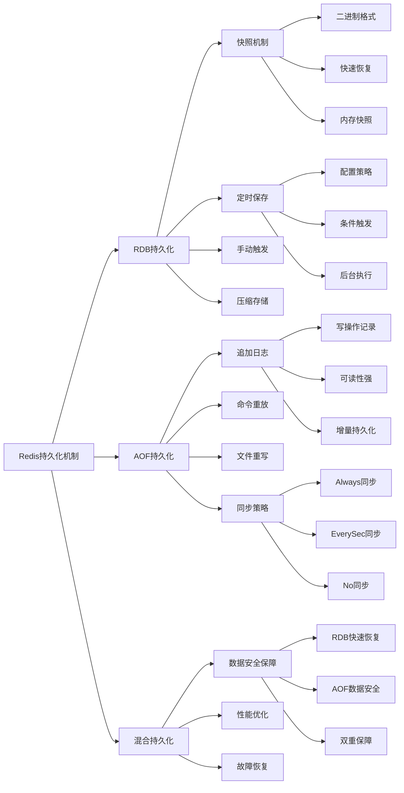

# Redis的持久化机制有哪些？各有什么优缺点？

## 概要回答

Redis提供了两种主要的持久化机制：RDB（Redis Database Backup）快照和AOF（Append Only File）日志。RDB通过定期创建数据快照来持久化数据，具有文件紧凑、恢复速度快的优点，但可能丢失最后一次快照后的数据。AOF通过记录每个写操作来持久化数据，具有数据安全性高、易于理解和恢复的优点，但文件体积大、恢复速度相对较慢。在实际应用中，可以根据业务需求选择合适的持久化策略，或者同时启用两种机制以获得更好的数据安全保障。

## 深度解析

### RDB持久化机制详解

#### RDB工作原理
```bash
# RDB配置参数
# redis.conf中的关键配置
save 900 1          # 900秒内至少有1个键被修改则触发快照
save 300 10         # 300秒内至少有10个键被修改则触发快照
save 60 10000       # 60秒内至少有10000个键被修改则触发快照

# 手动触发RDB快照
SAVE               # 同步保存，会阻塞Redis服务器
BGSAVE             # 异步保存，后台进行，不阻塞服务器

# 查看最近一次快照状态
LASTSAVE           # 返回上次成功保存的时间戳

# RDB文件相关信息
CONFIG GET dir     # 查看RDB文件存储目录
CONFIG GET dbfilename  # 查看RDB文件名
```

```php
// PHP示例：RDB持久化管理和监控
<?php
require_once 'vendor/autoload.php';

use Predis\Client;
use DateTime;

class RDBManager {
    private $redisClient;
    private $lastSaveTime;
    
    public function __construct($host = '127.0.0.1', $port = 6379) {
        $this->redisClient = new Client([
            'scheme' => 'tcp',
            'host'   => $host,
            'port'   => $port,
        ]);
        $this->lastSaveTime = 0;
    }
    
    public function triggerSave($background = true) {
        """触发RDB快照"""
        try {
            if ($background) {
                // 后台异步保存
                $result = $this->redisClient->bgsave();
                echo "Background RDB save triggered\n";
                return $result;
            } else {
                // 同步保存（会阻塞服务器）
                $result = $this->redisClient->save();
                echo "Synchronous RDB save completed\n";
                return $result;
            }
        } catch (Exception $e) {
            echo "Save failed: " . $e->getMessage() . "\n";
            return false;
        }
    }
    
    public function getLastSaveTime() {
        """获取最近一次保存时间"""
        try {
            $lastSave = $this->redisClient->lastsave();
            $this->lastSaveTime = $lastSave;
            return new DateTime("@{$lastSave}");
        } catch (Exception $e) {
            echo "Failed to get last save time: " . $e->getMessage() . "\n";
            return null;
        }
    }
    
    public function getRdbInfo() {
        """获取RDB相关信息"""
        try {
            // 获取Redis配置信息
            $configDir = $this->redisClient->config('GET', 'dir');
            $configFilename = $this->redisClient->config('GET', 'dbfilename');
            
            // 构造RDB文件路径
            $rdbPath = $configDir[1] . DIRECTORY_SEPARATOR . $configFilename[1];
            
            // 检查文件是否存在及大小
            $fileExists = file_exists($rdbPath);
            $fileSize = $fileExists ? filesize($rdbPath) : 0;
            
            return [
                'directory' => $configDir[1],
                'filename' => $configFilename[1],
                'full_path' => $rdbPath,
                'exists' => $fileExists,
                'size_bytes' => $fileSize,
                'size_mb' => $fileSize > 0 ? round($fileSize / (1024 * 1024), 2) : 0
            ];
        } catch (Exception $e) {
            echo "Failed to get RDB info: " . $e->getMessage() . "\n";
            return null;
        }
    }
    
    public function monitorSaveProgress($timeout = 30) {
        """监控后台保存进度"""
        $startTime = time();
        $initialSaveTime = $this->getLastSaveTime();
        
        echo "Monitoring RDB save progress...\n";
        while (time() - $startTime < $timeout) {
            $currentSaveTime = $this->getLastSaveTime();
            if ($currentSaveTime != $initialSaveTime) {
                echo "RDB save completed!\n";
                return true;
            }
            
            // 检查是否有正在进行的保存操作
            $info = $this->redisClient->info('persistence');
            if (isset($info['rdb_bgsave_in_progress']) && $info['rdb_bgsave_in_progress'] == 1) {
                $progress = isset($info['rdb_current_bgsave_time_sec']) ? $info['rdb_current_bgsave_time_sec'] : 0;
                echo "Save in progress... ({$progress}s elapsed)\n";
            }
            
            sleep(1);
        }
        
        echo "Save monitoring timeout\n";
        return false;
    }
    
    public function configureSavePolicy($policies) {
        """配置保存策略"""
        try {
            // 清除现有策略
            $this->redisClient->config('SET', 'save', '');
            
            // 设置新策略
            $policyStr = '';
            foreach ($policies as $policy) {
                $policyStr .= $policy[0] . ' ' . $policy[1] . ' ';
            }
            $policyStr = rtrim($policyStr);
            
            if ($policyStr) {
                $this->redisClient->config('SET', 'save', $policyStr);
            }
            
            echo "Save policy configured: {$policyStr}\n";
            return true;
        } catch (Exception $e) {
            echo "Failed to configure save policy: " . $e->getMessage() . "\n";
            return false;
        }
    }
}

// 使用示例
$rdbManager = new RDBManager();

// 获取RDB信息
$info = $rdbManager->getRdbInfo();
if ($info) {
    echo "RDB Directory: {$info['directory']}\n";
    echo "RDB Filename: {$info['filename']}\n";
    echo "File Size: {$info['size_mb']} MB\n";
}

// 触发后台保存
$rdbManager->triggerSave(true);

// 监控保存进度
// $rdbManager->monitorSaveProgress();

// 配置保存策略
// $policies = [[900, 1], [300, 10], [60, 10000]];
// $rdbManager->configureSavePolicy($policies);
?>
```

#### RDB优缺点分析

**优点：**
1. **文件紧凑**：RDB文件是压缩的二进制文件，占用空间小
2. **恢复速度快**：直接加载二进制数据，恢复效率高
3. **性能影响小**：后台异步保存，对主进程影响较小
4. **便于备份**：单个文件便于传输和存储

**缺点：**
1. **数据丢失风险**：两次快照之间发生故障会丢失数据
2. **fork开销大**：创建子进程需要复制内存，大数据量时耗时较长
3. **配置复杂**：需要根据业务特点调整保存策略

```php
// PHP示例：RDB性能测试和优化
<?php
require_once 'vendor/autoload.php';

use Predis\Client;
use React\Promise;

class RDBPerformanceTest {
    private $redisClient;
    
    public function __construct() {
        $this->redisClient = new Client([
            'scheme' => 'tcp',
            'host'   => '127.0.0.1',
            'port'   => 6379,
        ]);
    }
    
    // 模拟大量数据写入
    public function populateTestData($recordCount) {
        echo "Populating test data...\n";
        $startTime = microtime(true);
        
        for ($i = 0; $i < $recordCount; $i++) {
            $key = "test:user:" . $i;
            $value = "user_data_" . $i . "_with_some_additional_information";
            $this->redisClient->set($key, $value);
            
            // 每10000条记录报告一次进度
            if ($i % 10000 == 0 && $i > 0) {
                $elapsed = (microtime(true) - $startTime) * 1000;
                printf("Inserted %d records in %d ms\n", $i, $elapsed);
            }
        }
        
        $totalTime = (microtime(true) - $startTime) * 1000;
        printf("Completed inserting %d records in %d ms\n", $recordCount, $totalTime);
    }
    
    // 测试RDB保存性能
    public function testRDBSavePerformance() {
        echo "Testing RDB save performance...\n";
        
        // 记录开始时间
        $startTime = microtime(true);
        
        try {
            // 触发后台RDB保存
            $result = $this->redisClient->bgsave();
            echo "BGSAVE command result: " . $result . "\n";
            
            // 监控保存过程
            $this->monitorSaveProgress();
            
        } catch (Exception $e) {
            echo "RDB save failed: " . $e->getMessage() . "\n";
        }
        
        $totalTime = (microtime(true) - $startTime) * 1000;
        printf("RDB save completed in %d ms\n", $totalTime);
    }
    
    // 监控保存进度
    private function monitorSaveProgress() {
        echo "Monitoring save progress...\n";
        
        $saveInProgress = true;
        $attempts = 0;
        $maxAttempts = 60; // 最多等待60秒
        
        while ($saveInProgress && $attempts < $maxAttempts) {
            try {
                // 获取持久化信息
                $persistenceInfo = $this->redisClient->info("persistence");
                
                // 检查是否有保存正在进行
                if (isset($persistenceInfo['rdb_bgsave_in_progress']) && $persistenceInfo['rdb_bgsave_in_progress'] == 1) {
                    echo "RDB save still in progress...\n";
                    sleep(1); // 等待1秒
                } else {
                    $saveInProgress = false;
                    echo "RDB save completed!\n";
                }
                
                $attempts++;
            } catch (Exception $e) {
                break;
            }
        }
    }
    
    // 测试RDB恢复性能
    public function testRDBRestorePerformance() {
        echo "Testing RDB restore performance...\n";
        
        $startTime = microtime(true);
        
        try {
            // 重新启动Redis服务来测试恢复性能
            // 注意：这需要在外部执行，这里只是模拟
            echo "Simulating Redis restart for RDB restore...\n";
            
            // 等待Redis重新启动
            sleep(2);
            
            // 重新连接并验证数据
            // 在PHP中，连接是自动管理的
            
            // 检查部分数据是否存在
            $testKey = "test:user:0";
            $value = $this->redisClient->get($testKey);
            
            if ($value !== null) {
                echo "Data restored successfully\n";
            } else {
                echo "Data restoration failed\n";
            }
            
        } catch (Exception $e) {
            echo "Restore test failed: " . $e->getMessage() . "\n";
        }
        
        $totalTime = (microtime(true) - $startTime) * 1000;
        printf("RDB restore test completed in %d ms\n", $totalTime);
    }
    
    // 优化RDB配置
    public function optimizeRDBConfiguration() {
        echo "Optimizing RDB configuration...\n";
        
        try {
            // 获取当前配置
            $currentSaveConfig = $this->redisClient->config('GET', 'save');
            echo "Current save config: " . $currentSaveConfig[1] . "\n";
            
            // 根据数据量和变更频率优化配置
            // 对于高写入频率的应用，减少保存间隔
            $this->redisClient->config('SET', 'save', '60 1000 300 10 900 1');
            echo "RDB configuration optimized for high write frequency\n";
            
            // 启用RDB压缩
            $this->redisClient->config('SET', 'rdbcompression', 'yes');
            echo "RDB compression enabled\n";
            
            // 启用RDB校验和
            $this->redisClient->config('SET', 'rdbchecksum', 'yes');
            echo "RDB checksum enabled\n";
            
        } catch (Exception $e) {
            echo "Configuration optimization failed: " . $e->getMessage() . "\n";
        }
    }
    
    // 并发写入测试
    public function concurrentWriteTest($threadCount, $writesPerThread) {
        printf("Starting concurrent write test with %d threads, %d writes each\n", 
               $threadCount, $writesPerThread);
        
        $startTime = microtime(true);
        
        // 在PHP中使用多进程或多线程实现并发写入
        $processes = [];
        
        for ($i = 0; $i < $threadCount; $i++) {
            $pid = pcntl_fork();
            
            if ($pid == -1) {
                die('Could not fork');
            } elseif ($pid) {
                // 父进程
                $processes[] = $pid;
            } else {
                // 子进程
                $this->writeData($i, $writesPerThread);
                exit(0);
            }
        }
        
        // 等待所有子进程完成
        foreach ($processes as $pid) {
            pcntl_waitpid($pid, $status);
        }
        
        $totalTime = (microtime(true) - $startTime) * 1000;
        $totalWrites = $threadCount * $writesPerThread;
        $throughput = $totalWrites / ($totalTime / 1000.0);
        
        printf("Concurrent write test completed in %d ms\n", $totalTime);
        printf("Total writes: %d, Throughput: %.2f ops/sec\n", 
               $totalWrites, $throughput);
    }
    
    // 写入数据的辅助函数
    private function writeData($threadId, $writesPerThread) {
        $client = new Client([
            'scheme' => 'tcp',
            'host'   => '127.0.0.1',
            'port'   => 6379,
        ]);
        
        for ($j = 0; $j < $writesPerThread; $j++) {
            $key = "concurrent:test:" . $threadId . ":" . $j;
            $value = "value_" . $threadId . "_" . $j;
            $client->set($key, $value);
        }
    }
}

// 使用示例
// $test = new RDBPerformanceTest();

// 优化配置
// $test->optimizeRDBConfiguration();

// 填充测试数据
// $test->populateTestData(10000);

// 并发写入测试
// $test->concurrentWriteTest(3, 100);

// 测试RDB保存性能
// $test->testRDBSavePerformance();

// 测试RDB恢复性能
// $test->testRDBRestorePerformance();
?>
```
```

### AOF持久化机制详解

#### AOF工作原理
```bash
# AOF配置参数
# redis.conf中的关键配置
appendonly yes                    # 启用AOF
appendfilename "appendonly.aof"   # AOF文件名
appendfsync everysec             # 同步策略：每秒同步

# AOF同步策略
appendfsync always    # 每次写操作都同步（最安全，性能最低）
appendfsync everysec  # 每秒同步一次（平衡方案，默认）
appendfsync no        # 不主动同步，由操作系统决定（性能最高，风险最大）

# AOF文件管理命令
BGREWRITEAOF         # 后台重写AOF文件
AOF rewrite in progress?  # 检查是否有重写正在进行

# AOF文件信息
INFO persistence     # 查看AOF相关信息
CONFIG GET appendonly
CONFIG GET appendfilename
CONFIG GET appendfsync
```

```javascript
// JavaScript示例：AOF持久化管理和监控
const redis = require('redis');
const fs = require('fs');
const path = require('path');

class AOFManager {
    constructor(options = {}) {
        this.client = redis.createClient({
            host: options.host || 'localhost',
            port: options.port || 6379
        });
        
        this.aofPath = '';
        this.initAOFPath();
    }
    
    async initAOFPath() {
        try {
            // 获取Redis配置
            const dir = await this.client.config('GET', 'dir');
            const filename = await this.client.config('GET', 'appendfilename');
            
            this.aofPath = path.join(dir[1], filename[1]);
            console.log(`AOF file path: ${this.aofPath}`);
        } catch (error) {
            console.error('Failed to initialize AOF path:', error);
        }
    }
    
    // 获取AOF状态信息
    async getAOFInfo() {
        try {
            const info = await this.client.info('persistence');
            const lines = info.split('\n');
            const aofInfo = {};
            
            lines.forEach(line => {
                if (line.startsWith('aof_')) {
                    const [key, value] = line.split(':');
                    aofInfo[key] = value.trim();
                }
            });
            
            // 获取文件大小
            if (fs.existsSync(this.aofPath)) {
                const stats = fs.statSync(this.aofPath);
                aofInfo.fileSize = stats.size;
                aofInfo.fileSizeMB = (stats.size / (1024 * 1024)).toFixed(2);
            }
            
            return aofInfo;
        } catch (error) {
            console.error('Failed to get AOF info:', error);
            return null;
        }
    }
    
    // 配置AOF同步策略
    async configureAOF(fsycnPolicy) {
        const validPolicies = ['always', 'everysec', 'no'];
        if (!validPolicies.includes(fsycnPolicy)) {
            throw new Error(`Invalid fsync policy. Valid options: ${validPolicies.join(', ')}`);
        }
        
        try {
            await this.client.config('SET', 'appendfsync', fsycnPolicy);
            console.log(`AOF fsync policy set to: ${fsycnPolicy}`);
            return true;
        } catch (error) {
            console.error('Failed to configure AOF:', error);
            return false;
        }
    }
    
    // 触发AOF重写
    async triggerRewrite() {
        try {
            console.log('Triggering AOF rewrite...');
            await this.client.bgrewriteaof();
            
            // 监控重写进度
            return await this.monitorRewriteProgress();
        } catch (error) {
            console.error('Failed to trigger AOF rewrite:', error);
            return false;
        }
    }
    
    // 监控AOF重写进度
    async monitorRewriteProgress(timeout = 30000) {
        const startTime = Date.now();
        
        while (Date.now() - startTime < timeout) {
            try {
                const info = await this.client.info('persistence');
                if (info.includes('aof_rewrite_in_progress:1')) {
                    console.log('AOF rewrite in progress...');
                    await new Promise(resolve => setTimeout(resolve, 1000));
                } else {
                    console.log('AOF rewrite completed!');
                    return true;
                }
            } catch (error) {
                console.error('Error monitoring rewrite progress:', error);
                return false;
            }
        }
        
        console.log('AOF rewrite monitoring timeout');
        return false;
    }
    
    // 分析AOF文件
    analyzeAOFFIle() {
        if (!fs.existsSync(this.aofPath)) {
            console.log('AOF file does not exist');
            return null;
        }
        
        try {
            const content = fs.readFileSync(this.aofPath, 'utf8');
            const lines = content.split('\n');
            
            const analysis = {
                totalLines: lines.length,
                commandCount: 0,
                commandTypes: {},
                fileSize: fs.statSync(this.aofPath).size
            };
            
            lines.forEach(line => {
                if (line.startsWith('*')) {
                    analysis.commandCount++;
                }
                
                // 简单的命令类型统计
                if (line.startsWith('$') && lines[lines.indexOf(line) + 1]) {
                    const command = lines[lines.indexOf(line) + 1].toUpperCase();
                    analysis.commandTypes[command] = (analysis.commandTypes[command] || 0) + 1;
                }
            });
            
            return analysis;
        } catch (error) {
            console.error('Failed to analyze AOF file:', error);
            return null;
        }
    }
    
    // 优化AOF配置
    async optimizeAOFConfig() {
        try {
            // 启用AOF
            await this.client.config('SET', 'appendonly', 'yes');
            
            // 设置合理的同步策略
            await this.client.config('SET', 'appendfsync', 'everysec');
            
            // 启用AOF重写
            await this.client.config('SET', 'auto-aof-rewrite-percentage', '100');
            await this.client.config('SET', 'auto-aof-rewrite-min-size', '64mb');
            
            console.log('AOF configuration optimized');
            return true;
        } catch (error) {
            console.error('Failed to optimize AOF config:', error);
            return false;
        }
    }
    
    // AOF性能测试
    async performanceTest(operationCount = 10000) {
        console.log(`Starting AOF performance test with ${operationCount} operations...`);
        
        const startTime = Date.now();
        let successCount = 0;
        
        // 执行大量写操作
        for (let i = 0; i < operationCount; i++) {
            try {
                const key = `perf_test:${i}`;
                const value = `value_${i}_performance_test_data`;
                await this.client.set(key, value);
                successCount++;
                
                // 每1000次操作报告进度
                if (i % 1000 === 0 && i > 0) {
                    const elapsed = Date.now() - startTime;
                    console.log(`Processed ${i} operations in ${elapsed}ms`);
                }
            } catch (error) {
                console.error(`Operation ${i} failed:`, error);
            }
        }
        
        const totalTime = Date.now() - startTime;
        const throughput = (successCount / totalTime) * 1000;
        
        console.log(`AOF performance test completed:`);
        console.log(`  Total operations: ${operationCount}`);
        console.log(`  Success rate: ${(successCount / operationCount * 100).toFixed(2)}%`);
        console.log(`  Total time: ${totalTime}ms`);
        console.log(`  Throughput: ${throughput.toFixed(2)} ops/sec`);
        
        // 显示AOF文件增长情况
        const aofInfo = await this.getAOFInfo();
        if (aofInfo) {
            console.log(`  AOF file size: ${aofInfo.fileSizeMB || 0} MB`);
        }
        
        return {
            totalOperations: operationCount,
            successCount,
            totalTime,
            throughput
        };
    }
}

// 使用示例
async function runAOFExamples() {
    const aofManager = new AOFManager();
    
    // 等待初始化完成
    await new Promise(resolve => setTimeout(resolve, 1000));
    
    // 获取AOF信息
    const aofInfo = await aofManager.getAOFInfo();
    console.log('AOF Info:', aofInfo);
    
    // 配置AOF
    await aofManager.configureAOF('everysec');
    
    // 优化配置
    await aofManager.optimizeAOFConfig();
    
    // 性能测试
    // await aofManager.performanceTest(5000);
    
    // 分析AOF文件
    const analysis = aofManager.analyzeAOFFIle();
    if (analysis) {
        console.log('AOF File Analysis:', analysis);
    }
}

// runAOFExamples();
```

#### AOF优缺点分析

**优点：**
1. **数据安全性高**：可以配置不同的同步策略，最多丢失1秒数据
2. **易于理解和恢复**：AOF文件是可读的命令序列
3. **重写机制**：自动压缩文件，避免无限增长
4. **可读性强**：便于分析和调试

**缺点：**
1. **文件体积大**：相同数据量下AOF文件通常比RDB大
2. **恢复速度慢**：需要重放所有命令，恢复时间长
3. **性能开销**：同步策略影响写入性能

```go
// Go示例：AOF和RDB混合持久化策略
package main

import (
    "context"
    "fmt"
    "github.com/go-redis/redis/v8"
    "time"
)

type HybridPersistenceManager struct {
    client *redis.Client
    ctx    context.Context
}

func NewHybridPersistenceManager() *HybridPersistenceManager {
    client := redis.NewClient(&redis.Options{
        Addr: "localhost:6379",
        DB:   0,
    })
    
    return &HybridPersistenceManager{
        client: client,
        ctx:    context.Background(),
    }
}

// 配置混合持久化
func (h *HybridPersistenceManager) ConfigureHybridPersistence() error {
    fmt.Println("Configuring hybrid persistence...")
    
    // 同时启用RDB和AOF
    configs := map[string]string{
        "save": "900 1 300 10 60 10000", // RDB策略
        "appendonly": "yes",             // 启用AOF
        "appendfsync": "everysec",       // AOF同步策略
        "auto-aof-rewrite-percentage": "100", // AOF重写百分比
        "auto-aof-rewrite-min-size": "64mb",  // AOF重写最小大小
    }
    
    for key, value := range configs {
        err := h.client.ConfigSet(h.ctx, key, value).Err()
        if err != nil {
            return fmt.Errorf("failed to set config %s: %v", key, err)
        }
        fmt.Printf("Set %s = %s\n", key, value)
    }
    
    fmt.Println("Hybrid persistence configured successfully")
    return nil
}

// 获取持久化状态
func (h *HybridPersistenceManager) GetPersistenceStatus() (map[string]interface{}, error) {
    info, err := h.client.Info(h.ctx, "persistence").Result()
    if err != nil {
        return nil, err
    }
    
    status := make(map[string]interface{})
    // 解析info字符串
    for _, line := range parseInfoString(info) {
        if len(line) >= 2 {
            status[line[0]] = line[1]
        }
    }
    
    return status, nil
}

// 辅助函数：解析Redis INFO输出
func parseInfoString(info string) [][]string {
    lines := [][]string{}
    // 简化的解析逻辑
    // 实际应用中需要更完善的解析
    return lines
}

// 监控持久化性能
func (h *HybridPersistenceManager) MonitorPersistencePerformance(duration time.Duration) {
    fmt.Printf("Monitoring persistence performance for %v...\n", duration)
    
    ticker := time.NewTicker(5 * time.Second)
    timeout := time.After(duration)
    
    defer ticker.Stop()
    
    for {
        select {
        case <-ticker.C:
            status, err := h.GetPersistenceStatus()
            if err != nil {
                fmt.Printf("Error getting persistence status: %v\n", err)
                continue
            }
            
            // 输出关键指标
            fmt.Println("--- Persistence Status ---")
            if val, ok := status["rdb_last_save_time"]; ok {
                fmt.Printf("Last RDB save: %v\n", val)
            }
            if val, ok := status["aof_enabled"]; ok {
                fmt.Printf("AOF enabled: %v\n", val)
            }
            if val, ok := status["aof_current_size"]; ok {
                fmt.Printf("AOF size: %v bytes\n", val)
            }
            fmt.Println("------------------------")
            
        case <-timeout:
            fmt.Println("Monitoring completed")
            return
        }
    }
}

// 测试数据写入性能
func (h *HybridPersistenceManager) TestDataWritePerformance(recordCount int) {
    fmt.Printf("Testing data write performance with %d records...\n", recordCount)
    
    start := time.Now()
    successCount := 0
    
    for i := 0; i < recordCount; i++ {
        key := fmt.Sprintf("perf_test:%d", i)
        value := fmt.Sprintf("performance_test_data_record_%d_with_sufficient_length", i)
        
        err := h.client.Set(h.ctx, key, value, 0).Err()
        if err == nil {
            successCount++
        } else {
            fmt.Printf("Failed to write record %d: %v\n", i, err)
        }
        
        // 每1000条记录报告进度
        if i > 0 && i%1000 == 0 {
            elapsed := time.Since(start)
            fmt.Printf("Written %d records in %v\n", i, elapsed)
        }
    }
    
    total := time.Since(start)
    throughput := float64(successCount) / total.Seconds()
    
    fmt.Printf("Write performance test completed:\n")
    fmt.Printf("  Records: %d/%d successful\n", successCount, recordCount)
    fmt.Printf("  Time: %v\n", total)
    fmt.Printf("  Throughput: %.2f ops/sec\n", throughput)
}

// 触发手动持久化
func (h *HybridPersistenceManager) TriggerManualPersistence() error {
    fmt.Println("Triggering manual persistence...")
    
    // 同时触发RDB和AOF操作
    // RDB后台保存
    rdbErr := h.client.BgSave(h.ctx).Err()
    if rdbErr != nil {
        fmt.Printf("Warning: RDB save failed: %v\n", rdbErr)
    } else {
        fmt.Println("RDB save triggered successfully")
    }
    
    // AOF重写
    aofErr := h.client.BgRewriteAOF(h.ctx).Err()
    if aofErr != nil {
        fmt.Printf("Warning: AOF rewrite failed: %v\n", aofErr)
    } else {
        fmt.Println("AOF rewrite triggered successfully")
    }
    
    // 如果任一操作成功，则返回nil
    if rdbErr == nil || aofErr == nil {
        return nil
    }
    
    return fmt.Errorf("both RDB and AOF operations failed")
}

// 等待持久化完成
func (h *HybridPersistenceManager) WaitForPersistenceCompletion(timeout time.Duration) bool {
    fmt.Println("Waiting for persistence operations to complete...")
    
    timer := time.NewTimer(timeout)
    ticker := time.NewTicker(1 * time.Second)
    
    defer timer.Stop()
    defer ticker.Stop()
    
    for {
        select {
        case <-ticker.C:
            status, err := h.GetPersistenceStatus()
            if err != nil {
                continue
            }
            
            // 检查是否还有持久化操作在进行
            rdbInProgress := false
            aofInProgress := false
            
            if val, ok := status["rdb_bgsave_in_progress"]; ok {
                if val == "1" {
                    rdbInProgress = true
                }
            }
            
            if val, ok := status["aof_rewrite_in_progress"]; ok {
                if val == "1" {
                    aofInProgress = true
                }
            }
            
            if !rdbInProgress && !aofInProgress {
                fmt.Println("All persistence operations completed")
                return true
            }
            
            fmt.Printf("Persistence in progress - RDB: %v, AOF: %v\n", 
                      rdbInProgress, aofInProgress)
            
        case <-timer.C:
            fmt.Println("Timeout waiting for persistence completion")
            return false
        }
    }
}

func main() {
    manager := NewHybridPersistenceManager()
    
    // 配置混合持久化
    if err := manager.ConfigureHybridPersistence(); err != nil {
        fmt.Printf("Failed to configure hybrid persistence: %v\n", err)
        return
    }
    
    // 测试写入性能
    manager.TestDataWritePerformance(10000)
    
    // 触发手动持久化
    if err := manager.TriggerManualPersistence(); err != nil {
        fmt.Printf("Manual persistence failed: %v\n", err)
    }
    
    // 等待持久化完成
    manager.WaitForPersistenceCompletion(60 * time.Second)
    
    // 开始监控（运行30秒）
    // go manager.MonitorPersistencePerformance(30 * time.Second)
    
    // 让程序运行一段时间以便观察
    time.Sleep(35 * time.Second)
}
```

### 持久化策略选择指南

#### 1. 业务场景分析

```bash
# 不同业务场景的持久化配置示例

# 场景1：缓存服务（数据可丢失）
# redis.conf
appendonly no
save ""

# 场景2：重要业务数据（高可靠性要求）
# redis.conf
appendonly yes
appendfsync everysec
save 60 1000

# 场景3：极高可靠性要求（金融等）
# redis.conf
appendonly yes
appendfsync always
save 30 1

# 场景4：大数据量，性能优先
# redis.conf
appendonly yes
appendfsync everysec
save 300 10000
auto-aof-rewrite-percentage 50
```

#### 2. 性能调优建议

```php
// PHP示例：持久化性能调优工具
<?php
require_once 'vendor/autoload.php';

use Predis\Client;
use React\Promise;

class PersistenceOptimizer {
    private $redisClient;
    private $metrics;
    private $monitoring;
    
    public function __construct($host = '127.0.0.1', $port = 6379) {
        $this->redisClient = new Client([
            'scheme' => 'tcp',
            'host'   => $host,
            'port'   => $port,
        ]);
        $this->metrics = [];
        $this->monitoring = false;
    }
    
    public function benchmarkPersistenceStrategies() {
        """基准测试不同持久化策略"""
        $strategies = [
            ['name' => 'RDB_Only', 'config' => ['appendonly' => 'no', 'save' => '60 1000']],
            ['name' => 'AOF_Always', 'config' => ['appendonly' => 'yes', 'appendfsync' => 'always']],
            ['name' => 'AOF_EverySec', 'config' => ['appendonly' => 'yes', 'appendfsync' => 'everysec']],
            ['name' => 'AOF_NoSync', 'config' => ['appendonly' => 'yes', 'appendfsync' => 'no']],
            ['name' => 'Hybrid', 'config' => ['appendonly' => 'yes', 'appendfsync' => 'everysec', 'save' => '60 1000']]
        ];
        
        $results = [];
        
        foreach ($strategies as $strategy) {
            echo "\nTesting strategy: " . $strategy['name'] . "\n";
            
            // 应用配置
            $this->applyConfig($strategy['config']);
            
            // 运行基准测试
            $metrics = $this->runBenchmark(5000);
            $results[$strategy['name']] = $metrics;
            
            // 显示结果
            echo "Results for " . $strategy['name'] . ":\n";
            foreach ($metrics as $metric => $value) {
                echo "  " . $metric . ": " . $value . "\n";
            }
        }
        
        return $results;
    }
    
    public function applyConfig($config) {
        """应用Redis配置"""
        try {
            foreach ($config as $key => $value) {
                $this->redisClient->config('SET', $key, $value);
            }
            echo "Configuration applied successfully\n";
        } catch (Exception $e) {
            echo "Failed to apply configuration: " . $e->getMessage() . "\n";
        }
    }
    
    public function runBenchmark($operationCount) {
        """运行基准测试"""
        // 清空数据库
        $this->redisClient->flushdb();
        
        $startTime = microtime(true);
        $startMemory = $this->getMemoryUsage();
        
        // 执行写操作
        for ($i = 0; $i < $operationCount; $i++) {
            $key = "benchmark:" . $i;
            $value = "value_" . $i . "_benchmark_test_data";
            $this->redisClient->set($key, $value);
        }
        
        $endTime = microtime(true);
        $endMemory = $this->getMemoryUsage();
        
        // 触发持久化
        $persistStart = microtime(true);
        $this->redisClient->bgsave();
        $this->waitForSaveCompletion();
        $persistEnd = microtime(true);
        
        return [
            'operations_per_second' => $operationCount / ($endTime - $startTime),
            'memory_used_kb' => $endMemory - $startMemory,
            'persistence_time_seconds' => $persistEnd - $persistStart,
            'total_time_seconds' => ($endTime - $startTime) + ($persistEnd - $persistStart)
        ];
    }
    
    public function getMemoryUsage() {
        """获取内存使用量"""
        try {
            $info = $this->redisClient->info('memory');
            return isset($info['used_memory_rss']) ? intval($info['used_memory_rss'] / 1024) : 0;
        } catch (Exception $e) {
            return 0;
        }
    }
    
    public function waitForSaveCompletion($timeout = 30) {
        """等待保存完成"""
        $startTime = time();
        while (time() - $startTime < $timeout) {
            try {
                $info = $this->redisClient->info('persistence');
                if (isset($info['rdb_bgsave_in_progress']) && $info['rdb_bgsave_in_progress'] == 0) {
                    break;
                }
            } catch (Exception $e) {
                // 忽略异常
            }
            usleep(100000); // 等待0.1秒
        }
    }
    
    public function continuousMonitoring($duration = 60) {
        """持续监控持久化性能"""
        $this->monitoring = true;
        $startTime = time();
        
        while ($this->monitoring && (time() - $startTime) < $duration) {
            try {
                $info = $this->redisClient->info('persistence');
                
                // 收集指标
                $timestamp = time();
                $this->metrics['timestamp'][] = $timestamp;
                
                // RDB指标
                if (isset($info['rdb_last_bgsave_status'])) {
                    $this->metrics['rdb_status'][] = $info['rdb_last_bgsave_status'];
                }
                
                // AOF指标
                if (isset($info['aof_enabled']) && $info['aof_enabled'] == '1') {
                    $this->metrics['aof_size'][] = isset($info['aof_current_size']) ? $info['aof_current_size'] : 0;
                    $this->metrics['aof_rewrite_buffer'][] = isset($info['aof_rewrite_buffer_length']) ? $info['aof_rewrite_buffer_length'] : 0;
                }
            } catch (Exception $e) {
                echo "Monitoring error: " . $e->getMessage() . "\n";
            }
            
            sleep(1);
        }
        
        $this->monitoring = false;
        return $this->metrics;
    }
}

// 使用示例
// $optimizer = new PersistenceOptimizer();

// 运行基准测试
// $results = $optimizer->benchmarkPersistenceStrategies();
// echo "\nBenchmark Results Summary:\n";
// foreach ($results as $strategy => $metrics) {
//     echo "{$strategy}: " . number_format($metrics['operations_per_second'], 2) . " ops/sec\n";
// }

// 持续监控
// $metrics = $optimizer->continuousMonitoring(30);
// echo "Monitoring completed: " . json_encode($metrics) . "\n";
?>
```

## 图示说明



Redis的持久化机制是确保数据安全的重要特性。RDB适合对数据完整性要求不是特别严格但对性能要求较高的场景，而AOF适合对数据安全性要求极高的场景。在实际应用中，建议根据具体的业务需求和性能要求选择合适的持久化策略，必要时可以采用混合持久化方案以兼顾性能和数据安全。