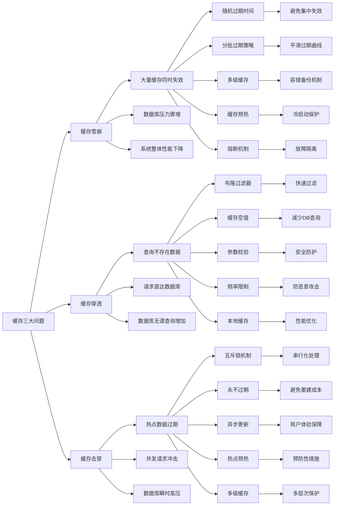

# 如何防止缓存雪崩、缓存穿透和缓存击穿？

## 概要回答

缓存雪崩、穿透和击穿是缓存系统中常见的三个问题。缓存雪崩指大量缓存同时失效导致数据库压力骤增；缓存穿透指查询不存在的数据导致每次请求都打到数据库；缓存击穿指热点数据失效瞬间大量请求打到数据库。防止这些问题的方法包括：使用随机过期时间避免雪崩；使用布隆过滤器和缓存空值防止穿透；使用互斥锁或永不过期策略防止击穿。通过合理的缓存策略和防护机制，可以有效提升系统的稳定性和性能。

## 深度解析

### 缓存雪崩防护详解

#### 什么是缓存雪崩
缓存雪崩是指在某个时间段内，大量的缓存数据同时失效，导致所有的请求都直接打到数据库上，造成数据库压力骤增甚至宕机的现象。

```bash
# 缓存雪崩模拟配置
# redis.conf - 大量缓存在同一时间点设置相同的过期时间
EXPIRE key 3600  # 所有缓存都设置1小时过期
# 当这一小时到达时，所有缓存同时失效，形成雪崩效应
```

```php
// PHP示例：缓存雪崩防护实现
<?php
require_once 'vendor/autoload.php';

use Predis\Client;

class CacheAvalancheProtection {
    private $redisClient;
    
    public function __construct($host = '127.0.0.1', $port = 6379, $db = 0) {
        $this->redisClient = new Client([
            'scheme' => 'tcp',
            'host'   => $host,
            'port'   => $port,
            'database' => $db
        ]);
    }
    
    public function setWithRandomExpire($key, $value, $baseTtl, $variancePercent = 0.1) {
        """
        设置缓存时使用随机过期时间防止雪崩
        
        Args:
            key: 缓存键
            value: 缓存值
            base_ttl: 基础过期时间（秒）
            variance_percent: 过期时间变化百分比
            
        Returns:
            bool: 设置是否成功
        """
        try {
            // 计算随机过期时间
            $variance = intval($baseTtl * $variancePercent);
            $minTtl = max(1, $baseTtl - $variance);
            $maxTtl = $baseTtl + $variance;
            $randomTtl = rand($minTtl, $maxTtl);
            
            // 设置缓存
            $result = $this->redisClient->setex($key, $randomTtl, (string)$value);
            echo "Cache set: {$key}, TTL: {$randomTtl}s (base: {$baseTtl}s)\n";
            return $result;
        } catch (Exception $e) {
            echo "Failed to set cache with random expire: " . $e->getMessage() . "\n";
            return false;
        }
    }
    
    public function setWithStaggeredExpire($keysValues, $baseTtl, $staggerSeconds = 60) {
        """
        分批设置缓存，错开过期时间
        
        Args:
            keys_values: 键值对数组
            base_ttl: 基础过期时间
            stagger_seconds: 错开时间间隔
            
        Returns:
            bool: 设置是否成功
        """
        try {
            $currentTime = time();
            
            foreach ($keysValues as $i => $keyValue) {
                $key = $keyValue[0];
                $value = $keyValue[1];
                
                // 为每个键计算不同的过期时间
                $staggeredTtl = $baseTtl + ($i * $staggerSeconds) % ($staggerSeconds * 10);
                
                // 使用SETEX命令设置过期时间
                $this->redisClient->setex($key, $staggeredTtl, (string)$value);
            }
            
            echo "Staggered cache set for " . count($keysValues) . " keys\n";
            return true;
        } catch (Exception $e) {
            echo "Failed to set staggered cache: " . $e->getMessage() . "\n";
            return false;
        }
    }
    
    public function getWithMultiLevelCache($key, $primaryTtl = 3600, $secondaryTtl = 7200) {
        """
        多级缓存策略防止雪崩
        
        Args:
            key: 缓存键
            primary_ttl: 主缓存过期时间
            secondary_ttl: 次级缓存过期时间
            
        Returns:
            string|null: 缓存值
        """
        try {
            // 第一级缓存
            $primaryKey = "primary:{$key}";
            $value = $this->redisClient->get($primaryKey);
            
            if ($value) {
                return $value;
            }
            
            // 第二级缓存
            $secondaryKey = "secondary:{$key}";
            $value = $this->redisClient->get($secondaryKey);
            
            if ($value) {
                // 将次级缓存提升为主缓存
                $this->redisClient->setex($primaryKey, $primaryTtl, $value);
                return $value;
            }
            
            return null;
        } catch (Exception $e) {
            echo "Multi-level cache get failed: " . $e->getMessage() . "\n";
            return null;
        }
    }
    
    public function setWithWarmUp($keyPrefix, $dataLoaderFunc, $warmUpCount = 100) {
        """
        缓存预热防止冷启动雪崩
        
        Args:
            key_prefix: 键前缀
            data_loader_func: 数据加载函数
            warm_up_count: 预热数据量
            
        Returns:
            bool: 预热是否成功
        """
        try {
            echo "Starting cache warm-up for {$warmUpCount} items...\n";
            $startTime = microtime(true);
            
            for ($i = 0; $i < $warmUpCount; $i++) {
                $key = "{$keyPrefix}:{$i}";
                // 模拟数据加载
                $value = call_user_func($dataLoaderFunc, $i);
                
                // 设置随机过期时间进行预热
                $baseTtl = 3600;  // 1小时
                $this->setWithRandomExpire($key, $value, $baseTtl);
                
                // 控制预热速度，避免对数据库造成压力
                if ($i % 50 == 0) {
                    usleep(100000); // 0.1秒
                }
            }
            
            $elapsedTime = microtime(true) - $startTime;
            echo "Cache warm-up completed in " . number_format($elapsedTime, 2) . "s\n";
            return true;
        } catch (Exception $e) {
            echo "Cache warm-up failed: " . $e->getMessage() . "\n";
            return false;
        }
    }
    
    public function implementCircuitBreaker($key, $failureThreshold = 5, $recoveryTimeout = 60) {
        """
        实现熔断器模式防止雪崩扩散
        
        Args:
            key: 熔断器键
            failure_threshold: 失败阈值
            recovery_timeout: 恢复超时时间
            
        Returns:
            bool: 是否允许请求通过
        """
        try {
            $breakerKey = "circuit_breaker:{$key}";
            $failureCountKey = "{$breakerKey}:failures";
            $lastFailureKey = "{$breakerKey}:last_failure";
            
            // 检查是否处于熔断状态
            $currentTime = time();
            $lastFailureTime = $this->redisClient->get($lastFailureKey);
            
            if ($lastFailureTime) {
                $lastFailureTime = intval($lastFailureTime);
                // 如果在恢复时间内且失败次数超过阈值，则熔断
                $failureCount = intval($this->redisClient->get($failureCountKey) ?: 0);
                if (($currentTime - $lastFailureTime < $recoveryTimeout) &&
                    $failureCount >= $failureThreshold) {
                    echo "Circuit breaker OPEN for {$key}\n";
                    return false;
                }
            }
            
            echo "Circuit breaker CLOSED for {$key}\n";
            return true;
        } catch (Exception $e) {
            echo "Circuit breaker check failed: " . $e->getMessage() . "\n";
            return true;  // 默认允许通过
        }
    }
    
    public function recordFailure($key) {
        """记录失败次数"""
        try {
            $breakerKey = "circuit_breaker:{$key}";
            $failureCountKey = "{$breakerKey}:failures";
            $lastFailureKey = "{$breakerKey}:last_failure";
            
            $currentTime = time();
            $this->redisClient->incr($failureCountKey);
            $this->redisClient->set($lastFailureKey, $currentTime);
            $this->redisClient->expire($failureCountKey, 300);  // 5分钟过期
            $this->redisClient->expire($lastFailureKey, 300);
        } catch (Exception $e) {
            echo "Failed to record failure: " . $e->getMessage() . "\n";
        }
    }
}

// 使用示例
// $avalancheProtection = new CacheAvalancheProtection();

// 1. 随机过期时间示例
// $avalancheProtection->setWithRandomExpire("user:123", "user_data", 3600);

// 2. 错开过期时间示例
// $dataDict = [];
// for ($i = 0; $i < 10; $i++) {
//     $dataDict[] = ["item:{$i}", "data_{$i}"];
// }
// $avalancheProtection->setWithStaggeredExpire($dataDict, 3600, 300);

// 3. 多级缓存示例
// $value = $avalancheProtection->getWithMultiLevelCache("product:456");

// 4. 缓存预热示例
// function mockDataLoader($index) {
//     return "mock_data_{$index}";
// }

// $avalancheProtection->setWithWarmUp("preheat", 'mockDataLoader', 50);

// 5. 熔断器示例
// if ($avalancheProtection->implementCircuitBreaker("database_service")) {
//     echo "Request allowed\n";
// } else {
//     echo "Request blocked by circuit breaker\n";
// }
?>
```

#### 缓存雪崩防护策略总结

1. **随机过期时间**：在基础过期时间基础上增加随机偏差
2. **分批过期**：将大量缓存的过期时间错开分布
3. **多级缓存**：建立主备缓存层次结构
4. **缓存预热**：系统启动时预先加载热点数据
5. **熔断机制**：当失败率达到阈值时暂时拒绝请求

### 缓存穿透防护详解

#### 什么是缓存穿透
缓存穿透是指查询一个不存在的数据，由于缓存中没有该数据，请求会穿透到数据库，如果数据库中也没有该数据，则不会写入缓存。这样每次针对这个key的请求都会打到数据库，可能导致数据库压力过大。

```bash
# 缓存穿透攻击示例
# 攻击者不断请求不存在的用户ID
GET /api/user?id=999999999  # 不存在的用户
GET /api/user?id=999999998  # 不存在的用户
GET /api/user?id=999999997  # 不存在的用户
# 所有请求都会直接打到数据库
```

```php
// PHP示例：缓存穿透防护实现
<?php
require_once 'vendor/autoload.php';

use Predis\Client;

class CachePenetrationProtection {
    private $redisClient;
    private $bloomFilter;
    private $localCache;
    
    public function __construct() {
        $this->redisClient = new Client([
            'scheme' => 'tcp',
            'host'   => '127.0.0.1',
            'port'   => 6379,
        ]);
        // 初始化简单的布隆过滤器模拟
        $this->bloomFilter = [];
        $this->localCache = [];
    }
    
    /**
     * 使用布隆过滤器防止缓存穿透
     */
    public function getDataWithBloomFilter($key) {
        // 1. 布隆过滤器检查
        if (!$this->mightContain($key)) {
            echo "Bloom filter: key definitely not exists - " . $key . "\n";
            return null; // 肯定不存在，直接返回
        }
        
        // 2. 查询Redis缓存
        $cachedValue = $this->redisClient->get($key);
        if ($cachedValue !== null) {
            echo "Cache hit: " . $key . "\n";
            return $cachedValue;
        }
        
        // 3. 查询数据库
        $dbValue = $this->queryFromDatabase($key);
        if ($dbValue !== null) {
            // 4. 缓存存在的数据
            $this->redisClient->setex($key, 3600, $dbValue); // 1小时过期
            echo "Data cached: " . $key . "\n";
            return $dbValue;
        } else {
            // 5. 缓存空值防止反复查询数据库
            $this->redisClient->setex("empty:" . $key, 300, "EMPTY"); // 5分钟过期
            echo "Empty value cached: " . $key . "\n";
            return null;
        }
    }
    
    /**
     * 使用缓存空值防止穿透
     */
    public function getDataWithNullCaching($key) {
        // 1. 检查是否是已知的空值
        $emptyCheck = $this->redisClient->get("empty:" . $key);
        if ("EMPTY" === $emptyCheck) {
            echo "Known empty key: " . $key . "\n";
            return null;
        }
        
        // 2. 查询正常缓存
        $cachedValue = $this->redisClient->get($key);
        if ($cachedValue !== null) {
            echo "Cache hit: " . $key . "\n";
            return $cachedValue;
        }
        
        // 3. 查询数据库
        $dbValue = $this->queryFromDatabase($key);
        if ($dbValue !== null) {
            // 4. 缓存真实数据
            $this->redisClient->setex($key, 3600, $dbValue);
            echo "Data cached: " . $key . "\n";
            return $dbValue;
        } else {
            // 5. 缓存空值标识
            $this->redisClient->setex("empty:" . $key, 300, "EMPTY");
            echo "Empty marker cached: " . $key . "\n";
            return null;
        }
    }
    
    /**
     * 使用本地缓存加速判断
     */
    public function getDataWithLocalCache($key) {
        // 1. 本地缓存检查（最快的判断）
        if (array_key_exists($key, $this->localCache)) {
            $value = $this->localCache[$key];
            if ($value === null) {
                echo "Local cache: known empty - " . $key . "\n";
                return null;
            }
            echo "Local cache hit: " . $key . "\n";
            return $value;
        }
        
        // 2. Redis缓存检查
        $cachedValue = $this->redisClient->get($key);
        if ($cachedValue !== null) {
            // 同步到本地缓存
            $this->localCache[$key] = $cachedValue;
            echo "Cache hit and synced to local: " . $key . "\n";
            return $cachedValue;
        }
        
        // 3. 数据库查询
        $dbValue = $this->queryFromDatabase($key);
        if ($dbValue !== null) {
            // 4. 双缓存存储
            $this->redisClient->setex($key, 3600, $dbValue);
            $this->localCache[$key] = $dbValue;
            echo "Data cached in both layers: " . $key . "\n";
            return $dbValue;
        } else {
            // 5. 空值双缓存
            $this->redisClient->setex("empty:" . $key, 300, "EMPTY");
            $this->localCache[$key] = null;
            echo "Empty value cached in both layers: " . $key . "\n";
            return null;
        }
    }
    
    /**
     * 参数校验防止恶意请求
     */
    public function getDataWithValidation($key) {
        // 1. 参数合法性校验
        if (!$this->isValidKey($key)) {
            echo "Invalid key rejected: " . $key . "\n";
            return null;
        }
        
        // 2. 频率限制检查
        if ($this->isRateLimited($key)) {
            echo "Rate limited: " . $key . "\n";
            return null;
        }
        
        // 3. 正常缓存查询流程
        return $this->getDataWithNullCaching($key);
    }
    
    /**
     * 模拟数据库查询
     */
    private function queryFromDatabase($key) {
        // 模拟数据库查询延迟
        usleep(50000); // 50ms模拟数据库查询
        
        // 模拟部分数据存在
        if (strpos($key, "user:") === 0 && mt_rand() / mt_getrandmax() > 0.3) {
            return "User data for " . $key;
        } else if (strpos($key, "product:") === 0 && mt_rand() / mt_getrandmax() > 0.2) {
            return "Product data for " . $key;
        }
        
        return null; // 数据不存在
    }
    
    /**
     * 验证键的合法性
     */
    private function isValidKey($key) {
        // 基本格式校验
        if ($key === null || empty($key) || strlen($key) > 100) {
            return false;
        }
        
        // 特殊字符检查
        if (strpos($key, "..") !== false || strpos($key, "//") !== false) {
            return false;
        }
        
        // 白名单检查
        return preg_match('/^(user|product|order):[a-zA-Z0-9_-]+$/', $key);
    }
    
    /**
     * 频率限制检查
     */
    private function isRateLimited($key) {
        $rateLimitKey = "rate_limit:" . $key;
        $countStr = $this->redisClient->get($rateLimitKey);
        $count = $countStr !== null ? intval($countStr) : 0;
        
        if ($count > 100) { // 每分钟最多100次查询
            return true;
        }
        
        // 增加计数器，1分钟过期
        $this->redisClient->incr($rateLimitKey);
        if ($count == 0) {
            $this->redisClient->expire($rateLimitKey, 60);
        }
        
        return false;
    }
    
    /**
     * 检查布隆过滤器是否包含键
     */
    private function mightContain($key) {
        // 简单的布隆过滤器模拟
        $hash = crc32($key) % 1000000;
        return isset($this->bloomFilter[$hash]);
    }
    
    /**
     * 添加数据到布隆过滤器（数据写入时）
     */
    public function addToBloomFilter($key) {
        $hash = crc32($key) % 1000000;
        $this->bloomFilter[$hash] = true;
        echo "Key added to bloom filter: " . $key . "\n";
    }
    
    /**
     * 批量预热布隆过滤器
     */
    public function warmUpBloomFilter($keyPrefix, $count) {
        echo "Warming up bloom filter with " . $count . " keys...\n";
        for ($i = 0; $i < $count; $i++) {
            $key = $keyPrefix . ":" . $i;
            $this->addToBloomFilter($key);
        }
        echo "Bloom filter warm-up completed\n";
    }
}

// 使用示例
// $protection = new CachePenetrationProtection();

// 预热布隆过滤器
// $protection->warmUpBloomFilter("user", 10000);

// 测试正常数据查询
// $result1 = $protection->getDataWithBloomFilter("user:123");
// echo "Result 1: " . $result1 . "\n";

// 测试不存在数据查询
// $result2 = $protection->getDataWithBloomFilter("user:999999");
// echo "Result 2: " . $result2 . "\n";

// 测试参数校验
// $result3 = $protection->getDataWithValidation("user:456");
// echo "Result 3: " . $result3 . "\n";

// 测试非法参数
// $result4 = $protection->getDataWithValidation("../../../etc/passwd");
// echo "Result 4: " . $result4 . "\n";
?>
```
```

#### 缓存穿透防护策略总结

1. **布隆过滤器**：在缓存层之前快速过滤肯定不存在的请求
2. **缓存空值**：对查询结果为空的数据也进行缓存
3. **参数校验**：对请求参数进行合法性检查
4. **频率限制**：对异常请求进行限流
5. **本地缓存**：使用本地缓存加速判断过程

### 缓存击穿防护详解

#### 什么是缓存击穿
缓存击穿是指某个热点key在缓存中过期的瞬间，大量并发请求同时打到数据库上，造成数据库瞬时压力过大的现象。与雪崩不同，击穿只针对一个特定的key。

```bash
# 缓存击穿场景模拟
# 热点商品信息缓存过期
# 大量用户同时查询同一个热门商品
GET /api/product?id=hot_product_001  # 1000个并发请求
# 缓存刚好过期，所有请求都打到数据库
```

```javascript
// JavaScript示例：缓存击穿防护实现
const redis = require('redis');
const client = redis.createClient();

class CacheBreakdownProtection {
    constructor() {
        this.client = client;
        this.locks = new Map(); // 内存锁
    }
    
    /**
     * 使用互斥锁防止击穿
     */
    async getDataWithMutex(key, loadDataFunc, ttl = 3600) {
        const cacheKey = key;
        const lockKey = `lock:${key}`;
        
        try {
            // 1. 尝试从缓存获取
            let cachedValue = await this.client.get(cacheKey);
            if (cachedValue) {
                console.log(`Cache hit: ${key}`);
                return JSON.parse(cachedValue);
            }
            
            // 2. 获取分布式锁
            const lockAcquired = await this.acquireLock(lockKey, 10); // 10秒超时
            if (!lockAcquired) {
                // 获取锁失败，可能是其他请求正在加载数据
                // 等待一小段时间后重试
                await new Promise(resolve => setTimeout(resolve, 100));
                return await this.getDataWithMutex(key, loadDataFunc, ttl);
            }
            
            try {
                // 3. 再次检查缓存（双重检查）
                cachedValue = await this.client.get(cacheKey);
                if (cachedValue) {
                    console.log(`Cache hit after lock: ${key}`);
                    return JSON.parse(cachedValue);
                }
                
                // 4. 加载数据
                console.log(`Loading data for: ${key}`);
                const data = await loadDataFunc();
                
                // 5. 缓存数据
                if (data !== null) {
                    await this.client.setex(cacheKey, ttl, JSON.stringify(data));
                    console.log(`Data cached: ${key}`);
                } else {
                    // 缓存空值防止穿透
                    await this.client.setex(`empty:${key}`, 300, "EMPTY");
                    console.log(`Empty value cached: ${key}`);
                }
                
                return data;
            } finally {
                // 6. 释放锁
                await this.releaseLock(lockKey);
            }
        } catch (error) {
            console.error(`Error in getDataWithMutex for ${key}:`, error);
            return null;
        }
    }
    
    /**
     * 获取分布式锁
     */
    async acquireLock(lockKey, timeoutSeconds) {
        const lockValue = `${Date.now()}:${Math.random()}`;
        const startTime = Date.now();
        
        while (Date.now() - startTime < timeoutSeconds * 1000) {
            // 使用SET NX EX命令原子性获取锁
            const result = await this.client.set(
                lockKey, 
                lockValue, 
                'NX',  // 仅当key不存在时设置
                'EX',  // 设置过期时间
                30     // 30秒过期
            );
            
            if (result === 'OK') {
                // 成功获取锁
                this.locks.set(lockKey, lockValue);
                return true;
            }
            
            // 等待一小段时间后重试
            await new Promise(resolve => setTimeout(resolve, 50));
        }
        
        return false; // 获取锁超时
    }
    
    /**
     * 释放分布式锁
     */
    async releaseLock(lockKey) {
        const lockValue = this.locks.get(lockKey);
        if (!lockValue) return;
        
        // 使用Lua脚本原子性释放锁
        const luaScript = `
            if redis.call("GET", KEYS[1]) == ARGV[1] then
                return redis.call("DEL", KEYS[1])
            else
                return 0
            end
        `;
        
        await this.client.eval(luaScript, 1, lockKey, lockValue);
        this.locks.delete(lockKey);
    }
    
    /**
     * 使用永不过期策略防止击穿
     */
    async getDataWithNeverExpire(key, loadDataFunc, softTtl = 3600) {
        const cacheKey = key;
        const metaKey = `meta:${key}`; // 元数据key
        
        try {
            // 1. 获取缓存数据和元数据
            const [cachedValue, metaValue] = await this.client.mget([cacheKey, metaKey]);
            
            if (cachedValue) {
                const now = Math.floor(Date.now() / 1000);
                const metaData = metaValue ? JSON.parse(metaValue) : { created: now };
                
                // 检查软过期时间
                if (now - metaData.created < softTtl) {
                    console.log(`Cache hit (soft): ${key}`);
                    return JSON.parse(cachedValue);
                } else {
                    console.log(`Cache soft expired: ${key}`);
                    // 异步刷新缓存
                    this.refreshCacheInBackground(key, loadDataFunc, softTtl);
                }
                
                return JSON.parse(cachedValue);
            }
            
            // 2. 缓存未命中，加载数据
            console.log(`Cache miss, loading data: ${key}`);
            const data = await loadDataFunc();
            
            if (data !== null) {
                const now = Math.floor(Date.now() / 1000);
                const metaData = { created: now };
                
                // 永久缓存数据和元数据
                const pipeline = this.client.multi();
                pipeline.set(cacheKey, JSON.stringify(data));
                pipeline.set(metaKey, JSON.stringify(metaData));
                await pipeline.exec();
                
                console.log(`Data cached permanently: ${key}`);
            }
            
            return data;
        } catch (error) {
            console.error(`Error in getDataWithNeverExpire for ${key}:`, error);
            return null;
        }
    }
    
    /**
     * 后台异步刷新缓存
     */
    async refreshCacheInBackground(key, loadDataFunc, ttl) {
        // 使用setTimeout模拟异步刷新
        setTimeout(async () => {
            try {
                console.log(`Refreshing cache in background: ${key}`);
                const data = await loadDataFunc();
                
                if (data !== null) {
                    const now = Math.floor(Date.now() / 1000);
                    const metaData = { created: now };
                    
                    const pipeline = this.client.multi();
                    pipeline.setex(key, ttl, JSON.stringify(data));
                    pipeline.setex(`meta:${key}`, ttl, JSON.stringify(metaData));
                    await pipeline.exec();
                    
                    console.log(`Cache refreshed: ${key}`);
                }
            } catch (error) {
                console.error(`Error refreshing cache for ${key}:`, error);
            }
        }, 100); // 100ms后执行
    }
    
    /**
     * 使用逻辑过期防止击穿
     */
    async getDataWithLogicalExpire(key, loadDataFunc, expireSeconds = 3600) {
        const cacheKey = `logical:${key}`;
        
        try {
            // 1. 获取缓存数据
            const cachedData = await this.client.get(cacheKey);
            if (cachedData) {
                const dataObj = JSON.parse(cachedData);
                const now = Math.floor(Date.now() / 1000);
                
                // 检查是否逻辑过期
                if (now < dataObj.expireTime) {
                    console.log(`Cache hit (logical): ${key}`);
                    return dataObj.data;
                } else {
                    console.log(`Cache logically expired: ${key}`);
                    // 异步更新缓存
                    this.updateCacheLogically(key, loadDataFunc, expireSeconds);
                }
                
                return dataObj.data;
            }
            
            // 2. 缓存未命中，加载数据
            console.log(`Cache miss, loading data: ${key}`);
            const data = await loadDataFunc();
            
            if (data !== null) {
                const now = Math.floor(Date.now() / 1000);
                const dataObj = {
                    data: data,
                    expireTime: now + expireSeconds
                };
                
                await this.client.setex(cacheKey, expireSeconds * 2, JSON.stringify(dataObj));
                console.log(`Data cached with logical expire: ${key}`);
            }
            
            return data;
        } catch (error) {
            console.error(`Error in getDataWithLogicalExpire for ${key}:`, error);
            return null;
        }
    }
    
    /**
     * 逻辑过期后异步更新缓存
     */
    async updateCacheLogically(key, loadDataFunc, expireSeconds) {
        // 使用独立的异步操作更新缓存
        setImmediate(async () => {
            try {
                console.log(`Updating cache logically: ${key}`);
                const data = await loadDataFunc();
                
                if (data !== null) {
                    const now = Math.floor(Date.now() / 1000);
                    const dataObj = {
                        data: data,
                        expireTime: now + expireSeconds
                    };
                    
                    await this.client.setex(`logical:${key}`, expireSeconds * 2, JSON.stringify(dataObj));
                    console.log(`Cache updated logically: ${key}`);
                }
            } catch (error) {
                console.error(`Error updating cache logically for ${key}:`, error);
            }
        });
    }
    
    /**
     * 模拟数据加载函数
     */
    async mockLoadData(key) {
        // 模拟数据库查询延迟
        await new Promise(resolve => setTimeout(resolve, 100));
        
        // 模拟部分数据存在
        if (key.includes('hot') || Math.random() > 0.3) {
            return {
                id: key,
                name: `Data for ${key}`,
                timestamp: Date.now()
            };
        }
        
        return null;
    }
    
    /**
     * 批量预热热点数据
     */
    async warmUpHotData(keys, loadDataFunc) {
        console.log(`Warming up ${keys.length} hot keys...`);
        
        const promises = keys.map(key => 
            this.getDataWithMutex(key, loadDataFunc, 7200)
        );
        
        await Promise.all(promises);
        console.log('Hot data warm-up completed');
    }
}

// 使用示例
async function runCacheBreakdownExamples() {
    const protection = new CacheBreakdownProtection();
    
    // 等待Redis连接建立
    await new Promise(resolve => setTimeout(resolve, 1000));
    
    // 1. 互斥锁防护示例
    console.log('=== Mutex Protection ===');
    const result1 = await protection.getDataWithMutex(
        'hot_product_001', 
        () => protection.mockLoadData('hot_product_001')
    );
    console.log('Result 1:', result1);
    
    // 2. 永不过期策略示例
    console.log('\n=== Never Expire Strategy ===');
    const result2 = await protection.getDataWithNeverExpire(
        'hot_product_002',
        () => protection.mockLoadData('hot_product_002')
    );
    console.log('Result 2:', result2);
    
    // 3. 逻辑过期策略示例
    console.log('\n=== Logical Expire Strategy ===');
    const result3 = await protection.getDataWithLogicalExpire(
        'hot_product_003',
        () => protection.mockLoadData('hot_product_003')
    );
    console.log('Result 3:', result3);
    
    // 4. 热点数据预热
    console.log('\n=== Hot Data Warm-up ===');
    const hotKeys = ['hot_item_1', 'hot_item_2', 'hot_item_3'];
    await protection.warmUpHotData(hotKeys, protection.mockLoadData.bind(protection));
}

// runCacheBreakdownExamples();
```

#### 缓存击穿防护策略总结

1. **互斥锁机制**：使用分布式锁确保只有一个请求去加载数据
2. **永不过期**：设置物理永不过期，通过逻辑过期控制
3. **异步更新**：数据过期后异步更新而不是同步等待
4. **热点数据预热**：提前加载热点数据到缓存中
5. **多级缓存**：结合本地缓存和分布式缓存

### 综合防护方案

```php
// PHP示例：综合缓存防护方案
<?php
require_once 'vendor/autoload.php';

use Predis\Client;
use React\Promise;

class SimpleBloomFilter {
    private $bits;
    private $size;
    
    public function __construct($size) {
        $this->bits = array_fill(0, $size, false);
        $this->size = $size;
    }
    
    public function add($key) {
        $hash1 = $this->simpleHash($key, 0);
        $hash2 = $this->simpleHash($key, 1);
        
        for ($i = 0; $i < 3; $i++) { // 3个哈希函数
            $index = ($hash1 + $i * $hash2) % $this->size;
            $this->bits[$index] = true;
        }
    }
    
    public function mightContain($key) {
        $hash1 = $this->simpleHash($key, 0);
        $hash2 = $this->simpleHash($key, 1);
        
        for ($i = 0; $i < 3; $i++) {
            $index = ($hash1 + $i * $hash2) % $this->size;
            if (!$this->bits[$index]) {
                return false;
            }
        }
        return true;
    }
    
    private function simpleHash($s, $seed) {
        $hash = 0;
        for ($i = 0; $i < strlen($s); $i++) {
            $hash = $hash * 31 + ord($s[$i]) + $seed * $i;
        }
        return $hash;
    }
}

// 缓存条目结构
class CacheEntry {
    public $data;
    public $expireTime;
    public $createdAt;
    
    public function __construct($data, $expireTime, $createdAt) {
        $this->data = $data;
        $this->expireTime = $expireTime;
        $this->createdAt = $createdAt;
    }
}

// 综合缓存防护结构体
class ComprehensiveCacheProtection {
    private $client;
    private $bloomFilter;
    private $mutexes;
    
    public function __construct() {
        $this->client = new Client([
            'scheme' => 'tcp',
            'host'   => '127.0.0.1',
            'port'   => 6379,
        ]);
        $this->bloomFilter = new SimpleBloomFilter(1000000); // 100万位的布隆过滤器
        $this->mutexes = [];
    }
    
    // 综合获取数据方法
    public function getData($key, $loader) {
        // 1. 布隆过滤器快速过滤
        if (!$this->bloomFilter->mightContain($key)) {
            echo "Bloom filter reject: {$key}\n";
            return null;
        }
        
        // 2. 检查空值缓存
        try {
            $emptyCheck = $this->client->get("empty:" . $key);
            if ($emptyCheck !== null && $emptyCheck === "EMPTY") {
                echo "Empty cache hit: {$key}\n";
                return null;
            }
        } catch (Exception $e) {
            // 忽略异常
        }
        
        // 3. 检查主缓存
        try {
            $cachedData = $this->client->get($key);
            if ($cachedData !== null) {
                $entry = json_decode($cachedData);
                if ($entry && time() < $entry->expire_time) {
                    echo "Cache hit: {$key}\n";
                    return $entry->data;
                } else {
                    echo "Cache expired: {$key}\n";
                    // 异步刷新
                    $this->asyncRefresh($key, $loader);
                }
            }
        } catch (Exception $e) {
            // 忽略异常
        }
        
        // 4. 获取互斥锁
        if (!isset($this->mutexes[$key])) {
            $this->mutexes[$key] = false;
        }
        
        // 简化的锁机制
        while ($this->mutexes[$key]) {
            usleep(10000); // 等待10毫秒
        }
        $this->mutexes[$key] = true;
        
        try {
            // 5. 双重检查缓存
            try {
                $cachedData = $this->client->get($key);
                if ($cachedData !== null) {
                    $entry = json_decode($cachedData);
                    if ($entry && time() < $entry->expire_time) {
                        echo "Cache hit after lock: {$key}\n";
                        return $entry->data;
                    }
                }
            } catch (Exception $e) {
                // 忽略异常
            }
            
            // 6. 加载数据
            echo "Loading data: {$key}\n";
            $data = call_user_func($loader);
            
            // 7. 缓存数据
            if ($data !== null) {
                $entry = new CacheEntry(
                    $data,
                    time() + 3600, // 1小时过期
                    time()
                );
                
                $jsonData = json_encode($entry);
                // 使用随机过期时间
                $randomTTL = 3600 + rand(0, 600); // 1小时 ± 10分钟
                $this->client->setex($key, $randomTTL, $jsonData);
                
                // 添加到布隆过滤器
                $this->bloomFilter->add($key);
                
                echo "Data cached: {$key} (TTL: {$randomTTL}s)\n";
            } else {
                // 缓存空值
                $this->client->setex("empty:" . $key, 300, "EMPTY");
                echo "Empty value cached: {$key}\n";
            }
            
            return $data;
        } finally {
            // 释放锁
            $this->mutexes[$key] = false;
        }
    }
    
    // 异步刷新缓存
    public function asyncRefresh($key, $loader) {
        // 在PHP中使用异步刷新较为复杂，这里简化处理
        // 可以考虑使用ReactPHP或其他异步框架
        echo "Async refreshing: {$key}\n";
        // 这里我们直接调用加载器
        try {
            $data = call_user_func($loader);
            if ($data !== null) {
                $entry = new CacheEntry(
                    $data,
                    time() + 3600,
                    time()
                );
                
                $jsonData = json_encode($entry);
                $randomTTL = 3600 + rand(0, 600);
                $this->client->setex($key, $randomTTL, $jsonData);
                echo "Cache refreshed: {$key}\n";
            }
        } catch (Exception $e) {
            echo "Async refresh failed for {$key}: " . $e->getMessage() . "\n";
        }
    }
    
    // 批量预热缓存
    public function warmUpCache($keys, $loader) {
        echo "Warming up " . count($keys) . " keys...\n";
        
        foreach ($keys as $key) {
            try {
                $this->getData($key, function() use ($loader, $key) {
                    return call_user_func($loader, $key);
                });
            } catch (Exception $e) {
                echo "Warm-up failed for {$key}: " . $e->getMessage() . "\n";
            }
        }
        
        echo "Cache warm-up completed\n";
    }
}

// 模拟数据加载器
function mockDataLoader($key) {
    // 模拟数据库查询延迟
    usleep(rand(0, 100) * 1000);
    
    // 模拟部分数据存在
    if (substr($key, 0, 3) === "hot" || mt_rand() / mt_getrandmax() > 0.3) {
        return [
            "id" => $key,
            "name" => "Data for {$key}",
            "timestamp" => time()
        ];
    }
    
    return null;
}

// 使用示例
// $protection = new ComprehensiveCacheProtection();

// 预热热点数据
// $hotKeys = ["hot_product_1", "hot_product_2", "hot_product_3"];
// $protection->warmUpCache($hotKeys, 'mockDataLoader');

// 测试综合防护
// echo "=== Comprehensive Protection Test ===\n";

// 测试正常数据
// $data1 = $protection->getData("hot_product_1", function() {
//     return mockDataLoader("hot_product_1");
// });
// echo "Data 1: " . json_encode($data1) . "\n";

// 测试不存在数据
// $data2 = $protection->getData("nonexistent_999", function() {
//     return mockDataLoader("nonexistent_999");
// });
// echo "Data 2: " . json_encode($data2) . "\n";

// 测试布隆过滤器拦截
// $data3 = $protection->getData("definitely_not_exist", function() {
//     return mockDataLoader("definitely_not_exist");
// });
// echo "Data 3: " . json_encode($data3) . "\n";
?>
```

## 图示说明



通过以上三种防护机制的综合运用，可以有效防止缓存雪崩、穿透和击穿问题，提升系统的稳定性和可靠性。在实际应用中，应根据具体的业务场景和性能要求选择合适的防护策略，并持续监控和优化缓存系统的运行状态。