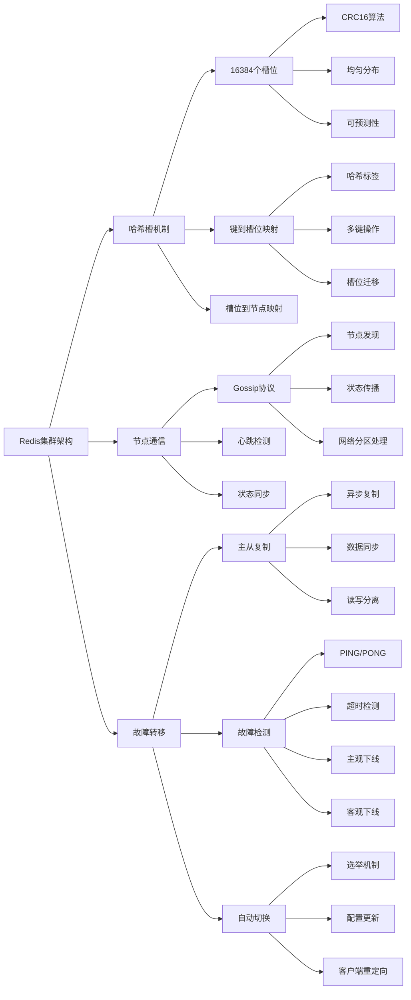

# Redis集群的原理和数据分片策略？

## 概要回答

Redis集群是Redis官方提供的分布式解决方案，通过哈希槽（Hash Slot）机制实现数据分片，支持自动故障转移和水平扩展。Redis集群将数据分布在16384个哈希槽中，每个节点负责一部分槽位，客户端可以直接连接任意节点进行数据操作。集群通过Gossip协议维护节点状态，实现高可用性和数据一致性。数据分片策略主要包括哈希标签、虚拟槽位映射和一致性哈希等，能够有效解决单点故障和性能瓶颈问题。

## 深度解析

### Redis集群架构原理

#### 集群基本概念
Redis集群通过将数据分散存储在多个节点上来实现水平扩展和高可用性。集群中每个节点都保存一部分数据，并且节点之间通过内部通信协议保持状态同步。

```bash
# Redis集群基本配置
# redis.conf
cluster-enabled yes                    # 启用集群模式
cluster-config-file nodes.conf         # 集群配置文件
cluster-node-timeout 15000             # 节点超时时间
cluster-slave-validity-factor 10       # 从节点有效性因子
cluster-migration-barrier 1            # 迁移屏障
cluster-require-full-coverage no       # 不要求所有槽位都覆盖

# 启动集群节点
redis-server /path/to/redis.conf --port 7000
redis-server /path/to/redis.conf --port 7001
redis-server /path/to/redis.conf --port 7002

# 创建集群
redis-cli --cluster create 127.0.0.1:7000 127.0.0.1:7001 127.0.0.1:7002 \
  --cluster-replicas 1

# 集群管理命令
redis-cli -c -p 7000                  # 连接集群（-c启用集群重定向）
CLUSTER NODES                         # 查看集群节点信息
CLUSTER SLOTS                         # 查看槽位分配
CLUSTER INFO                          # 查看集群状态
```

```php
// PHP示例：Redis集群连接和管理
<?php
require_once 'vendor/autoload.php';

use Predis\Client;
use Predis\Connection\Aggregate\RedisCluster;

class RedisClusterManager {
    private $cluster;
    
    public function __construct($startupNodes = null) {
        """
        初始化Redis集群管理器
        
        Args:
            startup_nodes: 初始节点列表
        """
        if ($startupNodes === null) {
            $startupNodes = [
                'tcp://127.0.0.1:7000',
                'tcp://127.0.0.1:7001',
                'tcp://127.0.0.1:7002'
            ];
        }
        
        $this->cluster = new Client($startupNodes, [
            'cluster' => 'redis',
        ]);
    }
    
    public function getClusterInfo() {
        """获取集群基本信息"""
        try {
            // 获取集群状态
            $clusterInfo = $this->cluster->executeRaw(['CLUSTER', 'INFO']);
            echo "=== Cluster Info ===\n";
            echo $clusterInfo . "\n";
            
            // 获取节点信息
            $nodesInfo = $this->cluster->executeRaw(['CLUSTER', 'NODES']);
            echo "\n=== Nodes Info ===\n";
            foreach (explode("\n", $nodesInfo) as $line) {
                if (trim($line)) {
                    echo $line . "\n";
                }
            }
            
            return [
                'cluster_info' => $clusterInfo,
                'nodes_info' => $nodesInfo
            ];
        } catch (Exception $e) {
            echo "Failed to get cluster info: " . $e->getMessage() . "\n";
            return null;
        }
    }
    
    public function getSlotDistribution() {
        """获取槽位分布情况"""
        try {
            $slotsInfo = $this->cluster->executeRaw(['CLUSTER', 'SLOTS']);
            $slotDistribution = [];
            
            echo "=== Slot Distribution ===\n";
            foreach ($slotsInfo as $slotRange) {
                $startSlot = $slotRange[0];
                $endSlot = $slotRange[1];
                $masterInfo = $slotRange[2];
                $slaveInfos = array_slice($slotRange, 3);
                
                $masterNode = $masterInfo[0] . ':' . $masterInfo[1];
                $slaveNodes = [];
                foreach ($slaveInfos as $slave) {
                    $slaveNodes[] = $slave[0] . ':' . $slave[1];
                }
                
                $slotDistribution["{$startSlot}-{$endSlot}"] = [
                    'master' => $masterNode,
                    'slaves' => $slaveNodes,
                    'slot_count' => $endSlot - $startSlot + 1
                ];
                
                echo "Slots {$startSlot}-{$endSlot}:\n";
                echo "  Master: {$masterNode}\n";
                echo "  Slaves: " . json_encode($slaveNodes) . "\n";
            }
            
            return $slotDistribution;
        } catch (Exception $e) {
            echo "Failed to get slot distribution: " . $e->getMessage() . "\n";
            return null;
        }
    }
    
    public function addNodeToCluster($nodeHost, $nodePort, $nodeType = 'master') {
        """向集群添加新节点"""
        try {
            // 启动新的Redis实例（需要手动启动）
            echo "Please start new Redis instance on {$nodeHost}:{$nodePort}\n";
            
            // 使用redis-cli添加节点
            if ($nodeType === 'master') {
                // 添加主节点
                $cmd = "redis-cli --cluster add-node {$nodeHost}:{$nodePort} " . $this->_getRandomNode();
            } else {
                // 添加从节点
                $masterNode = $this->_getRandomMasterNode();
                $cmd = "redis-cli --cluster add-node {$nodeHost}:{$nodePort} {$masterNode} --cluster-slave";
            }
            
            echo "Run command: {$cmd}\n";
            return true;
        } catch (Exception $e) {
            echo "Failed to add node: " . $e->getMessage() . "\n";
            return false;
        }
    }
    
    public function reshardCluster($targetNode, $slotCount) {
        """重新分片集群"""
        try {
            $targetAddr = $targetNode[0] . ':' . $targetNode[1];
            $cmd = "redis-cli --cluster reshard {$targetAddr} --cluster-from all --cluster-to {$targetAddr} --cluster-slots {$slotCount} --cluster-yes";
            echo "Run reshard command: {$cmd}\n";
            return true;
        } catch (Exception $e) {
            echo "Failed to reshard cluster: " . $e->getMessage() . "\n";
            return false;
        }
    }
    
    private function _getRandomNode() {
        """获取随机节点地址"""
        try {
            $nodesInfo = $this->cluster->executeRaw(['CLUSTER', 'NODES']);
            foreach (explode("\n", $nodesInfo) as $line) {
                if (trim($line)) {
                    $parts = explode(" ", $line);
                    if (count($parts) > 1) {
                        return $parts[1];  // 返回节点地址
                    }
                }
            }
        } catch (Exception $e) {
            // 忽略异常
        }
        return "127.0.0.1:7000";
    }
    
    private function _getRandomMasterNode() {
        """获取随机主节点地址"""
        try {
            $nodesInfo = $this->cluster->executeRaw(['CLUSTER', 'NODES']);
            foreach (explode("\n", $nodesInfo) as $line) {
                if (trim($line)) {
                    $parts = explode(" ", $line);
                    if (count($parts) > 1 && strpos($line, 'master') !== false) {
                        return $parts[1];  // 返回主节点地址
                    }
                }
            }
        } catch (Exception $e) {
            // 忽略异常
        }
        return "127.0.0.1:7000";
    }
    
    public function simulateWorkload($keyPrefix, $operationCount = 1000) {
        """模拟工作负载测试"""
        echo "Simulating workload with {$operationCount} operations...\n";
        
        $startTime = microtime(true);
        $successCount = 0;
        
        for ($i = 0; $i < $operationCount; $i++) {
            try {
                $key = "{$keyPrefix}:{$i}";
                $value = "value_{$i}_test_data";
                
                // SET操作
                $this->cluster->set($key, $value);
                
                // GET操作
                $retrievedValue = $this->cluster->get($key);
                if ($retrievedValue == $value) {
                    $successCount++;
                }
                
                // 每100次操作报告进度
                if ($i > 0 && $i % 100 == 0) {
                    $elapsed = microtime(true) - $startTime;
                    echo "Completed {$i} operations in " . number_format($elapsed, 2) . "s\n";
                }
                
            } catch (Exception $e) {
                echo "Operation {$i} failed: " . $e->getMessage() . "\n";
            }
        }
        
        $totalTime = microtime(true) - $startTime;
        echo "Workload simulation completed:\n";
        echo "  Success rate: {$successCount}/{$operationCount}\n";
        echo "  Total time: " . number_format($totalTime, 2) . "s\n";
        echo "  Throughput: " . number_format($operationCount/$totalTime, 2) . " ops/sec\n";
    }
    
    public function monitorClusterHealth($duration = 60) {
        """监控集群健康状态"""
        echo "Monitoring cluster health for {$duration} seconds...\n";
        
        $startTime = microtime(true);
        while (microtime(true) - $startTime < $duration) {
            try {
                // 检查集群状态
                $clusterInfo = $this->cluster->executeRaw(['CLUSTER', 'INFO']);
                if (strpos($clusterInfo, 'cluster_state:ok') !== false) {
                    echo "✓ Cluster state: OK\n";
                } else {
                    echo "✗ Cluster state: ERROR\n";
                }
                
                // 检查节点状态
                $nodesInfo = $this->cluster->executeRaw(['CLUSTER', 'NODES']);
                $connectedNodes = 0;
                foreach (explode("\n", $nodesInfo) as $line) {
                    if (strpos($line, 'connected') !== false) {
                        $connectedNodes++;
                    }
                }
                
                echo "✓ Connected nodes: {$connectedNodes}\n";
                
                sleep(5);  // 每5秒检查一次
                
            } catch (Exception $e) {
                echo "Health check failed: " . $e->getMessage() . "\n";
                sleep(5);
            }
        }
    }
}

// 使用示例
// $clusterManager = new RedisClusterManager();

// 获取集群信息
// $clusterManager->getClusterInfo();

// 获取槽位分布
// $clusterManager->getSlotDistribution();

// 模拟工作负载
// $clusterManager->simulateWorkload("test_key", 1000);

// 监控集群健康
// $clusterManager->monitorClusterHealth(30);
?>
```

#### 哈希槽机制详解

Redis集群使用16384个哈希槽来分布数据，每个键通过CRC16算法计算后对16384取模得到对应的槽位。

```php
// PHP示例：哈希槽计算和路由
<?php
require_once 'vendor/autoload.php';

use Predis\Client;

class RedisClusterHashSlotDemo {
    private $redisCluster;
    
    public function __construct() {
        // 配置集群节点
        $this->redisCluster = new Client([
            'tcp://127.0.0.1:7000',
            'tcp://127.0.0.1:7001',
            'tcp://127.0.0.1:7002',
        ], [
            'cluster' => 'redis',
        ]);
    }
    
    /**
     * 模拟Redis哈希槽计算
     */
    public function calculateHashSlot($key) {
        // Redis使用CRC16算法计算哈希
        // 这里简化实现，实际应该使用Redis的CRC16算法
        $crc = $this->crc16($key);
        return $crc % 16384; // 16384个槽位
    }
    
    /**
     * 简化的CRC16实现
     */
    private function crc16($data) {
        $crc = 0;
        for ($i = 0; $i < strlen($data); $i++) {
            $byte = ord($data[$i]);
            $crc = (($crc << 8) ^ $this->crc16Table[($crc >> 8) ^ ($byte & 0xFF)]) & 0xFFFF;
        }
        return $crc;
    }
    
    // CRC16查找表（简化版本）
    private $crc16Table = [
        0x0000, 0x1021, 0x2042, 0x3063, 0x4084, 0x50a5, 0x60c6, 0x70e7,
        0x8108, 0x9129, 0xa14a, 0xb16b, 0xc18c, 0xd1ad, 0xe1ce, 0xf1ef
        // ... 完整的CRC16表应该是256个元素
    ];
    
    /**
     * 使用哈希标签控制键的分布
     */
    public function demonstrateHashTags() {
        echo "=== Hash Tags Demonstration ===\n";
        
        // 没有哈希标签的键 - 可能分布在不同槽位
        $keysWithoutTags = [
            "user:1000:profile",
            "user:1000:settings",
            "user:1000:preferences"
        ];
        
        echo "Keys without hash tags:\n";
        foreach ($keysWithoutTags as $key) {
            $slot = $this->calculateHashSlot($key);
            printf("  %s -> slot %d\n", $key, $slot);
        }
        
        // 使用哈希标签的键 - 保证在同一槽位
        $keysWithTags = [
            "{user:1000}:profile",
            "{user:1000}:settings",
            "{user:1000}:preferences"
        ];
        
        echo "\nKeys with hash tags:\n";
        foreach ($keysWithTags as $key) {
            $slot = $this->calculateHashSlot($key);
            printf("  %s -> slot %d\n", $key, $slot);
        }
    }
    
    /**
     * 集群数据分布分析
     */
    public function analyzeDataDistribution($sampleSize) {
        echo "=== Data Distribution Analysis ===\n";
        
        $slotCounts = array_fill(0, 16384, 0);
        $sampleKeys = [];
        
        // 生成样本键
        for ($i = 0; $i < $sampleSize; $i++) {
            $sampleKeys[$i] = "sample:key:" . $i;
        }
        
        // 计算每个键的槽位
        foreach ($sampleKeys as $key) {
            $slot = $this->calculateHashSlot($key);
            $slotCounts[$slot]++;
        }
        
        // 分析分布情况
        $minCount = PHP_INT_MAX;
        $maxCount = 0;
        $zeroCount = 0;
        $totalCount = 0;
        
        foreach ($slotCounts as $count) {
            if ($count > 0) {
                $minCount = min($minCount, $count);
                $maxCount = max($maxCount, $count);
                $totalCount += $count;
            } else {
                $zeroCount++;
            }
        }
        
        $average = $totalCount / (16384 - $zeroCount);
        
        printf("Sample size: %d\n", $sampleSize);
        printf("Occupied slots: %d\n", 16384 - $zeroCount);
        printf("Empty slots: %d\n", $zeroCount);
        printf("Min keys per slot: %d\n", $minCount);
        printf("Max keys per slot: %d\n", $maxCount);
        printf("Average keys per slot: %.2f\n", $average);
        
        // 计算分布均匀性
        $variance = 0;
        foreach ($slotCounts as $count) {
            if ($count > 0) {
                $variance += pow($count - $average, 2);
            }
        }
        $variance /= (16384 - $zeroCount);
        $stdDev = sqrt($variance);
        
        printf("Standard deviation: %.2f\n", $stdDev);
        printf("Coefficient of variation: %.4f\n", $stdDev / $average);
    }
    
    /**
     * 集群性能测试
     */
    public function performanceTest($operationCount) {
        echo "=== Cluster Performance Test ===\n";
        
        $startTime = microtime(true);
        $successCount = 0;
        
        for ($i = 0; $i < $operationCount; $i++) {
            try {
                $key = "perf:test:" . $i;
                $value = "performance_test_value_" . $i;
                
                // SET操作
                $this->redisCluster->set($key, $value);
                
                // GET操作
                $retrievedValue = $this->redisCluster->get($key);
                if ($value === $retrievedValue) {
                    $successCount++;
                }
                
                // 每1000次操作报告进度
                if ($i > 0 && $i % 1000 == 0) {
                    $elapsed = (microtime(true) - $startTime) * 1000;
                    printf("Completed %d operations in %d ms\n", $i, $elapsed);
                }
                
            } catch (Exception $e) {
                echo "Operation " . $i . " failed: " . $e->getMessage() . "\n";
            }
        }
        
        $totalTime = (microtime(true) - $startTime) * 1000;
        $throughput = $operationCount / $totalTime * 1000;
        
        echo "Performance test completed:\n";
        printf("  Operations: %d\n", $operationCount);
        printf("  Success rate: %.2f%%\n", ($successCount / $operationCount) * 100);
        printf("  Total time: %d ms\n", $totalTime);
        printf("  Throughput: %.2f ops/sec\n", $throughput);
    }
    
    /**
     * 故障转移测试
     */
    public function failoverTest() {
        echo "=== Failover Test ===\n";
        
        try {
            // 设置一些测试数据
            for ($i = 0; $i < 10; $i++) {
                $key = "failover:test:" . $i;
                $value = "failover_test_value_" . $i;
                $this->redisCluster->set($key, $value);
            }
            
            echo "Test data written successfully\n";
            
            // 读取验证
            for ($i = 0; $i < 10; $i++) {
                $key = "failover:test:" . $i;
                $value = $this->redisCluster->get($key);
                printf("Key: %s, Value: %s\n", $key, $value);
            }
            
            echo "Failover test completed. Please manually stop a master node to test automatic failover.\n";
            
        } catch (Exception $e) {
            echo "Failover test failed: " . $e->getMessage() . "\n";
        }
    }
}

// 使用示例
// $demo = new RedisClusterHashSlotDemo();

// 演示哈希标签
// $demo->demonstrateHashTags();

// 分析数据分布
// $demo->analyzeDataDistribution(10000);

// 性能测试
// $demo->performanceTest(5000);

// 故障转移测试
// $demo->failoverTest();
?>
```
```

### 数据分片策略详解

#### 1. 哈希标签策略
哈希标签允许强制某些相关的键存储在同一个槽位中，从而确保可以在一次操作中处理这些键。

```javascript
// JavaScript示例：哈希标签和分片策略
const redis = require('redis');
const IORedis = require('ioredis');

class RedisShardingStrategy {
    constructor() {
        // 创建集群客户端
        this.cluster = new IORedis.Cluster([
            { host: '127.0.0.1', port: 7000 },
            { host: '127.0.0.1', port: 7001 },
            { host: '127.0.0.1', port: 7002 }
        ], {
            scaleReads: 'slave',
            enableOfflineQueue: false,
            connectTimeout: 10000
        });
    }
    
    /**
     * 演示哈希标签的使用
     */
    async demonstrateHashTags() {
        console.log('=== Hash Tags Demonstration ===');
        
        try {
            // 不使用哈希标签 - 键可能分布在不同节点
            const keysWithoutTags = [
                'user:123:profile',
                'user:123:settings',
                'user:123:preferences'
            ];
            
            console.log('Keys without hash tags:');
            for (const key of keysWithoutTags) {
                const slot = this.calculateSlot(key);
                const node = await this.getNodeForKey(key);
                console.log(`  ${key} -> slot ${slot}, node ${node}`);
            }
            
            // 使用哈希标签 - 键保证在同一节点
            const keysWithTags = [
                '{user:123}:profile',
                '{user:123}:settings',
                '{user:123}:preferences'
            ];
            
            console.log('\nKeys with hash tags:');
            for (const key of keysWithTags) {
                const slot = this.calculateSlot(key);
                const node = await this.getNodeForKey(key);
                console.log(`  ${key} -> slot ${slot}, node ${node}`);
            }
            
            // 演示多键操作
            console.log('\nMulti-key operations:');
            try {
                // 不同用户的键 - 会报错
                await this.cluster.mset(
                    'user:123:name', 'Alice',
                    'user:456:name', 'Bob'
                );
            } catch (error) {
                console.log('Cross-slot operation failed (expected):', error.message);
            }
            
            // 相同用户的键 - 成功
            try {
                await this.cluster.mset(
                    '{user:123}:name', 'Alice',
                    '{user:123}:email', 'alice@example.com'
                );
                console.log('Same-slot operation succeeded');
            } catch (error) {
                console.log('Same-slot operation failed:', error.message);
            }
            
        } catch (error) {
            console.error('Hash tags demonstration failed:', error);
        }
    }
    
    /**
     * 简化版槽位计算（实际应该使用Redis的CRC16算法）
     */
    calculateSlot(key) {
        // 简化的哈希计算，实际应使用Redis的CRC16算法
        let hash = 0;
        for (let i = 0; i < key.length; i++) {
            const char = key.charCodeAt(i);
            hash = ((hash << 5) - hash) + char;
            hash = hash & hash; // 转换为32位整数
        }
        return Math.abs(hash) % 16384;
    }
    
    /**
     * 获取键所在的节点信息
     */
    async getNodeForKey(key) {
        try {
            // 使用CLUSTER KEYSLOT命令获取槽位
            const slot = await this.cluster.cluster('keyslot', key);
            
            // 获取槽位对应的节点
            const slots = await this.cluster.cluster('slots');
            for (const slotRange of slots) {
                const [start, end, master] = slotRange;
                if (slot >= start && slot <= end) {
                    return `${master[0]}:${master[1]}`;
                }
            }
            return 'unknown';
        } catch (error) {
            return 'error';
        }
    }
    
    /**
     * 自定义分片策略
     */
    async customShardingDemo() {
        console.log('\n=== Custom Sharding Strategy ===');
        
        // 基于业务ID的分片
        const businessIds = ['order', 'user', 'product', 'payment'];
        
        for (const bizId of businessIds) {
            console.log(`\nBusiness ID: ${bizId}`);
            
            // 为每个业务类型生成多个键
            for (let i = 1; i <= 5; i++) {
                const key = `${bizId}:${i}:data`;
                const slot = this.calculateSlot(key);
                const node = await this.getNodeForKey(key);
                
                console.log(`  ${key} -> slot ${slot}, node ${node}`);
            }
        }
    }
    
    /**
     * 分片性能分析
     */
    async analyzeShardingPerformance() {
        console.log('\n=== Sharding Performance Analysis ===');
        
        const testKeys = [];
        const keyCount = 10000;
        
        // 生成测试键
        for (let i = 0; i < keyCount; i++) {
            testKeys.push(`perf:test:${i}`);
        }
        
        // 分析槽位分布
        const slotDistribution = {};
        const nodeDistribution = {};
        
        for (const key of testKeys) {
            const slot = this.calculateSlot(key);
            const node = await this.getNodeForKey(key);
            
            slotDistribution[slot] = (slotDistribution[slot] || 0) + 1;
            nodeDistribution[node] = (nodeDistribution[node] || 0) + 1;
        }
        
        // 统计分析
        const slotCounts = Object.values(slotDistribution);
        const nodeCounts = Object.values(nodeDistribution);
        
        const slotStats = this.calculateStats(slotCounts);
        const nodeStats = this.calculateStats(nodeCounts);
        
        console.log(`Slot distribution (${Object.keys(slotDistribution).length} slots occupied):`);
        console.log(`  Min: ${slotStats.min}, Max: ${slotStats.max}`);
        console.log(`  Average: ${slotStats.average.toFixed(2)}`);
        console.log(`  Std Dev: ${slotStats.stdDev.toFixed(2)}`);
        
        console.log(`\nNode distribution (${Object.keys(nodeDistribution).length} nodes):`);
        console.log(`  Min: ${nodeStats.min}, Max: ${nodeStats.max}`);
        console.log(`  Average: ${nodeStats.average.toFixed(2)}`);
        console.log(`  Std Dev: ${nodeStats.stdDev.toFixed(2)}`);
    }
    
    /**
     * 计算统计数据
     */
    calculateStats(values) {
        const sum = values.reduce((a, b) => a + b, 0);
        const average = sum / values.length;
        const min = Math.min(...values);
        const max = Math.max(...values);
        
        const squaredDiffs = values.map(value => Math.pow(value - average, 2));
        const variance = squaredDiffs.reduce((a, b) => a + b, 0) / values.length;
        const stdDev = Math.sqrt(variance);
        
        return { min, max, average, stdDev };
    }
    
    /**
     * 分片扩容演示
     */
    async scalingDemo() {
        console.log('\n=== Scaling Demonstration ===');
        
        // 模拟添加新节点前的分片情况
        console.log('Before scaling:');
        const beforeKeys = ['user:1:data', 'user:2:data', 'user:3:data'];
        for (const key of beforeKeys) {
            const slot = this.calculateSlot(key);
            const node = await this.getNodeForKey(key);
            console.log(`  ${key} -> slot ${slot}, node ${node}`);
        }
        
        console.log('\nSimulating cluster scaling...');
        console.log('In a real scenario, you would:');
        console.log('1. Add new Redis instances');
        console.log('2. Use redis-cli --cluster add-node to add them to cluster');
        console.log('3. Use redis-cli --cluster reshard to redistribute slots');
        console.log('4. Monitor the rebalancing process');
    }
    
    /**
     * 一致性哈希分片策略
     */
    async consistentHashingDemo() {
        console.log('\n=== Consistent Hashing Concept ===');
        
        console.log('Redis Cluster uses virtual slots instead of consistent hashing:');
        console.log('- Fixed 16384 slots provide predictable distribution');
        console.log('- Easy to understand and debug slot assignments');
        console.log('- Efficient redistribution during scaling operations');
        console.log('- Built-in support for adding/removing nodes');
        
        console.log('\nComparison with traditional consistent hashing:');
        console.log('Consistent Hashing:');
        console.log('- Virtual nodes reduce hotspots');
        console.log('- Minimal data movement during scaling');
        console.log('- More complex implementation');
        
        console.log('\nRedis Slot-based Approach:');
        console.log('- Fixed slot count simplifies logic');
        console.log('- Clear ownership model');
        console.log('- Built-in cluster management tools');
    }
}

// 使用示例
async function runShardingExamples() {
    const sharding = new RedisShardingStrategy();
    
    // 等待集群连接建立
    await new Promise(resolve => setTimeout(resolve, 2000));
    
    // 演示哈希标签
    await sharding.demonstrateHashTags();
    
    // 自定义分片策略
    await sharding.customShardingDemo();
    
    // 性能分析
    await sharding.analyzeShardingPerformance();
    
    // 扩容演示
    await sharding.scalingDemo();
    
    // 一致性哈希概念
    await sharding.consistentHashingDemo();
}

// runShardingExamples();
```

#### 2. 虚拟槽位映射
Redis集群使用固定的16384个槽位，这种设计相比动态一致性哈希有更好的可控性和性能表现。

```go
// Go示例：虚拟槽位映射和集群管理
package main

import (
    "context"
    "fmt"
    "math/rand"
    "sort"
    "time"
    
    "github.com/go-redis/redis/v8"
)

// 集群槽位管理器
type ClusterSlotManager struct {
    clients map[string]*redis.Client
    ctx     context.Context
}

// 槽位信息
type SlotInfo struct {
    Slot      int
    Node      string
    KeyCount  int
    Load      float64
}

func NewClusterSlotManager(nodes []string) *ClusterSlotManager {
    clients := make(map[string]*redis.Client)
    ctx := context.Background()
    
    for _, node := range nodes {
        clients[node] = redis.NewClient(&redis.Options{
            Addr: node,
        })
    }
    
    return &ClusterSlotManager{
        clients: clients,
        ctx:     ctx,
    }
}

// 获取集群槽位分布
func (csm *ClusterSlotManager) GetSlotDistribution() ([]SlotInfo, error) {
    // 连接到任意节点获取集群信息
    var client *redis.Client
    for _, cli := range csm.clients {
        client = cli
        break
    }
    
    if client == nil {
        return nil, fmt.Errorf("no available clients")
    }
    
    // 获取槽位信息
    slotsCmd := client.ClusterSlots(csm.ctx)
    slots, err := slotsCmd.Result()
    if err != nil {
        return nil, fmt.Errorf("failed to get cluster slots: %v", err)
    }
    
    var slotInfos []SlotInfo
    
    for _, slotRange := range slots {
        startSlot := int(slotRange.Start)
        endSlot := int(slotRange.End)
        masterNode := fmt.Sprintf("%s:%d", slotRange.Nodes[0].Addr, slotRange.Nodes[0].Port)
        
        // 为每个槽位创建信息（简化处理）
        for slot := startSlot; slot <= endSlot; slot++ {
            slotInfos = append(slotInfos, SlotInfo{
                Slot: slot,
                Node: masterNode,
            })
        }
    }
    
    return slotInfos, nil
}

// 分析槽位负载均衡
func (csm *ClusterSlotManager) AnalyzeLoadBalancing() error {
    fmt.Println("=== Load Balancing Analysis ===")
    
    slotInfos, err := csm.GetSlotDistribution()
    if err != nil {
        return err
    }
    
    // 统计每个节点的槽位数量
    nodeSlotCount := make(map[string]int)
    for _, slotInfo := range slotInfos {
        nodeSlotCount[slotInfo.Node]++
    }
    
    fmt.Printf("Total slots: %d\n", len(slotInfos))
    fmt.Printf("Nodes: %d\n", len(nodeSlotCount))
    
    // 按槽位数量排序
    type NodeSlot struct {
        Node string
        Slots int
    }
    
    var nodeSlots []NodeSlot
    for node, slots := range nodeSlotCount {
        nodeSlots = append(nodeSlots, NodeSlot{Node: node, Slots: slots})
    }
    
    sort.Slice(nodeSlots, func(i, j int) bool {
        return nodeSlots[i].Slots > nodeSlots[j].Slots
    })
    
    fmt.Println("\nSlot distribution by node:")
    for _, ns := range nodeSlots {
        percentage := float64(ns.Slots) / float64(len(slotInfos)) * 100
        fmt.Printf("  %s: %d slots (%.2f%%)\n", ns.Node, ns.Slots, percentage)
    }
    
    // 计算负载均衡指标
    idealSlots := float64(len(slotInfos)) / float64(len(nodeSlotCount))
    variance := 0.0
    
    for _, slots := range nodeSlotCount {
        diff := float64(slots) - idealSlots
        variance += diff * diff
    }
    
    variance /= float64(len(nodeSlotCount))
    stdDev := sqrt(variance)
    
    fmt.Printf("\nLoad balancing metrics:")
    fmt.Printf("\n  Ideal slots per node: %.2f", idealSlots)
    fmt.Printf("\n  Standard deviation: %.2f", stdDev)
    fmt.Printf("\n  Coefficient of variation: %.4f", stdDev/idealSlots)
    
    if stdDev/idealSlots < 0.1 {
        fmt.Println("\n  ✓ Good load balancing")
    } else {
        fmt.Println("\n  ⚠ Unbalanced distribution detected")
    }
    
    return nil
}

// 平方根计算
func sqrt(x float64) float64 {
    if x == 0 {
        return 0
    }
    z := x
    for i := 0; i < 10; i++ {
        z = z - (z*z-x)/(2*z)
    }
    return z
}

// 模拟键分布分析
func (csm *ClusterSlotManager) AnalyzeKeyDistribution(sampleSize int) error {
    fmt.Printf("\n=== Key Distribution Analysis (sample: %d) ===\n", sampleSize)
    
    // 生成样本键
    sampleKeys := make([]string, sampleSize)
    for i := 0; i < sampleSize; i++ {
        sampleKeys[i] = fmt.Sprintf("sample:key:%d:%d", rand.Intn(1000), i)
    }
    
    // 计算每个键的槽位
    slotCounts := make(map[int]int)
    nodeKeyCounts := make(map[string]int)
    
    for _, key := range sampleKeys {
        slot := CRC16([]byte(key)) % 16384
        slotCounts[slot]++
        
        // 获取槽位对应的节点
        node := csm.getNodeForSlot(slot)
        nodeKeyCounts[node]++
    }
    
    // 分析槽位分布
    var counts []int
    for _, count := range slotCounts {
        counts = append(counts, count)
    }
    
    stats := calculateStats(counts)
    fmt.Printf("Slot distribution statistics:")
    fmt.Printf("\n  Min keys per slot: %d", stats.min)
    fmt.Printf("\n  Max keys per slot: %d", stats.max)
    fmt.Printf("\n  Average keys per slot: %.2f", stats.average)
    fmt.Printf("\n  Standard deviation: %.2f", stats.stdDev)
    
    // 分析节点负载
    var nodeCounts []int
    for _, count := range nodeKeyCounts {
        nodeCounts = append(nodeCounts, count)
    }
    
    nodeStats := calculateStats(nodeCounts)
    fmt.Printf("\n\nNode load statistics:")
    fmt.Printf("\n  Min keys per node: %d", nodeStats.min)
    fmt.Printf("\n  Max keys per node: %d", nodeStats.max)
    fmt.Printf("\n  Average keys per node: %.2f", nodeStats.average)
    fmt.Printf("\n  Standard deviation: %.2f", nodeStats.stdDev)
    
    return nil
}

// 简化的CRC16实现
func CRC16(data []byte) int {
    crc := 0
    for _, b := range data {
        crc = ((crc << 8) ^ int(b)) & 0xFFFF
    }
    return crc
}

// 根据槽位获取节点（简化实现）
func (csm *ClusterSlotManager) getNodeForSlot(slot int) string {
    // 简化实现：根据槽位范围确定节点
    nodeCount := len(csm.clients)
    nodeIndex := slot % nodeCount
    
    i := 0
    for node := range csm.clients {
        if i == nodeIndex {
            return node
        }
        i++
    }
    
    // 默认返回第一个节点
    for node := range csm.clients {
        return node
    }
    return "unknown"
}

// 统计信息
type Stats struct {
    min, max int
    average, stdDev float64
}

func calculateStats(values []int) Stats {
    if len(values) == 0 {
        return Stats{}
    }
    
    sum := 0
    min := values[0]
    max := values[0]
    
    for _, v := range values {
        sum += v
        if v < min {
            min = v
        }
        if v > max {
            max = v
        }
    }
    
    average := float64(sum) / float64(len(values))
    
    varianceSum := 0.0
    for _, v := range values {
        diff := float64(v) - average
        varianceSum += diff * diff
    }
    
    variance := varianceSum / float64(len(values))
    stdDev := sqrt(variance)
    
    return Stats{
        min: min,
        max: max,
        average: average,
        stdDev: stdDev,
    }
}

// 集群扩容模拟
func (csm *ClusterSlotManager) SimulateScaling() error {
    fmt.Println("\n=== Cluster Scaling Simulation ===")
    
    fmt.Println("Pre-scaling state:")
    csm.AnalyzeLoadBalancing()
    
    fmt.Println("\nSimulating addition of new node...")
    fmt.Println("Steps involved:")
    fmt.Println("1. Start new Redis instance")
    fmt.Println("2. Add node to cluster using CLUSTER MEET")
    fmt.Println("3. Redistribute slots using CLUSTER SETSLOT")
    fmt.Println("4. Wait for migration completion")
    fmt.Println("5. Verify new distribution")
    
    // 模拟扩容后的状态
    fmt.Println("\nPost-scaling simulation:")
    fmt.Println("With 4 nodes instead of 3:")
    fmt.Println("- Each node would handle ~4096 slots (16384/4)")
    fmt.Println("- Better load distribution")
    fmt.Println("- Improved fault tolerance")
    
    return nil
}

// 性能基准测试
func (csm *ClusterSlotManager) PerformanceBenchmark(operationCount int) error {
    fmt.Printf("\n=== Performance Benchmark (%d operations) ===\n", operationCount)
    
    start := time.Now()
    successCount := 0
    
    // 获取一个客户端进行测试
    var client *redis.Client
    for _, cli := range csm.clients {
        client = cli
        break
    }
    
    if client == nil {
        return fmt.Errorf("no client available")
    }
    
    for i := 0; i < operationCount; i++ {
        key := fmt.Sprintf("bench:%d:%d", rand.Intn(10000), i)
        value := fmt.Sprintf("benchmark_value_%d", i)
        
        // SET操作
        err := client.Set(csm.ctx, key, value, 0).Err()
        if err != nil {
            continue
        }
        
        // GET操作
        retrieved, err := client.Get(csm.ctx, key).Result()
        if err == nil && retrieved == value {
            successCount++
        }
        
        // 每1000次操作报告进度
        if i > 0 && i%1000 == 0 {
            elapsed := time.Since(start)
            fmt.Printf("Completed %d operations in %v\n", i, elapsed)
        }
    }
    
    total := time.Since(start)
    throughput := float64(operationCount) / total.Seconds()
    
    fmt.Printf("Benchmark completed:")
    fmt.Printf("\n  Operations: %d", operationCount)
    fmt.Printf("\n  Success rate: %.2f%%", float64(successCount)/float64(operationCount)*100)
    fmt.Printf("\n  Total time: %v", total)
    fmt.Printf("\n  Throughput: %.2f ops/sec", throughput)
    
    return nil
}

func main() {
    // 初始化集群管理器
    nodes := []string{
        "127.0.0.1:7000",
        "127.0.0.1:7001",
        "127.0.0.1:7002",
    }
    
    manager := NewClusterSlotManager(nodes)
    
    // 负载均衡分析
    manager.AnalyzeLoadBalancing()
    
    // 键分布分析
    manager.AnalyzeKeyDistribution(10000)
    
    // 扩容模拟
    manager.SimulateScaling()
    
    // 性能基准测试
    // manager.PerformanceBenchmark(5000)
}
```

### 集群高可用机制

#### 故障检测和自动故障转移
Redis集群通过Gossip协议实现节点间的健康检查和状态同步。

```bash
# 集群故障检测配置
# redis.conf
cluster-node-timeout 15000             # 节点超时时间（毫秒）
cluster-slave-validity-factor 10       # 从节点有效性因子
cluster-require-full-coverage yes      # 是否要求所有槽位都被覆盖
cluster-slave-no-failover no           # 从节点是否参与故障转移

# 故障检测相关命令
CLUSTER NODES                          # 查看所有节点状态
CLUSTER INFO                           # 查看集群状态信息
CLUSTER FAILOVER                       # 手动触发故障转移
CLUSTER FORGET <node-id>               # 忘记某个节点
```

```php
// PHP示例：集群故障检测和恢复
<?php
require_once 'vendor/autoload.php';

use Predis\Client;
use React\EventLoop\Factory;
use React\Promise;

class ClusterFailureDetection {
    private $cluster;
    private $monitoring;
    private $failureCallbacks;
    private $loop;
    
    public function __construct($startupNodes) {
        $this->cluster = new Client($startupNodes, [
            'cluster' => 'redis',
        ]);
        $this->monitoring = false;
        $this->failureCallbacks = [];
        $this->loop = Factory::create();
    }
    
    /**
     * 添加故障回调函数
     */
    public function addFailureCallback($callback) {
        $this->failureCallbacks[] = $callback;
    }
    
    /**
     * 开始监控集群状态
     */
    public function startMonitoring($interval = 5) {
        $this->monitoring = true;
        
        $this->loop->addPeriodicTimer($interval, function() {
            if ($this->monitoring) {
                try {
                    $this->checkClusterHealth();
                } catch (Exception $e) {
                    echo "Monitoring error: " . $e->getMessage() . "\n";
                }
            }
        });
        
        echo "Cluster monitoring started\n";
        
        // 在实际应用中，你需要运行事件循环
        // $this->loop->run();
    }
    
    /**
     * 停止监控
     */
    public function stopMonitoring() {
        $this->monitoring = false;
        echo "Cluster monitoring stopped\n";
    }
    
    /**
     * 检查集群健康状态
     */
    public function checkClusterHealth() {
        try {
            // 获取集群信息
            $clusterInfo = $this->cluster->executeRaw(['CLUSTER', 'INFO']);
            $nodesInfo = $this->cluster->executeRaw(['CLUSTER', 'NODES']);
            
            // 解析集群状态
            $stateOk = strpos($clusterInfo, 'cluster_state:ok') !== false;
            $knownNodes = substr_count($clusterInfo, 'cluster_known_nodes:');
            $size = substr_count($clusterInfo, 'cluster_size:');
            
            echo "Cluster health - State: " . ($stateOk ? 'OK' : 'ERROR') . ", "
                . "Nodes: {$knownNodes}, Size: {$size}\n";
            
            // 检查节点状态
            $failedNodes = [];
            foreach (explode("\n", $nodesInfo) as $line) {
                if (strpos($line, 'fail') !== false && strpos($line, 'noflags') === false) {
                    $parts = explode(" ", $line);
                    $nodeId = $parts[0];
                    $failedNodes[] = $nodeId;
                }
            }
            
            if (!empty($failedNodes)) {
                echo "Failed nodes detected: " . json_encode($failedNodes) . "\n";
                $this->handleNodeFailures($failedNodes);
            }
            
        } catch (Exception $e) {
            echo "Health check failed: " . $e->getMessage() . "\n";
        }
    }
    
    /**
     * 处理节点故障
     */
    public function handleNodeFailures($failedNodes) {
        echo "Handling failures for nodes: " . json_encode($failedNodes) . "\n";
        
        foreach ($this->failureCallbacks as $callback) {
            try {
                call_user_func($callback, $failedNodes);
            } catch (Exception $e) {
                echo "Failure callback error: " . $e->getMessage() . "\n";
            }
        }
    }
    
    /**
     * 模拟节点故障
     */
    public function simulateNodeFailure($nodeAddress) {
        echo "Simulating failure of node: {$nodeAddress}\n";
        // 实际应用中这里会执行故障转移逻辑
    }
    
    /**
     * 获取故障转移统计信息
     */
    public function getFailoverStats() {
        try {
            $info = $this->cluster->info('cluster');
            return [
                'cluster_state' => $info['cluster_state'] ?? null,
                'cluster_slots_assigned' => $info['cluster_slots_assigned'] ?? null,
                'cluster_slots_ok' => $info['cluster_slots_ok'] ?? null,
                'cluster_slots_pfail' => $info['cluster_slots_pfail'] ?? null,
                'cluster_slots_fail' => $info['cluster_slots_fail'] ?? null,
                'cluster_known_nodes' => $info['cluster_known_nodes'] ?? null,
                'cluster_size' => $info['cluster_size'] ?? null
            ];
        } catch (Exception $e) {
            echo "Failed to get failover stats: " . $e->getMessage() . "\n";
            return null;
        }
    }
    
    /**
     * 手动触发故障转移
     */
    public function manualFailover($targetNode = null) {
        try {
            if ($targetNode) {
                // 指定目标节点进行故障转移
                $cmd = "CLUSTER FAILOVER TO {$targetNode}";
            } else {
                // 自动故障转移
                $cmd = "CLUSTER FAILOVER";
            }
            
            $result = $this->cluster->executeRaw(explode(" ", $cmd));
            echo "Manual failover initiated: {$result}\n";
            return $result;
        } catch (Exception $e) {
            echo "Manual failover failed: " . $e->getMessage() . "\n";
            return null;
        }
    }
    
    /**
     * 分析故障模式
     */
    public function analyzeFailurePatterns($duration = 60) {
        echo "Analyzing failure patterns for {$duration} seconds...\n";
        
        $startTime = time();
        $failureEvents = [];
        
        while (time() - $startTime < $duration) {
            try {
                $nodesInfo = $this->cluster->executeRaw(['CLUSTER', 'NODES']);
                
                foreach (explode("\n", $nodesInfo) as $line) {
                    if (trim($line)) {
                        $parts = explode(" ", $line);
                        if (count($parts) > 7) {
                            $nodeId = $parts[0];
                            $flags = $parts[2];
                            $pingSent = intval($parts[5]);
                            $pongRecv = intval($parts[6]);
                            
                            // 检查节点是否可能有问题
                            if (strpos($flags, 'fail') !== false || ($pongRecv < $pingSent && $pingSent > 0)) {
                                $event = [
                                    'timestamp' => time(),
                                    'node_id' => $nodeId,
                                    'flags' => $flags,
                                    'ping_sent' => $pingSent,
                                    'pong_recv' => $pongRecv
                                ];
                                $failureEvents[] = $event;
                                echo "Potential issue detected: " . json_encode($event) . "\n";
                            }
                        }
                    }
                }
                
                sleep(2);
                
            } catch (Exception $e) {
                echo "Pattern analysis error: " . $e->getMessage() . "\n";
                sleep(2);
            }
        }
        
        // 分析故障模式
        if (!empty($failureEvents)) {
            echo "\nAnalyzed " . count($failureEvents) . " potential issues:\n";
            foreach (array_slice($failureEvents, -5) as $event) {  // 显示最近5个事件
                echo "  " . json_encode($event) . "\n";
            }
        } else {
            echo "No failure patterns detected\n";
        }
        
        return $failureEvents;
    }
}

// 使用示例
// $startupNodes = [
//     'tcp://127.0.0.1:7000',
//     'tcp://127.0.0.1:7001',
//     'tcp://127.0.0.1:7002'
// ];

// $failureDetector = new ClusterFailureDetection($startupNodes);

// 添加故障回调
// function failureHandler($failedNodes) {
//     echo "Handling failures: " . json_encode($failedNodes) . "\n";
//     // 这里可以实现告警、日志记录等逻辑
// }

// $failureDetector->addFailureCallback('failureHandler');

// 开始监控
// $failureDetector->startMonitoring();

// 获取故障转移统计
// $stats = $failureDetector->getFailoverStats();
// echo "Failover stats: " . json_encode($stats) . "\n";

// 分析故障模式
// $failureDetector->analyzeFailurePatterns(30);
?>
```

## 图示说明



Redis集群通过哈希槽机制实现了高效的分布式数据存储，提供了良好的可扩展性和高可用性。理解集群的工作原理和分片策略对于构建稳定的Redis分布式应用至关重要。在实际部署中，需要根据业务特点合理规划节点数量、槽位分配和故障转移策略，以确保系统的高性能和高可靠性。