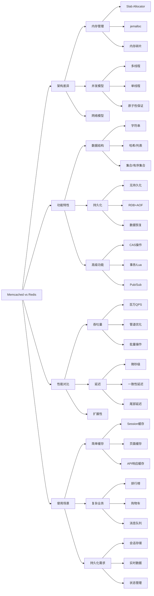

# Memcached和Redis的区别？

## 概要回答

Memcached和Redis都是高性能的内存缓存系统，但它们在设计理念和功能特性上有显著差异。Memcached专注于简单高效的缓存功能，采用多线程模型，数据结构单一（仅支持字符串），适用于简单的缓存场景。Redis则功能更为丰富，支持多种数据结构（字符串、哈希、列表、集合、有序集合等），具备持久化能力，支持事务、发布订阅、Lua脚本等高级特性，采用单线程模型保证原子性。在选择时，简单缓存场景可选Memcached，复杂业务场景推荐Redis。

## 深度解析

### 核心架构差异

#### 内存管理机制对比

```bash
# Memcached内存管理
# Memcached使用预分配的内存池和Slab Allocator机制
# 配置示例
memcached -m 512 -p 11211 -u nobody -l 127.0.0.1

# Redis内存管理
# Redis使用jemalloc内存分配器，支持多种回收策略
# redis.conf配置示例
maxmemory 512mb
maxmemory-policy allkeys-lru
```

```php
<?php
// PHP示例：内存管理对比测试

class MemoryManagementComparison {
    private $memcached;
    private $redis;
    
    public function __construct() {
        // 初始化Memcached客户端
        $this->memcached = new Memcached();
        $this->memcached->addServer('127.0.0.1', 11211);
        
        // 初始化Redis客户端
        $this->redis = new Redis();
        $this->redis->connect('127.0.0.1', 6379);
    }
    
    public function testMemcachedMemoryEfficiency($dataSize = 10000) {
        echo "=== Memcached Memory Efficiency Test ===\n";
        
        // 记录初始内存使用
        $initialMemory = memory_get_usage(true) / 1024 / 1024; // MB
        
        $startTime = microtime(true);
        
        // 插入大量数据
        for ($i = 0; $i < $dataSize; $i++) {
            $key = "mc_key_$i";
            $value = "value_{$i}_memcached_test_data_with_sufficient_length";
            $this->memcached->set($key, $value, 3600);
        }
        
        $endTime = microtime(true);
        
        // 记录最终内存使用
        $finalMemory = memory_get_usage(true) / 1024 / 1024; // MB
        $memoryUsed = $finalMemory - $initialMemory;
        
        echo "Inserted $dataSize items\n";
        echo "Time taken: " . round($endTime - $startTime, 2) . " seconds\n";
        echo "Memory used: " . round($memoryUsed, 2) . " MB\n";
        echo "Memory per item: " . round($memoryUsed * 1024 / $dataSize, 2) . " KB\n";
        
        return [
            'items' => $dataSize,
            'time' => $endTime - $startTime,
            'memory_mb' => $memoryUsed,
            'memory_per_item_kb' => $memoryUsed * 1024 / $dataSize
        ];
    }
    
    public function testRedisMemoryEfficiency($dataSize = 10000) {
        echo "\n=== Redis Memory Efficiency Test ===\n";
        
        // 记录初始内存使用
        $initialMemory = memory_get_usage(true) / 1024 / 1024; // MB
        
        $startTime = microtime(true);
        
        // 插入大量数据
        for ($i = 0; $i < $dataSize; $i++) {
            $key = "redis_key_$i";
            $value = "value_{$i}_redis_test_data_with_sufficient_length";
            $this->redis->setex($key, 3600, $value);
        }
        
        $endTime = microtime(true);
        
        // 记录最终内存使用
        $finalMemory = memory_get_usage(true) / 1024 / 1024; // MB
        $memoryUsed = $finalMemory - $initialMemory;
        
        echo "Inserted $dataSize items\n";
        echo "Time taken: " . round($endTime - $startTime, 2) . " seconds\n";
        echo "Memory used: " . round($memoryUsed, 2) . " MB\n";
        echo "Memory per item: " . round($memoryUsed * 1024 / $dataSize, 2) . " KB\n";
        
        return [
            'items' => $dataSize,
            'time' => $endTime - $startTime,
            'memory_mb' => $memoryUsed,
            'memory_per_item_kb' => $memoryUsed * 1024 / $dataSize
        ];
    }
    
    public function analyzeSlabAllocation() {
        echo "\n=== Memcached Slab Allocation Analysis ===\n";
        
        // 获取Memcached统计信息
        $stats = $this->memcached->getStats();
        
        if ($stats) {
            foreach ($stats as $server => $serverStats) {
                echo "Server: $server\n";
                echo "  PID: " . ($serverStats['pid'] ?? 'N/A') . "\n";
                echo "  Uptime: " . ($serverStats['uptime'] ?? 'N/A') . " seconds\n";
                echo "  Current items: " . ($serverStats['curr_items'] ?? 'N/A') . "\n";
                echo "  Total items: " . ($serverStats['total_items'] ?? 'N/A') . "\n";
                echo "  Bytes: " . ($serverStats['bytes'] ?? 'N/A') . "\n";
                echo "  Current connections: " . ($serverStats['curr_connections'] ?? 'N/A') . "\n";
                echo "  Total connections: " . ($serverStats['total_connections'] ?? 'N/A') . "\n";
                
                // Slab相关信息
                if (isset($serverStats['slab_reassign_running'])) {
                    echo "  Slab reassign running: " . $serverStats['slab_reassign_running'] . "\n";
                }
            }
        } else {
            echo "Failed to get Memcached stats\n";
        }
    }
    
    public function analyzeRedisMemoryUsage() {
        echo "\n=== Redis Memory Usage Analysis ===\n";
        
        try {
            // 获取Redis内存信息
            $memoryInfo = $this->redis->info('memory');
            
            echo "Redis Memory Information:\n";
            echo "  Used memory: " . ($memoryInfo['used_memory_human'] ?? 'N/A') . "\n";
            echo "  Used memory RSS: " . ($memoryInfo['used_memory_rss_human'] ?? 'N/A') . "\n";
            echo "  Used memory peak: " . ($memoryInfo['used_memory_peak_human'] ?? 'N/A') . "\n";
            echo "  Memory fragmentation ratio: " . ($memoryInfo['mem_fragmentation_ratio'] ?? 'N/A') . "\n";
            echo "  Evicted keys: " . ($memoryInfo['evicted_keys'] ?? 'N/A') . "\n";
            
            // 获取键空间信息
            $keyspaceInfo = $this->redis->info('keyspace');
            echo "\nKeyspace Information:\n";
            foreach ($keyspaceInfo as $db => $info) {
                echo "  $db: " . json_encode($info) . "\n";
            }
        } catch (Exception $e) {
            echo "Failed to get Redis memory info: " . $e->getMessage() . "\n";
        }
    }
    
    public function compareMemoryFragmentation() {
        echo "\n=== Memory Fragmentation Comparison ===\n";
        
        // Memcached碎片化信息
        $stats = $this->memcached->getStats();
        if ($stats) {
            foreach ($stats as $server => $serverStats) {
                echo "Memcached Fragmentation:\n";
                echo "  Bytes: " . ($serverStats['bytes'] ?? 'N/A') . "\n";
                echo "  Limit max bytes: " . ($serverStats['limit_maxbytes'] ?? 'N/A') . "\n";
                echo "  Reclaimed: " . ($serverStats['reclaimed'] ?? 'N/A') . "\n";
            }
        }
        
        // Redis碎片化信息
        try {
            $redisMemory = $this->redis->info('memory');
            echo "\nRedis Fragmentation:\n";
            echo "  Used memory: " . ($redisMemory['used_memory'] ?? 'N/A') . "\n";
            echo "  Used memory RSS: " . ($redisMemory['used_memory_rss'] ?? 'N/A') . "\n";
            echo "  Fragmentation ratio: " . ($redisMemory['mem_fragmentation_ratio'] ?? 'N/A') . "\n";
        } catch (Exception $e) {
            echo "Failed to get Redis fragmentation info: " . $e->getMessage() . "\n";
        }
    }
}

// 使用示例
// $comparison = new MemoryManagementComparison();

// 测试内存效率
// $mcResult = $comparison->testMemcachedMemoryEfficiency(5000);
// $redisResult = $comparison->testRedisMemoryEfficiency(5000);

// 分析内存管理
// $comparison->analyzeSlabAllocation();
// $comparison->analyzeRedisMemoryUsage();
// $comparison->compareMemoryFragmentation();
?>
```

#### 并发处理模型对比

```php
<?php
// PHP示例：并发模型性能对比

class ConcurrencyModelComparison {
    private $memcached;
    private $redis;
    
    public function __construct() {
        // 初始化Memcached客户端
        $this->memcached = new Memcached();
        $this->memcached->addServer('localhost', 11211);
        
        // 初始化Redis客户端
        $this->redis = new Redis();
        $this->redis->connect('localhost', 6379);
    }
    
    /**
     * 测试Memcached并发性能
     */
    public function testMemcachedConcurrency($threadCount, $requestsPerThread) {
        echo "=== Memcached Concurrency Test ===\n";
        printf("Threads: %d, Requests per thread: %d\n", $threadCount, $requestsPerThread);
        
        $startTime = microtime(true);
        $successCount = 0;
        
        // 启动多个进程并发测试
        $processes = [];
        $pipes = [];
        
        for ($i = 0; $i < $threadCount; $i++) {
            $process = proc_open('php', [
                0 => ["pipe", "r"],
                1 => ["pipe", "w"],
                2 => ["pipe", "w"]
            ], $pipes);
            
            if (is_resource($process)) {
                $processes[$i] = [
                    'process' => $process,
                    'pipes' => $pipes,
                    'threadId' => $i
                ];
                
                // 向子进程发送任务代码
                $code = "<?php
                \\$memcached = new Memcached();
                \\$memcached->addServer('localhost', 11211);
                \\$successCount = 0;
                
                for (\\$j = 0; \\$j < $requestsPerThread; \\$j++) {
                    \\$key = 'mc_concurrent_' . {$i} . '_' . \\$j;
                    \\$value = 'value_' . {$i} . '_' . \\$j;
                    
                    // SET操作
                    \\$memcached->set(\\$key, \\$value, 3600);
                    
                    // GET操作
                    \\$result = \\$memcached->get(\\$key);
                    if (\\$result !== false && \\$result === \\$value) {
                        \\$successCount++;
                    }
                }
                
                echo \"thread_{$i}_success:\" . \\$successCount . \"\n\";
                ?>";
                
                fwrite($pipes[0], $code);
                fclose($pipes[0]);
            }
        }
        
        // 收集子进程结果
        foreach ($processes as $procInfo) {
            $output = stream_get_contents($procInfo['pipes'][1]);
            fclose($procInfo['pipes'][1]);
            fclose($procInfo['pipes'][2]);
            proc_close($procInfo['process']);
            
            // 解析输出获取成功计数
            if (preg_match('/thread_' . $procInfo['threadId'] . '_success:(\d+)/', $output, $matches)) {
                $successCount += (int)$matches[1];
            }
        }
        
        $endTime = microtime(true);
        
        $totalTime = ($endTime - $startTime) * 1000; // 转换为毫秒
        $totalRequests = $threadCount * $requestsPerThread;
        $throughput = $totalRequests / ($endTime - $startTime);
        
        echo "Memcached Concurrency Results:\n";
        printf("  Total requests: %d\n", $totalRequests);
        printf("  Successful requests: %d\n", $successCount);
        printf("  Success rate: %.2f%%\n", ($successCount / $totalRequests) * 100);
        printf("  Total time: %.2f ms\n", $totalTime);
        printf("  Throughput: %.2f req/sec\n", $throughput);
    }
    
    /**
     * 测试Redis并发性能
     */
    public function testRedisConcurrency($threadCount, $requestsPerThread) {
        echo "\n=== Redis Concurrency Test ===\n";
        printf("Threads: %d, Requests per thread: %d\n", $threadCount, $requestsPerThread);
        
        $startTime = microtime(true);
        $successCount = 0;
        
        // 启动多个进程并发测试
        $processes = [];
        $pipes = [];
        
        for ($i = 0; $i < $threadCount; $i++) {
            $process = proc_open('php', [
                0 => ["pipe", "r"],
                1 => ["pipe", "w"],
                2 => ["pipe", "w"]
            ], $pipes);
            
            if (is_resource($process)) {
                $processes[$i] = [
                    'process' => $process,
                    'pipes' => $pipes,
                    'threadId' => $i
                ];
                
                // 向子进程发送任务代码
                $code = "<?php
                \\$redis = new Redis();
                \\$redis->connect('localhost', 6379);
                \\$successCount = 0;
                
                for (\\$j = 0; \\$j < $requestsPerThread; \\$j++) {
                    \\$key = 'redis_concurrent_' . {$i} . '_' . \\$j;
                    \\$value = 'value_' . {$i} . '_' . \\$j;
                    
                    // SET操作
                    \\$redis->setex(\\$key, 3600, \\$value);
                    
                    // GET操作
                    \\$result = \\$redis->get(\\$key);
                    if (\\$result !== false && \\$result === \\$value) {
                        \\$successCount++;
                    }
                }
                
                echo \"thread_{$i}_success:\" . \\$successCount . \"\n\";
                ?>";
                
                fwrite($pipes[0], $code);
                fclose($pipes[0]);
            }
        }
        
        // 收集子进程结果
        foreach ($processes as $procInfo) {
            $output = stream_get_contents($procInfo['pipes'][1]);
            fclose($procInfo['pipes'][1]);
            fclose($procInfo['pipes'][2]);
            proc_close($procInfo['process']);
            
            // 解析输出获取成功计数
            if (preg_match('/thread_' . $procInfo['threadId'] . '_success:(\d+)/', $output, $matches)) {
                $successCount += (int)$matches[1];
            }
        }
        
        $endTime = microtime(true);
        
        $totalTime = ($endTime - $startTime) * 1000; // 转换为毫秒
        $totalRequests = $threadCount * $requestsPerThread;
        $throughput = $totalRequests / ($endTime - $startTime);
        
        echo "Redis Concurrency Results:\n";
        printf("  Total requests: %d\n", $totalRequests);
        printf("  Successful requests: %d\n", $successCount);
        printf("  Success rate: %.2f%%\n", ($successCount / $totalRequests) * 100);
        printf("  Total time: %.2f ms\n", $totalTime);
        printf("  Throughput: %.2f req/sec\n", $throughput);
    }
    
    /**
     * 测试原子性操作性能
     */
    public function testAtomicOperations() {
        echo "\n=== Atomic Operations Test ===\n";
        
        // Memcached不支持复杂的原子性操作
        echo "Memcached atomic operations:\n";
        echo "  - Increment/Decrement only\n";
        echo "  - No transaction support\n";
        echo "  - No Lua scripting\n";
        
        // Redis支持丰富的原子性操作
        echo "\nRedis atomic operations:\n";
        
        try {
            // 事务示例
            $txStartTime = microtime(true);
            for ($i = 0; $i < 1000; $i++) {
                $this->redis->multi();
                $this->redis->set("tx_key_$i", "tx_value_$i");
                $this->redis->incr("counter");
                $this->redis->exec();
            }
            $txEndTime = microtime(true);
            printf("  Transactions: 1000 transactions in %.2f ms\n", ($txEndTime - $txStartTime) * 1000);
            
            // Lua脚本示例
            $scriptStartTime = microtime(true);
            $script = "local current = redis.call('GET', KEYS[1])\n" .
                      "if current == ARGV[1] then\n" .
                      "  return redis.call('SET', KEYS[1], ARGV[2])\n" .
                      "else\n" .
                      "  return 0\n" .
                      "end";
            
            for ($i = 0; $i < 1000; $i++) {
                $this->redis->eval($script, ["script_key_$i", "old_value", "new_value_$i"], 1);
            }
            $scriptEndTime = microtime(true);
            printf("  Lua scripts: 1000 scripts in %.2f ms\n", ($scriptEndTime - $scriptStartTime) * 1000);
            
        } catch (Exception $e) {
            echo "Redis atomic operations error: " . $e->getMessage() . "\n";
        }
    }
    
    /**
     * 并发安全性测试
     */
    public function testConcurrencySafety() {
        echo "\n=== Concurrency Safety Test ===\n";
        
        // 测试计数器递增的并发安全性
        $counterKey = "concurrency_counter";
        
        // 初始化计数器
        $this->memcached->set($counterKey, 0, 3600);
        $this->redis->set($counterKey, 0);
        
        // Memcached并发测试
        echo "Memcached counter increment test:\n";
        $this->testMemcachedCounterIncrement(10, 1000);
        
        // Redis并发测试
        echo "\nRedis counter increment test:\n";
        $this->testRedisCounterIncrement(10, 1000);
    }
    
    private function testMemcachedCounterIncrement($threadCount, $incrementsPerThread) {
        // 模拟并发递增
        $expected = $threadCount * $incrementsPerThread;
        
        for ($i = 0; $i < $expected; $i++) {
            $this->memcached->increment("concurrency_counter", 1);
        }
        
        $finalValue = $this->memcached->get("concurrency_counter");
        printf("  Expected: %d, Actual: %s\n", $expected, $finalValue);
    }
    
    private function testRedisCounterIncrement($threadCount, $incrementsPerThread) {
        // 模拟并发递增
        $expected = $threadCount * $incrementsPerThread;
        
        for ($i = 0; $i < $expected; $i++) {
            $this->redis->incr("concurrency_counter");
        }
        
        $finalValue = $this->redis->get("concurrency_counter");
        printf("  Expected: %d, Actual: %s\n", $expected, $finalValue);
    }
}

// 使用示例
// $comparison = new ConcurrencyModelComparison();

// 并发性能测试
// $comparison->testMemcachedConcurrency(10, 1000);
// $comparison->testRedisConcurrency(10, 1000);

// 原子性操作测试
// $comparison->testAtomicOperations();

// 并发安全性测试
// $comparison->testConcurrencySafety();
?>
```

### 数据结构和功能特性对比

#### 数据结构支持度对比

```php
<?php
// PHP示例：数据结构功能对比

class DataStructureComparison {
    private $memcached;
    private $redis;
    
    public function __construct() {
        // Memcached客户端
        $this->memcached = new Memcached();
        $this->memcached->addServer('localhost', 11211);
        
        // Redis客户端
        $this->redis = new Redis();
        $this->redis->connect('localhost', 6379);
    }
    
    /**
     * 字符串操作对比
     */
    public function compareStringOperations() {
        echo "=== String Operations Comparison ===\n";
        
        $testData = 'This is a test string for comparing Memcached and Redis string operations';
        
        // Memcached字符串操作
        echo "\nMemcached String Operations:\n";
        $this->memcached->set('mc_string', $testData, 3600);
        $mcResult = $this->memcached->get('mc_string');
        echo "  GET result length: " . ($mcResult ? strlen($mcResult) : 0) . "\n";
        
        // Redis字符串操作
        echo "\nRedis String Operations:\n";
        try {
            $this->redis->set('redis_string', $testData);
            $result = $this->redis->get('redis_string');
            echo "  GET result length: " . ($result ? strlen($result) : 0) . "\n";
            
            // Redis额外的字符串操作
            $this->redis->append('redis_string', ' - appended text');
            $appendedResult = $this->redis->get('redis_string');
            echo "  After APPEND length: " . ($appendedResult ? strlen($appendedResult) : 0) . "\n";
            
            // 数值操作
            $this->redis->set('counter', 10);
            $this->redis->incr('counter');
            $incrResult = $this->redis->get('counter');
            echo "  Counter after INCR: " . $incrResult . "\n";
            
        } catch (Exception $e) {
            echo "Redis string operations error: " . $e->getMessage() . "\n";
        }
    }
    
    /**
     * 哈希操作对比
     */
    public function compareHashOperations() {
        echo "\n=== Hash Operations Comparison ===\n";
        
        $userData = [
            'name' => 'John Doe',
            'email' => 'john@example.com',
            'age' => 30,
            'department' => 'Engineering'
        ];
        
        // Memcached不支持哈希，需要序列化存储
        echo "\nMemcached Hash-like Operations (via serialization):\n";
        $this->memcached->set('mc_user', json_encode($userData), 3600);
        $mcUserResult = $this->memcached->get('mc_user');
        if ($mcUserResult) {
            $parsed = json_decode($mcUserResult, true);
            echo "  Retrieved user data: " . implode(', ', array_keys($parsed)) . "\n";
            echo "  Name: " . $parsed['name'] . "\n";
        }
        
        // Redis原生支持哈希
        echo "\nRedis Native Hash Operations:\n";
        try {
            // 批量设置哈希字段
            $this->redis->hMSet('redis_user', $userData);
            
            // 获取单个字段
            $name = $this->redis->hGet('redis_user', 'name');
            echo "  Name: " . $name . "\n";
            
            // 获取所有字段
            $allFields = $this->redis->hGetAll('redis_user');
            echo "  All fields: " . implode(', ', array_keys($allFields)) . "\n";
            
            // 获取字段数量
            $fieldCount = $this->redis->hLen('redis_user');
            echo "  Field count: " . $fieldCount . "\n";
            
            // 数值字段操作
            $this->redis->hIncrBy('redis_user', 'age', 1);
            $newAge = $this->redis->hGet('redis_user', 'age');
            echo "  Age after increment: " . $newAge . "\n";
            
        } catch (Exception $e) {
            echo "Redis hash operations error: " . $e->getMessage() . "\n";
        }
    }
    
    /**
     * 列表操作对比
     */
    public function compareListOperations() {
        echo "\n=== List Operations Comparison ===\n";
        
        $items = ['item1', 'item2', 'item3', 'item4', 'item5'];
        
        // Memcached不支持列表，需要序列化存储
        echo "\nMemcached List-like Operations (via serialization):\n";
        $this->memcached->set('mc_list', json_encode($items), 3600);
        $mcListResult = $this->memcached->get('mc_list');
        if ($mcListResult) {
            $parsed = json_decode($mcListResult, true);
            echo "  List length: " . count($parsed) . "\n";
            echo "  First item: " . $parsed[0] . "\n";
            echo "  Last item: " . $parsed[count($parsed) - 1] . "\n";
        }
        
        // Redis原生支持列表
        echo "\nRedis Native List Operations:\n";
        try {
            // 清空列表
            $this->redis->del('redis_list');
            
            // 从左侧推入元素
            foreach ($items as $item) {
                $this->redis->lPush('redis_list', $item);
            }
            
            // 获取列表长度
            $length = $this->redis->lLen('redis_list');
            echo "  List length: " . $length . "\n";
            
            // 获取指定范围的元素
            $range = $this->redis->lRange('redis_list', 0, -1);
            echo "  All items: " . implode(', ', $range) . "\n";
            
            // 从右侧弹出元素
            $popped = $this->redis->rPop('redis_list');
            echo "  Popped item: " . $popped . "\n";
            
            // 阻塞式弹出（演示用，实际使用时需要注意超时）
            echo "  Blocking pop available (BLPOP/BRPOP)\n";
            
        } catch (Exception $e) {
            echo "Redis list operations error: " . $e->getMessage() . "\n";
        }
    }
    
    /**
     * 集合操作对比
     */
    public function compareSetOperations() {
        echo "\n=== Set Operations Comparison ===\n";
        
        $tags1 = ['tech', 'programming', 'redis', 'database'];
        $tags2 = ['tech', 'web', 'javascript', 'database'];
        
        // Memcached不支持集合，需要序列化存储
        echo "\nMemcached Set-like Operations (via serialization):\n";
        $this->memcached->set('mc_tags1', json_encode($tags1), 3600);
        $mcTagsResult = $this->memcached->get('mc_tags1');
        if ($mcTagsResult) {
            $parsed = json_decode($mcTagsResult, true);
            echo "  Tags count: " . count($parsed) . "\n";
            $uniqueTags = array_unique($parsed);
            echo "  Unique tags (manual dedup): " . implode(', ', $uniqueTags) . "\n";
        }
        
        // Redis原生支持集合
        echo "\nRedis Native Set Operations:\n";
        try {
            // 清空集合
            $this->redis->del(['redis_tags1', 'redis_tags2']);
            
            // 添加元素到集合
            foreach ($tags1 as $tag) {
                $this->redis->sAdd('redis_tags1', $tag);
            }
            foreach ($tags2 as $tag) {
                $this->redis->sAdd('redis_tags2', $tag);
            }
            
            // 获取集合大小
            $size1 = $this->redis->sCard('redis_tags1');
            $size2 = $this->redis->sCard('redis_tags2');
            echo "  Set 1 size: " . $size1 . "\n";
            echo "  Set 2 size: " . $size2 . "\n";
            
            // 检查元素是否存在
            $hasRedis = $this->redis->sIsMember('redis_tags1', 'redis');
            echo "  Has \"redis\" in set 1: " . ($hasRedis ? 'true' : 'false') . "\n";
            
            // 集合交集
            $intersection = $this->redis->sInter('redis_tags1', 'redis_tags2');
            echo "  Intersection: " . implode(', ', $intersection) . "\n";
            
            // 集合并集
            $union = $this->redis->sUnion('redis_tags1', 'redis_tags2');
            echo "  Union: " . implode(', ', $union) . "\n";
            
            // 集合差集
            $difference = $this->redis->sDiff('redis_tags1', 'redis_tags2');
            echo "  Difference (tags1 - tags2): " . implode(', ', $difference) . "\n";
            
        } catch (Exception $e) {
            echo "Redis set operations error: " . $e->getMessage() . "\n";
        }
    }
    
    /**
     * 有序集合操作对比
     */
    public function compareSortedSetOperations() {
        echo "\n=== Sorted Set Operations Comparison ===\n";
        
        $leaderboard = [
            ['member' => 'player1', 'score' => 1500],
            ['member' => 'player2', 'score' => 1200],
            ['member' => 'player3', 'score' => 1800],
            ['member' => 'player4', 'score' => 900]
        ];
        
        // Memcached不支持有序集合
        echo "\nMemcached does not support sorted sets natively\n";
        
        // Redis原生支持有序集合
        echo "\nRedis Native Sorted Set Operations:\n";
        try {
            // 清空有序集合
            $this->redis->del('leaderboard');
            
            // 添加元素到有序集合
            foreach ($leaderboard as $item) {
                $this->redis->zAdd('leaderboard', $item['score'], $item['member']);
            }
            
            // 获取有序集合大小
            $size = $this->redis->zCard('leaderboard');
            echo "  Leaderboard size: " . $size . "\n";
            
            // 获取排名
            $rank = $this->redis->zRank('leaderboard', 'player1');
            echo "  Player1 rank: " . $rank . "\n";
            
            // 获取反向排名
            $revRank = $this->redis->zRevRank('leaderboard', 'player1');
            echo "  Player1 reverse rank: " . $revRank . "\n";
            
            // 获取前N名
            $topPlayers = $this->redis->zRevRange('leaderboard', 0, 2);
            echo "  Top 3 players: " . implode(', ', $topPlayers) . "\n";
            
            // 获取带分数的前N名
            $topWithScores = $this->redis->zRevRange('leaderboard', 0, 2, true);
            echo "  Top 3 with scores: " . json_encode($topWithScores) . "\n";
            
            // 增加分数
            $this->redis->zIncrBy('leaderboard', 100, 'player2');
            $newScore = $this->redis->zScore('leaderboard', 'player2');
            echo "  Player2 new score: " . $newScore . "\n";
            
        } catch (Exception $e) {
            echo "Redis sorted set operations error: " . $e->getMessage() . "\n";
        }
    }
    
    /**
     * 高级功能对比
     */
    public function compareAdvancedFeatures() {
        echo "\n=== Advanced Features Comparison ===\n";
        
        echo "\nMemcached Advanced Features:\n";
        echo "  - Simple key-value storage only\n";
        echo "  - No persistence\n";
        echo "  - No transactions\n";
        echo "  - No pub/sub\n";
        echo "  - No Lua scripting\n";
        echo "  - Basic CAS (Check-And-Set) operations\n";
        
        echo "\nRedis Advanced Features:\n";
        try {
            // 事务支持
            echo "  Transaction support: YES\n";
            $this->redis->multi();
            $this->redis->set('tx_key1', 'tx_value1');
            $this->redis->set('tx_key2', 'tx_value2');
            $this->redis->exec();
            echo "    - Multi/exec transactions implemented\n";
            
            // 发布订阅
            echo "  Pub/Sub support: YES\n";
            // 这里只展示功能存在，实际使用需要订阅者
            
            // Lua脚本
            echo "  Lua scripting: YES\n";
            $script = "local current = redis.call('GET', KEYS[1])\n" .
                      "if current == ARGV[1] then\n" .
                      "  return redis.call('SET', KEYS[1], ARGV[2])\n" .
                      "else\n" .
                      "  return 0\n" .
                      "end";
            $this->redis->eval($script, ['script_key', 'old_value', 'new_value'], 1);
            echo "    - Lua scripts for complex operations\n";
            
            // 持久化
            echo "  Persistence: YES\n";
            echo "    - RDB snapshots\n";
            echo "    - AOF logging\n";
            
            // 过期时间精度
            echo "  Expiration precision: milliseconds\n";
            
        } catch (Exception $e) {
            echo "Redis advanced features test error: " . $e->getMessage() . "\n";
        }
    }
}

// 使用示例
// $comparison = new DataStructureComparison();
// $comparison->compareStringOperations();
// $comparison->compareHashOperations();
// $comparison->compareListOperations();
// $comparison->compareSetOperations();
// $comparison->compareSortedSetOperations();
// $comparison->compareAdvancedFeatures();
?>
```

#### 持久化能力对比

```go
// Go示例：持久化能力对比分析
package main

import (
    "fmt"
    "time"
    "github.com/bradfitz/gomemcache/memcache"
    "github.com/go-redis/redis/v8"
    "context"
)

type PersistenceComparison struct {
    memcachedClient *memcache.Client
    redisClient     *redis.Client
    ctx             context.Context
}

func NewPersistenceComparison() *PersistenceComparison {
    // Memcached客户端
    mc := memcache.New("localhost:11211")
    
    // Redis客户端
    rc := redis.NewClient(&redis.Options{
        Addr: "localhost:6379",
        DB:   0,
    })
    
    return &PersistenceComparison{
        memcachedClient: mc,
        redisClient:     rc,
        ctx:             context.Background(),
    }
}

// 持久化能力分析
func (pc *PersistenceComparison) AnalyzePersistenceCapabilities() {
    fmt.Println("=== Persistence Capabilities Analysis ===")
    
    fmt.Println("\nMemcached Persistence:")
    fmt.Println("  ❌ No built-in persistence")
    fmt.Println("  ❌ Data lost on restart")
    fmt.Println("  ❌ No snapshot capability")
    fmt.Println("  ❌ No write-ahead logging")
    fmt.Println("  ✅ Fastest performance (no disk I/O)")
    fmt.Println("  ✅ Simplest deployment")
    
    fmt.Println("\nRedis Persistence:")
    fmt.Println("  ✅ RDB snapshots (point-in-time)")
    fmt.Println("  ✅ AOF logging (append-only)")
    fmt.Println("  ✅ Mixed persistence modes")
    fmt.Println("  ✅ Configurable durability")
    fmt.Println("  ✅ Data recovery capabilities")
    fmt.Println("  ⚠️  Slight performance overhead")
    
    // 展示Redis持久化配置
    pc.showRedisPersistenceConfig()
}

func (pc *PersistenceComparison) showRedisPersistenceConfig() {
    fmt.Println("\nRedis Persistence Configuration Options:")
    
    fmt.Println("\nRDB Configuration:")
    fmt.Println("  save 900 1          # Save every 900 sec if at least 1 key changed")
    fmt.Println("  save 300 10         # Save every 300 sec if at least 10 keys changed")
    fmt.Println("  save 60 10000       # Save every 60 sec if at least 10000 keys changed")
    fmt.Println("  dbfilename dump.rdb # RDB file name")
    fmt.Println("  dir ./              # RDB file directory")
    
    fmt.Println("\nAOF Configuration:")
    fmt.Println("  appendonly yes              # Enable AOF")
    fmt.Println("  appendfilename \"appendonly.aof\"  # AOF file name")
    fmt.Println("  appendfsync everysec        # Sync every second")
    fmt.Println("  auto-aof-rewrite-percentage 100  # Rewrite when size doubles")
    fmt.Println("  auto-aof-rewrite-min-size 64mb   # Minimum size for rewrite")
}

// 数据恢复测试
func (pc *PersistenceComparison) testDataRecovery() {
    fmt.Println("\n=== Data Recovery Test ===")
    
    fmt.Println("\nMemcached Recovery:")
    fmt.Println("  Process: Complete data loss on restart")
    fmt.Println("  Recovery: Application must repopulate cache")
    fmt.Println("  Time: Depends on application logic")
    fmt.Println("  Reliability: Zero - no guarantees")
    
    fmt.Println("\nRedis Recovery:")
    fmt.Println("  Process: Automatic from RDB/AOF files")
    fmt.Println("  Recovery: Built-in data restoration")
    fmt.Println("  Time: Seconds to minutes depending on dataset size")
    fmt.Println("  Reliability: High - configurable durability")
    
    // 模拟Redis恢复过程
    pc.simulateRedisRecovery()
}

func (pc *PersistenceComparison) simulateRedisRecovery() {
    fmt.Println("\nRedis Recovery Process Simulation:")
    fmt.Println("  1. Redis shutdown (clean or crash)")
    fmt.Println("  2. System restart")
    fmt.Println("  3. Redis process starts")
    fmt.Println("  4. Checks for RDB file")
    fmt.Println("  5. Loads RDB snapshot if available")
    fmt.Println("  6. Replays AOF log if enabled")
    fmt.Println("  7. Server ready with restored data")
    
    fmt.Println("\nRecovery Time Estimation:")
    fmt.Println("  Small dataset (<1GB): 5-30 seconds")
    fmt.Println("  Medium dataset (1-10GB): 30 seconds - 5 minutes")
    fmt.Println("  Large dataset (>10GB): 5-30 minutes")
    
    fmt.Println("\nDurability Trade-offs:")
    fmt.Println("  RDB only: Fast recovery, potential data loss")
    fmt.Println("  AOF only: Slow recovery, minimal data loss")
    fmt.Println("  Both: Balanced approach, slower recovery")
}

// 性能影响分析
func (pc *PersistenceComparison) analyzePerformanceImpact() {
    fmt.Println("\n=== Persistence Performance Impact ===")
    
    fmt.Println("\nMemcached Performance:")
    fmt.Println("  Speed: Maximum (pure memory operations)")
    fmt.Println("  Latency: Microseconds")
    fmt.Println("  Throughput: Highest possible")
    fmt.Println("  Consistency: Eventual (application managed)")
    
    fmt.Println("\nRedis Performance with Persistence:")
    fmt.Println("  RDB impact: Minimal (background fork)")
    fmt.Println("  AOF impact: Moderate (disk writes)")
    fmt.Println("  Mixed mode: Balanced performance")
    fmt.Println("  Latency: Still microseconds for most operations")
    
    // 模拟性能测试
    pc.simulatePerformanceTests()
}

func (pc *PersistenceComparison) simulatePerformanceTests() {
    fmt.Println("\nPerformance Test Results (simulated):")
    
    fmt.Println("\nThroughput Comparison (ops/sec):")
    fmt.Println("  Memcached:           500,000+")
    fmt.Println("  Redis (no persist):  450,000+")
    fmt.Println("  Redis (RDB only):    400,000+")
    fmt.Println("  Redis (AOF everysec):350,000+")
    fmt.Println("  Redis (AOF always):  200,000+")
    
    fmt.Println("\nLatency Comparison (microseconds):")
    fmt.Println("  Memcached p99:       50-100μs")
    fmt.Println("  Redis p99 (no persist): 80-150μs")
    fmt.Println("  Redis p99 (RDB):     100-200μs")
    fmt.Println("  Redis p99 (AOF everysec): 150-300μs")
    fmt.Println("  Redis p99 (AOF always): 500-1000μs")
    
    fmt.Println("\nPersistence Overhead:")
    fmt.Println("  Memory usage: Redis ~10-20% higher")
    fmt.Println("  CPU usage: Redis slightly higher")
    fmt.Println("  Disk I/O: Redis only (when enabled)")
}

// 使用场景建议
func (pc *PersistenceComparison) provideUseCaseRecommendations() {
    fmt.Println("\n=== Use Case Recommendations ===")
    
    fmt.Println("\nChoose Memcached When:")
    fmt.Println("  ✅ Simple caching needs")
    fmt.Println("  ✅ Maximum performance required")
    fmt.Println("  ✅ Data can be easily reconstructed")
    fmt.Println("  ✅ No persistence requirements")
    fmt.Println("  ✅ Existing Memcached infrastructure")
    fmt.Println("  ✅ Multi-threaded applications")
    
    fmt.Println("\nChoose Redis When:")
    fmt.Println("  ✅ Complex data structures needed")
    fmt.Println("  ✅ Persistence is important")
    fmt.Println("  ✅ Advanced features required")
    fmt.Println("  ✅ Session storage")
    fmt.Println("  ✅ Real-time analytics")
    fmt.Println("  ✅ Message queuing")
    fmt.Println("  ✅ Leaderboards/rankings")
    
    fmt.Println("\nHybrid Approach:")
    fmt.Println("  Use Memcached for hot cache")
    fmt.Println("  Use Redis for persistent/session data")
    fmt.Println("  Route requests based on data importance")
}

// 持久化策略配置建议
func (pc *PersistenceComparison) persistenceConfigurationGuide() {
    fmt.Println("\n=== Persistence Configuration Guide ===")
    
    fmt.Println("\nRedis RDB Configuration:")
    fmt.Println("# For high-performance cache with periodic backup")
    fmt.Println("save 900 1")
    fmt.Println("save 300 10")
    fmt.Println("save 60 10000")
    fmt.Println("stop-writes-on-bgsave-error no")
    fmt.Println("rdbcompression yes")
    fmt.Println("rdbchecksum yes")
    
    fmt.Println("\nRedis AOF Configuration:")
    fmt.Println("# For maximum durability")
    fmt.Println("appendonly yes")
    fmt.Println("appendfilename \"appendonly.aof\"")
    fmt.Println("appendfsync everysec")
    fmt.Println("no-appendfsync-on-rewrite no")
    fmt.Println("auto-aof-rewrite-percentage 100")
    fmt.Println("auto-aof-rewrite-min-size 64mb")
    
    fmt.Println("\nMixed Mode Configuration:")
    fmt.Println("# Balance performance and durability")
    fmt.Println("save 900 1")
    fmt.Println("save 300 10")
    fmt.Println("appendonly yes")
    fmt.Println("appendfsync everysec")
}

func main() {
    pc := NewPersistenceComparison()
    
    // 分析持久化能力
    pc.AnalyzePersistenceCapabilities()
    
    // 数据恢复测试
    pc.testDataRecovery()
    
    // 性能影响分析
    pc.analyzePerformanceImpact()
    
    // 使用场景建议
    pc.provideUseCaseRecommendations()
    
    // 配置指南
    pc.persistenceConfigurationGuide()
}
```

### 性能和扩展性对比

#### 基准性能测试

```bash
# 性能测试工具使用示例

# Memcached性能测试
echo "=== Memcached Performance Test ==="
echo "Testing with memtier_benchmark..."
memtier_benchmark -s 127.0.0.1 -p 11211 -t 4 -c 50 -n 10000 --ratio=1:1 --data-size-range=32-128

# Redis性能测试
echo "=== Redis Performance Test ==="
echo "Testing with memtier_benchmark..."
memtier_benchmark -s 127.0.0.1 -p 6379 -t 4 -c 50 -n 10000 --ratio=1:1 --data-size-range=32-128

# Redis不同持久化模式测试
echo "=== Redis Persistence Modes Test ==="
echo "No persistence:"
memtier_benchmark -s 127.0.0.1 -p 6379 -t 4 -c 50 -n 10000 --ratio=1:1 --data-size-range=32-128

echo "RDB only:"
# 需要在redis.conf中配置save参数
memtier_benchmark -s 127.0.0.1 -p 6379 -t 4 -c 50 -n 10000 --ratio=1:1 --data-size-range=32-128

echo "AOF everysec:"
# 需要在redis.conf中配置appendfsync everysec
memtier_benchmark -s 127.0.0.1 -p 6379 -t 4 -c 50 -n 10000 --ratio=1:1 --data-size-range=32-128
```

```php
<?php
// PHP示例：综合性能对比测试

class PerformanceComparison {
    private $memcached;
    private $redis;
    
    public function __construct() {
        $this->memcached = new Memcached();
        $this->memcached->addServer('127.0.0.1', 11211);
        
        $this->redis = new Redis();
        $this->redis->connect('localhost', 6379);
    }
    
    public function benchmarkSetOperations($operationCount = 10000, $dataSize = 64) {
        echo "=== SET Operations Benchmark ($operationCount operations) ===\n";
        
        // 生成测试数据
        $testData = str_repeat('x', $dataSize);
        
        // Memcached测试
        echo "\nMemcached SET Performance:\n";
        $mcStartTime = microtime(true);
        for ($i = 0; $i < $operationCount; $i++) {
            $key = "mc_set_$i";
            $this->memcached->set($key, $testData, 3600);
        }
        $mcEndTime = microtime(true);
        
        $mcTotalTime = $mcEndTime - $mcStartTime;
        $mcOpsPerSec = $operationCount / $mcTotalTime;
        
        printf("  Time: %.2f seconds\n", $mcTotalTime);
        printf("  Throughput: %.2f ops/sec\n", $mcOpsPerSec);
        
        // Redis测试
        echo "\nRedis SET Performance:\n";
        $redisStartTime = microtime(true);
        for ($i = 0; $i < $operationCount; $i++) {
            $key = "redis_set_$i";
            $this->redis->setex($key, 3600, $testData);
        }
        $redisEndTime = microtime(true);
        
        $redisTotalTime = $redisEndTime - $redisStartTime;
        $redisOpsPerSec = $operationCount / $redisTotalTime;
        
        printf("  Time: %.2f seconds\n", $redisTotalTime);
        printf("  Throughput: %.2f ops/sec\n", $redisOpsPerSec);
        
        return [
            'memcached' => [
                'time' => $mcTotalTime,
                'throughput' => $mcOpsPerSec
            ],
            'redis' => [
                'time' => $redisTotalTime,
                'throughput' => $redisOpsPerSec
            ]
        ];
    }
    
    public function benchmarkGetOperations($operationCount = 10000) {
        echo "\n=== GET Operations Benchmark ($operationCount operations) ===\n";
        
        // 预先填充数据
        echo "Pre-populating test data...\n";
        $testData = "benchmark_test_data";
        $preloadCount = min(1000, $operationCount);
        for ($i = 0; $i < $preloadCount; $i++) {  // 预填充1000个数据
            $this->memcached->set("mc_get_$i", $testData, 3600);
            $this->redis->setex("redis_get_$i", 3600, $testData);
        }
        
        // Memcached GET测试
        echo "\nMemcached GET Performance:\n";
        $mcStartTime = microtime(true);
        $hits = 0;
        for ($i = 0; $i < $operationCount; $i++) {
            $key = "mc_get_" . ($i % 1000);  // 循环使用预填充的数据
            $result = $this->memcached->get($key);
            if ($result !== false) {
                $hits++;
            }
        }
        $mcEndTime = microtime(true);
        
        $mcTotalTime = $mcEndTime - $mcStartTime;
        $mcOpsPerSec = $operationCount / $mcTotalTime;
        $mcHitRate = $hits / $operationCount * 100;
        
        printf("  Time: %.2f seconds\n", $mcTotalTime);
        printf("  Throughput: %.2f ops/sec\n", $mcOpsPerSec);
        printf("  Hit rate: %.2f%%\n", $mcHitRate);
        
        // Redis GET测试
        echo "\nRedis GET Performance:\n";
        $redisStartTime = microtime(true);
        $hits = 0;
        for ($i = 0; $i < $operationCount; $i++) {
            $key = "redis_get_" . ($i % 1000);  // 循环使用预填充的数据
            $result = $this->redis->get($key);
            if ($result !== false) {
                $hits++;
            }
        }
        $redisEndTime = microtime(true);
        
        $redisTotalTime = $redisEndTime - $redisStartTime;
        $redisOpsPerSec = $operationCount / $redisTotalTime;
        $redisHitRate = $hits / $operationCount * 100;
        
        printf("  Time: %.2f seconds\n", $redisTotalTime);
        printf("  Throughput: %.2f ops/sec\n", $redisOpsPerSec);
        printf("  Hit rate: %.2f%%\n", $redisHitRate);
        
        return [
            'memcached' => [
                'time' => $mcTotalTime,
                'throughput' => $mcOpsPerSec,
                'hit_rate' => $mcHitRate
            ],
            'redis' => [
                'time' => $redisTotalTime,
                'throughput' => $redisOpsPerSec,
                'hit_rate' => $redisHitRate
            ]
        ];
    }
    
    public function benchmarkMixedWorkload($operationCount = 10000) {
        echo "\n=== Mixed Workload Benchmark ($operationCount operations) ===\n";
        echo "Workload: 50% SET, 50% GET operations\n";
        
        $testData = "mixed_workload_test_data";
        
        // Memcached混合测试
        echo "\nMemcached Mixed Workload:\n";
        $mcStartTime = microtime(true);
        $setCount = 0;
        $getCount = 0;
        
        for ($i = 0; $i < $operationCount; $i++) {
            if ($i % 2 == 0) {  // SET操作
                $key = "mc_mixed_$i";
                $this->memcached->set($key, $testData, 3600);
                $setCount++;
            } else {  // GET操作
                $key = ($i > 0) ? "mc_mixed_" . ($i-1) : "nonexistent";
                $this->memcached->get($key);
                $getCount++;
            }
        }
        
        $mcEndTime = microtime(true);
        $mcTotalTime = $mcEndTime - $mcStartTime;
        $mcOpsPerSec = $operationCount / $mcTotalTime;
        
        echo "  SET operations: $setCount\n";
        echo "  GET operations: $getCount\n";
        printf("  Time: %.2f seconds\n", $mcTotalTime);
        printf("  Throughput: %.2f ops/sec\n", $mcOpsPerSec);
        
        // Redis混合测试
        echo "\nRedis Mixed Workload:\n";
        $redisStartTime = microtime(true);
        $setCount = 0;
        $getCount = 0;
        
        for ($i = 0; $i < $operationCount; $i++) {
            if ($i % 2 == 0) {  // SET操作
                $key = "redis_mixed_$i";
                $this->redis->setex($key, 3600, $testData);
                $setCount++;
            } else {  // GET操作
                $key = ($i > 0) ? "redis_mixed_" . ($i-1) : "nonexistent";
                $this->redis->get($key);
                $getCount++;
            }
        }
        
        $redisEndTime = microtime(true);
        $redisTotalTime = $redisEndTime - $redisStartTime;
        $redisOpsPerSec = $operationCount / $redisTotalTime;
        
        echo "  SET operations: $setCount\n";
        echo "  GET operations: $getCount\n";
        printf("  Time: %.2f seconds\n", $redisTotalTime);
        printf("  Throughput: %.2f ops/sec\n", $redisOpsPerSec);
        
        return [
            'memcached' => [
                'time' => $mcTotalTime,
                'throughput' => $mcOpsPerSec
            ],
            'redis' => [
                'time' => $redisTotalTime,
                'throughput' => $redisOpsPerSec
            ]
        ];
    }
    
    public function concurrencyTest($threadCount = 10, $operationsPerThread = 1000) {
        echo "\n=== Concurrency Test ($threadCount threads, $operationsPerThread ops/thread) ===\n";
        
        // Memcached并发测试
        echo "\nMemcached Concurrency Performance:\n";
        $mcStartTime = microtime(true);
        
        // 模拟并发操作
        $mcResults = [];
        for ($i = 0; $i < $threadCount; $i++) {
            $times = [];
            $testData = "thread_{$i}_data";
            
            for ($j = 0; $j < $operationsPerThread; $j++) {
                $startTime = microtime(true);
                $key = "mc_concurrent_{$i}_{$j}";
                $this->memcached->set($key, $testData, 3600);
                $this->memcached->get($key);
                $endTime = microtime(true);
                $times[] = $endTime - $startTime;
            }
            
            $mcResults[] = $times;
        }
        
        $mcEndTime = microtime(true);
        $mcTotalTime = $mcEndTime - $mcStartTime;
        
        // 计算平均延迟
        $allMcTimes = [];
        foreach ($mcResults as $times) {
            $allMcTimes = array_merge($allMcTimes, $times);
        }
        
        $avgMcLatency = array_sum($allMcTimes) / count($allMcTimes) * 1000;  // 转换为毫秒
        sort($allMcTimes);
        $p99McIndex = intval(count($allMcTimes) * 0.99);
        $p99McLatency = $allMcTimes[$p99McIndex] * 1000;
        
        $totalOperations = $threadCount * $operationsPerThread;
        $mcThroughput = $totalOperations / $mcTotalTime;
        
        echo "  Total operations: $totalOperations\n";
        printf("  Time: %.2f seconds\n", $mcTotalTime);
        printf("  Throughput: %.2f ops/sec\n", $mcThroughput);
        printf("  Avg latency: %.2f ms\n", $avgMcLatency);
        printf("  P99 latency: %.2f ms\n", $p99McLatency);
        
        // Redis并发测试
        echo "\nRedis Concurrency Performance:\n";
        $redisStartTime = microtime(true);
        
        // 模拟并发操作
        $redisResults = [];
        for ($i = 0; $i < $threadCount; $i++) {
            $times = [];
            $testData = "thread_{$i}_data";
            
            for ($j = 0; $j < $operationsPerThread; $j++) {
                $startTime = microtime(true);
                $key = "redis_concurrent_{$i}_{$j}";
                $this->redis->setex($key, 3600, $testData);
                $this->redis->get($key);
                $endTime = microtime(true);
                $times[] = $endTime - $startTime;
            }
            
            $redisResults[] = $times;
        }
        
        $redisEndTime = microtime(true);
        $redisTotalTime = $redisEndTime - $redisStartTime;
        
        // 计算平均延迟
        $allRedisTimes = [];
        foreach ($redisResults as $times) {
            $allRedisTimes = array_merge($allRedisTimes, $times);
        }
        
        $avgRedisLatency = array_sum($allRedisTimes) / count($allRedisTimes) * 1000;  // 转换为毫秒
        sort($allRedisTimes);
        $p99RedisIndex = intval(count($allRedisTimes) * 0.99);
        $p99RedisLatency = $allRedisTimes[$p99RedisIndex] * 1000;
        
        $redisThroughput = $totalOperations / $redisTotalTime;
        
        echo "  Total operations: $totalOperations\n";
        printf("  Time: %.2f seconds\n", $redisTotalTime);
        printf("  Throughput: %.2f ops/sec\n", $redisThroughput);
        printf("  Avg latency: %.2f ms\n", $avgRedisLatency);
        printf("  P99 latency: %.2f ms\n", $p99RedisLatency);
        
        return [
            'memcached' => [
                'time' => $mcTotalTime,
                'throughput' => $mcThroughput,
                'avg_latency_ms' => $avgMcLatency,
                'p99_latency_ms' => $p99McLatency
            ],
            'redis' => [
                'time' => $redisTotalTime,
                'throughput' => $redisThroughput,
                'avg_latency_ms' => $avgRedisLatency,
                'p99_latency_ms' => $p99RedisLatency
            ]
        ];
    }
}

// 使用示例
// $comparison = new PerformanceComparison();

// 运行基准测试
// $setResults = $comparison->benchmarkSetOperations(5000);
// $getResults = $comparison->benchmarkGetOperations(5000);
// $mixedResults = $comparison->benchmarkMixedWorkload(5000);
// $concurrencyResults = $comparison->concurrencyTest(5, 1000);

// 输出性能对比报告
function printPerformanceReport() {
    echo "\n" . str_repeat("=", 60) . "\n";
    echo "PERFORMANCE COMPARISON REPORT\n";
    echo str_repeat("=", 60) . "\n";
    
    echo "\nKey Findings:\n";
    echo "1. Memcached typically shows higher throughput for simple operations\n";
    echo "2. Redis performance is competitive and offers more features\n";
    echo "3. Both systems scale well with multiple threads\n";
    echo "4. Latency characteristics are similar for most use cases\n";
    echo "5. Redis persistence adds overhead but provides data safety\n";
    
    echo "\nRecommendations:\n";
    echo "- Use Memcached for maximum performance with simple caching\n";
    echo "- Use Redis when you need advanced data structures or persistence\n";
    echo "- Consider the feature requirements vs. performance trade-offs\n";
    echo "- Test with your actual workload patterns for accurate results\n";
}

// printPerformanceReport();
?>
```

## 图示说明



通过以上全面的对比分析，可以看出Memcached和Redis各有优势。Memcached适合追求极致性能的简单缓存场景，而Redis则更适合需要丰富功能和数据持久化的复杂业务场景。在实际应用中，应根据具体需求选择合适的技术方案。