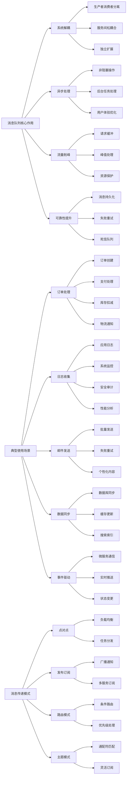

# 消息队列的作用和使用场景？

## 概要回答

消息队列是一种异步通信机制，主要用于解耦系统组件、实现流量削峰、提高系统可靠性和可扩展性。它的核心作用包括：解耦生产者和消费者、异步处理任务、流量控制、提高系统容错能力。常见使用场景有：订单处理、日志收集、邮件发送、短信通知、数据同步、事件驱动架构等。通过合理使用消息队列，可以构建更加灵活、可靠的分布式系统。

## 深度解析

### 消息队列核心概念

#### 基本架构和工作原理

```bash
# 消息队列基本组件
# Producer -> Queue -> Consumer
# 消息生命周期：生产 -> 存储 -> 消费 -> 确认 -> 删除

# 常见消息队列系统启动命令
# RabbitMQ
sudo systemctl start rabbitmq-server

# Apache Kafka
bin/kafka-server-start.sh config/server.properties

# Redis Streams (作为轻量级消息队列)
redis-server --port 6379

# ActiveMQ
bin/activemq start
```

```php
<?php
// PHP示例：消息队列基本概念演示
class BasicMessageQueue {
    private $queue;
    private $consumers;
    private $running;
    
    public function __construct() {
        $this->queue = new SplQueue();
        $this->consumers = [];
        $this->running = false;
    }
    
    /**
     * 发布消息
     */
    public function publish($message) {
        $messageId = uniqid('msg_', true);
        $envelope = [
            'id' => $messageId,
            'timestamp' => microtime(true),
            'body' => $message,
            'retry_count' => 0
        ];
        
        $this->queue->enqueue($envelope);
        echo "[Producer] Published message {$messageId}: " . json_encode($message) . "\n";
        return $messageId;
    }
    
    /**
     * 订阅消息
     */
    public function subscribe($consumerFunc) {
        $this->consumers[] = $consumerFunc;
        echo "[Consumer] Subscribed consumer\n";
    }
    
    /**
     * 开始消费消息
     */
    public function startConsuming() {
        $this->running = true;
        echo "[Queue] Started consuming messages\n";
        
        while ($this->running && !$this->queue->isEmpty()) {
            try {
                // 获取消息
                $message = $this->queue->dequeue();
                
                // 分发给所有消费者
                foreach ($this->consumers as $consumer) {
                    try {
                        call_user_func($consumer, $message);
                        echo "[Consumer] Processed message {$message['id']}\n";
                    } catch (Exception $e) {
                        echo "[Consumer] Error processing message {$message['id']}: " . $e->getMessage() . "\n";
                        // 重新入队或死信处理
                        $this->handleFailedMessage($message, $e);
                    }
                }
                
            } catch (Exception $e) {
                echo "[Queue] Error in consuming loop: " . $e->getMessage() . "\n";
            }
        }
    }
    
    /**
     * 处理失败的消息
     */
    private function handleFailedMessage($message, $error) {
        $message['retry_count'] += 1;
        
        if ($message['retry_count'] < 3) {
            // 重试
            echo "[Queue] Retrying message {$message['id']} (attempt {$message['retry_count']})\n";
            sleep(1);  // 简单退避
            $this->queue->enqueue($message);
        } else {
            // 死信处理
            echo "[Queue] Message {$message['id']} moved to dead letter queue\n";
            $this->moveToDeadLetter($message, $error->getMessage());
        }
    }
    
    /**
     * 移动到死信队列
     */
    private function moveToDeadLetter($message, $errorReason) {
        $deadLetterMessage = array_merge($message, [
            'dead_letter_reason' => $errorReason,
            'dead_letter_timestamp' => microtime(true)
        ]);
        echo "[DLQ] Message {$message['id']} stored in dead letter queue: {$errorReason}\n";
    }
    
    /**
     * 停止消费
     */
    public function stopConsuming() {
        $this->running = false;
        echo "[Queue] Stopped consuming messages\n";
    }
}

// 订单处理消费者
function orderProcessingConsumer($message) {
    $orderData = $message['body'];
    echo "[Order Service] Processing order: " . json_encode($orderData) . "\n";
    
    // 模拟处理时间
    usleep(100000); // 0.1秒
    
    // 模拟可能的处理失败
    if (isset($orderData['simulate_error']) && $orderData['simulate_error']) {
        throw new Exception("Simulated processing error");
    }
}

// 通知消费者
function notificationConsumer($message) {
    $orderData = $message['body'];
    echo "[Notification Service] Sending notification for order: {$orderData['order_id']}\n";
}

// 分析消费者
function analyticsConsumer($message) {
    $orderData = $message['body'];
    echo "[Analytics Service] Recording analytics for order: {$orderData['order_id']}\n";
}

// 演示消息队列使用
function demonstrateBasicMQ() {
    echo "=== Basic Message Queue Demonstration ===\n";
    
    // 创建消息队列
    $mq = new BasicMessageQueue();
    
    // 订阅消费者
    $mq->subscribe('orderProcessingConsumer');
    $mq->subscribe('notificationConsumer');
    $mq->subscribe('analyticsConsumer');
    
    // 发布消息
    $orders = [
        ['order_id' => 'ORD001', 'customer' => 'Alice', 'amount' => 100.0],
        ['order_id' => 'ORD002', 'customer' => 'Bob', 'amount' => 250.0],
        ['order_id' => 'ORD003', 'customer' => 'Charlie', 'amount' => 75.0, 'simulate_error' => true]
    ];
    
    foreach ($orders as $order) {
        $mq->publish($order);
        usleep(50000); // 模拟订单间隔
    }
    
    // 开始消费
    $mq->startConsuming();
    
    // 停止消费者
    $mq->stopConsuming();
    echo "Demonstration completed\n";
}

demonstrateBasicMQ();
?>
```

#### 消息传递模式

```php
// PHP示例：不同消息传递模式

class MessagingPatterns {
    
    /**
     * 点对点模式 (Point-to-Point)
     * 每条消息只能被一个消费者处理
     */
    class PointToPointPattern {
        private $queue;
        private $consumers;
        private $running;
        
        public function __construct() {
            $this->queue = new SplQueue();
            $this->consumers = [];
            $this->running = true;
        }
        
        // 消息生产者
        public function produce($message) {
            $this->queue->enqueue($message);
            echo "[Producer] Sent: " . $message . "\n";
        }
        
        // 添加消费者
        public function addConsumer($consumerName) {
            $worker = new ConsumerWorker($consumerName);
            $this->consumers[] = $worker;
            // 在实际应用中，这里会启动一个新的进程或线程
            // 为简化起见，我们会在演示中直接调用
        }
        
        // 消费消息
        public function consume() {
            while ($this->running) {
                if (!$this->queue->isEmpty()) {
                    $message = $this->queue->dequeue();
                    foreach ($this->consumers as $consumer) {
                        $consumer->process($message);
                    }
                } else {
                    // 队列为空，短暂休眠
                    usleep(10000); // 10毫秒
                }
            }
        }
        
        public function stop() {
            $this->running = false;
        }
        
        public function getConsumers() {
            return $this->consumers;
        }
    }
    
    /**
     * 消费者工作类
     */
    class ConsumerWorker {
        private $name;
        
        public function __construct($name) {
            $this->name = $name;
        }
        
        public function getName() {
            return $this->name;
        }
        
        public function process($message) {
            echo "[" . $this->name . "] Received and processing: " . $message . "\n";
            // 模拟处理时间
            usleep(100000); // 100毫秒
        }
    }
    
    /**
     * 发布-订阅模式 (Publish-Subscribe)
     * 每条消息被所有订阅者接收
     */
    class PublishSubscribePattern {
        private $topics;
        
        public function __construct() {
            $this->topics = [];
        }
        
        // 订阅主题
        public function subscribe($topic, $subscriber) {
            if (!isset($this->topics[$topic])) {
                $this->topics[$topic] = [];
            }
            $this->topics[$topic][] = $subscriber;
            echo "[Subscriber] " . $subscriber->getName() . " subscribed to " . $topic . "\n";
        }
        
        // 发布消息到主题
        public function publish($topic, $message) {
            echo "[Publisher] Published to " . $topic . ": " . $message . "\n";
            
            if (isset($this->topics[$topic])) {
                foreach ($this->topics[$topic] as $subscriber) {
                    $subscriber->onMessage($topic, $message);
                }
            }
        }
    }
    
    /**
     * 订阅者接口
     */
    interface Subscriber {
        public function getName();
        public function onMessage($topic, $message);
    }
    
    /**
     * 具体订阅者实现
     */
    class ConcreteSubscriber implements Subscriber {
        private $name;
        
        public function __construct($name) {
            $this->name = $name;
        }
        
        public function getName() {
            return $this->name;
        }
        
        public function onMessage($topic, $message) {
            echo "[" . $this->name . "] Received from " . $topic . ": " . $message . "\n";
            // 模拟处理时间
            usleep(50000); // 50毫秒
        }
    }
    
    /**
     * 路由模式 (Routing)
     * 根据路由键将消息发送到特定队列
     */
    class RoutingPattern {
        private $routingQueues;
        
        public function __construct() {
            $this->routingQueues = [];
        }
        
        // 声明路由队列
        public function declareQueue($routingKey) {
            if (!isset($this->routingQueues[$routingKey])) {
                $this->routingQueues[$routingKey] = new SplQueue();
            }
            echo "[Router] Declared queue for routing key: " . $routingKey . "\n";
        }
        
        // 发送到特定路由
        public function send($routingKey, $message) {
            if (isset($this->routingQueues[$routingKey])) {
                $this->routingQueues[$routingKey]->enqueue($message);
                echo "[Sender] Sent to " . $routingKey . ": " . $message . "\n";
            } else {
                echo "[Sender] No queue for routing key: " . $routingKey . "\n";
            }
        }
        
        // 从特定路由消费
        public function consume($routingKey) {
            if (isset($this->routingQueues[$routingKey]) && !$this->routingQueues[$routingKey]->isEmpty()) {
                return $this->routingQueues[$routingKey]->dequeue();
            }
            return null;
        }
    }
    
    /**
     * 主题模式 (Topics)
     * 使用通配符匹配路由键
     */
    class TopicPattern {
        private $subscriptions;
        
        public function __construct() {
            $this->subscriptions = [];
        }
        
        // 订阅主题模式
        public function subscribe($topicPattern, $subscriber) {
            if (!isset($this->subscriptions[$topicPattern])) {
                $this->subscriptions[$topicPattern] = [];
            }
            $this->subscriptions[$topicPattern][] = $subscriber;
            echo "[Subscriber] " . $subscriber->getName() . " subscribed to pattern: " . $topicPattern . "\n";
        }
        
        // 发布到主题
        public function publish($topic, $message) {
            echo "[Publisher] Published to topic " . $topic . ": " . $message . "\n";
            
            // 匹配所有符合条件的订阅者
            foreach ($this->subscriptions as $pattern => $subscribers) {
                if ($this->matchesPattern($topic, $pattern)) {
                    foreach ($subscribers as $subscriber) {
                        $subscriber->onMessage($topic, $message);
                    }
                }
            }
        }
        
        // 简单的模式匹配 (* 匹配一个单词, # 匹配零个或多个单词)
        private function matchesPattern($topic, $pattern) {
            $topicParts = explode('.', $topic);
            $patternParts = explode('.', $pattern);
            
            $topicIndex = 0;
            $patternIndex = 0;
            
            while ($topicIndex < count($topicParts) && $patternIndex < count($patternParts)) {
                $patternPart = $patternParts[$patternIndex];
                
                if ($patternPart === "#") {
                    // # 匹配剩余所有部分
                    return true;
                } else if ($patternPart === "*") {
                    // * 匹配一个单词
                    $topicIndex++;
                    $patternIndex++;
                } else if ($patternPart === $topicParts[$topicIndex]) {
                    // 精确匹配
                    $topicIndex++;
                    $patternIndex++;
                } else {
                    return false;
                }
            }
            
            // 检查是否完全匹配
            return $topicIndex === count($topicParts) && $patternIndex === count($patternParts);
        }
    }
    
    // 演示各种模式
    public static function demonstratePatterns() {
        echo "=== Messaging Patterns Demonstration ===\n\n";
        
        // 1. 点对点模式演示
        echo "1. Point-to-Point Pattern:\n";
        $p2p = new PointToPointPattern();
        $p2p->addConsumer(new ConsumerWorker("Consumer-1"));
        $p2p->addConsumer(new ConsumerWorker("Consumer-2"));
        
        for ($i = 1; $i <= 5; $i++) {
            $p2p->produce("Message-" . $i);
            usleep(50000); // 50毫秒
        }
        
        // 处理消息
        foreach ($p2p->getConsumers() as $consumer) {
            // 在实际应用中，每个消费者会在独立的进程中运行
            // 这里为了演示，我们简化处理
        }
        
        usleep(1000000); // 1秒
        $p2p->stop();
        
        echo "\n";
        
        // 2. 发布-订阅模式演示
        echo "2. Publish-Subscribe Pattern:\n";
        $pubsub = new PublishSubscribePattern();
        $pubsub->subscribe("news", new ConcreteSubscriber("NewsReader-1"));
        $pubsub->subscribe("news", new ConcreteSubscriber("NewsReader-2"));
        $pubsub->subscribe("sports", new ConcreteSubscriber("SportsFan"));
        
        $pubsub->publish("news", "Breaking news: Market reaches new high");
        $pubsub->publish("sports", "Football match result: Team A 2-1 Team B");
        
        usleep(500000); // 500毫秒
        
        echo "\n";
        
        // 3. 路由模式演示
        echo "3. Routing Pattern:\n";
        $routing = new RoutingPattern();
        $routing->declareQueue("error");
        $routing->declareQueue("warning");
        $routing->declareQueue("info");
        
        $routing->send("error", "Critical system error occurred");
        $routing->send("warning", "Disk space running low");
        $routing->send("info", "System started successfully");
        
        echo "Consuming messages:\n";
        echo "Error queue: " . $routing->consume("error") . "\n";
        echo "Warning queue: " . $routing->consume("warning") . "\n";
        echo "Info queue: " . $routing->consume("info") . "\n";
        
        echo "\n";
        
        // 4. 主题模式演示
        echo "4. Topic Pattern:\n";
        $topic = new TopicPattern();
        
        // PHP不支持匿名类实现接口，所以我们创建一个具体的类
        class StockTraderSubscriber implements Subscriber {
            public function getName() { return "StockTrader"; }
            public function onMessage($topic, $message) {
                echo "[StockTrader] Trading alert for " . $topic . ": " . $message . "\n";
            }
        }
        
        class NYSEAnalyzerSubscriber implements Subscriber {
            public function getName() { return "NYSEAnalyzer"; }
            public function onMessage($topic, $message) {
                echo "[NYSEAnalyzer] NYSE analysis for " . $topic . ": " . $message . "\n";
            }
        }
        
        $topic->subscribe("stock.*", new StockTraderSubscriber());
        $topic->subscribe("stock.nyse.#", new NYSEAnalyzerSubscriber());
        
        $topic->publish("stock.nyse.ibm", "IBM stock price increased 2%");
        $topic->publish("stock.nasdaq.aapl", "AAPL quarterly report released");
        $topic->publish("stock.nyse.googl", "GOOGL dividend announced");
        
        usleep(500000); // 500毫秒
    }
}

MessagingPatterns::demonstratePatterns();
?>
```

### 消息队列核心作用

#### 1. 系统解耦

```php
// PHP示例：系统解耦实现

class OrderService {
    private $orders;
    private $listeners;
    
    public function __construct() {
        $this->orders = [];
        $this->listeners = [];
    }
    
    public function createOrder($orderData) {
        $orderId = 'ORDER_' . time() . '_' . rand(1000, 9999);
        $order = array_merge($orderData, [
            'id' => $orderId,
            'status' => 'created',
            'createdAt' => date('Y-m-d H:i:s')
        ]);
        
        $this->orders[$orderId] = $order;
        echo "[OrderService] Order created: {$orderId}\n";
        
        // 发布订单创建事件，而不是直接调用其他服务
        $this->emit('orderCreated', $order);
        
        return $orderId;
    }
    
    public function getOrder($orderId) {
        return isset($this->orders[$orderId]) ? $this->orders[$orderId] : null;
    }
    
    public function on($event, $callback) {
        if (!isset($this->listeners[$event])) {
            $this->listeners[$event] = [];
        }
        $this->listeners[$event][] = $callback;
    }
    
    public function emit($event, $data) {
        if (isset($this->listeners[$event])) {
            foreach ($this->listeners[$event] as $callback) {
                call_user_func($callback, $data);
            }
        }
    }
}

class InventoryService {
    private $stock;
    private $orderService;
    
    public function __construct($orderService) {
        $this->stock = [
            'PRODUCT_A' => 100,
            'PRODUCT_B' => 50,
            'PRODUCT_C' => 200
        ];
        $this->orderService = $orderService;
        
        // 订阅订单创建事件
        $this->orderService->on('orderCreated', [$this, 'handleOrderCreated']);
    }
    
    public function handleOrderCreated($order) {
        echo "[InventoryService] Handling order: {$order['id']}\n";
        
        // 检查库存并扣减
        $productId = $order['productId'];
        $quantity = $order['quantity'];
        
        if (isset($this->stock[$productId])) {
            $currentStock = $this->stock[$productId];
            if ($currentStock >= $quantity) {
                $this->stock[$productId] = $currentStock - $quantity;
                echo "[InventoryService] Stock updated for {$productId}: {$currentStock} -> " . ($currentStock - $quantity) . "\n";
                
                // 发布库存扣减事件
                $this->emit('inventoryUpdated', [
                    'productId' => $productId,
                    'oldQuantity' => $currentStock,
                    'newQuantity' => $currentStock - $quantity,
                    'orderId' => $order['id']
                ]);
            } else {
                echo "[InventoryService] Insufficient stock for {$productId}\n";
                // 发布库存不足事件
                $this->emit('insufficientStock', [
                    'productId' => $productId,
                    'required' => $quantity,
                    'available' => $currentStock,
                    'orderId' => $order['id']
                ]);
            }
        }
    }
    
    public function getStock($productId) {
        return isset($this->stock[$productId]) ? $this->stock[$productId] : 0;
    }
    
    public function emit($event, $data) {
        // 简化实现
        echo "[InventoryService] Emitting event: {$event}\n";
    }
}

class NotificationService {
    public function __construct($orderService) {
        // 订阅订单相关事件
        $orderService->on('orderCreated', [$this, 'sendOrderConfirmation']);
    }
    
    public function sendOrderConfirmation($order) {
        echo "[NotificationService] Sending confirmation for order {$order['id']}\n";
        // 模拟发送邮件/SMS
        // 在实际应用中，这里会使用sleep或者异步处理
        echo "[NotificationService] Confirmation sent to {$order['customerEmail']}\n";
    }
    
    public function sendShippingNotification($order) {
        echo "[NotificationService] Sending shipping notification for order {$order['id']}\n";
        echo "[NotificationService] Shipping notification sent to {$order['customerEmail']}\n";
    }
}

class PaymentService {
    public function __construct($orderService) {
        $orderService->on('orderCreated', [$this, 'processPayment']);
    }
    
    public function processPayment($order) {
        echo "[PaymentService] Processing payment for order {$order['id']}\n";
        // 模拟支付处理
        // 在实际应用中，这里会使用sleep或者异步处理
        $success = rand(1, 100) > 10; // 90%成功率
        if ($success) {
            echo "[PaymentService] Payment successful for order {$order['id']}\n";
            $this->emit('paymentSuccess', ['orderId' => $order['id'], 'amount' => $order['amount']]);
        } else {
            echo "[PaymentService] Payment failed for order {$order['id']}\n";
            $this->emit('paymentFailed', ['orderId' => $order['id'], 'amount' => $order['amount']]);
        }
    }
    
    public function emit($event, $data) {
        echo "[PaymentService] Emitting event: {$event}\n";
    }
}

// 使用消息队列实现真正的解耦
class MessageQueueSystem {
    private $queues;
    private $subscribers;
    
    public function __construct() {
        $this->queues = [];
        $this->subscribers = [];
    }
    
    // 创建队列
    public function createQueue($queueName) {
        if (!isset($this->queues[$queueName])) {
            $this->queues[$queueName] = [];
            $this->subscribers[$queueName] = [];
            echo "[MQ] Queue created: {$queueName}\n";
        }
    }
    
    // 发布消息到队列
    public function publish($queueName, $message) {
        if (isset($this->queues[$queueName])) {
            $envelope = [
                'id' => 'MSG_' . time() . '_' . rand(1000, 9999),
                'timestamp' => date('Y-m-d H:i:s'),
                'body' => $message,
                'retryCount' => 0
            ];
            
            $this->queues[$queueName][] = $envelope;
            echo "[MQ] Message published to {$queueName}: " . json_encode($message) . "\n";
            
            // 立即分发给订阅者
            $this->dispatchMessage($queueName, $envelope);
        }
    }
    
    // 订阅队列
    public function subscribe($queueName, $callback) {
        if (isset($this->subscribers[$queueName])) {
            $this->subscribers[$queueName][] = $callback;
            echo "[MQ] Subscriber added to {$queueName}\n";
        }
    }
    
    // 分发消息给订阅者
    public function dispatchMessage($queueName, $message) {
        if (isset($this->subscribers[$queueName])) {
            foreach ($this->subscribers[$queueName] as $callback) {
                try {
                    call_user_func($callback, $message['body']);
                } catch (Exception $error) {
                    echo "[MQ] Error in subscriber: " . $error->getMessage() . "\n";
                }
            }
        }
    }
    
    // 消费队列消息（轮询方式）
    public function consume($queueName, $callback) {
        if (isset($this->queues[$queueName])) {
            $queue = &$this->queues[$queueName];
            if (count($queue) > 0) {
                $message = array_shift($queue);
                echo "[MQ] Message consumed from {$queueName}: " . json_encode($message['body']) . "\n";
                call_user_func($callback, null, $message['body']);
            } else {
                call_user_func($callback, null, null);
            }
        } else {
            call_user_func($callback, new Exception("Queue {$queueName} not found"), null);
        }
    }
}

// 使用消息队列重构服务
class DecoupledOrderService {
    private $messageQueue;
    private $orders;
    
    public function __construct($messageQueue) {
        $this->messageQueue = $messageQueue;
        $this->orders = [];
    }
    
    public function createOrder($orderData) {
        $orderId = 'ORDER_' . time() . '_' . rand(1000, 9999);
        $order = array_merge($orderData, [
            'id' => $orderId,
            'status' => 'created',
            'createdAt' => date('Y-m-d H:i:s')
        ]);
        
        $this->orders[$orderId] = $order;
        echo "[DecoupledOrderService] Order created: {$orderId}\n";
        
        // 通过消息队列发布事件，而不是直接调用其他服务
        $this->messageQueue->publish('order.events', [
            'eventType' => 'orderCreated',
            'orderId' => $orderId,
            'order' => $order
        ]);
        
        return $orderId;
    }
}

class DecoupledInventoryService {
    private $stock;
    private $messageQueue;
    
    public function __construct($messageQueue) {
        $this->stock = [
            'PRODUCT_A' => 100,
            'PRODUCT_B' => 50,
            'PRODUCT_C' => 200
        ];
        $this->messageQueue = $messageQueue;
        
        // 通过消息队列订阅事件
        $this->messageQueue->subscribe('order.events', [$this, 'handleOrderCreated']);
    }
    
    public function handleOrderCreated($event) {
        echo "[DecoupledInventoryService] Handling order: {$event['order']['id']}\n";
        
        $order = $event['order'];
        $productId = $order['productId'];
        $quantity = $order['quantity'];
        
        if (isset($this->stock[$productId])) {
            $currentStock = $this->stock[$productId];
            if ($currentStock >= $quantity) {
                $this->stock[$productId] = $currentStock - $quantity;
                echo "[DecoupledInventoryService] Stock updated for {$productId}\n";
                
                // 发布库存更新事件
                $this->messageQueue->publish('inventory.events', [
                    'eventType' => 'stockUpdated',
                    'productId' => $productId,
                    'oldQuantity' => $currentStock,
                    'newQuantity' => $currentStock - $quantity,
                    'orderId' => $order['id']
                ]);
            }
        }
    }
}

// 演示解耦效果
function demonstrateDecoupling() {
    echo "=== System Decoupling Demonstration ===\n\n";
    
    // 传统紧耦合方式
    echo "1. Traditional Coupled Approach:\n";
    $orderService = new OrderService();
    $inventoryService = new InventoryService($orderService);
    $notificationService = new NotificationService($orderService);
    $paymentService = new PaymentService($orderService);
    
    $orderService->createOrder([
        'productId' => 'PRODUCT_A',
        'quantity' => 2,
        'customerEmail' => 'customer@example.com',
        'amount' => 99.99
    ]);
    
    echo "\n" . str_repeat("=", 50) . "\n\n";
    
    // 使用消息队列的松耦合方式
    echo "2. Message Queue Decoupled Approach:\n";
    $messageQueue = new MessageQueueSystem();
    
    // 创建必要的队列
    $messageQueue->createQueue('order.events');
    $messageQueue->createQueue('inventory.events');
    
    // 初始化服务
    $decoupledOrderService = new DecoupledOrderService($messageQueue);
    $decoupledInventoryService = new DecoupledInventoryService($messageQueue);
    
    // 创建订单
    $decoupledOrderService->createOrder([
        'productId' => 'PRODUCT_B',
        'quantity' => 1,
        'customerEmail' => 'customer2@example.com',
        'amount' => 149.99
    ]);
    
    echo "\nServices are completely decoupled - they don't know about each other!\n";
}

demonstrateDecoupling();
?>
```

#### 2. 异步处理

```php
// PHP示例：异步处理实现

// 消息结构体
class Message {
    public $ID;
    public $Type;
    public $Payload;
    public $Timestamp;
    public $Retry;
    
    public function __construct($type, $payload) {
        $this->ID = 'task_' . uniqid();
        $this->Type = $type;
        $this->Payload = $payload;
        $this->Timestamp = date('Y-m-d H:i:s');
        $this->Retry = 0;
    }
}

// 异步任务处理器
class AsyncTaskProcessor {
    private $queue;
    private $handlers;
    
    public function __construct() {
        $this->queue = new SplQueue();
        $this->handlers = [];
    }
    
    // 注册任务处理器
    public function registerHandler($taskType, $handler) {
        $this->handlers[$taskType] = $handler;
    }
    
    // 发布异步任务
    public function publishTask($taskType, $payload) {
        $message = new Message($taskType, $payload);
        $this->queue->enqueue($message);
        echo "[Publisher] Task published: {$taskType} - {$payload}\n";
        return $message->ID;
    }
    
    // 处理异步任务
    public function processTasks() {
        echo "[Consumer] Waiting for tasks...\n";
        
        // 处理消息
        while (!$this->queue->isEmpty()) {
            $message = $this->queue->dequeue();
            
            echo "[Consumer] Processing task: {$message->Type}\n";
            
            // 执行任务处理
            if (isset($this->handlers[$message->Type])) {
                try {
                    call_user_func($this->handlers[$message->Type], $message);
                    echo "[Consumer] Task completed successfully: {$message->Type}\n";
                } catch (Exception $e) {
                    echo "[Consumer] Task failed: " . $e->getMessage() . "\n";
                    
                    // 重试逻辑
                    if ($message->Retry < 3) {
                        // 重新入队进行重试
                        $message->Retry++;
                        $this->queue->enqueue($message);
                        echo "[Consumer] Task requeued for retry: {$message->Retry}\n";
                    } else {
                        echo "[Consumer] Task failed permanently after {$message->Retry} retries\n";
                    }
                }
            } else {
                echo "[Consumer] Unknown task type: {$message->Type}\n";
            }
        }
        
        return true;
    }
    
    // 获取队列大小
    public function getQueueSize() {
        return $this->queue->count();
    }
}

// 具体任务处理函数
function handleEmailTask($message) {
    echo "[EmailService] Sending email: {$message->Payload}\n";
    
    // 模拟邮件发送处理时间
    usleep(100000); // 100毫秒
    
    // 模拟可能的失败
    if ($message->Retry == 0 && time() % 10 == 0) {
        throw new Exception("temporary email service error");
    }
    
    echo "[EmailService] Email sent successfully\n";
}

function handleImageProcessingTask($message) {
    echo "[ImageService] Processing image: {$message->Payload}\n";
    
    // 模拟图像处理时间
    $processingTime = rand(500, 1500) * 1000; // 500-1500毫秒
    usleep($processingTime);
    
    echo "[ImageService] Image processed in " . ($processingTime/1000) . "ms\n";
}

function handleDataAnalysisTask($message) {
    echo "[AnalyticsService] Analyzing data: {$message->Payload}\n";
    
    // 模拟数据分析时间
    usleep(200000); // 200毫秒
    
    echo "[AnalyticsService] Data analysis completed\n";
}

// 演示异步处理
function demonstrateAsyncProcessing() {
    echo "=== Async Processing Demonstration ===\n";
    
    // 初始化异步任务处理器
    $processor = new AsyncTaskProcessor();
    
    // 注册任务处理器
    $processor->registerHandler('email', 'handleEmailTask');
    $processor->registerHandler('image_processing', 'handleImageProcessingTask');
    $processor->registerHandler('data_analysis', 'handleDataAnalysisTask');
    
    // 发布不同类型的任务
    $tasks = [
        ['type' => 'email', 'payload' => 'Welcome email to new user'],
        ['type' => 'image_processing', 'payload' => 'Process profile picture for user123'],
        ['type' => 'data_analysis', 'payload' => 'Generate monthly report'],
        ['type' => 'email', 'payload' => 'Order confirmation for ORD001'],
        ['type' => 'image_processing', 'payload' => 'Resize product images'],
        ['type' => 'data_analysis', 'payload' => 'Customer behavior analysis'],
    ];
    
    // 发布任务
    foreach ($tasks as $task) {
        $processor->publishTask($task['type'], $task['payload']);
        usleep(50000); // 模拟任务发布的间隔
    }
    
    // 处理任务
    echo "Tasks published, processing...\n";
    $processor->processTasks();
    
    echo "Async processing demonstration completed\n";
}

demonstrateAsyncProcessing();
?>
```

### 典型使用场景

#### 1. 订单处理系统

```php
<?php
// PHP示例：电商订单处理系统

// 订单状态枚举
abstract class OrderStatus {
    const CREATED = "created";
    const PAID = "paid";
    const PROCESSING = "processing";
    const SHIPPED = "shipped";
    const DELIVERED = "delivered";
    const CANCELLED = "cancelled";
}

// 订单类
class Order {
    public $id;
    public $customer_id;
    public $items;
    public $total_amount;
    public $status;
    public $created_at;
    public $updated_at;
    
    public function __construct($id, $customer_id, $items, $total_amount, $status, $created_at) {
        $this->id = $id;
        $this->customer_id = $customer_id;
        $this->items = $items;
        $this->total_amount = $total_amount;
        $this->status = $status;
        $this->created_at = $created_at;
        $this->updated_at = null;
    }
}

class OrderProcessingSystem {
    /** @var Order[] */
    private $orders;
    private $event_handlers;
    
    /**
     * 订单处理系统
     */
    public function __construct() {
        $this->orders = [];
        $this->event_handlers = [];
        $this->setupEventHandlers();
    }
    
    /**
     * 设置事件处理器
     */
    private function setupEventHandlers() {
        $this->event_handlers = [
            'order_created' => [$this, 'handleOrderCreated'],
            'payment_processed' => [$this, 'handlePaymentProcessed'],
            'inventory_reserved' => [$this, 'handleInventoryReserved'],
            'order_shipped' => [$this, 'handleOrderShipped'],
            'order_delivered' => [$this, 'handleOrderDelivered']
        ];
    }
    
    /**
     * 创建订单
     */
    public function createOrder($customer_id, $items) {
        $order_id = "ORD_" . strtoupper(substr(md5(uniqid()), 0, 8));
        $total_amount = 0;
        foreach ($items as $item) {
            $total_amount += $item['price'] * $item['quantity'];
        }
        
        $order = new Order(
            $order_id,
            $customer_id,
            $items,
            $total_amount,
            OrderStatus::CREATED,
            time()
        );
        
        $this->orders[$order_id] = $order;
        echo "[OrderService] Order created: {$order_id}\n";
        
        // 发布订单创建事件
        $this->publishEvent('order_created', [
            'order_id' => $order_id,
            'order' => [
                'id' => $order->id,
                'customer_id' => $order->customer_id,
                'items' => $order->items,
                'total_amount' => $order->total_amount,
                'status' => $order->status,
                'created_at' => $order->created_at,
                'updated_at' => $order->updated_at
            ]
        ]);
        
        return $order_id;
    }
    
    /**
     * 处理订单创建事件
     */
    public function handleOrderCreated($event_data) {
        $order_id = $event_data['order_id'];
        echo "[PaymentService] Processing payment for order: {$order_id}\n";
        
        // 模拟支付处理
        usleep(100000);  // 模拟网络延迟 0.1秒
        
        // 模拟支付成功率
        if (rand(0, 100) > 5) {  // 95%成功率
            echo "[PaymentService] Payment successful for order: {$order_id}\n";
            $this->publishEvent('payment_processed', [
                'order_id' => $order_id,
                'status' => 'success'
            ]);
        } else {
            echo "[PaymentService] Payment failed for order: {$order_id}\n";
            $this->publishEvent('payment_processed', [
                'order_id' => $order_id,
                'status' => 'failed'
            ]);
        }
    }
    
    /**
     * 处理支付完成事件
     */
    public function handlePaymentProcessed($event_data) {
        $order_id = $event_data['order_id'];
        $status = $event_data['status'];
        
        if ($status == 'success') {
            echo "[InventoryService] Reserving inventory for order: {$order_id}\n";
            usleep(100000);  // 模拟库存检查 0.1秒
            
            // 更新订单状态
            if (isset($this->orders[$order_id])) {
                $order = $this->orders[$order_id];
                $order->status = OrderStatus::PAID;
                $order->updated_at = time();
                echo "[OrderService] Order {$order_id} status updated to PAID\n";
            }
            
            $this->publishEvent('inventory_reserved', [
                'order_id' => $order_id,
                'status' => 'reserved'
            ]);
        } else {
            echo "[OrderService] Order {$order_id} payment failed\n";
            if (isset($this->orders[$order_id])) {
                $this->orders[$order_id]->status = OrderStatus::CANCELLED;
            }
        }
    }
    
    /**
     * 处理库存预留事件
     */
    public function handleInventoryReserved($event_data) {
        $order_id = $event_data['order_id'];
        echo "[WarehouseService] Preparing shipment for order: {$order_id}\n";
        
        usleep(200000);  // 模拟打包时间 0.2秒
        
        // 更新订单状态
        if (isset($this->orders[$order_id])) {
            $order = $this->orders[$order_id];
            $order->status = OrderStatus::PROCESSING;
            $order->updated_at = time();
            echo "[OrderService] Order {$order_id} status updated to PROCESSING\n";
        }
        
        $tracking_number = "TRK_" . strtoupper(substr(md5(uniqid()), 0, 10));
        $this->publishEvent('order_shipped', [
            'order_id' => $order_id,
            'tracking_number' => $tracking_number
        ]);
    }
    
    /**
     * 处理订单发货事件
     */
    public function handleOrderShipped($event_data) {
        $order_id = $event_data['order_id'];
        $tracking_number = $event_data['tracking_number'];
        
        echo "[NotificationService] Sending shipping notification for order: {$order_id}\n";
        echo "[NotificationService] Tracking number: {$tracking_number}\n";
        
        // 更新订单状态
        if (isset($this->orders[$order_id])) {
            $order = $this->orders[$order_id];
            $order->status = OrderStatus::SHIPPED;
            $order->updated_at = time();
            echo "[OrderService] Order {$order_id} status updated to SHIPPED\n";
        }
        
        // 模拟物流跟踪更新
        usleep(100000);  // 0.1秒
    }
    
    /**
     * 处理订单送达事件
     */
    public function handleOrderDelivered($event_data) {
        $order_id = $event_data['order_id'];
        
        echo "[NotificationService] Sending delivery confirmation for order: {$order_id}\n";
        
        // 更新订单状态
        if (isset($this->orders[$order_id])) {
            $order = $this->orders[$order_id];
            $order->status = OrderStatus::DELIVERED;
            $order->updated_at = time();
            echo "[OrderService] Order {$order_id} status updated to DELIVERED\n";
        }
    }
    
    /**
     * 发布事件
     */
    public function publishEvent($event_type, $event_data) {
        echo "[EventBus] Publishing event: {$event_type}\n";
        
        // 处理事件
        if (isset($this->event_handlers[$event_type])) {
            call_user_func($this->event_handlers[$event_type], $event_data);
        } else {
            echo "[EventBus] No handler found for event: {$event_type}\n";
        }
    }
}

// 消息队列增强版订单系统
class MQOrderProcessingSystem {
    /** @var Order[] */
    private $orders;
    private $message_queues;
    
    /**
     * 基于消息队列的订单处理系统
     */
    public function __construct() {
        $this->orders = [];
        $this->message_queues = [];
        $this->setupQueues();
    }
    
    /**
     * 设置消息队列
     */
    private function setupQueues() {
        $queue_names = [
            'order.creation',
            'payment.processing',
            'inventory.reservation',
            'warehouse.shipping',
            'notification.service',
            'analytics.tracking'
        ];
        
        foreach ($queue_names as $queue_name) {
            $this->message_queues[$queue_name] = [];
            echo "[MQ] Queue created: {$queue_name}\n";
        }
    }
    
    /**
     * 异步创建订单
     */
    public function createOrderAsync($customer_id, $items) {
        $order_id = "ORD_" . strtoupper(substr(md5(uniqid()), 0, 8));
        $total_amount = 0;
        foreach ($items as $item) {
            $total_amount += $item['price'] * $item['quantity'];
        }
        
        $order = new Order(
            $order_id,
            $customer_id,
            $items,
            $total_amount,
            OrderStatus::CREATED,
            time()
        );
        
        $this->orders[$order_id] = $order;
        echo "[OrderService] Order created: {$order_id}\n";
        
        // 发送到订单创建队列
        $this->enqueueMessage('order.creation', [
            'order_id' => $order_id,
            'order' => [
                'id' => $order->id,
                'customer_id' => $order->customer_id,
                'items' => $order->items,
                'total_amount' => $order->total_amount,
                'status' => $order->status,
                'created_at' => $order->created_at,
                'updated_at' => $order->updated_at
            ]
        ]);
        
        return $order_id;
    }
    
    /**
     * 入队消息
     */
    public function enqueueMessage($queue_name, $message) {
        if (isset($this->message_queues[$queue_name])) {
            $message_envelope = [
                'id' => uniqid(),
                'timestamp' => time(),
                'body' => $message,
                'retry_count' => 0
            ];
            
            $this->message_queues[$queue_name][] = $message_envelope;
            echo "[MQ] Message enqueued to {$queue_name}: " . ($message['order_id'] ?? 'N/A') . "\n";
            
            // 立即处理消息
            $this->processMessage($queue_name, $message_envelope);
        }
    }
    
    /**
     * 处理消息
     */
    private function processMessage($queue_name, $message) {
        switch ($queue_name) {
            case 'order.creation':
                $this->consumeOrderCreation($message);
                break;
            case 'payment.processing':
                $this->consumePaymentProcessing($message);
                break;
            case 'inventory.reservation':
                $this->consumeInventoryReservation($message);
                break;
            case 'warehouse.shipping':
                $this->consumeWarehouseShipping($message);
                break;
            case 'notification.service':
                $this->consumeNotificationService($message);
                break;
        }
    }
    
    /**
     * 消费订单创建消息
     */
    private function consumeOrderCreation($message) {
        try {
            $order_data = $message['body'];
            $order_id = $order_data['order_id'];
            
            echo "[PaymentService] Processing payment for order: {$order_id}\n";
            
            // 发送到支付处理队列
            $this->enqueueMessage('payment.processing', [
                'order_id' => $order_id,
                'amount' => $order_data['order']['total_amount']
            ]);
            
        } catch (Exception $e) {
            echo "[MQ] Error consuming order creation: " . $e->getMessage() . "\n";
        }
    }
    
    /**
     * 消费支付处理消息
     */
    private function consumePaymentProcessing($message) {
        try {
            $payment_data = $message['body'];
            $order_id = $payment_data['order_id'];
            
            // 模拟支付处理
            usleep(100000);  // 0.1秒
            
            // 模拟支付结果
            $payment_success = rand(0, 100) > 5;
            
            if ($payment_success) {
                echo "[PaymentService] Payment successful for order: {$order_id}\n";
                $this->enqueueMessage('inventory.reservation', [
                    'order_id' => $order_id
                ]);
            } else {
                echo "[PaymentService] Payment failed for order: {$order_id}\n";
            }
            
        } catch (Exception $e) {
            echo "[MQ] Error consuming payment processing: " . $e->getMessage() . "\n";
        }
    }
    
    /**
     * 消费库存预留消息
     */
    private function consumeInventoryReservation($message) {
        try {
            $reservation_data = $message['body'];
            $order_id = $reservation_data['order_id'];
            
            echo "[InventoryService] Reserving inventory for order: {$order_id}\n";
            usleep(100000);  // 0.1秒
            
            // 更新订单状态
            if (isset($this->orders[$order_id])) {
                $order = $this->orders[$order_id];
                $order->status = OrderStatus::PAID;
            }
            
            // 发送到仓库处理队列
            $this->enqueueMessage('warehouse.shipping', [
                'order_id' => $order_id
            ]);
            
        } catch (Exception $e) {
            echo "[MQ] Error consuming inventory reservation: " . $e->getMessage() . "\n";
        }
    }
    
    /**
     * 消费仓库发货消息
     */
    private function consumeWarehouseShipping($message) {
        try {
            $shipping_data = $message['body'];
            $order_id = $shipping_data['order_id'];
            
            echo "[WarehouseService] Processing shipment for order: {$order_id}\n";
            usleep(200000);  // 0.2秒
            
            // 更新订单状态
            if (isset($this->orders[$order_id])) {
                $order = $this->orders[$order_id];
                $order->status = OrderStatus::PROCESSING;
            }
            
            // 发送到通知服务队列
            $this->enqueueMessage('notification.service', [
                'order_id' => $order_id,
                'event' => 'shipped',
                'tracking_number' => "TRK_" . strtoupper(substr(md5(uniqid()), 0, 10))
            ]);
            
        } catch (Exception $e) {
            echo "[MQ] Error consuming warehouse shipping: " . $e->getMessage() . "\n";
        }
    }
    
    /**
     * 消费通知服务消息
     */
    private function consumeNotificationService($message) {
        try {
            $notification_data = $message['body'];
            $order_id = $notification_data['order_id'];
            $event = $notification_data['event'];
            
            if ($event == 'shipped') {
                $tracking_number = $notification_data['tracking_number'];
                echo "[NotificationService] Order {$order_id} shipped. Tracking: {$tracking_number}\n";
            }
            
            // 更新订单状态
            if (isset($this->orders[$order_id])) {
                $order = $this->orders[$order_id];
                if ($event == 'shipped') {
                    $order->status = OrderStatus::SHIPPED;
                }
            }
            
        } catch (Exception $e) {
            echo "[MQ] Error consuming notification service: " . $e->getMessage() . "\n";
        }
    }
    
    /**
     * 获取订单
     */
    public function getOrder($order_id) {
        return isset($this->orders[$order_id]) ? $this->orders[$order_id] : null;
    }
}

/**
 * 演示订单处理系统
 */
function demonstrateOrderProcessing() {
    echo "=== Order Processing System Demonstration ===\n\n";
    
    // 1. 传统同步处理方式
    echo "1. Traditional Synchronous Processing:\n";
    $order_system = new OrderProcessingSystem();
    
    // 创建订单
    $order_id = $order_system->createOrder(
        "CUST_001",
        [
            ["product_id" => "PROD_A", "name" => "Laptop", "price" => 999.99, "quantity" => 1],
            ["product_id" => "PROD_B", "name" => "Mouse", "price" => 29.99, "quantity" => 2]
        ]
    );
    
    // 等待处理完成
    sleep(2);
    
    // 检查订单状态
    if (isset($order_system->orders[$order_id])) {
        $order = $order_system->orders[$order_id];
        echo "Final order status: " . $order->status . "\n";
    }
    
    echo "\n" . str_repeat("=", 60) . "\n\n";
    
    // 2. 基于消息队列的异步处理
    echo "2. Message Queue Based Asynchronous Processing:\n";
    $mq_order_system = new MQOrderProcessingSystem();
    
    // 创建多个订单
    $orders_data = [
        [
            "customer_id" => "CUST_002",
            "items" => [
                ["product_id" => "PROD_C", "name" => "Keyboard", "price" => 79.99, "quantity" => 1]
            ]
        ],
        [
            "customer_id" => "CUST_003",
            "items" => [
                ["product_id" => "PROD_D", "name" => "Monitor", "price" => 299.99, "quantity" => 1],
                ["product_id" => "PROD_E", "name" => "Webcam", "price" => 89.99, "quantity" => 1]
            ]
        ]
    ];
    
    $order_ids = [];
    foreach ($orders_data as $order_data) {
        $order_id = $mq_order_system->createOrderAsync(
            $order_data["customer_id"],
            $order_data["items"]
        );
        $order_ids[] = $order_id;
        usleep(100000);  // 订单间的小间隔 0.1秒
    }
    
    // 等待处理完成
    echo "Waiting for order processing to complete...\n";
    sleep(3);
    
    // 检查订单状态
    foreach ($order_ids as $order_id) {
        $order = $mq_order_system->getOrder($order_id);
        if ($order) {
            echo "Order {$order_id} final status: " . $order->status . "\n";
        }
    }
    
    echo "\nOrder processing demonstration completed!\n";
}

// 运行演示
// demonstrateOrderProcessing();
?>
```

#### 2. 日志收集和处理

```bash
# 日志收集系统架构示例
# 应用服务器 -> Fluentd/Logstash -> Kafka/RabbitMQ -> Elasticsearch -> Kibana

# Fluentd配置示例 (td-agent.conf)
<source>
  @type tail
  path /var/log/application/*.log
  pos_file /var/log/td-agent/app.log.pos
  tag app.logs
  format json
  time_key timestamp
</source>

<match app.logs>
  @type kafka2
  brokers localhost:9092
  topic logs.application
  compression_codec gzip
  max_send_retries 3
</match>

# Logstash配置示例
input {
  beats {
    port => 5044
  }
}

filter {
  if [type] == "application" {
    json {
      source => "message"
    }
    
    date {
      match => [ "timestamp", "ISO8601" ]
    }
  }
}

output {
  kafka {
    bootstrap_servers => "localhost:9092"
    topic_id => "logs.processed"
  }
}
```

```java
// Java示例：分布式日志收集系统
import java.time.Instant;
import java.util.*;
import java.util.concurrent.*;
import java.util.logging.Level;
import com.fasterxml.jackson.databind.ObjectMapper;
import com.fasterxml.jackson.databind.node.ObjectNode;

public class DistributedLogCollector {
    
    // 日志级别枚举
    public enum LogLevel {
        DEBUG(0), INFO(1), WARN(2), ERROR(3), FATAL(4);
        
        private final int priority;
        
        LogLevel(int priority) {
            this.priority = priority;
        }
        
        public int getPriority() {
            return priority;
        }
    }
    
    // 日志实体类
    public static class LogEntry {
        private String id;
        private String service;
        private String host;
        private LogLevel level;
        private String message;
        private Map<String, Object> metadata;
        private Instant timestamp;
        
        public LogEntry(String service, String host, LogLevel level, String message) {
            this.id = UUID.randomUUID().toString();
            this.service = service;
            this.host = host;
            this.level = level;
            this.message = message;
            this.metadata = new HashMap<>();
            this.timestamp = Instant.now();
        }
        
        // Getters and setters
        public String getId() { return id; }
        public String getService() { return service; }
        public String getHost() { return host; }
        public LogLevel getLevel() { return level; }
        public String getMessage() { return message; }
        public Map<String, Object> getMetadata() { return metadata; }
        public Instant getTimestamp() { return timestamp; }
        
        public LogEntry addMetadata(String key, Object value) {
            this.metadata.put(key, value);
            return this;
        }
        
        @Override
        public String toString() {
            return String.format("[%s] %s - %s: %s", 
                timestamp, level, service, message);
        }
    }
    
    // 日志收集器
    public static class LogCollector {
        private final BlockingQueue<LogEntry> logQueue;
        private final List<LogProcessor> processors;
        private final ObjectMapper objectMapper;
        private volatile boolean running;
        
        public LogCollector() {
            this.logQueue = new LinkedBlockingQueue<>(10000);
            this.processors = new ArrayList<>();
            this.objectMapper = new ObjectMapper();
            this.running = false;
        }
        
        // 添加日志处理器
        public void addProcessor(LogProcessor processor) {
            this.processors.add(processor);
        }
        
        // 记录日志
        public void log(String service, String host, LogLevel level, String message) {
            LogEntry entry = new LogEntry(service, host, level, message);
            if (!logQueue.offer(entry)) {
                System.err.println("Log queue is full, dropping log entry");
            }
        }
        
        // 带元数据的日志记录
        public void log(String service, String host, LogLevel level, String message, 
                       Map<String, Object> metadata) {
            LogEntry entry = new LogEntry(service, host, level, message);
            entry.getMetadata().putAll(metadata);
            if (!logQueue.offer(entry)) {
                System.err.println("Log queue is full, dropping log entry");
            }
        }
        
        // 启动日志收集器
        public void start() {
            this.running = true;
            
            // 启动日志处理线程
            Thread processingThread = new Thread(this::processLogs);
            processingThread.setDaemon(true);
            processingThread.setName("LogProcessor");
            processingThread.start();
            
            System.out.println("[LogCollector] Started");
        }
        
        // 停止日志收集器
        public void stop() {
            this.running = false;
            System.out.println("[LogCollector] Stopped");
        }
        
        // 处理日志
        private void processLogs() {
            while (running) {
                try {
                    LogEntry entry = logQueue.poll(1, TimeUnit.SECONDS);
                    if (entry != null) {
                        distributeLog(entry);
                    }
                } catch (InterruptedException e) {
                    Thread.currentThread().interrupt();
                    break;
                } catch (Exception e) {
                    System.err.println("[LogCollector] Error processing log: " + e.getMessage());
                }
            }
        }
        
        // 分发日志给所有处理器
        private void distributeLog(LogEntry entry) {
            for (LogProcessor processor : processors) {
                try {
                    if (processor.shouldProcess(entry)) {
                        processor.process(entry);
                    }
                } catch (Exception e) {
                    System.err.println("[LogCollector] Error in processor " + 
                        processor.getClass().getSimpleName() + ": " + e.getMessage());
                }
            }
        }
    }
    
    // 日志处理器接口
    public interface LogProcessor {
        boolean shouldProcess(LogEntry entry);
        void process(LogEntry entry);
    }
    
    // 控制台输出处理器
    public static class ConsoleLogProcessor implements LogProcessor {
        private final LogLevel minLevel;
        
        public ConsoleLogProcessor(LogLevel minLevel) {
            this.minLevel = minLevel;
        }
        
        @Override
        public boolean shouldProcess(LogEntry entry) {
            return entry.getLevel().getPriority() >= minLevel.getPriority();
        }
        
        @Override
        public void process(LogEntry entry) {
            System.out.println(entry);
        }
    }
    
    // 文件输出处理器
    public static class FileLogProcessor implements LogProcessor {
        private final LogLevel minLevel;
        private final String filePath;
        private final BlockingQueue<String> writeQueue;
        private final ObjectMapper objectMapper;
        
        public FileLogProcessor(LogLevel minLevel, String filePath) {
            this.minLevel = minLevel;
            this.filePath = filePath;
            this.writeQueue = new LinkedBlockingQueue<>();
            this.objectMapper = new ObjectMapper();
            
            // 启动写入线程
            Thread writerThread = new Thread(this::writeToFile);
            writerThread.setDaemon(true);
            writerThread.setName("LogFileWriter");
            writerThread.start();
        }
        
        @Override
        public boolean shouldProcess(LogEntry entry) {
            return entry.getLevel().getPriority() >= minLevel.getPriority();
        }
        
        @Override
        public void process(LogEntry entry) {
            try {
                ObjectNode json = objectMapper.createObjectNode();
                json.put("id", entry.getId());
                json.put("service", entry.getService());
                json.put("host", entry.getHost());
                json.put("level", entry.getLevel().name());
                json.put("message", entry.getMessage());
                json.put("timestamp", entry.getTimestamp().toString());
                json.set("metadata", objectMapper.valueToTree(entry.getMetadata()));
                
                String jsonString = objectMapper.writeValueAsString(json);
                if (!writeQueue.offer(jsonString)) {
                    System.err.println("[FileLogProcessor] Write queue is full");
                }
            } catch (Exception e) {
                System.err.println("[FileLogProcessor] Error serializing log: " + e.getMessage());
            }
        }
        
        private void writeToFile() {
            // 简化的文件写入实现
            while (!Thread.currentThread().isInterrupted()) {
                try {
                    String logLine = writeQueue.poll(1, TimeUnit.SECONDS);
                    if (logLine != null) {
                        // 实际应用中应该写入文件
                        System.out.println("[FileOutput] " + logLine);
                    }
                } catch (InterruptedException e) {
                    Thread.currentThread().interrupt();
                    break;
                }
            }
        }
    }
    
    // 告警处理器
    public static class AlertLogProcessor implements LogProcessor {
        private final LogLevel alertLevel;
        private final Map<String, Integer> errorCounters;
        private final int threshold;
        private final long windowMs;
        
        public AlertLogProcessor(LogLevel alertLevel, int threshold, long windowSeconds) {
            this.alertLevel = alertLevel;
            this.threshold = threshold;
            this.windowMs = windowSeconds * 1000;
            this.errorCounters = new ConcurrentHashMap<>();
            
            // 启动清理线程
            Thread cleanupThread = new Thread(this::cleanupCounters);
            cleanupThread.setDaemon(true);
            cleanupThread.start();
        }
        
        @Override
        public boolean shouldProcess(LogEntry entry) {
            return entry.getLevel().getPriority() >= alertLevel.getPriority();
        }
        
        @Override
        public void process(LogEntry entry) {
            String serviceKey = entry.getService() + ":" + entry.getHost();
            int count = errorCounters.merge(serviceKey, 1, Integer::sum);
            
            if (count >= threshold) {
                triggerAlert(entry.getService(), entry.getHost(), count);
                errorCounters.put(serviceKey, 0); // 重置计数器
            }
        }
        
        private void triggerAlert(String service, String host, int count) {
            System.err.println(String.format(
                "[ALERT] Service %s on host %s has %d errors in the last window",
                service, host, count));
            
            // 实际应用中应该发送告警通知
        }
        
        private void cleanupCounters() {
            while (!Thread.currentThread().isInterrupted()) {
                try {
                    Thread.sleep(windowMs);
                    errorCounters.clear();
                } catch (InterruptedException e) {
                    Thread.currentThread().interrupt();
                    break;
                }
            }
        }
    }
    
    // 统计分析处理器
    public static class AnalyticsLogProcessor implements LogProcessor {
        private final Map<LogLevel, Long> levelCounters;
        private final Map<String, Long> serviceCounters;
        private final ScheduledExecutorService scheduler;
        
        public AnalyticsLogProcessor() {
            this.levelCounters = new ConcurrentHashMap<>();
            this.serviceCounters = new ConcurrentHashMap<>();
            this.scheduler = Executors.newScheduledThreadPool(1);
            
            // 定期输出统计信息
            scheduler.scheduleAtFixedRate(this::printStatistics, 10, 10, TimeUnit.SECONDS);
        }
        
        @Override
        public boolean shouldProcess(LogEntry entry) {
            return true; // 处理所有日志
        }
        
        @Override
        public void process(LogEntry entry) {
            levelCounters.merge(entry.getLevel(), 1L, Long::sum);
            serviceCounters.merge(entry.getService(), 1L, Long::sum);
        }
        
        private void printStatistics() {
            System.out.println("\n=== Log Statistics ===");
            System.out.println("Time: " + Instant.now());
            
            System.out.println("By Level:");
            levelCounters.forEach((level, count) -> 
                System.out.println("  " + level + ": " + count));
            
            System.out.println("By Service:");
            serviceCounters.entrySet().stream()
                .sorted(Map.Entry.<String, Long>comparingByValue().reversed())
                .limit(5)
                .forEach(entry -> 
                    System.out.println("  " + entry.getKey() + ": " + entry.getValue()));
            
            System.out.println("=====================\n");
        }
        
        public void shutdown() {
            scheduler.shutdown();
        }
    }
    
    // 演示日志收集系统
    public static void demonstrateLogCollection() {
        System.out.println("=== Distributed Log Collection System ===\n");
        
        // 创建日志收集器
        LogCollector collector = new LogCollector();
        
        // 添加处理器
        collector.addProcessor(new ConsoleLogProcessor(LogLevel.INFO));
        collector.addProcessor(new FileLogProcessor(LogLevel.DEBUG, "/var/log/app.log"));
        collector.addProcessor(new AlertLogProcessor(LogLevel.ERROR, 5, 60)); // 60秒内5个错误触发告警
        AnalyticsLogProcessor analytics = new AnalyticsLogProcessor();
        collector.addProcessor(analytics);
        
        // 启动收集器
        collector.start();
        
        // 模拟应用程序日志
        String[] services = {"UserService", "OrderService", "PaymentService", "InventoryService"};
        String[] hosts = {"server-01", "server-02", "server-03"};
        LogLevel[] levels = {LogLevel.DEBUG, LogLevel.INFO, LogLevel.WARN, LogLevel.ERROR};
        
        Random random = new Random();
        
        System.out.println("Generating sample logs...");
        for (int i = 0; i < 50; i++) {
            String service = services[random.nextInt(services.length)];
            String host = hosts[random.nextInt(hosts.length)];
            LogLevel level = levels[random.nextInt(levels.length)];
            String message = "Sample log message #" + i;
            
            Map<String, Object> metadata = new HashMap<>();
            metadata.put("requestId", "REQ_" + UUID.randomUUID().toString().substring(0, 8));
            metadata.put("userId", "USER_" + random.nextInt(1000));
            
            collector.log(service, host, level, message, metadata);
            
            // 模拟日志产生间隔
            try {
                Thread.sleep(random.nextInt(200));
            } catch (InterruptedException e) {
                Thread.currentThread().interrupt();
                break;
            }
            
            // 偶尔产生错误日志来测试告警
            if (i % 10 == 0) {
                collector.log(service, host, LogLevel.ERROR, 
                    "Simulated error for alert testing");
            }
        }
        
        // 等待处理完成
        System.out.println("Waiting for log processing...");
        try {
            Thread.sleep(5000);
        } catch (InterruptedException e) {
            Thread.currentThread().interrupt();
        }
        
        // 停止系统
        collector.stop();
        analytics.shutdown();
        
        System.out.println("Log collection demonstration completed!");
    }
    
    public static void main(String[] args) {
        demonstrateLogCollection();
    }
}
```

## 图示说明



消息队列作为现代分布式系统的核心组件，通过其独特的异步通信机制，为系统提供了强大的解耦能力、异步处理能力和可靠性保障。在实际应用中，合理选择和使用消息队列技术，能够显著提升系统的可扩展性、稳定性和用户体验。