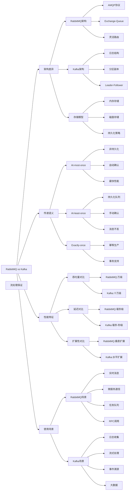

# RabbitMQ和Kafka的区别？

## 概要回答

RabbitMQ和Kafka是两种主流的消息队列系统，但设计理念和适用场景有显著差异。RabbitMQ基于AMQP协议，强调消息的可靠传递和灵活的路由机制，适合传统的消息队列场景。Kafka基于日志结构化存储，强调高吞吐量和持久化能力，适合大数据流处理场景。RabbitMQ适用于实时性要求高、消息量相对较小的业务场景；Kafka适用于海量数据处理、日志收集、流式计算等场景。选择时应根据具体的业务需求、性能要求和技术栈来决定。

## 深度解析

### 核心架构差异

#### RabbitMQ架构特点

```bash
# RabbitMQ核心组件
# Producer -> Exchange -> Queue -> Consumer
# Exchange Types: direct, fanout, topic, headers

# RabbitMQ管理命令
rabbitmq-server                    # 启动RabbitMQ服务器
rabbitmqctl status                # 查看RabbitMQ状态
rabbitmqctl list_queues           # 列出所有队列
rabbitmqctl list_exchanges        # 列出所有交换机
rabbitmq-plugins enable rabbitmq_management  # 启用管理插件
```

```php
<?php
// PHP示例：RabbitMQ基本使用
// 注意：需要安装php-amqplib库
// composer require php-amqplib/php-amqplib

use PhpAmqpLib\Connection\AMQPStreamConnection;
use PhpAmqpLib\Message\AMQPMessage;
use PhpAmqpLib\Wire\AMQPTable;

class RabbitMQDemo {
    /**
     * RabbitMQ演示类
     */
    
    private $host;
    private $connection;
    private $channel;
    
    public function __construct($host = 'localhost') {
        $this->host = $host;
        $this->connection = null;
        $this->channel = null;
    }
    
    /**
     * 建立连接
     */
    public function connect() {
        try {
            $this->connection = new AMQPStreamConnection($this->host, 5672, 'guest', 'guest');
            $this->channel = $this->connection->channel();
            echo "[RabbitMQ] Connected successfully\n";
            return true;
        } catch (Exception $e) {
            echo "[RabbitMQ] Connection failed: " . $e->getMessage() . "\n";
            return false;
        }
    }
    
    /**
     * 设置直连交换机
     */
    public function setupDirectExchange($exchangeName, $queueName, $routingKey) {
        // 声明交换机
        $this->channel->exchange_declare($exchangeName, 'direct', false, true, false);
        
        // 声明队列
        $this->channel->queue_declare($queueName, false, true, false, false);
        
        // 绑定队列到交换机
        $this->channel->queue_bind($queueName, $exchangeName, $routingKey);
        
        echo "[RabbitMQ] Direct exchange '{$exchangeName}' setup with queue '{$queueName}'\n";
    }
    
    /**
     * 设置扇出交换机
     */
    public function setupFanoutExchange($exchangeName, $queueNames) {
        // 声明扇出交换机
        $this->channel->exchange_declare($exchangeName, 'fanout', false, true, false);
        
        // 为每个队列声明并绑定
        foreach ($queueNames as $queueName) {
            $this->channel->queue_declare($queueName, false, true, false, false);
            $this->channel->queue_bind($queueName, $exchangeName);
        }
        
        echo "[RabbitMQ] Fanout exchange '{$exchangeName}' setup with queues: " . json_encode($queueNames) . "\n";
    }
    
    /**
     * 设置主题交换机
     */
    public function setupTopicExchange($exchangeName, $bindings) {
        // 声明主题交换机
        $this->channel->exchange_declare($exchangeName, 'topic', false, true, false);
        
        // 设置绑定关系
        foreach ($bindings as $queueName => $routingPattern) {
            $this->channel->queue_declare($queueName, false, true, false, false);
            $this->channel->queue_bind($queueName, $exchangeName, $routingPattern);
        }
        
        echo "[RabbitMQ] Topic exchange '{$exchangeName}' setup with bindings: " . json_encode($bindings) . "\n";
    }
    
    /**
     * 发布消息
     */
    public function publishMessage($exchangeName, $routingKey, $message) {
        try {
            $msg = new AMQPMessage(
                json_encode($message),
                [
                    'delivery_mode' => AMQPMessage::DELIVERY_MODE_PERSISTENT,
                    'content_type' => 'application/json'
                ]
            );
            
            $this->channel->basic_publish($msg, $exchangeName, $routingKey);
            echo "[RabbitMQ] Message published to '{$exchangeName}' with routing key '{$routingKey}': " . json_encode($message) . "\n";
        } catch (Exception $e) {
            echo "[RabbitMQ] Failed to publish message: " . $e->getMessage() . "\n";
        }
    }
    
    /**
     * 消费消息
     */
    public function consumeMessages($queueName, $callbackFunc) {
        // 设置公平分发
        $this->channel->basic_qos(null, 1, null);
        
        // 设置消费者回调
        $this->channel->basic_consume($queueName, '', false, false, false, false, function($msg) use ($callbackFunc) {
            try {
                $message = json_decode($msg->body, true);
                call_user_func($callbackFunc, $message);
                $msg->delivery_info['channel']->basic_ack($msg->delivery_info['delivery_tag']);
            } catch (Exception $e) {
                echo "[RabbitMQ] Error processing message: " . $e->getMessage() . "\n";
                $msg->delivery_info['channel']->basic_nack($msg->delivery_info['delivery_tag'], false, true);
            }
        });
        
        echo "[RabbitMQ] Started consuming from queue '{$queueName}'\n";
        
        // 开始消费
        while ($this->channel->is_consuming()) {
            $this->channel->wait();
        }
    }
    
    /**
     * 关闭连接
     */
    public function close() {
        if ($this->channel) {
            $this->channel->close();
        }
        if ($this->connection) {
            $this->connection->close();
        }
        echo "[RabbitMQ] Connection closed\n";
    }
}

// 使用示例
function demonstrateRabbitMQ() {
    echo "=== RabbitMQ Architecture Demonstration ===\n\n";
    
    // 初始化RabbitMQ客户端
    $rabbitmq = new RabbitMQDemo();
    if (!$rabbitmq->connect()) {
        return;
    }
    
    try {
        // 1. 直连交换机演示
        echo "1. Direct Exchange Demo:\n";
        $rabbitmq->setupDirectExchange('direct_logs', 'error_queue', 'error');
        $rabbitmq->setupDirectExchange('direct_logs', 'info_queue', 'info');
        
        // 发布消息
        $rabbitmq->publishMessage('direct_logs', 'error', [
            'level' => 'error',
            'message' => 'Database connection failed',
            'timestamp' => time()
        ]);
        
        $rabbitmq->publishMessage('direct_logs', 'info', [
            'level' => 'info',
            'message' => 'User login successful',
            'timestamp' => time()
        ]);
        
        // 2. 扇出交换机演示
        echo "\n2. Fanout Exchange Demo:\n";
        $rabbitmq->setupFanoutExchange('notifications', ['email_queue', 'sms_queue', 'push_queue']);
        
        $rabbitmq->publishMessage('notifications', '', [
            'type' => 'system_alert',
            'content' => 'System maintenance scheduled',
            'urgency' => 'high'
        ]);
        
        // 3. 主题交换机演示
        echo "\n3. Topic Exchange Demo:\n";
        $topicBindings = [
            'payment_notifications' => 'payment.*',
            'order_notifications' => 'order.*',
            'all_notifications' => '#'
        ];
        $rabbitmq->setupTopicExchange('topics', $topicBindings);
        
        $rabbitmq->publishMessage('topics', 'payment.success', [
            'event' => 'payment_success',
            'order_id' => 'ORD123456',
            'amount' => 99.99
        ]);
        
        $rabbitmq->publishMessage('topics', 'order.created', [
            'event' => 'order_created',
            'order_id' => 'ORD123457',
            'customer_id' => 'CUST789'
        ]);
        
        echo "\nRabbitMQ demonstration completed!\n";
        
    } finally {
        $rabbitmq->close();
    }
}

// demonstrateRabbitMQ();
?>
```

#### Kafka架构特点

```php
<?php
// PHP示例：Kafka基本使用
// 注意：需要安装rdkafka扩展
// pecl install rdkafka

/**
 * Kafka生产者演示
 */
class KafkaProducerDemo {
    private $producer;
    private $brokers;
    private $topicPrefix;
    
    public function __construct($brokers = 'localhost:9092', $topicPrefix = 'demo.') {
        $this->brokers = $brokers;
        $this->topicPrefix = $topicPrefix;
        
        // 创建Kafka配置
        $conf = new RdKafka\Conf();
        $conf->set('metadata.broker.list', $this->brokers);
        $conf->set('acks', 'all'); // 确保消息持久化
        $conf->set('retries', 3);  // 重试次数
        $conf->set('batch.size', 16384); // 批量大小
        $conf->set('linger.ms', 1); // 延迟发送时间
        
        $this->producer = new RdKafka\Producer($conf);
    }
    
    /**
     * 发送消息
     */
    public function sendMessage($topic, $key, $value) {
        $topicInstance = $this->producer->newTopic($topic);
        
        // 异步发送
        $topicInstance->produce(RD_KAFKA_PARTITION_UA, 0, $value, $key);
        
        // 等待消息发送完成
        $this->producer->poll(0);
        
        echo "[Kafka Producer] Message sent to topic {$topic}\n";
    }
    
    /**
     * 同步发送消息
     */
    public function sendSyncMessage($topic, $key, $value) {
        $topicInstance = $this->producer->newTopic($topic);
        
        // 发送消息
        $topicInstance->produce(RD_KAFKA_PARTITION_UA, 0, $value, $key);
        
        // 等待消息发送完成
        for ($flushRetries = 0; $flushRetries < 10; $flushRetries++) {
            $result = $this->producer->flush(10000);
            if (RD_KAFKA_RESP_ERR_NO_ERROR === $result) {
                break;
            }
        }
        
        echo "[Kafka Producer] Sync message sent to topic {$topic}\n";
    }
    
    /**
     * 关闭生产者
     */
    public function close() {
        $this->producer->flush(10000);
    }
}

/**
 * Kafka消费者演示
 */
class KafkaConsumerDemo {
    private $consumer;
    private $brokers;
    private $groupId;
    
    public function __construct($groupId, $brokers = 'localhost:9092') {
        $this->brokers = $brokers;
        $this->groupId = $groupId;
        
        // 创建Kafka配置
        $conf = new RdKafka\Conf();
        $conf->set('metadata.broker.list', $this->brokers);
        $conf->set('group.id', $this->groupId);
        $conf->set('auto.offset.reset', 'earliest'); // 从最早的消息开始消费
        $conf->set('enable.auto.commit', 'false'); // 手动提交偏移量
        
        $this->consumer = new RdKafka\KafkaConsumer($conf);
    }
    
    /**
     * 订阅主题
     */
    public function subscribeToTopics($topics) {
        $this->consumer->subscribe($topics);
        echo "[Kafka Consumer] Subscribed to topics: " . json_encode($topics) . "\n";
    }
    
    /**
     * 消费消息
     */
    public function consumeMessages($timeoutMs = 120000) {
        echo "[Kafka Consumer] Starting to consume messages...\n";
        
        try {
            while (true) {
                $message = $this->consumer->consume($timeoutMs);
                
                switch ($message->err) {
                    case RD_KAFKA_RESP_ERR_NO_ERROR:
                        echo sprintf(
                            "[Kafka Consumer] Received message - Topic: %s, Partition: %d, Offset: %d, Key: %s, Value: %s\n",
                            $message->topic_name,
                            $message->partition,
                            $message->offset,
                            $message->key,
                            $message->payload
                        );
                        
                        // 模拟处理时间
                        usleep(100000); // 100ms
                        
                        // 手动提交偏移量
                        $this->consumer->commit($message);
                        echo "[Kafka Consumer] Offset committed\n";
                        break;
                    case RD_KAFKA_RESP_ERR__PARTITION_EOF:
                        echo "No more messages; will wait for more\n";
                        break;
                    case RD_KAFKA_RESP_ERR__TIMED_OUT:
                        echo "Timed out\n";
                        break;
                    default:
                        throw new Exception($message->errstr(), $message->err);
                }
            }
        } catch (Exception $e) {
            echo "[Kafka Consumer] Error consuming messages: " . $e->getMessage() . "\n";
        }
    }
    
    /**
     * 关闭消费者
     */
    public function close() {
        // 消费者会自动清理
    }
}

/**
 * Kafka演示
 */
class KafkaDemo {
    private $brokers;
    private $topicPrefix;
    
    public function __construct($brokers = 'localhost:9092', $topicPrefix = 'demo.') {
        $this->brokers = $brokers;
        $this->topicPrefix = $topicPrefix;
    }
    
    /**
     * 演示Kafka架构特性
     */
    public function demonstrateKafkaArchitecture() {
        echo "=== Kafka Architecture Demonstration ===\n\n";
        
        // 1. 创建生产者
        $producer = new KafkaProducerDemo($this->brokers, $this->topicPrefix);
        
        // 2. 发送不同类型的消息
        echo "1. Sending various types of messages:\n";
        
        // 订单消息
        $producer->sendMessage($this->topicPrefix . 'orders', 'order-001', 
            '{"eventType":"orderCreated","orderId":"order-001","customerId":"cust-123","amount":99.99}');
        
        // 支付消息
        $producer->sendMessage($this->topicPrefix . 'payments', 'payment-001',
            '{"eventType":"paymentSuccess","paymentId":"payment-001","orderId":"order-001","amount":99.99}');
        
        // 用户行为消息
        $producer->sendMessage($this->topicPrefix . 'user-actions', 'user-123',
            '{"eventType":"pageView","userId":"user-123","page":"/products","timestamp":' . time() . '}');
        
        // 系统日志消息
        $producer->sendSyncMessage($this->topicPrefix . 'logs', 'server-01',
            '{"level":"INFO","message":"Application started","timestamp":' . time() . '}');
        
        // 3. 创建消费者组
        echo "\n2. Setting up consumer groups:\n";
        
        // 订单处理消费者组
        $orderConsumer = new KafkaConsumerDemo('order-processing-group', $this->brokers);
        $orderConsumer->subscribeToTopics([$this->topicPrefix . 'orders']);
        
        // 支付处理消费者组
        $paymentConsumer = new KafkaConsumerDemo('payment-processing-group', $this->brokers);
        $paymentConsumer->subscribeToTopics([$this->topicPrefix . 'payments']);
        
        // 通用日志消费者
        $logConsumer = new KafkaConsumerDemo('log-analysis-group', $this->brokers);
        $logConsumer->subscribeToTopics([$this->topicPrefix . 'logs']);
        
        // 清理资源
        $producer->close();
        echo "\nKafka architecture demonstration completed!\n";
    }
}

// 使用示例
// $kafkaDemo = new KafkaDemo();
// $kafkaDemo->demonstrateKafkaArchitecture();
?>
```

### 消息传递语义对比

#### RabbitMQ消息传递语义

```php
<?php
// PHP示例：RabbitMQ消息传递语义
// 注意：需要安装php-amqplib库
// composer require php-amqplib/php-amqplib

use PhpAmqpLib\Connection\AMQPStreamConnection;
use PhpAmqpLib\Message\AMQPMessage;
use PhpAmqpLib\Channel\AMQPChannel;

/**
 * RabbitMQ传递语义演示类
 */
class RabbitMQDeliverySemantics {
    private $connection;
    private $channel;
    
    public function __construct() {
        $this->connection = null;
        $this->channel = null;
    }
    
    /**
     * 建立连接
     */
    public function connect() {
        try {
            $this->connection = new AMQPStreamConnection('localhost', 5672, 'guest', 'guest');
            $this->channel = $this->connection->channel();
            echo "[RabbitMQ] Connected for delivery semantics demo\n";
            return true;
        } catch (Exception $e) {
            echo "[RabbitMQ] Connection failed: " . $e->getMessage() . "\n";
            return false;
        }
    }
    
    /**
     * 至多一次传递 (At-most-once)
     * 消息可能会丢失，但不会重复处理
     */
    public function demonstrateAtMostOnce() {
        echo "\n=== At-most-once Delivery Semantics ===\n";
        
        $queue = 'at_most_once_queue';
        
        // 声明队列（非持久化）
        $this->channel->queue_declare($queue, false, false, false, true);
        
        // 发布消息（非持久化）
        $messageData = [
            'id' => time(),
            'content' => 'At-most-once message',
            'timestamp' => date('c')
        ];
        
        $msg = new AMQPMessage(json_encode($messageData), [
            'delivery_mode' => AMQPMessage::DELIVERY_MODE_NON_PERSISTENT
        ]);
        
        $this->channel->basic_publish($msg, '', $queue);
        echo "[RabbitMQ] At-most-once message sent\n";
        
        // 消费消息（自动确认）
        $this->channel->basic_consume($queue, '', false, true, false, false, function($msg) {
            $content = json_decode($msg->body, true);
            echo "[Consumer] Processing at-most-once message: " . json_encode($content) . "\n";
            echo "[Consumer] Message acknowledged immediately\n";
        });
        
        // 处理消息
        while (count($this->channel->callbacks)) {
            $this->channel->wait();
        }
    }
    
    /**
     * 至少一次传递 (At-least-once)
     * 消息不会丢失，但可能重复处理
     */
    public function demonstrateAtLeastOnce() {
        echo "\n=== At-least-once Delivery Semantics ===\n";
        
        $queue = 'at_least_once_queue';
        
        // 声明持久化队列
        $this->channel->queue_declare($queue, false, true, false, false);
        
        // 发布持久化消息
        $messageData = [
            'id' => time(),
            'content' => 'At-least-once message',
            'timestamp' => date('c'),
            'retryCount' => 0
        ];
        
        $msg = new AMQPMessage(json_encode($messageData), [
            'delivery_mode' => AMQPMessage::DELIVERY_MODE_PERSISTENT
        ]);
        
        $this->channel->basic_publish($msg, '', $queue);
        echo "[RabbitMQ] At-least-once message sent\n";
        
        // 消费消息（手动确认）
        $processedMessages = [];
        $this->channel->basic_consume($queue, '', false, false, false, false, function($msg) use (&$processedMessages) {
            try {
                $content = json_decode($msg->body, true);
                echo "[Consumer] Processing at-least-once message: " . json_encode($content) . "\n";
                
                // 模拟可能的处理失败
                if ($content['retryCount'] < 2 && mt_rand(0, 100) < 30) {
                    throw new Exception('Simulated processing failure');
                }
                
                // 模拟处理时间
                usleep(100000); // 100ms
                
                // 手动确认消息
                $msg->delivery_info['channel']->basic_ack($msg->delivery_info['delivery_tag']);
                echo "[Consumer] Message processed and acknowledged\n";
                
            } catch (Exception $e) {
                echo "[Consumer] Error processing message: " . $e->getMessage() . "\n";
                
                // 拒绝消息并重新入队
                $msg->delivery_info['channel']->basic_nack($msg->delivery_info['delivery_tag'], false, true);
                echo "[Consumer] Message rejected and requeued\n";
            }
        });
        
        // 处理消息
        while (count($this->channel->callbacks)) {
            $this->channel->wait();
        }
    }
    
    /**
     * 恰好一次传递 (Exactly-once)
     * 消息既不会丢失也不会重复处理
     */
    public function demonstrateExactlyOnce() {
        echo "\n=== Exactly-once Delivery Semantics ===\n";
        
        // RabbitMQ本身不直接支持恰好一次语义
        // 需要通过应用层实现幂等性
        echo "[RabbitMQ] Note: Exactly-once requires application-level idempotency\n";
        
        $queue = 'exactly_once_queue';
        $processedMessages = []; // 简化的去重机制
        
        // 声明队列
        $this->channel->queue_declare($queue, false, true, false, false);
        
        // 发布消息
        $messageId = 'msg_' . time();
        $messageData = [
            'id' => $messageId,
            'content' => 'Exactly-once message',
            'timestamp' => date('c')
        ];
        
        $msg = new AMQPMessage(json_encode($messageData), [
            'delivery_mode' => AMQPMessage::DELIVERY_MODE_PERSISTENT
        ]);
        
        $this->channel->basic_publish($msg, '', $queue);
        echo "[RabbitMQ] Exactly-once message sent with ID: {$messageId}\n";
        
        // 消费消息（带幂等性检查）
        $this->channel->basic_consume($queue, '', false, false, false, false, function($msg) use (&$processedMessages) {
            try {
                $content = json_decode($msg->body, true);
                echo "[Consumer] Checking exactly-once message: " . json_encode($content) . "\n";
                
                // 幂等性检查
                if (in_array($content['id'], $processedMessages)) {
                    echo "[Consumer] Message already processed, skipping\n";
                    $msg->delivery_info['channel']->basic_ack($msg->delivery_info['delivery_tag']);
                    return;
                }
                
                // 模拟处理
                echo "[Consumer] Processing unique message: " . $content['id'] . "\n";
                $processedMessages[] = $content['id'];
                
                // 模拟处理时间
                usleep(100000); // 100ms
                
                $msg->delivery_info['channel']->basic_ack($msg->delivery_info['delivery_tag']);
                echo "[Consumer] Unique message processed and acknowledged\n";
                
            } catch (Exception $e) {
                echo "[Consumer] Error processing exactly-once message: " . $e->getMessage() . "\n";
                $msg->delivery_info['channel']->basic_nack($msg->delivery_info['delivery_tag'], false, true);
            }
        });
        
        // 处理消息
        while (count($this->channel->callbacks)) {
            $this->channel->wait();
        }
    }
    
    /**
     * 事务支持演示
     */
    public function demonstrateTransactions() {
        echo "\n=== Transaction Support ===\n";
        
        try {
            // 开启事务
            $this->channel->tx_select();
            echo "[RabbitMQ] Transaction started\n";
            
            // 在事务中发送多条消息
            $queue = 'transactional_queue';
            $this->channel->queue_declare($queue, false, true, false, false);
            
            for ($i = 1; $i <= 3; $i++) {
                $messageData = [
                    'id' => "tx_msg_{$i}",
                    'content' => "Transactional message {$i}",
                    'timestamp' => date('c')
                ];
                
                $msg = new AMQPMessage(json_encode($messageData));
                $this->channel->basic_publish($msg, '', $queue);
                echo "[RabbitMQ] Message {$i} sent in transaction\n";
            }
            
            // 提交事务
            $this->channel->tx_commit();
            echo "[RabbitMQ] Transaction committed successfully\n";
            
        } catch (Exception $e) {
            echo "[RabbitMQ] Transaction failed, rolling back: " . $e->getMessage() . "\n";
            try {
                $this->channel->tx_rollback();
                echo "[RabbitMQ] Transaction rolled back\n";
            } catch (Exception $rollbackError) {
                echo "[RabbitMQ] Rollback failed: " . $rollbackError->getMessage() . "\n";
            }
        }
    }
    
    /**
     * 关闭连接
     */
    public function close() {
        if ($this->connection) {
            $this->connection->close();
            echo "[RabbitMQ] Connection closed\n";
        }
    }
}

/**
 * 演示RabbitMQ传递语义
 */
function demonstrateRabbitMQSemantics() {
    echo "=== RabbitMQ Delivery Semantics Demonstration ===\n";
    
    $semanticsDemo = new RabbitMQDeliverySemantics();
    
    if ($semanticsDemo->connect()) {
        try {
            // 演示不同传递语义
            $semanticsDemo->demonstrateAtMostOnce();
            $semanticsDemo->demonstrateAtLeastOnce();
            $semanticsDemo->demonstrateExactlyOnce();
            $semanticsDemo->demonstrateTransactions();
            
            // 等待处理完成
            sleep(2);
            
        } finally {
            $semanticsDemo->close();
        }
    }
    
    echo "\nRabbitMQ delivery semantics demonstration completed!\n";
}

// demonstrateRabbitMQSemantics();
?>
```

#### Kafka消息传递语义

```go
// Go示例：Kafka消息传递语义
package main

import (
    "context"
    "encoding/json"
    "fmt"
    "log"
    "time"
    "github.com/segmentio/kafka-go"
)

// 消息结构体
type KafkaMessage struct {
    ID        string    `json:"id"`
    Content   string    `json:"content"`
    Timestamp time.Time `json:"timestamp"`
    Retry     int       `json:"retry"`
}

// Kafka传递语义演示
type KafkaDeliverySemantics struct {
    brokerAddress string
    writer        *kafka.Writer
}

func NewKafkaDeliverySemantics(broker string) *KafkaDeliverySemantics {
    return &KafkaDeliverySemantics{
        brokerAddress: broker,
    }
}

/**
 * 至多一次传递 (At-most-once)
 * 通过不等待确认和不重试来实现
 */
func (kds *KafkaDeliverySemantics) DemonstrateAtMostOnce() {
    fmt.Println("\n=== Kafka At-most-once Delivery Semantics ===")
    
    // 创建生产者（不等待确认）
    writer := &kafka.Writer{
        Addr:     kafka.TCP(kds.brokerAddress),
        Topic:    "at_most_once_topic",
        Balancer: &kafka.LeastBytes{},
        // 不等待确认
        RequiredAcks: kafka.RequireNone,
        // 不重试
        MaxAttempts: 1,
    }
    
    defer writer.Close()
    
    // 发送消息
    message := KafkaMessage{
        ID:        fmt.Sprintf("msg_%d", time.Now().UnixNano()),
        Content:   "At-most-once message",
        Timestamp: time.Now(),
    }
    
    messageBytes, _ := json.Marshal(message)
    
    err := writer.WriteMessages(context.Background(),
        kafka.Message{
            Key:   []byte(message.ID),
            Value: messageBytes,
        },
    )
    
    if err != nil {
        log.Printf("[Kafka] At-most-once send error: %v", err)
    } else {
        fmt.Println("[Kafka] At-most-once message sent (no ack required)")
    }
}

/**
 * 至少一次传递 (At-least-once)
 * 通过等待确认和重试来实现
 */
func (kds *KafkaDeliverySemantics) DemonstrateAtLeastOnce() {
    fmt.Println("\n=== Kafka At-least-once Delivery Semantics ===")
    
    // 创建生产者（等待所有副本确认）
    writer := &kafka.Writer{
        Addr:         kafka.TCP(kds.brokerAddress),
        Topic:        "at_least_once_topic",
        Balancer:     &kafka.LeastBytes{},
        RequiredAcks: kafka.RequireAll,
        MaxAttempts:  3,
        BatchTimeout: 10 * time.Millisecond,
    }
    
    defer writer.Close()
    
    // 发送消息
    message := KafkaMessage{
        ID:        fmt.Sprintf("msg_%d", time.Now().UnixNano()),
        Content:   "At-least-once message",
        Timestamp: time.Now(),
        Retry:     0,
    }
    
    messageBytes, _ := json.Marshal(message)
    
    err := writer.WriteMessages(context.Background(),
        kafka.Message{
            Key:   []byte(message.ID),
            Value: messageBytes,
        },
    )
    
    if err != nil {
        log.Printf("[Kafka] At-least-once send error: %v", err)
    } else {
        fmt.Println("[Kafka] At-least-once message sent with full ack")
    }
}

/**
 * 恰好一次传递 (Exactly-once)
 * 通过幂等生产和事务来实现
 */
func (kds *KafkaDeliverySemantics) DemonstrateExactlyOnce() {
    fmt.Println("\n=== Kafka Exactly-once Delivery Semantics ===")
    
    fmt.Println("[Kafka] Exactly-once semantics features:")
    fmt.Println("1. Idempotent Producer (PID + Sequence Number)")
    fmt.Println("2. Transactional Producer (Begin/Commit/Rollback)")
    fmt.Println("3. Consumer offset management")
    
    // 幂等生产者配置示例
    fmt.Println("\nIdempotent Producer Configuration:")
    fmt.Println("  enable.idempotence=true")
    fmt.Println("  retries=Integer.MAX_VALUE")
    fmt.Println("  max.in.flight.requests.per.connection=5")
    
    // 事务生产者配置示例
    fmt.Println("\nTransactional Producer Configuration:")
    fmt.Println("  transactional.id=unique-producer-id")
    fmt.Println("  enable.idempotence=true")
}

/**
 * 消费者传递语义演示
 */
func (kds *KafkaDeliverySemantics) DemonstrateConsumerSemantics() {
    fmt.Println("\n=== Kafka Consumer Delivery Semantics ===")
    
    fmt.Println("Consumer Offset Management Strategies:")
    fmt.Println("1. Auto Commit (at-most-once risk)")
    fmt.Println("2. Manual Commit (at-least-once guarantee)")
    fmt.Println("3. Exactly-once with Kafka Streams")
    
    // 手动提交偏移量示例
    fmt.Println("\nManual Offset Commit Example:")
    fmt.Println(`
    // 处理消息
    for message := range reader.Messages() {
        // 处理业务逻辑
        processMessage(message)
        
        // 手动提交偏移量
        err := reader.CommitMessages(context.Background(), message)
        if err != nil {
            log.Printf("Commit failed: %v", err)
            // 可能导致重复处理
        }
    }
    `)
}

/**
 * Kafka Streams恰好一次处理
 */
func (kds *KafkaDeliverySemantics) DemonstrateKafkaStreamsExactlyOnce() {
    fmt.Println("\n=== Kafka Streams Exactly-once Processing ===")
    
    fmt.Println("Kafka Streams Exactly-once Features:")
    fmt.Println("1. eos.beta.enable=true (Kafka 2.5+)")
    fmt.Println("2. processing.guarantee=exactly_once_v2")
    fmt.Println("3. State store consistency")
    fmt.Println("4. Changelog topic replication")
    
    fmt.Println("\nExample Configuration:")
    fmt.Println(`
    props.put(StreamsConfig.PROCESSING_GUARANTEE_CONFIG, 
              StreamsConfig.EXACTLY_ONCE_V2)
    props.put(StreamsConfig.NUM_STANDBY_REPLICAS_CONFIG, 1)
    `)
    
    fmt.Println("\nExactly-once Guarantees:")
    fmt.Println("- No duplicates within a topic-partition")
    fmt.Println("- State store consistency")
    fmt.Println("- End-to-end exactly-once semantics")
}

// 主演示函数
func demonstrateKafkaSemantics() {
    fmt.Println("=== Kafka Delivery Semantics Demonstration ===")
    
    semantics := NewKafkaDeliverySemantics("localhost:9092")
    
    // 演示不同传递语义
    semantics.DemonstrateAtMostOnce()
    semantics.DemonstrateAtLeastOnce()
    semantics.DemonstrateExactlyOnce()
    semantics.DemonstrateConsumerSemantics()
    semantics.DemonstrateKafkaStreamsExactlyOnce()
    
    fmt.Println("\nKafka delivery semantics demonstration completed!")
}

/**
 * 性能特征对比演示
 */
func demonstratePerformanceCharacteristics() {
    fmt.Println("\n=== Performance Characteristics Comparison ===")
    
    fmt.Println("RabbitMQ Performance:")
    fmt.Println("- Throughput: ~20,000-50,000 msgs/sec")
    fmt.Println("- Latency: Milliseconds")
    fmt.Println("- Memory usage: Moderate")
    fmt.Println("- Suitable for: Real-time messaging")
    
    fmt.Println("\nKafka Performance:")
    fmt.Println("- Throughput: ~100,000-1,000,000+ msgs/sec")
    fmt.Println("- Latency: Milliseconds to seconds")
    fmt.Println("- Memory usage: High (disk-based)")
    fmt.Println("- Suitable for: Big data streaming")
    
    fmt.Println("\nScalability:")
    fmt.Println("RabbitMQ: Vertical scaling, clustering")
    fmt.Println("Kafka: Horizontal scaling, partitioning")
}

func main() {
    demonstrateKafkaSemantics()
    demonstratePerformanceCharacteristics()
}
```

### 使用场景对比

#### RabbitMQ适用场景

```bash
# RabbitMQ适用场景配置示例

# 场景1: 金融服务 - 交易确认
# rabbitmq.conf
listeners.tcp.default = 5672
management.tcp.port = 15672
vm_memory_high_watermark.relative = 0.6
disk_free_limit.relative = 2.0

# 队列持久化配置
queue_master_locator = min-masters
cluster_partition_handling = pause_minority

# 场景2: 电商系统 - 订单处理
# 启用延时消息插件
rabbitmq-plugins enable rabbitmq_delayed_message_exchange

# 场景3: 微服务通信
# 启用管理插件
rabbitmq-plugins enable rabbitmq_management
```

```php
<?php
// PHP示例：RabbitMQ典型应用场景
// 注意：需要安装php-amqplib库
// composer require php-amqplib/php-amqplib

use PhpAmqpLib\Connection\AMQPStreamConnection;
use PhpAmqpLib\Message\AMQPMessage;
use PhpAmqpLib\Wire\AMQPTable;

/**
 * RabbitMQ典型应用场景演示
 */
class RabbitMQUseCases {
    private $host;
    private $connection;
    private $channel;
    
    public function __construct($host = 'localhost') {
        $this->host = $host;
        $this->connection = null;
        $this->channel = null;
    }
    
    /**
     * 建立连接
     */
    public function connect() {
        try {
            $this->connection = new AMQPStreamConnection($this->host, 5672, 'guest', 'guest');
            $this->channel = $this->connection->channel();
            return true;
        } catch (Exception $e) {
            echo "Connection failed: " . $e->getMessage() . "\n";
            return false;
        }
    }
    
    /**
     * 关闭连接
     */
    public function close() {
        if ($this->connection) {
            $this->connection->close();
        }
    }
    
    /**
     * 金融服务场景：交易确认
     */
    public function financialTradingScenario() {
        echo "=== Financial Trading Scenario ===\n";
        
        // 设置死信交换机用于超时处理
        $this->channel->exchange_declare('trading_dlx', 'direct', false, true, false);
        $this->channel->queue_declare('trading_timeout_queue', false, true, false, false);
        $this->channel->queue_bind('trading_timeout_queue', 'trading_dlx', 'timeout');
        
        // 设置主交易队列
        $this->channel->exchange_declare('trading', 'direct', false, true, false);
        $result = $this->channel->queue_declare('', false, true, true, false);
        $queueName = $result[0];
        
        $this->channel->queue_bind($queueName, 'trading', 'trade');
        
        // 发送交易消息
        $tradeData = [
            'trade_id' => uniqid('trade_', true),
            'account' => 'ACC123456',
            'symbol' => 'AAPL',
            'quantity' => 100,
            'price' => 150.00,
            'timestamp' => date('c')
        ];
        
        $msg = new AMQPMessage(json_encode($tradeData), [
            'delivery_mode' => AMQPMessage::DELIVERY_MODE_PERSISTENT,
            'expiration' => '30000'  // 30秒超时
        ]);
        
        $this->channel->basic_publish($msg, 'trading', 'trade');
        
        echo "Trade message sent: " . json_encode($tradeData) . "\n";
    }
    
    /**
     * 电商场景：订单处理
     */
    public function ecommerceOrderScenario() {
        echo "\n=== E-commerce Order Processing Scenario ===\n";
        
        // 设置延时交换机
        $this->channel->exchange_declare(
            'delayed_orders',
            'x-delayed-message',
            false,
            true,
            false,
            false,
            false,
            new AMQPTable(['x-delayed-type' => 'direct'])
        );
        
        // 设置订单处理队列
        $this->channel->queue_declare('order_processing', false, true, false, false);
        $this->channel->queue_bind('order_processing', 'delayed_orders', 'order');
        
        // 发送延时订单消息（模拟预订单）
        $orderData = [
            'order_id' => 'ORD' . time(),
            'customer_id' => 'CUST789',
            'items' => [['product_id' => 'PROD001', 'quantity' => 2]],
            'total_amount' => 199.99,
            'created_at' => date('c')
        ];
        
        // 5分钟后处理订单
        $delayMs = 5 * 60 * 1000;
        
        $msg = new AMQPMessage(json_encode($orderData), [
            'headers' => ['x-delay' => $delayMs]
        ]);
        
        $this->channel->basic_publish($msg, 'delayed_orders', 'order');
        
        echo "Delayed order message sent: " . json_encode($orderData) . "\n";
    }
    
    /**
     * 微服务场景：服务间通信
     */
    public function microservicesScenario() {
        echo "\n=== Microservices Communication Scenario ===\n";
        
        // 设置扇出交换机用于事件广播
        $this->channel->exchange_declare('service_events', 'fanout', false, true, false);
        
        // 不同服务的队列
        $services = ['user_service', 'order_service', 'notification_service', 'analytics_service'];
        
        foreach ($services as $service) {
            $queueName = $service . '_queue';
            $this->channel->queue_declare($queueName, false, true, false, false);
            $this->channel->queue_bind($queueName, 'service_events');
        }
        
        // 发布用户注册事件
        $userEvent = [
            'event_type' => 'user_registered',
            'user_id' => 'USER12345',
            'email' => 'user@example.com',
            'registered_at' => date('c'),
            'source_service' => 'auth_service'
        ];
        
        $msg = new AMQPMessage(json_encode($userEvent));
        $this->channel->basic_publish($msg, 'service_events');
        
        echo "User registration event broadcasted: " . json_encode($userEvent) . "\n";
    }
    
    /**
     * RPC场景：远程过程调用
     */
    public function rpcScenario() {
        echo "\n=== RPC Scenario ===\n";
        
        // 设置RPC队列
        $this->channel->queue_declare('rpc_requests', false, true, false, false);
        $this->channel->queue_declare('rpc_replies', false, true, false, false);
        
        // 发送RPC请求
        $requestData = [
            'request_id' => uniqid('req_', true),
            'method' => 'calculate_discount',
            'params' => ['customer_id' => 'CUST789', 'order_amount' => 299.99],
            'timestamp' => date('c')
        ];
        
        $correlationId = $requestData['request_id'];
        $replyTo = 'rpc_replies';
        
        $msg = new AMQPMessage(json_encode($requestData), [
            'correlation_id' => $correlationId,
            'reply_to' => $replyTo
        ]);
        
        $this->channel->basic_publish($msg, '', 'rpc_requests');
        
        echo "RPC request sent: " . json_encode($requestData) . "\n";
    }
    
    /**
     * 优先级消息场景
     */
    public function priorityMessagingScenario() {
        echo "\n=== Priority Messaging Scenario ===\n";
        
        // 设置优先级队列
        $this->channel->queue_declare(
            'priority_queue',
            false,
            true,
            false,
            false,
            false,
            new AMQPTable(['x-max-priority' => 10])
        );
        
        // 发送不同优先级的消息
        $messages = [
            ['content' => 'Low priority message', 'priority' => 1],
            ['content' => 'Normal priority message', 'priority' => 5],
            ['content' => 'High priority message', 'priority' => 9],
            ['content' => 'Critical priority message', 'priority' => 10]
        ];
        
        foreach ($messages as $msg) {
            $message = new AMQPMessage($msg['content'], [
                'priority' => $msg['priority']
            ]);
            
            $this->channel->basic_publish($message, '', 'priority_queue');
            echo "Sent: {$msg['content']} (Priority: {$msg['priority']})\n";
        }
    }
}

/**
 * 演示RabbitMQ典型使用场景
 */
function demonstrateRabbitMQUseCases() {
    echo "=== RabbitMQ Typical Use Cases ===\n";
    
    $useCases = new RabbitMQUseCases();
    
    if ($useCases->connect()) {
        try {
            $useCases->financialTradingScenario();
            $useCases->ecommerceOrderScenario();
            $useCases->microservicesScenario();
            $useCases->rpcScenario();
            $useCases->priorityMessagingScenario();
            
            echo "\nAll RabbitMQ use cases demonstrated successfully!\n";
            
        } finally {
            $useCases->close();
        }
    } else {
        echo "Failed to connect to RabbitMQ\n";
    }
}

// demonstrateRabbitMQUseCases();
?>
```

#### Kafka适用场景

```php
<?php
// PHP示例：Kafka典型应用场景
// 注意：需要安装rdkafka扩展
// pecl install rdkafka

/**
 * Kafka使用场景演示类
 */
class KafkaUseCases {
    private const BOOTSTRAP_SERVERS = "localhost:9092";
    
    /**
     * 大数据流处理场景
     */
    public static function demonstrateLogAggregation() {
        echo "=== Big Data Stream Processing: Log Aggregation ===\n";
        
        // 生产者配置
        $conf = new RdKafka\Conf();
        $conf->set('metadata.broker.list', self::BOOTSTRAP_SERVERS);
        $conf->set('compression.codec', 'snappy');
        $conf->set('batch.num.messages', '32768');
        $conf->set('queue.buffering.max.ms', '20');
        
        $producer = new RdKafka\Producer($conf);
        
        // 模拟应用服务器日志
        $logLevels = ["INFO", "WARN", "ERROR"];
        $services = ["UserService", "OrderService", "PaymentService"];
        
        // 发送大量日志消息
        for ($i = 0; $i < 1000; $i++) {
            $service = $services[array_rand($services)];
            $level = $logLevels[array_rand($logLevels)];
            
            $logMessage = json_encode([
                'timestamp' => time(),
                'level' => $level,
                'service' => $service,
                'message' => "Sample log message {$i}"
            ]);
            
            $topic = $producer->newTopic("application_logs");
            $topic->produce(RD_KAFKA_PARTITION_UA, 0, $logMessage, $service);
            
            // 模拟日志产生速率
            if ($i % 100 == 0) {
                usleep(10000); // 10ms
            }
        }
        
        // 等待消息发送完成
        $producer->flush(10000);
        echo "Log aggregation messages sent\n";
    }
    
    /**
     * 事件溯源场景
     */
    public static function demonstrateEventStore() {
        echo "\n=== Event Sourcing: Event Store ===\n";
        
        $conf = new RdKafka\Conf();
        $conf->set('metadata.broker.list', self::BOOTSTRAP_SERVERS);
        
        $producer = new RdKafka\Producer($conf);
        
        // 用户账户事件
        $accountId = "ACC123456";
        
        // 账户创建事件
        $createEvent = json_encode([
            'eventId' => 'evt_1',
            'eventType' => 'AccountCreated',
            'aggregateId' => $accountId,
            'timestamp' => time(),
            'data' => [
                'owner' => 'John Doe',
                'initialBalance' => 0.0
            ]
        ]);
        
        $topic = $producer->newTopic("account_events");
        $topic->produce(RD_KAFKA_PARTITION_UA, 0, $createEvent, $accountId);
        
        // 存款事件
        $depositEvent = json_encode([
            'eventId' => 'evt_2',
            'eventType' => 'MoneyDeposited',
            'aggregateId' => $accountId,
            'timestamp' => time(),
            'data' => [
                'amount' => 1000.0,
                'balance' => 1000.0
            ]
        ]);
        
        $topic->produce(RD_KAFKA_PARTITION_UA, 0, $depositEvent, $accountId);
        
        // 取款事件
        $withdrawEvent = json_encode([
            'eventId' => 'evt_3',
            'eventType' => 'MoneyWithdrawn',
            'aggregateId' => $accountId,
            'timestamp' => time(),
            'data' => [
                'amount' => 200.0,
                'balance' => 800.0
            ]
        ]);
        
        $topic->produce(RD_KAFKA_PARTITION_UA, 0, $withdrawEvent, $accountId);
        
        // 等待消息发送完成
        $producer->flush(10000);
        echo "Event sourcing events sent\n";
    }
    
    /**
     * 微服务数据同步场景
     */
    public static function demonstrateCDC() {
        echo "\n=== Change Data Capture for Microservices ===\n";
        
        $conf = new RdKafka\Conf();
        $conf->set('metadata.broker.list', self::BOOTSTRAP_SERVERS);
        
        $producer = new RdKafka\Producer($conf);
        
        // 模拟数据库变更事件
        $tables = ["users", "orders", "products"];
        $operations = ["INSERT", "UPDATE", "DELETE"];
        
        for ($i = 0; $i < 100; $i++) {
            $table = $tables[array_rand($tables)];
            $operation = $operations[array_rand($operations)];
            
            $cdcEvent = json_encode([
                'table' => $table,
                'operation' => $operation,
                'timestamp' => time(),
                'data' => [
                    'id' => $i,
                    'field1' => "value{$i}",
                    'field2' => $i
                ]
            ]);
            
            $topic = $producer->newTopic("cdc_events");
            $topic->produce(RD_KAFKA_PARTITION_UA, 0, $cdcEvent, $table);
            
            if ($i % 20 == 0) {
                usleep(50000); // 50ms
            }
        }
        
        // 等待消息发送完成
        $producer->flush(10000);
        echo "CDC events sent for microservices synchronization\n";
    }
    
    /**
     * IoT数据收集场景
     */
    public static function demonstrateSensorData() {
        echo "\n=== IoT Sensor Data Collection ===\n";
        
        $conf = new RdKafka\Conf();
        $conf->set('metadata.broker.list', self::BOOTSTRAP_SERVERS);
        $conf->set('compression.codec', 'lz4');
        $conf->set('batch.num.messages', '65536');
        
        $producer = new RdKafka\Producer($conf);
        
        // 模拟IoT设备数据
        $deviceTypes = ["temperature", "humidity", "pressure"];
        $locations = ["factory_a", "factory_b", "warehouse"];
        
        // 模拟定时发送数据
        for ($i = 0; $i < 10; $i++) {
            $deviceId = $i;
            $deviceType = $deviceTypes[array_rand($deviceTypes)];
            $location = $locations[array_rand($locations)];
            
            $value = mt_rand(0, 10000) / 100; // 0-100之间的随机数
            $unit = $deviceType === "temperature" ? "°C" : 
                   ($deviceType === "humidity" ? "%" : "Pa");
            
            $sensorData = json_encode([
                'deviceId' => "sensor_{$deviceId}",
                'deviceType' => $deviceType,
                'location' => $location,
                'timestamp' => time(),
                'value' => $value,
                'unit' => $unit
            ]);
            
            $topic = $producer->newTopic("sensor_data");
            $topic->produce(RD_KAFKA_PARTITION_UA, 0, $sensorData, $location);
        }
        
        echo "IoT sensor data collection started\n";
        
        // 等待消息发送完成
        $producer->flush(10000);
        echo "IoT data collection completed\n";
    }
    
    // 主演示方法
    public static function demonstrateKafkaUseCases() {
        echo "=== Kafka Typical Use Cases ===\n";
        
        // 1. 大数据流处理
        self::demonstrateLogAggregation();
        
        // 2. 事件溯源
        self::demonstrateEventStore();
        
        // 3. 微服务数据同步
        self::demonstrateCDC();
        
        // 4. IoT数据收集
        self::demonstrateSensorData();
        
        echo "\nKafka use cases demonstration completed!\n";
    }
}

// 使用示例
// KafkaUseCases::demonstrateKafkaUseCases();
?>
```

## 图示说明



通过以上全面的对比分析，可以看出RabbitMQ和Kafka各有优势和适用场景。RabbitMQ适合需要复杂路由和实时性的传统消息队列场景，而Kafka适合大数据流处理和高吞吐量场景。在实际应用中，应根据具体需求选择合适的技术方案，有时甚至可以结合使用两者来发挥各自优势。