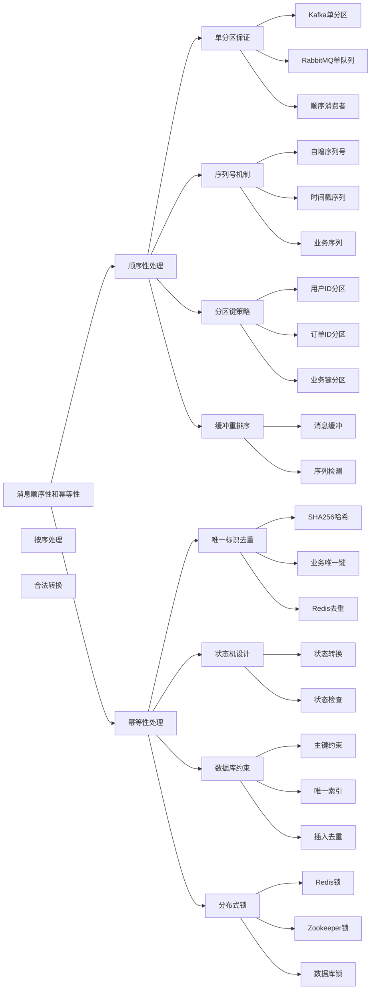

# 如何处理消息的顺序性和幂等性？

## 概要回答

消息顺序性和幂等性是分布式系统中确保数据一致性的两个关键问题。消息顺序性保证消息按照发送顺序被处理，可通过单分区策略、消息序列号、分布式锁等方式实现。消息幂等性确保相同消息多次处理结果一致，可通过唯一标识符去重、状态机设计、数据库约束等方法实现。在实际应用中，需要根据业务场景权衡顺序性、幂等性和性能之间的关系，选择合适的解决方案来满足系统的一致性要求。

## 深度解析

### 消息顺序性处理

#### 顺序性的重要性

```bash
# 消息顺序性场景示例

# 场景1: 银行账户操作
# 正确顺序: 存款100 -> 取款50 -> 存款30
# 错误顺序: 取款50 -> 存款100 -> 存款30 (可能导致余额不足)

# 场景2: 电商订单状态变更
# 正确顺序: 创建订单 -> 支付成功 -> 发货 -> 确认收货
# 错误顺序: 发货 -> 创建订单 -> 支付成功 (逻辑混乱)

# Kafka分区策略配置
num.partitions=1                    # 单分区保证全局顺序
partition.assignment.strategy=org.apache.kafka.clients.consumer.RoundRobinAssignor

# RabbitMQ队列配置
x-max-priority=10                   # 优先级队列
x-message-ttl=86400000             # 消息TTL
```

```php
<?php
// PHP示例：消息顺序性处理

/**
 * 消息类型枚举
 */
class MessageType {
    const ACCOUNT_DEPOSIT = "account_deposit";
    const ACCOUNT_WITHDRAW = "account_withdraw";
    const ORDER_CREATE = "order_create";
    const ORDER_PAY = "order_pay";
    const ORDER_SHIP = "order_ship";
    const ORDER_RECEIVE = "order_receive";
}

/**
 * 有序消息结构
 */
class OrderedMessage {
    public $id;
    public $type;
    public $sequenceNumber;
    public $timestamp;
    public $data;
    public $partitionKey;
    
    public function __construct($id, $type, $sequenceNumber, $timestamp, $data, $partitionKey) {
        $this->id = $id;
        $this->type = $type;
        $this->sequenceNumber = $sequenceNumber;
        $this->timestamp = $timestamp;
        $this->data = $data;
        $this->partitionKey = $partitionKey;
    }
}

/**
 * 消息顺序管理器
 */
class MessageOrderingManager {
    private $messageSequences;  // 存储每个分区的消息序列
    private $processedSequences;  // 存储已处理的序列号
    private $messageBuffer;  // 消息缓冲区
    
    public function __construct() {
        $this->messageSequences = [];
        $this->processedSequences = [];
        $this->messageBuffer = [];
    }
    
    /**
     * 为指定分区生成序列号
     */
    public function generateSequenceNumber($partitionKey) {
        if (!isset($this->messageSequences[$partitionKey])) {
            $this->messageSequences[$partitionKey] = 0;
        }
        
        $this->messageSequences[$partitionKey]++;
        return $this->messageSequences[$partitionKey];
    }
    
    /**
     * 检查是否为下一个期望的序列号
     */
    public function isNextSequence($partitionKey, $sequenceNumber) {
        $expectedSequence = isset($this->processedSequences[$partitionKey]) ? $this->processedSequences[$partitionKey] + 1 : 1;
        return $sequenceNumber == $expectedSequence;
    }
    
    /**
     * 缓冲乱序消息
     */
    public function bufferMessage($message) {
        $partitionKey = $message->partitionKey;
        if (!isset($this->messageBuffer[$partitionKey])) {
            $this->messageBuffer[$partitionKey] = [];
        }
        
        $this->messageBuffer[$partitionKey][] = $message;
        
        // 按序列号排序
        usort($this->messageBuffer[$partitionKey], function($a, $b) {
            return $a->sequenceNumber - $b->sequenceNumber;
        });
    }
    
    /**
     * 获取下一个可处理的消息
     */
    public function getNextReadyMessage($partitionKey) {
        $expectedSequence = isset($this->processedSequences[$partitionKey]) ? $this->processedSequences[$partitionKey] + 1 : 1;
        
        if (isset($this->messageBuffer[$partitionKey])) {
            $buffer = $this->messageBuffer[$partitionKey];
            if (!empty($buffer) && $buffer[0]->sequenceNumber == $expectedSequence) {
                return array_shift($this->messageBuffer[$partitionKey]);
            }
        }
        
        return null;
    }
    
    /**
     * 标记消息已处理
     */
    public function markProcessed($partitionKey, $sequenceNumber) {
        $this->processedSequences[$partitionKey] = $sequenceNumber;
    }
}

/**
 * 单分区顺序处理
 */
class SinglePartitionOrdering {
    private $messageQueue;
    private $lastProcessedId;
    private $processingLock;
    
    public function __construct() {
        $this->messageQueue = new SplQueue();
        $this->lastProcessedId = null;
        $this->processingLock = false;
    }
    
    /**
     * 发送有序消息
     */
    public function sendOrderedMessage($messageType, $data) {
        $message = new OrderedMessage(
            uniqid('msg_', true),
            $messageType,
            intval(microtime(true) * 1000000),  // 微秒级序列号
            microtime(true),
            $data,
            "single_partition"  // 所有消息使用相同分区键
        );
        
        $this->messageQueue->enqueue($message);
        echo "[SinglePartition] Message sent: {$message->type} - {$message->id}\n";
        return $message;
    }
    
    /**
     * 顺序处理消息
     */
    public function processMessagesSequentially($processorFunc) {
        while (true) {
            try {
                if ($this->messageQueue->isEmpty()) {
                    usleep(100000); // 100ms
                    continue;
                }
                
                $message = $this->messageQueue->dequeue();
                
                // 模拟锁定
                $this->processingLock = true;
                echo "[SinglePartition] Processing message: {$message->type} - {$message->id}\n";
                call_user_func($processorFunc, $message);
                $this->lastProcessedId = $message->id;
                echo "[SinglePartition] Message processed: {$message->id}\n";
                $this->processingLock = false;
                
            } catch (Exception $e) {
                echo "[SinglePartition] Error processing message: " . $e->getMessage() . "\n";
            }
        }
    }
}

/**
 * 基于分区的顺序处理
 */
class PartitionBasedOrdering {
    private $partitions;  // 每个分区一个队列
    private $orderingManager;
    
    public function __construct() {
        $this->partitions = [];
        $this->orderingManager = new MessageOrderingManager();
    }
    
    /**
     * 创建分区
     */
    public function createPartition($partitionKey) {
        if (!isset($this->partitions[$partitionKey])) {
            $this->partitions[$partitionKey] = new SplQueue();
            echo "[PartitionBased] Partition created: {$partitionKey}\n";
        }
    }
    
    /**
     * 向指定分区发送消息
     */
    public function sendMessageToPartition($partitionKey, $messageType, $data) {
        // 生成序列号
        $sequenceNumber = $this->orderingManager->generateSequenceNumber($partitionKey);
        
        $message = new OrderedMessage(
            uniqid('msg_', true),
            $messageType,
            $sequenceNumber,
            microtime(true),
            $data,
            $partitionKey
        );
        
        // 发送到对应分区
        if (isset($this->partitions[$partitionKey])) {
            $this->partitions[$partitionKey]->enqueue($message);
            echo "[PartitionBased] Message sent to partition {$partitionKey}: {$message->type}\n";
        }
        
        return $message;
    }
    
    /**
     * 处理指定分区的消息
     */
    public function processPartitionMessages($partitionKey, $processorFunc) {
        if (!isset($this->partitions[$partitionKey])) {
            return;
        }
        
        $partitionQueue = $this->partitions[$partitionKey];
        
        while (true) {
            try {
                if ($partitionQueue->isEmpty()) {
                    usleep(100000); // 100ms
                    continue;
                }
                
                $message = $partitionQueue->dequeue();
                
                // 检查是否为期望的序列号
                if ($this->orderingManager->isNextSequence($partitionKey, $message->sequenceNumber)) {
                    echo "[PartitionBased] Processing ordered message: {$message->type}\n";
                    call_user_func($processorFunc, $message);
                    $this->orderingManager->markProcessed($partitionKey, $message->sequenceNumber);
                    
                    // 检查缓冲区中是否有可处理的消息
                    $nextMessage = $this->orderingManager->getNextReadyMessage($partitionKey);
                    while ($nextMessage) {
                        echo "[PartitionBased] Processing buffered message: {$nextMessage->type}\n";
                        call_user_func($processorFunc, $nextMessage);
                        $this->orderingManager->markProcessed($partitionKey, $nextMessage->sequenceNumber);
                        $nextMessage = $this->orderingManager->getNextReadyMessage($partitionKey);
                    }
                } else {
                    // 缓冲乱序消息
                    echo "[PartitionBased] Buffering out-of-order message: {$message->sequenceNumber}\n";
                    $this->orderingManager->bufferMessage($message);
                }
                
            } catch (Exception $e) {
                echo "[PartitionBased] Error processing partition {$partitionKey}: " . $e->getMessage() . "\n";
            }
        }
    }
}

/**
 * 业务逻辑处理器
 */
class BusinessLogicProcessor {
    private $accountBalances;  // 账户余额
    private $orderStatuses;     // 订单状态
    
    public function __construct() {
        $this->accountBalances = [];
        $this->orderStatuses = [];
    }
    
    /**
     * 处理账户相关消息
     */
    public function processAccountMessage($message) {
        $accountId = isset($message->data['account_id']) ? $message->data['account_id'] : null;
        
        if ($message->type == MessageType::ACCOUNT_DEPOSIT) {
            $amount = isset($message->data['amount']) ? $message->data['amount'] : 0;
            $currentBalance = isset($this->accountBalances[$accountId]) ? $this->accountBalances[$accountId] : 0;
            $newBalance = $currentBalance + $amount;
            $this->accountBalances[$accountId] = $newBalance;
            echo "[Business] Account {$accountId}: deposited {$amount}, balance: {$newBalance}\n";
        } elseif ($message->type == MessageType::ACCOUNT_WITHDRAW) {
            $amount = isset($message->data['amount']) ? $message->data['amount'] : 0;
            $currentBalance = isset($this->accountBalances[$accountId]) ? $this->accountBalances[$accountId] : 0;
            if ($currentBalance >= $amount) {
                $newBalance = $currentBalance - $amount;
                $this->accountBalances[$accountId] = $newBalance;
                echo "[Business] Account {$accountId}: withdrew {$amount}, balance: {$newBalance}\n";
            } else {
                echo "[Business] Account {$accountId}: insufficient funds for withdrawal {$amount}\n";
            }
        }
    }
    
    /**
     * 处理订单相关消息
     */
    public function processOrderMessage($message) {
        $orderId = isset($message->data['order_id']) ? $message->data['order_id'] : null;
        
        if ($message->type == MessageType::ORDER_CREATE) {
            $this->orderStatuses[$orderId] = 'created';
            echo "[Business] Order {$orderId}: created\n";
        } elseif ($message->type == MessageType::ORDER_PAY) {
            if (isset($this->orderStatuses[$orderId]) && $this->orderStatuses[$orderId] == 'created') {
                $this->orderStatuses[$orderId] = 'paid';
                echo "[Business] Order {$orderId}: paid\n";
            } else {
                echo "[Business] Order {$orderId}: invalid state for payment\n";
            }
        } elseif ($message->type == MessageType::ORDER_SHIP) {
            if (isset($this->orderStatuses[$orderId]) && $this->orderStatuses[$orderId] == 'paid') {
                $this->orderStatuses[$orderId] = 'shipped';
                echo "[Business] Order {$orderId}: shipped\n";
            } else {
                echo "[Business] Order {$orderId}: invalid state for shipping\n";
            }
        } elseif ($message->type == MessageType::ORDER_RECEIVE) {
            if (isset($this->orderStatuses[$orderId]) && $this->orderStatuses[$orderId] == 'shipped') {
                $this->orderStatuses[$orderId] = 'received';
                echo "[Business] Order {$orderId}: received\n";
            } else {
                echo "[Business] Order {$orderId}: invalid state for receiving\n";
            }
        }
    }
}

/**
 * 演示消息顺序性处理
 */
function demonstrateMessageOrdering() {
    echo "=== Message Ordering Demonstration ===\n\n";
    
    // 1. 单分区顺序处理演示
    echo "1. Single Partition Ordering:\n";
    $singleOrdering = new SinglePartitionOrdering();
    $processor = new BusinessLogicProcessor();
    
    // 启动顺序处理线程（在PHP中使用单独的进程或循环）
    // 发送一系列有序消息
    $accountId = "ACC123";
    $singleOrdering->sendOrderedMessage(
        MessageType::ACCOUNT_DEPOSIT,
        ["account_id" => $accountId, "amount" => 100]
    );
    
    $singleOrdering->sendOrderedMessage(
        MessageType::ACCOUNT_WITHDRAW,
        ["account_id" => $accountId, "amount" => 50]
    );
    
    $singleOrdering->sendOrderedMessage(
        MessageType::ACCOUNT_DEPOSIT,
        ["account_id" => $accountId, "amount" => 30]
    );
    
    // 模拟处理
    usleep(1000000); // 1秒
    echo "Final balance: " . (isset($processor->accountBalances[$accountId]) ? $processor->accountBalances[$accountId] : 0) . "\n";
    
    echo "\n" . str_repeat("=", 50) . "\n\n";
    
    // 2. 分区基础顺序处理演示
    echo "2. Partition-Based Ordering:\n";
    $partitionOrdering = new PartitionBasedOrdering();
    
    // 创建分区
    $partitionOrdering->createPartition("account_partition");
    $partitionOrdering->createPartition("order_partition");
    
    // 发送分区消息
    $partitionOrdering->sendMessageToPartition(
        "account_partition",
        MessageType::ACCOUNT_DEPOSIT,
        ["account_id" => "ACC456", "amount" => 200]
    );
    
    $partitionOrdering->sendMessageToPartition(
        "order_partition",
        MessageType::ORDER_CREATE,
        ["order_id" => "ORD789"]
    );
    
    $partitionOrdering->sendMessageToPartition(
        "account_partition",
        MessageType::ACCOUNT_WITHDRAW,
        ["account_id" => "ACC456", "amount" => 100]
    );
    
    $partitionOrdering->sendMessageToPartition(
        "order_partition",
        MessageType::ORDER_PAY,
        ["order_id" => "ORD789"]
    );
    
    // 模拟处理
    usleep(1000000); // 1秒
    echo "Account balance: " . (isset($processor->accountBalances['ACC456']) ? $processor->accountBalances['ACC456'] : 0) . "\n";
    echo "Order status: " . (isset($processor->orderStatuses['ORD789']) ? $processor->orderStatuses['ORD789'] : 'unknown') . "\n";
    
    echo "\nMessage ordering demonstration completed!\n";
}

// demonstrateMessageOrdering();
?>
```

#### Kafka顺序性保证

```php
<?php
// PHP示例：Kafka顺序性处理
// 注意：需要安装rdkafka扩展
// pecl install rdkafka

/**
 * Kafka顺序性处理演示
 */
class KafkaOrderingDemo {
    private const BOOTSTRAP_SERVERS = "localhost:9092";
    
    /**
     * Kafka生产者 - 保证消息顺序
     */
    public static function demonstrateOrderedProducer() {
        // 创建生产者配置
        $conf = new RdKafka\Conf();
        $conf->set('metadata.broker.list', self::BOOTSTRAP_SERVERS);
        
        // 保证顺序的关键配置
        $conf->set('enable.idempotence', 'true');  // 幂等性
        $conf->set('max.in.flight.requests.per.connection', '1');  // 每连接最大请求数
        $conf->set('acks', 'all');  // 等待所有副本确认
        
        $producer = new RdKafka\Producer($conf);
        $sequenceCounters = [];
        
        /**
         * 发送有序消息到指定分区
         */
        $sendOrderedMessage = function($topicName, $partitionKey, $message) use ($producer, &$sequenceCounters) {
            // 为每个分区维护序列号
            if (!isset($sequenceCounters[$partitionKey])) {
                $sequenceCounters[$partitionKey] = 0;
            }
            $sequenceCounters[$partitionKey]++;
            $sequenceNumber = $sequenceCounters[$partitionKey];
            
            // 构造带序列号的消息
            $orderedMessage = json_encode([
                'sequence' => $sequenceNumber,
                'timestamp' => time(),
                'data' => $message
            ]);
            
            $topic = $producer->newTopic($topicName);
            $topic->produce(RD_KAFKA_PARTITION_UA, 0, $orderedMessage, $partitionKey);
            
            echo "Ordered message sent - Topic: {$topicName}, Sequence: {$sequenceNumber}\n";
            
            // 等待消息发送完成
            $producer->poll(0);
        };
        
        /**
         * 单分区保证全局顺序
         */
        $sendGloballyOrderedMessage = function($topicName, $message) use ($producer, &$sequenceCounters) {
            // 使用固定键确保所有消息进入同一分区
            $fixedKey = "global_order_key";
            
            if (!isset($sequenceCounters[$fixedKey])) {
                $sequenceCounters[$fixedKey] = 0;
            }
            $sequenceCounters[$fixedKey]++;
            $sequenceNumber = $sequenceCounters[$fixedKey];
            
            $orderedMessage = json_encode([
                'sequence' => $sequenceNumber,
                'timestamp' => time(),
                'data' => $message
            ]);
            
            $topic = $producer->newTopic($topicName);
            $topic->produce(RD_KAFKA_PARTITION_UA, 0, $orderedMessage, $fixedKey);
            
            echo "Globally ordered message sent - Sequence: {$sequenceNumber}\n";
            
            // 等待消息发送完成
            $producer->poll(0);
        };
        
        // 发送有序消息
        $topic = "ordered_topic";
        $partitionKey = "user_123";
        
        echo "Sending ordered messages...\n";
        for ($i = 1; $i <= 10; $i++) {
            $message = json_encode([
                'id' => "msg_{$i}",
                'content' => "Message {$i}"
            ]);
            $sendOrderedMessage($topic, $partitionKey, $message);
            
            // 模拟发送间隔
            usleep(100000); // 100ms
        }
        
        // 发送全局有序消息
        echo "\nSending globally ordered messages...\n";
        for ($i = 1; $i <= 5; $i++) {
            $message = json_encode([
                'id' => "global_msg_{$i}",
                'content' => "Global Message {$i}"
            ]);
            $sendGloballyOrderedMessage($topic, $message);
            
            usleep(100000); // 100ms
        }
        
        // 等待消息发送完成
        $producer->flush(10000);
        echo "Message sending completed!\n";
    }
    
    /**
     * Kafka消费者 - 处理有序消息
     */
    public static function demonstrateOrderedConsumer($groupId) {
        // 创建消费者配置
        $conf = new RdKafka\Conf();
        $conf->set('metadata.broker.list', self::BOOTSTRAP_SERVERS);
        $conf->set('group.id', $groupId);
        $conf->set('auto.offset.reset', 'earliest');
        $conf->set('enable.auto.commit', 'false');  // 手动提交偏移量
        
        $consumer = new RdKafka\KafkaConsumer($conf);
        $expectedSequences = [];
        $pendingMessages = [];
        
        /**
         * 提取序列号
         */
        $extractSequenceNumber = function($message) {
            // 简化的序列号提取逻辑
            $data = json_decode($message, true);
            return isset($data['sequence']) ? $data['sequence'] : 0;
        };
        
        /**
         * 处理有序消息
         */
        $processOrderedMessage = function($message, $key) use (&$expectedSequences, &$pendingMessages, $extractSequenceNumber) {
            try {
                // 提取序列号
                $sequenceNumber = $extractSequenceNumber($message);
                $expectedSequence = isset($expectedSequences[$key]) ? $expectedSequences[$key] : 1;
                
                echo "Received message - Key: {$key}, Sequence: {$sequenceNumber}, Expected: {$expectedSequence}\n";
                
                if ($sequenceNumber == $expectedSequence) {
                    // 序列号正确，处理消息
                    echo "Processing message in order: {$message}\n";
                    
                    // 更新期望序列号
                    $expectedSequences[$key] = $sequenceNumber + 1;
                    
                } else if ($sequenceNumber > $expectedSequence) {
                    // 消息超前，缓冲起来
                    echo "Buffering out-of-order message: {$sequenceNumber}\n";
                    if (!isset($pendingMessages[$key])) {
                        $pendingMessages[$key] = [];
                    }
                    $pendingMessages[$key][] = [
                        'sequence' => $sequenceNumber,
                        'value' => $message
                    ];
                    
                    // 按序列号排序
                    usort($pendingMessages[$key], function($a, $b) {
                        return $a['sequence'] - $b['sequence'];
                    });
                    
                } else {
                    // 重复消息或已处理的消息
                    echo "Skipping duplicate/reprocessed message: {$sequenceNumber}\n";
                }
                
            } catch (Exception $e) {
                echo "Error processing message: " . $e->getMessage() . "\n";
            }
        };
        
        // 消费消息
        $topic = "ordered_topic";
        $consumer->subscribe([$topic]);
        
        echo "Starting ordered message consumption from topic: {$topic}\n";
        
        try {
            while (true) {
                $message = $consumer->consume(1000);
                
                switch ($message->err) {
                    case RD_KAFKA_RESP_ERR_NO_ERROR:
                        $processOrderedMessage($message->payload, $message->key);
                        // 手动提交偏移量
                        $consumer->commit($message);
                        break;
                    case RD_KAFKA_RESP_ERR__PARTITION_EOF:
                        echo "No more messages; will wait for more\n";
                        break;
                    case RD_KAFKA_RESP_ERR__TIMED_OUT:
                        echo "Timed out\n";
                        break;
                    default:
                        throw new Exception($message->errstr(), $message->err);
                }
            }
        } catch (Exception $e) {
            echo "Error in ordered consumption: " . $e->getMessage() . "\n";
        }
    }
    
    /**
     * 顺序性验证演示
     */
    public static function demonstrateOrderingValidation() {
        echo "=== Kafka Ordering Validation ===\n";
        
        // 演示生产者
        self::demonstrateOrderedProducer();
        
        echo "\nKafka ordering validation completed!\n";
    }
}

// 使用示例
// KafkaOrderingDemo::demonstrateOrderingValidation();
?>
```

### 消息幂等性处理

#### 幂等性设计原则

```php
<?php
// PHP示例：消息幂等性处理
// 注意：需要安装Predis库
// composer require predis/predis

use Predis\Client as RedisClient;

/**
 * 幂等消息处理器
 */
class IdempotentMessageHandler {
    private $redisClient;
    private $processedMessages; // 内存缓存
    private $messageStates;     // 消息状态机
    
    public function __construct() {
        $this->redisClient = new RedisClient();
        $this->processedMessages = [];
        $this->messageStates = [];
    }
    
    /**
     * 生成消息唯一标识符
     */
    public function generateMessageId($message) {
        // 基于消息内容生成SHA256哈希
        $messageStr = json_encode($message, JSON_UNESCAPED_UNICODE | JSON_UNESCAPED_SLASHES);
        return hash('sha256', $messageStr);
    }
    
    /**
     * 方法1: 基于唯一标识符的去重
     */
    public function isMessageProcessed($messageId, $ttl = 86400) {
        try {
            // 检查Redis中的记录
            $result = $this->redisClient->get("processed:{$messageId}");
            if ($result !== null) {
                echo "[Idempotency] Message already processed: {$messageId}\n";
                return true;
            }
            
            // 检查内存缓存
            if (isset($this->processedMessages[$messageId])) {
                echo "[Idempotency] Message in memory cache: {$messageId}\n";
                return true;
            }
            
            return false;
        } catch (Exception $e) {
            echo "[Idempotency] Error checking message status: " . $e->getMessage() . "\n";
            return false; // 出错时假设未处理，避免丢失消息
        }
    }
    
    /**
     * 记录已处理消息
     */
    public function recordProcessedMessage($messageId, $ttl = 86400) {
        try {
            // 记录到Redis
            $this->redisClient->setex("processed:{$messageId}", $ttl, '1');
            
            // 记录到内存缓存
            $this->processedMessages[$messageId] = time();
            
            echo "[Idempotency] Message recorded: {$messageId}\n";
        } catch (Exception $e) {
            echo "[Idempotency] Error recording message: " . $e->getMessage() . "\n";
        }
    }
    
    /**
     * 方法2: 基于状态机的幂等性
     */
    public function processWithStateMachine($message) {
        $messageId = $this->generateMessageId($message);
        $businessId = isset($message['businessId']) ? $message['businessId'] : null; // 业务唯一标识
        
        try {
            // 获取当前状态
            $currentState = $this->getCurrentState($businessId);
            
            // 根据消息类型和当前状态决定处理逻辑
            switch ($message['type']) {
                case 'ORDER_CREATE':
                    if ($currentState === 'NONEXISTENT') {
                        $result = $this->createOrder($message);
                        if ($result) {
                            $this->updateState($businessId, 'CREATED');
                            $this->recordProcessedMessage($messageId);
                            return ['success' => true, 'message' => 'Order created'];
                        }
                    }
                    break;
                    
                case 'ORDER_PAY':
                    if ($currentState === 'CREATED') {
                        $result = $this->payOrder($message);
                        if ($result) {
                            $this->updateState($businessId, 'PAID');
                            $this->recordProcessedMessage($messageId);
                            return ['success' => true, 'message' => 'Order paid'];
                        }
                    } else if ($currentState === 'PAID') {
                        // 已支付，幂等处理
                        return ['success' => true, 'message' => 'Order already paid'];
                    }
                    break;
                    
                case 'ORDER_CANCEL':
                    if ($currentState === 'CREATED' || $currentState === 'PAID') {
                        $result = $this->cancelOrder($message);
                        if ($result) {
                            $this->updateState($businessId, 'CANCELLED');
                            $this->recordProcessedMessage($messageId);
                            return ['success' => true, 'message' => 'Order cancelled'];
                        }
                    } else if ($currentState === 'CANCELLED') {
                        // 已取消，幂等处理
                        return ['success' => true, 'message' => 'Order already cancelled'];
                    }
                    break;
            }
            
            // 状态不匹配或已处理
            echo "[Idempotency] Invalid state transition: {$message['type']} from {$currentState}\n";
            return ['success' => false, 'message' => 'Invalid state transition'];
            
        } catch (Exception $e) {
            echo "[Idempotency] Error in state machine processing: " . $e->getMessage() . "\n";
            return ['success' => false, 'message' => 'Processing failed'];
        }
    }
    
    /**
     * 获取业务状态
     */
    public function getCurrentState($businessId) {
        try {
            $state = $this->redisClient->get("state:{$businessId}");
            return $state ?: 'NONEXISTENT';
        } catch (Exception $e) {
            echo "[Idempotency] Error getting state: " . $e->getMessage() . "\n";
            return 'NONEXISTENT';
        }
    }
    
    /**
     * 更新业务状态
     */
    public function updateState($businessId, $newState) {
        try {
            $this->redisClient->setex("state:{$businessId}", 86400, $newState);
            echo "[Idempotency] State updated: {$businessId} -> {$newState}\n";
        } catch (Exception $e) {
            echo "[Idempotency] Error updating state: " . $e->getMessage() . "\n";
        }
    }
    
    /**
     * 业务处理方法
     */
    public function createOrder($message) {
        echo '[Business] Creating order: ' . json_encode($message) . "\n";
        // 模拟业务处理
        usleep(100000); // 100ms
        return mt_rand(0, 100) > 10; // 90%成功率
    }
    
    public function payOrder($message) {
        echo '[Business] Paying order: ' . json_encode($message) . "\n";
        usleep(100000); // 100ms
        return mt_rand(0, 100) > 10;
    }
    
    public function cancelOrder($message) {
        echo '[Business] Cancelling order: ' . json_encode($message) . "\n";
        usleep(100000); // 100ms
        return mt_rand(0, 100) > 10;
    }
    
    /**
     * 方法3: 基于数据库约束的幂等性
     */
    public function processWithDatabaseConstraints($message) {
        $messageId = $this->generateMessageId($message);
        
        // 幂等性检查
        if ($this->isMessageProcessed($messageId)) {
            return ['success' => true, 'message' => 'Message already processed'];
        }
        
        try {
            // 使用数据库事务确保原子性
            // 这里模拟数据库操作
            $result = $this->databaseOperation($message);
            
            if ($result) {
                // 记录已处理消息
                $this->recordProcessedMessage($messageId);
                return ['success' => true, 'message' => 'Processed successfully'];
            } else {
                return ['success' => false, 'message' => 'Database operation failed'];
            }
            
        } catch (Exception $e) {
            // 检查是否是唯一约束违反错误
            if (strpos($e->getMessage(), 'duplicate') !== false) {
                // 重复插入，幂等处理
                $this->recordProcessedMessage($messageId);
                return ['success' => true, 'message' => 'Already processed (duplicate)'];
            } else {
                echo "[Idempotency] Database error: " . $e->getMessage() . "\n";
                return ['success' => false, 'message' => 'Database error'];
            }
        }
    }
    
    /**
     * 模拟数据库操作
     */
    public function databaseOperation($message) {
        echo '[Database] Performing operation: ' . json_encode($message) . "\n";
        usleep(100000); // 100ms
        
        // 模拟可能的操作失败
        if (mt_rand(0, 100) < 10) {
            throw new Exception('Database constraint violation');
        }
        
        return true;
    }
    
    /**
     * 清理过期记录
     */
    public function cleanupExpiredRecords($maxAge = 86400) {
        $currentTime = time();
        $expiredKeys = [];
        
        foreach ($this->processedMessages as $key => $timestamp) {
            if ($currentTime - $timestamp > $maxAge) {
                $expiredKeys[] = $key;
            }
        }
        
        foreach ($expiredKeys as $key) {
            unset($this->processedMessages[$key]);
        }
        
        echo "[Idempotency] Cleaned up " . count($expiredKeys) . " expired records\n";
    }
    
    public function close() {
        // Redis连接会自动关闭
    }
}

/**
 * 演示幂等性处理
 */
function demonstrateIdempotency() {
    echo "=== Message Idempotency Demonstration ===\n\n";
    
    $handler = new IdempotentMessageHandler();
    
    try {
        // 1. 基于唯一标识符的幂等性
        echo "1. Idempotency with Unique Identifiers:\n";
        $testMessages = [
            ['type' => 'user_update', 'userId' => '123', 'name' => 'John'],
            ['type' => 'user_update', 'userId' => '123', 'name' => 'John'], // 重复消息
            ['type' => 'order_create', 'orderId' => '456', 'amount' => 99.99],
            ['type' => 'order_create', 'orderId' => '456', 'amount' => 99.99], // 重复消息
        ];
        
        for ($i = 0; $i < count($testMessages); $i++) {
            $message = $testMessages[$i];
            $messageId = $handler->generateMessageId($message);
            
            echo "\nProcessing message " . ($i + 1) . ": " . json_encode($message) . "\n";
            
            if (!$handler->isMessageProcessed($messageId)) {
                echo "Message not processed, processing now...\n";
                // 模拟处理
                usleep(50000); // 50ms
                $handler->recordProcessedMessage($messageId);
                echo "Message processed and recorded\n";
            } else {
                echo "Message already processed, skipping\n";
            }
        }
        
        echo "\n" . str_repeat('=', 50) . "\n\n";
        
        // 2. 基于状态机的幂等性
        echo "2. Idempotency with State Machine:\n";
        $orderMessages = [
            ['type' => 'ORDER_CREATE', 'businessId' => 'ORDER_789', 'amount' => 199.99],
            ['type' => 'ORDER_PAY', 'businessId' => 'ORDER_789', 'paymentMethod' => 'credit_card'],
            ['type' => 'ORDER_PAY', 'businessId' => 'ORDER_789', 'paymentMethod' => 'credit_card'], // 重复支付
            ['type' => 'ORDER_CANCEL', 'businessId' => 'ORDER_789'], // 状态不匹配
        ];
        
        for ($i = 0; $i < count($orderMessages); $i++) {
            $message = $orderMessages[$i];
            echo "\nProcessing order message " . ($i + 1) . ": " . json_encode($message) . "\n";
            
            $result = $handler->processWithStateMachine($message);
            echo "Result: " . json_encode($result) . "\n";
        }
        
        echo "\nIdempotency demonstration completed!\n";
        
    } finally {
        $handler->close();
    }
}

// demonstrateIdempotency();
?>
```

#### 分布式环境下的幂等性

```php
<?php
// PHP示例：分布式环境下的幂等性处理
// 注意：需要安装Predis库
// composer require predis/predis

use Predis\Client as RedisClient;

/**
 * 消息状态
 */
class MessageStatus {
    const PENDING = "pending";
    const PROCESSED = "processed";
    const FAILED = "failed";
}

/**
 * 消息处理结果
 */
class ProcessResult {
    public $success;
    public $message;
    public $data;
    
    public function __construct($success, $message, $data = null) {
        $this->success = $success;
        $this->message = $message;
        $this->data = $data;
    }
}

/**
 * 分布式幂等性处理器
 */
class DistributedIdempotentProcessor {
    private $redisClient;
    private $localCache; // 本地缓存
    
    public function __construct($redisAddr = 'tcp://127.0.0.1:6379') {
        $this->redisClient = new RedisClient(['scheme' => 'tcp', 'host' => '127.0.0.1', 'port' => 6379]);
        $this->localCache = [];
    }
    
    /**
     * 生成消息唯一标识符
     */
    public function generateMessageId($message) {
        $messageStr = json_encode($message);
        return hash('sha256', $messageStr);
    }
    
    /**
     * 检查消息是否已处理（分布式环境下）
     */
    public function isMessageProcessed($messageId) {
        // 首先检查本地缓存
        if (isset($this->localCache[$messageId])) {
            echo "[DistributedIdempotency] Message in local cache: {$messageId}\n";
            return true;
        }
        
        try {
            // 检查Redis中的状态
            $status = $this->redisClient->get("message:status:{$messageId}");
            
            if ($status === null) {
                // 键不存在，消息未处理
                return false;
            }
            
            // 检查状态
            if ($status == MessageStatus::PROCESSED) {
                // 更新本地缓存
                $this->localCache[$messageId] = true;
                echo "[DistributedIdempotency] Message already processed: {$messageId}\n";
                return true;
            }
            
            return false;
        } catch (Exception $e) {
            throw new Exception("Error checking message status: " . $e->getMessage());
        }
    }
    
    /**
     * 获取分布式锁
     */
    public function acquireLock($lockKey, $timeout) {
        $lockValue = uniqid(time() . '_', true);
        
        try {
            // 尝试获取锁
            $success = $this->redisClient->set($lockKey, $lockValue, 'EX', $timeout, 'NX');
            
            if (!$success) {
                return [false, null];
            }
            
            // 返回释放锁的函数
            $unlockFunc = function() use ($lockKey, $lockValue) {
                // 使用Lua脚本原子性释放锁
                $luaScript = <<<LUA
                if redis.call("GET", KEYS[1]) == ARGV[1] then
                    return redis.call("DEL", KEYS[1])
                else
                    return 0
                end
LUA;
                $this->redisClient->eval($luaScript, 1, $lockKey, $lockValue);
            };
            
            return [true, $unlockFunc];
        } catch (Exception $e) {
            throw new Exception("Error acquiring lock: " . $e->getMessage());
        }
    }
    
    /**
     * 幂等性处理消息
     */
    public function processIdempotently($message, $processor) {
        // 生成消息ID
        $messageId = $this->generateMessageId($message);
        
        // 检查是否已处理
        $processed = $this->isMessageProcessed($messageId);
        
        if ($processed) {
            return new ProcessResult(true, "Message already processed");
        }
        
        // 获取分布式锁，防止并发处理
        $lockKey = "message:lock:{$messageId}";
        list($locked, $unlock) = $this->acquireLock($lockKey, 30);
        
        if (!$locked) {
            return new ProcessResult(false, "Failed to acquire lock, concurrent processing detected");
        }
        
        try {
            // 再次检查状态（双重检查）
            $processed = $this->isMessageProcessed($messageId);
            
            if ($processed) {
                return new ProcessResult(true, "Message already processed (double check)");
            }
            
            // 设置消息为处理中状态
            $this->redisClient->set("message:status:{$messageId}", MessageStatus::PENDING);
            
            // 处理消息
            try {
                $resultData = call_user_func($processor, $message);
                
                // 处理成功，更新状态
                $this->redisClient->set("message:status:{$messageId}", MessageStatus::PROCESSED);
                
                // 更新本地缓存
                $this->localCache[$messageId] = true;
                
                return new ProcessResult(true, "Message processed successfully", $resultData);
                
            } catch (Exception $e) {
                // 处理失败，更新状态
                $this->redisClient->set("message:status:{$messageId}", MessageStatus::FAILED);
                throw new Exception("Message processing failed: " . $e->getMessage());
            }
        } finally {
            // 释放锁
            if ($unlock) {
                call_user_func($unlock);
            }
        }
    }
    
    /**
     * 基于时间窗口的幂等性
     */
    public function processWithTimeWindow($message, $windowDuration, $processor) {
        $messageId = $this->generateMessageId($message);
        
        // 生成时间窗口键
        $windowStart = floor(time() / $windowDuration) * $windowDuration;
        $windowKey = "message:window:{$messageId}:{$windowStart}";
        
        try {
            // 检查窗口内是否已处理
            $exists = $this->redisClient->exists($windowKey);
            
            if ($exists) {
                return new ProcessResult(true, "Message already processed in current time window");
            }
            
            // 处理消息
            $resultData = call_user_func($processor, $message);
            
            // 记录窗口处理（设置过期时间）
            $this->redisClient->setex($windowKey, $windowDuration, "1");
            
            return new ProcessResult(true, "Message processed in time window", $resultData);
            
        } catch (Exception $e) {
            throw new Exception("Error processing with time window: " . $e->getMessage());
        }
    }
    
    /**
     * 清理过期的本地缓存
     */
    public function cleanupLocalCache() {
        echo "[DistributedIdempotency] Cleaning up local cache...\n";
        // 在实际应用中，可以定期清理过期的缓存项
    }
}

/**
 * 演示分布式幂等性处理
 */
function demonstrateDistributedIdempotency() {
    echo "=== Distributed Idempotency Demonstration ===\n";
    
    $processor = new DistributedIdempotentProcessor();
    
    // 模拟业务处理函数
    $businessProcessor = function($message) {
        echo "[Business] Processing message: " . json_encode($message) . "\n";
        
        // 模拟处理时间
        usleep(100000); // 100ms
        
        // 模拟可能的处理失败
        if (time() % 10 == 0) {
            throw new Exception("simulated processing error");
        }
        
        return [
            "processed_at" => time(),
            "result"       => "success",
        ];
    };
    
    // 测试消息
    $testMessages = [
        ["type" => "user_action", "user_id" => "123", "action" => "login"],
        ["type" => "user_action", "user_id" => "123", "action" => "login"], // 重复消息
        ["type" => "order_event", "order_id" => "456", "event" => "created"],
        ["type" => "payment", "payment_id" => "789", "amount" => 99.99],
    ];
    
    echo "Processing messages with distributed idempotency...\n";
    
    foreach ($testMessages as $i => $message) {
        echo "\nProcessing message " . ($i + 1) . ": " . json_encode($message) . "\n";
        
        try {
            $result = $processor->processIdempotently($message, $businessProcessor);
            echo "Result for message " . ($i + 1) . ": " . json_encode($result) . "\n";
        } catch (Exception $e) {
            echo "Error processing message " . ($i + 1) . ": " . $e->getMessage() . "\n";
        }
        
        usleep(50000); // 50ms
    }
    
    echo "\nDistributed idempotency demonstration completed!\n";
}

// demonstrateDistributedIdempotency();
?>
```

## 图示说明



通过以上详细的顺序性和幂等性处理方案，可以有效解决分布式系统中的消息一致性问题。在实际应用中，需要根据具体的业务场景和性能要求选择合适的实现方式，并结合监控和告警机制确保系统的稳定性和可靠性。