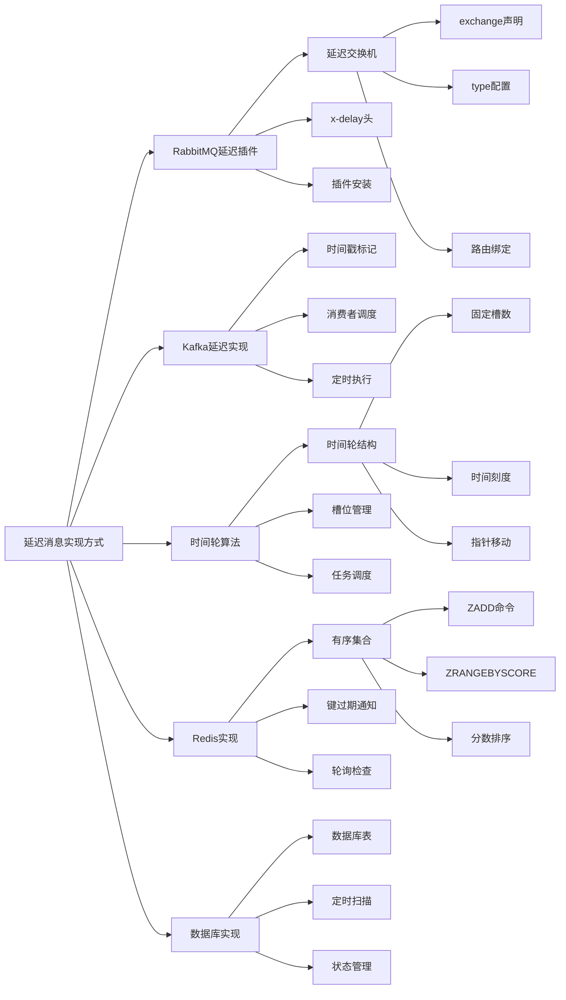

# 延迟消息的实现方式有哪些？

## 概要回答

延迟消息是指在指定时间后才被投递和处理的消息，常用于订单超时处理、定时任务、消息重试等场景。主要实现方式包括：基于消息队列的延迟插件（如RabbitMQ的delayed-message-exchange）、基于时间轮算法的延迟队列、基于Redis的定时任务、基于数据库的延迟消息表等。不同的实现方式在性能、精度、复杂度等方面各有特点，需要根据具体业务场景选择合适的方案。

## 深度解析

### 基于消息队列的延迟插件

#### RabbitMQ延迟消息插件

```bash
# RabbitMQ延迟消息插件安装和配置
# 1. 下载插件
wget https://github.com/rabbitmq/rabbitmq-delayed-message-exchange/releases/download/v3.10.2/rabbitmq_delayed_message_exchange-3.10.2.ez

# 2. 复制到插件目录
cp rabbitmq_delayed_message_exchange-3.10.2.ez $RABBITMQ_HOME/plugins/

# 3. 启用插件
rabbitmq-plugins enable rabbitmq_delayed_message_exchange

# 4. 重启RabbitMQ服务
systemctl restart rabbitmq-server

# 5. 验证插件状态
rabbitmq-plugins list | grep delayed
```

```php
<?php
// PHP示例：RabbitMQ延迟消息实现
require_once __DIR__ . '/vendor/autoload.php';

use PhpAmqpLib\Connection\AMQPStreamConnection;
use PhpAmqpLib\Message\AMQPMessage;
use PhpAmqpLib\Wire\AMQPTable;

class RabbitMQDelayMessage {
    /**
     * @var string
     */
    private $host;
    
    /**
     * @var int
     */
    private $port;
    
    /**
     * @var AMQPStreamConnection|null
     */
    private $connection;
    
    /**
     * @var \PhpAmqpLib\Channel\AMQPChannel|null
     */
    private $channel;
    
    /**
     * RabbitMQDelayMessage构造函数
     *
     * @param string $host
     * @param int $port
     */
    public function __construct($host = 'localhost', $port = 5672) {
        $this->host = $host;
        $this->port = $port;
        $this->connection = null;
        $this->channel = null;
    }
    
    /**
     * 建立连接
     *
     * @return bool
     */
    public function connect() {
        try {
            // 建立连接
            $this->connection = new AMQPStreamConnection(
                $this->host,
                $this->port,
                'guest',
                'guest',
                '/',
                false,
                'AMQP_HEARTBEAT=600&AMQP_NONBLOCKING_CONSUME=true'
            );
            
            $this->channel = $this->connection->channel();
            
            // 声明延迟交换机
            $arguments = new AMQPTable([
                'x-delayed-type' => 'direct'
            ]);
            
            $this->channel->exchange_declare(
                'delayed_exchange',
                'x-delayed-message',
                false,
                true,
                false,
                false,
                false,
                $arguments
            );
            
            // 声明队列
            $this->channel->queue_declare('delayed_queue', false, true, false, false);
            
            // 绑定队列到交换机
            $this->channel->queue_bind('delayed_queue', 'delayed_exchange', 'delayed_key');
            
            echo "RabbitMQ delay message system connected successfully\n";
            return true;
            
        } catch (Exception $e) {
            echo "Failed to connect to RabbitMQ: " . $e->getMessage() . "\n";
            return false;
        }
    }
    
    /**
     * 发送延迟消息
     *
     * @param array $message
     * @param int $delayMs
     * @return string|null
     */
    public function sendDelayedMessage($message, $delayMs) {
        // 生成唯一消息ID
        $messageId = uniqid('msg_', true);
        
        // 构造延迟消息
        $delayedMessage = [
            'id' => $messageId,
            'timestamp' => time(),
            'delay' => $delayMs,
            'data' => $message
        ];
        
        try {
            // 创建消息
            $msg = new AMQPMessage(json_encode($delayedMessage), [
                'delivery_mode' => AMQPMessage::DELIVERY_MODE_PERSISTENT,
                'application_headers' => new AMQPTable([
                    'x-delay' => $delayMs  // 设置延迟时间（毫秒）
                ])
            ]);
            
            // 发送延迟消息
            $this->channel->basic_publish($msg, 'delayed_exchange', 'delayed_key');
            
            echo "Delayed message sent: {$messageId}, delay: {$delayMs}ms\n";
            return $messageId;
            
        } catch (Exception $e) {
            echo "Failed to send delayed message: " . $e->getMessage() . "\n";
            return null;
        }
    }
    
    /**
     * 消费延迟消息
     *
     * @param callable $callbackFunc
     */
    public function consumeDelayedMessages($callbackFunc) {
        // 定义消息处理回调
        $messageHandler = function ($msg) use ($callbackFunc) {
            try {
                $message = json_decode($msg->body, true);
                echo "Received delayed message: {$message['id']}\n";
                
                // 处理消息
                call_user_func($callbackFunc, $message);
                
                // 确认消息
                $msg->ack();
                
            } catch (Exception $e) {
                echo "Error processing delayed message: " . $e->getMessage() . "\n";
                $msg->nack(true);
            }
        };
        
        // 设置消费者
        $this->channel->basic_consume('delayed_queue', '', false, false, false, false, $messageHandler);
        
        echo "Started consuming delayed messages\n";
        
        // 开始消费
        while ($this->channel->is_consuming()) {
            try {
                $this->channel->wait();
            } catch (Exception $e) {
                echo "Error in message consumption: " . $e->getMessage() . "\n";
                break;
            }
        }
    }
    
    /**
     * 关闭连接
     */
    public function close() {
        if ($this->channel) {
            $this->channel->close();
        }
        
        if ($this->connection) {
            $this->connection->close();
        }
        
        echo "RabbitMQ connection closed\n";
    }
}

/**
 * 演示RabbitMQ延迟消息
 */
function demonstrateRabbitmqDelay() {
    echo "=== RabbitMQ Delayed Message Demonstration ===\n\n";
    
    $delaySystem = new RabbitMQDelayMessage();
    
    if ($delaySystem->connect()) {
        try {
            // 发送延迟消息
            echo "1. Sending delayed messages:\n";
            
            // 3秒后处理的订单超时消息
            $orderTimeoutMsg = [
                'type' => 'order_timeout',
                'order_id' => 'ORD123456',
                'customer_id' => 'CUST789',
                'created_at' => time()
            ];
            $delaySystem->sendDelayedMessage($orderTimeoutMsg, 3000);
            
            // 10秒后处理的提醒消息
            $reminderMsg = [
                'type' => 'reminder',
                'user_id' => 'USER456',
                'content' => 'Please complete your profile'
            ];
            $delaySystem->sendDelayedMessage($reminderMsg, 10000);
            
            // 1分钟后处理的定时任务
            $scheduledTaskMsg = [
                'type' => 'scheduled_task',
                'task_name' => 'daily_report',
                'execute_at' => time() + 60
            ];
            $delaySystem->sendDelayedMessage($scheduledTaskMsg, 60000);
            
            echo "\nDelayed messages sent successfully!\n";
            echo "Waiting for messages to be delivered...\n\n";
            
            // 启动消费者（实际应用中会在后台运行）
            // $delaySystem->consumeDelayedMessages('processDelayedMessage');
            
        } finally {
            $delaySystem->close();
        }
    }
    
    echo "RabbitMQ delayed message demonstration completed!\n";
}

/**
 * 处理延迟消息的回调函数
 *
 * @param array $message
 */
function processDelayedMessage($message) {
    echo "Processing delayed message: {$message['id']}\n";
    echo "Message type: {$message['data']['type']}\n";
    echo "Original delay: {$message['delay']}ms\n";
    echo "Actual delay: " . (time() - $message['timestamp']) . "s\n";
    echo str_repeat('-', 50) . "\n";
}

// demonstrateRabbitmqDelay();
?>
```

#### Kafka延迟消息实现

```java
// Java示例：Kafka延迟消息实现
import org.apache.kafka.clients.producer.*;
import org.apache.kafka.clients.consumer.*;
import org.apache.kafka.common.serialization.StringDeserializer;
import org.apache.kafka.common.serialization.StringSerializer;
import java.time.Duration;
import java.util.*;
import java.util.concurrent.*;

public class KafkaDelayMessage {
    
    private static final String BOOTSTRAP_SERVERS = "localhost:9092";
    
    /**
     * Kafka延迟消息生产者
     */
    public static class DelayedMessageProducer {
        private final KafkaProducer<String, String> producer;
        
        public DelayedMessageProducer() {
            Properties props = new Properties();
            props.put(ProducerConfig.BOOTSTRAP_SERVERS_CONFIG, BOOTSTRAP_SERVERS);
            props.put(ProducerConfig.KEY_SERIALIZER_CLASS_CONFIG, StringSerializer.class);
            props.put(ProducerConfig.VALUE_SERIALIZER_CLASS_CONFIG, StringSerializer.class);
            props.put(ProducerConfig.ACKS_CONFIG, "all");
            props.put(ProducerConfig.RETRIES_CONFIG, 3);
            
            this.producer = new KafkaProducer<>(props);
        }
        
        /**
         * 发送延迟消息（基于时间戳）
         */
        public void sendDelayedMessage(String topic, String key, String message, long delayMs) {
            long executeTime = System.currentTimeMillis() + delayMs;
            
            String delayedMessage = String.format(
                "{\"executeTime\":%d,\"delay\":%d,\"data\":%s}",
                executeTime, delayMs, message
            );
            
            ProducerRecord<String, String> record = new ProducerRecord<>(
                topic, key, delayedMessage
            );
            
            producer.send(record, (metadata, exception) -> {
                if (exception != null) {
                    System.err.println("Error sending delayed message: " + exception.getMessage());
                } else {
                    System.out.printf("Delayed message sent - Topic: %s, Partition: %d, Offset: %d%n",
                        metadata.topic(), metadata.partition(), metadata.offset());
                }
            });
        }
        
        public void close() {
            producer.close();
        }
    }
    
    /**
     * Kafka延迟消息消费者
     */
    public static class DelayedMessageConsumer {
        private final KafkaConsumer<String, String> consumer;
        private final ScheduledExecutorService scheduler;
        private final Map<String, List<PendingMessage>> pendingMessages;
        
        public DelayedMessageConsumer(String groupId) {
            Properties props = new Properties();
            props.put(ConsumerConfig.BOOTSTRAP_SERVERS_CONFIG, BOOTSTRAP_SERVERS);
            props.put(ConsumerConfig.GROUP_ID_CONFIG, groupId);
            props.put(ConsumerConfig.KEY_DESERIALIZER_CLASS_CONFIG, StringDeserializer.class);
            props.put(ConsumerConfig.VALUE_DESERIALIZER_CLASS_CONFIG, StringDeserializer.class);
            props.put(ConsumerConfig.AUTO_OFFSET_RESET_CONFIG, "earliest");
            props.put(ConsumerConfig.ENABLE_AUTO_COMMIT_CONFIG, false);
            
            this.consumer = new KafkaConsumer<>(props);
            this.scheduler = Executors.newScheduledThreadPool(10);
            this.pendingMessages = new ConcurrentHashMap<>();
        }
        
        /**
         * 消费延迟消息
         */
        public void consumeDelayedMessages(String topic, MessageProcessor processor) {
            consumer.subscribe(Collections.singletonList(topic));
            
            System.out.println("Starting delayed message consumption from topic: " + topic);
            
            try {
                while (true) {
                    ConsumerRecords<String, String> records = consumer.poll(Duration.ofMillis(1000));
                    
                    for (ConsumerRecord<String, String> record : records) {
                        processDelayedMessage(record, processor);
                    }
                    
                    if (!records.isEmpty()) {
                        consumer.commitSync();
                    }
                }
            } catch (Exception e) {
                System.err.println("Error in delayed message consumption: " + e.getMessage());
            } finally {
                consumer.close();
                scheduler.shutdown();
            }
        }
        
        /**
         * 处理延迟消息
         */
        private void processDelayedMessage(ConsumerRecord<String, String> record, MessageProcessor processor) {
            try {
                // 解析延迟消息
                long executeTime = extractExecuteTime(record.value());
                long currentTime = System.currentTimeMillis();
                
                if (executeTime <= currentTime) {
                    // 时间已到，立即处理
                    System.out.println("Processing immediate message: " + record.key());
                    processor.processMessage(record.value());
                } else {
                    // 还未到执行时间，调度处理
                    long delay = executeTime - currentTime;
                    System.out.printf("Scheduling delayed message: %s, delay: %dms%n", 
                        record.key(), delay);
                    
                    scheduleDelayedProcessing(record, processor, delay);
                }
                
            } catch (Exception e) {
                System.err.println("Error processing delayed message: " + e.getMessage());
            }
        }
        
        /**
         * 调度延迟处理
         */
        private void scheduleDelayedProcessing(ConsumerRecord<String, String> record, 
                                            MessageProcessor processor, long delayMs) {
            scheduler.schedule(() -> {
                try {
                    System.out.println("Executing delayed message: " + record.key());
                    processor.processMessage(record.value());
                } catch (Exception e) {
                    System.err.println("Error executing delayed message: " + e.getMessage());
                }
            }, delayMs, TimeUnit.MILLISECONDS);
        }
        
        /**
         * 提取执行时间
         */
        private long extractExecuteTime(String message) {
            try {
                int start = message.indexOf("\"executeTime\":") + 14;
                int end = message.indexOf(",", start);
                if (end == -1) {
                    end = message.indexOf("}", start);
                }
                return Long.parseLong(message.substring(start, end));
            } catch (Exception e) {
                return System.currentTimeMillis();
            }
        }
        
        public interface MessageProcessor {
            void processMessage(String message);
        }
    }
    
    /**
     * 演示Kafka延迟消息
     */
    public static void demonstrateKafkaDelay() {
        System.out.println("=== Kafka Delayed Message Demonstration ===\n");
        
        // 创建生产者
        DelayedMessageProducer producer = new DelayedMessageProducer();
        
        // 发送延迟消息
        System.out.println("1. Sending delayed messages:");
        
        String topic = "delayed_messages";
        
        // 3秒后执行的消息
        producer.sendDelayedMessage(topic, "key1", 
            "{\"type\":\"order_timeout\",\"orderId\":\"ORD123\"}", 3000);
        
        // 10秒后执行的消息
        producer.sendDelayedMessage(topic, "key2",
            "{\"type\":\"reminder\",\"userId\":\"USER456\"}", 10000);
        
        // 30秒后执行的消息
        producer.sendDelayedMessage(topic, "key3",
            "{\"type\":\"scheduled_task\",\"task\":\"report_generation\"}", 30000);
        
        System.out.println("Delayed messages sent!\n");
        
        // 创建消费者
        DelayedMessageConsumer consumer = new DelayedMessageConsumer("delayed-consumer-group");
        
        // 启动消费者（实际应用中会在后台运行）
        // consumer.consumeDelayedMessages(topic, message -> {
        //     System.out.println("Processing delayed message: " + message);
        // });
        
        producer.close();
        System.out.println("Kafka delayed message demonstration completed!");
    }
    
    public static void main(String[] args) {
        demonstrateKafkaDelay();
    }
}
```

### 基于时间轮算法的延迟队列

```javascript
// JavaScript示例：时间轮算法延迟队列
class TimeWheelDelayQueue {
    constructor() {
        this.wheelSize = 60; // 时间轮大小（秒）
        this.tickDuration = 1000; // 每个刻度1秒
        this.currentTick = 0;
        this.slots = new Array(this.wheelSize);
        for (let i = 0; i < this.wheelSize; i++) {
            this.slots[i] = [];
        }
        this.timers = new Map(); // 存储定时器
        this.callbacks = new Map(); // 存储回调函数
        this.running = false;
    }
    
    /**
     * 启动时间轮
     */
    start() {
        if (this.running) return;
        
        this.running = true;
        console.log('[TimeWheel] Time wheel started');
        
        // 启动定时器
        this.tick();
    }
    
    /**
     * 停止时间轮
     */
    stop() {
        this.running = false;
        console.log('[TimeWheel] Time wheel stopped');
        
        // 清理所有定时器
        for (let timer of this.timers.values()) {
            clearTimeout(timer);
        }
        this.timers.clear();
    }
    
    /**
     * 添加延迟任务
     */
    addDelayTask(delayMs, taskId, callback) {
        const delaySeconds = Math.ceil(delayMs / 1000);
        const rounds = Math.floor(delaySeconds / this.wheelSize);
        const slotIndex = (this.currentTick + delaySeconds) % this.wheelSize;
        
        const task = {
            id: taskId,
            delayMs: delayMs,
            rounds: rounds,
            callback: callback,
            createdAt: Date.now()
        };
        
        // 添加到对应槽位
        this.slots[slotIndex].push(task);
        console.log(`[TimeWheel] Task ${taskId} added to slot ${slotIndex}, rounds: ${rounds}`);
        
        return taskId;
    }
    
    /**
     * 时间轮滴答
     */
    tick() {
        if (!this.running) return;
        
        // 处理当前槽位的任务
        const currentSlot = this.slots[this.currentTick];
        const remainingTasks = [];
        
        for (let task of currentSlot) {
            if (task.rounds <= 0) {
                // 执行任务
                console.log(`[TimeWheel] Executing task: ${task.id}`);
                try {
                    task.callback({
                        id: task.id,
                        delay: task.delayMs,
                        actualDelay: Date.now() - task.createdAt
                    });
                } catch (error) {
                    console.error(`[TimeWheel] Error executing task ${task.id}:`, error);
                }
            } else {
                // 减少轮数，重新加入队列
                task.rounds--;
                remainingTasks.push(task);
                console.log(`[TimeWheel] Task ${task.id} rounds reduced to ${task.rounds}`);
            }
        }
        
        // 更新当前槽位
        this.slots[this.currentTick] = remainingTasks;
        
        // 移动到下一个槽位
        this.currentTick = (this.currentTick + 1) % this.wheelSize;
        
        // 继续下一tick
        setTimeout(() => this.tick(), this.tickDuration);
    }
    
    /**
     * 移除任务
     */
    removeTask(taskId) {
        for (let i = 0; i < this.wheelSize; i++) {
            const slot = this.slots[i];
            const index = slot.findIndex(task => task.id === taskId);
            if (index !== -1) {
                slot.splice(index, 1);
                console.log(`[TimeWheel] Task ${taskId} removed from slot ${i}`);
                return true;
            }
        }
        return false;
    }
    
    /**
     * 获取队列状态
     */
    getStatus() {
        let totalTasks = 0;
        const slotInfo = {};
        
        for (let i = 0; i < this.wheelSize; i++) {
            const count = this.slots[i].length;
            if (count > 0) {
                slotInfo[`slot_${i}`] = count;
            }
            totalTasks += count;
        }
        
        return {
            currentTick: this.currentTick,
            totalTasks: totalTasks,
            slots: slotInfo
        };
    }
}

// 高精度时间轮（毫秒级）
class HighPrecisionTimeWheel {
    constructor() {
        this.wheelSize = 60; // 60个槽位
        this.tickDuration = 100; // 100ms每个刻度
        this.currentTick = 0;
        this.slots = new Array(this.wheelSize);
        for (let i = 0; i < this.wheelSize; i++) {
            this.slots[i] = new Map(); // 使用Map存储，支持毫秒级精度
        }
        this.running = false;
    }
    
    start() {
        if (this.running) return;
        this.running = true;
        console.log('[HighPrecision] High precision time wheel started');
        this.tick();
    }
    
    stop() {
        this.running = false;
        console.log('[HighPrecision] High precision time wheel stopped');
    }
    
    addDelayTask(delayMs, taskId, callback) {
        const executeTime = Date.now() + delayMs;
        const slotIndex = Math.floor((executeTime / this.tickDuration) % this.wheelSize);
        const taskKey = `${taskId}_${executeTime}`;
        
        const task = {
            id: taskId,
            executeTime: executeTime,
            callback: callback,
            createdAt: Date.now()
        };
        
        if (!this.slots[slotIndex].has(taskKey)) {
            this.slots[slotIndex].set(taskKey, task);
            console.log(`[HighPrecision] Task ${taskId} scheduled for ${new Date(executeTime)}`);
        }
        
        return taskKey;
    }
    
    tick() {
        if (!this.running) return;
        
        const currentTime = Date.now();
        const currentSlot = this.slots[this.currentTick];
        
        // 执行到期的任务
        for (let [taskKey, task] of currentSlot) {
            if (task.executeTime <= currentTime) {
                console.log(`[HighPrecision] Executing task: ${task.id}`);
                try {
                    task.callback({
                        id: task.id,
                        delay: task.executeTime - task.createdAt,
                        actualDelay: currentTime - task.createdAt
                    });
                } catch (error) {
                    console.error(`[HighPrecision] Error executing task ${task.id}:`, error);
                }
                
                // 移除已执行的任务
                currentSlot.delete(taskKey);
            }
        }
        
        // 移动到下一个槽位
        this.currentTick = (this.currentTick + 1) % this.wheelSize;
        
        // 继续下一tick
        setTimeout(() => this.tick(), this.tickDuration);
    }
    
    getStatus() {
        let totalTasks = 0;
        const slotInfo = {};
        
        for (let i = 0; i < this.wheelSize; i++) {
            const count = this.slots[i].size;
            if (count > 0) {
                slotInfo[`slot_${i}`] = count;
            }
            totalTasks += count;
        }
        
        return {
            currentTick: this.currentTick,
            totalTasks: totalTasks,
            slots: slotInfo
        };
    }
}

// 演示时间轮算法
function demonstrateTimeWheel() {
    console.log('=== Time Wheel Algorithm Demonstration ===\n');
    
    // 1. 基础时间轮演示
    console.log('1. Basic Time Wheel:');
    const timeWheel = new TimeWheelDelayQueue();
    timeWheel.start();
    
    // 添加延迟任务
    timeWheel.addDelayTask(3000, 'task_1', (result) => {
        console.log(`Task 1 executed with delay: ${result.actualDelay}ms`);
    });
    
    timeWheel.addDelayTask(5000, 'task_2', (result) => {
        console.log(`Task 2 executed with delay: ${result.actualDelay}ms`);
    });
    
    timeWheel.addDelayTask(8000, 'task_3', (result) => {
        console.log(`Task 3 executed with delay: ${result.actualDelay}ms`);
    });
    
    // 显示状态
    setTimeout(() => {
        console.log('Time wheel status:', timeWheel.getStatus());
    }, 2000);
    
    console.log('\n' + '='.repeat(50) + '\n');
    
    // 2. 高精度时间轮演示
    console.log('2. High Precision Time Wheel:');
    const highPrecisionWheel = new HighPrecisionTimeWheel();
    highPrecisionWheel.start();
    
    // 添加毫秒级延迟任务
    highPrecisionWheel.addDelayTask(1500, 'hp_task_1', (result) => {
        console.log(`High precision task 1 executed with delay: ${result.actualDelay}ms`);
    });
    
    highPrecisionWheel.addDelayTask(2500, 'hp_task_2', (result) => {
        console.log(`High precision task 2 executed with delay: ${result.actualDelay}ms`);
    });
    
    setTimeout(() => {
        console.log('High precision wheel status:', highPrecisionWheel.getStatus());
    }, 1000);
    
    // 运行一段时间后停止
    setTimeout(() => {
        timeWheel.stop();
        highPrecisionWheel.stop();
        console.log('\nTime wheel demonstration completed!');
    }, 10000);
}

// demonstrateTimeWheel();
```

### 基于Redis的延迟消息实现

```go
// Go示例：基于Redis的延迟消息实现
package main

import (
    "context"
    "encoding/json"
    "fmt"
    "log"
    "time"
    "github.com/go-redis/redis/v8"
)

// 延迟消息结构
type DelayedMessage struct {
    ID         string                 `json:"id"`
    ExecuteAt  int64                  `json:"execute_at"`  // 执行时间戳
    Delay      int64                  `json:"delay"`       // 延迟时间（毫秒）
    Data       map[string]interface{} `json:"data"`        // 消息数据
    RetryCount int                    `json:"retry_count"` // 重试次数
}

// Redis延迟消息处理器
type RedisDelayQueue struct {
    client      *redis.Client
    ctx         context.Context
    queueKey    string
    processingKey string
    callbacks   map[string]func(*DelayedMessage)
}

// 初始化Redis延迟队列
func NewRedisDelayQueue(redisAddr, queueName string) *RedisDelayQueue {
    rdb := redis.NewClient(&redis.Options{
        Addr: redisAddr,
    })
    
    return &RedisDelayQueue{
        client:        rdb,
        ctx:           context.Background(),
        queueKey:      fmt.Sprintf("delay_queue:%s", queueName),
        processingKey: fmt.Sprintf("delay_queue:%s:processing", queueName),
        callbacks:     make(map[string]func(*DelayedMessage)),
    }
}

// 添加延迟消息
func (rdq *RedisDelayQueue) AddDelayMessage(delayMs int64, data map[string]interface{}) (string, error) {
    message := &DelayedMessage{
        ID:        fmt.Sprintf("msg_%d_%d", time.Now().UnixNano(), time.Now().Nanosecond()),
        ExecuteAt: time.Now().Unix() + delayMs/1000,
        Delay:     delayMs,
        Data:      data,
        RetryCount: 0,
    }
    
    messageBytes, err := json.Marshal(message)
    if err != nil {
        return "", fmt.Errorf("failed to marshal message: %v", err)
    }
    
    // 使用有序集合存储，分数为执行时间
    err = rdq.client.ZAdd(rdq.ctx, rdq.queueKey, &redis.Z{
        Score:  float64(message.ExecuteAt),
        Member: messageBytes,
    }).Err()
    
    if err != nil {
        return "", fmt.Errorf("failed to add message to queue: %v", err)
    }
    
    log.Printf("[RedisDelay] Message added: %s, execute at: %s", 
        message.ID, time.Unix(message.ExecuteAt, 0))
    
    return message.ID, nil
}

// 注册消息处理器
func (rdq *RedisDelayQueue) RegisterHandler(messageType string, callback func(*DelayedMessage)) {
    rdq.callbacks[messageType] = callback
}

// 启动延迟消息处理
func (rdq *RedisDelayQueue) StartProcessing() {
    log.Println("[RedisDelay] Starting delay queue processing")
    
    ticker := time.NewTicker(1 * time.Second)
    defer ticker.Stop()
    
    for range ticker.C {
        rdq.processReadyMessages()
    }
}

// 处理到期的消息
func (rdq *RedisDelayQueue) processReadyMessages() {
    now := time.Now().Unix()
    
    // 获取所有到期的消息
    messages, err := rdq.client.ZRangeByScore(rdq.ctx, rdq.queueKey, 
        &redis.ZRangeBy{
            Min: "0",
            Max: fmt.Sprintf("%d", now),
        }).Result()
    
    if err != nil {
        log.Printf("[RedisDelay] Error getting ready messages: %v", err)
        return
    }
    
    if len(messages) == 0 {
        return
    }
    
    log.Printf("[RedisDelay] Processing %d ready messages", len(messages))
    
    for _, messageStr := range messages {
        var message DelayedMessage
        if err := json.Unmarshal([]byte(messageStr), &message); err != nil {
            log.Printf("[RedisDelay] Error unmarshaling message: %v", err)
            continue
        }
        
        // 将消息移到处理中队列
        err := rdq.moveToProcessing(messageStr)
        if err != nil {
            log.Printf("[RedisDelay] Error moving message to processing: %v", err)
            continue
        }
        
        // 处理消息
        rdq.handleMessage(&message)
        
        // 从主队列移除
        rdq.client.ZRem(rdq.ctx, rdq.queueKey, messageStr)
        
        // 从处理中队列移除
        rdq.client.SRem(rdq.ctx, rdq.processingKey, messageStr)
    }
}

// 移动消息到处理中队列
func (rdq *RedisDelayQueue) moveToProcessing(messageStr string) error {
    return rdq.client.SAdd(rdq.ctx, rdq.processingKey, messageStr).Err()
}

// 处理消息
func (rdq *RedisDelayQueue) handleMessage(message *DelayedMessage) {
    defer func() {
        if r := recover(); r != nil {
            log.Printf("[RedisDelay] Panic in message handler: %v", r)
            // 可以在这里实现重试逻辑
        }
    }()
    
    log.Printf("[RedisDelay] Handling message: %s", message.ID)
    
    // 根据消息类型调用相应的处理器
    if messageType, ok := message.Data["type"].(string); ok {
        if callback, exists := rdq.callbacks[messageType]; exists {
            callback(message)
        } else {
            log.Printf("[RedisDelay] No handler registered for message type: %s", messageType)
            // 默认处理
            rdq.defaultHandler(message)
        }
    } else {
        // 默认处理
        rdq.defaultHandler(message)
    }
}

// 默认消息处理器
func (rdq *RedisDelayQueue) defaultHandler(message *DelayedMessage) {
    log.Printf("[RedisDelay] Default handler - Message ID: %s, Data: %v", 
        message.ID, message.Data)
    
    // 记录处理结果
    actualDelay := time.Now().Unix() - (message.ExecuteAt - message.Delay/1000)
    log.Printf("[RedisDelay] Message %s processed with actual delay: %ds", 
        message.ID, actualDelay)
}

// 获取队列状态
func (rdq *RedisDelayQueue) GetQueueStatus() (map[string]interface{}, error) {
    total, err := rdq.client.ZCard(rdq.ctx, rdq.queueKey).Result()
    if err != nil {
        return nil, err
    }
    
    processing, err := rdq.client.SCard(rdq.ctx, rdq.processingKey).Result()
    if err != nil {
        return nil, err
    }
    
    return map[string]interface{}{
        "total_pending":   total,
        "total_processing": processing,
        "queue_key":       rdq.queueKey,
        "processing_key":  rdq.processingKey,
    }, nil
}

// 基于Redis键过期的延迟消息实现
type RedisKeyExpirationDelay struct {
    client    *redis.Client
    ctx       context.Context
    callbacks map[string]func(string, string)
}

// 初始化基于键过期的延迟消息
func NewRedisKeyExpirationDelay(redisAddr string) *RedisKeyExpirationDelay {
    rdb := redis.NewClient(&redis.Options{
        Addr: redisAddr,
    })
    
    return &RedisKeyExpirationDelay{
        client:    rdb,
        ctx:       context.Background(),
        callbacks: make(map[string]func(string, string)),
    }
}

// 设置延迟消息（基于键过期）
func (rked *RedisKeyExpirationDelay) SetDelayMessage(key, value string, delaySeconds int64) error {
    // 设置键值对并指定过期时间
    err := rked.client.SetEx(rked.ctx, key, value, time.Duration(delaySeconds)*time.Second).Err()
    if err != nil {
        return fmt.Errorf("failed to set delayed message: %v", err)
    }
    
    log.Printf("[RedisExpiration] Delayed message set: %s, expires in %ds", key, delaySeconds)
    return nil
}

// 注册过期回调
func (rked *RedisKeyExpirationDelay) RegisterExpirationCallback(pattern string, callback func(string, string)) {
    rked.callbacks[pattern] = callback
}

// 监听键过期事件
func (rked *RedisKeyExpirationDelay) ListenForExpirations() {
    // 需要配置Redis启用键空间通知
    // config set notify-keyspace-events Ex
    
    pubsub := rked.client.Subscribe(rked.ctx, "__keyevent@0__:expired")
    defer pubsub.Close()
    
    log.Println("[RedisExpiration] Listening for key expirations")
    
    ch := pubsub.Channel()
    for msg := range ch {
        expiredKey := msg.Payload
        log.Printf("[RedisExpiration] Key expired: %s", expiredKey)
        
        // 获取过期键的值（如果还存在的话）
        value, err := rked.client.Get(rked.ctx, expiredKey).Result()
        if err != nil && err != redis.Nil {
            log.Printf("[RedisExpiration] Error getting expired key value: %v", err)
            continue
        }
        
        // 调用回调函数
        for pattern, callback := range rked.callbacks {
            if matchPattern(pattern, expiredKey) {
                callback(expiredKey, value)
                break
            }
        }
    }
}

// 简单的模式匹配
func matchPattern(pattern, key string) bool {
    // 这里可以实现更复杂的模式匹配逻辑
    return pattern == "*" || key == pattern
}

// 演示Redis延迟消息
func demonstrateRedisDelay() {
    log.Println("=== Redis Delayed Message Demonstration ===")
    
    // 1. 基于有序集合的延迟队列
    log.Println("1. Redis Sorted Set Based Delay Queue:")
    delayQueue := NewRedisDelayQueue("localhost:6379", "test_queue")
    
    // 注册处理器
    delayQueue.RegisterHandler("order_timeout", func(msg *DelayedMessage) {
        log.Printf("Order timeout handler - Order ID: %v", msg.Data["order_id"])
    })
    
    delayQueue.RegisterHandler("reminder", func(msg *DelayedMessage) {
        log.Printf("Reminder handler - User ID: %v, Content: %v", 
            msg.Data["user_id"], msg.Data["content"])
    })
    
    // 添加延迟消息
    orderMsg := map[string]interface{}{
        "type":     "order_timeout",
        "order_id": "ORD123456",
        "customer": "John Doe",
    }
    delayQueue.AddDelayMessage(3000, orderMsg) // 3秒后
    
    reminderMsg := map[string]interface{}{
        "type":     "reminder",
        "user_id":  "USER789",
        "content":  "Please complete your profile",
    }
    delayQueue.AddDelayMessage(5000, reminderMsg) // 5秒后
    
    // 启动处理（实际应用中会在goroutine中运行）
    // go delayQueue.StartProcessing()
    
    // 2. 基于键过期的延迟消息
    log.Println("\n2. Redis Key Expiration Based Delay:")
    expirationDelay := NewRedisKeyExpirationDelay("localhost:6379")
    
    // 注册过期回调
    expirationDelay.RegisterExpirationCallback("delay:*", func(key, value string) {
        log.Printf("Key expired handler - Key: %s, Value: %s", key, value)
    })
    
    // 设置延迟消息
    expirationDelay.SetDelayMessage("delay:message_1", "Hello World", 3)
    expirationDelay.SetDelayMessage("delay:message_2", "Delayed Task", 5)
    
    // 监听过期事件（实际应用中会在goroutine中运行）
    // go expirationDelay.ListenForExpirations()
    
    // 等待处理完成
    time.Sleep(10 * time.Second)
    
    // 获取队列状态
    status, err := delayQueue.GetQueueStatus()
    if err != nil {
        log.Printf("Error getting queue status: %v", err)
    } else {
        log.Printf("Queue status: %+v", status)
    }
    
    log.Println("Redis delayed message demonstration completed!")
}

func main() {
    demonstrateRedisDelay()
}
```

### 基于数据库的延迟消息实现

```bash
# 数据库延迟消息表结构设计

# MySQL表结构
CREATE TABLE delayed_messages (
    id BIGINT AUTO_INCREMENT PRIMARY KEY,
    message_id VARCHAR(64) NOT NULL UNIQUE,
    execute_at TIMESTAMP NOT NULL,
    delay_seconds INT NOT NULL DEFAULT 0,
    message_data JSON NOT NULL,
    status ENUM('pending', 'processing', 'completed', 'failed') DEFAULT 'pending',
    retry_count INT DEFAULT 0,
    created_at TIMESTAMP DEFAULT CURRENT_TIMESTAMP,
    updated_at TIMESTAMP DEFAULT CURRENT_TIMESTAMP ON UPDATE CURRENT_TIMESTAMP,
    INDEX idx_execute_at (execute_at),
    INDEX idx_status (status)
);

# 创建处理日志表
CREATE TABLE delayed_message_logs (
    id BIGINT AUTO_INCREMENT PRIMARY KEY,
    message_id VARCHAR(64) NOT NULL,
    status ENUM('success', 'failed', 'retry') NOT NULL,
    error_message TEXT,
    processed_at TIMESTAMP DEFAULT CURRENT_TIMESTAMP,
    INDEX idx_message_id (message_id)
);
```

```php
<?php
// PHP示例：基于数据库的延迟消息实现

// 消息状态枚举
class MessageStatus {
    const PENDING = "pending";
    const PROCESSING = "processing";
    const COMPLETED = "completed";
    const FAILED = "failed";
}

// 数据库延迟消息实体
class DatabaseDelayedMessage {
    /** @var int */
    public $id;
    
    /** @var string */
    public $message_id;
    
    /** @var int */
    public $execute_at;
    
    /** @var int */
    public $delay_seconds;
    
    /** @var array */
    public $message_data;
    
    /** @var string */
    public $status;
    
    /** @var int */
    public $retry_count;
    
    /** @var int */
    public $created_at;
    
    /** @var int */
    public $updated_at;
    
    /**
     * DatabaseDelayedMessage构造函数
     *
     * @param int $id
     * @param string $message_id
     * @param int $execute_at
     * @param int $delay_seconds
     * @param array $message_data
     * @param string $status
     * @param int $retry_count
     * @param int $created_at
     * @param int $updated_at
     */
    public function __construct($id, $message_id, $execute_at, $delay_seconds, $message_data, $status, $retry_count, $created_at, $updated_at) {
        $this->id = $id;
        $this->message_id = $message_id;
        $this->execute_at = $execute_at;
        $this->delay_seconds = $delay_seconds;
        $this->message_data = $message_data;
        $this->status = $status;
        $this->retry_count = $retry_count;
        $this->created_at = $created_at;
        $this->updated_at = $updated_at;
    }
}

// 基于数据库的延迟消息队列
class DatabaseDelayQueue {
    /** @var array */
    private $dbConfig;
    
    /** @var PDO|null */
    private $pdo;
    
    /** @var array */
    private $callbacks;
    
    /** @var bool */
    private $running;
    
    /** @var bool */
    private $stopRequested;
    
    /**
     * DatabaseDelayQueue构造函数
     *
     * @param array $dbConfig
     */
    public function __construct($dbConfig) {
        $this->dbConfig = $dbConfig;
        $this->pdo = null;
        $this->callbacks = [];
        $this->running = false;
        $this->stopRequested = false;
    }
    
    /**
     * 建立数据库连接
     *
     * @return bool
     */
    public function connect() {
        try {
            $dsn = "mysql:host={$this->dbConfig['host']};dbname={$this->dbConfig['database']};charset={$this->dbConfig['charset']}";
            $this->pdo = new PDO($dsn, $this->dbConfig['user'], $this->dbConfig['password']);
            $this->pdo->setAttribute(PDO::ATTR_ERRMODE, PDO::ERRMODE_EXCEPTION);
            echo "[DatabaseDelay] Connected to database\n";
            return true;
        } catch (Exception $e) {
            echo "[DatabaseDelay] Database connection failed: " . $e->getMessage() . "\n";
            return false;
        }
    }
    
    /**
     * 添加延迟消息
     *
     * @param int $delaySeconds
     * @param array $messageData
     * @return string|null
     */
    public function addDelayMessage($delaySeconds, $messageData) {
        $messageId = "msg_" . uniqid();
        $executeAt = time() + $delaySeconds;
        
        try {
            $stmt = $this->pdo->prepare("INSERT INTO delayed_messages (message_id, execute_at, delay_seconds, message_data) VALUES (?, FROM_UNIXTIME(?), ?, ?)");
            
            $stmt->execute([
                $messageId,
                $executeAt,
                $delaySeconds,
                json_encode($messageData)
            ]);
            
            echo "[DatabaseDelay] Message added: {$messageId}, execute at: {$executeAt}\n";
            return $messageId;
            
        } catch (Exception $e) {
            echo "[DatabaseDelay] Failed to add message: " . $e->getMessage() . "\n";
            return null;
        }
    }
    
    /**
     * 注册消息处理器
     *
     * @param string $messageType
     * @param callable $callback
     * @return void
     */
    public function registerHandler($messageType, $callback) {
        $this->callbacks[$messageType] = $callback;
        echo "[DatabaseDelay] Handler registered for type: {$messageType}\n";
    }
    
    /**
     * 启动消息处理
     *
     * @return void
     */
    public function startProcessing() {
        if ($this->running) {
            return;
        }
        
        $this->running = true;
        $this->stopRequested = false;
        echo "[DatabaseDelay] Processing started\n";
        
        // 在同一个进程中处理消息
        $this->processLoop();
    }
    
    /**
     * 停止消息处理
     *
     * @return void
     */
    public function stopProcessing() {
        $this->stopRequested = true;
        echo "[DatabaseDelay] Processing stopped\n";
    }
    
    /**
     * 处理循环
     *
     * @return void
     */
    private function processLoop() {
        while ($this->running && !$this->stopRequested) {
            try {
                $this->processReadyMessages();
                sleep(1);  // 1秒检查间隔
            } catch (Exception $e) {
                echo "[DatabaseDelay] Error in processing loop: " . $e->getMessage() . "\n";
                sleep(5);  // 出错后等待5秒再重试
            }
        }
    }
    
    /**
     * 处理到期的消息
     *
     * @return void
     */
    private function processReadyMessages() {
        try {
            // 获取到期的待处理消息
            $stmt = $this->pdo->prepare("SELECT * FROM delayed_messages WHERE execute_at <= NOW() AND status = 'pending' ORDER BY execute_at ASC LIMIT 10");
            $stmt->execute();
            $messages = $stmt->fetchAll(PDO::FETCH_ASSOC);
            
            if (empty($messages)) {
                return;
            }
            
            echo "[DatabaseDelay] Processing " . count($messages) . " ready messages\n";
            
            foreach ($messages as $msgRow) {
                // 开启事务
                $this->pdo->beginTransaction();
                
                try {
                    // 更新消息状态为处理中
                    $updateStmt = $this->pdo->prepare("UPDATE delayed_messages SET status = 'processing', updated_at = NOW() WHERE id = ? AND status = 'pending'");
                    $updateStmt->execute([$msgRow['id']]);
                    $affectedRows = $updateStmt->rowCount();
                    
                    if ($affectedRows == 0) {
                        // 消息已被其他进程处理
                        $this->pdo->rollBack();
                        continue;
                    }
                    
                    // 处理消息
                    $message = $this->rowToMessage($msgRow);
                    $this->handleMessage($message);
                    
                    // 更新消息状态为完成
                    $completeStmt = $this->pdo->prepare("UPDATE delayed_messages SET status = 'completed', updated_at = NOW() WHERE message_id = ?");
                    $completeStmt->execute([$message->message_id]);
                    
                    // 提交事务
                    $this->pdo->commit();
                    
                    echo "[DatabaseDelay] Message processed successfully: {$message->message_id}\n";
                    
                } catch (Exception $e) {
                    // 回滚事务
                    $this->pdo->rollBack();
                    
                    echo "[DatabaseDelay] Error handling message {$msgRow['message_id']}: " . $e->getMessage() . "\n";
                    $this->handleMessageFailure($msgRow['message_id'], $e->getMessage());
                }
            }
            
        } catch (Exception $e) {
            echo "[DatabaseDelay] Error processing ready messages: " . $e->getMessage() . "\n";
        }
    }
    
    /**
     * 处理单个消息
     *
     * @param DatabaseDelayedMessage $message
     * @return void
     */
    private function handleMessage($message) {
        try {
            echo "[DatabaseDelay] Handling message: {$message->message_id}\n";
            
            // 根据消息类型调用处理器
            $messageType = isset($message->message_data['type']) ? $message->message_data['type'] : null;
            if ($messageType && isset($this->callbacks[$messageType])) {
                call_user_func($this->callbacks[$messageType], $message->message_data);
                $this->logMessageSuccess($message->message_id);
            } else {
                // 默认处理
                $this->defaultHandler($message);
            }
            
        } catch (Exception $e) {
            echo "[DatabaseDelay] Message processing failed: " . $e->getMessage() . "\n";
            $this->handleMessageFailure($message->message_id, $e->getMessage());
        }
    }
    
    /**
     * 处理消息失败
     *
     * @param string $messageId
     * @param string $error
     * @return void
     */
    private function handleMessageFailure($messageId, $error) {
        try {
            $stmt = $this->pdo->prepare("UPDATE delayed_messages SET retry_count = retry_count + 1, status = CASE WHEN retry_count >= 2 THEN 'failed' ELSE 'pending' END, execute_at = CASE WHEN retry_count >= 2 THEN execute_at ELSE DATE_ADD(NOW(), INTERVAL 60 SECOND) END, updated_at = NOW() WHERE message_id = ?");
            $stmt->execute([$messageId]);
            
            // 记录日志
            $this->logMessageFailure($messageId, $error);
            
        } catch (Exception $e) {
            echo "[DatabaseDelay] Error handling message failure: " . $e->getMessage() . "\n";
        }
    }
    
    /**
     * 记录消息处理成功
     *
     * @param string $messageId
     * @return void
     */
    private function logMessageSuccess($messageId) {
        try {
            $stmt = $this->pdo->prepare("INSERT INTO delayed_message_logs (message_id, status) VALUES (?, 'success')");
            $stmt->execute([$messageId]);
        } catch (Exception $e) {
            echo "[DatabaseDelay] Error logging success: " . $e->getMessage() . "\n";
        }
    }
    
    /**
     * 记录消息处理失败
     *
     * @param string $messageId
     * @param string $error
     * @return void
     */
    private function logMessageFailure($messageId, $error) {
        try {
            $stmt = $this->pdo->prepare("INSERT INTO delayed_message_logs (message_id, status, error_message) VALUES (?, 'failed', ?)");
            $stmt->execute([$messageId, $error]);
        } catch (Exception $e) {
            echo "[DatabaseDelay] Error logging failure: " . $e->getMessage() . "\n";
        }
    }
    
    /**
     * 默认消息处理器
     *
     * @param DatabaseDelayedMessage $message
     * @return void
     */
    private function defaultHandler($message) {
        echo "[DatabaseDelay] Default handler for message: {$message->message_id}\n";
        echo "Message data: " . json_encode($message->message_data) . "\n";
    }
    
    /**
     * 将数据库行转换为消息对象
     *
     * @param array $row
     * @return DatabaseDelayedMessage
     */
    private function rowToMessage($row) {
        return new DatabaseDelayedMessage(
            $row['id'],
            $row['message_id'],
            strtotime($row['execute_at']),
            $row['delay_seconds'],
            json_decode($row['message_data'], true),
            $row['status'],
            $row['retry_count'],
            strtotime($row['created_at']),
            strtotime($row['updated_at'])
        );
    }
    
    /**
     * 获取队列统计信息
     *
     * @return array
     */
    public function getQueueStatistics() {
        try {
            // 统计各类状态的消息数量
            $stmt = $this->pdo->prepare("SELECT status, COUNT(*) as count FROM delayed_messages GROUP BY status");
            $stmt->execute();
            $statusCounts = $stmt->fetchAll(PDO::FETCH_ASSOC);
            
            // 统计待处理消息的最早执行时间
            $stmt = $this->pdo->prepare("SELECT MIN(execute_at) as earliest_execute FROM delayed_messages WHERE status = 'pending'");
            $stmt->execute();
            $earliestRow = $stmt->fetch(PDO::FETCH_ASSOC);
            
            $stats = [];
            foreach ($statusCounts as $row) {
                $stats[$row['status']] = (int)$row['count'];
            }
            $stats['earliest_pending'] = $earliestRow['earliest_execute'] ?? null;
            
            return $stats;
            
        } catch (Exception $e) {
            echo "[DatabaseDelay] Error getting statistics: " . $e->getMessage() . "\n";
            return [];
        }
    }
}

/**
 * 演示数据库延迟消息
 */
function demonstrateDatabaseDelay() {
    echo "=== Database Delayed Message Demonstration ===\n\n";
    
    // 数据库配置
    $dbConfig = [
        'host' => 'localhost',
        'user' => 'root',
        'password' => 'password',
        'database' => 'test',
        'charset' => 'utf8mb4'
    ];
    
    // 初始化延迟队列
    $delayQueue = new DatabaseDelayQueue($dbConfig);
    
    if ($delayQueue->connect()) {
        try {
            // 注册处理器
            $delayQueue->registerHandler('order_timeout', function($data) {
                echo "Order timeout: " . json_encode($data) . "\n";
            });
            
            $delayQueue->registerHandler('reminder', function($data) {
                echo "Reminder: " . json_encode($data) . "\n";
            });
            
            // 添加延迟消息
            echo "1. Adding delayed messages:\n";
            
            $orderMsg = [
                'type' => 'order_timeout',
                'order_id' => 'ORD123456',
                'customer' => 'John Doe',
                'timeout_minutes' => 30
            ];
            $delayQueue->addDelayMessage(3, $orderMsg);  // 3秒后
            
            $reminderMsg = [
                'type' => 'reminder',
                'user_id' => 'USER789',
                'content' => 'Please complete your profile',
                'priority' => 'medium'
            ];
            $delayQueue->addDelayMessage(5, $reminderMsg);  // 5秒后
            
            // 启动处理
            echo "\n2. Starting message processing:\n";
            $delayQueue->startProcessing();
            
            // 等待处理完成
            echo "Waiting for messages to be processed...\n";
            sleep(10);
            
            // 获取统计信息
            echo "\n3. Queue statistics:\n";
            $stats = $delayQueue->getQueueStatistics();
            echo "Statistics: " . json_encode($stats) . "\n";
            
            // 停止处理
            $delayQueue->stopProcessing();
            
        } catch (Exception $e) {
            echo "Error in demonstration: " . $e->getMessage() . "\n";
        } finally {
            $delayQueue->stopProcessing();
        }
    }
    
    echo "\nDatabase delayed message demonstration completed!\n";
}

// demonstrateDatabaseDelay();
?>
```

## 图示说明



通过以上多种延迟消息实现方式的详细介绍和代码示例，可以看出每种方案都有其适用场景和优缺点。在实际应用中，需要根据系统的性能要求、精度需求、复杂度容忍度等因素来选择最适合的实现方案。