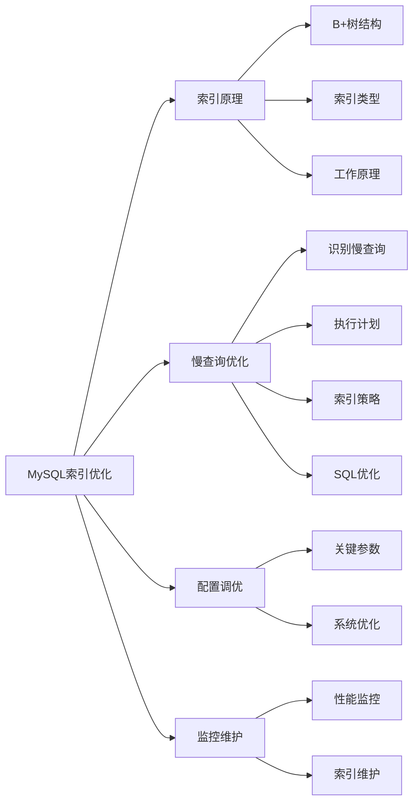

# MySQL索引的原理是什么？如何优化慢查询？

## 概要回答

MySQL索引是一种数据结构，用于提高数据库查询效率。它类似于书籍的目录，能够快速定位到所需数据的位置，避免全表扫描。索引主要基于B+树数据结构实现，将数据有序存储以便快速检索。优化慢查询的方法包括：合理设计索引、分析执行计划、优化SQL语句、调整数据库配置参数等。

## 深度解析

### MySQL索引的基本原理

#### 1. 索引数据结构
```sql
-- B+树索引结构示例
-- B+树的特点：
-- 1. 所有数据都存储在叶子节点
-- 2. 叶子节点通过指针连接形成链表
-- 3. 非叶子节点只存储键值用于索引
-- 4. 每个节点可以有多个子节点

-- 创建测试表
CREATE TABLE users (
    id INT PRIMARY KEY AUTO_INCREMENT,
    name VARCHAR(50) NOT NULL,
    email VARCHAR(100) UNIQUE,
    age INT,
    department_id INT,
    created_at TIMESTAMP DEFAULT CURRENT_TIMESTAMP,
    INDEX idx_name (name),
    INDEX idx_age_department (age, department_id)
);

-- 查看表索引信息
SHOW INDEX FROM users;

-- 分析查询执行计划
EXPLAIN SELECT * FROM users WHERE name = 'John';
```

#### 2. 不同类型的索引
```sql
-- 1. 主键索引（Primary Key Index）
-- 自动创建，唯一且不允许NULL
ALTER TABLE users ADD PRIMARY KEY (id);

-- 2. 唯一索引（Unique Index）
-- 索引列的值必须唯一，但允许有空值
CREATE UNIQUE INDEX idx_email ON users(email);

-- 3. 普通索引（Normal Index）
-- 最基本的索引，没有任何限制
CREATE INDEX idx_name ON users(name);

-- 4. 复合索引（Composite Index）
-- 多个字段组成的索引
CREATE INDEX idx_age_dept ON users(age, department_id);

-- 5. 全文索引（Fulltext Index）
-- 用于全文搜索
CREATE FULLTEXT INDEX idx_fulltext ON articles(content);

-- 6. 空间索引（Spatial Index）
-- 用于地理空间数据类型
CREATE SPATIAL INDEX idx_location ON places(location);
```

#### 3. 索引的工作原理
```sql
-- B+树索引查找过程演示
-- 假设有一个包含以下数据的表：
-- id | name  | age | department_id
-- 1  | Alice | 25  | 1
-- 2  | Bob   | 30  | 2
-- 3  | Carol | 28  | 1
-- 4  | David | 35  | 3
-- 5  | Eve   | 27  | 2

-- 在age, department_id上创建复合索引
CREATE INDEX idx_age_dept ON users(age, department_id);

-- 查询示例1：使用索引的第一个字段
-- 这个查询可以有效利用索引
EXPLAIN SELECT * FROM users WHERE age = 25;

-- 查询示例2：使用索引的所有字段
-- 这个查询也能有效利用索引
EXPLAIN SELECT * FROM users WHERE age = 25 AND department_id = 1;

-- 查询示例3：只使用索引的第二个字段
-- 这个查询不能有效利用索引，会导致全索引扫描
EXPLAIN SELECT * FROM users WHERE department_id = 1;

-- 查询示例4：范围查询
-- 范围查询会中断复合索引的使用
EXPLAIN SELECT * FROM users WHERE age > 25 AND department_id = 1;
```

### 慢查询优化方法

#### 1. 识别慢查询
```sql
-- 启用慢查询日志
SET GLOBAL slow_query_log = 'ON';
SET GLOBAL long_query_time = 2; -- 设置超过2秒的查询为慢查询
SET GLOBAL slow_query_log_file = '/var/log/mysql/slow.log';

-- 查看慢查询日志设置
SHOW VARIABLES LIKE '%slow%';

-- 分析慢查询日志
-- 使用mysqldumpslow工具分析
-- mysqldumpslow -s c -t 10 /var/log/mysql/slow.log

-- 使用pt-query-digest工具分析（Percona Toolkit）
-- pt-query-digest /var/log/mysql/slow.log
```

#### 2. 执行计划分析
```sql
-- EXPLAIN命令详解
EXPLAIN SELECT u.name, d.department_name 
FROM users u 
JOIN departments d ON u.department_id = d.id 
WHERE u.age > 25;

-- EXPLAIN输出列含义：
-- id: 查询序列号
-- select_type: 查询类型（SIMPLE, PRIMARY, SUBQUERY等）
-- table: 表名
-- partitions: 匹配的分区
-- type: 连接类型（system,const,eq_ref,ref,range,index,ALL）
-- possible_keys: 可能使用的索引
-- key: 实际使用的索引
-- key_len: 使用的索引长度
-- ref: 索引比较的列
-- rows: 扫描的行数
-- filtered: 按表条件过滤的行百分比
-- Extra: 额外信息

-- 使用EXPLAIN ANALYZE获取实际执行信息
EXPLAIN ANALYZE SELECT * FROM users WHERE age BETWEEN 25 AND 30;
```

#### 3. 索引优化策略
```sql
-- 1. 选择合适的列创建索引
-- 高选择性的列更适合创建索引
SELECT COUNT(DISTINCT age)/COUNT(*) AS selectivity_age FROM users;
SELECT COUNT(DISTINCT department_id)/COUNT(*) AS selectivity_dept FROM users;

-- 2. 复合索引的字段顺序
-- 将选择性高的列放在前面
CREATE INDEX idx_optimal ON users(department_id, age);

-- 3. 避免冗余索引
-- 检查冗余索引
SELECT s1.TABLE_SCHEMA, s1.TABLE_NAME, s1.INDEX_NAME AS redundant_index,
       s2.INDEX_NAME AS dominant_index
FROM INFORMATION_SCHEMA.STATISTICS s1
JOIN INFORMATION_SCHEMA.STATISTICS s2
WHERE s1.TABLE_SCHEMA = s2.TABLE_SCHEMA
  AND s1.TABLE_NAME = s2.TABLE_NAME
  AND s1.SEQ_IN_INDEX = 1
  AND s2.SEQ_IN_INDEX = 1
  AND s1.COLUMN_NAME = s2.COLUMN_NAME
  AND s1.INDEX_NAME != s2.INDEX_NAME
  AND s1.CARDINALITY <= s2.CARDINALITY;

-- 4. 覆盖索引优化
-- 当查询只需要索引中的列时，避免回表查询
CREATE INDEX idx_covering ON users(age, department_id, name);

-- 这个查询可以使用覆盖索引
SELECT name FROM users WHERE age = 25 AND department_id = 1;

-- 5. 前缀索引
-- 对于长文本字段，可以创建前缀索引
CREATE INDEX idx_email_prefix ON users(email(10));
```

#### 4. SQL语句优化
```sql
-- 1. 避免SELECT *
-- 明确指定需要的列
-- 不好的写法
SELECT * FROM users WHERE age > 25;

-- 好的写法
SELECT id, name, email FROM users WHERE age > 25;

-- 2. 使用LIMIT减少返回数据
-- 分页查询优化
SELECT id, name FROM users ORDER BY created_at DESC LIMIT 0, 20;

-- 3. 避免在索引列上使用函数
-- 不好的写法
SELECT * FROM users WHERE YEAR(created_at) = 2023;

-- 好的写法
SELECT * FROM users WHERE created_at >= '2023-01-01' AND created_at < '2024-01-01';

-- 4. 使用JOIN代替子查询
-- 不好的写法
SELECT * FROM users 
WHERE department_id IN (SELECT id FROM departments WHERE active = 1);

-- 好的写法
SELECT u.* FROM users u
JOIN departments d ON u.department_id = d.id
WHERE d.active = 1;

-- 5. 优化OR条件
-- 不好的写法
SELECT * FROM users WHERE age = 25 OR department_id = 1;

-- 好的写法（如果两个字段都有索引）
SELECT * FROM users WHERE age = 25
UNION
SELECT * FROM users WHERE department_id = 1;
```

### 数据库配置优化

#### 1. 关键配置参数
```sql
-- 查看当前配置
SHOW VARIABLES LIKE 'innodb_buffer_pool_size';
SHOW VARIABLES LIKE 'query_cache%';
SHOW VARIABLES LIKE 'tmp_table_size';
SHOW VARIABLES LIKE 'max_heap_table_size';

-- 重要的InnoDB配置参数
-- innodb_buffer_pool_size: 缓冲池大小，建议设置为物理内存的70-80%
-- innodb_log_file_size: 重做日志文件大小
-- innodb_flush_log_at_trx_commit: 日志刷新策略
-- innodb_io_capacity: IO能力设置

-- 重要的查询优化参数
-- query_cache_size: 查询缓存大小
-- tmp_table_size: 临时表大小
-- max_heap_table_size: 内存表最大大小
-- sort_buffer_size: 排序缓冲区大小
-- join_buffer_size: 连接缓冲区大小
```

#### 2. 系统级优化
```sql
-- 1. 硬件优化
-- 使用SSD存储
-- 增加内存容量
-- 使用RAID提高IO性能

-- 2. 操作系统优化
-- 调整文件系统参数
-- 优化网络配置
-- 调整内核参数

-- 3. MySQL配置文件优化(my.cnf)
/*
[mysqld]
# 基本配置
port = 3306
socket = /var/lib/mysql/mysql.sock

# 内存配置
innodb_buffer_pool_size = 2G
innodb_log_file_size = 256M
key_buffer_size = 128M

# 连接配置
max_connections = 200
max_connect_errors = 10000

# 查询优化
query_cache_size = 64M
query_cache_type = 1
tmp_table_size = 64M
max_heap_table_size = 64M

# 日志配置
slow_query_log = 1
long_query_time = 2
log-error = /var/log/mysql/error.log
*/
```

### 监控和维护

#### 1. 性能监控
```sql
-- 1. 查看当前运行的查询
SHOW PROCESSLIST;

-- 2. 查看锁等待情况
SELECT * FROM information_schema.innodb_locks;
SELECT * FROM information_schema.innodb_lock_waits;

-- 3. 查看表的使用情况
SELECT * FROM information_schema.table_statistics;

-- 4. 查看索引的使用情况
SELECT * FROM information_schema.statistics 
WHERE table_name = 'users';

-- 5. 使用Performance Schema监控
SELECT * FROM performance_schema.events_statements_summary_by_digest 
ORDER BY avg_timer_wait DESC LIMIT 10;
```

#### 2. 索引维护
```sql
-- 1. 分析表统计信息
ANALYZE TABLE users;

-- 2. 检查表完整性
CHECK TABLE users;

-- 3. 优化表（整理碎片）
OPTIMIZE TABLE users;

-- 4. 重建索引
-- 删除并重新创建索引
DROP INDEX idx_name ON users;
CREATE INDEX idx_name ON users(name);

-- 5. 监控索引使用情况
SELECT OBJECT_SCHEMA, OBJECT_NAME, INDEX_NAME,
       COUNT_FETCH, COUNT_INSERT, COUNT_UPDATE, COUNT_DELETE
FROM performance_schema.table_io_waits_summary_by_index_usage
WHERE OBJECT_SCHEMA = 'your_database' 
AND INDEX_NAME IS NOT NULL
ORDER BY COUNT_FETCH DESC;
```

## 图示说明



通过深入理解MySQL索引原理和掌握慢查询优化技巧，可以显著提升数据库性能。关键是要结合实际业务场景，合理设计索引，持续监控查询性能，并根据需要调整优化策略。