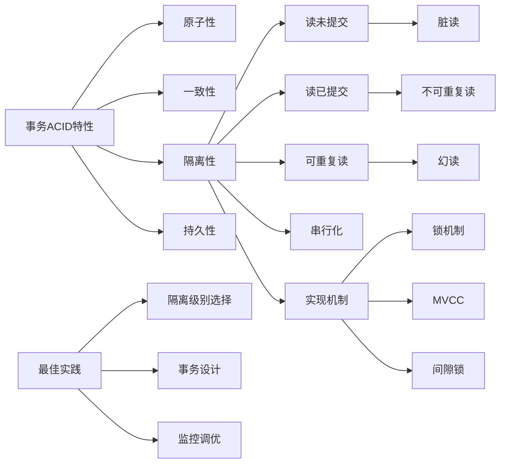

# 解释事务的ACID特性和隔离级别？

## 概要回答

事务的ACID特性是数据库管理系统中确保数据一致性和可靠性的四个基本属性：原子性（Atomicity）、一致性（Consistency）、隔离性（Isolation）和持久性（Durability）。事务隔离级别定义了事务之间的可见性和影响程度，主要包括读未提交、读已提交、可重复读和串行化四个级别，用于平衡数据一致性和并发性能。

## 深度解析

### ACID特性详解

#### 1. 原子性（Atomicity）
```sql
-- 原子性确保事务中的所有操作要么全部成功，要么全部失败回滚
-- 示例：银行转账事务
START TRANSACTION;

-- 从账户A扣除100元
UPDATE accounts SET balance = balance - 100 WHERE account_id = 'A';

-- 向账户B增加100元
UPDATE accounts SET balance = balance + 100 WHERE account_id = 'B';

-- 如果任何一步失败，整个事务都会回滚
COMMIT; -- 或 ROLLBACK;

-- 模拟原子性失败的情况
START TRANSACTION;

UPDATE accounts SET balance = balance - 100 WHERE account_id = 'A';

-- 假设这里发生错误（如账户B不存在）
-- UPDATE accounts SET balance = balance + 100 WHERE account_id = 'B';

-- 由于错误，执行回滚
ROLLBACK;

-- 账户A的余额不会发生变化，保证了原子性
```

#### 2. 一致性（Consistency）
```sql
-- 一致性确保事务执行前后数据库始终处于一致状态
-- 示例：库存管理的一致性约束
CREATE TABLE products (
    id INT PRIMARY KEY,
    name VARCHAR(100),
    stock INT CHECK (stock >= 0), -- 一致性约束：库存不能为负
    price DECIMAL(10,2)
);

CREATE TABLE orders (
    id INT PRIMARY KEY,
    product_id INT,
    quantity INT,
    order_date TIMESTAMP,
    FOREIGN KEY (product_id) REFERENCES products(id)
);

-- 事务确保库存一致性
START TRANSACTION;

-- 检查库存是否足够
SELECT stock INTO @available_stock FROM products WHERE id = 1;

-- 假设要购买5件商品
SET @requested_quantity = 5;

-- 如果库存足够，则扣减库存并创建订单
IF @available_stock >= @requested_quantity THEN
    UPDATE products SET stock = stock - @requested_quantity WHERE id = 1;
    INSERT INTO orders (id, product_id, quantity, order_date) 
    VALUES (1, 1, @requested_quantity, NOW());
    COMMIT;
ELSE
    -- 库存不足，回滚事务
    ROLLBACK;
END IF;
```

#### 3. 隔离性（Isolation）
```sql
-- 隔离性确保并发事务之间不会相互干扰
-- 示例：两个并发事务同时修改同一数据
-- 会话1
START TRANSACTION;
SELECT balance FROM accounts WHERE account_id = 'A'; -- 假设返回1000

-- 会话2（同时执行）
START TRANSACTION;
SELECT balance FROM accounts WHERE account_id = 'A'; -- 也返回1000

-- 会话1
UPDATE accounts SET balance = balance - 100 WHERE account_id = 'A';
COMMIT;

-- 会话2
UPDATE accounts SET balance = balance - 200 WHERE account_id = 'A';
COMMIT;

-- 最终结果取决于隔离级别：
-- 在READ COMMITTED及以上级别，会话2会看到会话1的更改
-- 在READ UNCOMMITTED级别，可能会出现脏读
```

#### 4. 持久性（Durability）
```sql
-- 持久性确保已提交的事务永久保存在数据库中
-- 示例：事务提交后的数据持久化
START TRANSACTION;

INSERT INTO transaction_log (transaction_id, amount, timestamp) 
VALUES ('TXN001', 100.00, NOW());

UPDATE accounts SET balance = balance - 100 WHERE account_id = 'A';

COMMIT;

-- 即使系统崩溃，COMMIT后的数据也会通过以下机制持久化：
-- 1. Write-Ahead Logging (WAL)：先写日志再写数据
-- 2. Doublewrite Buffer：防止部分页写入导致的数据损坏
-- 3. Checkpoint机制：定期将脏页刷入磁盘

-- 查看InnoDB的持久化相关配置
SHOW VARIABLES LIKE 'innodb_flush_log_at_trx_commit';
SHOW VARIABLES LIKE 'sync_binlog';
```

### 事务隔离级别

#### 1. 读未提交（Read Uncommitted）
```sql
-- 最低隔离级别，允许脏读
-- 设置隔离级别
SET SESSION TRANSACTION ISOLATION LEVEL READ UNCOMMITTED;

-- 会话1
START TRANSACTION;
UPDATE accounts SET balance = 1500 WHERE account_id = 'A';

-- 会话2（在同一时间）
START TRANSACTION;
-- 可以读取到会话1未提交的数据（脏读）
SELECT balance FROM accounts WHERE account_id = 'A'; -- 返回1500

-- 会话1
ROLLBACK; -- 回滚事务

-- 会话2
-- 再次查询会得到不同的结果
SELECT balance FROM accounts WHERE account_id = 'A'; -- 返回原来的值

-- 脏读问题：读取到了从未真正存在的数据
```

#### 2. 读已提交（Read Committed）
```sql
-- Oracle默认隔离级别，避免脏读但可能出现不可重复读
SET SESSION TRANSACTION ISOLATION LEVEL READ COMMITTED;

-- 会话1
START TRANSACTION;
SELECT balance FROM accounts WHERE account_id = 'A'; -- 返回1000

-- 会话2
START TRANSACTION;
UPDATE accounts SET balance = 1500 WHERE account_id = 'A';
COMMIT;

-- 会话1
-- 在同一事务中再次查询，会得到不同的结果（不可重复读）
SELECT balance FROM accounts WHERE account_id = 'A'; -- 返回1500

-- 不可重复读问题：同一事务中相同查询返回不同结果

-- 幻读示例
START TRANSACTION;
SELECT COUNT(*) FROM accounts WHERE balance > 1000; -- 返回5

-- 会话2插入新记录
INSERT INTO accounts (account_id, balance) VALUES ('C', 2000);
COMMIT;

-- 会话1
SELECT COUNT(*) FROM accounts WHERE balance > 1000; -- 返回6
-- 幻读问题：同一查询返回不同数量的行
```

#### 3. 可重复读（Repeatable Read）
```sql
-- MySQL默认隔离级别，避免脏读和不可重复读，但可能出现幻读
SET SESSION TRANSACTION ISOLATION LEVEL REPEATABLE READ;

-- 会话1
START TRANSACTION;
SELECT balance FROM accounts WHERE account_id = 'A'; -- 返回1000

-- 会话2
START TRANSACTION;
UPDATE accounts SET balance = 1500 WHERE account_id = 'A';
COMMIT;

-- 会话1
-- 在同一事务中多次查询，结果保持一致
SELECT balance FROM accounts WHERE account_id = 'A'; -- 仍然返回1000

-- 使用MVCC（多版本并发控制）实现一致性读
-- 会话1看到的是事务开始时的数据快照

-- 幻读示例（在MySQL中通过间隙锁部分解决）
START TRANSACTION;
SELECT COUNT(*) FROM accounts WHERE balance BETWEEN 1000 AND 2000; -- 返回5

-- 会话2
START TRANSACTION;
INSERT INTO accounts (account_id, balance) VALUES ('C', 1500);
COMMIT;

-- 会话1
SELECT COUNT(*) FROM accounts WHERE balance BETWEEN 1000 AND 2000; -- 仍然返回5
-- MySQL通过间隙锁避免了幻读
```

#### 4. 串行化（Serializable）
```sql
-- 最高隔离级别，完全避免并发问题但性能最低
SET SESSION TRANSACTION ISOLATION LEVEL SERIALIZABLE;

-- 会话1
START TRANSACTION;
SELECT * FROM accounts WHERE balance > 1000;

-- 会话2
START TRANSACTION;
-- 以下操作会被阻塞直到会话1提交或回滚
UPDATE accounts SET balance = 1500 WHERE account_id = 'A';

-- 串行化通过锁机制实现：
-- 1. 读锁：防止其他事务修改正在读取的数据
-- 2. 范围锁：防止其他事务在查询范围内插入新数据

-- 性能影响：高并发场景下可能导致大量锁等待
```

### 隔离级别的实现机制

#### 1. 锁机制
```sql
-- 共享锁（S锁）和排他锁（X锁）
-- 共享锁：允许多个事务同时读取同一资源
-- 排他锁：独占资源，阻止其他事务读写

-- 手动加锁示例
START TRANSACTION;

-- 加共享锁
SELECT * FROM accounts WHERE account_id = 'A' LOCK IN SHARE MODE;

-- 加排他锁
SELECT * FROM accounts WHERE account_id = 'A' FOR UPDATE;

COMMIT;

-- 查看锁信息
SHOW ENGINE INNODB STATUS;

-- 查看当前锁等待
SELECT * FROM information_schema.innodb_locks;
SELECT * FROM information_schema.innodb_lock_waits;
```

#### 2. 多版本并发控制（MVCC）
```sql
-- MVCC通过保存数据的多个版本实现非阻塞读取
-- InnoDB的MVCC实现机制：

-- 1. 隐藏列
-- DB_TRX_ID：最后修改该行的事务ID
-- DB_ROLL_PTR：指向undo日志的指针

-- 2. undo日志
-- 保存数据的历史版本

-- 3. Read View
-- 记录事务开始时活跃的事务ID列表

-- 示例：MVCC工作原理
-- 当前事务ID为100
-- 表中某行数据：
-- trx_id = 90, roll_ptr -> undo_log_90
-- trx_id = 80, roll_ptr -> undo_log_80

-- Read View包含事务ID：[95, 98, 102]

-- 对于trx_id = 90的数据：
-- 90 < 100 且 90不在活跃列表中 -> 可见

-- 对于trx_id = 102的数据：
-- 102 > 100 -> 不可见，需要通过roll_ptr找到可见版本

-- 查看MVCC相关信息
SELECT trx_id, trx_state, trx_started, trx_isolation_level 
FROM information_schema.innodb_trx;
```

#### 3. 间隙锁和临键锁
```sql
-- 间隙锁（Gap Lock）和临键锁（Next-Key Lock）
-- 用于解决幻读问题

CREATE TABLE test_gap (
    id INT PRIMARY KEY,
    value INT
);

INSERT INTO test_gap VALUES (10, 100), (20, 200), (30, 300);

-- 会话1
START TRANSACTION;
-- 对范围(10, 20)加间隙锁
SELECT * FROM test_gap WHERE id > 10 AND id < 20 FOR UPDATE;

-- 会话2
START TRANSACTION;
-- 以下操作会被阻塞
INSERT INTO test_gap VALUES (15, 150); -- 在间隙内插入
UPDATE test_gap SET value = 150 WHERE id = 15; -- 更新不存在的记录

-- 临键锁 = 记录锁 + 间隙锁
-- SELECT * FROM test_gap WHERE id = 20 FOR UPDATE;
-- 对记录20加记录锁，对间隙(10, 20)加间隙锁

-- 查看锁信息
SELECT ENGINE_TRANSACTION_ID, OBJECT_NAME, INDEX_NAME, LOCK_TYPE, LOCK_MODE, LOCK_DATA
FROM performance_schema.data_locks;
```

### 实际应用中的最佳实践

#### 1. 隔离级别选择
```sql
-- 根据业务需求选择合适的隔离级别

-- 1. 金融系统：需要最高一致性
SET SESSION TRANSACTION ISOLATION LEVEL REPEATABLE READ;
-- 或在极端情况下使用SERIALIZABLE

-- 2. 电商平台：平衡一致性和性能
SET SESSION TRANSACTION ISOLATION LEVEL READ COMMITTED;

-- 3. 报表系统：可以容忍一定程度的不一致
SET SESSION TRANSACTION ISOLATION LEVEL READ UNCOMMITTED;

-- 查看当前隔离级别
SELECT @@transaction_isolation;

-- 在应用层面设置（以PHP为例）
/*
$pdo = new PDO($dsn, $user, $pass, [
    PDO::ATTR_ERRMODE => PDO::ERRMODE_EXCEPTION,
    PDO::MYSQL_ATTR_INIT_COMMAND => "SET SESSION TRANSACTION ISOLATION LEVEL READ COMMITTED"
]);
*/
```

#### 2. 事务设计原则
```sql
-- 1. 保持事务简短
-- 不好的例子：长时间运行的事务
START TRANSACTION;
SELECT * FROM large_table; -- 大表查询
-- 处理大量数据...
UPDATE another_table SET status = 'processed';
COMMIT;

-- 好的例子：分解大事务
-- 分批处理数据
DELIMITER $$
CREATE PROCEDURE process_large_dataset()
BEGIN
    DECLARE done INT DEFAULT FALSE;
    DECLARE batch_size INT DEFAULT 1000;
    DECLARE offset INT DEFAULT 0;
    
    WHILE NOT done DO
        START TRANSACTION;
        
        -- 处理一批数据
        UPDATE large_table 
        SET processed = 1 
        WHERE id > offset AND id <= offset + batch_size 
        AND processed = 0
        LIMIT batch_size;
        
        -- 检查是否还有数据需要处理
        IF ROW_COUNT() < batch_size THEN
            SET done = TRUE;
        END IF;
        
        COMMIT;
        SET offset = offset + batch_size;
    END WHILE;
END$$
DELIMITER ;

-- 2. 合理使用显式锁
START TRANSACTION;
-- 对关键数据加锁
SELECT * FROM critical_table WHERE id = 1 FOR UPDATE;

-- 执行关键业务逻辑
UPDATE critical_table SET status = 'locked' WHERE id = 1;

COMMIT;

-- 3. 避免死锁
-- 死锁预防：按固定顺序访问资源
-- 会话1
START TRANSACTION;
SELECT * FROM table_a WHERE id = 1 FOR UPDATE;
SELECT * FROM table_b WHERE id = 1 FOR UPDATE;
COMMIT;

-- 会话2
START TRANSACTION;
-- 按相同顺序访问表
SELECT * FROM table_a WHERE id = 2 FOR UPDATE;
SELECT * FROM table_b WHERE id = 2 FOR UPDATE;
COMMIT;
```

#### 3. 监控和调优
```sql
-- 监控事务性能
-- 1. 查看长时间运行的事务
SELECT trx_id, trx_state, trx_started, trx_mysql_thread_id, trx_query
FROM information_schema.innodb_trx
WHERE trx_started < DATE_SUB(NOW(), INTERVAL 1 MINUTE);

-- 2. 查看锁等待情况
SELECT 
    r.trx_id waiting_trx_id,
    r.trx_mysql_thread_id waiting_thread,
    r.trx_query waiting_query,
    b.trx_id blocking_trx_id,
    b.trx_mysql_thread_id blocking_thread,
    b.trx_query blocking_query
FROM information_schema.innodb_lock_waits w
INNER JOIN information_schema.innodb_trx b ON b.trx_id = w.blocking_trx_id
INNER JOIN information_schema.innodb_trx r ON r.trx_id = w.requesting_trx_id;

-- 3. 分析事务日志
-- 启用事务日志
SET GLOBAL log_transactions = ON;

-- 4. 使用性能模式监控
SELECT 
    EVENT_NAME,
    COUNT_STAR,
    AVG_TIMER_WAIT,
    MAX_TIMER_WAIT
FROM performance_schema.events_transactions_summary_global_by_event_name
WHERE COUNT_STAR > 0
ORDER BY AVG_TIMER_WAIT DESC;
```

## 图示说明



通过深入理解事务的ACID特性和隔离级别，可以更好地设计和优化数据库应用，确保数据的一致性和可靠性，同时平衡并发性能需求。