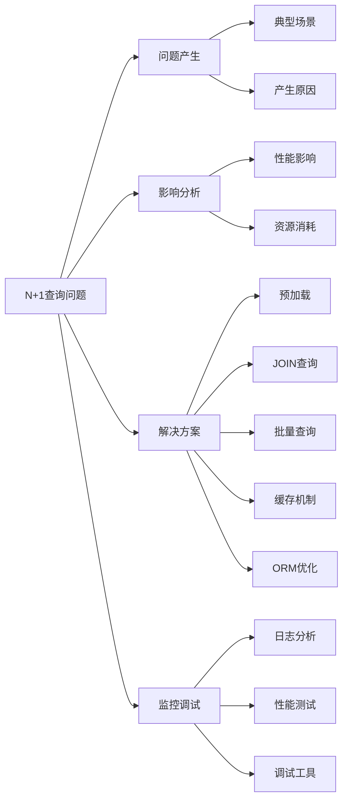

# 什么是N+1查询问题？如何解决？

## 概要回答

N+1查询问题是数据库访问中的常见性能问题，指的是执行一次查询获取N条主记录后，又对每条记录发起一次关联查询，总共产生N+1次查询。这会导致数据库连接开销增大、网络延迟增加和整体性能下降。解决方案包括：使用JOIN查询、预加载关联数据、批量查询、缓存机制和优化ORM配置等。

## 深度解析

### N+1查询问题详解

#### 1. 问题产生场景
```php
<?php
// 典型的N+1查询问题示例
// 假设有文章和作者两个实体

// 数据库表结构
/*
CREATE TABLE authors (
    id INT PRIMARY KEY AUTO_INCREMENT,
    name VARCHAR(100),
    email VARCHAR(100)
);

CREATE TABLE articles (
    id INT PRIMARY KEY AUTO_INCREMENT,
    title VARCHAR(200),
    content TEXT,
    author_id INT,
    FOREIGN KEY (author_id) REFERENCES authors(id)
);
*/

// 不好的实现方式 - 产生N+1查询
class ArticleController {
    public function listArticles() {
        // 第1次查询：获取所有文章（N篇文章）
        $articles = Article::all(); // SELECT * FROM articles;
        
        $result = [];
        foreach ($articles as $article) {
            // 对每篇文章执行1次查询获取作者信息
            // 总共执行N次查询
            $author = Author::find($article->author_id); // SELECT * FROM authors WHERE id = ?
            
            $result[] = [
                'title' => $article->title,
                'content' => $article->content,
                'author_name' => $author->name,
                'author_email' => $author->email
            ];
        }
        
        // 如果有100篇文章，总共执行101次查询（1+N）
        return $result;
    }
}

// 使用Laravel ORM的典型N+1问题
class Article extends Model {
    public function author() {
        return $this->belongsTo(Author::class);
    }
}

// 控制器中产生N+1查询的代码
$articles = Article::all();
foreach ($articles as $article) {
    // 每次访问author属性都会执行一次查询
    echo $article->author->name; // N次查询
}
?>
```

#### 2. 问题影响分析
```php
<?php
// N+1查询性能对比示例
class PerformanceComparison {
    // N+1查询方式
    public function nPlusOneApproach() {
        $startTime = microtime(true);
        $startMemory = memory_get_usage();
        
        $articles = Article::all(); // 1次查询
        
        $result = [];
        foreach ($articles as $article) {
            // N次查询
            $author = Author::find($article->author_id);
            
            $result[] = [
                'id' => $article->id,
                'title' => $article->title,
                'author_name' => $author->name
            ];
        }
        
        $endTime = microtime(true);
        $endMemory = memory_get_usage();
        
        return [
            'execution_time' => ($endTime - $startTime) * 1000, // 毫秒
            'memory_usage' => ($endMemory - $startMemory) / 1024, // KB
            'query_count' => count($articles) + 1 // N+1次查询
        ];
    }
    
    // 优化后的JOIN查询方式
    public function joinApproach() {
        $startTime = microtime(true);
        $startMemory = memory_get_usage();
        
        // 1次JOIN查询获取所有数据
        $result = DB::select("
            SELECT a.id, a.title, au.name as author_name
            FROM articles a
            JOIN authors au ON a.author_id = au.id
        ");
        
        $endTime = microtime(true);
        $endMemory = memory_get_usage();
        
        return [
            'execution_time' => ($endTime - $startTime) * 1000,
            'memory_usage' => ($endMemory - $startMemory) / 1024,
            'query_count' => 1 // 只有1次查询
        ];
    }
    
    // 性能测试结果示例（1000篇文章）：
    // N+1方式：执行时间 ~500ms，内存使用 ~2MB，查询次数 1001次
    // JOIN方式：执行时间 ~50ms，内存使用 ~1.5MB，查询次数 1次
}
?>
```

### 解决方案详解

#### 1. 预加载（Eager Loading）
```php
<?php
// Laravel ORM中的预加载解决方案
class Article extends Model {
    public function author() {
        return $this->belongsTo(Author::class);
    }
    
    public function comments() {
        return $this->hasMany(Comment::class);
    }
}

class Author extends Model {
    public function articles() {
        return $this->hasMany(Article::class);
    }
}

// 解决方案1：使用with()方法预加载
$articles = Article::with('author')->get();
// 执行2次查询：
// 1. SELECT * FROM articles;
// 2. SELECT * FROM authors WHERE id IN (1, 2, 3, ..., N);

foreach ($articles as $article) {
    // 不会产生额外查询
    echo $article->author->name;
}

// 预加载多个关联
$articles = Article::with(['author', 'comments'])->get();

// 嵌套预加载
$articles = Article::with('author.articles')->get();

// 带条件的预加载
$articles = Article::with(['comments' => function ($query) {
    $query->where('approved', true);
}])->get();

// 预加载统计信息
$authors = Author::withCount('articles')->get();
foreach ($authors as $author) {
    echo $author->articles_count; // 文章数量
}
?>
```

#### 2. JOIN查询优化
```php
<?php
// 使用JOIN查询避免N+1问题
class ArticleRepository {
    // 方法1：使用查询构建器的JOIN
    public function getArticlesWithAuthors() {
        return DB::table('articles as a')
            ->join('authors as au', 'a.author_id', '=', 'au.id')
            ->select('a.id', 'a.title', 'a.content', 'au.name as author_name', 'au.email as author_email')
            ->get();
    }
    
    // 方法2：使用原生SQL
    public function getArticlesWithAuthorsRaw() {
        return DB::select("
            SELECT 
                a.id,
                a.title,
                a.content,
                a.created_at,
                au.name as author_name,
                au.email as author_email,
                au.bio as author_bio
            FROM articles a
            INNER JOIN authors au ON a.author_id = au.id
            ORDER BY a.created_at DESC
            LIMIT 50
        ");
    }
    
    // 方法3：复杂JOIN查询（多层关联）
    public function getArticleDetails() {
        return DB::table('articles as a')
            ->join('authors as au', 'a.author_id', '=', 'au.id')
            ->leftJoin('categories as c', 'a.category_id', '=', 'c.id')
            ->leftJoin('(SELECT article_id, COUNT(*) as comment_count FROM comments GROUP BY article_id) as cm', 
                      'a.id', '=', 'cm.article_id')
            ->select(
                'a.id',
                'a.title',
                'a.content',
                'au.name as author_name',
                'c.name as category_name',
                'cm.comment_count'
            )
            ->get();
    }
}

// 在模型中定义查询作用域
class Article extends Model {
    public function scopeWithAuthor($query) {
        return $query->join('authors', 'articles.author_id', '=', 'authors.id')
                    ->select('articles.*', 'authors.name as author_name');
    }
}

// 使用查询作用域
$articles = Article::withAuthor()->get();
?>
```

#### 3. 批量查询优化
```php
<?php
// 批量查询解决方案
class BatchQuerySolution {
    // 方法1：收集ID后批量查询
    public function batchLoadAuthors($articles) {
        // 收集所有需要的author_id
        $authorIds = array_unique(array_column($articles, 'author_id'));
        
        // 一次性查询所有作者
        $authors = Author::whereIn('id', $authorIds)->get();
        
        // 建立ID到作者的映射
        $authorMap = [];
        foreach ($authors as $author) {
            $authorMap[$author->id] = $author;
        }
        
        // 组装结果
        $result = [];
        foreach ($articles as $article) {
            $author = $authorMap[$article->author_id] ?? null;
            $result[] = [
                'title' => $article->title,
                'author_name' => $author ? $author->name : 'Unknown'
            ];
        }
        
        return $result;
    }
    
    // 方法2：使用Chunk分批处理大数据集
    public function processLargeDataset() {
        $results = [];
        
        Article::chunk(200, function ($articles) use (&$results) {
            // 对每批200篇文章进行处理
            $authorIds = $articles->pluck('author_id')->unique();
            $authors = Author::whereIn('id', $authorIds)->get();
            
            $authorMap = $authors->keyBy('id');
            
            foreach ($articles as $article) {
                $author = $authorMap[$article->author_id] ?? null;
                $results[] = [
                    'article_id' => $article->id,
                    'title' => $article->title,
                    'author_name' => $author ? $author->name : 'Unknown'
                ];
            }
        });
        
        return $results;
    }
}
?>
```

#### 4. 缓存机制优化
```php
<?php
// 使用缓存避免重复查询
class CachedQuerySolution {
    // 方法1：缓存单个作者信息
    public function getCachedAuthor($authorId) {
        $cacheKey = "author_{$authorId}";
        
        // 尝试从缓存获取
        $author = Cache::get($cacheKey);
        if ($author) {
            return $author;
        }
        
        // 缓存未命中，从数据库查询
        $author = Author::find($authorId);
        
        // 将结果存入缓存（5分钟过期）
        if ($author) {
            Cache::put($cacheKey, $author, 300);
        }
        
        return $author;
    }
    
    // 方法2：批量缓存
    public function getBatchCachedAuthors($authorIds) {
        $cacheKeys = array_map(function($id) {
            return "author_{$id}";
        }, $authorIds);
        
        // 批量获取缓存
        $cachedAuthors = Cache::many($cacheKeys);
        
        // 找出未命中的ID
        $missingIds = [];
        $result = [];
        
        foreach ($authorIds as $index => $id) {
            if ($cachedAuthors[$index] !== null) {
                $result[$id] = $cachedAuthors[$index];
            } else {
                $missingIds[] = $id;
            }
        }
        
        // 批量查询缺失的数据
        if (!empty($missingIds)) {
            $missingAuthors = Author::whereIn('id', $missingIds)->get();
            
            // 缓存新查询的数据
            $newCacheData = [];
            foreach ($missingAuthors as $author) {
                $result[$author->id] = $author;
                $newCacheData["author_{$author->id}"] = $author;
            }
            
            // 批量设置缓存
            Cache::putMany($newCacheData, 300);
        }
        
        return $result;
    }
    
    // 方法3：查询结果缓存
    public function getCachedArticleList() {
        $cacheKey = 'article_list_with_authors';
        
        // 尝试从缓存获取
        $result = Cache::get($cacheKey);
        if ($result) {
            return $result;
        }
        
        // 缓存未命中，执行复杂查询
        $result = DB::table('articles as a')
            ->join('authors as au', 'a.author_id', '=', 'au.id')
            ->select('a.id', 'a.title', 'au.name as author_name')
            ->orderBy('a.created_at', 'desc')
            ->limit(50)
            ->get();
        
        // 缓存结果（10分钟）
        Cache::put($cacheKey, $result, 600);
        
        return $result;
    }
}
?>
```

### ORM配置优化

#### 1. Laravel ORM优化
```php
<?php
// Laravel ORM优化配置
class OptimizedModels {
    // 模型配置优化
    class Article extends Model {
        // 设置合理的可见字段
        protected $visible = ['id', 'title', 'content', 'author_id', 'created_at'];
        
        // 隐藏敏感字段
        protected $hidden = ['updated_at'];
        
        // 定义访问器优化
        public function getSummaryAttribute() {
            return Str::limit($this->content, 100);
        }
        
        // 使用查询缓存
        public function scopePopular($query) {
            return $query->where('views', '>', 1000)
                        ->orderBy('views', 'desc');
        }
        
        // 预加载默认关联
        protected $with = ['author'];
        
        // 关联定义
        public function author() {
            return $this->belongsTo(Author::class)->select(['id', 'name']);
        }
        
        public function comments() {
            return $this->hasMany(Comment::class)->where('approved', true);
        }
    }
    
    // 查询优化示例
    class ArticleService {
        // 优化的列表查询
        public function getArticleList($page = 1, $perPage = 20) {
            return Article::with(['author:id,name', 'comments:id,article_id'])
                         ->select(['id', 'title', 'author_id', 'created_at'])
                         ->paginate($perPage, ['*'], 'page', $page);
        }
        
        // 优化的详情查询
        public function getArticleDetail($id) {
            return Article::with([
                'author:id,name,email,bio',
                'comments:id,article_id,content,created_at',
                'comments.user:id,name,avatar'
            ])->findOrFail($id);
        }
        
        // 使用查询缓存
        public function getCachedArticle($id) {
            return Cache::remember("article_{$id}", 3600, function() use ($id) {
                return $this->getArticleDetail($id);
            });
        }
    }
}
?>
```

#### 2. Doctrine ORM优化
```php
<?php
// Doctrine ORM中的N+1解决方案
use Doctrine\ORM\EntityManagerInterface;
use Doctrine\ORM\Query\Expr\Join;

class DoctrineOptimization {
    private $entityManager;
    
    public function __construct(EntityManagerInterface $entityManager) {
        $this->entityManager = $entityManager;
    }
    
    // 方法1：使用JOIN FETCH
    public function getArticlesWithAuthorsJoinFetch() {
        $query = $this->entityManager->createQuery(
            'SELECT a, au FROM App\Entity\Article a JOIN FETCH a.author au'
        );
        
        return $query->getResult();
    }
    
    // 方法2：使用QueryBuilder和JOIN FETCH
    public function getArticlesWithComments() {
        $qb = $this->entityManager->createQueryBuilder();
        
        $articles = $qb->select('a', 'au', 'c')
                      ->from('App\Entity\Article', 'a')
                      ->join('a.author', 'au')
                      ->leftJoin('a.comments', 'c')
                      ->where('c.approved = :approved')
                      ->setParameter('approved', true)
                      ->getQuery()
                      ->getResult();
        
        return $articles;
    }
    
    // 方法3：批量获取关联实体
    public function getArticlesWithBatchAuthors($articles) {
        // 收集作者ID
        $authorIds = array_unique(array_map(function($article) {
            return $article->getAuthor()->getId();
        }, $articles));
        
        // 批量查询作者
        $authors = $this->entityManager->getRepository('App\Entity\Author')
                      ->findBy(['id' => $authorIds]);
        
        // 建立映射关系
        $authorMap = [];
        foreach ($authors as $author) {
            $authorMap[$author->getId()] = $author;
        }
        
        return $authorMap;
    }
}
?>
```

### 监控和调试

#### 1. 查询日志分析
```php
<?php
// 启用查询日志进行调试
class QueryDebugging {
    // Laravel查询日志
    public function enableQueryLog() {
        // 启用查询日志
        DB::enableQueryLog();
        
        // 执行可能产生N+1的代码
        $articles = Article::all();
        foreach ($articles as $article) {
            echo $article->author->name;
        }
        
        // 获取查询日志
        $queries = DB::getQueryLog();
        
        // 分析查询模式
        $this->analyzeQueries($queries);
    }
    
    private function analyzeQueries($queries) {
        echo "Total queries: " . count($queries) . "\n";
        
        // 统计相似查询
        $queryPatterns = [];
        foreach ($queries as $query) {
            $pattern = preg_replace('/\d+/', '?', $query['query']);
            if (!isset($queryPatterns[$pattern])) {
                $queryPatterns[$pattern] = 0;
            }
            $queryPatterns[$pattern]++;
        }
        
        // 识别潜在的N+1查询
        foreach ($queryPatterns as $pattern => $count) {
            if ($count > 10) { // 假设超过10次可能是N+1
                echo "Potential N+1 query pattern: {$pattern} (executed {$count} times)\n";
            }
        }
    }
    
    // 使用调试工具
    public function useDebugbar() {
        // 在开发环境中启用Laravel Debugbar
        // 可以直观看到查询次数和执行时间
        
        // 或使用自定义中间件记录查询
        class QueryCounterMiddleware {
            public function handle($request, Closure $next) {
                DB::enableQueryLog();
                
                $response = $next($request);
                
                $queries = DB::getQueryLog();
                $queryCount = count($queries);
                
                // 在响应头中添加查询次数
                $response->headers->set('X-Query-Count', $queryCount);
                
                return $response;
            }
        }
    }
}
?>
```

#### 2. 性能基准测试
```php
<?php
// 性能基准测试
class PerformanceBenchmark {
    public function benchmarkNPlusOne() {
        // 测试数据准备
        $this->prepareTestData(1000); // 准备1000篇文章
        
        // 测试N+1查询方式
        $nPlusOneTime = $this->measureExecutionTime(function() {
            return $this->nPlusOneApproach();
        });
        
        // 测试优化后的方式
        $optimizedTime = $this->measureExecutionTime(function() {
            return $this->optimizedApproach();
        });
        
        echo "N+1 approach: {$nPlusOneTime}ms\n";
        echo "Optimized approach: {$optimizedTime}ms\n";
        echo "Improvement: " . round(($nPlusOneTime - $optimizedTime) / $nPlusOneTime * 100, 2) . "%\n";
    }
    
    private function measureExecutionTime($callback) {
        $startTime = microtime(true);
        $callback();
        $endTime = microtime(true);
        
        return ($endTime - $startTime) * 1000; // 转换为毫秒
    }
    
    private function prepareTestData($count) {
        // 清理旧数据
        Article::truncate();
        Author::truncate();
        
        // 创建作者
        $authors = factory(Author::class, 50)->create();
        
        // 创建文章
        factory(Article::class, $count)->create([
            'author_id' => function() use ($authors) {
                return $authors->random()->id;
            }
        ]);
    }
}
?>
```

## 图示说明



通过理解N+1查询问题的本质和掌握各种解决方案，可以显著提升数据库访问性能，改善用户体验，并降低服务器资源消耗。在实际开发中，应该根据具体场景选择最适合的优化策略。