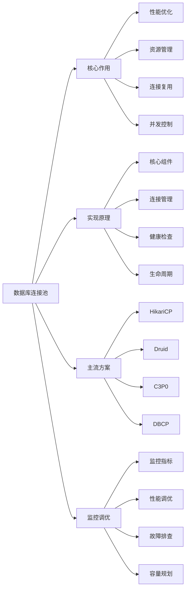

# 数据库连接池的作用和实现原理？

## 概要回答

数据库连接池是一种数据库连接管理技术，用于预先创建并维护一定数量的数据库连接，应用程序需要时从池中获取连接，使用完毕后归还连接而非关闭。其主要作用是减少连接创建和销毁的开销、提高系统性能、控制并发连接数、避免连接泄漏。实现原理包括连接的创建、管理、分配、回收和监控等机制。

## 深度解析

### 数据库连接池的作用

#### 1. 性能优化
```java
// 连接创建和销毁的开销示例（Java）
public class ConnectionOverheadDemo {
    // 不使用连接池的方式
    public void withoutConnectionPool() {
        long startTime = System.currentTimeMillis();
        
        for (int i = 0; i < 100; i++) {
            try {
                // 每次都创建新的连接
                Connection conn = DriverManager.getConnection(
                    "jdbc:mysql://localhost:3306/testdb",
                    "username",
                    "password"
                );
                
                // 执行简单查询
                PreparedStatement stmt = conn.prepareStatement("SELECT 1");
                ResultSet rs = stmt.executeQuery();
                rs.close();
                stmt.close();
                
                // 关闭连接
                conn.close();
            } catch (SQLException e) {
                e.printStackTrace();
            }
        }
        
        long endTime = System.currentTimeMillis();
        System.out.println("Without connection pool: " + (endTime - startTime) + "ms");
    }
    
    // 使用连接池的方式
    public void withConnectionPool() throws SQLException {
        // 初始化连接池
        HikariConfig config = new HikariConfig();
        config.setJdbcUrl("jdbc:mysql://localhost:3306/testdb");
        config.setUsername("username");
        config.setPassword("password");
        config.setMaximumPoolSize(10);
        
        HikariDataSource dataSource = new HikariDataSource(config);
        
        long startTime = System.currentTimeMillis();
        
        for (int i = 0; i < 100; i++) {
            Connection conn = dataSource.getConnection();
            
            // 执行简单查询
            PreparedStatement stmt = conn.prepareStatement("SELECT 1");
            ResultSet rs = stmt.executeQuery();
            rs.close();
            stmt.close();
            
            // 归还连接到池中
            conn.close(); // 实际上是归还到池中，不是真正关闭
        }
        
        long endTime = System.currentTimeMillis();
        System.out.println("With connection pool: " + (endTime - startTime) + "ms");
        
        dataSource.close();
    }
    
    // 性能对比结果（示例）：
    // Without connection pool: ~2000ms
    // With connection pool: ~200ms
    // 性能提升约10倍
}
```

#### 2. 资源管理
```php
<?php
// PHP中的连接池管理示例
class ConnectionPool {
    private $pool = [];
    private $maxConnections = 10;
    private $currentConnections = 0;
    private $config;
    
    public function __construct($config) {
        $this->config = $config;
    }
    
    // 获取连接
    public function getConnection() {
        // 检查池中是否有可用连接
        if (!empty($this->pool)) {
            return array_pop($this->pool);
        }
        
        // 检查是否可以创建新连接
        if ($this->currentConnections < $this->maxConnections) {
            $connection = $this->createConnection();
            $this->currentConnections++;
            return $connection;
        }
        
        // 等待可用连接（阻塞或超时）
        return $this->waitForConnection();
    }
    
    // 归还连接
    public function releaseConnection($connection) {
        // 检查连接是否有效
        if ($this->isConnectionValid($connection)) {
            // 将连接放回池中
            $this->pool[] = $connection;
        } else {
            // 连接无效，关闭并减少计数
            $this->closeConnection($connection);
            $this->currentConnections--;
        }
    }
    
    // 创建新连接
    private function createConnection() {
        try {
            $pdo = new PDO(
                $this->config['dsn'],
                $this->config['username'],
                $this->config['password'],
                $this->config['options']
            );
            
            // 设置连接属性
            $pdo->setAttribute(PDO::ATTR_ERRMODE, PDO::ERRMODE_EXCEPTION);
            $pdo->setAttribute(PDO::ATTR_DEFAULT_FETCH_MODE, PDO::FETCH_ASSOC);
            
            return $pdo;
        } catch (PDOException $e) {
            throw new Exception("Failed to create database connection: " . $e->getMessage());
        }
    }
    
    // 检查连接有效性
    private function isConnectionValid($connection) {
        try {
            $connection->query("SELECT 1");
            return true;
        } catch (PDOException $e) {
            return false;
        }
    }
    
    // 关闭连接
    private function closeConnection($connection) {
        $connection = null;
    }
    
    // 等待可用连接
    private function waitForConnection() {
        $timeout = 5; // 5秒超时
        $start = time();
        
        while (time() - $start < $timeout) {
            if (!empty($this->pool)) {
                return array_pop($this->pool);
            }
            usleep(100000); // 等待100毫秒
        }
        
        throw new Exception("Connection pool timeout");
    }
    
    // 获取池状态
    public function getPoolStatus() {
        return [
            'available_connections' => count($this->pool),
            'active_connections' => $this->currentConnections - count($this->pool),
            'max_connections' => $this->maxConnections,
            'total_connections' => $this->currentConnections
        ];
    }
}

// 使用示例
$config = [
    'dsn' => 'mysql:host=localhost;dbname=testdb',
    'username' => 'username',
    'password' => 'password',
    'options' => [
        PDO::ATTR_PERSISTENT => true
    ]
];

$pool = new ConnectionPool($config);

try {
    // 获取连接
    $conn = $pool->getConnection();
    
    // 执行数据库操作
    $stmt = $conn->prepare("SELECT * FROM users WHERE id = ?");
    $stmt->execute([1]);
    $user = $stmt->fetch();
    
    // 归还连接
    $pool->releaseConnection($conn);
    
    print_r($pool->getPoolStatus());
} catch (Exception $e) {
    echo "Error: " . $e->getMessage();
}
?>
```

### 连接池实现原理

#### 1. 核心组件设计
```java
// Java连接池核心组件
public class CustomConnectionPool {
    // 连接池配置
    private PoolConfig config;
    
    // 可用连接队列
    private Queue<PooledConnection> availableConnections;
    
    // 正在使用的连接集合
    private Set<PooledConnection> usedConnections;
    
    // 连接创建锁
    private final Object connectionLock = new Object();
    
    // 监控统计
    private PoolStatistics statistics;
    
    public CustomConnectionPool(PoolConfig config) {
        this.config = config;
        this.availableConnections = new ConcurrentLinkedQueue<>();
        this.usedConnections = ConcurrentHashMap.newKeySet();
        this.statistics = new PoolStatistics();
        
        // 初始化最小连接数
        initializeMinConnections();
    }
    
    // 获取连接
    public Connection getConnection() throws SQLException {
        return getConnection(config.getConnectionTimeout());
    }
    
    public Connection getConnection(long timeoutMs) throws SQLException {
        statistics.incrementRequestCount();
        long startTime = System.currentTimeMillis();
        
        try {
            PooledConnection connection = getConnectionInternal(timeoutMs);
            statistics.recordGetConnectionTime(System.currentTimeMillis() - startTime);
            return connection;
        } catch (SQLException e) {
            statistics.incrementFailedRequestCount();
            throw e;
        }
    }
    
    private PooledConnection getConnectionInternal(long timeoutMs) throws SQLException {
        // 1. 尝试从可用连接队列获取
        PooledConnection connection = availableConnections.poll();
        if (connection != null && isConnectionAlive(connection)) {
            usedConnections.add(connection);
            connection.setLastUsedTime(System.currentTimeMillis());
            return connection;
        }
        
        // 2. 如果没有可用连接且未达到最大连接数，创建新连接
        synchronized (connectionLock) {
            if (getTotalConnections() < config.getMaxPoolSize()) {
                connection = createNewConnection();
                usedConnections.add(connection);
                return connection;
            }
        }
        
        // 3. 等待可用连接
        return waitForAvailableConnection(timeoutMs);
    }
    
    // 创建新连接
    private PooledConnection createNewConnection() throws SQLException {
        try {
            Connection rawConnection = DriverManager.getConnection(
                config.getJdbcUrl(),
                config.getUsername(),
                config.getPassword()
            );
            
            PooledConnection pooledConnection = new PooledConnection(rawConnection, this);
            statistics.incrementCreatedConnections();
            return pooledConnection;
        } catch (SQLException e) {
            statistics.incrementFailedCreations();
            throw e;
        }
    }
    
    // 检查连接是否存活
    private boolean isConnectionAlive(PooledConnection connection) {
        try {
            return !connection.isClosed() && connection.isValid(config.getValidationTimeout());
        } catch (SQLException e) {
            return false;
        }
    }
    
    // 归还连接
    public void releaseConnection(PooledConnection connection) {
        usedConnections.remove(connection);
        
        // 检查连接是否有效且池未满
        if (isConnectionAlive(connection) && availableConnections.size() < config.getMaxPoolSize()) {
            // 重置连接状态
            try {
                connection.resetConnection();
                availableConnections.offer(connection);
                statistics.incrementReturnedConnections();
            } catch (SQLException e) {
                // 连接重置失败，关闭连接
                closeConnection(connection);
            }
        } else {
            // 连接无效或池已满，关闭连接
            closeConnection(connection);
        }
        
        // 唤醒等待的线程
        synchronized (this) {
            notifyAll();
        }
    }
    
    // 关闭连接
    private void closeConnection(PooledConnection connection) {
        try {
            connection.closeRawConnection();
            statistics.incrementClosedConnections();
        } catch (SQLException e) {
            // 记录错误但不抛出异常
            System.err.println("Error closing connection: " + e.getMessage());
        }
    }
    
    // 等待可用连接
    private PooledConnection waitForAvailableConnection(long timeoutMs) throws SQLException {
        long startTime = System.currentTimeMillis();
        long remainingTime = timeoutMs;
        
        while (remainingTime > 0) {
            synchronized (this) {
                PooledConnection connection = availableConnections.poll();
                if (connection != null && isConnectionAlive(connection)) {
                    usedConnections.add(connection);
                    return connection;
                }
                
                try {
                    wait(Math.min(remainingTime, 1000)); // 最多等待1秒
                } catch (InterruptedException e) {
                    Thread.currentThread().interrupt();
                    throw new SQLException("Interrupted while waiting for connection");
                }
            }
            
            remainingTime = timeoutMs - (System.currentTimeMillis() - startTime);
        }
        
        throw new SQLException("Timeout waiting for connection from pool");
    }
    
    // 初始化最小连接数
    private void initializeMinConnections() {
        for (int i = 0; i < config.getMinIdle(); i++) {
            try {
                PooledConnection connection = createNewConnection();
                availableConnections.offer(connection);
            } catch (SQLException e) {
                System.err.println("Failed to create initial connection: " + e.getMessage());
            }
        }
    }
    
    // 获取总连接数
    private int getTotalConnections() {
        return availableConnections.size() + usedConnections.size();
    }
    
    // 关闭连接池
    public void close() {
        // 关闭所有连接
        for (PooledConnection connection : availableConnections) {
            closeConnection(connection);
        }
        
        for (PooledConnection connection : usedConnections) {
            closeConnection(connection);
        }
        
        availableConnections.clear();
        usedConnections.clear();
    }
    
    // 获取统计信息
    public PoolStatistics getStatistics() {
        return statistics;
    }
}

// 连接包装类
class PooledConnection implements Connection {
    private Connection rawConnection;
    private CustomConnectionPool pool;
    private long lastUsedTime;
    private boolean closed = false;
    
    public PooledConnection(Connection rawConnection, CustomConnectionPool pool) {
        this.rawConnection = rawConnection;
        this.pool = pool;
        this.lastUsedTime = System.currentTimeMillis();
    }
    
    // 重写close方法，归还连接到池中而非真正关闭
    @Override
    public void close() throws SQLException {
        if (!closed) {
            closed = true;
            pool.releaseConnection(this);
        }
    }
    
    // 重置连接状态
    public void resetConnection() throws SQLException {
        if (rawConnection.getAutoCommit() == false) {
            rawConnection.setAutoCommit(true);
        }
        
        // 清理事务状态
        if (!rawConnection.getAutoCommit()) {
            rawConnection.rollback();
        }
        
        // 清理其他状态...
    }
    
    // 关闭原始连接
    public void closeRawConnection() throws SQLException {
        rawConnection.close();
    }
    
    // 委托所有其他方法到原始连接
    @Override
    public Statement createStatement() throws SQLException {
        return rawConnection.createStatement();
    }
    
    // ... 其他Connection接口方法的实现
}

// 连接池配置类
class PoolConfig {
    private String jdbcUrl;
    private String username;
    private String password;
    private int minIdle = 5;
    private int maxPoolSize = 20;
    private long connectionTimeout = 30000; // 30秒
    private long validationTimeout = 5000; // 5秒
    private long idleTimeout = 600000; // 10分钟
    private long maxLifetime = 1800000; // 30分钟
    
    // getters and setters...
}

// 连接池统计类
class PoolStatistics {
    private AtomicLong requestCount = new AtomicLong(0);
    private AtomicLong failedRequestCount = new AtomicLong(0);
    private AtomicLong createdConnections = new AtomicLong(0);
    private AtomicLong failedCreations = new AtomicLong(0);
    private AtomicLong returnedConnections = new AtomicLong(0);
    private AtomicLong closedConnections = new AtomicLong(0);
    private AtomicLong totalGetConnectionTime = new AtomicLong(0);
    
    // 增加计数器的方法
    public void incrementRequestCount() { requestCount.incrementAndGet(); }
    public void incrementFailedRequestCount() { failedRequestCount.incrementAndGet(); }
    public void incrementCreatedConnections() { createdConnections.incrementAndGet(); }
    public void incrementFailedCreations() { failedCreations.incrementAndGet(); }
    public void incrementReturnedConnections() { returnedConnections.incrementAndGet(); }
    public void incrementClosedConnections() { closedConnections.incrementAndGet(); }
    public void recordGetConnectionTime(long time) { totalGetConnectionTime.addAndGet(time); }
    
    // 获取统计信息
    public Map<String, Object> getStatistics() {
        Map<String, Object> stats = new HashMap<>();
        stats.put("total_requests", requestCount.get());
        stats.put("failed_requests", failedRequestCount.get());
        stats.put("created_connections", createdConnections.get());
        stats.put("failed_creations", failedCreations.get());
        stats.put("returned_connections", returnedConnections.get());
        stats.put("closed_connections", closedConnections.get());
        stats.put("avg_get_connection_time", 
                  requestCount.get() > 0 ? totalGetConnectionTime.get() / requestCount.get() : 0);
        return stats;
    }
}
```

#### 2. 连接验证和健康检查
```java
// 连接健康检查机制
public class ConnectionHealthChecker {
    private ScheduledExecutorService scheduler;
    private CustomConnectionPool pool;
    private PoolConfig config;
    
    public ConnectionHealthChecker(CustomConnectionPool pool, PoolConfig config) {
        this.pool = pool;
        this.config = config;
        this.scheduler = Executors.newScheduledThreadPool(1);
        
        // 启动定时健康检查
        startHealthCheck();
    }
    
    private void startHealthCheck() {
        scheduler.scheduleWithFixedDelay(() -> {
            try {
                performHealthCheck();
            } catch (Exception e) {
                System.err.println("Health check failed: " . e.getMessage());
            }
        }, config.getIdleTimeout(), config.getIdleTimeout(), TimeUnit.MILLISECONDS);
    }
    
    private void performHealthCheck() {
        // 获取当前可用连接的副本
        Queue<PooledConnection> availableCopy = new ConcurrentLinkedQueue<>(pool.getAvailableConnections());
        
        Iterator<PooledConnection> iterator = availableCopy.iterator();
        while (iterator.hasNext()) {
            PooledConnection connection = iterator.next();
            
            // 检查连接是否超时
            if (isConnectionTimedOut(connection)) {
                pool.removeConnection(connection);
                closeConnection(connection);
                continue;
            }
            
            // 验证连接有效性
            if (!isConnectionValid(connection)) {
                pool.removeConnection(connection);
                closeConnection(connection);
            }
        }
    }
    
    private boolean isConnectionTimedOut(PooledConnection connection) {
        long idleTime = System.currentTimeMillis() - connection.getLastUsedTime();
        return idleTime > config.getIdleTimeout();
    }
    
    private boolean isConnectionValid(PooledConnection connection) {
        try {
            return connection.isValid(config.getValidationTimeout());
        } catch (SQLException e) {
            return false;
        }
    }
    
    private void closeConnection(PooledConnection connection) {
        try {
            connection.closeRawConnection();
        } catch (SQLException e) {
            System.err.println("Error closing connection: " + e.getMessage());
        }
    }
}
```

### 主流连接池对比

#### 1. HikariCP
```java
// HikariCP配置示例
@Configuration
public class DataSourceConfig {
    
    @Bean
    @ConfigurationProperties(prefix = "spring.datasource.hikari")
    public HikariConfig hikariConfig() {
        HikariConfig config = new HikariConfig();
        config.setJdbcUrl("jdbc:mysql://localhost:3306/testdb");
        config.setUsername("username");
        config.setPassword("password");
        
        // 性能优化配置
        config.setMaximumPoolSize(20);
        config.setMinimumIdle(5);
        config.setConnectionTimeout(30000); // 30秒
        config.setIdleTimeout(600000); // 10分钟
        config.setMaxLifetime(1800000); // 30分钟
        config.setLeakDetectionThreshold(60000); // 1分钟
        
        // 连接测试配置
        config.setConnectionTestQuery("SELECT 1");
        config.setValidationTimeout(5000); // 5秒
        
        return config;
    }
    
    @Bean
    public DataSource dataSource() {
        return new HikariDataSource(hikariConfig());
    }
}
```

#### 2. Druid连接池
```java
// Druid连接池配置
@Configuration
public class DruidConfig {
    
    @Bean
    @ConfigurationProperties(prefix = "spring.datasource.druid")
    public DataSource druidDataSource() {
        DruidDataSource datasource = new DruidDataSource();
        
        datasource.setUrl("jdbc:mysql://localhost:3306/testdb");
        datasource.setUsername("username");
        datasource.setPassword("password");
        datasource.setDriverClassName("com.mysql.cj.jdbc.Driver");
        
        // 基本配置
        datasource.setInitialSize(5);
        datasource.setMinIdle(5);
        datasource.setMaxActive(20);
        
        // 连接等待超时
        datasource.setMaxWait(60000);
        
        // 配置间隔多久才进行一次检测，检测需要关闭的空闲连接，单位是毫秒
        datasource.setTimeBetweenEvictionRunsMillis(60000);
        
        // 配置一个连接在池中最小生存的时间，单位是毫秒
        datasource.setMinEvictableIdleTimeMillis(300000);
        
        // 测试连接
        datasource.setValidationQuery("SELECT 1");
        datasource.setTestWhileIdle(true);
        datasource.setTestOnBorrow(false);
        datasource.setTestOnReturn(false);
        
        // 打开PSCache，并且指定每个连接上PSCache的大小
        datasource.setPoolPreparedStatements(true);
        datasource.setMaxPoolPreparedStatementPerConnectionSize(20);
        
        // 配置监控统计拦截的filters
        try {
            datasource.setFilters("stat,wall,log4j");
        } catch (SQLException e) {
            e.printStackTrace();
        }
        
        return datasource;
    }
}
```

### 连接池监控和调优

#### 1. 监控指标
```java
// 连接池监控实现
@Component
public class ConnectionPoolMonitor {
    private static final Logger logger = LoggerFactory.getLogger(ConnectionPoolMonitor.class);
    
    @Autowired
    private HikariDataSource dataSource;
    
    @Scheduled(fixedRate = 30000) // 每30秒执行一次
    public void monitorConnectionPool() {
        HikariPoolMXBean poolBean = dataSource.getHikariPoolMXBean();
        
        // 获取连接池状态
        int activeConnections = poolBean.getActiveConnections();
        int idleConnections = poolBean.getIdleConnections();
        int totalConnections = poolBean.getTotalConnections();
        int threadsAwaitingConnection = poolBean.getThreadsAwaitingConnection();
        
        // 记录监控信息
        logger.info("Connection Pool Status - Active: {}, Idle: {}, Total: {}, Waiting: {}",
                   activeConnections, idleConnections, totalConnections, threadsAwaitingConnection);
        
        // 告警检查
        if (threadsAwaitingConnection > 0) {
            logger.warn("Connection pool exhaustion detected! {} threads waiting for connections.",
                       threadsAwaitingConnection);
        }
        
        if (activeConnections >= totalConnections * 0.8) {
            logger.warn("Connection pool utilization is high: {}%", 
                       (activeConnections * 100 / totalConnections));
        }
    }
    
    // JMX监控端点
    @ManagedResource(objectName = "com.example:type=ConnectionPool,name=Monitor")
    public class ConnectionPoolJmxMonitor {
        
        @ManagedAttribute(description = "Active Connections")
        public int getActiveConnections() {
            return dataSource.getHikariPoolMXBean().getActiveConnections();
        }
        
        @ManagedAttribute(description = "Idle Connections")
        public int getIdleConnections() {
            return dataSource.getHikariPoolMXBean().getIdleConnections();
        }
        
        @ManagedOperation(description = "Get Pool Statistics")
        public String getPoolStatistics() {
            HikariPoolMXBean poolBean = dataSource.getHikariPoolMXBean();
            return String.format("Active: %d, Idle: %d, Total: %d, Waiting: %d",
                               poolBean.getActiveConnections(),
                               poolBean.getIdleConnections(),
                               poolBean.getTotalConnections(),
                               poolBean.getThreadsAwaitingConnection());
        }
    }
}
```

#### 2. 性能调优
```yaml
# Spring Boot中HikariCP的调优配置
spring:
  datasource:
    hikari:
      # 基本配置
      maximum-pool-size: 20
      minimum-idle: 5
      idle-timeout: 600000
      max-lifetime: 1800000
      connection-timeout: 30000
      
      # 连接测试
      connection-test-query: SELECT 1
      validation-timeout: 5000
      test-while-idle: true
      
      # 性能优化
      leak-detection-threshold: 60000
      initialization-fail-timeout: 1
      isolate-internal-queries: false
      pool-name: HikariPool-1
      register-mbeans: false
      allow-pool-suspension: false
      
      # 数据库特定配置
      data-source-properties:
        cachePrepStmts: true
        prepStmtCacheSize: 250
        prepStmtCacheSqlLimit: 2048
        useServerPrepStmts: true
        useLocalSessionState: true
        rewriteBatchedStatements: true
        cacheResultSetMetadata: true
        cacheServerConfiguration: true
        elideSetAutoCommits: true
        maintainTimeStats: false
```

## 图示说明



数据库连接池是现代应用架构中的重要组件，通过有效的连接管理和资源复用，能够显著提升系统性能和稳定性。正确配置和监控连接池对于保障应用的高可用性至关重要。