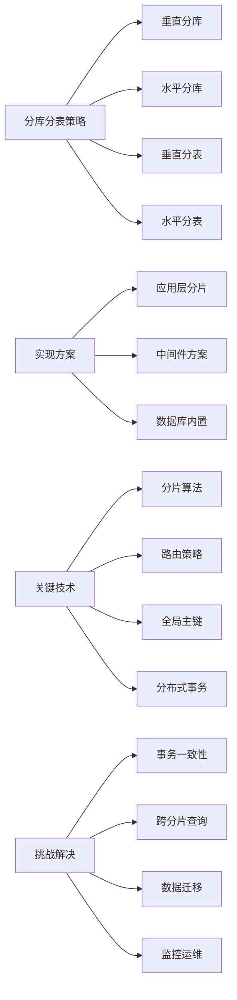

# 分库分表的策略有哪些？如何实现？

## 概要回答

分库分表是应对海量数据和高并发访问的数据库水平扩展方案。主要策略包括垂直分库（按业务模块拆分）、水平分库（按数据范围或哈希拆分）、垂直分表（按字段访问频率拆分）和水平分表（按数据范围或哈希拆分）。实现方式有应用层分片、数据库中间件（如MyCat、ShardingSphere）和数据库内置分片功能等。

## 深度解析

### 分库分表基本概念

#### 1. 分库分表的必要性
```sql
-- 数据量增长带来的问题示例
-- 假设有一个用户订单表，随着业务增长出现的问题：

-- 1. 单表数据量过大
CREATE TABLE orders (
    id BIGINT PRIMARY KEY AUTO_INCREMENT,
    user_id BIGINT,
    product_id BIGINT,
    amount DECIMAL(10,2),
    status TINYINT,
    created_at TIMESTAMP,
    updated_at TIMESTAMP,
    -- 其他字段...
    INDEX idx_user_id (user_id),
    INDEX idx_created_at (created_at)
);

-- 当数据量达到千万级甚至亿级时：
-- - 查询性能急剧下降
-- - 索引维护成本高
-- - 备份恢复时间长
-- - 锁竞争严重

-- 2. 高并发访问压力
-- 假设每秒有10万次订单查询请求
-- 单台数据库服务器难以承受

-- 3. 存储容量限制
-- 单台服务器磁盘空间有限
-- 单表大小受文件系统限制
```

#### 2. 分库分表的基本概念
```sql
-- 垂直分库示例
-- 按业务模块拆分到不同数据库

-- 用户数据库 (user_db)
CREATE DATABASE user_db;
USE user_db;

CREATE TABLE users (
    id BIGINT PRIMARY KEY AUTO_INCREMENT,
    username VARCHAR(50),
    email VARCHAR(100),
    password VARCHAR(255),
    created_at TIMESTAMP
);

CREATE TABLE user_profiles (
    user_id BIGINT PRIMARY KEY,
    nickname VARCHAR(50),
    avatar VARCHAR(255),
    bio TEXT
);

-- 订单数据库 (order_db)
CREATE DATABASE order_db;
USE order_db;

CREATE TABLE orders (
    id BIGINT PRIMARY KEY AUTO_INCREMENT,
    user_id BIGINT,
    product_id BIGINT,
    amount DECIMAL(10,2),
    status TINYINT,
    created_at TIMESTAMP
);

CREATE TABLE order_items (
    id BIGINT PRIMARY KEY AUTO_INCREMENT,
    order_id BIGINT,
    product_id BIGINT,
    quantity INT,
    price DECIMAL(10,2)
);

-- 商品数据库 (product_db)
CREATE DATABASE product_db;
USE product_db;

CREATE TABLE products (
    id BIGINT PRIMARY KEY AUTO_INCREMENT,
    name VARCHAR(200),
    price DECIMAL(10,2),
    category_id INT,
    stock INT
);

CREATE TABLE categories (
    id INT PRIMARY KEY AUTO_INCREMENT,
    name VARCHAR(100)
);
```

### 分库分表策略详解

#### 1. 垂直分库策略
```java
// 垂直分库实现示例 (Java + MyBatis)
@Mapper
public interface UserMapper {
    @Select("SELECT * FROM users WHERE id = #{id}")
    User getUserById(Long id);
    
    @Insert("INSERT INTO users(username, email, password) VALUES(#{username}, #{email}, #{password})")
    void insertUser(User user);
}

@Mapper
public interface OrderMapper {
    @Select("SELECT * FROM orders WHERE user_id = #{userId}")
    List<Order> getOrdersByUserId(Long userId);
    
    @Insert("INSERT INTO orders(user_id, product_id, amount) VALUES(#{userId}, #{productId}, #{amount})")
    void insertOrder(Order order);
}

// 数据源配置
@Configuration
public class DataSourceConfig {
    
    @Bean("userDataSource")
    @ConfigurationProperties(prefix = "spring.datasource.user")
    public DataSource userDataSource() {
        return DataSourceBuilder.create().build();
    }
    
    @Bean("orderDataSource")
    @ConfigurationProperties(prefix = "spring.datasource.order")
    public DataSource orderDataSource() {
        return DataSourceBuilder.create().build();
    }
    
    // 动态数据源路由
    @Bean
    @Primary
    public DataSource dynamicDataSource() {
        DynamicDataSource dynamicDataSource = new DynamicDataSource();
        Map<Object, Object> dataSourceMap = new HashMap<>();
        dataSourceMap.put("user", userDataSource());
        dataSourceMap.put("order", orderDataSource());
        dynamicDataSource.setTargetDataSources(dataSourceMap);
        dynamicDataSource.setDefaultTargetDataSource(userDataSource());
        return dynamicDataSource;
    }
}

// 动态数据源实现
public class DynamicDataSource extends AbstractRoutingDataSource {
    @Override
    protected Object determineCurrentLookupKey() {
        return DataSourceContextHolder.getDataSourceType();
    }
}

// 数据源上下文持有者
public class DataSourceContextHolder {
    private static final ThreadLocal<String> CONTEXT_HOLDER = new ThreadLocal<>();
    
    public static void setDataSourceType(String dataSourceType) {
        CONTEXT_HOLDER.set(dataSourceType);
    }
    
    public static String getDataSourceType() {
        return CONTEXT_HOLDER.get();
    }
    
    public static void clearDataSourceType() {
        CONTEXT_HOLDER.remove();
    }
}

// 服务层使用示例
@Service
public class UserService {
    
    @Autowired
    private UserMapper userMapper;
    
    public User getUser(Long userId) {
        DataSourceContextHolder.setDataSourceType("user");
        try {
            return userMapper.getUserById(userId);
        } finally {
            DataSourceContextHolder.clearDataSourceType();
        }
    }
}

@Service
public class OrderService {
    
    @Autowired
    private OrderMapper orderMapper;
    
    public List<Order> getUserOrders(Long userId) {
        DataSourceContextHolder.setDataSourceType("order");
        try {
            return orderMapper.getOrdersByUserId(userId);
        } finally {
            DataSourceContextHolder.clearDataSourceType();
        }
    }
}
```

#### 2. 水平分库策略
```java
// 水平分库实现示例
public class HorizontalShardingStrategy {
    
    // 基于用户ID的哈希分库
    public String determineDatabase(Long userId) {
        // 假设有4个数据库实例
        int dbIndex = (int) (userId % 4);
        return "order_db_" + dbIndex;
    }
    
    // 基于时间范围的分库
    public String determineDatabaseByTime(Date createTime) {
        Calendar cal = Calendar.getInstance();
        cal.setTime(createTime);
        int year = cal.get(Calendar.YEAR);
        int month = cal.get(Calendar.MONTH) + 1;
        
        // 按年月分库
        return String.format("order_db_%d_%02d", year, month);
    }
    
    // 基于地理位置的分库
    public String determineDatabaseByRegion(String region) {
        switch (region) {
            case "north":
                return "order_db_north";
            case "south":
                return "order_db_south";
            case "east":
                return "order_db_east";
            case "west":
                return "order_db_west";
            default:
                return "order_db_default";
        }
    }
}

// 分库数据源配置
@Configuration
public class HorizontalDataSourceConfig {
    
    @Bean
    @Primary
    public DataSource shardingDataSource() throws SQLException {
        // 使用ShardingSphere-JDBC
        ShardingRuleConfiguration shardingRuleConfig = new ShardingRuleConfiguration();
        
        // 配置分库策略
        shardingRuleConfig.getTableRuleConfigs().add(getOrderTableRuleConfiguration());
        
        Properties props = new Properties();
        props.setProperty("sql.show", "true");
        
        return ShardingDataSourceFactory.createDataSource(
            createDataSourceMap(), 
            shardingRuleConfig, 
            props
        );
    }
    
    private TableRuleConfiguration getOrderTableRuleConfiguration() {
        TableRuleConfiguration result = new TableRuleConfiguration("orders", "ds_${0..3}.orders");
        
        // 配置分库策略
        result.setDatabaseShardingStrategyConfig(
            new InlineShardingStrategyConfiguration("user_id", "ds_${user_id % 4}")
        );
        
        // 配置分表策略
        result.setTableShardingStrategyConfig(
            new InlineShardingStrategyConfiguration("create_time", "orders_${create_time..yyyyMM}")
        );
        
        return result;
    }
    
    private Map<String, DataSource> createDataSourceMap() {
        Map<String, DataSource> dataSourceMap = new HashMap<>();
        
        // 创建4个数据库实例
        for (int i = 0; i < 4; i++) {
            HikariDataSource dataSource = new HikariDataSource();
            dataSource.setJdbcUrl("jdbc:mysql://localhost:3306/order_db_" + i);
            dataSource.setUsername("username");
            dataSource.setPassword("password");
            dataSourceMap.put("ds_" + i, dataSource);
        }
        
        return dataSourceMap;
    }
}
```

#### 3. 垂直分表策略
```sql
-- 垂直分表示例
-- 将访问频率不同的字段拆分到不同表中

-- 原始大表
CREATE TABLE user_profiles (
    id BIGINT PRIMARY KEY,
    username VARCHAR(50),
    email VARCHAR(100),
    password VARCHAR(255),
    nickname VARCHAR(50),
    avatar VARCHAR(255),
    bio TEXT,
    created_at TIMESTAMP,
    updated_at TIMESTAMP,
    last_login TIMESTAMP,
    login_count INT,
    settings JSON,           -- 用户设置，访问频率低
    extra_data LONGTEXT      -- 扩展数据，访问频率极低
);

-- 拆分后的表结构

-- 高频访问表
CREATE TABLE user_basic (
    id BIGINT PRIMARY KEY,
    username VARCHAR(50),
    email VARCHAR(100),
    password VARCHAR(255),
    nickname VARCHAR(50),
    avatar VARCHAR(255),
    created_at TIMESTAMP,
    updated_at TIMESTAMP,
    last_login TIMESTAMP,
    login_count INT
);

-- 低频访问表
CREATE TABLE user_extended (
    id BIGINT PRIMARY KEY,
    bio TEXT,
    settings JSON,
    extra_data LONGTEXT,
    FOREIGN KEY (id) REFERENCES user_basic(id)
);

-- 查询示例
-- 高频查询只需访问user_basic表
SELECT username, email, nickname, avatar 
FROM user_basic 
WHERE id = 12345;

-- 详细信息查询需要JOIN两张表
SELECT ub.*, ue.bio, ue.settings
FROM user_basic ub
LEFT JOIN user_extended ue ON ub.id = ue.id
WHERE ub.id = 12345;
```

#### 4. 水平分表策略
```java
// 水平分表实现示例
public class HorizontalTableSharding {
    
    // 基于用户ID的哈希分表
    public String determineTableName(Long userId) {
        // 假设每个库中有16张表
        int tableIndex = (int) (userId % 16);
        return String.format("orders_%02d", tableIndex);
    }
    
    // 基于时间的分表
    public String determineTableNameByTime(Date createTime) {
        SimpleDateFormat sdf = new SimpleDateFormat("yyyyMM");
        return "orders_" + sdf.format(createTime);
    }
    
    // 基于订单ID范围的分表
    public String determineTableNameByIdRange(Long orderId) {
        // 每张表存储100万条记录
        int tableIndex = (int) (orderId / 1000000);
        return "orders_" + tableIndex;
    }
}

// 使用ShardingSphere配置水平分表
@Configuration
public class TableShardingConfig {
    
    @Bean
    public DataSource shardingDataSource() throws SQLException {
        ShardingRuleConfiguration shardingRuleConfig = new ShardingRuleConfiguration();
        
        // 订单表分表配置
        TableRuleConfiguration orderTableRule = new TableRuleConfiguration(
            "orders", 
            "ds0.orders_${0..15}"
        );
        
        // 按用户ID哈希分表
        orderTableRule.setTableShardingStrategyConfig(
            new StandardShardingStrategyConfiguration(
                "user_id", 
                new PreciseShardingAlgorithm<Long>() {
                    @Override
                    public String doSharding(Collection<String> availableTargetNames, 
                                           PreciseShardingValue<Long> shardingValue) {
                        Long userId = shardingValue.getValue();
                        int tableIndex = (int) (userId % 16);
                        return "orders_" + String.format("%02d", tableIndex);
                    }
                }
            )
        );
        
        shardingRuleConfig.getTableRuleConfigs().add(orderTableRule);
        
        return ShardingDataSourceFactory.createDataSource(
            createDataSourceMap(),
            shardingRuleConfig,
            new Properties()
        );
    }
    
    // 创建分表
    public void createShardingTables() {
        for (int i = 0; i < 16; i++) {
            String tableName = String.format("orders_%02d", i);
            String sql = "CREATE TABLE " + tableName + " (" +
                "id BIGINT PRIMARY KEY AUTO_INCREMENT," +
                "user_id BIGINT," +
                "product_id BIGINT," +
                "amount DECIMAL(10,2)," +
                "status TINYINT," +
                "created_at TIMESTAMP," +
                "INDEX idx_user_id (user_id)," +
                "INDEX idx_created_at (created_at)" +
                ")";
            
            // 执行SQL创建表
            jdbcTemplate.execute(sql);
        }
    }
}
```

### 分库分表实现方案

#### 1. 应用层分片
```java
// 应用层分片实现
@Service
public class ShardingOrderService {
    
    @Autowired
    private Map<String, SqlSessionFactory> sqlSessionFactories;
    
    // 插入订单
    public void insertOrder(Order order) {
        String dbName = determineDatabase(order.getUserId());
        String tableName = determineTable(order.getCreateTime());
        
        SqlSession session = sqlSessionFactories.get(dbName).openSession();
        try {
            OrderMapper mapper = session.getMapper(OrderMapper.class);
            mapper.insertOrder(order, tableName);
            session.commit();
        } finally {
            session.close();
        }
    }
    
    // 查询订单
    public List<Order> queryOrders(QueryCondition condition) {
        List<Order> result = new ArrayList<>();
        
        // 如果查询条件包含用户ID，直接定位到对应库表
        if (condition.getUserId() != null) {
            String dbName = determineDatabase(condition.getUserId());
            String tableName = determineTable(condition.getStartTime());
            
            SqlSession session = sqlSessionFactories.get(dbName).openSession();
            try {
                OrderMapper mapper = session.getMapper(OrderMapper.class);
                result.addAll(mapper.queryOrders(condition, tableName));
            } finally {
                session.close();
            }
        } else {
            // 全局查询需要广播到所有分片
            for (String dbName : sqlSessionFactories.keySet()) {
                SqlSession session = sqlSessionFactories.get(dbName).openSession();
                try {
                    OrderMapper mapper = session.getMapper(OrderMapper.class);
                    result.addAll(mapper.queryOrders(condition, null));
                } finally {
                    session.close();
                }
            }
        }
        
        return result;
    }
    
    private String determineDatabase(Long userId) {
        int dbIndex = (int) (userId % 4);
        return "order_db_" + dbIndex;
    }
    
    private String determineTable(Date createTime) {
        SimpleDateFormat sdf = new SimpleDateFormat("yyyyMM");
        return "orders_" + sdf.format(createTime);
    }
}

// Mapper接口支持动态表名
@Mapper
public interface OrderMapper {
    @Insert("INSERT INTO ${tableName}(user_id, product_id, amount, created_at) " +
            "VALUES(#{order.userId}, #{order.productId}, #{order.amount}, #{order.createdAt})")
    void insertOrder(@Param("order") Order order, @Param("tableName") String tableName);
    
    @Select("<script>" +
            "SELECT * FROM ${tableName} " +
            "<where>" +
            "<if test='condition.userId != null'>user_id = #{condition.userId}</if>" +
            "<if test='condition.startTime != null'>AND created_at >= #{condition.startTime}</if>" +
            "<if test='condition.endTime != null'>AND created_at <= #{condition.endTime}</if>" +
            "</where>" +
            "</script>")
    List<Order> queryOrders(@Param("condition") QueryCondition condition, 
                           @Param("tableName") String tableName);
}
```

#### 2. 数据库中间件方案
```yaml
# ShardingSphere配置示例
spring:
  shardingsphere:
    datasource:
      names: ds0,ds1,ds2,ds3
      
      ds0:
        type: com.zaxxer.hikari.HikariDataSource
        driver-class-name: com.mysql.cj.jdbc.Driver
        jdbc-url: jdbc:mysql://localhost:3306/order_db_0
        username: root
        password: password
        
      ds1:
        type: com.zaxxer.hikari.HikariDataSource
        driver-class-name: com.mysql.cj.jdbc.Driver
        jdbc-url: jdbc:mysql://localhost:3306/order_db_1
        username: root
        password: password
        
      ds2:
        type: com.zaxxer.hikari.HikariDataSource
        driver-class-name: com.mysql.cj.jdbc.Driver
        jdbc-url: jdbc:mysql://localhost:3306/order_db_2
        username: root
        password: password
        
      ds3:
        type: com.zaxxer.hikari.HikariDataSource
        driver-class-name: com.mysql.cj.jdbc.Driver
        jdbc-url: jdbc:mysql://localhost:3306/order_db_3
        username: root
        password: password
    
    sharding:
      tables:
        orders:
          actual-data-nodes: ds${0..3}.orders_${0..15}
          table-strategy:
            standard:
              sharding-column: user_id
              sharding-algorithm-name: order-inline
          database-strategy:
            standard:
              sharding-column: user_id
              sharding-algorithm-name: database-inline
              
      sharding-algorithms:
        order-inline:
          type: INLINE
          props:
            algorithm-expression: orders_${user_id % 16}
        database-inline:
          type: INLINE
          props:
            algorithm-expression: ds${user_id % 4}
    
    props:
      sql-show: true
```

#### 3. 数据库内置分片
```sql
-- MySQL 8.0+ 原生分片支持示例
-- 创建分片数据库
CREATE DATABASE order_shard_0;
CREATE DATABASE order_shard_1;
CREATE DATABASE order_shard_2;
CREATE DATABASE order_shard_3;

-- 在每个分片中创建表
USE order_shard_0;
CREATE TABLE orders (
    id BIGINT PRIMARY KEY,
    user_id BIGINT,
    product_id BIGINT,
    amount DECIMAL(10,2),
    status TINYINT,
    created_at TIMESTAMP,
    INDEX idx_user_id (user_id),
    INDEX idx_created_at (created_at)
);

-- MySQL Router配置示例
/*
[routing:orders]
bind_address = 0.0.0.0
bind_port = 7001
destinations = localhost:3306,localhost:3307,localhost:3308,localhost:3309
routing_strategy = sharding
table = orders
column = user_id
method = hash
*/
```

### 分库分表挑战与解决方案

#### 1. 事务一致性问题
```java
// 分布式事务解决方案
@Service
public class DistributedTransactionService {
    
    // 使用Seata解决分布式事务
    @GlobalTransactional
    public void createOrder(Order order, List<OrderItem> items) {
        try {
            // 1. 创建订单（可能在分片A）
            orderService.createOrder(order);
            
            // 2. 扣减库存（可能在分片B）
            inventoryService.decreaseStock(items);
            
            // 3. 更新用户积分（可能在分片C）
            userService.updatePoints(order.getUserId(), order.getAmount());
            
            // 所有操作成功，自动提交全局事务
        } catch (Exception e) {
            // 发生异常，自动回滚所有分片操作
            throw e;
        }
    }
    
    // 使用消息队列实现最终一致性
    public void createOrderWithMQ(Order order, List<OrderItem> items) {
        // 1. 创建订单
        orderService.createOrder(order);
        
        // 2. 发送扣减库存消息
        Message stockMessage = new Message("stock-decrease", items);
        mqProducer.send(stockMessage);
        
        // 3. 发送更新积分消息
        Message pointMessage = new Message("point-update", 
            new PointUpdateDTO(order.getUserId(), order.getAmount()));
        mqProducer.send(pointMessage);
    }
}

// 消息消费者实现最终一致性
@Component
public class StockConsumer {
    
    @RabbitListener(queues = "stock-decrease")
    public void handleStockDecrease(List<OrderItem> items) {
        try {
            inventoryService.decreaseStock(items);
        } catch (Exception e) {
            // 失败时发送补偿消息
            mqProducer.send(new Message("stock-compensate", items));
        }
    }
}
```

#### 2. 跨分片查询优化
```java
// 跨分片查询优化方案
@Service
public class CrossShardQueryService {
    
    // 并行查询优化
    public List<Order> queryOrdersParallel(QueryCondition condition) {
        List<CompletableFuture<List<Order>>> futures = new ArrayList<>();
        
        // 并行查询所有分片
        for (String dbName : getAllDatabaseNames()) {
            CompletableFuture<List<Order>> future = CompletableFuture.supplyAsync(() -> {
                return orderService.queryOrdersFromDB(dbName, condition);
            });
            futures.add(future);
        }
        
        // 等待所有查询完成并合并结果
        CompletableFuture<Void> allFutures = CompletableFuture.allOf(
            futures.toArray(new CompletableFuture[0])
        );
        
        try {
            allFutures.join();
            
            List<Order> result = new ArrayList<>();
            for (CompletableFuture<List<Order>> future : futures) {
                result.addAll(future.get());
            }
            
            // 排序和分页处理
            return sortAndPaginate(result, condition);
        } catch (Exception e) {
            throw new RuntimeException("Cross-shard query failed", e);
        }
    }
    
    // 索引表优化跨分片查询
    @Service
    public class IndexTableService {
        
        // 维护全局索引表
        public void createOrder(Order order) {
            // 1. 在分片中创建订单
            orderService.createOrder(order);
            
            // 2. 在索引表中记录订单位置
            OrderIndex index = new OrderIndex();
            index.setOrderId(order.getId());
            index.setUserId(order.getUserId());
            index.setDatabaseName(determineDatabase(order.getUserId()));
            index.setTableName(determineTable(order.getCreateTime()));
            index.setCreateTime(order.getCreateTime());
            
            orderIndexService.save(index);
        }
        
        // 通过索引表快速定位
        public Order getOrder(Long orderId) {
            OrderIndex index = orderIndexService.findByOrderId(orderId);
            if (index == null) {
                return null;
            }
            
            return orderService.getOrderFromShard(
                index.getDatabaseName(), 
                index.getTableName(), 
                orderId
            );
        }
    }
}
```

#### 3. 数据迁移方案
```java
// 数据迁移工具实现
@Component
public class DataMigrationService {
    
    // 在线迁移方案
    public void migrateOldData(Date cutoffDate) {
        // 1. 停止写入新数据到旧表
        migrationStatus.setWriteToOld(false);
        
        // 2. 将旧数据迁移到新分片
        migrateHistoricalData(cutoffDate);
        
        // 3. 双写一段时间确保数据一致性
        migrationStatus.setDualWrite(true);
        Thread.sleep(Duration.ofDays(7).toMillis()); // 双写一周
        
        // 4. 停止双写，完全切换到新分片
        migrationStatus.setDualWrite(false);
        migrationStatus.setWriteToOld(true);
        
        // 5. 清理旧数据
        cleanupOldData();
    }
    
    private void migrateHistoricalData(Date cutoffDate) {
        int batchSize = 1000;
        long lastId = 0;
        
        while (true) {
            List<Order> orders = orderService.getOrdersBefore(
                cutoffDate, lastId, batchSize
            );
            
            if (orders.isEmpty()) {
                break;
            }
            
            // 批量插入到新分片
            for (Order order : orders) {
                shardedOrderService.insertOrder(order);
            }
            
            lastId = orders.get(orders.size() - 1).getId();
        }
    }
}
```

## 图示说明



分库分表是应对海量数据和高并发访问的有效手段，但同时也带来了复杂性。在实施过程中需要综合考虑业务特点、数据分布、查询模式等因素，选择合适的分片策略和实现方案。