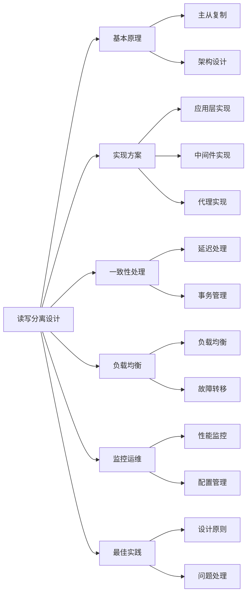

# 如何设计数据库的读写分离？

## 概要回答

数据库读写分离是通过将读操作和写操作分发到不同的数据库实例来提升系统性能和可用性的架构设计。主要实现方式包括主从复制、读写路由、负载均衡和故障转移。设计时需要考虑数据一致性、延迟处理、事务管理、连接池配置和监控告警等方面，以确保系统既能提升性能又能保证数据正确性。

## 深度解析

### 读写分离基本原理

#### 1. 主从复制机制
```sql
-- MySQL主从复制配置示例

-- 主库配置 (my.cnf)
[mysqld]
# 服务器唯一标识
server-id = 1

# 启用二进制日志
log-bin = mysql-bin

# 二进制日志格式
binlog-format = ROW

# 同步二进制日志到磁盘
sync_binlog = 1

# 二进制日志过期时间
expire_logs_days = 7

# 需要同步的数据库
binlog-do-db = myapp

-- 从库配置 (my.cnf)
[mysqld]
# 服务器唯一标识
server-id = 2

# 启用中继日志
relay-log = relay-bin

# 只读模式
read_only = 1

# 连接主库配置
change master to
master_host='master_host_ip',
master_user='repl_user',
master_password='repl_password',
master_log_file='mysql-bin.000001',
master_log_pos=107;

-- 创建复制用户
-- 在主库上执行
CREATE USER 'repl_user'@'%' IDENTIFIED BY 'repl_password';
GRANT REPLICATION SLAVE ON *.* TO 'repl_user'@'%';
FLUSH PRIVILEGES;

-- 启动从库复制
START SLAVE;

-- 检查复制状态
SHOW SLAVE STATUS\G;
```

#### 2. 读写分离架构
```java
// 读写分离架构示例
public class ReadWriteSplittingArchitecture {
    
    // 数据源配置
    @Configuration
    public class DataSourceConfig {
        
        @Bean("masterDataSource")
        @ConfigurationProperties(prefix = "spring.datasource.master")
        public DataSource masterDataSource() {
            HikariDataSource dataSource = new HikariDataSource();
            dataSource.setJdbcUrl("jdbc:mysql://master-host:3306/myapp");
            dataSource.setUsername("username");
            dataSource.setPassword("password");
            return dataSource;
        }
        
        @Bean("slaveDataSource")
        @ConfigurationProperties(prefix = "spring.datasource.slave")
        public DataSource slaveDataSource() {
            HikariDataSource dataSource = new HikariDataSource();
            dataSource.setJdbcUrl("jdbc:mysql://slave-host:3306/myapp");
            dataSource.setUsername("username");
            dataSource.setPassword("password");
            return dataSource;
        }
        
        @Bean
        @Primary
        public DataSource routingDataSource() {
            DynamicDataSource routingDataSource = new DynamicDataSource();
            
            Map<Object, Object> dataSourceMap = new HashMap<>();
            dataSourceMap.put("master", masterDataSource());
            dataSourceMap.put("slave", slaveDataSource());
            
            routingDataSource.setTargetDataSources(dataSourceMap);
            routingDataSource.setDefaultTargetDataSource(masterDataSource());
            
            return routingDataSource;
        }
    }
    
    // 动态数据源路由
    public class DynamicDataSource extends AbstractRoutingDataSource {
        
        @Override
        protected Object determineCurrentLookupKey() {
            return DataSourceContextHolder.getDataSourceType();
        }
    }
    
    // 数据源上下文
    public class DataSourceContextHolder {
        private static final ThreadLocal<String> CONTEXT_HOLDER = new ThreadLocal<>();
        
        public static void setDataSourceType(String dataSourceType) {
            CONTEXT_HOLDER.set(dataSourceType);
        }
        
        public static String getDataSourceType() {
            return CONTEXT_HOLDER.get();
        }
        
        public static void clearDataSourceType() {
            CONTEXT_HOLDER.remove();
        }
    }
}
```

### 读写分离实现方案

#### 1. 应用层实现
```java
// 应用层读写分离实现
@Aspect
@Component
public class ReadWriteSplittingAspect {
    
    // 拦截写操作
    @Before("@annotation(com.example.annotation.WriteOnly)")
    public void setWriteDataSourceType() {
        DataSourceContextHolder.setDataSourceType("master");
    }
    
    // 拦截读操作
    @Before("@annotation(com.example.annotation.ReadOnly)")
    public void setReadDataSourceType() {
        DataSourceContextHolder.setDataSourceType("slave");
    }
    
    // 方法执行后清除数据源设置
    @After("@annotation(com.example.annotation.WriteOnly) || @annotation(com.example.annotation.ReadOnly)")
    public void clearDataSourceType() {
        DataSourceContextHolder.clearDataSourceType();
    }
}

// 自定义注解
@Target({ElementType.METHOD})
@Retention(RetentionPolicy.RUNTIME)
public @interface ReadOnly {
}

@Target({ElementType.METHOD})
@Retention(RetentionPolicy.RUNTIME)
public @interface WriteOnly {
}

// 服务层使用示例
@Service
public class UserService {
    
    @ReadOnly
    public User getUserById(Long id) {
        // 自动路由到从库
        return userMapper.selectById(id);
    }
    
    @WriteOnly
    public void updateUser(User user) {
        // 自动路由到主库
        userMapper.updateById(user);
    }
    
    @WriteOnly
    @Transactional
    public void createUserAndSendEmail(User user) {
        // 事务内的所有操作都在主库执行
        userMapper.insert(user);
        emailService.sendWelcomeEmail(user.getEmail());
    }
}

// Mapper接口
@Mapper
public interface UserMapper {
    
    @Select("SELECT * FROM users WHERE id = #{id}")
    User selectById(Long id);
    
    @Update("UPDATE users SET name = #{name}, email = #{email} WHERE id = #{id}")
    void updateById(User user);
    
    @Insert("INSERT INTO users(name, email) VALUES(#{name}, #{email})")
    void insert(User user);
}
```

#### 2. 中间件实现
```yaml
# 使用ShardingSphere实现读写分离
spring:
  shardingsphere:
    datasource:
      names: master,slave0,slave1
      
      master:
        type: com.zaxxer.hikari.HikariDataSource
        driver-class-name: com.mysql.cj.jdbc.Driver
        jdbc-url: jdbc:mysql://master-host:3306/myapp
        username: root
        password: password
        
      slave0:
        type: com.zaxxer.hikari.HikariDataSource
        driver-class-name: com.mysql.cj.jdbc.Driver
        jdbc-url: jdbc:mysql://slave0-host:3306/myapp
        username: root
        password: password
        
      slave1:
        type: com.zaxxer.hikari.HikariDataSource
        driver-class-name: com.mysql.cj.jdbc.Driver
        jdbc-url: jdbc:mysql://slave1-host:3306/myapp
        username: root
        password: password
    
    masterslave:
      name: ms
      master-data-source-name: master
      slave-data-source-names: slave0,slave1
      
      # 负载均衡算法
      load-balance-algorithm-type: round_robin
      
    props:
      sql:
        show: true

# MyBatis配置
mybatis:
  mapper-locations: classpath:mapper/*.xml
  type-aliases-package: com.example.entity
```

#### 3. 数据库代理实现
```java
// 使用MySQL Router实现读写分离
/*
[ routing:readwrite ]
bind_address = 0.0.0.0
bind_port = 7001
destinations = master-host:3306,slave0-host:3306,slave1-host:3306
routing_strategy = read-write-splitting
```

### 数据一致性处理

#### 1. 延迟处理机制
```java
// 处理主从延迟的策略
@Service
public class DelayHandlingService {
    
    // 强一致性读取
    public User getUserWithStrongConsistency(Long id) {
        // 强制从主库读取
        DataSourceContextHolder.setDataSourceType("master");
        try {
            return userMapper.selectById(id);
        } finally {
            DataSourceContextHolder.clearDataSourceType();
        }
    }
    
    // 最终一致性读取
    public User getUserWithEventualConsistency(Long id) {
        User user = null;
        int retryCount = 0;
        int maxRetries = 3;
        
        while (retryCount < maxRetries) {
            try {
                DataSourceContextHolder.setDataSourceType("slave");
                user = userMapper.selectById(id);
                
                // 验证数据一致性
                if (isDataConsistent(user)) {
                    break;
                }
                
                // 数据不一致，等待后重试
                Thread.sleep(100);
                retryCount++;
            } catch (Exception e) {
                retryCount++;
                if (retryCount >= maxRetries) {
                    throw new RuntimeException("Failed to get consistent data", e);
                }
            } finally {
                DataSourceContextHolder.clearDataSourceType();
            }
        }
        
        return user;
    }
    
    // 检查数据一致性
    private boolean isDataConsistent(User user) {
        if (user == null) return true;
        
        // 检查数据版本或时间戳
        DataSourceContextHolder.setDataSourceType("master");
        try {
            User masterUser = userMapper.selectById(user.getId());
            return masterUser == null || 
                   masterUser.getVersion() == user.getVersion();
        } finally {
            DataSourceContextHolder.clearDataSourceType();
        }
    }
    
    // 读写操作后的延迟补偿
    @Async
    public void compensateForDelay(Object data) {
        // 异步更新缓存或触发其他补偿机制
        cacheService.updateCache(data);
    }
}
```

#### 2. 事务管理
```java
// 读写分离环境下的事务管理
@Service
@Transactional
public class TransactionalUserService {
    
    // 事务内的所有操作都必须在主库执行
    public void updateUserAndRelatedData(User user, List<Order> orders) {
        // 设置为主库
        DataSourceContextHolder.setDataSourceType("master");
        
        try {
            // 更新用户信息
            userMapper.updateById(user);
            
            // 更新相关订单
            for (Order order : orders) {
                orderMapper.updateById(order);
            }
            
            // 其他相关操作...
            
        } finally {
            DataSourceContextHolder.clearDataSourceType();
        }
    }
    
    // 只读事务优化
    @Transactional(readOnly = true)
    public List<User> getUsersWithOrders() {
        // 只读事务可以从从库读取
        DataSourceContextHolder.setDataSourceType("slave");
        
        try {
            return userMapper.selectAllUsersWithOrders();
        } finally {
            DataSourceContextHolder.clearDataSourceType();
        }
    }
}

// 事务拦截器确保一致性
@Aspect
@Component
public class TransactionConsistencyInterceptor {
    
    @Around("@annotation(org.springframework.transaction.annotation.Transactional)")
    public Object ensureTransactionConsistency(ProceedingJoinPoint joinPoint) throws Throwable {
        // 事务开始前强制使用主库
        DataSourceContextHolder.setDataSourceType("master");
        
        try {
            return joinPoint.proceed();
        } finally {
            DataSourceContextHolder.clearDataSourceType();
        }
    }
}
```

### 负载均衡和故障转移

#### 1. 负载均衡策略
```java
// 读库负载均衡实现
public class LoadBalancingStrategy {
    
    private List<String> slaveDataSources;
    private AtomicInteger counter = new AtomicInteger(0);
    
    public LoadBalancingStrategy(List<String> slaveDataSources) {
        this.slaveDataSources = new ArrayList<>(slaveDataSources);
    }
    
    // 轮询策略
    public String getNextSlave() {
        int index = counter.getAndIncrement() % slaveDataSources.size();
        return slaveDataSources.get(index);
    }
    
    // 随机策略
    public String getRandomSlave() {
        int index = new Random().nextInt(slaveDataSources.size());
        return slaveDataSources.get(index);
    }
    
    // 加权轮询策略
    public String getWeightedSlave(Map<String, Integer> weights) {
        int totalWeight = weights.values().stream().mapToInt(Integer::intValue).sum();
        int random = new Random().nextInt(totalWeight);
        
        int currentWeight = 0;
        for (String slave : slaveDataSources) {
            currentWeight += weights.get(slave);
            if (random < currentWeight) {
                return slave;
            }
        }
        
        return slaveDataSources.get(0);
    }
    
    // 基于响应时间的智能负载均衡
    public String getSmartSlave(Map<String, Long> responseTimes) {
        return responseTimes.entrySet().stream()
                .min(Map.Entry.comparingByValue())
                .map(Map.Entry::getKey)
                .orElse(slaveDataSources.get(0));
    }
}

// 动态负载均衡数据源
public class SmartRoutingDataSource extends AbstractRoutingDataSource {
    
    private LoadBalancingStrategy loadBalancer;
    private SlaveHealthMonitor healthMonitor;
    
    @Override
    protected Object determineCurrentLookupKey() {
        String dataSourceType = DataSourceContextHolder.getDataSourceType();
        
        // 如果是读操作，进行负载均衡
        if ("slave".equals(dataSourceType)) {
            // 获取健康的从库列表
            List<String> healthySlaves = healthMonitor.getHealthySlaves();
            
            if (!healthySlaves.isEmpty()) {
                // 使用负载均衡策略选择从库
                LoadBalancingStrategy strategy = new LoadBalancingStrategy(healthySlaves);
                return strategy.getNextSlave();
            }
        }
        
        // 默认返回主库
        return "master";
    }
}
```

#### 2. 故障转移机制
```java
// 从库健康监控和故障转移
@Component
public class SlaveHealthMonitor {
    
    private Map<String, SlaveStatus> slaveStatuses = new ConcurrentHashMap<>();
    private ScheduledExecutorService scheduler = Executors.newScheduledThreadPool(1);
    
    @PostConstruct
    public void startMonitoring() {
        scheduler.scheduleWithFixedDelay(this::checkSlaveHealth, 0, 30, TimeUnit.SECONDS);
    }
    
    private void checkSlaveHealth() {
        for (String slaveName : getAllSlaveNames()) {
            try {
                boolean isHealthy = checkSlaveConnection(slaveName);
                SlaveStatus status = slaveStatuses.computeIfAbsent(slaveName, 
                    k -> new SlaveStatus());
                
                status.setHealthy(isHealthy);
                status.setLastCheckTime(System.currentTimeMillis());
                
                if (!isHealthy) {
                    log.warn("Slave {} is unhealthy", slaveName);
                }
            } catch (Exception e) {
                log.error("Failed to check slave {} health", slaveName, e);
                slaveStatuses.computeIfAbsent(slaveName, k -> new SlaveStatus())
                            .setHealthy(false);
            }
        }
    }
    
    private boolean checkSlaveConnection(String slaveName) {
        try (Connection conn = getSlaveConnection(slaveName)) {
            try (Statement stmt = conn.createStatement()) {
                ResultSet rs = stmt.executeQuery("SELECT 1");
                return rs.next();
            }
        } catch (SQLException e) {
            return false;
        }
    }
    
    public List<String> getHealthySlaves() {
        return slaveStatuses.entrySet().stream()
                .filter(entry -> entry.getValue().isHealthy())
                .map(Map.Entry::getKey)
                .collect(Collectors.toList());
    }
    
    public boolean isSlaveHealthy(String slaveName) {
        SlaveStatus status = slaveStatuses.get(slaveName);
        return status != null && status.isHealthy();
    }
    
    // 故障转移处理
    public void handleSlaveFailure(String slaveName) {
        log.error("Slave {} failed, initiating failover", slaveName);
        
        // 标记从库为不健康
        SlaveStatus status = slaveStatuses.computeIfAbsent(slaveName, k -> new SlaveStatus());
        status.setHealthy(false);
        
        // 触发告警
        alertService.sendAlert("Slave " + slaveName + " is down");
        
        // 如果所有从库都失效，降级到主库
        if (getHealthySlaves().isEmpty()) {
            log.warn("All slaves are down, degrading to master-only mode");
            alertService.sendCriticalAlert("All slaves are down!");
        }
    }
}

// 从库状态类
class SlaveStatus {
    private volatile boolean healthy = true;
    private volatile long lastCheckTime;
    
    // getters and setters
    public boolean isHealthy() { return healthy; }
    public void setHealthy(boolean healthy) { this.healthy = healthy; }
    public long getLastCheckTime() { return lastCheckTime; }
    public void setLastCheckTime(long lastCheckTime) { this.lastCheckTime = lastCheckTime; }
}
```

### 监控和运维

#### 1. 性能监控
```java
// 读写分离性能监控
@Component
public class ReadWriteSplittingMonitor {
    
    private MeterRegistry meterRegistry;
    private Counter masterQueryCounter;
    private Counter slaveQueryCounter;
    private Timer masterQueryTimer;
    private Timer slaveQueryTimer;
    
    @PostConstruct
    public void initMetrics() {
        masterQueryCounter = Counter.builder("database.queries")
                .tag("type", "master")
                .description("Master database query count")
                .register(meterRegistry);
                
        slaveQueryCounter = Counter.builder("database.queries")
                .tag("type", "slave")
                .description("Slave database query count")
                .register(meterRegistry);
                
        masterQueryTimer = Timer.builder("database.query.duration")
                .tag("type", "master")
                .description("Master database query duration")
                .register(meterRegistry);
                
        slaveQueryTimer = Timer.builder("database.query.duration")
                .tag("type", "slave")
                .description("Slave database query duration")
                .register(meterRegistry);
    }
    
    // 监控切面
    @Aspect
    @Component
    public class MonitoringAspect {
        
        @Around("execution(* com.example.service.*.*(..))")
        public Object monitorDatabaseOperations(ProceedingJoinPoint joinPoint) throws Throwable {
            String dataSourceType = DataSourceContextHolder.getDataSourceType();
            Timer.Sample sample = Timer.start(meterRegistry);
            
            try {
                Object result = joinPoint.proceed();
                
                // 记录查询计数
                if ("master".equals(dataSourceType)) {
                    masterQueryCounter.increment();
                } else if ("slave".equals(dataSourceType)) {
                    slaveQueryCounter.increment();
                }
                
                return result;
            } finally {
                // 记录查询耗时
                if ("master".equals(dataSourceType)) {
                    sample.stop(masterQueryTimer);
                } else if ("slave".equals(dataSourceType)) {
                    sample.stop(slaveQueryTimer);
                }
            }
        }
    }
    
    // 延迟监控
    public void monitorReplicationDelay() {
        ScheduledExecutorService scheduler = Executors.newScheduledThreadPool(1);
        scheduler.scheduleWithFixedDelay(() -> {
            try {
                long delay = calculateReplicationDelay();
                Gauge.builder("database.replication.delay")
                        .description("Database replication delay in seconds")
                        .register(meterRegistry, delay);
                        
                if (delay > 10) { // 超过10秒告警
                    alertService.sendAlert("Replication delay is too high: " + delay + " seconds");
                }
            } catch (Exception e) {
                log.error("Failed to monitor replication delay", e);
            }
        }, 0, 30, TimeUnit.SECONDS);
    }
    
    private long calculateReplicationDelay() {
        // 通过SHOW SLAVE STATUS获取延迟信息
        // 或通过时间戳字段计算延迟
        return 0L;
    }
}
```

#### 2. 配置管理
```yaml
# 读写分离配置管理
spring:
  datasource:
    master:
      url: ${MASTER_DB_URL:jdbc:mysql://localhost:3306/myapp}
      username: ${MASTER_DB_USERNAME:root}
      password: ${MASTER_DB_PASSWORD:password}
      hikari:
        maximum-pool-size: 20
        minimum-idle: 5
        connection-timeout: 30000
        idle-timeout: 600000
        max-lifetime: 1800000
        
    slave:
      urls: ${SLAVE_DB_URLS:jdbc:mysql://slave1:3306/myapp,jdbc:mysql://slave2:3306/myapp}
      username: ${SLAVE_DB_USERNAME:root}
      password: ${SLAVE_DB_PASSWORD:password}
      hikari:
        maximum-pool-size: 30
        minimum-idle: 10
        connection-timeout: 30000
        idle-timeout: 600000
        max-lifetime: 1800000
        
  shardingsphere:
    masterslave:
      load-balance-algorithm-type: ${LOAD_BALANCE_STRATEGY:round_robin}
      
# 环境特定配置
---
spring:
  profiles: dev
  shardingsphere:
    props:
      sql:
        show: true

---
spring:
  profiles: prod
  shardingsphere:
    props:
      sql:
        show: false
```

### 最佳实践和注意事项

#### 1. 设计原则
```java
// 读写分离最佳实践
public class ReadWriteSplittingBestPractices {
    
    // 1. 合理的读写比例设计
    public class ReadWriteRatioManager {
        private static final double WRITE_RATIO_THRESHOLD = 0.3; // 写操作不超过30%
        
        public boolean isReadWriteRatioHealthy(int writeCount, int readCount) {
            if (readCount == 0) return true;
            double ratio = (double) writeCount / (writeCount + readCount);
            return ratio <= WRITE_RATIO_THRESHOLD;
        }
    }
    
    // 2. 缓存配合读写分离
    @Service
    public class CachedUserService {
        
        @ReadOnly
        public User getUserById(Long id) {
            // 先查缓存
            User user = cacheService.get("user:" + id);
            if (user != null) {
                return user;
            }
            
            // 缓存未命中，从数据库查询
            user = userMapper.selectById(id);
            if (user != null) {
                cacheService.set("user:" + id, user, 3600); // 缓存1小时
            }
            
            return user;
        }
        
        @WriteOnly
        public void updateUser(User user) {
            // 更新数据库
            userMapper.updateById(user);
            
            // 删除缓存
            cacheService.delete("user:" + user.getId());
            
            // 异步更新其他相关缓存
            asyncCacheUpdateService.updateRelatedCaches(user);
        }
    }
    
    // 3. 连接池优化
    @Configuration
    public class ConnectionPoolOptimization {
        
        @Bean("masterDataSource")
        public DataSource masterDataSource() {
            HikariConfig config = new HikariConfig();
            config.setJdbcUrl(masterUrl);
            config.setUsername(username);
            config.setPassword(password);
            
            // 主库连接池配置（较小）
            config.setMaximumPoolSize(20);
            config.setMinimumIdle(5);
            config.setConnectionTimeout(30000);
            
            return new HikariDataSource(config);
        }
        
        @Bean("slaveDataSource")
        public DataSource slaveDataSource() {
            HikariConfig config = new HikariConfig();
            config.setJdbcUrl(slaveUrl);
            config.setUsername(username);
            config.setPassword(password);
            
            // 从库连接池配置（较大）
            config.setMaximumPoolSize(50);
            config.setMinimumIdle(10);
            config.setConnectionTimeout(30000);
            
            return new HikariDataSource(config);
        }
    }
}
```

#### 2. 常见问题处理
```java
// 读写分离常见问题解决方案
public class CommonIssuesSolution {
    
    // 问题1：事务中读写混合
    @Service
    @Transactional
    public class MixedReadWriteService {
        
        public User processUser(User user) {
            // 在事务中，所有操作都应该在主库执行
            DataSourceContextHolder.setDataSourceType("master");
            
            try {
                // 写操作
                userMapper.updateById(user);
                
                // 读操作也要从主库读取，保证一致性
                User updatedUser = userMapper.selectById(user.getId());
                
                // 其他业务逻辑...
                
                return updatedUser;
            } finally {
                DataSourceContextHolder.clearDataSourceType();
            }
        }
    }
    
    // 问题2：主从延迟导致的数据不一致
    @Service
    public class ConsistencyHandlingService {
        
        // 对于强一致性要求的读取，强制走主库
        public User getUserWithStrongConsistency(Long userId) {
            DataSourceContextHolder.setDataSourceType("master");
            try {
                return userMapper.selectById(userId);
            } finally {
                DataSourceContextHolder.clearDataSourceType();
            }
        }
        
        // 对于最终一致性可接受的场景，使用补偿机制
        @Async
        public void handleEventualConsistency(User user) {
            // 延迟更新缓存
            CompletableFuture.runAsync(() -> {
                try {
                    Thread.sleep(1000); // 等待主从同步
                    cacheService.updateUserCache(user);
                } catch (InterruptedException e) {
                    Thread.currentThread().interrupt();
                }
            });
        }
    }
    
    // 问题3：连接泄露检测
    @Component
    public class ConnectionLeakDetector {
        
        @Scheduled(fixedRate = 60000) // 每分钟检查一次
        public void detectConnectionLeaks() {
            // 检查连接池使用情况
            HikariPoolMXBean masterPool = ((HikariDataSource) masterDataSource).getHikariPoolMXBean();
            HikariPoolMXBean slavePool = ((HikariDataSource) slaveDataSource).getHikariPoolMXBean();
            
            // 检查活跃连接数是否异常
            if (masterPool.getActiveConnections() > masterPool.getMaximumPoolSize() * 0.9) {
                log.warn("Master connection pool is nearly exhausted: {}/{}", 
                        masterPool.getActiveConnections(), masterPool.getMaximumPoolSize());
            }
            
            if (slavePool.getActiveConnections() > slavePool.getMaximumPoolSize() * 0.9) {
                log.warn("Slave connection pool is nearly exhausted: {}/{}", 
                        slavePool.getActiveConnections(), slavePool.getMaximumPoolSize());
            }
        }
    }
}
```

## 图示说明



通过合理的读写分离设计，可以显著提升数据库的并发处理能力和系统整体性能，但同时也需要仔细处理数据一致性、事务管理和故障转移等问题，确保系统既高效又可靠。