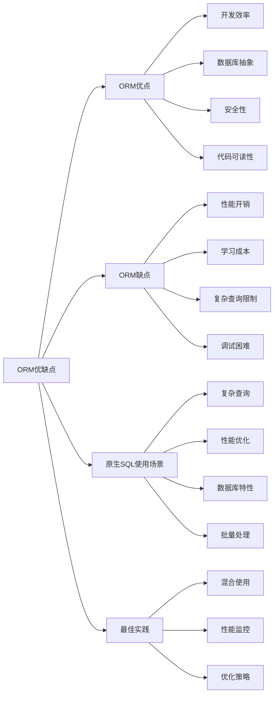

# ORM的优缺点？什么时候应该直接写原生SQL？

## 概要回答

ORM（对象关系映射）的优点包括提高开发效率、增强代码可读性、提供数据库抽象、内置安全防护等；缺点包括性能开销、学习成本、复杂查询限制、调试困难等。应该在需要复杂查询优化、批量数据处理、特定数据库功能或性能敏感场景时直接使用原生SQL。

## 深度解析

### ORM的优点

#### 1. 开发效率提升
```php
<?php
// 使用ORM的简洁代码示例 (Laravel Eloquent)
class UserController extends Controller {
    public function getUserOrders($userId) {
        // ORM方式 - 简洁直观
        $user = User::with('orders.items.product')
                   ->findOrFail($userId);
        
        return response()->json($user);
    }
    
    public function createUserWithProfile(Request $request) {
        // 事务处理简单
        DB::transaction(function () use ($request) {
            $user = User::create($request->only(['name', 'email']));
            $user->profile()->create($request->only(['bio', 'avatar']));
        });
        
        return response()->json(['message' => 'User created successfully']);
    }
}

// 对应的原生SQL方式对比
class UserControllerRaw {
    public function getUserOrders($userId) {
        // 原生SQL方式 - 需要多次查询和手动组装
        $user = DB::select('SELECT * FROM users WHERE id = ?', [$userId]);
        if (!$user) {
            throw new ModelNotFoundException();
        }
        
        $orders = DB::select('SELECT * FROM orders WHERE user_id = ?', [$userId]);
        foreach ($orders as &$order) {
            $order->items = DB::select('SELECT * FROM order_items WHERE order_id = ?', [$order->id]);
            foreach ($order->items as &$item) {
                $item->product = DB::select('SELECT * FROM products WHERE id = ?', [$item->product_id])[0];
            }
        }
        
        $user[0]->orders = $orders;
        return response()->json($user[0]);
    }
}
?>
```

#### 2. 数据库抽象和移植性
```php
<?php
// ORM提供数据库抽象示例
class ProductService {
    // 同一份代码可以在不同数据库上运行
    public function getActiveProducts() {
        // MySQL: SELECT * FROM products WHERE status = 1
        // PostgreSQL: SELECT * FROM products WHERE status = true
        // ORM自动处理差异
        return Product::where('status', 1)->get();
    }
    
    public function getRecentProducts($days = 30) {
        // MySQL: DATE_SUB(NOW(), INTERVAL 30 DAY)
        // PostgreSQL: NOW() - INTERVAL '30 days'
        // ORM自动适配
        return Product::where('created_at', '>=', now()->subDays($days))->get();
    }
    
    // 分页处理
    public function getProductsPaginated($perPage = 15) {
        // MySQL: LIMIT 15 OFFSET 0
        // PostgreSQL: LIMIT 15 OFFSET 0
        // SQL Server: OFFSET 0 ROWS FETCH NEXT 15 ROWS ONLY
        return Product::paginate($perPage);
    }
}

// 数据库配置示例
/*
// config/database.php
'connections' => [
    'mysql' => [
        'driver' => 'mysql',
        'host' => env('DB_HOST', '127.0.0.1'),
        'database' => env('DB_DATABASE', 'forge'),
    ],
    
    'pgsql' => [
        'driver' => 'pgsql',
        'host' => env('DB_HOST', '127.0.0.1'),
        'database' => env('DB_DATABASE', 'forge'),
    ],
],
*/
?>
```

#### 3. 安全性增强
```php
<?php
// ORM内置安全防护示例
class SecureOrderService {
    
    // 1. 自动参数绑定防止SQL注入
    public function getOrderByUser($userId, $status = null) {
        $query = Order::where('user_id', $userId);
        
        if ($status) {
            $query->where('status', $status); // 自动转义
        }
        
        return $query->get();
    }
    
    // 2. 批量赋值保护
    public function createOrder(Request $request) {
        // 只允许指定字段进行批量赋值
        $order = Order::create($request->only(['user_id', 'amount', 'product_id']));
        return $order;
    }
    
    // 3. 软删除保护
    public function deleteOrder($orderId) {
        $order = Order::findOrFail($orderId);
        // 不会真正删除数据，只是标记deleted_at
        $order->delete();
    }
    
    // 4. 查询构造器安全示例
    public function searchOrders($criteria) {
        $query = Order::query();
        
        // 安全的条件构建
        if (isset($criteria['user_id'])) {
            $query->where('user_id', $criteria['user_id']);
        }
        
        if (isset($criteria['date_from'])) {
            $query->where('created_at', '>=', $criteria['date_from']);
        }
        
        if (isset($criteria['date_to'])) {
            $query->where('created_at', '<=', $criteria['date_to']);
        }
        
        return $query->get();
    }
}

// 对比原生SQL的风险
class UnsafeOrderService {
    public function getOrderByUserUnsafe($userId) {
        // 危险！容易受到SQL注入攻击
        $sql = "SELECT * FROM orders WHERE user_id = " . $userId;
        return DB::select($sql);
    }
    
    public function searchOrdersUnsafe($searchTerm) {
        // 危险！SQL注入风险
        $sql = "SELECT * FROM orders WHERE product_name LIKE '%" . $searchTerm . "%'";
        return DB::select($sql);
    }
}
?>
```

### ORM的缺点

#### 1. 性能开销
```php
<?php
// ORM性能开销示例
class PerformanceComparison {
    
    // 1. N+1查询问题
    public function nPlusOneProblem() {
        // 问题代码 - 产生N+1查询
        $users = User::all(); // 1次查询
        foreach ($users as $user) {
            echo $user->profile->bio; // N次查询
        }
        // 总共执行 N+1 次查询
        
        // 优化后 - 2次查询
        $users = User::with('profile')->get(); // 2次查询
        foreach ($users as $user) {
            echo $user->profile->bio;
        }
    }
    
    // 2. 内存占用
    public function memoryUsageComparison() {
        // ORM方式 - 创建对象实例，内存占用大
        $ormUsers = User::all(); // 加载所有用户对象到内存
        
        // 原生SQL方式 - 只加载需要的数据
        $rawUsers = DB::select('SELECT id, name FROM users LIMIT 1000');
        
        echo "ORM memory usage: " . memory_get_usage() . "\n";
        echo "Raw SQL memory usage: " . memory_get_usage() . "\n";
    }
    
    // 3. 查询复杂度
    public function complexQueryOverhead() {
        // 复杂的ORM查询
        $complexQuery = Order::join('users', 'orders.user_id', '=', 'users.id')
                           ->join('products', 'orders.product_id', '=', 'products.id')
                           ->leftJoin('coupons', 'orders.coupon_id', '=', 'coupons.id')
                           ->where('users.status', 'active')
                           ->where('orders.created_at', '>=', now()->subMonth())
                           ->groupBy('users.id')
                           ->havingRaw('COUNT(orders.id) > ?', [5])
                           ->select('users.name', DB::raw('COUNT(orders.id) as order_count'))
                           ->get();
        
        // 对应的原生SQL可能更高效
        $rawSql = "
            SELECT u.name, COUNT(o.id) as order_count
            FROM orders o
            JOIN users u ON o.user_id = u.id
            JOIN products p ON o.product_id = p.id
            LEFT JOIN coupons c ON o.coupon_id = c.id
            WHERE u.status = 'active' 
            AND o.created_at >= DATE_SUB(NOW(), INTERVAL 1 MONTH)
            GROUP BY u.id
            HAVING COUNT(o.id) > 5
        ";
        $rawResult = DB::select($rawSql);
    }
}
?>
```

#### 2. 学习和使用成本
```php
<?php
// ORM学习成本示例
class ORMLearningCurve {
    
    // 1. 复杂查询的学习成本
    public function advancedQueries() {
        // 子查询
        $subQuery = Order::select(DB::raw('MAX(created_at)'))
                        ->whereColumn('user_id', 'users.id');
        
        $users = User::where('created_at', '>', $subQuery)->get();
        
        // 原生SQL可能更直观
        $rawSql = "
            SELECT * FROM users u
            WHERE u.created_at > (
                SELECT MAX(created_at) 
                FROM orders o 
                WHERE o.user_id = u.id
            )
        ";
        
        // 窗口函数
        $windowQuery = User::select('*')
                          ->selectRaw('ROW_NUMBER() OVER (PARTITION BY department ORDER BY salary DESC) as rank')
                          ->get();
        
        // 原生SQL更容易理解
        $rawWindowSql = "
            SELECT *, 
                   ROW_NUMBER() OVER (PARTITION BY department ORDER BY salary DESC) as rank
            FROM users
        ";
    }
    
    // 2. 特定数据库功能的支持
    public function databaseSpecificFeatures() {
        // MySQL的全文搜索
        // ORM可能不直接支持，需要原生SQL
        $fullTextSearch = DB::select("
            SELECT *, MATCH(title, content) AGAINST(? IN NATURAL LANGUAGE MODE) as score
            FROM articles
            WHERE MATCH(title, content) AGAINST(? IN NATURAL LANGUAGE MODE)
            ORDER BY score DESC
        ", [$keyword, $keyword]);
        
        // PostgreSQL的JSON字段查询
        // ORM支持有限，原生SQL更灵活
        $jsonQuery = DB::select("
            SELECT * FROM users
            WHERE metadata->>'country' = 'China'
            AND (metadata->'preferences'->>'notifications')::boolean = true
        ");
    }
}
?>
```

### 何时使用原生SQL

#### 1. 复杂查询优化
```php
<?php
// 复杂查询场景使用原生SQL
class ComplexQueryScenarios {
    
    // 1. 报表查询
    public function generateSalesReport() {
        // 复杂的聚合查询，ORM难以表达
        $report = DB::select("
            SELECT 
                DATE_FORMAT(o.created_at, '%Y-%m') as month,
                COUNT(o.id) as order_count,
                SUM(o.total_amount) as total_sales,
                AVG(o.total_amount) as avg_order_value,
                COUNT(DISTINCT o.user_id) as unique_customers,
                p.category_name,
                u.region
            FROM orders o
            JOIN users u ON o.user_id = u.id
            JOIN products p ON o.product_id = p.id
            WHERE o.created_at >= DATE_SUB(NOW(), INTERVAL 12 MONTH)
            AND o.status = 'completed'
            GROUP BY DATE_FORMAT(o.created_at, '%Y-%m'), p.category_name, u.region
            WITH ROLLUP
            ORDER BY month DESC, total_sales DESC
        ");
        
        return $report;
    }
    
    // 2. 递归查询
    public function getCategoryHierarchy() {
        // MySQL 8.0+ 的CTE递归查询
        $hierarchy = DB::select("
            WITH RECURSIVE category_tree AS (
                SELECT id, name, parent_id, 0 as level
                FROM categories
                WHERE parent_id IS NULL
                
                UNION ALL
                
                SELECT c.id, c.name, c.parent_id, ct.level + 1
                FROM categories c
                JOIN category_tree ct ON c.parent_id = ct.id
            )
            SELECT * FROM category_tree
            ORDER BY level, name
        ");
        
        return $hierarchy;
    }
    
    // 3. 窗口函数
    public function getUserRankings() {
        // 复杂的窗口函数查询
        $rankings = DB::select("
            SELECT 
                u.id,
                u.name,
                u.department,
                u.salary,
                ROW_NUMBER() OVER (PARTITION BY u.department ORDER BY u.salary DESC) as dept_rank,
                RANK() OVER (ORDER BY u.salary DESC) as company_rank,
                PERCENT_RANK() OVER (ORDER BY u.salary) as salary_percentile,
                LAG(u.salary, 1) OVER (PARTITION BY u.department ORDER BY u.salary) as prev_salary,
                LEAD(u.salary, 1) OVER (PARTITION BY u.department ORDER BY u.salary) as next_salary
            FROM users u
            WHERE u.status = 'active'
        ");
        
        return $rankings;
    }
}
?>
```

#### 2. 性能敏感场景
```php
<?php
// 性能敏感场景使用原生SQL
class PerformanceSensitiveScenarios {
    
    // 1. 批量数据处理
    public function bulkUpdateUsers($updates) {
        // ORM批量更新性能较差
        // User::whereIn('id', array_keys($updates))->update([...]); // 不够灵活
        
        // 原生SQL批量更新
        $cases = [];
        $ids = [];
        foreach ($updates as $id => $data) {
            $cases[] = "WHEN {$id} THEN '{$data['status']}'";
            $ids[] = $id;
        }
        
        $sql = "
            UPDATE users 
            SET status = CASE id " . implode(' ', $cases) . " END,
                updated_at = NOW()
            WHERE id IN (" . implode(',', $ids) . ")
        ";
        
        DB::update($sql);
    }
    
    // 2. 大数据量查询
    public function processLargeDataset() {
        // 使用游标处理大数据集，避免内存溢出
        $cursor = DB::select("
            SELECT id, name, email
            FROM users
            WHERE last_login < DATE_SUB(NOW(), INTERVAL 1 YEAR)
            ORDER BY id
        ");
        
        foreach ($cursor as $row) {
            // 处理每一行数据
            $this->processUser($row);
        }
    }
    
    // 3. 复杂的JOIN优化
    public function optimizedJoinQuery() {
        // 手写优化的JOIN查询
        $optimizedQuery = "
            SELECT 
                u.id,
                u.name,
                o.total_amount,
                p.product_name
            FROM users u
            STRAIGHT_JOIN orders o ON u.id = o.user_id  -- 强制JOIN顺序
            STRAIGHT_JOIN products p ON o.product_id = p.id
            USE INDEX (idx_user_orders)  -- 指定使用索引
            WHERE u.status = 'active'
            AND o.created_at >= '2023-01-01'
            AND p.category_id IN (1, 2, 3)
        ";
        
        return DB::select($optimizedQuery);
    }
}
?>
```

#### 3. 数据库特定功能
```php
<?php
// 数据库特定功能使用原生SQL
class DatabaseSpecificScenarios {
    
    // 1. MySQL特定功能
    public function mysqlSpecificFeatures() {
        // 全文搜索
        $fullTextResults = DB::select("
            SELECT *,
                   MATCH(title, content) AGAINST(? IN BOOLEAN MODE) as relevance
            FROM articles
            WHERE MATCH(title, content) AGAINST(? IN BOOLEAN MODE)
            ORDER BY relevance DESC
            LIMIT 20
        ", [$searchTerms, $searchTerms]);
        
        // JSON字段操作
        $jsonQuery = DB::select("
            SELECT id, name,
                   JSON_EXTRACT(metadata, '$.preferences.theme') as theme,
                   JSON_CONTAINS(metadata, '\"notifications\"', '$.enabled_features') as has_notifications
            FROM users
            WHERE JSON_EXTRACT(metadata, '$.account_type') = 'premium'
        ");
        
        // 空间数据查询
        $spatialQuery = DB::select("
            SELECT id, name, location,
                   ST_Distance_Sphere(location, POINT(?, ?)) as distance
            FROM stores
            WHERE ST_Within(location, ST_GeomFromText(?))
            ORDER BY distance
            LIMIT 10
        ", [$userLng, $userLat, $boundaryPolygon]);
    }
    
    // 2. PostgreSQL特定功能
    public function postgresqlSpecificFeatures() {
        // 数组字段查询
        $arrayQuery = DB::select("
            SELECT *
            FROM products
            WHERE tags && ARRAY[?]  -- 数组相交
            AND price_range @> NUMRANGE(?, ?)  -- 范围包含
        ", [$searchTags, $minPrice, $maxPrice]);
        
        // JSONB字段查询
        $jsonbQuery = DB::select("
            SELECT *
            FROM users
            WHERE preferences @> '{"notifications": true}'
            AND data->>'country' IN ('US', 'CA', 'UK')
        ");
        
        // 全文搜索
        $fullTextQuery = DB::select("
            SELECT *, ts_rank(search_vector, plainto_tsquery(?)) as rank
            FROM articles
            WHERE search_vector @@ plainto_tsquery(?)
            ORDER BY rank DESC
        ", [$searchTerm, $searchTerm]);
    }
    
    // 3. 存储过程和函数
    public function storedProcedures() {
        // 调用存储过程
        $result = DB::select("
            CALL calculate_user_statistics(?, @total_orders, @avg_order_value)
        ", [$userId]);
        
        // 获取输出参数
        $output = DB::select("SELECT @total_orders, @avg_order_value");
        
        return $output[0];
    }
}
?>
```

### ORM与原生SQL的最佳实践

#### 1. 混合使用策略
```php
<?php
// ORM与原生SQL混合使用的最佳实践
class HybridApproach {
    
    // 1. 简单CRUD使用ORM
    public function userManagement() {
        // 创建用户
        $user = User::create([
            'name' => 'John Doe',
            'email' => 'john@example.com'
        ]);
        
        // 更新用户
        $user->update(['name' => 'John Smith']);
        
        // 删除用户（软删除）
        $user->delete();
        
        // 查询用户
        $activeUsers = User::where('status', 'active')->get();
    }
    
    // 2. 复杂查询使用原生SQL
    public function analyticsReporting() {
        // 复杂的报表查询使用原生SQL
        $report = DB::select("
            SELECT 
                DATE(created_at) as date,
                COUNT(*) as daily_orders,
                SUM(amount) as daily_revenue,
                AVG(amount) as avg_order_value
            FROM orders
            WHERE created_at >= DATE_SUB(NOW(), INTERVAL 30 DAY)
            AND status = 'completed'
            GROUP BY DATE(created_at)
            ORDER BY date
        ");
        
        return $report;
    }
    
    // 3. 性能关键路径使用原生SQL
    public function highPerformanceOperations() {
        // 批量插入优化
        $batchData = [
            ['name' => 'Product 1', 'price' => 100],
            ['name' => 'Product 2', 'price' => 200],
            // ... 更多数据
        ];
        
        // 使用原生SQL批量插入
        $placeholders = str_repeat('(?,?),', count($batchData) - 1) . '(?,?)';
        $values = [];
        foreach ($batchData as $data) {
            $values[] = $data['name'];
            $values[] = $data['price'];
        }
        
        DB::insert("
            INSERT INTO products (name, price) 
            VALUES {$placeholders}
        ", $values);
    }
    
    // 4. 结果映射到ORM模型
    public function mapRawResultsToModels() {
        // 原生SQL查询结果映射到Eloquent模型
        $rawResults = DB::select("
            SELECT u.*, COUNT(o.id) as order_count
            FROM users u
            LEFT JOIN orders o ON u.id = o.user_id
            GROUP BY u.id
            HAVING COUNT(o.id) > 10
        ");
        
        // 将结果转换为模型集合
        $users = collect($rawResults)->map(function ($item) {
            return new User((array) $item);
        });
        
        return $users;
    }
}
?>
```

#### 2. 性能监控和优化
```php
<?php
// ORM和原生SQL性能监控
class PerformanceMonitoring {
    
    // 查询日志分析
    public function enableQueryLog() {
        // 启用查询日志
        DB::enableQueryLog();
        
        // 执行业务逻辑
        $users = User::with('orders')->get();
        
        // 分析查询
        $queries = DB::getQueryLog();
        foreach ($queries as $query) {
            if ($query['time'] > 100) { // 超过100ms的查询
                Log::warning('Slow query detected', [
                    'sql' => $query['query'],
                    'bindings' => $query['bindings'],
                    'time' => $query['time']
                ]);
            }
        }
    }
    
    // 性能基准测试
    public function benchmarkQueries() {
        // ORM查询性能测试
        $startTime = microtime(true);
        $ormResults = User::where('status', 'active')
                         ->with('profile')
                         ->limit(1000)
                         ->get();
        $ormTime = (microtime(true) - $startTime) * 1000;
        
        // 原生SQL查询性能测试
        $startTime = microtime(true);
        $rawResults = DB::select("
            SELECT u.*, p.bio, p.avatar
            FROM users u
            LEFT JOIN user_profiles p ON u.id = p.user_id
            WHERE u.status = 'active'
            LIMIT 1000
        ");
        $rawTime = (microtime(true) - $startTime) * 1000;
        
        Log::info('Query performance comparison', [
            'orm_time' => $ormTime,
            'raw_sql_time' => $rawTime,
            'improvement' => ($ormTime - $rawTime) / $ormTime * 100
        ]);
    }
    
    // 查询优化建议
    public function queryOptimizationTips() {
        // 1. 使用索引提示
        $indexedQuery = DB::select("
            SELECT * FROM users USE INDEX (idx_status_created)
            WHERE status = 'active'
            ORDER BY created_at DESC
            LIMIT 50
        ");
        
        // 2. 避免SELECT *
        $optimizedQuery = DB::select("
            SELECT id, name, email, created_at  -- 只选择需要的字段
            FROM users
            WHERE status = 'active'
        ");
        
        // 3. 使用EXPLAIN分析查询计划
        $explainResult = DB::select("EXPLAIN SELECT * FROM users WHERE status = 'active'");
        // 根据执行计划优化查询
    }
}
?>
```

## 图示说明



在实际开发中，应该根据具体场景合理选择ORM或原生SQL。一般情况下，简单CRUD操作使用ORM提高开发效率；复杂查询、性能敏感场景或需要使用数据库特定功能时使用原生SQL。关键是找到两者的平衡点，既要保证开发效率，又要确保系统性能。