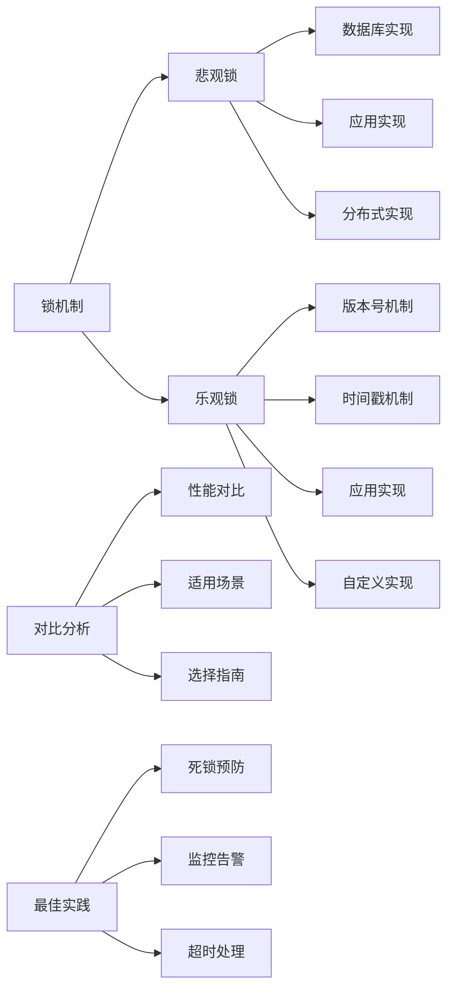

# 解释悲观锁和乐观锁的实现方式？

## 概要回答

悲观锁和乐观锁是处理并发访问的两种不同策略。悲观锁假设冲突会发生，因此在访问数据时立即加锁，阻止其他事务访问；乐观锁假设冲突很少发生，因此不加锁，而是在更新时检查数据是否被修改。悲观锁通过数据库锁机制实现，乐观锁通过版本号或时间戳实现。

## 深度解析

### 悲观锁实现方式

#### 1. 数据库层面的悲观锁
```sql
-- MySQL中的悲观锁实现

-- 1. SELECT ... FOR UPDATE（排他锁）
-- 在事务中锁定选中的行，防止其他事务读取或修改
START TRANSACTION;

-- 锁定特定行
SELECT * FROM products WHERE id = 1 FOR UPDATE;

-- 执行业务逻辑
UPDATE products SET stock = stock - 1 WHERE id = 1;

COMMIT;

-- 2. SELECT ... LOCK IN SHARE MODE（共享锁）
-- 允许其他事务读取但不允许修改
START TRANSACTION;

SELECT * FROM products WHERE id = 1 LOCK IN SHARE MODE;

-- 其他事务可以读取但不能修改这行数据
-- 但不能执行FOR UPDATE

COMMIT;

-- 3. 表级锁
-- 锁定整个表
LOCK TABLES products WRITE;

-- 执行操作
UPDATE products SET price = price * 1.1;

UNLOCK TABLES;
```

#### 2. 应用层面的悲观锁
```java
// Java中的悲观锁实现
@Repository
public class ProductRepository {
    
    @Autowired
    private JdbcTemplate jdbcTemplate;
    
    // 悲观锁实现的商品购买方法
    @Transactional
    public boolean purchaseProduct(Long productId, int quantity) {
        try {
            // 1. 使用SELECT ... FOR UPDATE锁定商品记录
            String selectSql = "SELECT id, name, stock, version FROM products WHERE id = ? FOR UPDATE";
            List<Product> products = jdbcTemplate.query(selectSql, 
                new Object[]{productId}, 
                new ProductRowMapper());
            
            if (products.isEmpty()) {
                throw new ProductNotFoundException("Product not found: " + productId);
            }
            
            Product product = products.get(0);
            
            // 2. 检查库存是否充足
            if (product.getStock() < quantity) {
                return false; // 库存不足
            }
            
            // 3. 更新库存（带版本号检查）
            String updateSql = "UPDATE products SET stock = stock - ?, version = version + 1 " +
                              "WHERE id = ? AND version = ?";
            
            int updatedRows = jdbcTemplate.update(updateSql, 
                quantity, productId, product.getVersion());
            
            // 4. 检查更新是否成功
            if (updatedRows == 0) {
                throw new ConcurrencyException("Product was modified by another transaction");
            }
            
            return true;
        } catch (DataAccessException e) {
            throw new ServiceException("Failed to purchase product", e);
        }
    }
    
    // 带超时的悲观锁实现
    @Transactional
    public boolean purchaseProductWithTimeout(Long productId, int quantity, int timeoutSeconds) {
        try {
            // 设置锁等待超时
            jdbcTemplate.execute("SET innodb_lock_wait_timeout = " + timeoutSeconds);
            
            return purchaseProduct(productId, quantity);
        } finally {
            // 恢复默认超时设置
            jdbcTemplate.execute("SET innodb_lock_wait_timeout = DEFAULT");
        }
    }
}

// Product实体类
public class Product {
    private Long id;
    private String name;
    private int stock;
    private int version; // 版本号，用于乐观锁检查
    
    // getters and setters...
}
```

#### 3. 分布式环境下的悲观锁
```java
// 使用Redis实现分布式悲观锁
@Component
public class DistributedPessimisticLock {
    
    @Autowired
    private RedisTemplate<String, String> redisTemplate;
    
    // 获取分布式锁
    public boolean acquireLock(String lockKey, String lockValue, long expireTime) {
        // 使用SET命令的NX和EX选项原子性地获取锁
        Boolean result = redisTemplate.opsForValue().setIfAbsent(
            lockKey, lockValue, expireTime, TimeUnit.SECONDS);
        
        return result != null && result;
    }
    
    // 释放分布式锁
    public boolean releaseLock(String lockKey, String lockValue) {
        // 使用Lua脚本原子性地释放锁
        String script = "if redis.call('get', KEYS[1]) == ARGV[1] then " +
                       "return redis.call('del', KEYS[1]) " +
                       "else return 0 end";
        
        Long result = (Long) redisTemplate.execute(
            new DefaultRedisScript<>(script, Long.class),
            Collections.singletonList(lockKey),
            lockValue);
        
        return result != null && result > 0;
    }
    
    // 带重试机制的锁获取
    public boolean acquireLockWithRetry(String lockKey, String lockValue, 
                                     long expireTime, int maxRetries, long retryInterval) {
        for (int i = 0; i < maxRetries; i++) {
            if (acquireLock(lockKey, lockValue, expireTime)) {
                return true;
            }
            
            try {
                Thread.sleep(retryInterval);
            } catch (InterruptedException e) {
                Thread.currentThread().interrupt();
                return false;
            }
        }
        
        return false;
    }
}

// 使用分布式悲观锁的服务
@Service
public class OrderService {
    
    @Autowired
    private DistributedPessimisticLock distributedLock;
    
    @Transactional
    public Order createOrder(OrderRequest request) {
        String lockKey = "order:create:" + request.getUserId();
        String lockValue = UUID.randomUUID().toString();
        long lockExpireTime = 30; // 30秒过期
        
        // 获取分布式锁
        if (!distributedLock.acquireLockWithRetry(
                lockKey, lockValue, lockExpireTime, 3, 100)) {
            throw new ServiceException("Failed to acquire lock for order creation");
        }
        
        try {
            // 执行订单创建逻辑
            return doCreateOrder(request);
        } finally {
            // 释放分布式锁
            distributedLock.releaseLock(lockKey, lockValue);
        }
    }
    
    private Order doCreateOrder(OrderRequest request) {
        // 实际的订单创建逻辑
        // 这里可以包含数据库操作
        return orderRepository.save(convertToOrder(request));
    }
}
```

### 乐观锁实现方式

#### 1. 版本号机制
```sql
-- 数据库表结构支持版本号乐观锁
CREATE TABLE products (
    id BIGINT PRIMARY KEY AUTO_INCREMENT,
    name VARCHAR(255) NOT NULL,
    price DECIMAL(10,2) NOT NULL,
    stock INT NOT NULL DEFAULT 0,
    version INT NOT NULL DEFAULT 0, -- 版本号字段
    created_at TIMESTAMP DEFAULT CURRENT_TIMESTAMP,
    updated_at TIMESTAMP DEFAULT CURRENT_TIMESTAMP ON UPDATE CURRENT_TIMESTAMP,
    
    INDEX idx_name (name),
    INDEX idx_version (version)
);

-- 乐观锁更新示例
UPDATE products 
SET stock = stock - 1, version = version + 1 
WHERE id = 1 AND version = 5;

-- 如果更新影响的行数为0，说明版本号已变更，需要重试
```

#### 2. 时间戳机制
```sql
-- 使用时间戳实现乐观锁
CREATE TABLE orders (
    id BIGINT PRIMARY KEY AUTO_INCREMENT,
    user_id BIGINT NOT NULL,
    product_id BIGINT NOT NULL,
    quantity INT NOT NULL,
    status VARCHAR(50) NOT NULL DEFAULT 'pending',
    version_timestamp TIMESTAMP NOT NULL DEFAULT CURRENT_TIMESTAMP ON UPDATE CURRENT_TIMESTAMP,
    created_at TIMESTAMP DEFAULT CURRENT_TIMESTAMP,
    
    INDEX idx_user_id (user_id),
    INDEX idx_product_id (product_id)
);

-- 乐观锁更新示例
UPDATE orders 
SET status = 'completed', version_timestamp = CURRENT_TIMESTAMP 
WHERE id = 1 AND version_timestamp = '2023-12-01 10:30:00';

-- 检查更新结果
-- 如果影响行数为0，说明记录已被其他事务修改
```

#### 3. 应用层面的乐观锁实现
```java
// Java中的乐观锁实现
@Entity
@Table(name = "products")
public class Product {
    @Id
    @GeneratedValue(strategy = GenerationType.IDENTITY)
    private Long id;
    
    private String name;
    private BigDecimal price;
    private int stock;
    
    @Version  // JPA的版本注解
    private int version;
    
    @Temporal(TemporalType.TIMESTAMP)
    private Date updatedAt;
    
    // 构造函数、getter和setter...
    
    // 业务方法
    public boolean decreaseStock(int quantity) {
        if (this.stock >= quantity) {
            this.stock -= quantity;
            return true;
        }
        return false;
    }
}

// 使用Spring Data JPA的乐观锁
@Repository
public interface ProductRepository extends JpaRepository<Product, Long> {
    
    // JPA会自动处理版本号检查
    @Modifying
    @Query("UPDATE Product p SET p.stock = p.stock - :quantity, p.version = p.version + 1 " +
           "WHERE p.id = :id AND p.version = :version")
    int decreaseStock(@Param("id") Long id, @Param("quantity") int quantity, 
                     @Param("version") int version);
}

// 服务层实现乐观锁重试机制
@Service
public class ProductService {
    
    @Autowired
    private ProductRepository productRepository;
    
    // 带重试的乐观锁实现
    public boolean purchaseProduct(Long productId, int quantity) {
        int maxRetries = 3;
        int retryCount = 0;
        
        while (retryCount < maxRetries) {
            try {
                // 1. 查询商品信息
                Product product = productRepository.findById(productId)
                    .orElseThrow(() -> new ProductNotFoundException("Product not found"));
                
                // 2. 检查库存
                if (product.getStock() < quantity) {
                    return false;
                }
                
                // 3. 尝试更新库存（乐观锁）
                int updatedRows = productRepository.decreaseStock(
                    productId, quantity, product.getVersion());
                
                // 4. 检查更新结果
                if (updatedRows > 0) {
                    return true; // 更新成功
                }
                
                // 更新失败，说明版本号已变更，需要重试
                retryCount++;
                Thread.sleep(100); // 短暂等待后重试
                
            } catch (InterruptedException e) {
                Thread.currentThread().interrupt();
                throw new ServiceException("Operation interrupted", e);
            } catch (Exception e) {
                throw new ServiceException("Failed to purchase product", e);
            }
        }
        
        throw new ConcurrencyException("Failed to purchase product after " + maxRetries + " retries");
    }
    
    // 使用@Retryable注解实现自动重试
    @Retryable(value = {ConcurrencyException.class}, maxAttempts = 3, backoff = @Backoff(delay = 100))
    public boolean purchaseProductWithAnnotation(Long productId, int quantity) {
        Product product = productRepository.findById(productId)
            .orElseThrow(() -> new ProductNotFoundException("Product not found"));
        
        if (product.getStock() < quantity) {
            return false;
        }
        
        product.decreaseStock(quantity);
        productRepository.save(product);
        
        return true;
    }
    
    @Recover
    public boolean recoverPurchase(ProductNotFoundException e, Long productId, int quantity) {
        log.error("Product not found after retries: {}", productId);
        return false;
    }
}
```

#### 4. 自定义乐观锁实现
```java
// 自定义乐观锁注解
@Target(ElementType.METHOD)
@Retention(RetentionPolicy.RUNTIME)
public @interface OptimisticLock {
    int maxRetries() default 3;
    long retryDelay() default 100;
}

// 乐观锁切面实现
@Aspect
@Component
public class OptimisticLockAspect {
    
    @Around("@annotation(optimisticLock)")
    public Object handleOptimisticLock(ProceedingJoinPoint joinPoint, 
                                    OptimisticLock optimisticLock) throws Throwable {
        int retryCount = 0;
        int maxRetries = optimisticLock.maxRetries();
        long retryDelay = optimisticLock.retryDelay();
        
        while (retryCount < maxRetries) {
            try {
                return joinPoint.proceed();
            } catch (OptimisticLockException e) {
                retryCount++;
                if (retryCount >= maxRetries) {
                    throw e;
                }
                
                // 等待后重试
                Thread.sleep(retryDelay);
            }
        }
        
        throw new ConcurrencyException("Max retries exceeded");
    }
}

// 使用自定义乐观锁注解
@Service
public class InventoryService {
    
    @OptimisticLock(maxRetries = 5, retryDelay = 200)
    public void updateInventory(Long productId, int delta) {
        // 查询商品
        Product product = productRepository.findById(productId)
            .orElseThrow(() -> new ProductNotFoundException("Product not found"));
        
        // 更新库存
        int newStock = product.getStock() + delta;
        if (newStock < 0) {
            throw new InsufficientStockException("Insufficient stock");
        }
        
        product.setStock(newStock);
        productRepository.save(product);
    }
}
```

### 两种锁机制的对比

#### 1. 性能对比
```java
// 性能测试对比悲观锁和乐观锁
@Component
public class LockPerformanceTest {
    
    @Autowired
    private ProductService productService;
    
    // 悲观锁性能测试
    public PerformanceResult testPessimisticLock(int concurrentThreads, int operationsPerThread) {
        long startTime = System.currentTimeMillis();
        AtomicInteger successCount = new AtomicInteger(0);
        AtomicInteger failureCount = new AtomicInteger(0);
        
        ExecutorService executor = Executors.newFixedThreadPool(concurrentThreads);
        List<Future<?>> futures = new ArrayList<>();
        
        for (int i = 0; i < concurrentThreads; i++) {
            Future<?> future = executor.submit(() -> {
                for (int j = 0; j < operationsPerThread; j++) {
                    try {
                        boolean success = productService.purchaseProductPessimistic(1L, 1);
                        if (success) {
                            successCount.incrementAndGet();
                        } else {
                            failureCount.incrementAndGet();
                        }
                    } catch (Exception e) {
                        failureCount.incrementAndGet();
                    }
                }
            });
            futures.add(future);
        }
        
        // 等待所有任务完成
        futures.forEach(future -> {
            try {
                future.get();
            } catch (Exception e) {
                failureCount.incrementAndGet();
            }
        });
        
        long endTime = System.currentTimeMillis();
        
        return new PerformanceResult(
            endTime - startTime,
            successCount.get(),
            failureCount.get(),
            concurrentThreads * operationsPerThread
        );
    }
    
    // 乐观锁性能测试
    public PerformanceResult testOptimisticLock(int concurrentThreads, int operationsPerThread) {
        long startTime = System.currentTimeMillis();
        AtomicInteger successCount = new AtomicInteger(0);
        AtomicInteger failureCount = new AtomicInteger(0);
        AtomicInteger retryCount = new AtomicInteger(0);
        
        ExecutorService executor = Executors.newFixedThreadPool(concurrentThreads);
        List<Future<?>> futures = new ArrayList<>();
        
        for (int i = 0; i < concurrentThreads; i++) {
            Future<?> future = executor.submit(() -> {
                for (int j = 0; j < operationsPerThread; j++) {
                    try {
                        int retries = 0;
                        while (retries < 3) {
                            try {
                                boolean success = productService.purchaseProductOptimistic(1L, 1);
                                if (success) {
                                    successCount.incrementAndGet();
                                } else {
                                    failureCount.incrementAndGet();
                                }
                                break;
                            } catch (ConcurrencyException e) {
                                retries++;
                                retryCount.incrementAndGet();
                                if (retries >= 3) {
                                    failureCount.incrementAndGet();
                                }
                            }
                        }
                    } catch (Exception e) {
                        failureCount.incrementAndGet();
                    }
                }
            });
            futures.add(future);
        }
        
        // 等待所有任务完成
        futures.forEach(future -> {
            try {
                future.get();
            } catch (Exception e) {
                failureCount.incrementAndGet();
            }
        });
        
        long endTime = System.currentTimeMillis();
        
        return new PerformanceResult(
            endTime - startTime,
            successCount.get(),
            failureCount.get(),
            retryCount.get()
        );
    }
    
    // 性能测试结果类
    public static class PerformanceResult {
        private long executionTime;
        private int successCount;
        private int failureCount;
        private int totalCount;
        private int retryCount;
        
        public PerformanceResult(long executionTime, int successCount, 
                               int failureCount, int totalCount) {
            this.executionTime = executionTime;
            this.successCount = successCount;
            this.failureCount = failureCount;
            this.totalCount = totalCount;
        }
        
        // getters...
        
        @Override
        public String toString() {
            return String.format(
                "Execution Time: %dms, Success: %d, Failure: %d, Success Rate: %.2f%%",
                executionTime, successCount, failureCount,
                (successCount * 100.0) / (successCount + failureCount)
            );
        }
    }
}
```

#### 2. 适用场景对比
```java
// 锁机制选择指南
public class LockSelectionGuide {
    
    // 选择悲观锁的场景
    public enum PessimisticLockScenarios {
        HIGH_CONFLICT_RATE,           // 高冲突率场景
        LONG_TRANSACTION_DURATION,     // 长事务持续时间
        CRITICAL_DATA_PROTECTION,     // 关键数据保护
        CONSISTENCY_OVER_PERFORMANCE  // 一致性优于性能
    }
    
    // 选择乐观锁的场景
    public enum OptimisticLockScenarios {
        LOW_CONFLICT_RATE,            // 低冲突率场景
        SHORT_TRANSACTION_DURATION,    // 短事务持续时间
        READ_HEAVY_WORKLOAD,          // 读多写少场景
        PERFORMANCE_OVER_CONSISTENCY   // 性能优于一致性
    }
    
    // 锁选择决策方法
    public LockType selectLockType(LockContext context) {
        // 冲突率评估
        if (context.getConflictRate() > 0.3) {
            return LockType.PESSIMISTIC;
        }
        
        // 事务持续时间评估
        if (context.getTransactionDuration() > 1000) { // 超过1秒
            return LockType.PESSIMISTIC;
        }
        
        // 读写比例评估
        if (context.getReadWriteRatio() > 0.8) { // 读操作占比超过80%
            return LockType.OPTIMISTIC;
        }
        
        // 默认选择乐观锁
        return LockType.OPTIMISTIC;
    }
    
    // 锁上下文类
    public static class LockContext {
        private double conflictRate;
        private long transactionDuration;
        private double readWriteRatio;
        private int concurrentUsers;
        
        // 构造函数和getter方法...
    }
    
    // 锁类型枚举
    public enum LockType {
        PESSIMISTIC, OPTIMISTIC
    }
}

// 实际应用中的锁选择示例
@Service
public class OrderProcessingService {
    
    // 高并发下单场景 - 使用悲观锁
    @Transactional
    public Order createOrder(OrderRequest request) {
        // 下单是高冲突操作，使用悲观锁
        String lockKey = "product:" + request.getProductId();
        
        // 获取分布式悲观锁
        if (distributedLock.acquireLock(lockKey, UUID.randomUUID().toString(), 30)) {
            try {
                return doCreateOrder(request);
            } finally {
                distributedLock.releaseLock(lockKey);
            }
        } else {
            throw new ServiceException("System busy, please try again later");
        }
    }
    
    // 订单查询场景 - 使用乐观锁
    @Transactional
    @Retryable(value = {ConcurrencyException.class}, maxAttempts = 3)
    public void updateOrderStatus(Long orderId, String status) {
        // 订单状态更新冲突较少，使用乐观锁
        Order order = orderRepository.findById(orderId)
            .orElseThrow(() -> new OrderNotFoundException("Order not found"));
        
        order.setStatus(status);
        orderRepository.save(order); // JPA自动处理版本号检查
    }
    
    // 用户信息更新场景 - 使用乐观锁
    @Transactional
    public void updateUserInfo(Long userId, UserInfoUpdateRequest request) {
        User user = userRepository.findById(userId)
            .orElseThrow(() -> new UserNotFoundException("User not found"));
        
        // 用户信息更新冲突较少，使用乐观锁
        user.setName(request.getName());
        user.setEmail(request.getEmail());
        userRepository.save(user);
    }
}
```

### 最佳实践和注意事项

#### 1. 死锁预防
```java
// 死锁预防和处理
@Component
public class DeadlockPrevention {
    
    // 统一的锁获取顺序
    public class LockOrderManager {
        private static final Map<String, Integer> LOCK_ORDER = new HashMap<>();
        
        static {
            LOCK_ORDER.put("user", 1);
            LOCK_ORDER.put("order", 2);
            LOCK_ORDER.put("product", 3);
            LOCK_ORDER.put("inventory", 4);
        }
        
        public List<String> sortLocks(List<String> lockKeys) {
            return lockKeys.stream()
                .sorted(Comparator.comparingInt(LOCK_ORDER::get))
                .collect(Collectors.toList());
        }
    }
    
    // 超时机制
    @Transactional
    public void processWithTimeout(Long userId, Long productId) {
        try {
            // 设置事务超时
            TransactionSynchronizationManager
                .getCurrentTransaction().setTimeout(30); // 30秒超时
            
            // 执行业务逻辑
            processBusinessLogic(userId, productId);
            
        } catch (TransactionTimedOutException e) {
            log.warn("Transaction timed out for user: {}, product: {}", userId, productId);
            throw new ServiceException("Operation timeout, please try again");
        }
    }
    
    // 死锁检测和重试
    @Retryable(value = {DeadlockLoserDataAccessException.class}, 
               maxAttempts = 3, backoff = @Backoff(delay = 100, multiplier = 2))
    public void processBusinessLogic(Long userId, Long productId) {
        // 按统一顺序获取锁
        LockOrderManager lockManager = new LockOrderManager();
        List<String> locks = Arrays.asList("user:" + userId, "product:" + productId);
        List<String> orderedLocks = lockManager.sortLocks(locks);
        
        // 获取锁并执行操作
        for (String lockKey : orderedLocks) {
            // 获取锁的逻辑
        }
        
        // 执行业务操作
    }
}
```

#### 2. 监控和告警
```java
// 锁机制监控
@Component
public class LockMonitoring {
    
    private final MeterRegistry meterRegistry;
    private final Counter pessimisticLockCounter;
    private final Counter optimisticLockCounter;
    private final Counter lockFailureCounter;
    private final Timer lockAcquisitionTimer;
    
    public LockMonitoring(MeterRegistry meterRegistry) {
        this.meterRegistry = meterRegistry;
        this.pessimisticLockCounter = Counter.builder("lock.acquired")
            .tag("type", "pessimistic")
            .description("Number of pessimistic locks acquired")
            .register(meterRegistry);
            
        this.optimisticLockCounter = Counter.builder("lock.acquired")
            .tag("type", "optimistic")
            .description("Number of optimistic locks acquired")
            .register(meterRegistry);
            
        this.lockFailureCounter = Counter.builder("lock.failed")
            .description("Number of lock acquisition failures")
            .register(meterRegistry);
            
        this.lockAcquisitionTimer = Timer.builder("lock.acquisition.time")
            .description("Lock acquisition time")
            .register(meterRegistry);
    }
    
    // 监控切面
    @Aspect
    @Component
    public class LockMonitoringAspect {
        
        @Around("@annotation(OptimisticLock)")
        public Object monitorOptimisticLock(ProceedingJoinPoint joinPoint) throws Throwable {
            optimisticLockCounter.increment();
            Timer.Sample sample = Timer.start(meterRegistry);
            
            try {
                return joinPoint.proceed();
            } catch (Exception e) {
                lockFailureCounter.increment();
                throw e;
            } finally {
                sample.stop(lockAcquisitionTimer);
            }
        }
        
        @Around("execution(* *.acquirePessimisticLock(..))")
        public Object monitorPessimisticLock(ProceedingJoinPoint joinPoint) throws Throwable {
            pessimisticLockCounter.increment();
            Timer.Sample sample = Timer.start(meterRegistry);
            
            try {
                return joinPoint.proceed();
            } catch (Exception e) {
                lockFailureCounter.increment();
                throw e;
            } finally {
                sample.stop(lockAcquisitionTimer);
            }
        }
    }
    
    // 锁等待时间监控
    @Scheduled(fixedRate = 60000) // 每分钟检查一次
    public void checkLockWaitTimes() {
        // 查询数据库中的锁等待信息
        List<LockWaitInfo> lockWaits = getLockWaitInfo();
        
        for (LockWaitInfo lockWait : lockWaits) {
            if (lockWait.getWaitTime() > 5000) { // 超过5秒
                log.warn("Long lock wait detected: {}", lockWait);
                alertService.sendAlert("Long lock wait detected: " + lockWait.toString());
            }
        }
    }
    
    private List<LockWaitInfo> getLockWaitInfo() {
        // 从数据库或监控系统获取锁等待信息
        return Collections.emptyList();
    }
}
```

## 图示说明



悲观锁和乐观锁各有优缺点，应根据具体的业务场景和性能要求来选择合适的锁机制。在高并发、低冲突的场景下，乐观锁通常表现更好；而在高冲突、关键数据保护的场景下，悲观锁更为合适。