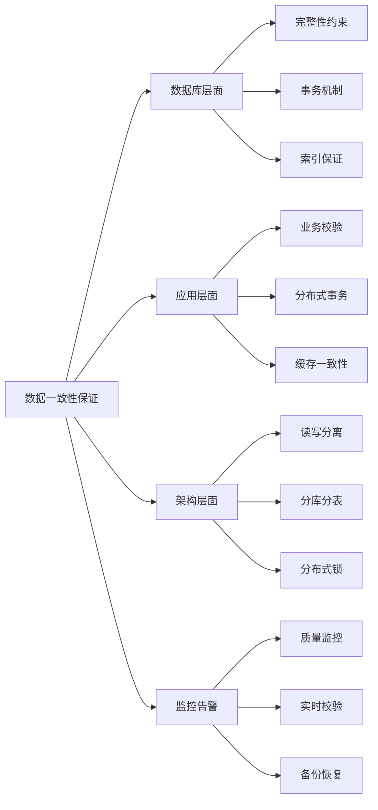

# 如何保证数据的一致性和完整性？

## 概要回答

保证数据一致性和完整性需要从多个层面入手：数据库层面通过约束、事务、索引等机制；应用层面通过业务逻辑校验、分布式事务等手段；系统架构层面通过读写分离、分库分表、缓存同步等策略。关键是要建立完整的数据治理体系，包括数据校验、监控告警、备份恢复等机制。

## 深度解析

### 数据库层面的保证机制

#### 1. 数据完整性约束
```sql
-- 数据库完整性约束示例

-- 1. 实体完整性（主键约束）
CREATE TABLE users (
    id BIGINT PRIMARY KEY AUTO_INCREMENT,
    username VARCHAR(50) NOT NULL UNIQUE,
    email VARCHAR(100) NOT NULL UNIQUE,
    created_at TIMESTAMP DEFAULT CURRENT_TIMESTAMP
);

-- 2. 域完整性（检查约束）
CREATE TABLE products (
    id BIGINT PRIMARY KEY AUTO_INCREMENT,
    name VARCHAR(255) NOT NULL,
    price DECIMAL(10,2) NOT NULL CHECK (price > 0),
    stock INT NOT NULL DEFAULT 0 CHECK (stock >= 0),
    category_id INT,
    status ENUM('active', 'inactive', 'discontinued') DEFAULT 'active',
    created_at TIMESTAMP DEFAULT CURRENT_TIMESTAMP,
    
    -- 外键约束
    FOREIGN KEY (category_id) REFERENCES categories(id) 
        ON DELETE SET NULL ON UPDATE CASCADE
);

-- 3. 参照完整性（外键约束）
CREATE TABLE orders (
    id BIGINT PRIMARY KEY AUTO_INCREMENT,
    user_id BIGINT NOT NULL,
    total_amount DECIMAL(10,2) NOT NULL,
    status VARCHAR(50) NOT NULL DEFAULT 'pending',
    created_at TIMESTAMP DEFAULT CURRENT_TIMESTAMP,
    
    -- 外键约束确保参照完整性
    FOREIGN KEY (user_id) REFERENCES users(id) 
        ON DELETE CASCADE ON UPDATE CASCADE
);

CREATE TABLE order_items (
    id BIGINT PRIMARY KEY AUTO_INCREMENT,
    order_id BIGINT NOT NULL,
    product_id BIGINT NOT NULL,
    quantity INT NOT NULL CHECK (quantity > 0),
    unit_price DECIMAL(10,2) NOT NULL,
    
    -- 复合外键约束
    FOREIGN KEY (order_id) REFERENCES orders(id) ON DELETE CASCADE,
    FOREIGN KEY (product_id) REFERENCES products(id) ON DELETE RESTRICT
);

-- 4. 用户自定义完整性（触发器）
DELIMITER $$

CREATE TRIGGER check_inventory_before_order
BEFORE INSERT ON order_items
FOR EACH ROW
BEGIN
    DECLARE available_stock INT;
    
    -- 检查库存是否充足
    SELECT stock INTO available_stock 
    FROM products 
    WHERE id = NEW.product_id;
    
    IF available_stock < NEW.quantity THEN
        SIGNAL SQLSTATE '45000' 
        SET MESSAGE_TEXT = 'Insufficient inventory for this product';
    END IF;
    
    -- 扣减库存
    UPDATE products 
    SET stock = stock - NEW.quantity 
    WHERE id = NEW.product_id;
END$$

CREATE TRIGGER restore_inventory_on_delete
AFTER DELETE ON order_items
FOR EACH ROW
BEGIN
    -- 订单项删除时恢复库存
    UPDATE products 
    SET stock = stock + OLD.quantity 
    WHERE id = OLD.product_id;
END$$

CREATE TRIGGER update_order_total
AFTER INSERT ON order_items
FOR EACH ROW
BEGIN
    -- 更新订单总金额
    UPDATE orders o
    SET total_amount = (
        SELECT SUM(quantity * unit_price)
        FROM order_items
        WHERE order_id = NEW.order_id
    )
    WHERE o.id = NEW.order_id;
END$$

DELIMITER ;
```

#### 2. 事务机制保证一致性
```sql
-- 事务ACID特性保证数据一致性

-- 1. 原子性保证
START TRANSACTION;

-- 复杂业务操作：创建订单并扣减库存
INSERT INTO orders (user_id, total_amount, status) 
VALUES (1, 299.99, 'pending');

SET @order_id = LAST_INSERT_ID();

INSERT INTO order_items (order_id, product_id, quantity, unit_price)
VALUES (@order_id, 1, 2, 149.99);

-- 如果任何一个步骤失败，整个事务回滚
-- UPDATE products SET stock = stock - 2 WHERE id = 1;

COMMIT;

-- 2. 一致性保证示例
DELIMITER $$

CREATE PROCEDURE transfer_money(
    IN from_account BIGINT,
    IN to_account BIGINT,
    IN amount DECIMAL(10,2)
)
BEGIN
    DECLARE EXIT HANDLER FOR SQLEXCEPTION
    BEGIN
        ROLLBACK;
        RESIGNAL;
    END;
    
    START TRANSACTION;
    
    -- 检查转出账户余额
    IF (SELECT balance FROM accounts WHERE id = from_account) < amount THEN
        SIGNAL SQLSTATE '45000' SET MESSAGE_TEXT = 'Insufficient balance';
    END IF;
    
    -- 扣减转出账户余额
    UPDATE accounts 
    SET balance = balance - amount 
    WHERE id = from_account;
    
    -- 增加转入账户余额
    UPDATE accounts 
    SET balance = balance + amount 
    WHERE id = to_account;
    
    -- 记录转账日志
    INSERT INTO transfer_log (from_account, to_account, amount, transfer_time)
    VALUES (from_account, to_account, amount, NOW());
    
    COMMIT;
END$$

DELIMITER ;

-- 3. 隔离性级别设置
-- 查看当前隔离级别
SELECT @@transaction_isolation;

-- 设置事务隔离级别
SET SESSION TRANSACTION ISOLATION LEVEL READ COMMITTED;
SET SESSION TRANSACTION ISOLATION LEVEL REPEATABLE READ;
SET SESSION TRANSACTION ISOLATION LEVEL SERIALIZABLE;
```

#### 3. 索引和唯一性保证
```sql
-- 索引保证数据完整性和查询性能

-- 1. 唯一索引保证数据唯一性
CREATE TABLE users (
    id BIGINT PRIMARY KEY AUTO_INCREMENT,
    username VARCHAR(50) NOT NULL,
    email VARCHAR(100) NOT NULL,
    phone VARCHAR(20),
    
    -- 唯一约束
    UNIQUE KEY uk_username (username),
    UNIQUE KEY uk_email (email),
    UNIQUE KEY uk_phone (phone)
);

-- 2. 复合唯一索引
CREATE TABLE user_roles (
    id BIGINT PRIMARY KEY AUTO_INCREMENT,
    user_id BIGINT NOT NULL,
    role_id BIGINT NOT NULL,
    assigned_at TIMESTAMP DEFAULT CURRENT_TIMESTAMP,
    
    -- 防止用户重复分配相同角色
    UNIQUE KEY uk_user_role (user_id, role_id),
    
    FOREIGN KEY (user_id) REFERENCES users(id) ON DELETE CASCADE,
    FOREIGN KEY (role_id) REFERENCES roles(id) ON DELETE CASCADE
);

-- 3. 索引优化查询性能，间接保证一致性
CREATE INDEX idx_orders_user_status ON orders(user_id, status);
CREATE INDEX idx_products_category_price ON products(category_id, price);
CREATE INDEX idx_users_created_at ON users(created_at);

-- 4. 全文索引支持复杂查询
CREATE FULLTEXT INDEX ft_products_name_desc ON products(name, description);
```

### 应用层面的保证机制

#### 1. 业务逻辑校验
```java
// Java应用层数据校验示例
@Service
public class UserService {
    
    @Autowired
    private UserRepository userRepository;
    
    @Autowired
    private EmailService emailService;
    
    // 创建用户时的数据校验
    @Transactional
    public User createUser(CreateUserRequest request) {
        // 1. 参数校验
        validateCreateUserRequest(request);
        
        // 2. 业务规则校验
        checkUserExists(request.getUsername(), request.getEmail());
        
        // 3. 数据一致性校验
        User user = convertToUser(request);
        user = userRepository.save(user);
        
        // 4. 后续操作（发送欢迎邮件等）
        emailService.sendWelcomeEmail(user.getEmail());
        
        return user;
    }
    
    private void validateCreateUserRequest(CreateUserRequest request) {
        // 基础参数校验
        if (StringUtils.isBlank(request.getUsername())) {
            throw new ValidationException("Username cannot be blank");
        }
        
        if (!isValidEmail(request.getEmail())) {
            throw new ValidationException("Invalid email format");
        }
        
        if (request.getUsername().length() < 3 || request.getUsername().length() > 50) {
            throw new ValidationException("Username length must be between 3 and 50 characters");
        }
        
        // 密码强度校验
        if (!isStrongPassword(request.getPassword())) {
            throw new ValidationException("Password is not strong enough");
        }
    }
    
    private void checkUserExists(String username, String email) {
        // 检查用户名是否已存在
        if (userRepository.existsByUsername(username)) {
            throw new BusinessException("Username already exists");
        }
        
        // 检查邮箱是否已存在
        if (userRepository.existsByEmail(email)) {
            throw new BusinessException("Email already exists");
        }
    }
    
    // 更新用户信息时的数据校验
    @Transactional
    public User updateUser(Long userId, UpdateUserRequest request) {
        User user = userRepository.findById(userId)
            .orElseThrow(() -> new UserNotFoundException("User not found"));
        
        // 校验邮箱唯一性（如果邮箱被修改）
        if (!Objects.equals(user.getEmail(), request.getEmail())) {
            if (userRepository.existsByEmail(request.getEmail())) {
                throw new BusinessException("Email already exists");
            }
            user.setEmail(request.getEmail());
        }
        
        // 校验用户名唯一性（如果用户名被修改）
        if (!Objects.equals(user.getUsername(), request.getUsername())) {
            if (userRepository.existsByUsername(request.getUsername())) {
                throw new BusinessException("Username already exists");
            }
            user.setUsername(request.getUsername());
        }
        
        user.setNickname(request.getNickname());
        user.setAvatar(request.getAvatar());
        
        return userRepository.save(user);
    }
}

// 使用Bean Validation进行声明式校验
public class CreateUserRequest {
    
    @NotBlank(message = "Username cannot be blank")
    @Size(min = 3, max = 50, message = "Username length must be between 3 and 50")
    private String username;
    
    @NotBlank(message = "Email cannot be blank")
    @Email(message = "Invalid email format")
    private String email;
    
    @NotBlank(message = "Password cannot be blank")
    @Pattern(regexp = "^(?=.*[a-z])(?=.*[A-Z])(?=.*\\d)[a-zA-Z\\d@$!%*?&]{8,}$",
             message = "Password must contain at least 8 characters with uppercase, lowercase and digit")
    private String password;
    
    // getters and setters...
}

@RestController
public class UserController {
    
    @Autowired
    private UserService userService;
    
    @PostMapping("/users")
    public ResponseEntity<User> createUser(@Valid @RequestBody CreateUserRequest request) {
        User user = userService.createUser(request);
        return ResponseEntity.ok(user);
    }
}
```

#### 2. 分布式事务保证一致性
```java
// 分布式事务实现示例
@Service
public class OrderService {
    
    @Autowired
    private OrderRepository orderRepository;
    
    @Autowired
    private InventoryService inventoryService;
    
    @Autowired
    private PaymentService paymentService;
    
    @Autowired
    private NotificationService notificationService;
    
    // 使用Seata实现分布式事务
    @GlobalTransactional
    public Order createOrder(CreateOrderRequest request) {
        try {
            // 1. 创建订单
            Order order = new Order();
            order.setUserId(request.getUserId());
            order.setTotalAmount(calculateTotalAmount(request.getItems()));
            order.setStatus(OrderStatus.PENDING);
            order = orderRepository.save(order);
            
            // 2. 扣减库存（可能在不同的数据库中）
            for (OrderItem item : request.getItems()) {
                inventoryService.decreaseStock(item.getProductId(), item.getQuantity());
            }
            
            // 3. 处理支付（可能调用外部支付服务）
            PaymentResult paymentResult = paymentService.processPayment(
                order.getId(), order.getTotalAmount());
            
            if (!paymentResult.isSuccess()) {
                throw new PaymentException("Payment failed: " + paymentResult.getMessage());
            }
            
            // 4. 更新订单状态
            order.setStatus(OrderStatus.PAID);
            order.setPaymentId(paymentResult.getPaymentId());
            order = orderRepository.save(order);
            
            // 5. 发送通知
            notificationService.sendOrderConfirmation(order);
            
            return order;
            
        } catch (Exception e) {
            // Seata会自动回滚所有参与的事务
            log.error("Failed to create order", e);
            throw new OrderCreationException("Failed to create order", e);
        }
    }
    
    // 使用消息队列实现最终一致性
    @Transactional
    public Order createOrderWithMQ(CreateOrderRequest request) {
        // 1. 创建订单
        Order order = new Order();
        order.setUserId(request.getUserId());
        order.setTotalAmount(calculateTotalAmount(request.getItems()));
        order.setStatus(OrderStatus.PENDING);
        order = orderRepository.save(order);
        
        // 2. 发送扣减库存消息
        StockDeductionEvent stockEvent = new StockDeductionEvent();
        stockEvent.setOrderId(order.getId());
        stockEvent.setItems(request.getItems());
        messageProducer.send("stock.deduction", stockEvent);
        
        // 3. 发送支付处理消息
        PaymentProcessingEvent paymentEvent = new PaymentProcessingEvent();
        paymentEvent.setOrderId(order.getId());
        paymentEvent.setAmount(order.getTotalAmount());
        messageProducer.send("payment.processing", paymentEvent);
        
        return order;
    }
}

// 消息消费者实现最终一致性
@Component
public class OrderEventConsumers {
    
    @Autowired
    private InventoryService inventoryService;
    
    @Autowired
    private OrderRepository orderRepository;
    
    @RabbitListener(queues = "stock.deduction")
    @Transactional
    public void handleStockDeduction(StockDeductionEvent event) {
        try {
            // 扣减库存
            for (OrderItem item : event.getItems()) {
                inventoryService.decreaseStock(item.getProductId(), item.getQuantity());
            }
            
            // 发送库存扣减成功消息
            StockDeductionSuccessEvent successEvent = new StockDeductionSuccessEvent();
            successEvent.setOrderId(event.getOrderId());
            messageProducer.send("stock.deduction.success", successEvent);
            
        } catch (Exception e) {
            log.error("Failed to deduct stock for order: " + event.getOrderId(), e);
            
            // 发送库存扣减失败消息
            StockDeductionFailedEvent failedEvent = new StockDeductionFailedEvent();
            failedEvent.setOrderId(event.getOrderId());
            failedEvent.setErrorMessage(e.getMessage());
            messageProducer.send("stock.deduction.failed", failedEvent);
        }
    }
    
    @RabbitListener(queues = "stock.deduction.success")
    @Transactional
    public void handleStockDeductionSuccess(StockDeductionSuccessEvent event) {
        // 更新订单状态为库存已扣减
        Order order = orderRepository.findById(event.getOrderId())
            .orElseThrow(() -> new OrderNotFoundException("Order not found"));
        order.setStockDeducted(true);
        orderRepository.save(order);
    }
}
```

### 系统架构层面的保证机制

#### 1. 缓存一致性保证
```java
// 缓存与数据库一致性保证
@Service
public class CachedUserService {
    
    @Autowired
    private UserRepository userRepository;
    
    @Autowired
    private RedisTemplate<String, Object> redisTemplate;
    
    // 读操作：先读缓存，缓存未命中再读数据库
    public User getUserById(Long userId) {
        String cacheKey = "user:" + userId;
        
        // 1. 尝试从缓存获取
        User user = (User) redisTemplate.opsForValue().get(cacheKey);
        if (user != null) {
            return user;
        }
        
        // 2. 缓存未命中，从数据库查询
        user = userRepository.findById(userId).orElse(null);
        if (user != null) {
            // 3. 将结果存入缓存
            redisTemplate.opsForValue().set(cacheKey, user, Duration.ofHours(1));
        }
        
        return user;
    }
    
    // 写操作：更新数据库后删除缓存（Cache-Aside模式）
    @Transactional
    public User updateUser(Long userId, UpdateUserRequest request) {
        // 1. 更新数据库
        User user = userRepository.findById(userId)
            .orElseThrow(() -> new UserNotFoundException("User not found"));
        
        user.setUsername(request.getUsername());
        user.setEmail(request.getEmail());
        user.setNickname(request.getNickname());
        user = userRepository.save(user);
        
        // 2. 删除缓存
        String cacheKey = "user:" + userId;
        redisTemplate.delete(cacheKey);
        
        return user;
    }
    
    // 使用Canal监听MySQL binlog实现缓存同步
    @Component
    public class DatabaseChangeEventListener {
        
        @Autowired
        private RedisTemplate<String, Object> redisTemplate;
        
        // 监听用户表变更
        @EventListener
        public void handleUserChangeEvent(UserChangeEvent event) {
            String cacheKey = "user:" + event.getUserId();
            
            if (event.getEventType() == EventType.DELETE) {
                // 删除缓存
                redisTemplate.delete(cacheKey);
            } else if (event.getEventType() == EventType.UPDATE) {
                // 更新缓存
                User user = loadUserFromDatabase(event.getUserId());
                if (user != null) {
                    redisTemplate.opsForValue().set(cacheKey, user, Duration.ofHours(1));
                }
            }
        }
        
        private User loadUserFromDatabase(Long userId) {
            // 从数据库加载用户信息
            return null; // 实际实现
        }
    }
}

// 使用读写分离保证数据一致性
@Configuration
public class ReadWriteSplittingConfig {
    
    @Bean
    @Primary
    public DataSource routingDataSource() {
        DynamicDataSource routingDataSource = new DynamicDataSource();
        
        Map<Object, Object> dataSourceMap = new HashMap<>();
        dataSourceMap.put("master", masterDataSource());
        dataSourceMap.put("slave", slaveDataSource());
        
        routingDataSource.setTargetDataSources(dataSourceMap);
        routingDataSource.setDefaultTargetDataSource(masterDataSource());
        
        return routingDataSource;
    }
    
    // 强一致性读取：强制从主库读取
    public User getUserWithStrongConsistency(Long userId) {
        DataSourceContextHolder.setDataSourceType("master");
        try {
            return userRepository.findById(userId).orElse(null);
        } finally {
            DataSourceContextHolder.clearDataSourceType();
        }
    }
    
    // 最终一致性读取：从从库读取
    public User getUserWithEventualConsistency(Long userId) {
        DataSourceContextHolder.setDataSourceType("slave");
        try {
            return userRepository.findById(userId).orElse(null);
        } finally {
            DataSourceContextHolder.clearDataSourceType();
        }
    }
}
```

#### 2. 分布式系统一致性保证
```java
// 分布式系统数据一致性保证
@Service
public class DistributedDataConsistencyService {
    
    // 使用分布式锁保证一致性
    public void updateSharedResource(String resourceId, UpdateRequest request) {
        String lockKey = "resource:" + resourceId;
        String lockValue = UUID.randomUUID().toString();
        
        try {
            // 获取分布式锁
            if (distributedLock.acquireLock(lockKey, lockValue, 30)) {
                // 执行更新操作
                doUpdateResource(resourceId, request);
            } else {
                throw new ConcurrencyException("Failed to acquire lock");
            }
        } finally {
            // 释放分布式锁
            distributedLock.releaseLock(lockKey, lockValue);
        }
    }
    
    // 使用版本号实现乐观锁
    @Retryable(value = {OptimisticLockException.class}, maxAttempts = 3)
    public void updateResourceWithVersion(String resourceId, UpdateRequest request) {
        Resource resource = resourceRepository.findById(resourceId)
            .orElseThrow(() -> new ResourceNotFoundException("Resource not found"));
        
        // 检查版本号
        if (!resource.getVersion().equals(request.getVersion())) {
            throw new OptimisticLockException("Resource has been modified by another transaction");
        }
        
        // 更新资源
        resource.setData(request.getData());
        resource.setVersion(resource.getVersion() + 1);
        resourceRepository.save(resource);
    }
    
    // 数据同步机制
    @Scheduled(fixedRate = 300000) // 每5分钟执行一次
    public void syncDataBetweenSystems() {
        try {
            // 从源系统获取增量数据
            List<DataRecord> incrementalData = sourceSystem.getIncrementalData(lastSyncTime);
            
            // 同步到目标系统
            for (DataRecord record : incrementalData) {
                targetSystem.upsertData(record);
            }
            
            // 更新同步时间戳
            lastSyncTime = System.currentTimeMillis();
            
        } catch (Exception e) {
            log.error("Failed to sync data between systems", e);
            // 发送告警
            alertService.sendAlert("Data synchronization failed: " + e.getMessage());
        }
    }
    
    // 数据校验和修复
    @Scheduled(cron = "0 0 2 * * ?") // 每天凌晨2点执行
    public void validateAndRepairData() {
        // 1. 执行数据校验
        List<DataInconsistency> inconsistencies = dataValidator.validateAll();
        
        // 2. 记录不一致数据
        for (DataInconsistency inconsistency : inconsistencies) {
            log.warn("Data inconsistency found: {}", inconsistency);
            inconsistencyRepository.save(inconsistency);
        }
        
        // 3. 自动修复可修复的不一致数据
        repairService.autoRepair(inconsistencies);
        
        // 4. 生成数据质量报告
        generateDataQualityReport(inconsistencies);
    }
}

// 数据校验器
@Component
public class DataValidator {
    
    @Autowired
    private UserRepository userRepository;
    
    @Autowired
    private OrderRepository orderRepository;
    
    public List<DataInconsistency> validateAll() {
        List<DataInconsistency> inconsistencies = new ArrayList<>();
        
        // 1. 校验用户数据完整性
        inconsistencies.addAll(validateUserData());
        
        // 2. 校验订单数据一致性
        inconsistencies.addAll(validateOrderData());
        
        // 3. 校验业务规则
        inconsistencies.addAll(validateBusinessRules());
        
        return inconsistencies;
    }
    
    private List<DataInconsistency> validateUserData() {
        List<DataInconsistency> inconsistencies = new ArrayList<>();
        
        // 检查孤立的用户配置
        List<UserConfig> orphanConfigs = userConfigRepository.findOrphanConfigs();
        for (UserConfig config : orphanConfigs) {
            inconsistencies.add(new DataInconsistency(
                "orphan_user_config",
                "User config exists without corresponding user",
                config.getId().toString()
            ));
        }
        
        // 检查重复的邮箱
        List<DuplicateEmail> duplicateEmails = userRepository.findDuplicateEmails();
        for (DuplicateEmail duplicate : duplicateEmails) {
            inconsistencies.add(new DataInconsistency(
                "duplicate_email",
                "Duplicate email found",
                duplicate.getEmail()
            ));
        }
        
        return inconsistencies;
    }
    
    private List<DataInconsistency> validateOrderData() {
        List<DataInconsistency> inconsistencies = new ArrayList<>();
        
        // 检查订单总金额与明细是否一致
        List<Order> inconsistentOrders = orderRepository.findInconsistentOrders();
        for (Order order : inconsistentOrders) {
            inconsistencies.add(new DataInconsistency(
                "order_amount_mismatch",
                "Order total amount mismatch with items",
                order.getId().toString()
            ));
        }
        
        return inconsistencies;
    }
}
```

### 监控和告警机制

#### 1. 数据质量监控
```java
// 数据质量监控和告警
@Component
public class DataQualityMonitor {
    
    private final MeterRegistry meterRegistry;
    private final Counter dataInconsistencyCounter;
    private final Gauge dataQualityScore;
    
    public DataQualityMonitor(MeterRegistry meterRegistry) {
        this.meterRegistry = meterRegistry;
        this.dataInconsistencyCounter = Counter.builder("data.inconsistency")
            .description("Number of data inconsistencies detected")
            .register(meterRegistry);
            
        this.dataQualityScore = Gauge.builder("data.quality.score")
            .description("Overall data quality score")
            .register(meterRegistry, this, DataQualityMonitor::calculateQualityScore);
    }
    
    // 定期检查数据质量
    @Scheduled(fixedRate = 300000) // 每5分钟检查一次
    public void checkDataQuality() {
        try {
            // 执行数据质量检查
            DataQualityReport report = dataQualityChecker.generateReport();
            
            // 记录指标
            report.getInconsistencies().forEach(inconsistency -> {
                dataInconsistencyCounter.increment();
                log.warn("Data inconsistency detected: {}", inconsistency);
            });
            
            // 如果数据质量分数过低，发送告警
            if (report.getQualityScore() < 0.8) {
                alertService.sendAlert("Data quality score dropped below threshold: " + 
                                     report.getQualityScore());
            }
            
        } catch (Exception e) {
            log.error("Failed to check data quality", e);
        }
    }
    
    private double calculateQualityScore() {
        // 计算数据质量分数的逻辑
        return 0.95; // 示例值
    }
    
    // 实时数据校验
    @EventListener
    public void onDataChangeEvent(DataChangeEvent event) {
        // 对变更的数据进行实时校验
        ValidationResult result = realtimeValidator.validate(event.getData());
        
        if (!result.isValid()) {
            // 记录校验失败
            log.warn("Data validation failed for event: {}", event, 
                    result.getValidationError());
            
            // 发送告警
            alertService.sendAlert("Real-time data validation failed: " + 
                                 result.getValidationError());
        }
    }
}

// 数据质量检查器
@Component
public class DataQualityChecker {
    
    @Autowired
    private UserRepository userRepository;
    
    @Autowired
    private OrderRepository orderRepository;
    
    public DataQualityReport generateReport() {
        DataQualityReport report = new DataQualityReport();
        
        // 1. 检查数据完整性
        report.setCompletenessScore(checkCompleteness());
        
        // 2. 检查数据一致性
        report.setConsistencyScore(checkConsistency());
        
        // 3. 检查数据准确性
        report.setAccuracyScore(checkAccuracy());
        
        // 4. 检查数据时效性
        report.setTimelinessScore(checkTimeliness());
        
        // 计算总体质量分数
        double qualityScore = (report.getCompletenessScore() + 
                             report.getConsistencyScore() + 
                             report.getAccuracyScore() + 
                             report.getTimelinessScore()) / 4.0;
        report.setQualityScore(qualityScore);
        
        // 检查数据不一致性
        report.setInconsistencies(findInconsistencies());
        
        return report;
    }
    
    private double checkCompleteness() {
        // 检查必填字段的完整性
        long totalUsers = userRepository.count();
        long usersWithCompleteInfo = userRepository.countUsersWithCompleteInfo();
        
        return (double) usersWithCompleteInfo / totalUsers;
    }
    
    private double checkConsistency() {
        // 检查数据一致性
        long totalOrders = orderRepository.count();
        long consistentOrders = orderRepository.countConsistentOrders();
        
        return (double) consistentOrders / totalOrders;
    }
    
    private List<DataInconsistency> findInconsistencies() {
        // 查找数据不一致性
        return Collections.emptyList(); // 示例实现
    }
}
```

#### 2. 数据备份和恢复
```sql
-- 数据备份和恢复策略

-- 1. 定期全量备份
-- mysqldump -u username -p database_name > backup_$(date +%Y%m%d_%H%M%S).sql

-- 2. 增量备份（binlog）
-- 启用二进制日志
-- 在my.cnf中添加：
-- [mysqldir]
-- log-bin=mysql-bin
-- expire_logs_days=7

-- 3. 热备份（使用Percona XtraBackup）
-- xtrabackup --backup --target-dir=/data/backups/

-- 4. 数据库复制配置
-- 主库配置
-- [mysqld]
-- server-id=1
-- log-bin=mysql-bin
-- binlog-format=ROW

-- 从库配置
-- [mysqld]
-- server-id=2
-- relay-log=relay-bin
-- read_only=1

-- 5. 数据校验和修复
-- 使用pt-table-checksum检查主从数据一致性
-- pt-table-checksum --host=master-host --user=username --password=password

-- 使用pt-table-sync修复数据不一致
-- pt-table-sync --host=master-host --user=username --password=password \
--               --sync-to-master h=slave-host,D=database_name,t=table_name
```

## 图示说明



通过多层次、多维度的数据一致性保证机制，可以构建一个健壮的数据管理体系，确保系统中数据的准确性和可靠性。关键是要根据业务特点选择合适的策略，并建立完善的监控和告警机制及时发现问题。