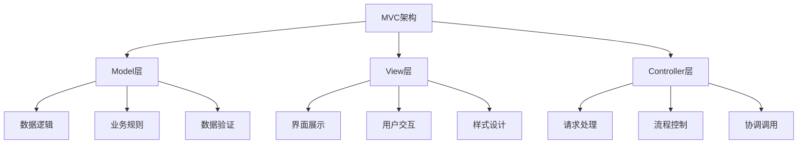
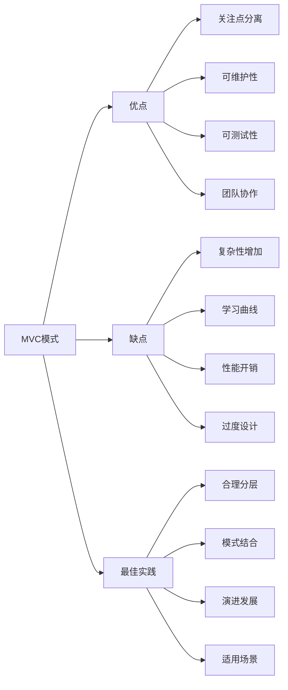

# MVC模式在实际项目中的优缺点？

## 概要回答

MVC（Model-View-Controller）模式是一种经典的软件架构模式，将应用程序分为三个核心组件：
- Model（模型）：负责数据逻辑和业务规则
- View（视图）：负责用户界面展示
- Controller（控制器）：负责处理用户输入并协调模型和视图

优点包括关注点分离、可维护性强、易于测试等；缺点包括复杂性增加、学习曲线陡峭、可能过度设计等。

## 深度解析

### MVC模式基本结构

#### 1. 三层架构详解
```php
<?php
// Model层 - 数据和业务逻辑
class UserModel {
    private $db;
    
    public function __construct($database) {
        $this->db = $database;
    }
    
    public function getUserById($id) {
        $stmt = $this->db->prepare("SELECT * FROM users WHERE id = ?");
        $stmt->execute([$id]);
        return $stmt->fetch(PDO::FETCH_ASSOC);
    }
    
    public function createUser($userData) {
        $stmt = $this->db->prepare("INSERT INTO users (name, email) VALUES (?, ?)");
        return $stmt->execute([$userData['name'], $userData['email']]);
    }
    
    public function validateUser($userData) {
        // 业务规则验证
        if (empty($userData['name']) || empty($userData['email'])) {
            return false;
        }
        
        if (!filter_var($userData['email'], FILTER_VALIDATE_EMAIL)) {
            return false;
        }
        
        return true;
    }
}

// View层 - 用户界面展示
class UserView {
    public function renderUserProfile($user) {
        ob_start();
        ?>
        <div class="user-profile">
            <h2><?php echo htmlspecialchars($user['name']); ?></h2>
            <p>Email: <?php echo htmlspecialchars($user['email']); ?></p>
            <p>Member since: <?php echo htmlspecialchars($user['created_at']); ?></p>
        </div>
        <?php
        return ob_get_clean();
    }
    
    public function renderUserForm($userData = []) {
        $name = $userData['name'] ?? '';
        $email = $userData['email'] ?? '';
        
        ob_start();
        ?>
        <form method="post" action="/user/create">
            <div>
                <label for="name">Name:</label>
                <input type="text" id="name" name="name" value="<?php echo htmlspecialchars($name); ?>" required>
            </div>
            <div>
                <label for="email">Email:</label>
                <input type="email" id="email" name="email" value="<?php echo htmlspecialchars($email); ?>" required>
            </div>
            <button type="submit">Create User</button>
        </form>
        <?php
        return ob_get_clean();
    }
}

// Controller层 - 协调者
class UserController {
    private $model;
    private $view;
    
    public function __construct($model, $view) {
        $this->model = $model;
        $this->view = $view;
    }
    
    public function showUser($userId) {
        $user = $this->model->getUserById($userId);
        if ($user) {
            return $this->view->renderUserProfile($user);
        } else {
            return "User not found";
        }
    }
    
    public function createUser() {
        if ($_SERVER['REQUEST_METHOD'] === 'POST') {
            $userData = [
                'name' => $_POST['name'] ?? '',
                'email' => $_POST['email'] ?? ''
            ];
            
            if ($this->model->validateUser($userData)) {
                if ($this->model->createUser($userData)) {
                    return "User created successfully";
                } else {
                    return "Failed to create user";
                }
            } else {
                // 重新显示表单并显示错误
                return $this->view->renderUserForm($userData) . "<p style='color: red;'>Invalid input data</p>";
            }
        } else {
            // 显示创建用户表单
            return $this->view->renderUserForm();
        }
    }
}

// 使用示例
// $db = new PDO('mysql:host=localhost;dbname=test', $user, $pass);
// $model = new UserModel($db);
// $view = new UserView();
// $controller = new UserController($model, $view);
// 
// // 处理请求
// if ($_GET['action'] === 'show') {
//     echo $controller->showUser($_GET['id']);
// } elseif ($_GET['action'] === 'create') {
//     echo $controller->createUser();
// }
?>
```

### MVC模式的优点

#### 1. 关注点分离（Separation of Concerns）


#### 2. 可维护性
```php
<?php
// 优点示例：易于维护和修改
class ImprovedUserModel extends UserModel {
    // 扩展原有功能而不影响其他层
    public function getUserWithPermissions($id) {
        $user = $this->getUserById($id);
        if ($user) {
            // 添加权限信息
            $user['permissions'] = $this->getUserPermissions($id);
        }
        return $user;
    }
    
    private function getUserPermissions($userId) {
        $stmt = $this->db->prepare("SELECT permission FROM user_permissions WHERE user_id = ?");
        $stmt->execute([$userId]);
        return $stmt->fetchAll(PDO::FETCH_COLUMN);
    }
}

// View层也可以独立修改样式
class ResponsiveUserView extends UserView {
    public function renderUserProfile($user) {
        ob_start();
        ?>
        <div class="user-profile responsive">
            <div class="profile-header">
                <h2><?php echo htmlspecialchars($user['name']); ?></h2>
            </div>
            <div class="profile-details">
                <p>Email: <?php echo htmlspecialchars($user['email']); ?></p>
                <p>Member since: <?php echo htmlspecialchars($user['created_at']); ?></p>
            </div>
        </div>
        <style>
        .responsive {
            max-width: 100%;
            padding: 1rem;
        }
        @media (max-width: 768px) {
            .profile-header h2 {
                font-size: 1.5rem;
            }
        }
        </style>
        <?php
        return ob_get_clean();
    }
}
?>
```

#### 3. 可测试性
```php
<?php
// PHPUnit测试示例
use PHPUnit\Framework\TestCase;

class UserModelTest extends TestCase {
    private $model;
    private $mockDb;
    
    protected function setUp(): void {
        // 模拟数据库连接
        $this->mockDb = $this->createMock(PDO::class);
        $this->model = new UserModel($this->mockDb);
    }
    
    public function testValidateUserWithValidData() {
        $userData = [
            'name' => 'John Doe',
            'email' => 'john@example.com'
        ];
        
        $this->assertTrue($this->model->validateUser($userData));
    }
    
    public function testValidateUserWithInvalidEmail() {
        $userData = [
            'name' => 'John Doe',
            'email' => 'invalid-email'
        ];
        
        $this->assertFalse($this->model->validateUser($userData));
    }
    
    public function testGetUserById() {
        $expectedUser = ['id' => 1, 'name' => 'John Doe', 'email' => 'john@example.com'];
        
        // 模拟数据库查询结果
        $mockStmt = $this->createMock(PDOStatement::class);
        $mockStmt->expects($this->once())
                 ->method('fetch')
                 ->willReturn($expectedUser);
                 
        $this->mockDb->expects($this->once())
                     ->method('prepare')
                     ->willReturn($mockStmt);
        
        $user = $this->model->getUserById(1);
        $this->assertEquals($expectedUser, $user);
    }
}
?>
```

### MVC模式的缺点

#### 1. 复杂性增加
```php
<?php
// 问题示例：小型项目可能过度复杂
// 对于简单页面，MVC可能显得繁琐
class SimplePageController {
    public function showHomePage() {
        // 简单的静态页面展示
        // 使用MVC可能过于复杂
        return "<html><body><h1>Welcome</h1><p>Hello World</p></body></html>";
    }
}

// 对比直接PHP脚本可能更简单
// <?php
// echo "<html><body><h1>Welcome</h1><p>Hello World</p></body></html>";
// ?>
```

#### 2. 学习曲线
```php
<?php
// 新手容易混淆的常见问题
class ConfusingController {
    // 问题1：在Controller中处理业务逻辑（应该在Model中）
    public function createUser() {
        // 错误：业务逻辑混在Controller中
        if (strlen($_POST['name']) < 3) {
            return "Name too short";
        }
        
        // 正确做法：应该调用Model的方法
        // $this->model->validateAndCreateUser($_POST);
    }
    
    // 问题2：在Controller中直接输出HTML（应该用View）
    public function showUser($id) {
        // 错误：直接输出HTML
        echo "<div>User: " . $this->model->getUserName($id) . "</div>";
        
        // 正确做法：返回数据给View处理
        // return $this->view->renderUser($this->model->getUser($id));
    }
}
?>
```

#### 3. 性能开销
```php
<?php
// MVC可能带来的性能问题示例
class PerformanceConcerns {
    // 问题1：过多的对象创建
    public function handleRequest() {
        // 每次请求都创建多个对象
        $model = new UserModel($db);
        $view = new UserView();
        $controller = new UserController($model, $view);
        
        // 可能的优化：使用依赖注入容器或单例模式
    }
    
    // 问题2：过多的层间调用
    public function complexWorkflow() {
        // Controller -> Model -> Other Models -> Services -> ...
        // 调用链条过长可能影响性能
    }
}
?>
```

### 实际项目中的最佳实践

#### 1. 合理分层
```php
<?php
// 改进的MVC结构
namespace App\MVC;

// 基础Controller类
abstract class BaseController {
    protected $request;
    protected $response;
    
    public function __construct($request) {
        $this->request = $request;
        $this->response = new Response();
    }
    
    abstract public function handle();
}

// 具体Controller
class UserViewController extends BaseController {
    private $userService;
    
    public function __construct($request, UserService $userService) {
        parent::__construct($request);
        $this->userService = $userService;
    }
    
    public function handle() {
        $userId = $this->request->getParam('id');
        $user = $this->userService->getUserProfile($userId);
        
        if ($user) {
            $viewModel = new UserProfileViewModel($user);
            return $this->render('user/profile', $viewModel);
        } else {
            return $this->redirect('/users');
        }
    }
    
    private function render($template, $viewModel) {
        // 使用模板引擎渲染视图
        $renderer = new TemplateRenderer();
        return $renderer->render($template, $viewModel);
    }
}

// ViewModel用于View层的数据封装
class UserProfileViewModel {
    public $name;
    public $email;
    public $registrationDate;
    public $isActive;
    
    public function __construct($userData) {
        $this->name = $userData['name'];
        $this->email = $userData['email'];
        $this->registrationDate = new DateTime($userData['created_at']);
        $this->isActive = $userData['status'] === 'active';
    }
    
    public function getMemberSince() {
        return $this->registrationDate->format('Y-m-d');
    }
    
    public function getStatusClass() {
        return $this->isActive ? 'status-active' : 'status-inactive';
    }
}
?>
```

#### 2. 设计模式结合使用
```php
<?php
// MVC与其他设计模式结合
class EnhancedMVC {
    // 1. 使用工厂模式创建Model
    public function getModel($modelName) {
        $modelClass = "App\\Models\\" . ucfirst($modelName) . "Model";
        if (class_exists($modelClass)) {
            return new $modelClass($this->database);
        }
        throw new Exception("Model {$modelName} not found");
    }
    
    // 2. 使用策略模式处理不同的View渲染
    public function renderView($viewName, $data, $format = 'html') {
        $renderer = ViewRendererFactory::create($format);
        return $renderer->render($viewName, $data);
    }
    
    // 3. 使用观察者模式处理事件
    public function notifyUserCreated($user) {
        $event = new UserCreatedEvent($user);
        EventDispatcher::getInstance()->dispatch($event);
    }
}

// 观察者模式实现
interface UserObserver {
    public function onUserCreated($user);
}

class EmailNotifier implements UserObserver {
    public function onUserCreated($user) {
        // 发送欢迎邮件
        Mailer::sendWelcomeEmail($user['email']);
    }
}

class AnalyticsTracker implements UserObserver {
    public function onUserCreated($user) {
        // 记录用户注册事件
        Analytics::track('user_registered', ['user_id' => $user['id']]);
    }
}
?>
```

### MVC模式的变体和演进

#### 1. MVP（Model-View-Presenter）
```php
<?php
// MVP模式示例
class UserPresenter {
    private $model;
    private $view;
    
    public function __construct(UserModel $model, UserViewInterface $view) {
        $this->model = $model;
        $this->view = $view;
    }
    
    public function presentUserProfile($userId) {
        $user = $this->model->getUserById($userId);
        if ($user) {
            // Presenter处理数据转换
            $presentationData = [
                'displayName' => $user['name'],
                'contactEmail' => $user['email'],
                'memberSince' => date('F j, Y', strtotime($user['created_at']))
            ];
            
            // View只负责展示
            $this->view->displayUserProfile($presentationData);
        } else {
            $this->view->displayUserNotFound();
        }
    }
}

interface UserViewInterface {
    public function displayUserProfile($userData);
    public function displayUserNotFound();
}
?>
```

#### 2. MVVM（Model-View-ViewModel）
```php
<?php
// MVVM模式示例（常用于前端框架，但概念可应用于后端）
class UserViewModel {
    private $model;
    public $userName;
    public $userEmail;
    public $isLoading = false;
    
    public function __construct(UserModel $model) {
        $this->model = $model;
    }
    
    public function loadUser($userId) {
        $this->isLoading = true;
        $user = $this->model->getUserById($userId);
        $this->isLoading = false;
        
        if ($user) {
            $this->userName = $user['name'];
            $this->userEmail = $user['email'];
        }
    }
    
    public function getFormattedUserInfo() {
        if ($this->userName && $this->userEmail) {
            return "{$this->userName} ({$this->userEmail})";
        }
        return "No user loaded";
    }
}
?>
```

## 图示说明



MVC模式在现代Web开发中仍然广泛应用，关键是要根据项目规模和复杂度合理使用，避免过度设计，同时充分发挥其在代码组织和维护方面的优势。