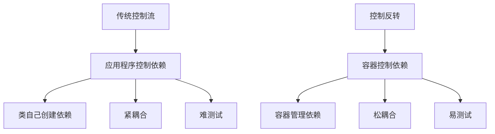
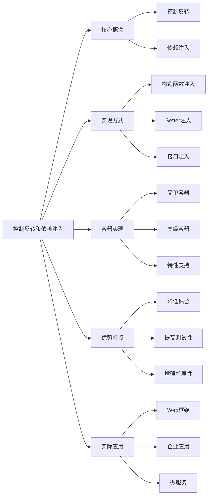

# 解释依赖注入和控制反转的概念？

## 概要回答

依赖注入（Dependency Injection, DI）和控制反转（Inversion of Control, IoC）是软件设计中的重要概念。控制反转是指将对象的创建和管理权交给外部容器，而不是由对象自己控制；依赖注入是实现控制反转的一种具体方式，通过构造函数、setter方法或接口注入依赖关系。这些概念有助于降低代码耦合度，提高可测试性和可维护性。

## 深度解析

### 控制反转（IoC）基本概念

#### 传统方式 vs 控制反转
```php
<?php
// 传统方式 - 控制权在类内部
class UserRepository {
    private $database;
    
    public function __construct() {
        // 类自己控制依赖的创建
        $this->database = new MySQLDatabase();
    }
    
    public function getUser($id) {
        return $this->database->query("SELECT * FROM users WHERE id = ?", [$id]);
    }
}

// 控制反转方式 - 控制权交给外部
class UserRepository {
    private $database;
    
    // 通过构造函数注入依赖
    public function __construct(DatabaseInterface $database) {
        // 不再自己创建依赖，而是由外部提供
        $this->database = $database;
    }
    
    public function getUser($id) {
        return $this->database->query("SELECT * FROM users WHERE id = ?", [$id]);
    }
}
?>
```

#### 控制反转的核心思想


### 依赖注入（DI）实现方式

#### 1. 构造函数注入
```php
<?php
// 定义接口
interface LoggerInterface {
    public function log($message, $level = 'info');
}

interface DatabaseInterface {
    public function query($sql, $params = []);
}

// 实现类
class FileLogger implements LoggerInterface {
    private $logFile;
    
    public function __construct($logFile = '/var/log/app.log') {
        $this->logFile = $logFile;
    }
    
    public function log($message, $level = 'info') {
        $timestamp = date('Y-m-d H:i:s');
        file_put_contents($this->logFile, "[{$timestamp}] {$level}: {$message}\n", FILE_APPEND);
    }
}

class MySQLDatabase implements DatabaseInterface {
    private $pdo;
    
    public function __construct($host, $dbname, $username, $password) {
        $dsn = "mysql:host={$host};dbname={$dbname}";
        $this->pdo = new PDO($dsn, $username, $password);
    }
    
    public function query($sql, $params = []) {
        $stmt = $this->pdo->prepare($sql);
        $stmt->execute($params);
        return $stmt->fetchAll(PDO::FETCH_ASSOC);
    }
}

// 使用构造函数注入
class UserService {
    private $database;
    private $logger;
    
    // 通过构造函数注入依赖
    public function __construct(DatabaseInterface $database, LoggerInterface $logger) {
        $this->database = $database;
        $this->logger = $logger;
    }
    
    public function getUser($id) {
        $this->logger->log("Fetching user with ID: {$id}");
        $user = $this->database->query("SELECT * FROM users WHERE id = ?", [$id]);
        $this->logger->log("User fetched successfully");
        return $user;
    }
    
    public function createUser($userData) {
        $this->logger->log("Creating new user");
        // 创建用户的逻辑
        $this->logger->log("User created successfully");
        return true;
    }
}

// 使用示例
$database = new MySQLDatabase('localhost', 'myapp', 'user', 'pass');
$logger = new FileLogger('/var/log/users.log');
$userService = new UserService($database, $logger);
$user = $userService->getUser(123);
?>
```

#### 2. Setter方法注入
```php
<?php
class OrderService {
    private $paymentProcessor;
    private $emailService;
    private $logger;
    
    // 可选依赖通过setter注入
    public function setPaymentProcessor(PaymentProcessorInterface $processor) {
        $this->paymentProcessor = $processor;
    }
    
    public function setEmailService(EmailServiceInterface $emailService) {
        $this->emailService = $emailService;
    }
    
    public function setLogger(LoggerInterface $logger) {
        $this->logger = $logger;
    }
    
    public function processOrder($orderId) {
        // 处理订单逻辑
        if ($this->paymentProcessor) {
            $this->paymentProcessor->processPayment($orderId);
        }
        
        if ($this->emailService) {
            $this->emailService->sendConfirmation($orderId);
        }
        
        if ($this->logger) {
            $this->logger->log("Order {$orderId} processed");
        }
    }
}

// 使用示例
$orderService = new OrderService();
$orderService->setPaymentProcessor(new StripePaymentProcessor());
$orderService->setEmailService(new SendGridEmailService());
$orderService->setLogger(new FileLogger());

$orderService->processOrder(12345);
?>
```

#### 3. 接口注入
```php
<?php
interface Injectable {
    public function injectDependencies($container);
}

class ProductService implements Injectable {
    private $database;
    private $cache;
    private $logger;
    
    public function injectDependencies($container) {
        $this->database = $container->get('database');
        $this->cache = $container->get('cache');
        $this->logger = $container->get('logger');
    }
    
    public function getProduct($id) {
        // 先尝试从缓存获取
        $product = $this->cache->get("product_{$id}");
        if ($product) {
            $this->logger->log("Product {$id} retrieved from cache");
            return $product;
        }
        
        // 从数据库获取
        $product = $this->database->query("SELECT * FROM products WHERE id = ?", [$id]);
        if ($product) {
            $this->cache->set("product_{$id}", $product, 3600);
            $this->logger->log("Product {$id} retrieved from database and cached");
        }
        
        return $product;
    }
}
?>
```

### 依赖注入容器实现

#### 1. 简单DI容器
```php
<?php
class SimpleContainer {
    private $bindings = [];
    private $instances = [];
    
    // 绑定接口到实现
    public function bind($abstract, $concrete = null) {
        if ($concrete === null) {
            $concrete = $abstract;
        }
        
        $this->bindings[$abstract] = $concrete;
    }
    
    // 绑定单例
    public function singleton($abstract, $concrete = null) {
        $this->bind($abstract, $concrete);
        $this->instances[$abstract] = null;
    }
    
    // 解析依赖
    public function resolve($abstract) {
        // 检查是否已有实例（单例）
        if (isset($this->instances[$abstract]) && $this->instances[$abstract] !== null) {
            return $this->instances[$abstract];
        }
        
        // 获取绑定的实现
        $concrete = $this->bindings[$abstract] ?? $abstract;
        
        // 如果是匿名函数，直接执行
        if ($concrete instanceof Closure) {
            $object = $concrete($this);
        } else {
            // 创建对象并注入依赖
            $object = $this->build($concrete);
        }
        
        // 如果是单例，保存实例
        if (isset($this->instances[$abstract])) {
            $this->instances[$abstract] = $object;
        }
        
        return $object;
    }
    
    // 构建对象并注入依赖
    private function build($concrete) {
        // 获取类的反射信息
        $reflector = new ReflectionClass($concrete);
        
        // 如果类无法实例化（抽象类、接口等），抛出异常
        if (!$reflector->isInstantiable()) {
            throw new Exception("Class {$concrete} is not instantiable");
        }
        
        // 获取构造函数
        $constructor = $reflector->getConstructor();
        
        // 如果没有构造函数，直接创建实例
        if ($constructor === null) {
            return new $concrete;
        }
        
        // 获取构造函数参数
        $parameters = $constructor->getParameters();
        $dependencies = $this->resolveDependencies($parameters);
        
        // 创建实例
        return $reflector->newInstanceArgs($dependencies);
    }
    
    // 解析依赖
    private function resolveDependencies($parameters) {
        $dependencies = [];
        
        foreach ($parameters as $parameter) {
            // 获取参数类型
            $type = $parameter->getType();
            
            // 如果参数没有类型提示，检查是否有默认值
            if ($type === null) {
                if ($parameter->isDefaultValueAvailable()) {
                    $dependencies[] = $parameter->getDefaultValue();
                } else {
                    throw new Exception("Cannot resolve parameter {$parameter->getName()}");
                }
                continue;
            }
            
            // 解析类型提示的依赖
            $typeName = $type->getName();
            $dependencies[] = $this->resolve($typeName);
        }
        
        return $dependencies;
    }
    
    // 魔术方法实现数组式访问
    public function __get($key) {
        return $this->resolve($key);
    }
}

// 使用示例
$container = new SimpleContainer();

// 绑定接口到实现
$container->bind(LoggerInterface::class, FileLogger::class);
$container->bind(DatabaseInterface::class, MySQLDatabase::class);

// 绑定具体参数
$container->bind('database.host', 'localhost');
$container->bind('database.name', 'myapp');
$container->bind('database.user', 'user');
$container->bind('database.pass', 'pass');

// 绑定复杂对象
$container->singleton(MySQLDatabase::class, function($container) {
    return new MySQLDatabase(
        $container->resolve('database.host'),
        $container->resolve('database.name'),
        $container->resolve('database.user'),
        $container->resolve('database.pass')
    );
});

// 解析对象（自动注入依赖）
$userService = $container->resolve(UserService::class);
$user = $userService->getUser(123);
?>
```

#### 2. 高级DI容器特性
```php
<?php
class AdvancedContainer extends SimpleContainer {
    private $aliases = [];
    private $tags = [];
    
    // 别名支持
    public function alias($abstract, $alias) {
        $this->aliases[$alias] = $abstract;
    }
    
    // 标签支持
    public function tag($abstract, $tag) {
        if (!isset($this->tags[$tag])) {
            $this->tags[$tag] = [];
        }
        $this->tags[$tag][] = $abstract;
    }
    
    // 获取标签组
    public function tagged($tag) {
        $tagged = $this->tags[$tag] ?? [];
        return array_map([$this, 'resolve'], $tagged);
    }
    
    // 扩展对象
    public function extend($abstract, Closure $closure) {
        $original = $this->bindings[$abstract] ?? $abstract;
        $this->bind($abstract, function($container) use ($original, $closure) {
            return $closure($container->resolve($original), $container);
        });
    }
    
    // 覆写resolve方法支持别名
    public function resolve($abstract) {
        // 检查别名
        if (isset($this->aliases[$abstract])) {
            $abstract = $this->aliases[$abstract];
        }
        
        return parent::resolve($abstract);
    }
    
    // 上下文绑定
    public function when($concrete) {
        return new ContextualBindingBuilder($this, $concrete);
    }
}

class ContextualBindingBuilder {
    private $container;
    private $concrete;
    
    public function __construct($container, $concrete) {
        $this->container = $container;
        $this->concrete = $concrete;
    }
    
    public function needs($abstract) {
        return new NeedsResolver($this->container, $this->concrete, $abstract);
    }
}

class NeedsResolver {
    private $container;
    private $concrete;
    private $abstract;
    
    public function __construct($container, $concrete, $abstract) {
        $this->container = $container;
        $this->concrete = $concrete;
        $this->abstract = $abstract;
    }
    
    public function give($implementation) {
        // 实现上下文绑定逻辑
        $this->container->bind("{$this->concrete}->{$this->abstract}", $implementation);
    }
}

// 使用示例
$container = new AdvancedContainer();

// 别名
$container->alias(LoggerInterface::class, 'logger');

// 标签
$container->bind(FileLogger::class, function() {
    return new FileLogger('/var/log/app.log');
});
$container->bind(SyslogLogger::class, function() {
    return new SyslogLogger();
});

$container->tag(FileLogger::class, 'loggers');
$container->tag(SyslogLogger::class, 'loggers');

// 获取所有标记为loggers的服务
$loggers = $container->tagged('loggers');

// 扩展对象
$container->extend(FileLogger::class, function($logger, $container) {
    $logger->setLogLevel('debug');
    return $logger;
});

// 上下文绑定
$container->when(UserService::class)
          ->needs(LoggerInterface::class)
          ->give(FileLogger::class);

$container->when(OrderService::class)
          ->needs(LoggerInterface::class)
          ->give(SyslogLogger::class);
?>
```

### 控制反转和依赖注入的优势

#### 1. 降低耦合度
```php
<?php
// 高耦合示例
class BadOrderService {
    public function processOrder($order) {
        // 直接依赖具体实现
        $payment = new PayPalPaymentProcessor();
        $email = new PHPMailer();
        $sms = new TwilioSMS();
        
        $payment->charge($order->getAmount());
        $email->send($order->getCustomerEmail(), 'Order Confirmation');
        $sms->send($order->getCustomerPhone(), 'Order Placed');
    }
}

// 低耦合示例
class GoodOrderService {
    private $paymentProcessor;
    private $notificationService;
    
    public function __construct(PaymentProcessorInterface $payment, NotificationServiceInterface $notification) {
        $this->paymentProcessor = $payment;
        $this->notificationService = $notification;
    }
    
    public function processOrder($order) {
        $this->paymentProcessor->charge($order->getAmount());
        $this->notificationService->notifyOrderConfirmation($order);
    }
}
?>
```

#### 2. 提高可测试性
```php
<?php
// 使用PHPUnit测试依赖注入的类
use PHPUnit\Framework\TestCase;

class UserServiceTest extends TestCase {
    public function testGetUserReturnsUser() {
        // 创建模拟的数据库
        $mockDatabase = $this->createMock(DatabaseInterface::class);
        $mockDatabase->expects($this->once())
                     ->method('query')
                     ->with("SELECT * FROM users WHERE id = ?", [123])
                     ->willReturn(['id' => 123, 'name' => 'John Doe']);
        
        // 创建模拟的日志记录器
        $mockLogger = $this->createMock(LoggerInterface::class);
        $mockLogger->expects($this->exactly(2))
                   ->method('log');
        
        // 注入模拟依赖
        $userService = new UserService($mockDatabase, $mockLogger);
        
        // 执行测试
        $user = $userService->getUser(123);
        
        // 验证结果
        $this->assertIsArray($user);
        $this->assertEquals(123, $user['id']);
        $this->assertEquals('John Doe', $user['name']);
    }
    
    public function testCreateUserLogsActivity() {
        $mockDatabase = $this->createMock(DatabaseInterface::class);
        $mockLogger = $this->createMock(LoggerInterface::class);
        
        // 验证日志方法被调用
        $mockLogger->expects($this->exactly(2))
                   ->method('log')
                   ->withConsecutive(
                       ['Creating new user'],
                       ['User created successfully']
                   );
        
        $userService = new UserService($mockDatabase, $mockLogger);
        $userService->createUser(['name' => 'Jane Doe', 'email' => 'jane@example.com']);
    }
}
?>
```

#### 3. 增强可扩展性
```php
<?php
// 策略模式与依赖注入结合
interface CacheInterface {
    public function get($key);
    public function set($key, $value, $ttl = 3600);
    public function delete($key);
}

class RedisCache implements CacheInterface {
    private $redis;
    
    public function __construct(Redis $redis) {
        $this->redis = $redis;
    }
    
    public function get($key) {
        return $this->redis->get($key);
    }
    
    public function set($key, $value, $ttl = 3600) {
        return $this->redis->setex($key, $ttl, $value);
    }
    
    public function delete($key) {
        return $this->redis->del($key);
    }
}

class MemcachedCache implements CacheInterface {
    private $memcached;
    
    public function __construct(Memcached $memcached) {
        $this->memcached = $memcached;
    }
    
    public function get($key) {
        return $this->memcached->get($key);
    }
    
    public function set($key, $value, $ttl = 3600) {
        return $this->memcached->set($key, $value, $ttl);
    }
    
    public function delete($key) {
        return $this->memcached->delete($key);
    }
}

// 通过DI容器轻松切换缓存实现
class ProductService {
    private $cache;
    
    public function __construct(CacheInterface $cache) {
        $this->cache = $cache;
    }
    
    public function getProduct($id) {
        $key = "product_{$id}";
        $product = $this->cache->get($key);
        
        if (!$product) {
            // 从数据库获取并缓存
            $product = $this->fetchFromDatabase($id);
            $this->cache->set($key, $product, 3600);
        }
        
        return $product;
    }
    
    private function fetchFromDatabase($id) {
        // 数据库查询逻辑
        return ['id' => $id, 'name' => 'Product ' . $id];
    }
}

// 配置容器
$container = new SimpleContainer();
$container->bind(CacheInterface::class, RedisCache::class);  // 使用Redis
// $container->bind(CacheInterface::class, MemcachedCache::class);  // 或使用Memcached

$productService = $container->resolve(ProductService::class);
?>
```

### 实际应用场景

#### 1. Web框架中的应用
```php
<?php
// Laravel框架中的服务容器示例
class LaravelStyleContainer {
    private $bindings = [];
    
    public function bind($abstract, $concrete = null) {
        $this->bindings[$abstract] = [
            'concrete' => $concrete ?: $abstract,
            'shared' => false
        ];
    }
    
    public function singleton($abstract, $concrete = null) {
        $this->bindings[$abstract] = [
            'concrete' => $concrete ?: $abstract,
            'shared' => true
        ];
    }
    
    public function make($abstract) {
        $binding = $this->bindings[$abstract] ?? null;
        
        if ($binding && $binding['shared']) {
            // 单例模式
            static $instances = [];
            if (!isset($instances[$abstract])) {
                $instances[$abstract] = $this->build($binding['concrete']);
            }
            return $instances[$abstract];
        }
        
        // 普通创建
        $concrete = $binding ? $binding['concrete'] : $abstract;
        return $this->build($concrete);
    }
    
    private function build($concrete) {
        if ($concrete instanceof Closure) {
            return $concrete($this);
        }
        
        $reflector = new ReflectionClass($concrete);
        $constructor = $reflector->getConstructor();
        
        if ($constructor === null) {
            return new $concrete;
        }
        
        $dependencies = [];
        foreach ($constructor->getParameters as $parameter) {
            $type = $parameter->getType();
            if ($type) {
                $dependencies[] = $this->make($type->getName());
            } elseif ($parameter->isDefaultValueAvailable()) {
                $dependencies[] = $parameter->getDefaultValue();
            } else {
                throw new Exception("Cannot resolve parameter");
            }
        }
        
        return $reflector->newInstanceArgs($dependencies);
    }
}

// 在控制器中使用
class UserController {
    private $userService;
    
    public function __construct(UserService $userService) {
        $this->userService = $userService;
    }
    
    public function show($id) {
        $user = $this->userService->getUser($id);
        return json_encode($user);
    }
}
?>
```

#### 2. 企业级应用中的应用
```php
<?php
// 企业级应用的依赖管理
class EnterpriseApplication {
    private $container;
    
    public function __construct() {
        $this->container = new AdvancedContainer();
        $this->registerServices();
    }
    
    private function registerServices() {
        // 数据访问层
        $this->container->singleton('database', function() {
            return new MySQLDatabase(
                getenv('DB_HOST'),
                getenv('DB_NAME'),
                getenv('DB_USER'),
                getenv('DB_PASS')
            );
        });
        
        // 缓存服务
        $this->container->singleton('cache', function() {
            if (extension_loaded('redis')) {
                return new RedisCache(new Redis());
            }
            return new FileCache('/tmp/cache');
        });
        
        // 日志服务
        $this->container->singleton('logger', function() {
            $logger = new Monolog\Logger('app');
            $logger->pushHandler(new Monolog\Handler\StreamHandler('/var/log/app.log'));
            return $logger;
        });
        
        // 业务服务
        $this->container->bind('user.service', function($container) {
            return new UserService(
                $container->get('database'),
                $container->get('cache'),
                $container->get('logger')
            );
        });
        
        $this->container->bind('order.service', function($container) {
            return new OrderService(
                $container->get('database'),
                $container->get('logger'),
                $container->get('payment.processor')
            );
        });
        
        // 第三方服务
        $this->container->bind('payment.processor', StripePaymentProcessor::class);
        $this->container->bind('email.service', SendGridEmailService::class);
    }
    
    public function getService($name) {
        return $this->container->resolve($name);
    }
}

// 使用示例
$app = new EnterpriseApplication();
$userService = $app->getService('user.service');
$orderService = $app->getService('order.service');
?>
```

## 图示说明



通过控制反转和依赖注入，我们可以构建更加灵活、可维护和可测试的应用程序。这些概念是现代软件开发中不可或缺的重要组成部分。