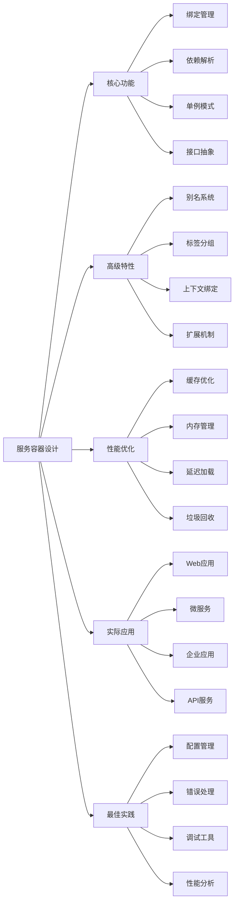

# 如何设计一个优雅的服务容器？

## 概要回答

一个优雅的服务容器应该具备以下特性：自动依赖解析、单例管理、延迟加载、接口绑定、上下文绑定、扩展机制、标签分组等。设计时需要考虑性能优化、内存管理、错误处理和易用性，通过合理的架构设计和接口抽象，提供简洁而强大的依赖注入功能。

## 深度解析

### 服务容器核心功能

#### 1. 基础容器架构
```php
<?php
// 容器接口定义
interface ContainerInterface {
    public function bind($abstract, $concrete = null);
    public function singleton($abstract, $concrete = null);
    public function resolve($abstract);
    public function has($abstract);
}

// 容器异常类
class ContainerException extends Exception {}
class NotFoundException extends ContainerException {}

// 基础容器实现
class ElegantContainer implements ContainerInterface {
    protected $bindings = [];
    protected $instances = [];
    protected $aliases = [];
    protected $tags = [];
    
    /**
     * 绑定抽象到具体实现
     */
    public function bind($abstract, $concrete = null) {
        if ($concrete === null) {
            $concrete = $abstract;
        }
        
        $this->bindings[$abstract] = [
            'concrete' => $concrete,
            'shared' => false
        ];
        
        return $this;
    }
    
    /**
     * 绑定单例
     */
    public function singleton($abstract, $concrete = null) {
        if ($concrete === null) {
            $concrete = $abstract;
        }
        
        $this->bindings[$abstract] = [
            'concrete' => $concrete,
            'shared' => true
        ];
        
        return $this;
    }
    
    /**
     * 解析服务
     */
    public function resolve($abstract) {
        // 检查别名
        $abstract = $this->getAlias($abstract);
        
        // 检查单例实例
        if (isset($this->instances[$abstract])) {
            return $this->instances[$abstract];
        }
        
        // 获取绑定信息
        $binding = $this->getBinding($abstract);
        
        if ($binding === null) {
            // 没有绑定，尝试自动解析
            $object = $this->build($abstract);
        } else {
            $concrete = $binding['concrete'];
            
            // 处理闭包
            if ($concrete instanceof Closure) {
                $object = $concrete($this);
            } else {
                // 构建对象
                $object = $this->build($concrete);
            }
            
            // 如果是单例，保存实例
            if ($binding['shared']) {
                $this->instances[$abstract] = $object;
            }
        }
        
        return $object;
    }
    
    /**
     * 检查服务是否存在
     */
    public function has($abstract) {
        return isset($this->bindings[$abstract]) || 
               isset($this->aliases[$abstract]) || 
               class_exists($abstract);
    }
    
    /**
     * 获取绑定信息
     */
    protected function getBinding($abstract) {
        if (isset($this->bindings[$abstract])) {
            return $this->bindings[$abstract];
        }
        
        return null;
    }
    
    /**
     * 构建对象
     */
    protected function build($concrete) {
        // 如果已经是对象实例，直接返回
        if ($concrete instanceof Closure || !is_string($concrete)) {
            return $concrete;
        }
        
        try {
            $reflector = new ReflectionClass($concrete);
        } catch (ReflectionException $e) {
            throw new NotFoundException("Target class [$concrete] does not exist.");
        }
        
        // 检查是否可以实例化
        if (!$reflector->isInstantiable()) {
            throw new ContainerException("Target [$concrete] is not instantiable.");
        }
        
        // 获取构造函数
        $constructor = $reflector->getConstructor();
        
        // 如果没有构造函数，直接创建实例
        if ($constructor === null) {
            return new $concrete;
        }
        
        // 解析构造函数参数
        $parameters = $constructor->getParameters();
        $dependencies = $this->resolveDependencies($parameters);
        
        return $reflector->newInstanceArgs($dependencies);
    }
    
    /**
     * 解析依赖
     */
    protected function resolveDependencies(array $parameters) {
        $dependencies = [];
        
        foreach ($parameters as $parameter) {
            // 获取参数类型
            $type = $parameter->getType();
            
            // 如果没有类型提示
            if ($type === null) {
                // 检查是否有默认值
                if ($parameter->isDefaultValueAvailable()) {
                    $dependencies[] = $parameter->getDefaultValue();
                } else {
                    $name = $parameter->getName();
                    throw new ContainerException("Unresolvable dependency [$name].");
                }
                continue;
            }
            
            // 解析类型提示的依赖
            $typeName = $type->getName();
            $dependencies[] = $this->resolve($typeName);
        }
        
        return $dependencies;
    }
    
    /**
     * 获取别名
     */
    protected function getAlias($abstract) {
        return isset($this->aliases[$abstract]) ? $this->aliases[$abstract] : $abstract;
    }
}
?>
```

### 高级容器特性

#### 1. 别名和标签系统
```php
<?php
class AdvancedContainer extends ElegantContainer {
    /**
     * 设置别名
     */
    public function alias($abstract, $alias) {
        $this->aliases[$alias] = $abstract;
        return $this;
    }
    
    /**
     * 标签绑定
     */
    public function tag($abstracts, $tag) {
        $abstracts = is_array($abstracts) ? $abstracts : [$abstracts];
        
        foreach ($abstracts as $abstract) {
            if (!isset($this->tags[$tag])) {
                $this->tags[$tag] = [];
            }
            
            $this->tags[$tag][] = $abstract;
        }
        
        return $this;
    }
    
    /**
     * 获取标签组
     */
    public function tagged($tag) {
        if (!isset($this->tags[$tag])) {
            return [];
        }
        
        return array_map([$this, 'resolve'], $this->tags[$tag]);
    }
    
    /**
     * 扩展服务
     */
    public function extend($abstract, Closure $closure) {
        $abstract = $this->getAlias($abstract);
        
        if (!isset($this->bindings[$abstract])) {
            throw new ContainerException("Service [$abstract] is not bound.");
        }
        
        $original = $this->bindings[$abstract]['concrete'];
        
        $this->bindings[$abstract]['concrete'] = function($container) use ($original, $closure) {
            return $closure($container->resolve($original), $container);
        };
        
        // 清除现有实例
        unset($this->instances[$abstract]);
        
        return $this;
    }
    
    /**
     * 上下文绑定
     */
    public function when($concrete) {
        return new ContextualBindingBuilder($this, $concrete);
    }
    
    /**
     * 获取所有绑定
     */
    public function getBindings() {
        return $this->bindings;
    }
    
    /**
     * 清除实例
     */
    public function forgetInstance($abstract) {
        unset($this->instances[$abstract]);
        return $this;
    }
    
    /**
     * 清除所有实例
     */
    public function forgetInstances() {
        $this->instances = [];
        return $this;
    }
}

class ContextualBindingBuilder {
    protected $container;
    protected $concrete;
    protected $needs;
    
    public function __construct(AdvancedContainer $container, $concrete) {
        $this->container = $container;
        $this->concrete = $concrete;
    }
    
    public function needs($abstract) {
        $this->needs = $abstract;
        return $this;
    }
    
    public function give($implementation) {
        $this->container->bindings["{$this->concrete}->{$this->needs}"] = [
            'concrete' => $implementation,
            'shared' => false
        ];
        
        return $this->container;
    }
}
?>
```

#### 2. 延迟加载和工厂模式
```php
<?php
class LazyLoadingContainer extends AdvancedContainer {
    protected $deferred = [];
    
    /**
     * 延迟绑定
     */
    public function defer($abstract, $concrete = null) {
        if ($concrete === null) {
            $concrete = $abstract;
        }
        
        $this->deferred[$abstract] = $concrete;
        return $this;
    }
    
    /**
     * 工厂模式绑定
     */
    public function factory($abstract, Closure $factory) {
        $this->bindings[$abstract] = [
            'concrete' => $factory,
            'shared' => false
        ];
        
        return $this;
    }
    
    /**
     * 重写解析方法支持延迟加载
     */
    public function resolve($abstract) {
        // 检查延迟绑定
        if (isset($this->deferred[$abstract]) && !isset($this->bindings[$abstract])) {
            $this->bindDeferred($abstract);
        }
        
        return parent::resolve($abstract);
    }
    
    /**
     * 绑定延迟服务
     */
    protected function bindDeferred($abstract) {
        $concrete = $this->deferred[$abstract];
        
        if ($concrete instanceof Closure) {
            $this->bind($abstract, $concrete);
        } else {
            // 自动绑定
            $this->bind($abstract, $concrete);
        }
        
        // 移除延迟绑定
        unset($this->deferred[$abstract]);
    }
    
    /**
     * 预加载服务
     */
    public function preload($abstracts) {
        $abstracts = is_array($abstracts) ? $abstracts : [$abstracts];
        
        foreach ($abstracts as $abstract) {
            if (isset($this->deferred[$abstract])) {
                $this->resolve($abstract);
            }
        }
        
        return $this;
    }
}

// 工厂模式示例
class DatabaseConnectionFactory {
    public function make($config) {
        $driver = $config['driver'] ?? 'mysql';
        
        switch ($driver) {
            case 'mysql':
                return new MySQLDatabase($config);
            case 'postgresql':
                return new PostgreSQLDatabase($config);
            case 'sqlite':
                return new SQLiteDatabase($config);
            default:
                throw new InvalidArgumentException("Unsupported database driver: {$driver}");
        }
    }
}

// 使用示例
$container = new LazyLoadingContainer();

// 工厂绑定
$container->factory('database.connection', function($container) {
    $config = $container->resolve('config')->get('database');
    $factory = $container->resolve(DatabaseConnectionFactory::class);
    return $factory->make($config);
});

// 延迟绑定
$container->defer('heavy.service', function($container) {
    return new HeavyService(
        $container->resolve('dependency.a'),
        $container->resolve('dependency.b')
    );
});
?>
```

### 性能优化和内存管理

#### 1. 缓存和优化
```php
<?php
class OptimizedContainer extends LazyLoadingContainer {
    protected $cache = [];
    protected $reflectionCache = [];
    protected $buildStack = [];
    
    /**
     * 带缓存的解析
     */
    public function resolve($abstract) {
        // 检查缓存
        if (isset($this->cache[$abstract])) {
            return $this->cache[$abstract];
        }
        
        $object = parent::resolve($abstract);
        
        // 缓存非单例对象（可配置）
        if ($this->shouldCache($abstract)) {
            $this->cache[$abstract] = $object;
        }
        
        return $object;
    }
    
    /**
     * 判断是否应该缓存
     */
    protected function shouldCache($abstract) {
        $binding = $this->getBinding($abstract);
        return $binding && !$binding['shared'];
    }
    
    /**
     * 优化的依赖解析
     */
    protected function resolveDependencies(array $parameters) {
        $dependencies = [];
        
        foreach ($parameters as $parameter) {
            $type = $parameter->getType();
            
            if ($type === null) {
                if ($parameter->isDefaultValueAvailable()) {
                    $dependencies[] = $parameter->getDefaultValue();
                } else {
                    throw new ContainerException("Unresolvable dependency.");
                }
                continue;
            }
            
            $typeName = $type->getName();
            
            // 检查构建栈防止循环依赖
            if (in_array($typeName, $this->buildStack)) {
                throw new ContainerException("Circular dependency detected: " . implode(' -> ', $this->buildStack) . " -> {$typeName}");
            }
            
            // 缓存反射信息
            if (!isset($this->reflectionCache[$typeName])) {
                $this->reflectionCache[$typeName] = $typeName;
            }
            
            $dependencies[] = $this->resolve($typeName);
        }
        
        return $dependencies;
    }
    
    /**
     * 清除缓存
     */
    public function clearCache() {
        $this->cache = [];
        $this->reflectionCache = [];
        return $this;
    }
    
    /**
     * 获取缓存统计
     */
    public function getCacheStats() {
        return [
            'cached_objects' => count($this->cache),
            'reflection_cache' => count($this->reflectionCache),
            'memory_usage' => memory_get_usage()
        ];
    }
}
?>
```

#### 2. 内存管理
```php
<?php
class MemoryManagedContainer extends OptimizedContainer {
    protected $memoryLimit;
    protected $gcThreshold = 100; // 垃圾回收阈值
    protected $resolveCount = 0;
    
    public function __construct($memoryLimit = null) {
        $this->memoryLimit = $memoryLimit ?: ini_get('memory_limit');
        parent::__construct();
    }
    
    /**
     * 重写解析方法添加内存管理
     */
    public function resolve($abstract) {
        $this->resolveCount++;
        
        // 检查内存使用
        if ($this->shouldTriggerGC()) {
            $this->garbageCollect();
        }
        
        // 检查内存限制
        if ($this->isMemoryLimitExceeded()) {
            throw new ContainerException("Memory limit exceeded while resolving {$abstract}");
        }
        
        return parent::resolve($abstract);
    }
    
    /**
     * 判断是否应该触发垃圾回收
     */
    protected function shouldTriggerGC() {
        return $this->resolveCount % $this->gcThreshold === 0;
    }
    
    /**
     * 垃圾回收
     */
    protected function garbageCollect() {
        // 清理临时缓存
        if (count($this->cache) > 1000) {
            $this->cache = array_slice($this->cache, -500, null, true);
        }
        
        // 强制垃圾回收
        gc_collect_cycles();
    }
    
    /**
     * 检查内存限制
     */
    protected function isMemoryLimitExceeded() {
        $limit = $this->parseMemoryLimit($this->memoryLimit);
        return memory_get_usage() > ($limit * 0.8); // 使用80%作为警告阈值
    }
    
    /**
     * 解析内存限制
     */
    protected function parseMemoryLimit($limit) {
        $limit = trim($limit);
        $last = strtolower($limit[strlen($limit)-1]);
        $limit = (int) $limit;
        
        switch($last) {
            case 'g':
                $limit *= 1024;
            case 'm':
                $limit *= 1024;
            case 'k':
                $limit *= 1024;
        }
        
        return $limit;
    }
    
    /**
     * 限制缓存大小
     */
    public function setCacheLimit($limit) {
        $this->cacheLimit = $limit;
        return $this;
    }
}
?>
```

### 实际应用示例

#### 1. Web应用容器配置
```php
<?php
class WebApplicationContainer extends MemoryManagedContainer {
    public function __construct() {
        parent::__construct();
        $this->registerCoreServices();
    }
    
    /**
     * 注册核心服务
     */
    protected function registerCoreServices() {
        // 配置服务
        $this->singleton('config', function() {
            return new ConfigRepository([
                'database' => [
                    'driver' => 'mysql',
                    'host' => getenv('DB_HOST') ?: 'localhost',
                    'database' => getenv('DB_NAME') ?: 'app',
                    'username' => getenv('DB_USER') ?: 'root',
                    'password' => getenv('DB_PASS') ?: ''
                ],
                'cache' => [
                    'driver' => 'redis',
                    'host' => getenv('REDIS_HOST') ?: 'localhost'
                ]
            ]);
        });
        
        // 数据库服务
        $this->singleton('database', function($container) {
            $config = $container->resolve('config')->get('database');
            return new MySQLDatabase(
                $config['host'],
                $config['database'],
                $config['username'],
                $config['password']
            );
        });
        
        // 缓存服务
        $this->singleton('cache', function($container) {
            $config = $container->resolve('config')->get('cache');
            if ($config['driver'] === 'redis') {
                return new RedisCache(new Redis($config['host']));
            }
            return new FileCache('/tmp/cache');
        });
        
        // 日志服务
        $this->singleton('logger', function($container) {
            $logger = new Monolog\Logger('app');
            $logger->pushHandler(new Monolog\Handler\StreamHandler('/var/log/app.log'));
            return $logger;
        });
        
        // 设置别名
        $this->alias('config', 'configs');
        $this->alias('database', 'db');
        $this->alias('logger', 'log');
        
        // 标签分组
        $this->tag(['database', 'cache', 'logger'], 'core.services');
    }
    
    /**
     * 批量解析服务
     */
    public function makeMany($abstracts) {
        $services = [];
        foreach ($abstracts as $abstract) {
            $services[$abstract] = $this->resolve($abstract);
        }
        return $services;
    }
    
    /**
     * 服务提供者模式
     */
    public function register($provider) {
        if (is_string($provider)) {
            $provider = $this->resolve($provider);
        }
        
        if (method_exists($provider, 'register')) {
            $provider->register($this);
        }
        
        return $this;
    }
}

// 配置类
class ConfigRepository {
    protected $items = [];
    
    public function __construct(array $items = []) {
        $this->items = $items;
    }
    
    public function get($key, $default = null) {
        return $this->items[$key] ?? $default;
    }
    
    public function set($key, $value) {
        $this->items[$key] = $value;
    }
}

// 服务提供者基类
abstract class ServiceProvider {
    protected $container;
    
    public function register($container) {
        $this->container = $container;
        $this->registerServices();
    }
    
    abstract protected function registerServices();
}

// 数据库服务提供者
class DatabaseServiceProvider extends ServiceProvider {
    protected function registerServices() {
        $this->container->singleton('database.connection', function($container) {
            $config = $container->resolve('config')->get('database');
            return new PDO(
                "mysql:host={$config['host']};dbname={$config['database']}",
                $config['username'],
                $config['password']
            );
        });
    }
}
?>
```

#### 2. 微服务容器
```php
<?php
class MicroserviceContainer extends WebApplicationContainer {
    /**
     * 注册微服务特定服务
     */
    protected function registerCoreServices() {
        parent::registerCoreServices();
        
        // HTTP客户端
        $this->singleton('http.client', function() {
            return new GuzzleHttp\Client([
                'timeout' => 5.0,
                'headers' => [
                    'User-Agent' => 'Microservice-Client/1.0'
                ]
            ]);
        });
        
        // 消息队列
        $this->singleton('queue', function($container) {
            $config = $container->resolve('config')->get('queue', []);
            return new RedisQueue(
                $container->resolve('redis'),
                $config['queue_name'] ?? 'default'
            );
        });
        
        // 服务发现
        $this->singleton('service.discovery', function($container) {
            return new ConsulServiceDiscovery(
                $container->resolve('http.client'),
                getenv('CONSUL_HOST') ?: 'localhost:8500'
            );
        });
        
        // 标签分组
        $this->tag(['http.client', 'queue', 'service.discovery'], 'microservice.services');
    }
    
    /**
     * 健康检查
     */
    public function healthCheck() {
        $checks = [];
        
        // 检查数据库连接
        try {
            $db = $this->resolve('database');
            $checks['database'] = $db->isConnected();
        } catch (Exception $e) {
            $checks['database'] = false;
        }
        
        // 检查缓存连接
        try {
            $cache = $this->resolve('cache');
            $checks['cache'] = $cache->isAvailable();
        } catch (Exception $e) {
            $checks['cache'] = false;
        }
        
        return $checks;
    }
    
    /**
     * 获取服务统计
     */
    public function getServiceStats() {
        return [
            'total_bindings' => count($this->bindings),
            'total_instances' => count($this->instances),
            'total_aliases' => count($this->aliases),
            'memory_usage' => memory_get_usage(),
            'resolve_count' => $this->resolveCount
        ];
    }
}
?>
```

### 容器最佳实践

#### 1. 配置和使用
```php
<?php
// 容器配置文件
class ContainerConfiguration {
    public static function configure($container) {
        // 基础配置
        $container->bind('app.name', 'My Application');
        $container->bind('app.version', '1.0.0');
        $container->bind('app.environment', getenv('APP_ENV') ?: 'production');
        
        // 条件绑定
        if (getenv('APP_ENV') === 'testing') {
            $container->singleton(LoggerInterface::class, TestLogger::class);
        } else {
            $container->singleton(LoggerInterface::class, FileLogger::class);
        }
        
        // 扩展服务
        $container->extend(LoggerInterface::class, function($logger, $container) {
            $logger->setLevel(getenv('LOG_LEVEL') ?: 'info');
            return $logger;
        });
        
        // 上下文绑定
        $container->when(UserController::class)
                  ->needs(LoggerInterface::class)
                  ->give(UserActivityLogger::class);
                  
        $container->when(OrderController::class)
                  ->needs(LoggerInterface::class)
                  ->give(OrderLogger::class);
        
        return $container;
    }
}

// 使用示例
$container = new MicroserviceContainer();
ContainerConfiguration::configure($container);

// 解析服务
$database = $container->resolve('database');
$logger = $container->resolve(LoggerInterface::class);

// 批量解析
$services = $container->makeMany(['database', 'cache', 'logger']);

// 健康检查
$health = $container->healthCheck();
if (!array_filter($health, function($status) { return !$status; })) {
    echo "All services are healthy\n";
}
?>
```

#### 2. 错误处理和调试
```php
<?php
class DebuggableContainer extends MicroserviceContainer {
    protected $resolutionLog = [];
    protected $debugMode = false;
    
    public function __construct($debugMode = false) {
        $this->debugMode = $debugMode;
        parent::__construct();
    }
    
    /**
     * 重写解析方法添加调试信息
     */
    public function resolve($abstract) {
        $startTime = microtime(true);
        
        try {
            $result = parent::resolve($abstract);
            
            if ($this->debugMode) {
                $this->logResolution($abstract, microtime(true) - $startTime, 'success');
            }
            
            return $result;
        } catch (Exception $e) {
            if ($this->debugMode) {
                $this->logResolution($abstract, microtime(true) - $startTime, 'error', $e->getMessage());
            }
            
            throw $e;
        }
    }
    
    /**
     * 记录解析日志
     */
    protected function logResolution($abstract, $duration, $status, $error = null) {
        $this->resolutionLog[] = [
            'abstract' => $abstract,
            'duration' => $duration,
            'status' => $status,
            'error' => $error,
            'timestamp' => microtime(true)
        ];
        
        // 限制日志大小
        if (count($this->resolutionLog) > 1000) {
            $this->resolutionLog = array_slice($this->resolutionLog, -500);
        }
    }
    
    /**
     * 获取解析日志
     */
    public function getResolutionLog() {
        return $this->resolutionLog;
    }
    
    /**
     * 分析性能瓶颈
     */
    public function analyzePerformance() {
        $slowResolutions = array_filter($this->resolutionLog, function($log) {
            return $log['duration'] > 0.1; // 超过100ms的解析
        });
        
        return [
            'total_resolutions' => count($this->resolutionLog),
            'slow_resolutions' => count($slowResolutions),
            'average_duration' => count($this->resolutionLog) > 0 ? 
                array_sum(array_column($this->resolutionLog, 'duration')) / count($this->resolutionLog) : 0,
            'slowest_resolutions' => array_slice(
                array_filter($this->resolutionLog, function($log) { return $log['status'] === 'success'; }),
                0,
                10
            )
        ];
    }
}
?>
```

## 图示说明



通过以上设计，我们可以创建一个功能完备、性能优秀、易于使用的服务容器，为应用程序提供强大的依赖注入和管理能力。