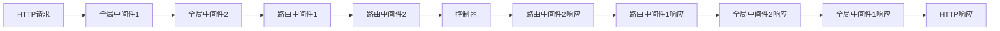
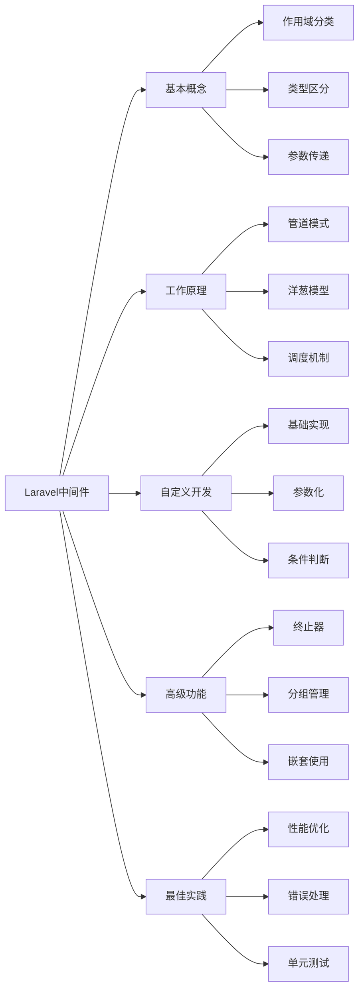

# Laravel中间件的原理是什么？如何自定义中间件？

## 概要回答

Laravel中间件是一种过滤机制，用于在HTTP请求到达路由或控制器之前对其进行预处理，或在响应返回给客户端之前进行后处理。中间件遵循管道模式，通过洋葱模型逐层处理请求。自定义中间件需要实现handle方法，可以选择在请求前或响应后执行逻辑，并通过参数传递和依赖注入增强功能。

## 深度解析

### Laravel中间件基本概念

#### 1. 中间件的作用和类型
```php
<?php
// Laravel中间件示例
namespace App\Http\Middleware;

use Closure;
use Illuminate\Http\Request;

class ExampleMiddleware
{
    /**
     * Handle an incoming request.
     *
     * @param  \Illuminate\Http\Request  $request
     * @param  \Closure  $next
     * @return mixed
     */
    public function handle(Request $request, Closure $next)
    {
        // 请求前处理
        // 例如：验证、认证、日志记录等
        
        $response = $next($request);
        
        // 响应后处理
        // 例如：修改响应头、压缩内容等
        
        return $response;
    }
}

// 全局中间件 - 应用于所有路由
class GlobalMiddleware
{
    public function handle(Request $request, Closure $next)
    {
        // 记录所有请求日志
        \Log::info('Global middleware processing request', [
            'url' => $request->url(),
            'method' => $request->method(),
            'ip' => $request->ip()
        ]);
        
        return $next($request);
    }
}

// 路由中间件 - 仅应用于特定路由
class AuthMiddleware
{
    public function handle(Request $request, Closure $next)
    {
        // 检查用户是否认证
        if (!auth()->check()) {
            return redirect('login');
        }
        
        return $next($request);
    }
}

// 参数化中间件
class RoleMiddleware
{
    public function handle(Request $request, Closure $next, $role)
    {
        // 检查用户角色
        if (auth()->user()->role !== $role) {
            abort(403, 'Unauthorized action.');
        }
        
        return $next($request);
    }
}
?>
```

#### 中间件工作原理图解


### 中间件管道和洋葱模型

#### 1. 管道模式实现
```php
<?php
// 简化的中间件管道实现
class Pipeline
{
    protected $pipes = [];
    protected $passable;
    
    public function send($passable)
    {
        $this->passable = $passable;
        return $this;
    }
    
    public function through($pipes)
    {
        $this->pipes = is_array($pipes) ? $pipes : func_get_args();
        return $this;
    }
    
    public function then(Closure $destination)
    {
        $pipeline = array_reduce(
            array_reverse($this->pipes), 
            $this->carry(), 
            $destination
        );
        
        return $pipeline($this->passable);
    }
    
    protected function carry()
    {
        return function ($stack, $pipe) {
            return function ($passable) use ($stack, $pipe) {
                // 检查是否为可调用对象
                if (is_callable($pipe)) {
                    return $pipe($passable, $stack);
                }
                
                // 处理类中间件
                if (is_string($pipe)) {
                    $pipe = app($pipe);
                }
                
                // 调用中间件的handle方法
                $response = $pipe->handle($passable, $stack);
                
                return $response;
            };
        };
    }
}

// 使用示例
$pipeline = new Pipeline();

$response = $pipeline->send($request)
    ->through([
        \App\Http\Middleware\FirstMiddleware::class,
        \App\Http\Middleware\SecondMiddleware::class,
        \App\Http\Middleware\ThirdMiddleware::class,
    ])
    ->then(function ($request) {
        // 最终处理逻辑（如控制器方法）
        return response('Hello World');
    });
?>
```

#### 2. 洋葱模型详解
```php
<?php
// 洋葱模型中间件示例
class OnionMiddleware
{
    public function handle($request, Closure $next)
    {
        echo "Outer Middleware - Before\n";
        
        // 执行下一个中间件
        $response = $next($request);
        
        echo "Outer Middleware - After\n";
        
        return $response;
    }
}

class InnerMiddleware
{
    public function handle($request, Closure $next)
    {
        echo "Inner Middleware - Before\n";
        
        // 执行下一个中间件
        $response = $next($request);
        
        echo "Inner Middleware - After\n";
        
        return $response;
    }
}

// 执行顺序示例
/*
输出结果：
Outer Middleware - Before
Inner Middleware - Before
Controller Logic
Inner Middleware - After
Outer Middleware - After
*/
?>
```

### Laravel中间件系统实现

#### 1. 中间件注册和配置
```php
<?php
// app/Http/Kernel.php
namespace App\Http;

use Illuminate\Foundation\Http\Kernel as HttpKernel;

class Kernel extends HttpKernel
{
    /**
     * 全局中间件
     */
    protected $middleware = [
        \App\Http\Middleware\TrustProxies::class,
        \App\Http\Middleware\PreventRequestsDuringMaintenance::class,
        \Illuminate\Foundation\Http\Middleware\ValidatePostSize::class,
        \App\Http\Middleware\TrimStrings::class,
        \Illuminate\Foundation\Http\Middleware\ConvertEmptyStringsToNull::class,
    ];

    /**
     * 路由中间件组
     */
    protected $middlewareGroups = [
        'web' => [
            \App\Http\Middleware\EncryptCookies::class,
            \Illuminate\Cookie\Middleware\AddQueuedCookiesToResponse::class,
            \Illuminate\Session\Middleware\StartSession::class,
            \Illuminate\View\Middleware\ShareErrorsFromSession::class,
            \App\Http\Middleware\VerifyCsrfToken::class,
            \Illuminate\Routing\Middleware\SubstituteBindings::class,
        ],

        'api' => [
            'throttle:api',
            \Illuminate\Routing\Middleware\SubstituteBindings::class,
        ],
    ];

    /**
     * 路由中间件别名
     */
    protected $routeMiddleware = [
        'auth' => \App\Http\Middleware\Authenticate::class,
        'auth.basic' => \Illuminate\Auth\Middleware\AuthenticateWithBasicAuth::class,
        'cache.headers' => \Illuminate\Http\Middleware\SetCacheHeaders::class,
        'can' => \Illuminate\Auth\Middleware\Authorize::class,
        'guest' => \App\Http\Middleware\RedirectIfAuthenticated::class,
        'password.confirm' => \Illuminate\Auth\Middleware\RequirePassword::class,
        'signed' => \Illuminate\Routing\Middleware\ValidateSignature::class,
        'throttle' => \Illuminate\Routing\Middleware\ThrottleRequests::class,
        'verified' => \Illuminate\Auth\Middleware\EnsureEmailIsVerified::class,
        // 自定义中间件
        'role' => \App\Http\Middleware\CheckRole::class,
        'permission' => \App\Http\Middleware\CheckPermission::class,
    ];
}
?>
```

#### 2. 中间件调度器
```php
<?php
// Illuminate\Routing\Router 中间件处理
namespace Illuminate\Routing;

class Router
{
    protected $middlewarePriority = [
        \Illuminate\Session\Middleware\StartSession::class,
        \Illuminate\View\Middleware\ShareErrorsFromSession::class,
        \App\Http\Middleware\Authenticate::class,
        \Illuminate\Routing\Middleware\SubstituteBindings::class,
        \Illuminate\Auth\Middleware\Authorize::class,
    ];
    
    public function gatherRouteMiddleware(Route $route)
    {
        $middleware = collect($route->middleware())->map(function ($name) {
            return (array) MiddlewareNameResolver::resolve($name, $this->middleware);
        })->flatten();
        
        // 根据优先级排序
        return $this->sortMiddleware($middleware);
    }
    
    protected function sortMiddleware(Collection $middlewares)
    {
        return (new SortedMiddleware($this->middlewarePriority, $middlewares))->all();
    }
}

// 中间件名称解析器
class MiddlewareNameResolver
{
    public static function resolve($name, $map)
    {
        if (isset($map[$name]) && $name !== $map[$name]) {
            return static::resolve($map[$name], $map);
        }
        
        return $name;
    }
}
?>
```

### 自定义中间件开发

#### 1. 基础中间件实现
```php
<?php
// 创建自定义中间件
namespace App\Http\Middleware;

use Closure;
use Illuminate\Http\Request;
use Illuminate\Support\Facades\Log;

class RequestLogger
{
    /**
     * Handle an incoming request.
     *
     * @param  \Illuminate\Http\Request  $request
     * @param  \Closure  $next
     * @return mixed
     */
    public function handle(Request $request, Closure $next)
    {
        // 请求开始时间
        $startTime = microtime(true);
        
        // 记录请求信息
        Log::info('Request received', [
            'url' => $request->fullUrl(),
            'method' => $request->method(),
            'ip' => $request->ip(),
            'user_agent' => $request->userAgent(),
            'referer' => $request->header('referer'),
        ]);
        
        // 继续处理请求
        $response = $next($request);
        
        // 计算处理时间
        $duration = (microtime(true) - $startTime) * 1000;
        
        // 记录响应信息
        Log::info('Request processed', [
            'url' => $request->fullUrl(),
            'status' => $response->status(),
            'duration_ms' => round($duration, 2),
            'memory_peak' => round(memory_get_peak_usage(true) / 1024 / 1024, 2) . 'MB'
        ]);
        
        return $response;
    }
}
?>
```

#### 2. 参数化中间件
```php
<?php
// 带参数的中间件
namespace App\Http\Middleware;

use Closure;
use Illuminate\Http\Request;

class ThrottleByRole
{
    /**
     * Handle an incoming request.
     *
     * @param  \Illuminate\Http\Request  $request
     * @param  \Closure  $next
     * @param  string  $role
     * @param  int  $maxAttempts
     * @param  int  $decayMinutes
     * @return mixed
     */
    public function handle(Request $request, Closure $next, $role, $maxAttempts = 60, $decayMinutes = 1)
    {
        // 检查用户角色
        if (auth()->check() && auth()->user()->role === $role) {
            // 为不同角色设置不同的限流规则
            $key = 'throttle:' . $role . ':' . $request->ip();
            
            // 检查是否超过限制
            if ($this->tooManyAttempts($key, $maxAttempts, $decayMinutes)) {
                return $this->buildResponse($key, $maxAttempts);
            }
            
            // 增加尝试次数
            $this->hit($key, $decayMinutes);
        }
        
        return $next($request);
    }
    
    /**
     * 检查尝试次数
     */
    protected function tooManyAttempts($key, $maxAttempts, $decayMinutes)
    {
        $attempts = cache()->get($key, 0);
        return $attempts >= $maxAttempts;
    }
    
    /**
     * 增加尝试次数
     */
    protected function hit($key, $decayMinutes)
    {
        if (cache()->has($key)) {
            cache()->increment($key);
        } else {
            cache()->put($key, 1, now()->addMinutes($decayMinutes));
        }
    }
    
    /**
     * 构建响应
     */
    protected function buildResponse($key, $maxAttempts)
    {
        $retryAfter = cache()->ttl($key);
        
        return response()->json([
            'error' => 'Too Many Requests',
            'message' => 'Rate limit exceeded for your role'
        ], 429)->header('Retry-After', $retryAfter);
    }
}

// 路由中使用参数化中间件
// Route::get('/admin/dashboard', [AdminController::class, 'dashboard'])
//      ->middleware('throttle.role:admin,100,5'); // admin角色每5分钟最多100次请求
?>
```

#### 3. 条件中间件
```php
<?php
// 条件中间件
namespace App\Http\Middleware;

use Closure;
use Illuminate\Http\Request;

class ConditionalMiddleware
{
    /**
     * Handle an incoming request.
     *
     * @param  \Illuminate\Http\Request  $request
     * @param  \Closure  $next
     * @param  string  $condition
     * @return mixed
     */
    public function handle(Request $request, Closure $next, $condition = null)
    {
        // 根据条件决定是否应用中间件
        if ($this->shouldApply($request, $condition)) {
            return $this->applyMiddleware($request, $next);
        }
        
        return $next($request);
    }
    
    /**
     * 判断是否应该应用中间件
     */
    protected function shouldApply(Request $request, $condition)
    {
        switch ($condition) {
            case 'ajax':
                return $request->ajax();
            case 'api':
                return $request->is('api/*');
            case 'mobile':
                return $this->isMobileRequest($request);
            case 'working_hours':
                return $this->isWorkingHours();
            default:
                return true;
        }
    }
    
    /**
     * 应用中间件逻辑
     */
    protected function applyMiddleware(Request $request, Closure $next)
    {
        // 中间件的具体逻辑
        // 例如：添加安全头、压缩响应等
        $response = $next($request);
        
        // 添加安全相关的响应头
        $response->headers->set('X-Content-Type-Options', 'nosniff');
        $response->headers->set('X-Frame-Options', 'DENY');
        $response->headers->set('X-XSS-Protection', '1; mode=block');
        
        return $response;
    }
    
    /**
     * 检查是否为移动设备请求
     */
    protected function isMobileRequest(Request $request)
    {
        $userAgent = $request->userAgent();
        $mobileKeywords = ['Mobile', 'Android', 'iPhone', 'iPad'];
        
        foreach ($mobileKeywords as $keyword) {
            if (strpos($userAgent, $keyword) !== false) {
                return true;
            }
        }
        
        return false;
    }
    
    /**
     * 检查是否为工作时间
     */
    protected function isWorkingHours()
    {
        $hour = date('H');
        return $hour >= 9 && $hour < 18; // 9AM - 6PM
    }
}
?>
```

### 高级中间件功能

#### 1. 中间件终止器（Terminable Middleware）
```php
<?php
// 可终止的中间件
namespace App\Http\Middleware;

use Closure;
use Illuminate\Http\Request;
use Symfony\Component\HttpFoundation\Response;

class TerminableMiddleware
{
    /**
     * Handle an incoming request.
     *
     * @param  \Illuminate\Http\Request  $request
     * @param  \Closure  $next
     * @return mixed
     */
    public function handle(Request $request, Closure $next)
    {
        // 请求处理前的逻辑
        echo "Handling request...\n";
        
        return $next($request);
    }
    
    /**
     * 在响应发送到浏览器之后处理任务
     *
     * @param  \Illuminate\Http\Request  $request
     * @param  \Symfony\Component\HttpFoundation\Response  $response
     * @return void
     */
    public function terminate(Request $request, Response $response)
    {
        // 响应发送后的清理工作
        // 注意：此时无法修改响应内容
        
        // 例如：记录日志、清理资源、发送统计数据等
        \Log::info('Request terminated', [
            'url' => $request->fullUrl(),
            'status' => $response->status(),
            'response_time' => $response->headers->get('X-Response-Time')
        ]);
        
        // 清理临时文件
        $this->cleanupTempFiles();
        
        // 发送统计数据到监控系统
        $this->sendMetrics($request, $response);
    }
    
    /**
     * 清理临时文件
     */
    protected function cleanupTempFiles()
    {
        // 清理逻辑
    }
    
    /**
     * 发送指标数据
     */
    protected function sendMetrics(Request $request, Response $response)
    {
        // 发送到监控系统
    }
}
?>
```

#### 2. 中间件分组和嵌套
```php
<?php
// 中间件分组管理
namespace App\Http\Middleware;

class MiddlewareGroupManager
{
    protected $groups = [];
    
    /**
     * 定义中间件组
     */
    public function defineGroup($name, array $middleware)
    {
        $this->groups[$name] = $middleware;
    }
    
    /**
     * 获取中间件组
     */
    public function getGroup($name)
    {
        return $this->groups[$name] ?? [];
    }
    
    /**
     * 合并中间件组
     */
    public function mergeGroups(...$groupNames)
    {
        $merged = [];
        foreach ($groupNames as $groupName) {
            $merged = array_merge($merged, $this->getGroup($groupName));
        }
        return array_unique($merged);
    }
}

// 使用示例
$manager = new MiddlewareGroupManager();

// 定义安全相关中间件组
$manager->defineGroup('security', [
    \App\Http\Middleware\Cors::class,
    \App\Http\Middleware\SecurityHeaders::class,
    \App\Http\Middleware\XssProtection::class,
]);

// 定义性能相关中间件组
$manager->defineGroup('performance', [
    \App\Http\Middleware\Compression::class,
    \App\Http\Middleware\CacheControl::class,
    \App\Http\Middleware\Etag::class,
]);

// 合并多个中间件组
$routeMiddleware = $manager->mergeGroups('security', 'performance');

// 在路由中使用
// Route::middleware($routeMiddleware)->group(function () {
//     // 路由定义
// });
?>
```

### 中间件最佳实践

#### 1. 性能优化
```php
<?php
// 高性能中间件示例
namespace App\Http\Middleware;

use Closure;
use Illuminate\Http\Request;

class HighPerformanceMiddleware
{
    protected static $cache = [];
    
    public function handle(Request $request, Closure $next)
    {
        $key = $this->getRequestKey($request);
        
        // 检查缓存
        if (isset(static::$cache[$key])) {
            return static::$cache[$key];
        }
        
        // 处理请求
        $response = $next($request);
        
        // 缓存响应（仅适用于GET请求且无敏感数据）
        if ($request->isMethod('GET') && !$this->hasSensitiveData($response)) {
            static::$cache[$key] = $response;
        }
        
        return $response;
    }
    
    /**
     * 生成请求键
     */
    protected function getRequestKey(Request $request)
    {
        return md5($request->fullUrl() . serialize($request->query()));
    }
    
    /**
     * 检查响应是否包含敏感数据
     */
    protected function hasSensitiveData($response)
    {
        // 检查响应内容是否包含敏感关键词
        $content = $response->getContent();
        $sensitiveWords = ['password', 'token', 'secret'];
        
        foreach ($sensitiveWords as $word) {
            if (stripos($content, $word) !== false) {
                return true;
            }
        }
        
        return false;
    }
    
    /**
     * 清理缓存
     */
    public static function clearCache()
    {
        static::$cache = [];
    }
}
?>
```

#### 2. 错误处理和日志记录
```php
<?php
// 带错误处理的中间件
namespace App\Http\Middleware;

use Closure;
use Illuminate\Http\Request;
use Illuminate\Support\Facades\Log;
use Throwable;

class ErrorHandlingMiddleware
{
    public function handle(Request $request, Closure $next)
    {
        try {
            // 记录请求开始
            $startTime = microtime(true);
            $requestId = uniqid();
            
            Log::info('Request started', [
                'request_id' => $requestId,
                'url' => $request->fullUrl(),
                'method' => $request->method()
            ]);
            
            // 处理请求
            $response = $next($request);
            
            // 记录成功响应
            $duration = (microtime(true) - $startTime) * 1000;
            Log::info('Request completed successfully', [
                'request_id' => $requestId,
                'duration_ms' => round($duration, 2),
                'status' => $response->status()
            ]);
            
            return $response;
        } catch (Throwable $e) {
            // 记录错误
            Log::error('Request failed', [
                'request_id' => $requestId ?? uniqid(),
                'url' => $request->fullUrl(),
                'error' => $e->getMessage(),
                'trace' => $e->getTraceAsString()
            ]);
            
            // 返回适当的错误响应
            return response()->json([
                'error' => 'Internal Server Error',
                'message' => config('app.debug') ? $e->getMessage() : 'An error occurred'
            ], 500);
        }
    }
}
?>
```

#### 3. 测试中间件
```php
<?php
// PHPUnit测试中间件
namespace Tests\Unit\Middleware;

use Tests\TestCase;
use Illuminate\Http\Request;
use Illuminate\Http\Response;
use App\Http\Middleware\RequestLogger;

class RequestLoggerTest extends TestCase
{
    public function test_logs_request_and_response()
    {
        // 创建中间件实例
        $middleware = new RequestLogger();
        
        // 创建模拟请求
        $request = Request::create('/test', 'GET');
        
        // 创建测试闭包
        $next = function ($req) {
            return new Response('Test response', 200);
        };
        
        // 执行中间件
        $response = $middleware->handle($request, $next);
        
        // 验证响应
        $this->assertEquals(200, $response->status());
        $this->assertEquals('Test response', $response->getContent());
        
        // 验证日志（可以通过Mock或查看日志文件）
        // 这里简化处理，实际应该使用Mock或专门的日志测试工具
    }
    
    public function test_handles_exceptions_gracefully()
    {
        $middleware = new RequestLogger();
        $request = Request::create('/test', 'GET');
        
        // 创建会抛出异常的闭包
        $next = function ($req) {
            throw new \Exception('Test exception');
        };
        
        // 验证异常被捕获（如果中间件中有异常处理逻辑）
        // $this->expectException(\Exception::class);
        // $middleware->handle($request, $next);
    }
}
?>
```

## 图示说明



Laravel中间件是构建健壮Web应用的重要组件，通过合理的使用和自定义，可以极大地提升应用的安全性、性能和可维护性。