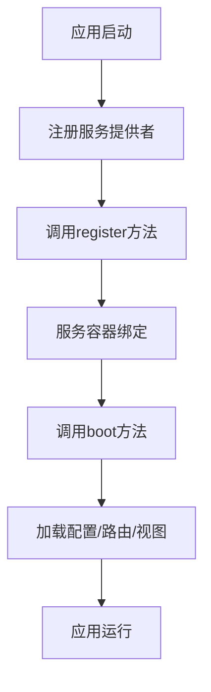
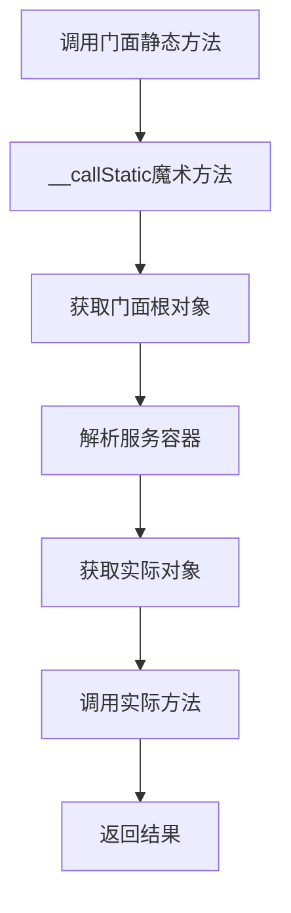
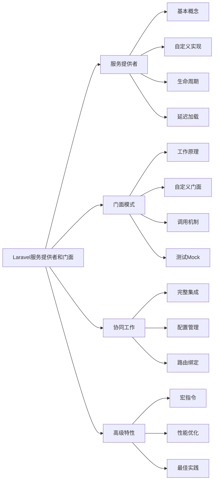

# 解释Laravel的服务提供者和门面模式？

## 概要回答

Laravel的服务提供者（Service Provider）是框架启动和配置的核心，负责注册服务容器绑定、事件监听器、中间件和路由等。门面模式（Facade）为应用的服务容器中的类提供了一个"静态"接口，使得可以在不引入和解析对象的情况下调用服务，提高了代码的简洁性和可读性。两者配合使用，实现了松耦合和高内聚的设计原则。

## 深度解析

### Laravel服务提供者（Service Provider）

#### 1. 服务提供者基本概念
```php
<?php
// 服务提供者基类
namespace Illuminate\Support\ServiceProvider;

abstract class ServiceProvider
{
    /**
     * 应用实例
     */
    protected $app;
    
    /**
     * 是否延迟加载
     */
    protected $defer = false;
    
    public function __construct($app)
    {
        $this->app = $app;
    }
    
    /**
     * 注册服务
     */
    public function register()
    {
        //
    }
    
    /**
     * 启动服务
     */
    public function boot()
    {
        //
    }
    
    /**
     * 指定提供者提供的服务
     */
    public function provides()
    {
        return [];
    }
}
?>
```

#### 2. 自定义服务提供者
```php
<?php
// 创建自定义服务提供者
namespace App\Providers;

use Illuminate\Support\ServiceProvider;
use App\Services\Payment\PaymentGateway;
use App\Services\Payment\StripePayment;
use App\Services\Payment\PayPalPayment;

class PaymentServiceProvider extends ServiceProvider
{
    /**
     * 是否延迟加载
     */
    protected $defer = true;
    
    /**
     * 注册服务
     */
    public function register()
    {
        // 绑定支付网关接口到具体实现
        $this->app->bind(
            'App\Services\Payment\PaymentGatewayInterface',
            function ($app) {
                $driver = config('payment.driver', 'stripe');
                
                switch ($driver) {
                    case 'paypal':
                        return new PayPalPayment(
                            config('payment.paypal.client_id'),
                            config('payment.paypal.secret')
                        );
                    case 'stripe':
                    default:
                        return new StripePayment(
                            config('payment.stripe.secret')
                        );
                }
            }
        );
        
        // 注册支付服务
        $this->app->singleton('payment', function ($app) {
            return new PaymentGateway(
                $app['App\Services\Payment\PaymentGatewayInterface']
            );
        });
        
        // 注册门面别名
        $this->app->alias('payment', 'App\Facades\Payment');
    }
    
    /**
     * 启动服务
     */
    public function boot()
    {
        // 发布配置文件
        $this->publishes([
            __DIR__.'/../Config/payment.php' => config_path('payment.php'),
        ], 'config');
        
        // 加载路由
        $this->loadRoutesFrom(__DIR__.'/../Routes/payment.php');
        
        // 加载视图
        $this->loadViewsFrom(__DIR__.'/../Views', 'payment');
        
        // 加载迁移文件
        $this->loadMigrationsFrom(__DIR__.'/../Migrations');
    }
    
    /**
     * 指定提供者提供的服务
     */
    public function provides()
    {
        return ['payment', 'App\Services\Payment\PaymentGatewayInterface'];
    }
}

// 支付服务接口和实现
namespace App\Services\Payment;

interface PaymentGatewayInterface
{
    public function charge($amount, $currency = 'USD');
    public function refund($transactionId, $amount = null);
    public function getTransactionDetails($transactionId);
}

class StripePayment implements PaymentGatewayInterface
{
    protected $secretKey;
    
    public function __construct($secretKey)
    {
        $this->secretKey = $secretKey;
        \Stripe\Stripe::setApiKey($secretKey);
    }
    
    public function charge($amount, $currency = 'USD')
    {
        try {
            $charge = \Stripe\Charge::create([
                'amount' => $amount * 100, // Stripe以分为单位
                'currency' => $currency,
            ]);
            
            return [
                'success' => true,
                'transaction_id' => $charge->id,
                'amount' => $amount,
                'currency' => $currency
            ];
        } catch (\Exception $e) {
            return [
                'success' => false,
                'error' => $e->getMessage()
            ];
        }
    }
    
    public function refund($transactionId, $amount = null)
    {
        try {
            $refundParams = ['charge' => $transactionId];
            if ($amount) {
                $refundParams['amount'] = $amount * 100;
            }
            
            $refund = \Stripe\Refund::create($refundParams);
            
            return [
                'success' => true,
                'refund_id' => $refund->id
            ];
        } catch (\Exception $e) {
            return [
                'success' => false,
                'error' => $e->getMessage()
            ];
        }
    }
    
    public function getTransactionDetails($transactionId)
    {
        try {
            $charge = \Stripe\Charge::retrieve($transactionId);
            return [
                'id' => $charge->id,
                'amount' => $charge->amount / 100,
                'currency' => $charge->currency,
                'status' => $charge->status,
                'created' => $charge->created,
                'paid' => $charge->paid
            ];
        } catch (\Exception $e) {
            return [
                'error' => $e->getMessage()
            ];
        }
    }
}
?>
```

#### 3. 服务提供者的生命周期


### Laravel门面模式（Facade）

#### 1. 门面模式基本原理
```php
<?php
// 门面基类
namespace Illuminate\Support\Facades;

abstract class Facade
{
    /**
     * 应用实例
     */
    protected static $app;
    
    /**
     * 已解析的对象实例
     */
    protected static $resolvedInstance;
    
    /**
     * 获取组件的注册名称
     */
    abstract protected static function getFacadeAccessor();
    
    /**
     * 初始化门面
     */
    public static function setFacadeApplication($app)
    {
        static::$app = $app;
    }
    
    /**
     * 调用对象的方法
     */
    public static function __callStatic($method, $args)
    {
        $instance = static::getFacadeRoot();
        
        if (! $instance) {
            throw new RuntimeException('A facade root has not been set.');
        }
        
        return $instance->$method(...$args);
    }
    
    /**
     * 获取门面对应的对象实例
     */
    public static function getFacadeRoot()
    {
        return static::resolveFacadeInstance(static::getFacadeAccessor());
    }
    
    /**
     * 解析门面对应的对象实例
     */
    protected static function resolveFacadeInstance($name)
    {
        if (is_object($name)) {
            return $name;
        }
        
        if (isset(static::$resolvedInstance[$name])) {
            return static::$resolvedInstance[$name];
        }
        
        if (static::$app) {
            return static::$resolvedInstance[$name] = static::$app[$name];
        }
    }
}
?>
```

#### 2. 自定义门面
```php
<?php
// 创建自定义门面
namespace App\Facades;

use Illuminate\Support\Facades\Facade;

class Payment extends Facade
{
    /**
     * 获取组件的注册名称
     */
    protected static function getFacadeAccessor()
    {
        return 'payment';
    }
}

// 使用门面的支付服务类
namespace App\Services\Payment;

class PaymentGateway
{
    protected $gateway;
    
    public function __construct(PaymentGatewayInterface $gateway)
    {
        $this->gateway = $gateway;
    }
    
    /**
     * 处理支付
     */
    public function processPayment($amount, $currency = 'USD')
    {
        return $this->gateway->charge($amount, $currency);
    }
    
    /**
     * 处理退款
     */
    public function processRefund($transactionId, $amount = null)
    {
        return $this->gateway->refund($transactionId, $amount);
    }
    
    /**
     * 获取交易详情
     */
    public function getTransactionDetails($transactionId)
    {
        return $this->gateway->getTransactionDetails($transactionId);
    }
    
    /**
     * 获取当前驱动
     */
    public function getDriver()
    {
        return get_class($this->gateway);
    }
}

// 在控制器中使用门面
namespace App\Http\Controllers;

use App\Facades\Payment;
use Illuminate\Http\Request;

class PaymentController extends Controller
{
    public function charge(Request $request)
    {
        $amount = $request->input('amount');
        $currency = $request->input('currency', 'USD');
        
        // 使用门面调用支付服务
        $result = Payment::processPayment($amount, $currency);
        
        if ($result['success']) {
            return response()->json([
                'message' => 'Payment successful',
                'transaction_id' => $result['transaction_id']
            ]);
        } else {
            return response()->json([
                'error' => $result['error']
            ], 400);
        }
    }
    
    public function refund(Request $request)
    {
        $transactionId = $request->input('transaction_id');
        $amount = $request->input('amount');
        
        // 使用门面调用退款服务
        $result = Payment::processRefund($transactionId, $amount);
        
        if ($result['success']) {
            return response()->json([
                'message' => 'Refund successful',
                'refund_id' => $result['refund_id']
            ]);
        } else {
            return response()->json([
                'error' => $result['error']
            ], 400);
        }
    }
}
?>
```

#### 3. 门面的工作机制


### 服务提供者和门面的协同工作

#### 1. 完整的集成示例
```php
<?php
// 配置文件 config/payment.php
return [
    'driver' => env('PAYMENT_DRIVER', 'stripe'),
    
    'stripe' => [
        'secret' => env('STRIPE_SECRET'),
        'public' => env('STRIPE_PUBLIC'),
    ],
    
    'paypal' => [
        'client_id' => env('PAYPAL_CLIENT_ID'),
        'secret' => env('PAYPAL_SECRET'),
        'sandbox' => env('PAYPAL_SANDBOX', true),
    ],
];

// 路由文件 Routes/payment.php
use Illuminate\Support\Facades\Route;
use App\Http\Controllers\PaymentController;

Route::prefix('api/payment')->group(function () {
    Route::post('/charge', [PaymentController::class, 'charge']);
    Route::post('/refund', [PaymentController::class, 'refund']);
    Route::get('/transaction/{id}', [PaymentController::class, 'transaction']);
});

// 在AppServiceProvider中注册
namespace App\Providers;

use Illuminate\Support\ServiceProvider;
use App\Providers\PaymentServiceProvider;

class AppServiceProvider extends ServiceProvider
{
    public function register()
    {
        // 注册自定义服务提供者
        $this->app->register(PaymentServiceProvider::class);
    }
    
    public function boot()
    {
        //
    }
}

// 在config/app.php中添加门面别名
'aliases' => [
    // ... 其他别名
    'Payment' => App\Facades\Payment::class,
],
?>
```

#### 2. 延迟加载的服务提供者
```php
<?php
// 延迟加载的服务提供者
namespace App\Providers;

use Illuminate\Support\ServiceProvider;

class CacheServiceProvider extends ServiceProvider
{
    protected $defer = true;
    
    public function register()
    {
        $this->app->singleton('cache.manager', function ($app) {
            return new \App\Services\Cache\CacheManager($app);
        });
        
        $this->app->singleton('cache', function ($app) {
            return $app['cache.manager']->driver();
        });
    }
    
    public function provides()
    {
        return [
            'cache.manager',
            'cache'
        ];
    }
}

// 缓存管理器
namespace App\Services\Cache;

class CacheManager
{
    protected $app;
    protected $drivers = [];
    
    public function __construct($app)
    {
        $this->app = $app;
    }
    
    public function driver($driver = null)
    {
        $driver = $driver ?: $this->getDefaultDriver();
        
        if (!isset($this->drivers[$driver])) {
            $this->drivers[$driver] = $this->createDriver($driver);
        }
        
        return $this->drivers[$driver];
    }
    
    protected function createDriver($driver)
    {
        switch ($driver) {
            case 'redis':
                return new RedisCache($this->app['redis']);
            case 'memcached':
                return new MemcachedCache($this->app['memcached']);
            case 'file':
            default:
                return new FileCache(storage_path('framework/cache'));
        }
    }
    
    protected function getDefaultDriver()
    {
        return config('cache.default', 'file');
    }
}

// 缓存门面
namespace App\Facades;

use Illuminate\Support\Facades\Facade;

class Cache extends Facade
{
    protected static function getFacadeAccessor()
    {
        return 'cache';
    }
}

// 使用示例
// Cache::put('key', 'value', 3600);
// $value = Cache::get('key');
?>
```

### 高级特性和最佳实践

#### 1. 宏指令（Macroable）与门面结合
```php
<?php
// 可宏化的缓存门面扩展
namespace App\Services\Cache;

use Illuminate\Support\Traits\Macroable;

class ExtendedCache
{
    use Macroable;
    
    protected $cache;
    
    public function __construct($cache)
    {
        $this->cache = $cache;
    }
    
    public function get($key, $default = null)
    {
        return $this->cache->get($key, $default);
    }
    
    public function put($key, $value, $minutes = null)
    {
        return $this->cache->put($key, $value, $minutes);
    }
}

// 在服务提供者中添加宏指令
namespace App\Providers;

use Illuminate\Support\ServiceProvider;
use App\Services\Cache\ExtendedCache;

class ExtendedCacheServiceProvider extends ServiceProvider
{
    public function register()
    {
        $this->app->singleton('extended.cache', function ($app) {
            return new ExtendedCache($app['cache']);
        });
    }
    
    public function boot()
    {
        // 添加宏指令
        \App\Services\Cache\ExtendedCache::macro('rememberForever', function ($key, $callback) {
            if (!is_null($value = $this->get($key))) {
                return $value;
            }
            
            $this->put($key, $value = $callback(), 0);
            
            return $value;
        });
        
        // 添加条件宏指令
        \App\Services\Cache\ExtendedCache::macro('rememberIf', function ($key, $minutes, $callback, $condition) {
            if (!$condition) {
                return $callback();
            }
            
            return $this->remember($key, $minutes, $callback);
        });
    }
}

// 使用宏指令
// $value = ExtendedCache::rememberForever('key', function () {
//     return expensive_operation();
// });
?>
```

#### 2. 门面测试和Mock
```php
<?php
// 测试门面
namespace Tests\Unit;

use Tests\TestCase;
use App\Facades\Payment;
use App\Services\Payment\PaymentGatewayInterface;

class PaymentFacadeTest extends TestCase
{
    public function test_payment_processing()
    {
        // 创建模拟的支付网关
        $mockGateway = $this->createMock(PaymentGatewayInterface::class);
        $mockGateway->expects($this->once())
                   ->method('charge')
                   ->with(100, 'USD')
                   ->willReturn([
                       'success' => true,
                       'transaction_id' => 'txn_123'
                   ]);
        
        // 将模拟对象绑定到容器
        $this->app->instance('App\Services\Payment\PaymentGatewayInterface', $mockGateway);
        
        // 测试门面调用
        $result = Payment::processPayment(100, 'USD');
        
        $this->assertTrue($result['success']);
        $this->assertEquals('txn_123', $result['transaction_id']);
    }
    
    public function test_refund_processing()
    {
        $mockGateway = $this->createMock(PaymentGatewayInterface::class);
        $mockGateway->expects($this->once())
                   ->method('refund')
                   ->with('txn_123', 50)
                   ->willReturn([
                       'success' => true,
                       'refund_id' => 'ref_456'
                   ]);
        
        $this->app->instance('App\Services\Payment\PaymentGatewayInterface', $mockGateway);
        
        $result = Payment::processRefund('txn_123', 50);
        
        $this->assertTrue($result['success']);
        $this->assertEquals('ref_456', $result['refund_id']);
    }
}
?>
```

#### 3. 性能优化和缓存
```php
<?php
// 高性能门面实现
namespace App\Facades;

use Illuminate\Support\Facades\Facade;

class OptimizedCache extends Facade
{
    protected static $cache = [];
    protected static $hits = 0;
    protected static $misses = 0;
    
    protected static function getFacadeAccessor()
    {
        return 'optimized.cache';
    }
    
    public static function getStats()
    {
        return [
            'hits' => static::$hits,
            'misses' => static::$misses,
            'hit_rate' => static::$hits + static::$misses > 0 ? 
                         static::$hits / (static::$hits + static::$misses) * 100 : 0
        ];
    }
    
    public static function clearLocalCache()
    {
        static::$cache = [];
    }
}

// 优化的缓存服务
namespace App\Services\Cache;

class OptimizedCacheService
{
    protected $cache;
    protected static $localCache = [];
    
    public function __construct($cache)
    {
        $this->cache = $cache;
    }
    
    public function get($key, $default = null)
    {
        // 首先检查本地缓存
        if (array_key_exists($key, static::$localCache)) {
            return static::$localCache[$key];
        }
        
        // 然后检查底层缓存
        $value = $this->cache->get($key, $default);
        static::$localCache[$key] = $value;
        
        return $value;
    }
    
    public function put($key, $value, $minutes = null)
    {
        // 更新本地缓存
        static::$localCache[$key] = $value;
        
        // 更新底层缓存
        return $this->cache->put($key, $value, $minutes);
    }
    
    public function forget($key)
    {
        // 清除本地缓存
        unset(static::$localCache[$key]);
        
        // 清除底层缓存
        return $this->cache->forget($key);
    }
    
    public function flushLocal()
    {
        static::$localCache = [];
    }
}
?>
```

## 图示说明



通过服务提供者和门面模式的结合使用，Laravel实现了高度模块化和可扩展的架构设计，让开发者能够以简洁优雅的方式访问复杂的系统功能。