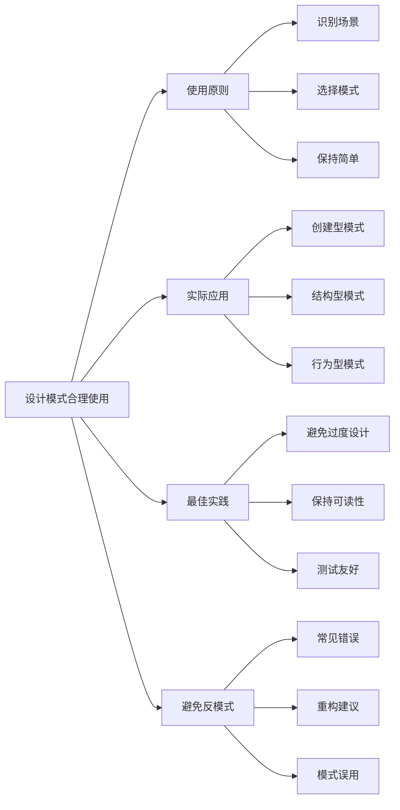

# 如何在项目中合理使用设计模式？

## 概要回答

在项目中合理使用设计模式需要遵循几个核心原则：识别问题场景、选择合适模式、保持简单性、避免过度设计。应该在真正需要解决特定问题时才引入设计模式，而不是为了使用模式而使用。合理使用设计模式可以提高代码的可维护性、可扩展性和可测试性，但滥用会导致代码复杂化和理解困难。

## 深度解析

### 设计模式使用原则

#### 1. 识别使用场景
```php
<?php
// 错误示例：为了使用模式而使用模式
class UserManager {
    // 简单的用户管理，却强行使用复杂模式
    private $strategy;
    
    public function __construct(UserStorageStrategy $strategy) {
        $this->strategy = $strategy;
    }
    
    public function getUser($id) {
        // 实际上只需要简单的数据库查询
        return DB::table('users')->find($id);
    }
}

// 正确示例：在合适的场景使用模式
class PaymentProcessor {
    private $paymentStrategy;
    
    public function __construct(PaymentStrategy $strategy) {
        $this->paymentStrategy = $strategy;
    }
    
    // 不同支付方式需要不同的处理逻辑，策略模式很合适
    public function process($amount, $method) {
        switch($method) {
            case 'credit_card':
                $this->paymentStrategy = new CreditCardPayment();
                break;
            case 'paypal':
                $this->paymentStrategy = new PayPalPayment();
                break;
            case 'bank_transfer':
                $this->paymentStrategy = new BankTransferPayment();
                break;
        }
        
        return $this->paymentStrategy->pay($amount);
    }
}
?>
```

#### 2. 选择合适的设计模式
```php
<?php
// 场景识别矩阵
class DesignPatternSelector {
    /*
    创建型模式适用场景：
    - 单例模式：全局唯一实例（如日志记录器、配置管理器）
    - 工厂模式：创建相似对象（如数据库连接、缓存驱动）
    - 抽象工厂：创建产品族（如UI主题、数据库适配器族）
    - 建造者模式：复杂对象构建（如HTTP请求、报表生成）
    - 原型模式：对象克隆（如游戏中的敌人、文档模板）
    
    结构型模式适用场景：
    - 适配器模式：接口兼容（如第三方SDK集成）
    - 桥接模式：维度分离（如跨平台GUI、数据库驱动）
    - 组合模式：树形结构（如文件系统、菜单导航）
    - 装饰器模式：动态扩展（如HTTP中间件、缓存层）
    - 外观模式：简化接口（如系统启动、复杂库封装）
    - 享元模式：共享状态（如文本编辑器字符、游戏粒子）
    - 代理模式：控制访问（如远程代理、虚拟代理、保护代理）
    
    行为型模式适用场景：
    - 责任链模式：请求处理链（如审批流程、异常处理）
    - 命令模式：操作封装（如撤销重做、任务队列）
    - 解释器模式：语言解析（如DSL、规则引擎）
    - 迭代器模式：遍历集合（如自定义数据结构）
    - 中介者模式：对象交互（如聊天室、MVC控制器）
    - 备忘录模式：状态保存（如游戏存档、编辑器撤销）
    - 观察者模式：事件通知（如发布订阅、MVC视图更新）
    - 状态模式：状态变化（如订单状态、游戏角色状态）
    - 策略模式：算法切换（如排序算法、支付方式）
    - 模板方法：算法骨架（如数据导入导出、测试框架）
    - 访问者模式：元素操作（如语法树遍历、文档处理）
    */
}

// 实际应用示例
class OrderProcessingSystem {
    // 策略模式：不同配送方式
    private $shippingStrategy;
    
    // 状态模式：订单状态管理
    private $orderState;
    
    // 观察者模式：订单状态变更通知
    private $observers = [];
    
    // 模板方法：处理流程
    public function processOrder($order) {
        $this->validateOrder($order);
        $this->calculateShipping($order);
        $this->processPayment($order);
        $this->updateInventory($order);
        $this->notifyCompletion($order);
    }
    
    // 装饰器模式：日志装饰
    public function processOrderWithLogging($order) {
        $logger = new LoggingDecorator($this);
        return $logger->processOrder($order);
    }
}
?>
```

### 设计模式的实际应用

#### 1. 创建型模式应用
```php
<?php
// 单例模式：配置管理器
class ConfigManager {
    private static $instance = null;
    private $config = [];
    
    private function __construct() {
        $this->loadConfig();
    }
    
    public static function getInstance() {
        if (self::$instance === null) {
            self::$instance = new self();
        }
        return self::$instance;
    }
    
    private function loadConfig() {
        $this->config = [
            'database' => [
                'host' => getenv('DB_HOST') ?: 'localhost',
                'name' => getenv('DB_NAME') ?: 'app',
            ],
            'cache' => [
                'driver' => getenv('CACHE_DRIVER') ?: 'file',
            ]
        ];
    }
    
    public function get($key, $default = null) {
        return $this->config[$key] ?? $default;
    }
    
    // 防止克隆
    private function __clone() {}
    
    // 防止反序列化
    public function __wakeup() {
        throw new Exception("Cannot unserialize singleton");
    }
}

// 工厂模式：数据库连接工厂
class DatabaseConnectionFactory {
    public static function create($type) {
        switch ($type) {
            case 'mysql':
                return new MySQLConnection();
            case 'postgresql':
                return new PostgreSQLConnection();
            case 'sqlite':
                return new SQLiteConnection();
            default:
                throw new InvalidArgumentException("Unsupported database type: {$type}");
        }
    }
}

interface DatabaseConnection {
    public function connect();
    public function query($sql);
}

class MySQLConnection implements DatabaseConnection {
    public function connect() {
        // MySQL连接逻辑
    }
    
    public function query($sql) {
        // MySQL查询逻辑
    }
}

// 抽象工厂：UI组件工厂
interface UIComponentFactory {
    public function createButton();
    public function createTextField();
}

class WindowsUIFactory implements UIComponentFactory {
    public function createButton() {
        return new WindowsButton();
    }
    
    public function createTextField() {
        return new WindowsTextField();
    }
}

class MacUIFactory implements UIComponentFactory {
    public function createButton() {
        return new MacButton();
    }
    
    public function createTextField() {
        return new MacTextField();
    }
}
?>
```

#### 2. 结构型模式应用
```php
<?php
// 适配器模式：支付网关适配器
interface PaymentGateway {
    public function charge($amount);
    public function refund($transactionId);
}

class StripeAdapter implements PaymentGateway {
    private $stripe;
    
    public function __construct() {
        $this->stripe = new \Stripe\StripeClient(env('STRIPE_SECRET'));
    }
    
    public function charge($amount) {
        return $this->stripe->charges->create([
            'amount' => $amount * 100,
            'currency' => 'usd',
        ]);
    }
    
    public function refund($transactionId) {
        return $this->stripe->refunds->create([
            'charge' => $transactionId,
        ]);
    }
}

class PayPalAdapter implements PaymentGateway {
    private $paypal;
    
    public function __construct() {
        $this->paypal = new \PayPal\Rest\ApiContext(/* 配置 */);
    }
    
    public function charge($amount) {
        // PayPal支付逻辑
    }
    
    public function refund($transactionId) {
        // PayPal退款逻辑
    }
}

// 装饰器模式：缓存装饰器
interface DataProvider {
    public function getData($key);
}

class DatabaseDataProvider implements DataProvider {
    public function getData($key) {
        // 从数据库获取数据
        return DB::table('data')->where('key', $key)->first();
    }
}

class CacheDecorator implements DataProvider {
    private $dataProvider;
    private $cache;
    
    public function __construct(DataProvider $dataProvider) {
        $this->dataProvider = $dataProvider;
        $this->cache = new Redis(); // 或其他缓存实现
    }
    
    public function getData($key) {
        // 先从缓存获取
        $data = $this->cache->get($key);
        if ($data !== null) {
            return $data;
        }
        
        // 缓存未命中，从数据源获取
        $data = $this->dataProvider->getData($key);
        
        // 存入缓存
        $this->cache->set($key, $data, 3600);
        
        return $data;
    }
}

// 外观模式：订单处理外观
class OrderProcessingFacade {
    private $inventoryService;
    private $paymentService;
    private $notificationService;
    
    public function __construct() {
        $this->inventoryService = new InventoryService();
        $this->paymentService = new PaymentService();
        $this->notificationService = new NotificationService();
    }
    
    public function processOrder($orderData) {
        // 检查库存
        if (!$this->inventoryService->checkAvailability($orderData['items'])) {
            throw new Exception('Insufficient inventory');
        }
        
        // 处理支付
        $paymentResult = $this->paymentService->processPayment($orderData['amount']);
        if (!$paymentResult['success']) {
            throw new Exception('Payment failed');
        }
        
        // 更新库存
        $this->inventoryService->updateStock($orderData['items']);
        
        // 发送通知
        $this->notificationService->sendOrderConfirmation($orderData['customer_email']);
        
        return [
            'status' => 'success',
            'order_id' => uniqid(),
            'transaction_id' => $paymentResult['transaction_id']
        ];
    }
}
?>
```

#### 3. 行为型模式应用
```php
<?php
// 观察者模式：事件系统
interface Observer {
    public function update($event, $data);
}

interface Subject {
    public function attach(Observer $observer);
    public function detach(Observer $observer);
    public function notify($event, $data);
}

class EventManager implements Subject {
    private $observers = [];
    
    public function attach(Observer $observer) {
        $this->observers[] = $observer;
    }
    
    public function detach(Observer $observer) {
        $this->observers = array_filter($this->observers, function($obs) use ($observer) {
            return $obs !== $observer;
        });
    }
    
    public function notify($event, $data) {
        foreach ($this->observers as $observer) {
            $observer->update($event, $data);
        }
    }
}

class EmailNotification implements Observer {
    public function update($event, $data) {
        if ($event === 'user_registered') {
            // 发送欢迎邮件
            Mail::to($data['email'])->send(new WelcomeEmail($data));
        }
    }
}

class AnalyticsTracker implements Observer {
    public function update($event, $data) {
        // 记录事件到分析系统
        Analytics::track($event, $data);
    }
}

// 策略模式：排序策略
interface SortStrategy {
    public function sort(array $data);
}

class QuickSortStrategy implements SortStrategy {
    public function sort(array $data) {
        // 快速排序实现
        return $this->quickSort($data);
    }
    
    private function quickSort($array) {
        if (count($array) < 2) {
            return $array;
        }
        
        $pivot = $array[0];
        $left = $right = [];
        
        for ($i = 1; $i < count($array); $i++) {
            if ($array[$i] < $pivot) {
                $left[] = $array[$i];
            } else {
                $right[] = $array[$i];
            }
        }
        
        return array_merge($this->quickSort($left), [$pivot], $this->quickSort($right));
    }
}

class MergeSortStrategy implements SortStrategy {
    public function sort(array $data) {
        // 归并排序实现
        return $this->mergeSort($data);
    }
    
    private function mergeSort($array) {
        if (count($array) <= 1) {
            return $array;
        }
        
        $mid = count($array) / 2;
        $left = array_slice($array, 0, $mid);
        $right = array_slice($array, $mid);
        
        return $this->merge($this->mergeSort($left), $this->mergeSort($right));
    }
    
    private function merge($left, $right) {
        $result = [];
        while (count($left) > 0 && count($right) > 0) {
            if ($left[0] <= $right[0]) {
                $result[] = array_shift($left);
            } else {
                $result[] = array_shift($right);
            }
        }
        
        return array_merge($result, $left, $right);
    }
}

class SortContext {
    private $strategy;
    
    public function __construct(SortStrategy $strategy) {
        $this->strategy = $strategy;
    }
    
    public function setStrategy(SortStrategy $strategy) {
        $this->strategy = $strategy;
    }
    
    public function sort(array $data) {
        return $this->strategy->sort($data);
    }
}

// 使用示例
$data = [64, 34, 25, 12, 22, 11, 90];

// 根据数据量选择排序策略
if (count($data) < 50) {
    $context = new SortContext(new InsertionSortStrategy());
} else {
    $context = new SortContext(new QuickSortStrategy());
}

$sortedData = $context->sort($data);
?>
```

### 设计模式使用的最佳实践

#### 1. 避免过度设计
```php
<?php
// 错误示例：过度设计
class OverEngineeredUserManager {
    private $repositoryFactory;
    private $validatorChain;
    private $eventDispatcher;
    private $cacheDecorator;
    private $loggerDecorator;
    private $transactionManager;
    
    public function __construct(
        RepositoryFactory $repositoryFactory,
        ValidatorChain $validatorChain,
        EventDispatcher $eventDispatcher,
        CacheDecorator $cacheDecorator,
        LoggerDecorator $loggerDecorator,
        TransactionManager $transactionManager
    ) {
        $this->repositoryFactory = $repositoryFactory;
        $this->validatorChain = $validatorChain;
        $this->eventDispatcher = $eventDispatcher;
        $this->cacheDecorator = $cacheDecorator;
        $this->loggerDecorator = $loggerDecorator;
        $this->transactionManager = $transactionManager;
    }
    
    public function createUser($userData) {
        // 过度复杂的创建用户流程
        $this->loggerDecorator->log('Starting user creation');
        $this->transactionManager->beginTransaction();
        
        try {
            $validationResult = $this->validatorChain->validate($userData);
            if (!$validationResult->isValid()) {
                throw new ValidationException($validationResult->getErrors());
            }
            
            $userRepository = $this->repositoryFactory->create('user');
            $user = $userRepository->create($userData);
            
            $this->cacheDecorator->invalidate('users');
            $this->eventDispatcher->dispatch('user.created', $user);
            
            $this->transactionManager->commit();
            $this->loggerDecorator->log('User created successfully');
            
            return $user;
        } catch (Exception $e) {
            $this->transactionManager->rollback();
            $this->loggerDecorator->log('User creation failed: ' . $e->getMessage());
            throw $e;
        }
    }
}

// 正确示例：适度设计
class UserManager {
    private $userRepository;
    private $validator;
    
    public function __construct(UserRepository $userRepository, UserValidator $validator) {
        $this->userRepository = $userRepository;
        $this->validator = $validator;
    }
    
    public function createUser($userData) {
        // 简洁明了的创建用户流程
        if (!$this->validator->validate($userData)) {
            throw new ValidationException('Invalid user data');
        }
        
        $user = $this->userRepository->create($userData);
        
        // 简单的日志记录
        Log::info('User created', ['user_id' => $user->id]);
        
        return $user;
    }
}
?>
```

#### 2. 保持代码可读性
```php
<?php
// 命名清晰
class PaymentProcessingService { // 好：描述性名称
    // ...
}

class PPService { // 差：缩写不明确
    // ...
}

// 文档注释
/**
 * 订单处理服务
 * 
 * 负责处理电子商务订单的完整生命周期，
 * 包括验证、支付处理、库存管理和通知发送。
 */
class OrderProcessingService {
    /**
     * 处理订单
     * 
     * @param array $orderData 订单数据
     * @return array 处理结果
     * @throws InsufficientInventoryException 库存不足时抛出
     * @throws PaymentFailedException 支付失败时抛出
     */
    public function processOrder(array $orderData) {
        // 实现...
    }
}

// 避免深层嵌套
// 差的示例
public function badExample($data) {
    if ($data['valid']) {
        if ($data['authenticated']) {
            if ($data['authorized']) {
                if ($data['confirmed']) {
                    // 处理逻辑
                }
            }
        }
    }
}

// 好的示例
public function goodExample($data) {
    if (!$data['valid']) {
        return false;
    }
    
    if (!$data['authenticated']) {
        throw new AuthenticationException();
    }
    
    if (!$data['authorized']) {
        throw new AuthorizationException();
    }
    
    if (!$data['confirmed']) {
        return false;
    }
    
    // 处理逻辑
}
?>
```

#### 3. 测试友好的设计
```php
<?php
// 依赖注入提高可测试性
class OrderService {
    private $paymentGateway;
    private $inventoryService;
    
    // 通过构造函数注入依赖，便于测试时替换为mock
    public function __construct(PaymentGateway $paymentGateway, InventoryService $inventoryService) {
        $this->paymentGateway = $paymentGateway;
        $this->inventoryService = $inventoryService;
    }
    
    public function processOrder($order) {
        // 处理逻辑
    }
}

// 测试示例
class OrderServiceTest extends TestCase {
    public function testProcessOrderWithSuccessfulPayment() {
        // 创建mock对象
        $mockPaymentGateway = $this->createMock(PaymentGateway::class);
        $mockPaymentGateway->expects($this->once())
                          ->method('charge')
                          ->willReturn(['success' => true]);
                          
        $mockInventoryService = $this->createMock(InventoryService::class);
        $mockInventoryService->expects($this->once())
                            ->method('checkAvailability')
                            ->willReturn(true);
        
        // 注入mock依赖
        $orderService = new OrderService($mockPaymentGateway, $mockInventoryService);
        
        // 执行测试
        $result = $orderService->processOrder(['amount' => 100]);
        
        // 验证结果
        $this->assertTrue($result['success']);
    }
}
?>
```

### 设计模式使用的反模式

#### 1. 常见错误
```php
<?php
// 反模式1：模式套娃
class OverlyComplexService {
    private $facade;
    private $decorator;
    private $adapter;
    private $proxy;
    private $bridge;
    
    public function __construct() {
        $this->facade = new ComplexFacade(
            new DecoratedService(
                new AdaptedService(
                    new ProxiedService(
                        new BridgedService()
                    )
                )
            )
        );
    }
}

// 反模式2：为了模式而模式
class UnnecessarySingleton {
    private static $instance;
    
    // 实际上并不需要全局唯一实例
    public static function getInstance() {
        if (!self::$instance) {
            self::$instance = new self();
        }
        return self::$instance;
    }
    
    public function doSomething() {
        // 简单的业务逻辑，不需要单例
        return "Doing something";
    }
}

// 反模式3：模式误用
class MisusedObserver {
    private $observers = [];
    
    // 观察者模式用于简单的通知，不是复杂业务逻辑
    public function processData($data) {
        foreach ($this->observers as $observer) {
            // 在观察者中处理核心业务逻辑是错误的
            $result = $observer->process($data);
            if ($result === false) {
                return false; // 控制流程不应该由观察者决定
            }
        }
        return true;
    }
}
?>
```

#### 2. 重构建议
```php
<?php
// 重构前：复杂的设计
class ComplexOrderProcessor {
    private $strategy;
    private $state;
    private $chain;
    private $visitor;
    
    public function process($order) {
        $context = new Context($this->strategy, $this->state);
        return $this->chain->process($order, $context, $this->visitor);
    }
}

// 重构后：简化设计
class SimpleOrderProcessor {
    private $paymentService;
    private $inventoryService;
    
    public function process($order) {
        if (!$this->validateOrder($order)) {
            return ['success' => false, 'error' => 'Invalid order'];
        }
        
        if (!$this->inventoryService->checkAvailability($order['items'])) {
            return ['success' => false, 'error' => 'Insufficient inventory'];
        }
        
        $paymentResult = $this->paymentService->process($order['amount']);
        if (!$paymentResult['success']) {
            return ['success' => false, 'error' => 'Payment failed'];
        }
        
        $this->inventoryService->update($order['items']);
        
        return ['success' => true, 'order_id' => uniqid()];
    }
    
    private function validateOrder($order) {
        // 简单验证逻辑
        return isset($order['items']) && isset($order['amount']);
    }
}
?>
```

## 图示说明



合理使用设计模式的关键在于理解业务需求，识别真正的设计问题，然后选择最合适的解决方案。记住，设计模式是工具而不是目标，应该服务于解决问题而不是增加复杂性。