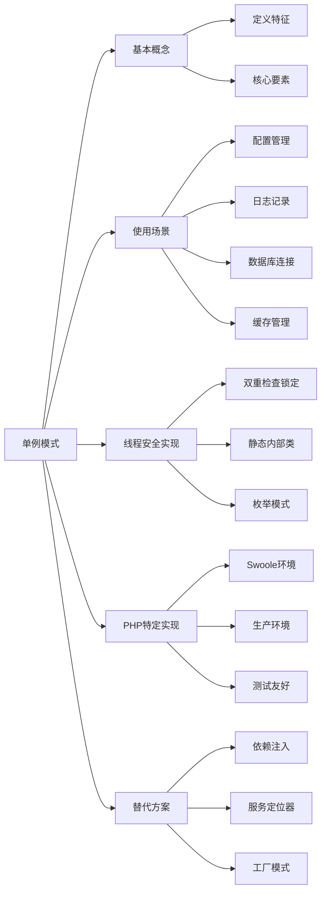

# 单例模式在什么场景下使用？如何实现线程安全的单例？

## 概要回答

单例模式适用于需要全局唯一实例的场景，如配置管理、日志记录、数据库连接、缓存管理等。实现线程安全的单例有多种方式：双重检查锁定、静态内部类、枚举等方式。在PHP中由于通常是单进程模型，线程安全相对简单，但在多进程或多线程环境下（如使用Swoole），需要特别注意同步机制。

## 深度解析

### 单例模式基本概念和使用场景

#### 1. 单例模式定义
```php
<?php
// 基础单例模式实现
class BasicSingleton {
    // 保存类实例的静态成员变量
    private static $instance = null;
    
    // 私有构造函数，防止外部实例化
    private function __construct() {
        // 初始化逻辑
    }
    
    // 获取实例的公共静态方法
    public static function getInstance() {
        if (self::$instance === null) {
            self::$instance = new self();
        }
        return self::$instance;
    }
    
    // 防止克隆
    private function __clone() {}
    
    // 防止反序列化
    public function __wakeup() {
        throw new Exception("Cannot unserialize singleton");
    }
    
    // 业务方法示例
    public function doSomething() {
        echo "Doing something in singleton instance\n";
    }
}

// 使用示例
$instance1 = BasicSingleton::getInstance();
$instance2 = BasicSingleton::getInstance();

// 验证是否为同一实例
var_dump($instance1 === $instance2); // bool(true)
?>
```

#### 2. 主要使用场景
```php
<?php
// 场景1：配置管理器
class ConfigManager {
    private static $instance = null;
    private $config = [];
    
    private function __construct() {
        $this->loadConfig();
    }
    
    public static function getInstance() {
        if (self::$instance === null) {
            self::$instance = new self();
        }
        return self::$instance;
    }
    
    private function loadConfig() {
        // 从文件或环境变量加载配置
        $this->config = [
            'database' => [
                'host' => getenv('DB_HOST') ?: 'localhost',
                'port' => getenv('DB_PORT') ?: 3306,
                'name' => getenv('DB_NAME') ?: 'app_db'
            ],
            'cache' => [
                'driver' => getenv('CACHE_DRIVER') ?: 'file',
                'host' => getenv('CACHE_HOST') ?: 'localhost'
            ],
            'app' => [
                'debug' => filter_var(getenv('APP_DEBUG'), FILTER_VALIDATE_BOOLEAN),
                'timezone' => getenv('APP_TIMEZONE') ?: 'UTC'
            ]
        ];
    }
    
    public function get($key, $default = null) {
        $keys = explode('.', $key);
        $value = $this->config;
        
        foreach ($keys as $k) {
            if (!isset($value[$k])) {
                return $default;
            }
            $value = $value[$k];
        }
        
        return $value;
    }
    
    public function set($key, $value) {
        $keys = explode('.', $key);
        $config = &$this->config;
        
        foreach ($keys as $k) {
            if (!isset($config[$k])) {
                $config[$k] = [];
            }
            $config = &$config[$k];
        }
        
        $config = $value;
    }
}

// 场景2：日志记录器
class Logger {
    private static $instance = null;
    private $logFile;
    private $logLevel;
    
    private function __construct($logFile = null) {
        $this->logFile = $logFile ?: storage_path('logs/app.log');
        $this->logLevel = defined('LOG_LEVEL') ? constant('LOG_LEVEL') : 'INFO';
    }
    
    public static function getInstance($logFile = null) {
        if (self::$instance === null) {
            self::$instance = new self($logFile);
        }
        return self::$instance;
    }
    
    public function log($level, $message, $context = []) {
        if (!$this->shouldLog($level)) {
            return;
        }
        
        $timestamp = date('Y-m-d H:i:s');
        $formattedMessage = $this->formatMessage($level, $message, $context);
        $logEntry = "[{$timestamp}] {$level}: {$formattedMessage}" . PHP_EOL;
        
        file_put_contents($this->logFile, $logEntry, FILE_APPEND | LOCK_EX);
    }
    
    public function info($message, $context = []) {
        $this->log('INFO', $message, $context);
    }
    
    public function error($message, $context = []) {
        $this->log('ERROR', $message, $context);
    }
    
    public function debug($message, $context = []) {
        $this->log('DEBUG', $message, $context);
    }
    
    private function shouldLog($level) {
        $levels = ['DEBUG' => 0, 'INFO' => 1, 'WARNING' => 2, 'ERROR' => 3];
        return $levels[$level] >= $levels[$this->logLevel];
    }
    
    private function formatMessage($level, $message, $context) {
        $formatted = $message;
        
        // 替换上下文占位符
        foreach ($context as $key => $value) {
            $formatted = str_replace("{{$key}}", $this->toString($value), $formatted);
        }
        
        return $formatted;
    }
    
    private function toString($value) {
        if (is_array($value) || is_object($value)) {
            return json_encode($value);
        }
        return (string) $value;
    }
}

// 场景3：数据库连接管理
class DatabaseConnection {
    private static $instance = null;
    private $connection = null;
    private $config = [];
    
    private function __construct() {
        $this->config = ConfigManager::getInstance()->get('database');
        $this->connect();
    }
    
    public static function getInstance() {
        if (self::$instance === null) {
            self::$instance = new self();
        }
        return self::$instance;
    }
    
    private function connect() {
        try {
            $dsn = "mysql:host={$this->config['host']};port={$this->config['port']};dbname={$this->config['name']}";
            $this->connection = new PDO($dsn, $this->config['username'], $this->config['password'], [
                PDO::ATTR_ERRMODE => PDO::ERRMODE_EXCEPTION,
                PDO::ATTR_DEFAULT_FETCH_MODE => PDO::FETCH_ASSOC
            ]);
        } catch (PDOException $e) {
            throw new Exception("Database connection failed: " . $e->getMessage());
        }
    }
    
    public function getConnection() {
        if ($this->connection === null) {
            $this->connect();
        }
        return $this->connection;
    }
    
    public function query($sql, $params = []) {
        $stmt = $this->getConnection()->prepare($sql);
        $stmt->execute($params);
        return $stmt->fetchAll();
    }
    
    public function execute($sql, $params = []) {
        $stmt = $this->getConnection()->prepare($sql);
        return $stmt->execute($params);
    }
}
?>
```

### 线程安全的单例实现

#### 1. 双重检查锁定模式
```php
<?php
// 双重检查锁定模式（适用于多线程环境）
class ThreadSafeSingleton {
    // 使用volatile关键字确保多线程可见性
    private static $instance = null;
    // 锁对象
    private static $lock = null;
    
    private function __construct() {
        // 私有构造函数
    }
    
    public static function getInstance() {
        // 第一次检查
        if (self::$instance === null) {
            // 初始化锁对象
            if (self::$lock === null) {
                self::$lock = new stdClass();
            }
            
            // 获取锁
            synchronized(self::$lock, function() {
                // 第二次检查
                if (self::$instance === null) {
                    self::$instance = new self();
                }
            });
        }
        
        return self::$instance;
    }
    
    private function __clone() {}
    
    public function __wakeup() {
        throw new Exception("Cannot unserialize singleton");
    }
}

// PHP中模拟synchronized函数
function synchronized($lock, $callback) {
    // 在真实环境中，这里需要实现互斥锁机制
    // PHP通常不需要这样，因为是单进程模型
    return $callback();
}

// 使用互斥锁的真实实现（需要额外扩展）
class RealThreadSafeSingleton {
    private static $instance = null;
    private static $mutex = null;
    
    private function __construct() {}
    
    public static function getInstance() {
        if (self::$instance === null) {
            // 创建互斥锁（需要pthreads或其他并发扩展）
            if (self::$mutex === null) {
                // self::$mutex = new Mutex(); // 需要pthreads扩展
            }
            
            // Mutex::lock(self::$mutex); // 加锁
            
            if (self::$instance === null) {
                self::$instance = new self();
            }
            
            // Mutex::unlock(self::$mutex); // 解锁
        }
        
        return self::$instance;
    }
    
    private function __clone() {}
    
    public function __wakeup() {
        throw new Exception("Cannot unserialize singleton");
    }
}
?>
```

#### 2. 静态内部类模式
```php
<?php
// 静态内部类模式（推荐方式）
class StaticInnerClassSingleton {
    // 私有构造函数
    private function __construct() {}
    
    // 静态内部类
    private static function SingletonHolder() {
        return new class {
            public static $INSTANCE = null;
            
            public static function getInstance() {
                if (self::$INSTANCE === null) {
                    self::$INSTANCE = new StaticInnerClassSingleton();
                }
                return self::$INSTANCE;
            }
        };
    }
    
    // 获取实例
    public static function getInstance() {
        return self::SingletonHolder()::getInstance();
    }
    
    private function __clone() {}
    
    public function __wakeup() {
        throw new Exception("Cannot unserialize singleton");
    }
}

// 更简洁的PHP实现
class BetterStaticSingleton {
    // 利用PHP的静态初始化特性
    private static $instance = null;
    
    private function __construct() {}
    
    public static function getInstance() {
        if (self::$instance === null) {
            self::$instance = new self();
        }
        return self::$instance;
    }
    
    private function __clone() {}
    
    public function __wakeup() {
        throw new Exception("Cannot unserialize singleton");
    }
}
?>
```

#### 3. 枚举模式（Java风格，PHP模拟）
```php
<?php
// 枚举模式实现单例
class EnumSingleton {
    private static $instance = null;
    
    private function __construct() {}
    
    public static function getInstance() {
        if (self::$instance === null) {
            self::$instance = new self();
        }
        return self::$instance;
    }
    
    // 模拟枚举的不可变性
    final public function __clone() {
        throw new Exception("Cannot clone singleton");
    }
    
    final public function __wakeup() {
        throw new Exception("Cannot unserialize singleton");
    }
    
    final public function __sleep() {
        throw new Exception("Cannot serialize singleton");
    }
}

// 使用trait增强单例功能
trait SingletonTrait {
    private static $instance = null;
    
    public static function getInstance() {
        if (self::$instance === null) {
            self::$instance = new self();
        }
        return self::$instance;
    }
    
    private function __construct() {}
    private function __clone() {}
    
    public function __wakeup() {
        throw new Exception("Cannot unserialize singleton");
    }
}

// 使用trait的单例类
class ConfigService {
    use SingletonTrait;
    
    private $settings = [];
    
    protected function __construct() {
        $this->loadSettings();
    }
    
    private function loadSettings() {
        $this->settings = [
            'app_name' => 'My Application',
            'version' => '1.0.0',
            'debug' => true
        ];
    }
    
    public function get($key, $default = null) {
        return $this->settings[$key] ?? $default;
    }
    
    public function set($key, $value) {
        $this->settings[$key] = $value;
    }
}
?>
```

### PHP特定的单例实现

#### 1. Swoole环境下的线程安全单例
```php
<?php
// Swoole环境下的单例模式
class SwooleThreadSafeSingleton {
    private static $instances = [];
    private static $mutex = null;
    
    private function __construct() {}
    
    public static function getInstance($workerId = null) {
        if ($workerId === null) {
            // 在Swoole中获取当前Worker ID
            $workerId = defined('SWOOLE_PROCESS') ? getmypid() : 'default';
        }
        
        if (!isset(self::$instances[$workerId])) {
            if (self::$mutex === null) {
                self::$mutex = new Swoole\Lock(SWOOLE_MUTEX);
            }
            
            self::$mutex->lock();
            if (!isset(self::$instances[$workerId])) {
                self::$instances[$workerId] = new self();
            }
            self::$mutex->unlock();
        }
        
        return self::$instances[$workerId];
    }
    
    public static function getAllInstances() {
        return self::$instances;
    }
    
    public static function clearInstance($workerId = null) {
        if ($workerId === null) {
            self::$instances = [];
        } else {
            unset(self::$instances[$workerId]);
        }
    }
    
    private function __clone() {}
    
    public function __wakeup() {
        throw new Exception("Cannot unserialize singleton");
    }
}

// Swoole Worker中的使用示例
/*
class WebSocketServer {
    public function onWorkerStart($server, $workerId) {
        // 为每个Worker创建独立的单例实例
        $singleton = SwooleThreadSafeSingleton::getInstance($workerId);
        // 初始化该Worker的资源
    }
    
    public function onMessage($server, $frame) {
        // 获取当前Worker的单例实例
        $workerId = $server->worker_id;
        $singleton = SwooleThreadSafeSingleton::getInstance($workerId);
        // 处理消息
    }
}
*/
?>
```

#### 2. 单例模式的最佳实践
```php
<?php
// 生产环境推荐的单例实现
final class ProductionSingleton {
    private static $instance = null;
    private static $isInitialized = false;
    
    // 私有属性
    private $config;
    private $initializedAt;
    
    // 私有构造函数
    private function __construct() {
        $this->initialize();
    }
    
    // 初始化方法
    private function initialize() {
        if (self::$isInitialized) {
            throw new Exception("Singleton already initialized");
        }
        
        $this->config = ConfigManager::getInstance();
        $this->initializedAt = microtime(true);
        self::$isInitialized = true;
        
        // 注册关闭函数
        register_shutdown_function([$this, 'shutdown']);
    }
    
    // 获取实例的公共方法
    public static function getInstance(): self {
        if (self::$instance === null) {
            self::$instance = new self();
        }
        return self::$instance;
    }
    
    // 防止克隆
    private function __clone() {
        throw new Exception("Cloning singleton is not allowed");
    }
    
    // 防止反序列化
    public function __wakeup() {
        throw new Exception("Unserializing singleton is not allowed");
    }
    
    // 防止序列化
    public function __sleep() {
        throw new Exception("Serializing singleton is not allowed");
    }
    
    // 关闭处理
    public function shutdown() {
        // 清理资源
        $this->cleanup();
    }
    
    private function cleanup() {
        // 清理逻辑
        echo "Singleton cleaned up\n";
    }
    
    // 业务方法
    public function getConfig($key = null) {
        if ($key === null) {
            return $this->config;
        }
        return $this->config->get($key);
    }
    
    public function getUptime() {
        return microtime(true) - $this->initializedAt;
    }
    
    // 调试方法
    public function debugInfo() {
        return [
            'initialized_at' => $this->initializedAt,
            'uptime' => $this->getUptime(),
            'config_keys' => array_keys($this->config->getAll() ?? [])
        ];
    }
}

// 单元测试友好的单例
class TestableSingleton {
    private static $instance = null;
    private static $testMode = false;
    private static $testInstances = [];
    
    private function __construct() {}
    
    public static function getInstance($testId = null) {
        if (self::$testMode && $testId !== null) {
            if (!isset(self::$testInstances[$testId])) {
                self::$testInstances[$testId] = new self();
            }
            return self::$testInstances[$testId];
        }
        
        if (self::$instance === null) {
            self::$instance = new self();
        }
        return self::$instance;
    }
    
    public static function enableTestMode() {
        self::$testMode = true;
    }
    
    public static function disableTestMode() {
        self::$testMode = false;
        self::$testInstances = [];
    }
    
    public static function reset() {
        self::$instance = null;
        self::$testInstances = [];
    }
    
    private function __clone() {}
    
    public function __wakeup() {
        throw new Exception("Cannot unserialize singleton");
    }
}

// 测试示例
class TestableSingletonTest extends TestCase {
    protected function setUp(): void {
        TestableSingleton::enableTestMode();
        TestableSingleton::reset();
    }
    
    protected function tearDown(): void {
        TestableSingleton::disableTestMode();
    }
    
    public function testGetInstance() {
        $instance1 = TestableSingleton::getInstance('test1');
        $instance2 = TestableSingleton::getInstance('test1');
        $instance3 = TestableSingleton::getInstance('test2');
        
        $this->assertSame($instance1, $instance2);
        $this->assertNotSame($instance1, $instance3);
    }
}
?>
```

### 单例模式的替代方案

#### 1. 依赖注入容器
```php
<?php
// 使用依赖注入替代单例
class DependencyInjectionContainer {
    private $bindings = [];
    private $instances = [];
    
    public function bind($abstract, $concrete = null, $shared = false) {
        $this->bindings[$abstract] = [
            'concrete' => $concrete ?: $abstract,
            'shared' => $shared
        ];
    }
    
    public function singleton($abstract, $concrete = null) {
        $this->bind($abstract, $concrete, true);
    }
    
    public function resolve($abstract) {
        if (isset($this->instances[$abstract])) {
            return $this->instances[$abstract];
        }
        
        $binding = $this->bindings[$abstract] ?? null;
        if ($binding === null) {
            throw new Exception("No binding found for {$abstract}");
        }
        
        $concrete = $binding['concrete'];
        $object = $this->build($concrete);
        
        if ($binding['shared']) {
            $this->instances[$abstract] = $object;
        }
        
        return $object;
    }
    
    private function build($concrete) {
        if ($concrete instanceof Closure) {
            return $concrete($this);
        }
        
        $reflector = new ReflectionClass($concrete);
        $constructor = $reflector->getConstructor();
        
        if ($constructor === null) {
            return new $concrete;
        }
        
        $parameters = $constructor->getParameters();
        $dependencies = $this->resolveDependencies($parameters);
        
        return $reflector->newInstanceArgs($dependencies);
    }
    
    private function resolveDependencies($parameters) {
        $dependencies = [];
        foreach ($parameters as $parameter) {
            $type = $parameter->getType();
            if ($type) {
                $dependencies[] = $this->resolve($type->getName());
            } elseif ($parameter->isDefaultValueAvailable()) {
                $dependencies[] = $parameter->getDefaultValue();
            } else {
                throw new Exception("Unresolvable dependency");
            }
        }
        return $dependencies;
    }
}

// 使用依赖注入容器
$container = new DependencyInjectionContainer();
$container->singleton('config', function() {
    return new ConfigManager();
});
$container->singleton('logger', function($container) {
    return new Logger($container->resolve('config')->get('log.file'));
});

// 在类中使用
class UserService {
    private $logger;
    private $config;
    
    public function __construct($logger, $config) {
        $this->logger = $logger;
        $this->config = $config;
    }
    
    public function createUser($userData) {
        $this->logger->info('Creating user', $userData);
        // 创建用户逻辑
    }
}

// 解析依赖
$userService = $container->resolve(UserService::class);
?>
```

#### 2. 服务定位器模式
```php
<?php
// 服务定位器模式
class ServiceLocator {
    private static $services = [];
    private static $instantiators = [];
    
    public static function register($name, $serviceOrCallable) {
        if (is_callable($serviceOrCallable)) {
            self::$instantiators[$name] = $serviceOrCallable;
        } else {
            self::$services[$name] = $serviceOrCallable;
        }
    }
    
    public static function get($name) {
        if (isset(self::$services[$name])) {
            return self::$services[$name];
        }
        
        if (isset(self::$instantiators[$name])) {
            $service = call_user_func(self::$instantiators[$name]);
            self::$services[$name] = $service;
            unset(self::$instantiators[$name]);
            return $service;
        }
        
        throw new Exception("Service {$name} not found");
    }
    
    public static function has($name) {
        return isset(self::$services[$name]) || isset(self::$instantiators[$name]);
    }
}

// 注册服务
ServiceLocator::register('config', function() {
    return ConfigManager::getInstance();
});

ServiceLocator::register('logger', function() {
    return Logger::getInstance();
});

// 使用服务
$config = ServiceLocator::get('config');
$logger = ServiceLocator::get('logger');
?>
```

## 图示说明



单例模式虽然简单，但在实际应用中需要考虑线程安全、测试友好性、以及是否真的需要全局唯一实例等因素。在现代PHP开发中，更推荐使用依赖注入的方式来管理对象的生命周期。