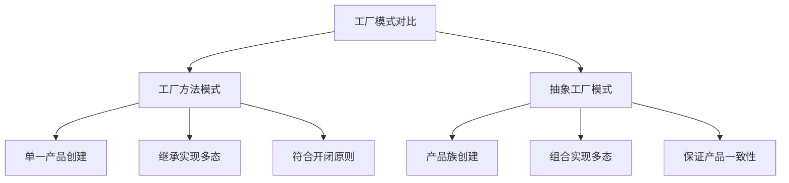
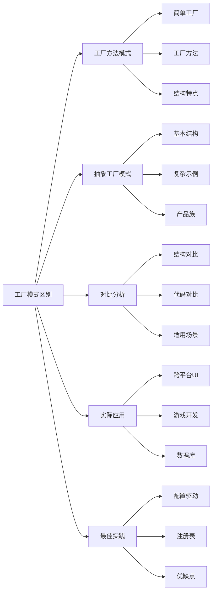

# 工厂模式和抽象工厂模式的区别？

## 概要回答

工厂模式和抽象工厂模式都是创建型设计模式，用于解耦对象的创建和使用。工厂模式专注于创建单一产品，通过继承实现多态；而抽象工厂模式专注于创建产品族，通过组合实现多态。工厂模式适用于创建具有共同接口的不同实现类，抽象工厂模式适用于创建一系列相关或相互依赖的产品。

## 深度解析

### 工厂模式（Factory Pattern）

#### 1. 简单工厂模式
```php
<?php
// 产品接口
interface Vehicle {
    public function drive();
}

// 具体产品
class Car implements Vehicle {
    public function drive() {
        return "Driving a car";
    }
}

class Truck implements Vehicle {
    public function drive() {
        return "Driving a truck";
    }
}

class Motorcycle implements Vehicle {
    public function drive() {
        return "Riding a motorcycle";
    }
}

// 简单工厂
class SimpleVehicleFactory {
    public static function createVehicle($type) {
        switch ($type) {
            case 'car':
                return new Car();
            case 'truck':
                return new Truck();
            case 'motorcycle':
                return new Motorcycle();
            default:
                throw new InvalidArgumentException("Unknown vehicle type: {$type}");
        }
    }
}

// 使用示例
try {
    $car = SimpleVehicleFactory::createVehicle('car');
    echo $car->drive(); // 输出: Driving a car
    
    $truck = SimpleVehicleFactory::createVehicle('truck');
    echo $truck->drive(); // 输出: Driving a truck
} catch (InvalidArgumentException $e) {
    echo "Error: " . $e->getMessage();
}
?>
```

#### 2. 工厂方法模式
```php
<?php
// 工厂方法接口
interface VehicleFactory {
    public function createVehicle();
}

// 具体工厂
class CarFactory implements VehicleFactory {
    public function createVehicle() {
        return new Car();
    }
}

class TruckFactory implements VehicleFactory {
    public function createVehicle() {
        return new Truck();
    }
}

class MotorcycleFactory implements VehicleFactory {
    public function createVehicle() {
        return new Motorcycle();
    }
}

// 使用示例
$factories = [
    new CarFactory(),
    new TruckFactory(),
    new MotorcycleFactory()
];

foreach ($factories as $factory) {
    $vehicle = $factory->createVehicle();
    echo $vehicle->drive() . "\n";
}

// 更灵活的工厂方法实现
abstract class AbstractVehicleFactory {
    abstract protected function createVehicle();
    
    public function getVehicle() {
        $vehicle = $this->createVehicle();
        $this->prepareVehicle($vehicle);
        return $vehicle;
    }
    
    protected function prepareVehicle(Vehicle $vehicle) {
        // 通用准备逻辑
        echo "Preparing vehicle...\n";
    }
}

class PremiumCarFactory extends AbstractVehicleFactory {
    protected function createVehicle() {
        return new PremiumCar();
    }
    
    protected function prepareVehicle(Vehicle $vehicle) {
        parent::prepareVehicle($vehicle);
        // 高级车辆特殊准备
        echo "Adding premium features...\n";
    }
}

class PremiumCar implements Vehicle {
    public function drive() {
        return "Driving a premium car with luxury features";
    }
}
?>
```

### 抽象工厂模式（Abstract Factory Pattern）

#### 1. 抽象工厂基本结构
```php
<?php
// 抽象产品族
interface Engine {
    public function start();
}

interface Body {
    public function getDesign();
}

interface Wheels {
    public function getTireType();
}

// 具体产品 - 豪华车系列
class LuxuryEngine implements Engine {
    public function start() {
        return "Luxury engine started with smooth acceleration";
    }
}

class LuxuryBody implements Body {
    public function getDesign() {
        return "Premium luxury body design";
    }
}

class LuxuryWheels implements Wheels {
    public function getTireType() {
        return "Premium all-season tires";
    }
}

// 具体产品 - 经济车系列
class EconomyEngine implements Engine {
    public function start() {
        return "Economy engine started efficiently";
    }
}

class EconomyBody implements Body {
    public function getDesign() {
        return "Practical economy body design";
    }
}

class EconomyWheels implements Wheels {
    public function getTireType() {
        return "Standard all-season tires";
    }
}

// 抽象工厂
interface VehicleFactory {
    public function createEngine();
    public function createBody();
    public function createWheels();
}

// 具体工厂
class LuxuryVehicleFactory implements VehicleFactory {
    public function createEngine() {
        return new LuxuryEngine();
    }
    
    public function createBody() {
        return new LuxuryBody();
    }
    
    public function createWheels() {
        return new LuxuryWheels();
    }
}

class EconomyVehicleFactory implements VehicleFactory {
    public function createEngine() {
        return new EconomyEngine();
    }
    
    public function createBody() {
        return new EconomyBody();
    }
    
    public function createWheels() {
        return new EconomyWheels();
    }
}

// 使用示例
function assembleVehicle(VehicleFactory $factory) {
    $engine = $factory->createEngine();
    $body = $factory->createBody();
    $wheels = $factory->createWheels();
    
    echo "Assembling vehicle:\n";
    echo "- " . $engine->start() . "\n";
    echo "- " . $body->getDesign() . "\n";
    echo "- " . $wheels->getTireType() . "\n";
    echo "Vehicle assembly complete!\n\n";
}

// 组装豪华车
$luxuryFactory = new LuxuryVehicleFactory();
assembleVehicle($luxuryFactory);

// 组装经济车
$economyFactory = new EconomyVehicleFactory();
assembleVehicle($economyFactory);
?>
```

#### 2. 复杂抽象工厂示例
```php
<?php
// 数据库抽象工厂示例
interface DatabaseComponentsFactory {
    public function createConnection();
    public function createQueryBuilder();
    public function createSchemaManager();
}

// MySQL产品族
class MySQLConnection {
    public function connect() {
        return "Connected to MySQL database";
    }
}

class MySQLQueryBuilder {
    public function select($table) {
        return "SELECT * FROM {$table}";
    }
}

class MySQLSchemaManager {
    public function createTable($table) {
        return "CREATE TABLE {$table} (...) ENGINE=InnoDB";
    }
}

class MySQLFactory implements DatabaseComponentsFactory {
    public function createConnection() {
        return new MySQLConnection();
    }
    
    public function createQueryBuilder() {
        return new MySQLQueryBuilder();
    }
    
    public function createSchemaManager() {
        return new MySQLSchemaManager();
    }
}

// PostgreSQL产品族
class PostgreSQLConnection {
    public function connect() {
        return "Connected to PostgreSQL database";
    }
}

class PostgreSQLQueryBuilder {
    public function select($table) {
        return "SELECT * FROM {$table}";
    }
}

class PostgreSQLSchemaManager {
    public function createTable($table) {
        return "CREATE TABLE {$table} (...)";
    }
}

class PostgreSQLFactory implements DatabaseComponentsFactory {
    public function createConnection() {
        return new PostgreSQLConnection();
    }
    
    public function createQueryBuilder() {
        return new PostgreSQLQueryBuilder();
    }
    
    public function createSchemaManager() {
        return new PostgreSQLSchemaManager();
    }
}

// 数据库管理系统
class DatabaseManager {
    private $connection;
    private $queryBuilder;
    private $schemaManager;
    
    public function __construct(DatabaseComponentsFactory $factory) {
        $this->connection = $factory->createConnection();
        $this->queryBuilder = $factory->createQueryBuilder();
        $this->schemaManager = $factory->createSchemaManager();
    }
    
    public function connect() {
        return $this->connection->connect();
    }
    
    public function buildSelectQuery($table) {
        return $this->queryBuilder->select($table);
    }
    
    public function createTable($table) {
        return $this->schemaManager->createTable($table);
    }
}

// 使用示例
$databases = [
    'MySQL' => new MySQLFactory(),
    'PostgreSQL' => new PostgreSQLFactory()
];

foreach ($databases as $name => $factory) {
    echo "=== {$name} Database ===\n";
    $dbManager = new DatabaseManager($factory);
    echo $dbManager->connect() . "\n";
    echo $dbManager->buildSelectQuery('users') . "\n";
    echo $dbManager->createTable('products') . "\n\n";
}
?>
```

### 工厂模式对比分析

#### 1. 结构对比


#### 2. 代码实现对比
```php
<?php
// 工厂方法模式 - 单一产品维度
interface PaymentProcessorFactory {
    public function createProcessor();
}

class CreditCardProcessorFactory implements PaymentProcessorFactory {
    public function createProcessor() {
        return new CreditCardProcessor();
    }
}

class PayPalProcessorFactory implements PaymentProcessorFactory {
    public function createProcessor() {
        return new PayPalProcessor();
    }
}

// 抽象工厂模式 - 多产品维度
interface PaymentSystemFactory {
    public function createProcessor();
    public function createValidator();
    public function createLogger();
}

class CreditCardSystemFactory implements PaymentSystemFactory {
    public function createProcessor() {
        return new CreditCardProcessor();
    }
    
    public function createValidator() {
        return new CreditCardValidator();
    }
    
    public function createLogger() {
        return new PaymentLogger();
    }
}

class PayPalSystemFactory implements PaymentSystemFactory {
    public function createProcessor() {
        return new PayPalProcessor();
    }
    
    public function createValidator() {
        return new PayPalValidator();
    }
    
    public function createLogger() {
        return new PaymentLogger();
    }
}

// 产品实现
interface PaymentProcessor {
    public function process($amount);
}

interface PaymentValidator {
    public function validate($data);
}

interface PaymentLogger {
    public function log($message);
}

class CreditCardProcessor implements PaymentProcessor {
    public function process($amount) {
        return "Processing credit card payment of {$amount}";
    }
}

class PayPalProcessor implements PaymentProcessor {
    public function process($amount) {
        return "Processing PayPal payment of {$amount}";
    }
}

class CreditCardValidator implements PaymentValidator {
    public function validate($data) {
        return "Validating credit card data";
    }
}

class PayPalValidator implements PaymentValidator {
    public function validate($data) {
        return "Validating PayPal data";
    }
}

class PaymentLogger implements PaymentLogger {
    public function log($message) {
        echo "[LOG] {$message}\n";
    }
}

// 使用对比
echo "=== 工厂方法模式 ===\n";
$ccFactory = new CreditCardProcessorFactory();
$processor = $ccFactory->createProcessor();
echo $processor->process(100) . "\n";

echo "\n=== 抽象工厂模式 ===\n";
$ccSystemFactory = new CreditCardSystemFactory();
$processor = $ccSystemFactory->createProcessor();
$validator = $ccSystemFactory->createValidator();
$logger = $ccSystemFactory->createLogger();

echo $processor->process(100) . "\n";
echo $validator->validate(['card_number' => '1234']) . "\n";
$logger->log("Payment processed successfully");
?>
```

### 实际应用场景

#### 1. 跨平台UI框架
```php
<?php
// 抽象产品
interface Button {
    public function render();
}

interface TextField {
    public function render();
}

interface Dialog {
    public function show();
}

// Windows产品族
class WindowsButton implements Button {
    public function render() {
        return "Rendering Windows-style button";
    }
}

class WindowsTextField implements TextField {
    public function render() {
        return "Rendering Windows-style text field";
    }
}

class WindowsDialog implements Dialog {
    public function show() {
        return "Showing Windows-style dialog";
    }
}

// macOS产品族
class MacOSButton implements Button {
    public function render() {
        return "Rendering macOS-style button";
    }
}

class MacOSTextField implements TextField {
    public function render() {
        return "Rendering macOS-style text field";
    }
}

class MacOSDialog implements Dialog {
    public function show() {
        return "Showing macOS-style dialog";
    }
}

// 抽象工厂
interface UIFactory {
    public function createButton();
    public function createTextField();
    public function createDialog();
}

// 具体工厂
class WindowsUIFactory implements UIFactory {
    public function createButton() {
        return new WindowsButton();
    }
    
    public function createTextField() {
        return new WindowsTextField();
    }
    
    public function createDialog() {
        return new WindowsDialog();
    }
}

class MacOSUIFactory implements UIFactory {
    public function createButton() {
        return new MacOSButton();
    }
    
    public function createTextField() {
        return new MacOSTextField();
    }
    
    public function createDialog() {
        return new MacOSDialog();
    }
}

// UI应用
class UIApplication {
    private $factory;
    private $button;
    private $textField;
    private $dialog;
    
    public function __construct(UIFactory $factory) {
        $this->factory = $factory;
        $this->initializeComponents();
    }
    
    private function initializeComponents() {
        $this->button = $this->factory->createButton();
        $this->textField = $this->factory->createTextField();
        $this->dialog = $this->factory->createDialog();
    }
    
    public function renderUI() {
        echo "=== Rendering UI Components ===\n";
        echo $this->button->render() . "\n";
        echo $this->textField->render() . "\n";
        echo $this->dialog->show() . "\n";
    }
}

// 根据操作系统选择工厂
function getUIFactory() {
    $os = php_uname('s');
    if (strpos($os, 'Windows') !== false) {
        return new WindowsUIFactory();
    } else {
        return new MacOSUIFactory();
    }
}

// 使用示例
$uiApp = new UIApplication(getUIFactory());
$uiApp->renderUI();
?>
```

#### 2. 游戏开发中的应用
```php
<?php
// 游戏角色抽象工厂
interface CharacterFactory {
    public function createWarrior();
    public function createMage();
    public function createArcher();
}

// 人类角色产品族
class HumanWarrior {
    public function attack() {
        return "Human warrior swings sword";
    }
}

class HumanMage {
    public function castSpell() {
        return "Human mage casts fireball";
    }
}

class HumanArcher {
    public function shoot() {
        return "Human archer fires arrow";
    }
}

class HumanCharacterFactory implements CharacterFactory {
    public function createWarrior() {
        return new HumanWarrior();
    }
    
    public function createMage() {
        return new HumanMage();
    }
    
    public function createArcher() {
        return new HumanArcher();
    }
}

// 精灵角色产品族
class ElfWarrior {
    public function attack() {
        return "Elf warrior uses dual blades";
    }
}

class ElfMage {
    public function castSpell() {
        return "Elf mage channels nature magic";
    }
}

class ElfArcher {
    public function shoot() {
        return "Elf archer shoots magical arrow";
    }
}

class ElfCharacterFactory implements CharacterFactory {
    public function createWarrior() {
        return new ElfWarrior();
    }
    
    public function createMage() {
        return new ElfMage();
    }
    
    public function createArcher() {
        return new ElfArcher();
    }
}

// 游戏场景
class GameScene {
    private $warrior;
    private $mage;
    private $archer;
    
    public function __construct(CharacterFactory $factory) {
        $this->warrior = $factory->createWarrior();
        $this->mage = $factory->createMage();
        $this->archer = $factory->createArcher();
    }
    
    public function battle() {
        echo "=== Battle Scene ===\n";
        echo $this->warrior->attack() . "\n";
        echo $this->mage->castSpell() . "\n";
        echo $this->archer->shoot() . "\n";
        echo "Battle won!\n\n";
    }
}

// 创建不同类型的角色队伍
$humanTeam = new GameScene(new HumanCharacterFactory());
$humanTeam->battle();

$elfTeam = new GameScene(new ElfCharacterFactory());
$elfTeam->battle();
?>
```

### 工厂模式的最佳实践

#### 1. 配置驱动的工厂
```php
<?php
// 配置驱动的工厂
class ConfigurableFactory {
    private $config;
    
    public function __construct($configFile) {
        $this->config = require $configFile;
    }
    
    public function create($type) {
        if (!isset($this->config[$type])) {
            throw new InvalidArgumentException("Unknown type: {$type}");
        }
        
        $className = $this->config[$type]['class'];
        $params = $this->config[$type]['params'] ?? [];
        
        // 使用反射创建对象
        $reflection = new ReflectionClass($className);
        return $reflection->newInstanceArgs($params);
    }
}

// 配置文件 config/factories.php
/*
return [
    'cache' => [
        'class' => 'App\Services\Cache\RedisCache',
        'params' => ['host' => 'localhost', 'port' => 6379]
    ],
    'logger' => [
        'class' => 'App\Services\Logging\FileLogger',
        'params' => ['filename' => 'app.log']
    ],
    'mailer' => [
        'class' => 'App\Services\Mail\SMTPMailer',
        'params' => ['host' => 'smtp.example.com', 'port' => 587]
    ]
];
*/

// 使用示例
/*
$factory = new ConfigurableFactory('config/factories.php');
$cache = $factory->create('cache');
$logger = $factory->create('logger');
*/
?>
```

#### 2. 注册表模式的工厂
```php
<?php
// 注册表工厂
class RegistryFactory {
    private static $factories = [];
    private static $instances = [];
    
    public static function register($name, callable $factory) {
        self::$factories[$name] = $factory;
    }
    
    public static function create($name, $shared = false) {
        if ($shared && isset(self::$instances[$name])) {
            return self::$instances[$name];
        }
        
        if (!isset(self::$factories[$name])) {
            throw new InvalidArgumentException("No factory registered for: {$name}");
        }
        
        $instance = call_user_func(self::$factories[$name]);
        
        if ($shared) {
            self::$instances[$name] = $instance;
        }
        
        return $instance;
    }
    
    public static function clear() {
        self::$factories = [];
        self::$instances = [];
    }
}

// 注册工厂
RegistryFactory::register('database', function() {
    return new PDO('mysql:host=localhost;dbname=test', 'user', 'pass');
});

RegistryFactory::register('cache', function() {
    return new Redis();
});

RegistryFactory::register('logger', function() {
    return new Monolog\Logger('app');
});

// 使用示例
$db = RegistryFactory::create('database');
$cache = RegistryFactory::create('cache', true); // 共享实例
$logger = RegistryFactory::create('logger');
?>
```

### 工厂模式的优缺点

#### 1. 优点总结
```php
<?php
/*
工厂方法模式优点：
1. 符合开闭原则 - 添加新产品无需修改现有代码
2. 符合单一职责原则 - 每个工厂只负责一种产品的创建
3. 提高代码可维护性 - 产品创建逻辑集中管理
4. 支持多态 - 客户端面向接口编程

抽象工厂模式优点：
1. 保证产品族的一致性 - 确保相关产品一起使用
2. 易于交换产品系列 - 只需更换具体工厂
3. 产品族约束 - 限制不相关产品的组合
4. 便于测试 - 可以轻松替换为测试专用产品
*/

// 示例：易于测试
interface TestableServiceFactory {
    public function createService();
}

class ProductionServiceFactory implements TestableServiceFactory {
    public function createService() {
        return new RealService(new DatabaseConnection());
    }
}

class TestServiceFactory implements TestableServiceFactory {
    public function createService() {
        return new MockService();
    }
}

// 在测试环境中使用测试工厂
/*
if (ENVIRONMENT === 'testing') {
    $factory = new TestServiceFactory();
} else {
    $factory = new ProductionServiceFactory();
}
$service = $factory->createService();
*/
?>
```

#### 2. 缺点和注意事项
```php
<?php
/*
工厂模式缺点：
1. 增加系统复杂度 - 需要额外的工厂类
2. 增加系统类数量 - 每个产品可能需要对应的工厂
3. 抽象工厂难以扩展 - 添加新产品需要修改抽象工厂接口
4. 可能违反依赖倒置原则 - 客户端需要知道具体工厂

注意事项：
1. 不要过度使用 - 简单对象直接new即可
2. 合理选择模式 - 根据产品关系选择工厂方法或抽象工厂
3. 考虑性能影响 - 工厂创建可能带来额外开销
4. 保持接口稳定 - 频繁修改工厂接口会影响所有使用者
*/

// 错误示例：过度使用工厂
class OverEngineeredFactory {
    public static function createString($type) {
        // 简单字符串创建也使用工厂，过度设计
        return new StringWrapper($type);
    }
}

// 正确做法：简单情况直接创建
$string = new StringWrapper('hello');
?>
```

## 图示说明



工厂模式和抽象工厂模式的选择取决于具体的业务需求。当只需要创建单一类型的产品时，工厂方法模式更为合适；当需要创建一系列相关的产品时，抽象工厂模式是更好的选择。