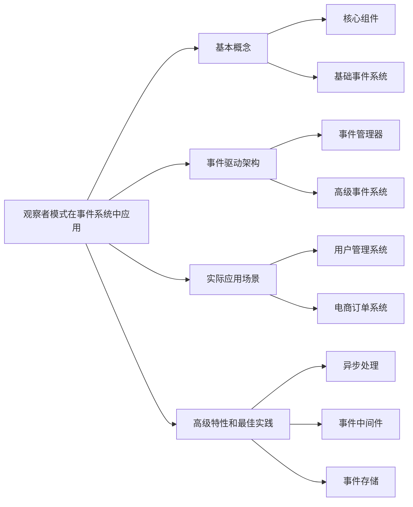

# 观察者模式在事件系统中如何应用？

## 概要回答

观察者模式在事件系统中用于实现发布-订阅机制，允许对象（发布者）在其状态改变时通知其他对象（订阅者）。这种模式解耦了发布者和订阅者，使它们可以独立变化。在PHP事件系统中，观察者模式广泛应用于用户注册通知、订单状态变更、系统日志记录等场景，提供了灵活的事件处理机制。

## 深度解析

### 观察者模式基本概念

#### 1. 核心组件
```php
<?php
// 观察者接口
interface Observer {
    public function update($subject, $event = null, $data = null);
}

// 被观察者接口
interface Subject {
    public function attach(Observer $observer);
    public function detach(Observer $observer);
    public function notify($event = null, $data = null);
}

// 基础被观察者实现
class BaseSubject implements Subject {
    protected $observers = [];
    
    public function attach(Observer $observer) {
        $this->observers[] = $observer;
    }
    
    public function detach(Observer $observer) {
        $this->observers = array_filter($this->observers, function($obs) use ($observer) {
            return $obs !== $observer;
        });
    }
    
    public function notify($event = null, $data = null) {
        foreach ($this->observers as $observer) {
            $observer->update($this, $event, $data);
        }
    }
}

// 具体观察者实现
class EmailNotifier implements Observer {
    public function update($subject, $event = null, $data = null) {
        echo "Sending email notification for event: {$event}\n";
        // 发送邮件逻辑
    }
}

class SMSNotifier implements Observer {
    public function update($subject, $event = null, $data = null) {
        echo "Sending SMS notification for event: {$event}\n";
        // 发送短信逻辑
    }
}

class LogObserver implements Observer {
    public function update($subject, $event = null, $data = null) {
        echo "Logging event: {$event}\n";
        // 记录日志逻辑
    }
}
?>
```

#### 2. 基础事件系统
```php
<?php
// 简单的用户管理系统
class User extends BaseSubject {
    private $id;
    private $name;
    private $email;
    
    public function __construct($id, $name, $email) {
        $this->id = $id;
        $this->name = $name;
        $this->email = $email;
    }
    
    public function register() {
        echo "User {$this->name} registered\n";
        // 通知所有观察者
        $this->notify('user.registered', [
            'user_id' => $this->id,
            'name' => $this->name,
            'email' => $this->email
        ]);
    }
    
    public function login() {
        echo "User {$this->name} logged in\n";
        $this->notify('user.logged_in', [
            'user_id' => $this->id,
            'name' => $this->name
        ]);
    }
    
    public function updateProfile($newData) {
        echo "User {$this->name} profile updated\n";
        $this->name = $newData['name'] ?? $this->name;
        $this->email = $newData['email'] ?? $this->email;
        
        $this->notify('user.profile_updated', [
            'user_id' => $this->id,
            'old_data' => ['name' => $this->name, 'email' => $this->email],
            'new_data' => $newData
        ]);
    }
}

// 使用示例
$user = new User(1, 'John Doe', 'john@example.com');

// 添加观察者
$user->attach(new EmailNotifier());
$user->attach(new SMSNotifier());
$user->attach(new LogObserver());

// 触发事件
$user->register();
$user->login();
$user->updateProfile(['name' => 'John Smith']);
?>
```

### 事件驱动架构

#### 1. 事件管理器
```php
<?php
// 事件类
class Event {
    private $name;
    private $data;
    private $timestamp;
    private $stopped = false;
    
    public function __construct($name, $data = []) {
        $this->name = $name;
        $this->data = $data;
        $this->timestamp = microtime(true);
    }
    
    public function getName() {
        return $this->name;
    }
    
    public function getData() {
        return $this->data;
    }
    
    public function getTimestamp() {
        return $this->timestamp;
    }
    
    public function stopPropagation() {
        $this->stopped = true;
    }
    
    public function isPropagationStopped() {
        return $this->stopped;
    }
}

// 事件监听器接口
interface EventListener {
    public function handle(Event $event);
}

// 事件管理器
class EventManager {
    private $listeners = [];
    
    public function listen($eventName, EventListener $listener, $priority = 0) {
        if (!isset($this->listeners[$eventName])) {
            $this->listeners[$eventName] = [];
        }
        
        $this->listeners[$eventName][] = [
            'listener' => $listener,
            'priority' => $priority
        ];
        
        // 按优先级排序
        usort($this->listeners[$eventName], function($a, $b) {
            return $b['priority'] - $a['priority'];
        });
    }
    
    public function dispatch(Event $event) {
        $eventName = $event->getName();
        
        if (!isset($this->listeners[$eventName])) {
            return;
        }
        
        foreach ($this->listeners[$eventName] as $item) {
            if ($event->isPropagationStopped()) {
                break;
            }
            
            $item['listener']->handle($event);
        }
    }
    
    public function removeListener($eventName, EventListener $listener) {
        if (!isset($this->listeners[$eventName])) {
            return;
        }
        
        $this->listeners[$eventName] = array_filter($this->listeners[$eventName], function($item) use ($listener) {
            return $item['listener'] !== $listener;
        });
    }
}

// 具体事件监听器
class UserRegistrationListener implements EventListener {
    public function handle(Event $event) {
        $userData = $event->getData();
        echo "Sending welcome email to {$userData['email']}\n";
        // 发送欢迎邮件逻辑
    }
}

class UserAnalyticsListener implements EventListener {
    public function handle(Event $event) {
        $userData = $event->getData();
        echo "Tracking user registration for {$userData['name']}\n";
        // 用户行为跟踪逻辑
    }
}

class AdminNotificationListener implements EventListener {
    public function handle(Event $event) {
        $userData = $event->getData();
        echo "Notifying admin about new user: {$userData['name']}\n";
        // 通知管理员逻辑
    }
}
?>
```

#### 2. 高级事件系统
```php
<?php
// 事件订阅者接口
interface EventSubscriber {
    public static function getSubscribedEvents();
}

// 订单事件系统
class Order extends BaseSubject {
    private $id;
    private $status;
    private $items;
    private $total;
    
    public function __construct($id, $items) {
        $this->id = $id;
        $this->items = $items;
        $this->status = 'pending';
        $this->total = array_sum(array_column($items, 'price'));
    }
    
    public function processPayment() {
        // 模拟支付处理
        $paymentSuccess = rand(0, 1) === 1; // 50%成功率
        
        if ($paymentSuccess) {
            $this->status = 'paid';
            $this->notify('order.paid', [
                'order_id' => $this->id,
                'amount' => $this->total,
                'items' => $this->items
            ]);
        } else {
            $this->status = 'failed';
            $this->notify('order.payment_failed', [
                'order_id' => $this->id,
                'amount' => $this->total,
                'reason' => 'Payment gateway error'
            ]);
        }
        
        return $paymentSuccess;
    }
    
    public function ship() {
        if ($this->status !== 'paid') {
            throw new Exception('Order must be paid before shipping');
        }
        
        $this->status = 'shipped';
        $this->notify('order.shipped', [
            'order_id' => $this->id,
            'tracking_number' => 'TRK' . uniqid(),
            'estimated_delivery' => date('Y-m-d', strtotime('+3 days'))
        ]);
    }
    
    public function getStatus() {
        return $this->status;
    }
}

// 订单事件监听器
class OrderConfirmationListener implements EventListener {
    public function handle(Event $event) {
        if ($event->getName() === 'order.paid') {
            $data = $event->getData();
            echo "Sending order confirmation for order #{$data['order_id']}\n";
            // 发送订单确认邮件
        }
    }
}

class InventoryUpdateListener implements EventListener {
    public function handle(Event $event) {
        if ($event->getName() === 'order.paid') {
            $data = $event->getData();
            echo "Updating inventory for order #{$data['order_id']}\n";
            // 更新库存
        }
    }
}

class ShippingSchedulerListener implements EventListener {
    public function handle(Event $event) {
        if ($event->getName() === 'order.paid') {
            $data = $event->getData();
            echo "Scheduling shipment for order #{$data['order_id']}\n";
            // 安排发货
        }
    }
}

class OrderCancellationListener implements EventListener {
    public function handle(Event $event) {
        if ($event->getName() === 'order.payment_failed') {
            $data = $event->getData();
            echo "Handling failed payment for order #{$data['order_id']}\n";
            // 处理支付失败
        }
    }
}

// 事件订阅者实现
class OrderEventSubscriber implements EventSubscriber {
    public static function getSubscribedEvents() {
        return [
            'order.paid' => [
                ['sendConfirmation', 100],
                ['updateInventory', 50],
                ['scheduleShipping', 25]
            ],
            'order.payment_failed' => [
                ['handleFailure', 100]
            ],
            'order.shipped' => [
                ['sendShippingNotification', 100]
            ]
        ];
    }
    
    public function sendConfirmation(Event $event) {
        $data = $event->getData();
        echo "Sending confirmation email for order #{$data['order_id']}\n";
    }
    
    public function updateInventory(Event $event) {
        $data = $event->getData();
        echo "Updating inventory for order #{$data['order_id']}\n";
    }
    
    public function scheduleShipping(Event $event) {
        $data = $event->getData();
        echo "Scheduling shipping for order #{$data['order_id']}\n";
    }
    
    public function handleFailure(Event $event) {
        $data = $event->getData();
        echo "Handling payment failure for order #{$data['order_id']}\n";
    }
    
    public function sendShippingNotification(Event $event) {
        $data = $event->getData();
        echo "Sending shipping notification for order #{$data['order_id']}\n";
    }
}
?>
```

### 实际应用场景

#### 1. 用户管理系统
```php
<?php
// 用户事件系统
class UserManager {
    private $eventManager;
    
    public function __construct(EventManager $eventManager) {
        $this->eventManager = $eventManager;
    }
    
    public function registerUser($userData) {
        // 创建用户
        $user = $this->createUser($userData);
        
        // 触发用户注册事件
        $event = new Event('user.registered', [
            'user' => $user,
            'registration_data' => $userData
        ]);
        
        $this->eventManager->dispatch($event);
        
        return $user;
    }
    
    public function deleteUser($userId) {
        $user = $this->getUserById($userId);
        
        if ($user) {
            $this->performDelete($user);
            
            // 触发用户删除事件
            $event = new Event('user.deleted', [
                'user_id' => $userId,
                'user' => $user
            ]);
            
            $this->eventManager->dispatch($event);
        }
    }
    
    private function createUser($userData) {
        // 用户创建逻辑
        return [
            'id' => uniqid(),
            'name' => $userData['name'],
            'email' => $userData['email'],
            'created_at' => date('Y-m-d H:i:s')
        ];
    }
    
    private function getUserById($userId) {
        // 获取用户逻辑
        return ['id' => $userId, 'name' => 'John Doe'];
    }
    
    private function performDelete($user) {
        // 删除用户逻辑
        echo "Deleting user {$user['name']}\n";
    }
}

// 用户相关事件监听器
class WelcomeEmailListener implements EventListener {
    public function handle(Event $event) {
        if ($event->getName() === 'user.registered') {
            $data = $event->getData();
            $user = $data['user'];
            echo "Sending welcome email to {$user['email']}\n";
            // 发送欢迎邮件
        }
    }
}

class UserAnalyticsListener implements EventListener {
    public function handle(Event $event) {
        switch ($event->getName()) {
            case 'user.registered':
                $data = $event->getData();
                echo "Tracking new user registration: {$data['user']['id']}\n";
                break;
            case 'user.deleted':
                $data = $event->getData();
                echo "Tracking user deletion: {$data['user_id']}\n";
                break;
        }
    }
}

class AdminNotificationListener implements EventListener {
    public function handle(Event $event) {
        if ($event->getName() === 'user.registered') {
            $data = $event->getData();
            echo "Notifying admin of new user: {$data['user']['name']}\n";
            // 通知管理员
        }
    }
}

// 使用示例
$eventManager = new EventManager();
$userManager = new UserManager($eventManager);

// 注册监听器
$eventManager->listen('user.registered', new WelcomeEmailListener(), 100);
$eventManager->listen('user.registered', new UserAnalyticsListener(), 50);
$eventManager->listen('user.registered', new AdminNotificationListener(), 25);
$eventManager->listen('user.deleted', new UserAnalyticsListener(), 100);

// 注册用户
$userManager->registerUser([
    'name' => 'Jane Smith',
    'email' => 'jane@example.com'
]);

// 删除用户
$userManager->deleteUser('user123');
?>
```

#### 2. 电商订单系统
```php
<?php
// 电商事件系统
class ECommerceEventManager extends EventManager {
    private $subscribers = [];
    
    public function addSubscriber(EventSubscriber $subscriber) {
        $events = $subscriber::getSubscribedEvents();
        
        foreach ($events as $eventName => $handlers) {
            foreach ($handlers as $handler) {
                if (is_array($handler)) {
                    $method = $handler[0];
                    $priority = $handler[1] ?? 0;
                } else {
                    $method = $handler;
                    $priority = 0;
                }
                
                $this->listen($eventName, new class($subscriber, $method) implements EventListener {
                    private $subscriber;
                    private $method;
                    
                    public function __construct($subscriber, $method) {
                        $this->subscriber = $subscriber;
                        $this->method = $method;
                    }
                    
                    public function handle(Event $event) {
                        call_user_func([$this->subscriber, $this->method], $event);
                    }
                }, $priority);
            }
        }
        
        $this->subscribers[] = $subscriber;
    }
}

// 订单处理系统
class OrderProcessor {
    private $eventManager;
    
    public function __construct(ECommerceEventManager $eventManager) {
        $this->eventManager = $eventManager;
    }
    
    public function processOrder($orderData) {
        echo "Processing order...\n";
        
        // 创建订单
        $order = $this->createOrder($orderData);
        
        // 触发订单创建事件
        $this->eventManager->dispatch(new Event('order.created', [
            'order' => $order
        ]));
        
        // 处理支付
        if ($this->processPayment($order)) {
            // 触发支付成功事件
            $this->eventManager->dispatch(new Event('order.payment_success', [
                'order' => $order
            ]));
            
            // 准备发货
            $this->prepareShipment($order);
            
            // 触发发货准备事件
            $this->eventManager->dispatch(new Event('order.shipment_prepared', [
                'order' => $order
            ]));
        } else {
            // 触发支付失败事件
            $this->eventManager->dispatch(new Event('order.payment_failed', [
                'order' => $order
            ]));
        }
        
        return $order;
    }
    
    private function createOrder($orderData) {
        return [
            'id' => uniqid('order_'),
            'items' => $orderData['items'],
            'total' => array_sum(array_column($orderData['items'], 'price')),
            'customer' => $orderData['customer'],
            'status' => 'created'
        ];
    }
    
    private function processPayment($order) {
        echo "Processing payment for order {$order['id']}\n";
        // 模拟支付处理
        return rand(0, 10) > 1; // 90%成功率
    }
    
    private function prepareShipment($order) {
        echo "Preparing shipment for order {$order['id']}\n";
        // 准备发货逻辑
    }
}

// 电商事件订阅者
class ECommerceEventSubscriber implements EventSubscriber {
    public static function getSubscribedEvents() {
        return [
            'order.created' => ['handleOrderCreation', 100],
            'order.payment_success' => [
                ['sendOrderConfirmation', 100],
                ['updateInventory', 75],
                ['scheduleShipping', 50]
            ],
            'order.payment_failed' => ['handlePaymentFailure', 100],
            'order.shipment_prepared' => ['sendShippingNotification', 100]
        ];
    }
    
    public function handleOrderCreation(Event $event) {
        $data = $event->getData();
        $order = $data['order'];
        echo "[Order Created] Order {$order['id']} has been created\n";
    }
    
    public function sendOrderConfirmation(Event $event) {
        $data = $event->getData();
        $order = $data['order'];
        echo "[Email] Sending order confirmation for {$order['id']}\n";
        // 发送订单确认邮件
    }
    
    public function updateInventory(Event $event) {
        $data = $event->getData();
        $order = $data['order'];
        echo "[Inventory] Updating inventory for order {$order['id']}\n";
        // 更新库存
    }
    
    public function scheduleShipping(Event $event) {
        $data = $event->getData();
        $order = $data['order'];
        echo "[Shipping] Scheduling shipping for order {$order['id']}\n";
        // 安排发货
    }
    
    public function handlePaymentFailure(Event $event) {
        $data = $event->getData();
        $order = $data['order'];
        echo "[Alert] Payment failed for order {$order['id']}\n";
        // 处理支付失败
    }
    
    public function sendShippingNotification(Event $event) {
        $data = $event->getData();
        $order = $data['order'];
        echo "[Notification] Shipment prepared for order {$order['id']}\n";
        // 发送发货通知
    }
}

// 使用示例
$eventManager = new ECommerceEventManager();
$orderProcessor = new OrderProcessor($eventManager);

// 添加事件订阅者
$eventManager->addSubscriber(new ECommerceEventSubscriber());

// 处理订单
$orderData = [
    'items' => [
        ['name' => 'Product A', 'price' => 29.99],
        ['name' => 'Product B', 'price' => 19.99]
    ],
    'customer' => [
        'name' => 'John Doe',
        'email' => 'john@example.com'
    ]
];

$orderProcessor->processOrder($orderData);
?>
```

### 高级特性和最佳实践

#### 1. 异步事件处理
```php
<?php
// 异步事件处理器
class AsyncEventManager extends EventManager {
    private $queue;
    
    public function __construct($queue = null) {
        $this->queue = $queue ?: new SimpleQueue();
    }
    
    public function dispatchAsync(Event $event) {
        // 将事件放入队列异步处理
        $this->queue->enqueue(serialize($event));
        echo "Event {$event->getName()} queued for async processing\n";
    }
    
    public function processQueue() {
        while ($serializedEvent = $this->queue->dequeue()) {
            $event = unserialize($serializedEvent);
            $this->dispatch($event);
        }
    }
}

class SimpleQueue {
    private $items = [];
    
    public function enqueue($item) {
        $this->items[] = $item;
    }
    
    public function dequeue() {
        return array_shift($this->items);
    }
    
    public function isEmpty() {
        return empty($this->items);
    }
}

// 异步事件监听器
class AsyncEmailListener implements EventListener {
    public function handle(Event $event) {
        // 模拟耗时的邮件发送操作
        sleep(2);
        echo "[Async] Email sent for event: {$event->getName()}\n";
    }
}

class AsyncAnalyticsListener implements EventListener {
    public function handle(Event $event) {
        // 模拟耗时的数据分析操作
        sleep(1);
        echo "[Async] Analytics recorded for event: {$event->getName()}\n";
    }
}

// 使用示例
$asyncEventManager = new AsyncEventManager();
$asyncEventManager->listen('user.registered', new AsyncEmailListener());
$asyncEventManager->listen('user.registered', new AsyncAnalyticsListener());

// 异步触发事件
$event = new Event('user.registered', ['user_id' => 123]);
$asyncEventManager->dispatchAsync($event);

// 在适当的时候处理队列中的事件
// $asyncEventManager->processQueue();
?>
```

#### 2. 事件中间件
```php
<?php
// 事件中间件接口
interface EventMiddleware {
    public function handle(Event $event, callable $next);
}

// 事件分发器带中间件支持
class MiddlewareEventManager extends EventManager {
    private $middlewares = [];
    
    public function addMiddleware(EventMiddleware $middleware) {
        $this->middlewares[] = $middleware;
    }
    
    public function dispatch(Event $event) {
        $handler = $this->createEventHandler();
        $handler($event);
    }
    
    private function createEventHandler() {
        $handler = function(Event $event) {
            parent::dispatch($event);
        };
        
        // 从后往前包装中间件
        foreach (array_reverse($this->middlewares) as $middleware) {
            $next = $handler;
            $handler = function(Event $event) use ($middleware, $next) {
                $middleware->handle($event, $next);
            };
        }
        
        return $handler;
    }
}

// 具体中间件实现
class LoggingMiddleware implements EventMiddleware {
    public function handle(Event $event, callable $next) {
        echo "[LOG] Event {$event->getName()} started\n";
        $result = $next($event);
        echo "[LOG] Event {$event->getName()} completed\n";
        return $result;
    }
}

class TimingMiddleware implements EventMiddleware {
    public function handle(Event $event, callable $next) {
        $start = microtime(true);
        $result = $next($event);
        $duration = (microtime(true) - $start) * 1000;
        echo "[TIMING] Event {$event->getName()} took {$duration}ms\n";
        return $result;
    }
}

class SecurityMiddleware implements EventMiddleware {
    public function handle(Event $event, callable $next) {
        // 模拟安全检查
        if ($this->isSuspiciousEvent($event)) {
            echo "[SECURITY] Suspicious event detected: {$event->getName()}\n";
            // 可以选择阻止事件处理
            // return;
        }
        
        return $next($event);
    }
    
    private function isSuspiciousEvent(Event $event) {
        // 简单的安全检查逻辑
        return strpos($event->getName(), 'suspicious') !== false;
    }
}

// 使用示例
$middlewareEventManager = new MiddlewareEventManager();
$middlewareEventManager->addMiddleware(new LoggingMiddleware());
$middlewareEventManager->addMiddleware(new TimingMiddleware());
$middlewareEventManager->addMiddleware(new SecurityMiddleware());

$middlewareEventManager->listen('user.login', new class implements EventListener {
    public function handle(Event $event) {
        echo "Handling user login\n";
        sleep(1); // 模拟处理时间
    }
});

$event = new Event('user.login', ['user_id' => 456]);
$middlewareEventManager->dispatch($event);
?>
```

#### 3. 事件存储和回放
```php
<?php
// 事件存储接口
interface EventStore {
    public function store(Event $event);
    public function getEvents($since = null);
    public function replay(callable $handler);
}

// 内存事件存储实现
class InMemoryEventStore implements EventStore {
    private $events = [];
    
    public function store(Event $event) {
        $this->events[] = $event;
        echo "[STORE] Event {$event->getName()} stored\n";
    }
    
    public function getEvents($since = null) {
        if ($since === null) {
            return $this->events;
        }
        
        return array_filter($this->events, function($event) use ($since) {
            return $event->getTimestamp() >= $since;
        });
    }
    
    public function replay(callable $handler) {
        foreach ($this->events as $event) {
            $handler($event);
        }
    }
}

// 带存储功能的事件管理器
class StorableEventManager extends EventManager {
    private $eventStore;
    
    public function __construct(EventStore $eventStore) {
        $this->eventStore = $eventStore;
    }
    
    public function dispatch(Event $event) {
        // 存储事件
        $this->eventStore->store($event);
        
        // 正常分发事件
        parent::dispatch($event);
    }
    
    public function replayEvents() {
        echo "[REPLAY] Replaying all events:\n";
        $this->eventStore->replay(function(Event $event) {
            echo "Replaying: {$event->getName()}\n";
            parent::dispatch($event);
        });
    }
}

// 使用示例
$eventStore = new InMemoryEventStore();
$storableEventManager = new StorableEventManager($eventStore);

$storableEventManager->listen('user.action', new class implements EventListener {
    public function handle(Event $event) {
        echo "Handling user action: {$event->getData()['action']}\n";
    }
});

// 触发一些事件
$storableEventManager->dispatch(new Event('user.action', ['action' => 'login']));
$storableEventManager->dispatch(new Event('user.action', ['action' => 'view_product']));
$storableEventManager->dispatch(new Event('user.action', ['action' => 'add_to_cart']));

echo "\n--- Replaying Events ---\n";
$storableEventManager->replayEvents();
?>
```

## 图示说明



观察者模式在事件系统中的应用非常广泛，它提供了一种优雅的解耦方式，使得系统组件可以灵活地响应各种事件，同时保持良好的可扩展性和可维护性。