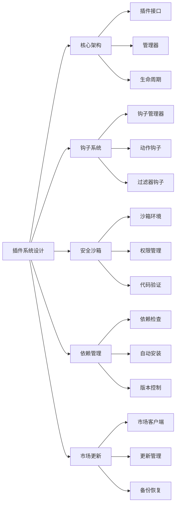

# 如何设计一个可扩展的插件系统？

## 概要回答

设计一个可扩展的插件系统需要考虑以下几个核心要素：清晰的接口定义、灵活的钩子机制、安全的沙箱环境、完善的生命周期管理、以及良好的文档和开发者体验。通过定义标准化的插件接口、提供丰富的事件钩子、实现插件隔离和依赖管理，可以构建一个既强大又安全的插件生态系统。

## 深度解析

### 插件系统核心架构

#### 1. 基础架构设计
```php
<?php
// 插件接口定义
interface PluginInterface {
    /**
     * 获取插件基本信息
     */
    public function getInfo(): array;
    
    /**
     * 插件初始化
     */
    public function boot(): void;
    
    /**
     * 插件激活
     */
    public function activate(): void;
    
    /**
     * 插件停用
     */
    public function deactivate(): void;
    
    /**
     * 插件卸载
     */
    public function uninstall(): void;
}

// 插件管理器
class PluginManager {
    private $plugins = [];
    private $activatedPlugins = [];
    private $pluginPaths = [];
    private $eventDispatcher;
    
    public function __construct(EventDispatcher $eventDispatcher) {
        $this->eventDispatcher = $eventDispatcher;
        $this->loadPlugins();
    }
    
    /**
     * 加载所有插件
     */
    private function loadPlugins() {
        $pluginDirs = glob(BASE_PATH . '/plugins/*', GLOB_ONLYDIR);
        
        foreach ($pluginDirs as $dir) {
            $pluginFile = $dir . '/Plugin.php';
            if (file_exists($pluginFile)) {
                require_once $pluginFile;
                $pluginClass = basename($dir) . '\\Plugin';
                
                if (class_exists($pluginClass)) {
                    $plugin = new $pluginClass($this->eventDispatcher);
                    $this->plugins[$plugin->getInfo()['name']] = $plugin;
                    $this->pluginPaths[$plugin->getInfo()['name']] = $dir;
                }
            }
        }
    }
    
    /**
     * 激活插件
     */
    public function activatePlugin(string $pluginName): bool {
        if (!isset($this->plugins[$pluginName])) {
            throw new Exception("Plugin {$pluginName} not found");
        }
        
        try {
            $plugin = $this->plugins[$pluginName];
            $plugin->activate();
            $plugin->boot();
            
            $this->activatedPlugins[$pluginName] = $plugin;
            
            // 触发插件激活事件
            $this->eventDispatcher->dispatch('plugin.activated', [
                'plugin' => $pluginName,
                'info' => $plugin->getInfo()
            ]);
            
            return true;
        } catch (Exception $e) {
            // 记录错误并回滚
            error_log("Failed to activate plugin {$pluginName}: " . $e->getMessage());
            return false;
        }
    }
    
    /**
     * 停用插件
     */
    public function deactivatePlugin(string $pluginName): bool {
        if (!isset($this->activatedPlugins[$pluginName])) {
            return false;
        }
        
        try {
            $plugin = $this->activatedPlugins[$pluginName];
            $plugin->deactivate();
            
            unset($this->activatedPlugins[$pluginName]);
            
            // 触发插件停用事件
            $this->eventDispatcher->dispatch('plugin.deactivated', [
                'plugin' => $pluginName
            ]);
            
            return true;
        } catch (Exception $e) {
            error_log("Failed to deactivate plugin {$pluginName}: " . $e->getMessage());
            return false;
        }
    }
    
    /**
     * 获取所有插件
     */
    public function getPlugins(): array {
        return $this->plugins;
    }
    
    /**
     * 获取已激活插件
     */
    public function getActivatedPlugins(): array {
        return $this->activatedPlugins;
    }
    
    /**
     * 检查插件是否激活
     */
    public function isPluginActive(string $pluginName): bool {
        return isset($this->activatedPlugins[$pluginName]);
    }
}

// 事件分发器
class EventDispatcher {
    private $listeners = [];
    
    /**
     * 添加事件监听器
     */
    public function listen(string $event, callable $callback, int $priority = 0) {
        if (!isset($this->listeners[$event])) {
            $this->listeners[$event] = [];
        }
        
        $this->listeners[$event][] = [
            'callback' => $callback,
            'priority' => $priority
        ];
        
        // 按优先级排序
        usort($this->listeners[$event], function($a, $b) {
            return $b['priority'] - $a['priority'];
        });
    }
    
    /**
     * 触发事件
     */
    public function dispatch(string $event, array $data = []) {
        if (!isset($this->listeners[$event])) {
            return;
        }
        
        foreach ($this->listeners[$event] as $listener) {
            call_user_func($listener['callback'], $data);
        }
    }
    
    /**
     * 移除事件监听器
     */
    public function removeListener(string $event, callable $callback) {
        if (!isset($this->listeners[$event])) {
            return;
        }
        
        $this->listeners[$event] = array_filter($this->listeners[$event], function($listener) use ($callback) {
            return $listener['callback'] !== $callback;
        });
    }
}
?>
```

#### 2. 插件基础类
```php
<?php
// 插件基础类
abstract class BasePlugin implements PluginInterface {
    protected $eventDispatcher;
    protected $config;
    protected $name;
    
    public function __construct(EventDispatcher $eventDispatcher) {
        $this->eventDispatcher = $eventDispatcher;
        $this->name = static::class;
        $this->loadConfig();
    }
    
    /**
     * 加载插件配置
     */
    protected function loadConfig() {
        $configFile = dirname(__DIR__) . '/config/plugin.php';
        if (file_exists($configFile)) {
            $this->config = require $configFile;
        } else {
            $this->config = [];
        }
    }
    
    /**
     * 获取配置值
     */
    protected function getConfig(string $key, $default = null) {
        return $this->config[$key] ?? $default;
    }
    
    /**
     * 设置配置值
     */
    protected function setConfig(string $key, $value) {
        $this->config[$key] = $value;
    }
    
    /**
     * 默认的插件信息
     */
    public function getInfo(): array {
        return [
            'name' => $this->name,
            'version' => '1.0.0',
            'author' => 'Unknown',
            'description' => 'A plugin for extending functionality'
        ];
    }
    
    /**
     * 默认初始化方法
     */
    public function boot(): void {
        // 插件启动时的初始化逻辑
    }
    
    /**
     * 默认激活方法
     */
    public function activate(): void {
        // 插件激活时的逻辑
    }
    
    /**
     * 默认停用方法
     */
    public function deactivate(): void {
        // 插件停用时的清理逻辑
    }
    
    /**
     * 默认卸载方法
     */
    public function uninstall(): void {
        // 插件卸载时的彻底清理逻辑
    }
    
    /**
     * 注册事件监听器
     */
    protected function listen(string $event, callable $callback, int $priority = 0) {
        $this->eventDispatcher->listen($event, $callback, $priority);
    }
    
    /**
     * 触发事件
     */
    protected function trigger(string $event, array $data = []) {
        $this->eventDispatcher->dispatch($event, $data);
    }
}

// 示例插件实现
namespace MyPlugin;

class Plugin extends BasePlugin {
    public function getInfo(): array {
        return [
            'name' => 'MyPlugin',
            'version' => '1.2.0',
            'author' => 'John Doe',
            'description' => 'A sample plugin demonstrating plugin system capabilities'
        ];
    }
    
    public function boot(): void {
        // 注册事件监听器
        $this->listen('app.startup', [$this, 'onAppStartup'], 100);
        $this->listen('user.login', [$this, 'onUserLogin'], 50);
        $this->listen('plugin.activated', [$this, 'onPluginActivated'], 75);
    }
    
    public function activate(): void {
        // 创建必要的数据库表
        $this->createTables();
        
        // 设置默认配置
        $this->setDefaultConfig();
        
        parent::activate();
    }
    
    public function deactivate(): void {
        // 清理临时数据
        $this->clearCache();
        
        parent::deactivate();
    }
    
    public function uninstall(): void {
        // 删除数据库表
        $this->dropTables();
        
        // 删除配置文件
        $this->removeConfig();
        
        parent::uninstall();
    }
    
    // 事件处理方法
    public function onAppStartup(array $data) {
        echo "MyPlugin: Application started\n";
        // 插件启动时的逻辑
    }
    
    public function onUserLogin(array $data) {
        echo "MyPlugin: User {$data['username']} logged in\n";
        // 用户登录时的逻辑
    }
    
    public function onPluginActivated(array $data) {
        if ($data['plugin'] !== 'MyPlugin') {
            echo "MyPlugin: Another plugin activated: {$data['plugin']}\n";
        }
    }
    
    // 私有辅助方法
    private function createTables() {
        // 创建插件所需的数据库表
        echo "MyPlugin: Creating database tables\n";
    }
    
    private function dropTables() {
        // 删除插件的数据库表
        echo "MyPlugin: Dropping database tables\n";
    }
    
    private function setDefaultConfig() {
        // 设置默认配置
        echo "MyPlugin: Setting default configuration\n";
    }
    
    private function clearCache() {
        // 清理缓存
        echo "MyPlugin: Clearing cache\n";
    }
    
    private function removeConfig() {
        // 删除配置
        echo "MyPlugin: Removing configuration\n";
    }
}
?>
```

### 钩子系统设计

#### 1. 钩子管理器
```php
<?php
// 钩子管理器
class HookManager {
    private $hooks = [];
    private $filters = [];
    
    /**
     * 添加动作钩子
     */
    public function addAction(string $hook, callable $callback, int $priority = 10) {
        if (!isset($this->hooks[$hook])) {
            $this->hooks[$hook] = [];
        }
        
        $this->hooks[$hook][] = [
            'callback' => $callback,
            'priority' => $priority
        ];
        
        usort($this->hooks[$hook], function($a, $b) {
            return $a['priority'] - $b['priority'];
        });
    }
    
    /**
     * 执行动作钩子
     */
    public function doAction(string $hook, ...$args) {
        if (!isset($this->hooks[$hook])) {
            return;
        }
        
        foreach ($this->hooks[$hook] as $hookData) {
            call_user_func_array($hookData['callback'], $args);
        }
    }
    
    /**
     * 添加过滤器钩子
     */
    public function addFilter(string $hook, callable $callback, int $priority = 10) {
        if (!isset($this->filters[$hook])) {
            $this->filters[$hook] = [];
        }
        
        $this->filters[$hook][] = [
            'callback' => $callback,
            'priority' => $priority
        ];
        
        usort($this->filters[$hook], function($a, $b) {
            return $a['priority'] - $b['priority'];
        });
    }
    
    /**
     * 应用过滤器钩子
     */
    public function applyFilters(string $hook, $value, ...$args) {
        if (!isset($this->filters[$hook])) {
            return $value;
        }
        
        $result = $value;
        foreach ($this->filters[$hook] as $filterData) {
            $result = call_user_func_array($filterData['callback'], array_merge([$result], $args));
        }
        
        return $result;
    }
    
    /**
     * 移除动作钩子
     */
    public function removeAction(string $hook, callable $callback) {
        if (!isset($this->hooks[$hook])) {
            return;
        }
        
        $this->hooks[$hook] = array_filter($this->hooks[$hook], function($hookData) use ($callback) {
            return $hookData['callback'] !== $callback;
        });
    }
    
    /**
     * 移除过滤器钩子
     */
    public function removeFilter(string $hook, callable $callback) {
        if (!isset($this->filters[$hook])) {
            return;
        }
        
        $this->filters[$hook] = array_filter($this->filters[$hook], function($filterData) use ($callback) {
            return $filterData['callback'] !== $callback;
        });
    }
}

// 全局钩子函数（类似WordPress风格）
class GlobalHooks {
    private static $hookManager;
    
    public static function init() {
        self::$hookManager = new HookManager();
    }
    
    public static function addAction(string $hook, callable $callback, int $priority = 10) {
        self::$hookManager->addAction($hook, $callback, $priority);
    }
    
    public static function doAction(string $hook, ...$args) {
        self::$hookManager->doAction($hook, ...$args);
    }
    
    public static function addFilter(string $hook, callable $callback, int $priority = 10) {
        self::$hookManager->addFilter($hook, $callback, $priority);
    }
    
    public static function applyFilters(string $hook, $value, ...$args) {
        return self::$hookManager->applyFilters($hook, $value, ...$args);
    }
}

// 初始化全局钩子
GlobalHooks::init();
?>
```

#### 2. 钩子使用示例
```php
<?php
// 应用核心类
class Application {
    private $hookManager;
    
    public function __construct() {
        $this->hookManager = new HookManager();
    }
    
    public function run() {
        // 应用启动钩子
        $this->hookManager->doAction('app_init');
        
        // 处理请求
        $request = $this->handleRequest();
        
        // 应用关闭钩子
        $this->hookManager->doAction('app_shutdown');
    }
    
    private function handleRequest() {
        // 请求处理逻辑
        $response = "Hello World";
        
        // 响应过滤钩子
        $response = $this->hookManager->applyFilters('app_response', $response);
        
        return $response;
    }
    
    public function getHookManager(): HookManager {
        return $this->hookManager;
    }
}

// 插件使用钩子示例
class SecurityPlugin extends BasePlugin {
    public function boot(): void {
        // 添加安全检查动作钩子
        $this->hookManager->addAction('app_init', [$this, 'checkSecurity'], 5);
        
        // 添加响应过滤钩子
        $this->hookManager->addFilter('app_response', [$this, 'secureResponse'], 100);
    }
    
    public function checkSecurity() {
        // 安全检查逻辑
        echo "SecurityPlugin: Performing security checks\n";
        
        // 检查是否需要SSL
        if (!$this->isSSLRequired()) {
            return;
        }
        
        if (!isset($_SERVER['HTTPS']) || $_SERVER['HTTPS'] !== 'on') {
            // 重定向到HTTPS
            $redirectURL = 'https://' . $_SERVER['HTTP_HOST'] . $_SERVER['REQUEST_URI'];
            header("Location: {$redirectURL}");
            exit;
        }
    }
    
    public function secureResponse($response) {
        // 添加安全头
        header('X-Content-Type-Options: nosniff');
        header('X-Frame-Options: DENY');
        header('X-XSS-Protection: 1; mode=block');
        
        return $response;
    }
    
    private function isSSLRequired(): bool {
        // 根据配置决定是否需要SSL
        return $this->getConfig('require_ssl', false);
    }
}

class LoggingPlugin extends BasePlugin {
    public function boot(): void {
        // 添加日志记录动作钩子
        $this->hookManager->addAction('app_init', [$this, 'logAppStart'], 1);
        $this->hookManager->addAction('app_shutdown', [$this, 'logAppEnd'], 1000);
    }
    
    public function logAppStart() {
        $this->log("Application started at " . date('Y-m-d H:i:s'));
    }
    
    public function logAppEnd() {
        $this->log("Application ended at " . date('Y-m-d H:i:s'));
    }
    
    private function log(string $message) {
        $logFile = $this->getConfig('log_file', BASE_PATH . '/logs/plugin.log');
        $timestamp = date('Y-m-d H:i:s');
        file_put_contents($logFile, "[{$timestamp}] {$message}\n", FILE_APPEND | LOCK_EX);
    }
}
?>
```

### 插件安全和沙箱

#### 1. 插件沙箱环境
```php
<?php
// 插件沙箱类
class PluginSandbox {
    private $pluginDir;
    private $allowedFunctions;
    private $restrictedClasses;
    
    public function __construct(string $pluginDir) {
        $this->pluginDir = $pluginDir;
        $this->setupRestrictions();
    }
    
    private function setupRestrictions() {
        // 允许的函数列表
        $this->allowedFunctions = [
            'strlen', 'strpos', 'str_replace', 'preg_match', 'json_encode', 'json_decode',
            'file_get_contents', 'file_put_contents', 'mkdir', 'unlink', 'copy', 'rename',
            'time', 'date', 'strtotime', 'uniqid', 'md5', 'sha1', 'base64_encode', 'base64_decode'
        ];
        
        // 限制的类列表
        $this->restrictedClasses = [
            'PDO', 'mysqli', 'ReflectionClass', 'ReflectionFunction'
        ];
    }
    
    /**
     * 在沙箱中执行插件代码
     */
    public function execute(callable $callback, array $params = []) {
        // 保存原始状态
        $originalGlobals = $GLOBALS;
        $originalServer = $_SERVER;
        
        try {
            // 设置沙箱环境
            $this->setupSandboxEnvironment();
            
            // 执行回调
            $result = call_user_func_array($callback, $params);
            
            return $result;
        } catch (Exception $e) {
            throw new Exception("Plugin execution failed: " . $e->getMessage());
        } finally {
            // 恢复原始状态
            $this->restoreEnvironment($originalGlobals, $originalServer);
        }
    }
    
    private function setupSandboxEnvironment() {
        // 限制文件系统访问
        chdir($this->pluginDir);
        
        // 设置安全相关的INI选项
        ini_set('open_basedir', $this->pluginDir);
        ini_set('allow_url_fopen', '0');
        ini_set('allow_url_include', '0');
    }
    
    private function restoreEnvironment($originalGlobals, $originalServer) {
        // 恢复全局变量
        $GLOBALS = $originalGlobals;
        $_SERVER = $originalServer;
        
        // 恢复工作目录
        chdir(BASE_PATH);
        
        // 恢复INI设置
        ini_restore('open_basedir');
        ini_restore('allow_url_fopen');
        ini_restore('allow_url_include');
    }
    
    /**
     * 验证插件代码安全性
     */
    public function validateCode(string $code): bool {
        // 检查危险函数调用
        $dangerousPatterns = [
            '/exec\s*\(/i',
            '/system\s*\(/i',
            '/passthru\s*\(/i',
            '/shell_exec\s*\(/i',
            '/eval\s*\(/i',
            '/assert\s*\(/i',
            '/file_get_contents\s*\(\s*[\'"](?!(http|https):)/i' // 限制本地文件读取
        ];
        
        foreach ($dangerousPatterns as $pattern) {
            if (preg_match($pattern, $code)) {
                return false;
            }
        }
        
        return true;
    }
}

// 安全插件加载器
class SecurePluginLoader {
    private $sandbox;
    private $pluginManager;
    
    public function __construct(PluginManager $pluginManager) {
        $this->pluginManager = $pluginManager;
    }
    
    public function loadPluginSecurely(string $pluginName) {
        $pluginPath = BASE_PATH . "/plugins/{$pluginName}";
        $this->sandbox = new PluginSandbox($pluginPath);
        
        // 验证插件代码
        if (!$this->validatePluginCode($pluginPath)) {
            throw new Exception("Plugin {$pluginName} failed security validation");
        }
        
        // 在沙箱中加载插件
        return $this->sandbox->execute(function() use ($pluginName, $pluginPath) {
            require_once $pluginPath . '/Plugin.php';
            $pluginClass = $pluginName . '\\Plugin';
            
            if (!class_exists($pluginClass)) {
                throw new Exception("Plugin class {$pluginClass} not found");
            }
            
            return new $pluginClass();
        });
    }
    
    private function validatePluginCode(string $pluginPath): bool {
        $files = glob($pluginPath . '/*.php');
        
        foreach ($files as $file) {
            $code = file_get_contents($file);
            if (!$this->sandbox->validateCode($code)) {
                error_log("Security violation in plugin file: {$file}");
                return false;
            }
        }
        
        return true;
    }
}
?>
```

#### 2. 插件权限管理
```php
<?php
// 插件权限系统
class PluginPermissionManager {
    private $permissions = [];
    private $pluginPermissions = [];
    
    public function __construct() {
        $this->loadPermissions();
    }
    
    private function loadPermissions() {
        // 定义系统权限
        $this->permissions = [
            'file_access' => 'Access to file system',
            'database_access' => 'Access to database',
            'network_access' => 'Access to external networks',
            'user_data_access' => 'Access to user data',
            'admin_panel_access' => 'Access to admin panel'
        ];
    }
    
    /**
     * 为插件分配权限
     */
    public function assignPermission(string $pluginName, string $permission) {
        if (!isset($this->permissions[$permission])) {
            throw new Exception("Permission {$permission} does not exist");
        }
        
        if (!isset($this->pluginPermissions[$pluginName])) {
            $this->pluginPermissions[$pluginName] = [];
        }
        
        $this->pluginPermissions[$pluginName][] = $permission;
    }
    
    /**
     * 检查插件是否具有权限
     */
    public function hasPermission(string $pluginName, string $permission): bool {
        if (!isset($this->pluginPermissions[$pluginName])) {
            return false;
        }
        
        return in_array($permission, $this->pluginPermissions[$pluginName]);
    }
    
    /**
     * 获取插件权限列表
     */
    public function getPluginPermissions(string $pluginName): array {
        return $this->pluginPermissions[$pluginName] ?? [];
    }
    
    /**
     * 获取所有权限
     */
    public function getAllPermissions(): array {
        return $this->permissions;
    }
}

// 权限感知的插件基类
class PermissionAwarePlugin extends BasePlugin {
    protected $permissionManager;
    
    public function __construct(EventDispatcher $eventDispatcher, PluginPermissionManager $permissionManager) {
        parent::__construct($eventDispatcher);
        $this->permissionManager = $permissionManager;
    }
    
    /**
     * 检查权限的辅助方法
     */
    protected function checkPermission(string $permission): bool {
        $pluginName = $this->getInfo()['name'];
        return $this->permissionManager->hasPermission($pluginName, $permission);
    }
    
    /**
     * 需要权限的操作示例
     */
    protected function readFile(string $filename) {
        if (!$this->checkPermission('file_access')) {
            throw new Exception("Plugin lacks file access permission");
        }
        
        return file_get_contents($filename);
    }
    
    protected function databaseQuery(string $sql) {
        if (!$this->checkPermission('database_access')) {
            throw new Exception("Plugin lacks database access permission");
        }
        
        // 执行数据库查询
        // return DB::query($sql);
    }
    
    protected function makeHttpRequest(string $url) {
        if (!$this->checkPermission('network_access')) {
            throw new Exception("Plugin lacks network access permission");
        }
        
        // 执行HTTP请求
        // return file_get_contents($url);
    }
}

// 权限管理插件示例
class PermissionManagerPlugin extends PermissionAwarePlugin {
    public function getInfo(): array {
        return [
            'name' => 'PermissionManager',
            'version' => '1.0.0',
            'author' => 'System',
            'description' => 'Manages plugin permissions and security'
        ];
    }
    
    public function boot(): void {
        // 注册权限管理相关的钩子
        $this->listen('plugin.activating', [$this, 'onPluginActivating'], 100);
        $this->listen('plugin.permission_check', [$this, 'onPermissionCheck'], 50);
    }
    
    public function onPluginActivating(array $data) {
        $pluginName = $data['plugin'];
        echo "PermissionManager: Checking permissions for {$pluginName}\n";
        
        // 可以在这里实现权限审批流程
        // 例如：记录待审批的权限请求，等待管理员批准
    }
    
    public function onPermissionCheck(array $data) {
        $pluginName = $data['plugin'];
        $permission = $data['permission'];
        
        if (!$this->permissionManager->hasPermission($pluginName, $permission)) {
            echo "PermissionManager: Permission {$permission} denied for {$pluginName}\n";
            // 可以记录违规尝试
        }
    }
}
?>
```

### 插件依赖管理

#### 1. 依赖管理系统
```php
<?php
// 插件依赖管理器
class PluginDependencyManager {
    private $pluginManager;
    private $dependencies = [];
    
    public function __construct(PluginManager $pluginManager) {
        $this->pluginManager = $pluginManager;
        $this->loadDependencies();
    }
    
    private function loadDependencies() {
        // 从插件配置文件加载依赖关系
        $pluginDirs = glob(BASE_PATH . '/plugins/*', GLOB_ONLYDIR);
        
        foreach ($pluginDirs as $dir) {
            $configFile = $dir . '/config.json';
            if (file_exists($configFile)) {
                $config = json_decode(file_get_contents($configFile), true);
                if (isset($config['dependencies'])) {
                    $pluginName = basename($dir);
                    $this->dependencies[$pluginName] = $config['dependencies'];
                }
            }
        }
    }
    
    /**
     * 检查依赖关系
     */
    public function checkDependencies(string $pluginName): array {
        if (!isset($this->dependencies[$pluginName])) {
            return ['valid' => true, 'missing' => []];
        }
        
        $missing = [];
        $dependencies = $this->dependencies[$pluginName];
        
        foreach ($dependencies as $depName => $versionConstraint) {
            if (!$this->pluginManager->isPluginActive($depName)) {
                $missing[] = $depName;
                continue;
            }
            
            $depPlugin = $this->pluginManager->getPlugins()[$depName];
            $depVersion = $depPlugin->getInfo()['version'];
            
            if (!$this->satisfiesVersion($depVersion, $versionConstraint)) {
                $missing[] = "{$depName} (requires {$versionConstraint}, found {$depVersion})";
            }
        }
        
        return [
            'valid' => empty($missing),
            'missing' => $missing
        ];
    }
    
    /**
     * 版本约束检查
     */
    private function satisfiesVersion(string $version, string $constraint): bool {
        // 简化的版本比较（实际应用中可能需要更复杂的逻辑）
        if ($constraint === '*') {
            return true;
        }
        
        // 支持 ^1.0.0, ~1.2.0, >=1.0.0 等格式
        if (strpos($constraint, '^') === 0) {
            $required = substr($constraint, 1);
            $requiredParts = explode('.', $required);
            $versionParts = explode('.', $version);
            
            // 主版本号必须匹配
            if ($versionParts[0] != $requiredParts[0]) {
                return false;
            }
            
            // 次版本号必须大于等于
            if (isset($versionParts[1]) && isset($requiredParts[1]) && 
                $versionParts[1] < $requiredParts[1]) {
                return false;
            }
            
            return true;
        }
        
        // 简单的等于比较
        return version_compare($version, $constraint, '>=');
    }
    
    /**
     * 自动安装依赖
     */
    public function installDependencies(string $pluginName): bool {
        if (!isset($this->dependencies[$pluginName])) {
            return true;
        }
        
        $dependencies = $this->dependencies[$pluginName];
        $installed = [];
        
        try {
            foreach ($dependencies as $depName => $versionConstraint) {
                if (!$this->pluginManager->isPluginActive($depName)) {
                    // 这里应该实现插件下载和安装逻辑
                    echo "Installing dependency: {$depName} {$versionConstraint}\n";
                    // $this->installPlugin($depName, $versionConstraint);
                    $installed[] = $depName;
                }
            }
            
            // 激活依赖插件
            foreach ($installed as $depName) {
                $this->pluginManager->activatePlugin($depName);
            }
            
            return true;
        } catch (Exception $e) {
            // 回滚已安装的依赖
            foreach ($installed as $depName) {
                $this->pluginManager->deactivatePlugin($depName);
                // $this->uninstallPlugin($depName);
            }
            
            throw $e;
        }
    }
    
    /**
     * 获取插件的依赖树
     */
    public function getDependencyTree(string $pluginName): array {
        if (!isset($this->dependencies[$pluginName])) {
            return [];
        }
        
        $tree = [];
        $dependencies = $this->dependencies[$pluginName];
        
        foreach ($dependencies as $depName => $versionConstraint) {
            $tree[$depName] = [
                'version' => $versionConstraint,
                'children' => $this->getDependencyTree($depName)
            ];
        }
        
        return $tree;
    }
}

// 插件配置文件示例 (plugins/MyPlugin/config.json)
/*
{
    "name": "MyPlugin",
    "version": "1.2.0",
    "dependencies": {
        "DatabasePlugin": "^1.0.0",
        "CachePlugin": "~2.1.0"
    },
    "permissions": [
        "file_access",
        "database_access"
    ]
}
*/
?>
```

#### 2. 插件市场和更新系统
```php
<?php
// 插件市场客户端
class PluginMarketplace {
    private $marketplaceUrl;
    private $apiKey;
    
    public function __construct(string $marketplaceUrl, string $apiKey = '') {
        $this->marketplaceUrl = rtrim($marketplaceUrl, '/');
        $this->apiKey = $apiKey;
    }
    
    /**
     * 搜索插件
     */
    public function searchPlugins(string $query = '', int $limit = 20, int $offset = 0): array {
        $params = [
            'query' => $query,
            'limit' => $limit,
            'offset' => $offset
        ];
        
        $response = $this->makeRequest('/api/plugins/search', $params);
        return json_decode($response, true);
    }
    
    /**
     * 获取插件详情
     */
    public function getPluginDetails(string $pluginName): array {
        $response = $this->makeRequest("/api/plugins/{$pluginName}");
        return json_decode($response, true);
    }
    
    /**
     * 下载插件
     */
    public function downloadPlugin(string $pluginName, string $version = 'latest'): string {
        $params = ['version' => $version];
        $response = $this->makeRequest("/api/plugins/{$pluginName}/download", $params);
        
        // 保存到临时文件
        $tempFile = tempnam(sys_get_temp_dir(), 'plugin_');
        file_put_contents($tempFile, $response);
        
        return $tempFile;
    }
    
    /**
     * 检查更新
     */
    public function checkForUpdates(string $pluginName, string $currentVersion): array {
        $params = [
            'current_version' => $currentVersion
        ];
        
        $response = $this->makeRequest("/api/plugins/{$pluginName}/updates", $params);
        return json_decode($response, true);
    }
    
    private function makeRequest(string $endpoint, array $params = []): string {
        $url = $this->marketplaceUrl . $endpoint;
        
        // 添加API密钥
        if ($this->apiKey) {
            $params['api_key'] = $this->apiKey;
        }
        
        // 构建查询字符串
        if (!empty($params)) {
            $url .= '?' . http_build_query($params);
        }
        
        // 发送请求（实际应用中可能需要使用cURL或Guzzle）
        $context = stream_context_create([
            'http' => [
                'method' => 'GET',
                'header' => 'User-Agent: PluginManager/1.0'
            ]
        ]);
        
        return file_get_contents($url, false, $context);
    }
}

// 插件更新管理器
class PluginUpdater {
    private $marketplace;
    private $pluginManager;
    
    public function __construct(PluginMarketplace $marketplace, PluginManager $pluginManager) {
        $this->marketplace = $marketplace;
        $this->pluginManager = $pluginManager;
    }
    
    /**
     * 检查所有插件的更新
     */
    public function checkAllUpdates(): array {
        $plugins = $this->pluginManager->getPlugins();
        $updates = [];
        
        foreach ($plugins as $plugin) {
            $info = $plugin->getInfo();
            $pluginName = $info['name'];
            $currentVersion = $info['version'];
            
            try {
                $updateInfo = $this->marketplace->checkForUpdates($pluginName, $currentVersion);
                if ($updateInfo['available']) {
                    $updates[$pluginName] = $updateInfo;
                }
            } catch (Exception $e) {
                error_log("Failed to check updates for {$pluginName}: " . $e->getMessage());
            }
        }
        
        return $updates;
    }
    
    /**
     * 更新插件
     */
    public function updatePlugin(string $pluginName): bool {
        $plugins = $this->pluginManager->getPlugins();
        if (!isset($plugins[$pluginName])) {
            throw new Exception("Plugin {$pluginName} not found");
        }
        
        $plugin = $plugins[$pluginName];
        $currentVersion = $plugin->getInfo()['version'];
        
        // 检查是否有更新
        $updateInfo = $this->marketplace->checkForUpdates($pluginName, $currentVersion);
        if (!$updateInfo['available']) {
            return false;
        }
        
        // 下载新版本
        $tempFile = $this->marketplace->downloadPlugin($pluginName, $updateInfo['version']);
        
        // 备份当前版本
        $this->backupPlugin($pluginName);
        
        try {
            // 解压并替换插件文件
            $this->extractPlugin($tempFile, $pluginName);
            
            // 重新加载插件
            $this->reloadPlugin($pluginName);
            
            // 清理临时文件
            unlink($tempFile);
            
            return true;
        } catch (Exception $e) {
            // 回滚到备份版本
            $this->restorePluginBackup($pluginName);
            throw $e;
        }
    }
    
    private function backupPlugin(string $pluginName) {
        $pluginDir = BASE_PATH . "/plugins/{$pluginName}";
        $backupDir = BASE_PATH . "/backups/plugins/{$pluginName}_" . date('YmdHis');
        
        // 创建备份目录
        mkdir(dirname($backupDir), 0755, true);
        
        // 复制插件文件
        $this->copyDirectory($pluginDir, $backupDir);
    }
    
    private function extractPlugin(string $archiveFile, string $pluginName) {
        $pluginDir = BASE_PATH . "/plugins/{$pluginName}";
        
        // 解压文件（这里简化处理，实际可能需要使用ZipArchive）
        // $zip = new ZipArchive();
        // $zip->extractTo($pluginDir, $archiveFile);
        // $zip->close();
        
        echo "Extracting plugin {$pluginName} from {$archiveFile}\n";
    }
    
    private function reloadPlugin(string $pluginName) {
        // 停用插件
        $this->pluginManager->deactivatePlugin($pluginName);
        
        // 重新加载插件
        // 这里需要重新扫描插件目录并重新加载插件类
        
        // 重新激活插件
        $this->pluginManager->activatePlugin($pluginName);
    }
    
    private function restorePluginBackup(string $pluginName) {
        $backupDirs = glob(BASE_PATH . "/backups/plugins/{$pluginName}_*");
        if (empty($backupDirs)) {
            throw new Exception("No backup found for plugin {$pluginName}");
        }
        
        // 获取最新的备份
        rsort($backupDirs);
        $latestBackup = $backupDirs[0];
        
        $pluginDir = BASE_PATH . "/plugins/{$pluginName}";
        
        // 删除当前插件目录
        $this->removeDirectory($pluginDir);
        
        // 恢复备份
        $this->copyDirectory($latestBackup, $pluginDir);
    }
    
    private function copyDirectory(string $source, string $destination) {
        if (!is_dir($destination)) {
            mkdir($destination, 0755, true);
        }
        
        $files = scandir($source);
        foreach ($files as $file) {
            if ($file === '.' || $file === '..') {
                continue;
            }
            
            $sourcePath = "{$source}/{$file}";
            $destPath = "{$destination}/{$file}";
            
            if (is_dir($sourcePath)) {
                $this->copyDirectory($sourcePath, $destPath);
            } else {
                copy($sourcePath, $destPath);
            }
        }
    }
    
    private function removeDirectory(string $directory) {
        $files = array_diff(scandir($directory), ['.', '..']);
        foreach ($files as $file) {
            $path = "{$directory}/{$file}";
            if (is_dir($path)) {
                $this->removeDirectory($path);
            } else {
                unlink($path);
            }
        }
        rmdir($directory);
    }
}
?>
```

## 图示说明



一个设计良好的插件系统应该具备清晰的架构、灵活的扩展机制、完善的安全保障和便捷的管理功能。通过上述设计，可以构建一个既强大又安全的插件生态系统，为应用程序提供丰富的扩展能力。